# 进程与线程基础：

## 介绍：

**进程：**

- 一个程序被运行，从磁盘加载这个程序的代码到内存，就开起了一个进程。
- 进程可以视为程序的一个实例，大部分程序可以同时运行多个实例进程（笔记本，记事本，图画，浏览器等），也有的程序只能启动一个实例进程（网易云音乐，360安全卫士等）。

**线程：**

- 一个进程内可以分为一到多个线程。
- 一个线程就是一个指令流，将指令流中的一条条指令以一定的顺序交给CPU执行。
- Java中线程是最小调度单元，进程作为资源分配的最小单位。在windows中进程是不活动的，知识作为线程的容器。

**对比：**

- 进程拥有共享的资源，如内存空间等，供其内部线程共享。
- 进程间通信较为复杂：同一台计算机的进程通信称为IPC。不同计算机之间的进程通信，需要通过网络，遵守共同的协议。
- 线程通信简单，因为共享进程内的内存，多个线程可以访问同一个共享变量。
- 线程更轻量，上下文切换成本要比进程上下文切换低。

## 并发与并行：

`假如CPU为单核，同一时间段应对多件事情叫并发。`同一时间段处理多件事情的能力。一个人做多件事。

`假如CPU为多核，多个核心同时执行任务，叫作并行。`同一时间同时做多件事情的能力。多个人做多件事。

## 线程：

### 同步异步：

- 同步：需要等待结果返回，才能继续运行。
- 异步：不需要等待结果返回，就能继续运行。

多线程可以让方法执行变为异步的，不会干巴巴等着，比如读取磁盘要花费5秒，如果没有线程调度机制，这5秒什么事情都做不了。视频文件要转换格式操作比较费时，可以开一个新线程处理视频转换，避免阻塞主线程。


### 创建线程

#### Thread

Thread 创建线程方式：创建线程类，匿名内部类方式

* **start() 方法底层其实是给 CPU 注册当前线程，并且触发 run() 方法执行**
* 线程的启动必须调用 start() 方法，如果线程直接调用 run() 方法，相当于变成了普通类的执行，此时主线程将只有执行该线程
* 建议线程先创建子线程，主线程的任务放在之后，否则主线程（main）永远是先执行完

Thread 构造器：

* `public Thread()`
* `public Thread(String name)`

```java
public class ThreadDemo {
    public static void main(String[] args) {
        Thread t = new MyThread();
        t.start();
       	for(int i = 0 ; i < 100 ; i++ ){
            System.out.println("main线程" + i)
        }
        // main线程输出放在上面 就变成有先后顺序了，因为是 main 线程驱动的子线程运行
    }
}
class MyThread extends Thread {
    @Override
    public void run() {
        for(int i = 0 ; i < 100 ; i++ ) {
            System.out.println("子线程输出："+i)
        }
    }
}
```

继承 Thread 类的优缺点：

* 优点：编码简单
* 缺点：线程类已经继承了 Thread 类无法继承其他类了，功能不能通过继承拓展（单继承的局限性）


***


#### Runnable

Runnable 创建线程方式：创建线程类，匿名内部类方式

Thread 的构造器：

* `public Thread(Runnable target)`
* `public Thread(Runnable target, String name)`

```java
public class ThreadDemo {
    public static void main(String[] args) {
        Runnable target = new MyRunnable();
        Thread t1 = new Thread(target,"1号线程");
		t1.start();
        Thread t2 = new Thread(target);//Thread-0
    }
}

public class MyRunnable implements Runnable{
    @Override
    public void run() {
        for(int i = 0 ; i < 10 ; i++ ){
            System.out.println(Thread.currentThread().getName() + "->" + i);
        }
    }
}
```

**Thread 类本身也是实现了 Runnable 接口**，Thread 类中持有 Runnable 的属性，执行线程 run 方法底层是调用 Runnable#run：

```java
public class Thread implements Runnable {
    private Runnable target;
    
    public void run() {
        if (target != null) {
          	// 底层调用的是 Runnable 的 run 方法
            target.run();
        }
    }
}
```

Runnable 方式的优缺点：

* 缺点：代码复杂一点。

* 优点：

  1. 线程任务类只是实现了 Runnable 接口，可以继续继承其他类，避免了单继承的局限性

  2. 同一个线程任务对象可以被包装成多个线程对象

  3. 适合多个多个线程去共享同一个资源

  4. 实现解耦操作，线程任务代码可以被多个线程共享，线程任务代码和线程独立

  5. 线程池可以放入实现 Runnable 或 Callable 线程任务对象

### 查看线程

Windows：

* 任务管理器可以查看进程和线程数，也可以用来杀死进程
* tasklist 查看进程
* taskkill 杀死进程

Linux：

* ps -ef 查看所有进程
* ps -fT -p <PID> 查看某个进程（PID）的所有线程
* kill 杀死进程
* top 按大写 H 切换是否显示线程
* top -H -p <PID> 查看某个进程（PID）的所有线程

Java：

* jps 命令查看所有 Java 进程
* jstack <PID> 查看某个 Java 进程（PID）的所有线程状态
* jconsole 来查看某个 Java 进程中线程的运行情况（图形界面）

### 常见方法：

#### Api：

| 方法                                        | 说明                                                         |
| ------------------------------------------- | ------------------------------------------------------------ |
| public void start()                         | 启动一个新线程，Java虚拟机调用此线程的 run 方法              |
| public void run()                           | 线程启动后调用该方法                                         |
| public void setName(String name)            | 给当前线程取名字                                             |
| public void getName()                       | 获取当前线程的名字 线程存在默认名称：子线程是 Thread-索引，主线程是 main |
| public static Thread currentThread()        | 获取当前线程对象，代码在哪个线程中执行                       |
| public static void sleep(long time)         | 让当前线程休眠多少毫秒再继续执行 **Thread.sleep(0)** : 让操作系统立刻重新进行一次 CPU 竞争 |
| public static native void yield()           | 提示线程调度器让出当前线程对 CPU 的使用                      |
| public final int getPriority()              | 返回此线程的优先级                                           |
| public final void setPriority(int priority) | 更改此线程的优先级，常用 1 5 10                              |
| public void interrupt()                     | 中断这个线程，异常处理机制                                   |
| public static boolean interrupted()         | 判断当前线程是否被打断，清除打断标记                         |
| public boolean isInterrupted()              | 判断当前线程是否被打断，不清除打断标记                       |
| public final void join()                    | 等待这个线程结束                                             |
| public final void join(long millis)         | 等待这个线程死亡 millis 毫秒，0 意味着永远等待               |
| public final native boolean isAlive()       | 线程是否存活（还没有运行完毕）                               |
| public final void setDaemon(boolean on)     | 将此线程标记为守护线程或用户线程                             |

1. **start&run：**

- 直接调用 run 是在主线程中执行了 run，没有启动新的线程
- 使用 start 是启动新的线程，通过新的线程间接执行 run 中的代码

2. **sleep：**

- 调用 sleep 会让当前线程从 *Running* 进入 *Timed Waiting* 状态（阻塞）
- 其它线程可以使用 interrupt 方法打断正在睡眠的线程，这时 sleep 方法会抛出 InterruptedException
- 睡眠结束后的线程未必会立刻得到执行
- 建议用 TimeUnit 的 sleep 代替 Thread 的 sleep 来获得更好的可读性

3. **yield：**

- 调用 yield 会让当前线程从 *Running* 进入 *Runnable* 就绪状态，然后调度执行其它线程
- 具体的实现依赖于操作系统的任务调度器（如果没有其他线程操作系统就会继续执行该线程）

4. **线程优先级**

- 线程优先级会提示（hint）调度器优先调度该线程，但它仅仅是一个提示，调度器可以忽略它
- 如果 cpu 比较忙，那么优先级高的线程会获得更多的时间片，但 cpu 闲时，优先级几乎没作用

#### Join：

- 用于等待其他线程的完成。可以异步执行同步等待，例如创建主线程中创建两个线程，线程1需要1s，线程2需要2s，主线程需要等待的总时间是2s：

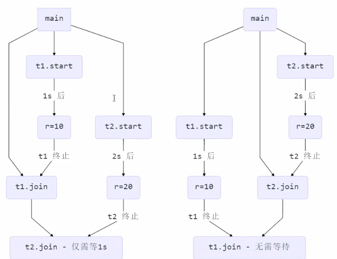

- 也可以用jion(long n),设置最大等待时间。

#### interrupt

- **打断** **sleep，wait，join** **的线程**，这几个方法都会让线程进入阻塞状态，打断阻塞状态的线程，状态为false，并且抛出异常，但不会退出线程。
- **打断正常运行的线程, 不会清空打断状态**，`状态为true，线程不会退出`，可以在线程中自行判断状态终止。
- **打断park线程：**如果打断标记是 true，则 park 会一直失效，可以使用 Thread.interrupted() 清除打断状态。

### 守护线程：

- 默认情况下，Java 进程需要等待所有线程都运行结束，才会结束。有一种特殊的线程叫做守护线程，只要其它非守护线程运行结束了，即使守护线程的代码没有执行完，也会强制结束。需要在start之前执行setDaemon(true)操作。

- 垃圾回收器线程就是一种守护线程。

- omcat 中的 Acceptor 和 Poller 线程都是守护线程，所以 Tomcat 接收到 shutdown 命令后，不会等

  待它们处理完当前请求。

### 线程状态：

#### 简介：

- NEW 线程刚被创建，但是还没有调用 start() 方法
- RUNNABLE 当调用了 start() 方法之后，注意，**Java API** 层面的 RUNNABLE 状态涵盖了 **操作系统** 层面的【可运行状态】、【运行状态】和【阻塞状态】（由于 BIO 导致的线程阻塞，在 Java 里无法区分，仍然认为是可运行）
- BLOCKED （锁）， WAITING（join） ， TIMED_WAITING （sleep）都是 **Java API** 层面对【阻塞状态】的细分，后面会在状态转换一节详述
- TERMINATED 当线程代码运行结束

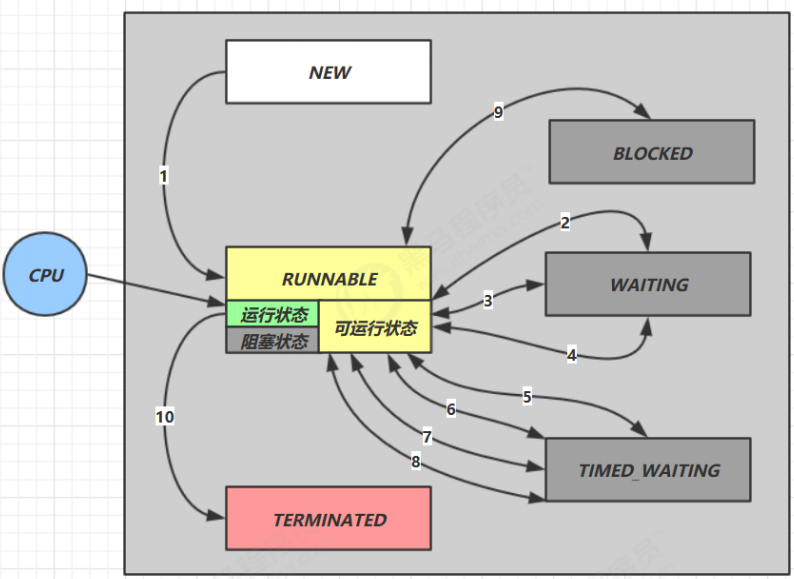

#### 线程状态转换：

1. **情况** **1** **NEW** **--**> **RUNNABLE**
   - 当调用 t.start() 方法时，由 NEW --> RUNNABLE

2. **情况** **2** **RUNNABLE <*--*> WAITING**

- **t** **线程**用 synchronized(obj) 获取了对象锁后
  - 调用 obj.wait() 方法时，**t** **线程**从 RUNNABLE --> WAITING
  - 调用 obj.notify() ， obj.notifyAll() ， t.interrupt() 时
    - 竞争锁成功，**t** **线程**从 WAITING --> RUNNABLE
    - 竞争锁失败，**t** **线程**从 WAITING --> BLOCKED

3. **情况** **3** **RUNNABLE <**--> **WAITING**

   - **当前线程**调用 t.join() 方法时，**当前线程**从 RUNNABLE --> WAITING
     - 注意是**当前线程**在**t** **线程对象**的监视器上等待

   - **t** **线程**运行结束，或调用了**当前线程**的 interrupt() 时，**当前线程**从 WAITING --> RUNNABLE

4. **情况** **4** **RUNNABLE <**--**> WAITING**

   - 当前线程调用 LockSupport.park() 方法会让当前线程从 RUNNABLE --> WAITING

   - 调用 LockSupport.unpark(目标线程) 或调用了线程 的 interrupt() ，会让目标线程从 WAITING --> RUNNABLE

5. **情况** **5** **RUNNABLE <**--> **TIMED_WAITING**

- **t** **线程**用 synchronized(obj) 获取了对象锁后
  - 调用 obj.wait(long n) 方法时，**t** **线程**从 RUNNABLE --> TIMED_WAITING
  - **t** **线程**等待时间超过了 n 毫秒，或调用 obj.notify() ， obj.notifyAll() ， t.interrupt() 时
    - 竞争锁成功，**t** **线程**从 TIMED_WAITING --> RUNNABLE
    - 竞争锁失败，**t** **线程**从 TIMED_WAITING --> BLOCKED

6. **情况** **6** **RUNNABLE <**--**> TIMED_WAITING**
   - **当前线程**调用 t.join(long n) 方法时，**当前线程**从 RUNNABLE --> TIMED_WAITING
     - 注意是**当前线程**在**t** **线程对象**的监视器上等待
   - **当前线程**等待时间超过了 n 毫秒，或**t** **线程**运行结束，或调用了**当前线程**的 interrupt() 时，**当前线程**从TIMED_WAITING --> RUNNABLE
7. **情况** **7** **RUNNABLE <**--**> TIMED_WAITING**
   - 当前线程调用 Thread.sleep(long n) ，当前线程从 RUNNABLE --> TIMED_WAITING
   - **当前线程**等待时间超过了 n 毫秒，**当前线程**从 TIMED_WAITING --> RUNNABLE
8. **情况** **8** **RUNNABLE <**--**> TIMED_WAITING**
   - 当前线程调用 LockSupport.parkNanos(long nanos) 或 LockSupport.parkUntil(long millis) 时，**当前线程**从 RUNNABLE --> TIMED_WAITING
   - 调用 LockSupport.unpark(目标线程) 或调用了线程 的 interrupt() ，或是等待超时，会让目标线程从TIMED_WAITING--> RUNNABLE

9. **情况** **9** **RUNNABLE <**--**> BLOCKED**
   - **t** **线程**用 synchronized(obj) 获取了对象锁时如果竞争失败，从 RUNNABLE --> BLOCKED
   - 持 obj 锁线程的同步代码块执行完毕，会唤醒该对象上所有 BLOCKED 的线程重新竞争，如果其中 **t** **线程**竞争成功，从 BLOCKED --> RUNNABLE ，其它失败的线程仍然 BLOCKED
10. **情况** **10** **RUNNABLE <--> TERMINATED**
    - 当前线程所有代码运行完毕，进入 TERMINATED

# 共享模型——管程

## 临界区&竞态条件：

- 一个程序运行多个线程本身是没有问题的，问题出在多个线程访问**共享资源**

  - 多个线程读**共享资源**其实也没有问题

  - 在多个线程对**共享资源**读写操作时发生指令交错，就会出现问题

- 一段代码块内如果存在对**共享资源**的多线程读写操作，称这段代码块为**临界区**

- 多个线程在临界区内执行，由于代码的**执行序列不同**而导致结果无法预测，称之为发生了**竞态条件**

## synchronized：

### 基本使用

- synchronized 实际是用**对象锁（必须锁同一个对象）**保证了**临界区内代码的原子性**，临界区内的代码对外是不可分割的，不会被线程切换所打断。

```java
synchronized(对象) // 线程1， 线程2(blocked)
{
    //临界区
}
```

### 加在方法上：

```java
class Test{
    public synchronized void test() {
    }
}
//等价于
class Test{
    public void test() {
        synchronized(this) {
        }
    }
}

class Test{
    public synchronized static void test() {
    }
}
//等价于
class Test{
    public static void test() {
        synchronized(Test.class) {//静态方法锁的是类对象，跟非静态方法锁的对象不一样
        }
    }
}
```

### **Monitor** （重量级锁）：

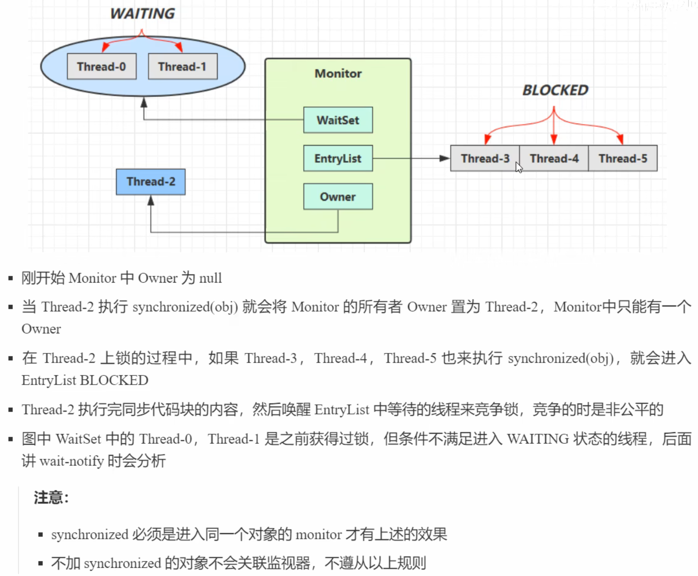

### 锁优化：

#### 轻量级锁：

- 轻量级锁的使用场景：如果一个对象虽然有多线程要加锁，但加锁的时间是错开的（也就是没有竞争），那么可以使用轻量级锁来优化。
- 轻量级锁对使用者是透明的，即语法仍然是 synchronized，假设有两个方法同步块，利用同一个对象加锁：

1. 创建锁记录（Lock Record）对象，每个线程都的栈帧都会包含一个锁记录的结构，内部可以存储锁定对象的Mark Word

2. 让锁记录中 Object reference 指向锁对象，并尝试用 cas 替换 Object 的 Mark Word，将 Mark Word 的值存

   入锁记录

3. 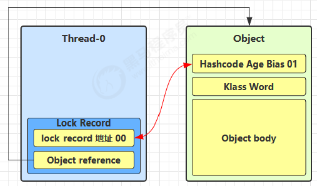

3. 如果 cas 替换成功，对象头中存储了锁记录地址和状态 00 ，表示由该线程给对象加锁
4. 如果 cas 失败，有两种情况
   - 如果是其它线程已经持有了该 Object 的轻量级锁，这时表明有竞争，进入锁膨胀过程
   - 如果是自己执行了 synchronized 锁重入，那么再添加一条 Lock Record 作为重入的计数

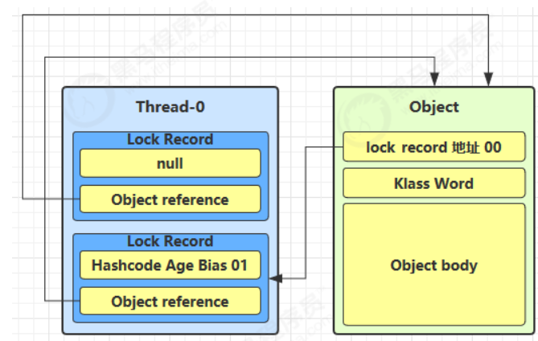

5. 当退出 synchronized 代码块（解锁时）如果有取值为 null 的锁记录，表示有重入，这时重置锁记录，表示重入计数减一
6. 当退出 synchronized 代码块（解锁时）锁记录的值不为 null，这时使用 cas 将 Mark Word 的值恢复给对象头
   - 成功，则解锁成功
   - 失败，说明轻量级锁进行了锁膨胀或已经升级为重量级锁，进入重量级锁解锁流程

#### 锁膨胀：

- 如果在尝试加轻量级锁的过程中，CAS 操作无法成功，这时一种情况就是有其它线程为此对象加上了轻量级锁（有竞争），这时需要进行锁膨胀，将轻量级锁变为重量级锁。

1. 当 Thread-1 进行轻量级加锁时，Thread-0 已经对该对象加了轻量级锁。

2. 这时 Thread-1 加轻量级锁失败，进入锁膨胀流程

   - 即为 Object 对象申请 Monitor 锁，让 Object 指向重量级锁地址

   - 然后自己进入 Monitor 的 EntryList BLOCKED

3. 当 Thread-0 退出同步块解锁时，使用 cas 将 Mark Word 的值恢复给对象头，失败。这时会进入重量级解锁流程，即按照 Monitor 地址找到 Monitor 对象，设置 Owner 为 null，唤醒 EntryList 中 BLOCKED 线程

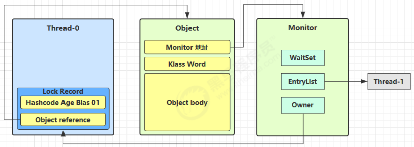

#### 自旋优化：

重量级锁竞争的时候，还可以使用自旋来进行优化，如果当前线程自旋成功（即这时候持锁线程已经退出了同步块，释放了锁），这时当前线程就可以避免阻塞。

- 自旋会占用 CPU 时间，单核 CPU 自旋就是浪费，多核 CPU 自旋才能发挥优势。
- 在 Java 6 之后自旋锁是自适应的，比如对象刚刚的一次自旋操作成功过，那么认为这次自旋成功的可能性会高，就多自旋几次；反之，就少自旋甚至不自旋，总之，比较智能。
- Java 7 之后不能控制是否开启自旋功能

#### 偏向锁：

- Java 6 中引入了偏向锁来做进一步优化：只有第一次使用 CAS 将线程 ID 设置到对象的 Mark Word 头，之后发现这个线程 ID 是自己的就表示没有竞争，不用重新 CAS。以后只要不发生竞争，这个对象就归该线程所有。

- **一个对象创建时：**
  - 如果开启了偏向锁（默认开启），那么对象创建后，markword 值为 0x05 即最后 3 位为 101，这时它的thread、epoch、age 都为 0
  - 偏向锁是默认是延迟的，不会在程序启动时立即生效，如果想避免延迟，可以加 VM 参数 -XX:BiasedLockingStartupDelay=0 来禁用延迟
  - 如果没有开启偏向锁，那么对象创建后，markword 值为 0x01 即最后 3 位为 001，这时它的 hashcode、age 都为 0，第一次用到 hashcode 时才会赋值

-  **禁用偏向锁：**在上面测试代码运行时在添加 VM 参数 -XX:-UseBiasedLocking
- 调用了对象的 hashCode，但偏向锁的对象 MarkWord 中存储的是线程 id，`如果调用 hashCode 会导致偏向锁被撤销，`因为MarkWord会用来保存对象hash码。
  - 轻量级锁会在锁记录中记录 hashCode
  - 重量级锁会在 Monitor 中记录 hashCode
- **当有其它线程使用偏向锁对象时**，会将偏向锁升级为轻量级锁。
- **调用** **wait/notify**也会将偏向锁升级，这两个方法只有重量级锁有。

- **批量重偏向：**如果对象虽然被多个线程访问，但没有竞争，这时偏向了线程 T1 的对象仍有机会重新偏向 T2，重偏向会重置对象的 Thread ID。当撤销偏向锁阈值超过 20 次后，jvm 会这样觉得，我是不是偏向错了呢，于是会在给这些对象加锁时重新偏向至加锁线程，这样就不会有锁撤销升级的过程，会提高效率。
- **批量撤销：**当撤销偏向锁阈值超过 40 次后，jvm 会这样觉得，自己确实偏向错了，根本就不该偏向。于是整个类的所有对象都会变为不可偏向的，新建的对象也是不可偏向的

#### 锁消除：

- JIT会将一些不可能产生线程安全问题的锁消除从而提升代码效率。


## 线程安全：

**我个人认为线程不安全有一个关键要素：**就是不同的线程可能访问的同一个变量那就可能不安全，如果始终是new的对象，就不可能线程不安全。当然如果使用线程安全类也不会造成安全问题。

### **成员变量和静态变量**

- 如果它们没有共享，则线程安全

- 如果它们被共享了，根据它们的状态是否能够改变，又分两种情况
  - 如果只有读操作，则线程安全
  - 如果有读写操作，则这段代码是临界区，需要考虑线程安全

### 局部变量：

- 局部变量是线程安全的
- 但局部变量引用的对象则未必
  - 如果该对象没有逃离方法的作用访问，它是线程安全的
  - 如果该对象逃离方法的作用范围，需要考虑线程安全

1. **情况1：**

   - 有其它线程调用 method2 和 method3

   - 在上面的基础上，为 ThreadSafe 类添加子类，子类覆盖 method2 或 method3 方法

### 线程安全类：

- String、Integer（等包装类）、StringBuffer、Random、Vector、、Hashtable、java.util.concurrent 包下的类。
- 这里说它们是线程安全的是指，多个线程调用它们同一个实例的某个方法时，是线程安全的。
  - 它们的每个方法是原子的
  - 但**注意**它们多个方法的组合不是原子的，见后面分析

- String、Integer 等都是不可变类，因为其内部的状态不可以改变，因此它们的方法都是线程安全的

## wait&notify：

### 简介：

- Owner 线程发现条件不满足，调用 wait 方法，即可进入 WaitSet 变为 WAITING 状态
- BLOCKED 和 WAITING 的线程都处于阻塞状态，不占用 CPU 时间片
- BLOCKED 线程会在 Owner 线程释放锁时唤醒
- WAITING 线程会在 Owner 线程调用 notify 或 notifyAll 时唤醒，但唤醒后并不意味者立刻获得锁，仍需进入EntryList 重新竞争

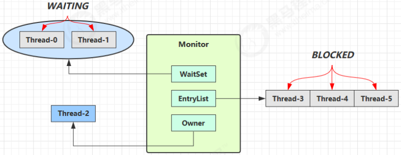

- **API** **介绍：**它们都是线程之间进行协作的手段，都属于 Object 对象的方法。必须获得此对象的锁，才能调用这几个方法
  1. obj.wait(long n) 让进入 object 监视器的线程到 waitSet 等待，n是最多等待时间，n=0表示一直等待唤醒。
  2. obj.notify() 在 object 上正在 waitSet 等待的线程中挑一个唤醒**（随机）**。
  3. obj.notifyAll() 让 object 上正在 waitSet 等待的线程全部唤醒

### sleep和wait：

1. sleep 是 Thread 方法，而 wait 是 Object 的方法 
2. sleep 不需要强制和 synchronized 配合使用，但 wait 需要和 synchronized 一起用 
3. sleep 在睡眠的同时，不会释放对象锁的，但 wait 在等待的时候会释放对象锁 
4. 它们状态都是 TIMED_WAITING

## park&unpark：

### 简介：

- 与 Object 的 wait & notify 相比
  - wait，notify 和 notifyAll 必须配合 Object Monitor 一起使用，而 park，unpark 不必
  - park & unpark 是以线程为单位来【阻塞】和【唤醒】线程，而 notify 只能随机唤醒一个等待线程，notifyAll 是唤醒所有等待线程，就不那么【精确】
  - park & unpark 可以先 unpark，而 wait & notify 不能先 notify

```java
// 暂停当前线程
LockSupport.park(); 
// 恢复某个线程的运行
LockSupport.unpark(暂停线程对象)
```

### 原理：

- 每个线程都有自己的一个 Parker 对象，由三部分组成 _counter ， _cond 和 _mutex。**总结就是每次park的时候会检查 _counter，如果 _counter为0线程进入阻塞状态，如果 _counter通过unpark置为1则不会进入阻塞状态。**

1. **情况1：**

   - 当前线程调用 Unsafe.park() 方法

   - 检查 _counter ，本情况为 0，这时，获得 _mutex 互斥锁

   - 线程进入 _cond 条件变量阻塞

   - 设置 _counter = 0

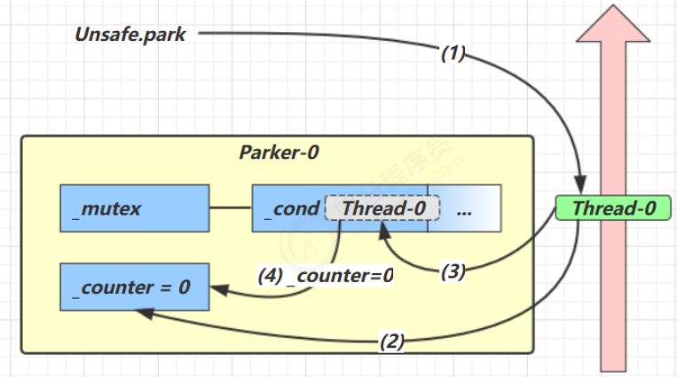

2. **情况2：**
   -  调用 Unsafe.unpark(Thread_0) 方法，设置 _counter 为 1
   - 唤醒 _cond 条件变量中的 Thread_0
   - Thread_0 恢复运行
   - 设置 _counter 为 0

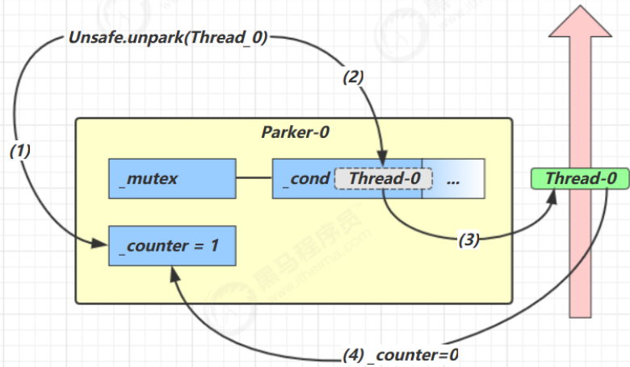

3. **情况3：**
   - 调用 Unsafe.unpark(Thread_0) 方法，设置 _counter 为 1
   - 当前线程调用 Unsafe.park() 方法
   - 检查 _counter ，本情况为 1，这时线程无需阻塞，继续运行
   - 设置 _counter 为 0

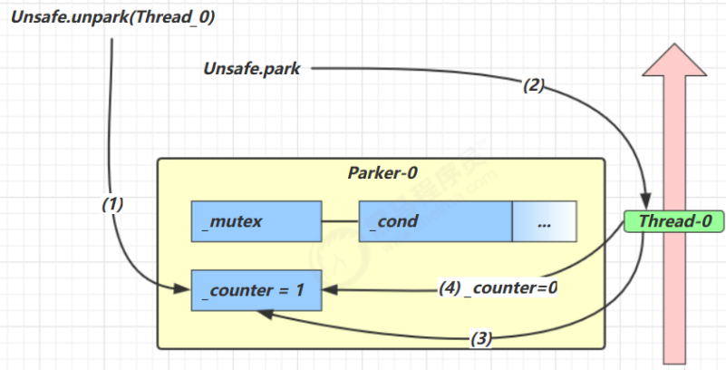

## 多把锁：

- 一间大屋子有两个功能：睡觉、学习，互不相干。现在小南要学习，小女要睡觉，但如果只用一间屋子（一个对象锁）的话，那么并发度很低。解决方法是准备多个房间（多个对象锁，在不相干的方法上用不同的锁）
- 将锁的粒度细分
  - 好处，是可以增强并发度
  - 坏处，如果一个线程需要同时获得多把锁，就容易发生死锁

## 活跃性：

### 死锁：

- 有这样的情况：一个线程需要同时获取多把锁，这时就容易发生死锁t1 线程 获得 A对象 锁，接下来想获取 B对象 的锁 t2 线程 获得 B对象 锁，接下来想获取 A对象 的锁

#### 定位死锁：

- 检测死锁可以使用 jconsole工具。或者使用 jps 定位进程 id，再用 jstack 定位死锁
- 避免死锁要注意加锁顺序
- 另外如果由于某个线程进入了死循环，导致其它线程一直等待，对于这种情况 linux 下可以通过 top 先定位到CPU 占用高的 Java 进程，再利用 top -Hp 进程id 来定位是哪个线程，最后再用 jstack 排查

### 哲学家就餐问题：

- 有五位哲学家，围坐在圆桌旁。他们只做两件事，思考和吃饭，思考一会吃口饭，吃完饭后接着思考。吃饭时要用两根筷子吃，桌上共有 5 根筷子，每位哲学家左右手边各有一根筷子。如果筷子被身边的人拿着，自己就得等待
- 这种线程没有按预期结束，执行不下去的情况，归类为【活跃性】问题，除了死锁以外，还有活锁和饥饿者两种情况

### 活锁：

- 活锁出现在两个线程互相改变对方的结束条件，最后谁也无法结束
- 例如一个线程++一个线程--。

### 饥饿：

- 很多教程中把饥饿定义为，一个线程由于优先级太低，始终得不到 CPU 调度执行，也不能够结束，饥饿的情况不易演示，讲读写锁时会涉及饥饿问题

## ReentrantLock：

### 简介：

- **我理解的是：**ReentrantLock相比与 synchronized 的核心区别是，ReentrantLock是一个对象(`相当于一把实际的锁`)，synchronized 需要依赖对象来上锁，然后他们的特性有些不同。

相对于 synchronized 它具备如下特点：

- **可中断**（可以被interrupt直接打断，而不是只改变打断状态）
- **可以设置超时时间**（可以用tryLock方法设置超时时间，在时间内成功获锁返回true）
- **可以设置为公平锁**（可以在构造ReentrantLock对象时传入true将他变为公平锁）
- **支持多个条件变量**（可以利用Condition Queue=lock.newCondition()设置多个条件，调用Queue.await()将线程加入该条件下的等待队列，`在synchronized中notify只能随机唤醒或者全部唤醒，而这个不同的等待队列可以实现特定唤醒`）

- 与 synchronized 一样，都支持可重入

```java
// 获取锁
reentrantLock.lock();
try {
    // 临界区
} finally {
    // 释放锁
    reentrantLock.unlock();
}
```

### 可重入：

- 可重入是指同一个线程如果首次获得了这把锁，那么因为它是这把锁的拥有者，因此有权利再次获取这把锁。如果是不可重入锁，那么第二次获得锁时，自己也会被锁挡住。

### 可打断：

- 在加锁时调用lock.lockInterruptibly();就可以在其他线程调用thread.interrupt打断锁。可以用来打断阻塞避免死锁。

- 在synchronized中调用interrupt只会把打断标记置为true，还是会阻塞。

### 锁超时：

- 使用lock.tryLock(n)来判断是否获取锁成功，还可以指定等待时间，在时间内获取锁则返回true。并且tryLock还可以被打断。

```java
ReentrantLock lock = new ReentrantLock();
Thread t1 = new Thread(() -> {
    log.debug("启动...");
    if (!lock.tryLock()) {
        log.debug("获取立刻失败，返回");
        return;
    }
    try {
        log.debug("获得了锁");
    } finally {
        lock.unlock();
    }
}, "t1");
```

### 公平锁：

- ReentrantLock 默认是不公平的，在构造函数中传入ReentrantLock lock = new ReentrantLock(true);才能创建公平锁，公平锁会按照锁排序的顺序获取锁，而不是随机。公平锁一般没有必要，会降低并发度。

### 条件变量：

- synchronized 中也有条件变量，就是我们讲原理时那个 waitSet 休息室，当条件不满足时进入 waitSet 等待ReentrantLock 的条件变量比 synchronized 强大之处在于，它是支持多个条件变量的，这就好比
  - synchronized 是那些不满足条件的线程都在一间休息室等消息
  - 而 ReentrantLock 支持多间休息室，有专门等烟的休息室、专门等早餐的休息室、唤醒时也是按休息室来唤醒

- 使用要点：

  1. await 前需要获得锁

  1. await 执行后，会释放锁，进入 conditionObject 等待

  1. await 的线程被唤醒（或打断、或超时）取重新竞争 lock 锁

  1. 竞争 lock 锁成功后，从 await 后继续执行

## 总结：

本章我们需要重点掌握的是：

- 分析多线程访问共享资源时，哪些代码片段属于临界区
- 使用 synchronized 互斥解决临界区的线程安全问题
  - 掌握 synchronized 锁对象语法
  - 掌握 synchronzied 加载成员方法和静态方法语法
  - 掌握 wait/notify 同步方法

- 使用 lock 互斥解决临界区的线程安全问题
  - 掌握 lock 的使用细节：可打断、锁超时、公平锁、条件变量

- 学会分析变量的线程安全性、掌握常见线程安全类的使用

- 了解线程活跃性问题：死锁、活锁、饥饿

- **应用方面：**
  - 互斥：使用 synchronized 或 Lock 达到共享资源互斥效果
  - 同步：使用 wait/notify 或 Lock 的条件变量来达到线程间通信效果

- **原理方面：**
  - monitor、synchronized 、wait/notify 原理
  - synchronized 进阶原理
  - park & unpark 原理

- **模式方面：**
  - 同步模式之保护性暂停
  - 异步模式之生产者消费者
  - 同步模式之顺序控制

# JMM内存模型：

## 可见性：

### 问题：

- 这种情况线程t是无法停止的。

```java
static boolean run = true;
public static void main(String[] args) throws InterruptedException {
    Thread t = new Thread(()->{
        while(run){
            // ....
        }
    });
    t.start();
    sleep(1);
    run = false; // 线程t不会如预想的停下来
}
```

1. 初始状态， t 线程刚开始从主内存读取了 run 的值到工作内存。
2. 因为 t 线程要频繁从主内存中读取 run 的值，JIT 编译器会将 run 的值缓存至自己工作内存中的高速缓存中，减少对主存中 run 的访问，提高效率。
3.  1 秒之后，main 线程修改了 run 的值，并同步至主存，而 t 是从自己工作内存中的高速缓存中读取这个变量的值，结果永远是旧值

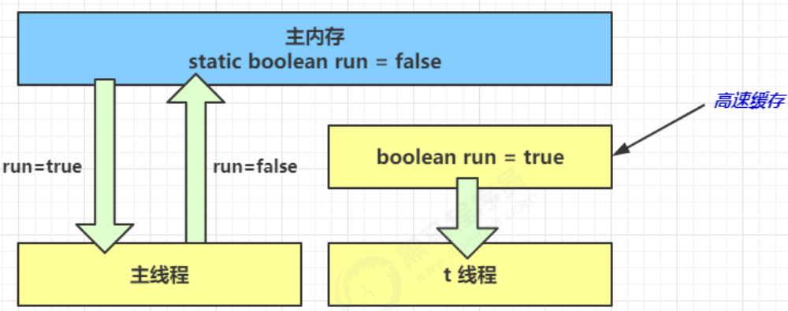

### 解决方案：

- **volatile（易变关键字）：**它可以用来修饰成员变量和静态成员变量，他可以避免线程从自己的工作缓存中查找变量的值，必须到主存中获取它的值，线程操作 volatile 变量都是直接操作主存。

- **也可以用synchronized：**在Java内存模型中，synchronized规定，线程在加锁时， 先清空工作内存→在主内存中拷贝最新变量的副本到工作内存 →执行完代码→将更改后的共享变量的值刷新到主内存中→释放互斥锁。
- System.out.println()底层使用了synchronized()同步代码块，如果在前面示例的死循环中加入 System.out.println() 会发现即使不加 volatile 修饰符，线程 t 也能正确看到对 run 变量的修改了。

### 无原子性：

- 前面例子体现的实际就是可见性，它保证的是在多个线程之间，一个线程对 volatile 变量的修改对另一个线程可见，` 不能保证原子性，仅用在一个写线程，多个读线程的情况`。比较一下之前我们将线程安全时举的例子：两个线程一个 i++ 一个 i-- ，只能保证看到最新值，不能解决指令交错。

- **注意** synchronized 语句块既可以保证代码块的原子性，也同时保证代码块内变量的可见性。但缺点是synchronized 是属于重量级操作，性能相对更低。

## 有序性：

### 简介：

- JVM 会在不影响正确性的前提下，可以调整语句的执行顺序。

### 漏洞：

- 这段代码有三种运行结果，前两种是1，4这很好理解，最后一种是0，是因为JIT重排后先执行了ready=true导致的。

```java
int num = 0;
boolean ready = false;
// 线程1 执行此方法
public void actor1(I_Result r) {
    if(ready) {
        r.r1 = num + num;
    } else {
        r.r1 = 1;
    }
}
// 线程2 执行此方法
public void actor2(I_Result r) { 
    num = 2;
    ready = true; 
}
```

- **解决方案：**volatile 修饰的变量，可以禁用指令重排，使用volatile修饰最后赋值的变量可以强制前面的变量不重排序。

## happens-before：

happens-before 规定了对共享变量的写操作对其它线程的读操作可见，它是可见性与有序性的一套规则总结，抛开以下 happens-before 规则，JMM 并不能保证一个线程对共享变量的写，对于其它线程对该共享变量的读可见

1. 线程解锁 m 之前对变量的写，对于接下来对 m 加锁的其它线程对该变量的读可见
2. 线程对 volatile 变量的写，对接下来其它线程对该变量的读可见
3. 线程 start 前对变量的写，对该线程开始后对该变量的读可见
4. 线程结束前对变量的写，对其它线程得知它结束后的读可见（比如其它线程调用 t1.isAlive() 或 t1.join()等待它结束）
5. 线程 t1 打断 t2（interrupt）前对变量的写，对于其他线程得知 t2 被打断后对变量的读可见（通过t2.interrupted 或 t2.isInterrupted）
6. 具有传递性，如果 x hb-> y 并且 y hb-> z 那么有 x hb-> z ，配合 volatile 的防指令重排，有下面的例子：

```java
volatile static int x;
static int y;
new Thread(()->{ 
    y = 10;
    x = 20;
},"t1").start();
new Thread(()->{
    // x=20 对 t2 可见, 同时 y=10 也对 t2 可见
    System.out.println(x); 
},"t2").start();
```

# 无锁模式：

## **CAS**：

### CAS简介:

- 其中的关键是 compareAndSet，它的简称就是 CAS （也有 Compare And Swap 的说法），它必须是原子操作。

```java
while(true) {
    // 需要不断尝试，直到成功为止
    while (true) {
        // 比如拿到了旧值 1000
        int prev = balance.get();
        // 在这个基础上 1000-10 = 990
        int next = prev - amount;
        /*
 compareAndSet 正是做这个检查，在 set 前，先比较 prev 与当前值
 - 不一致了，next 作废，返回 false 表示失败
 比如，别的线程已经做了减法，当前值已经被减成了 990
 那么本线程的这次 990 就作废了，进入 while 下次循环重试
 - 一致，以 next 设置为新值，返回 true 表示成功
 */
        if (balance.compareAndSet(prev, next)) {
            break;
        }
    }
}
```

- 其实 CAS 的底层是 lock cmpxchg 指令（X86 架构），在单核 CPU 和多核 CPU 下都能够保证【比较-交换】的原子性。
- 在多核状态下，某个核执行到带 lock 的指令时，CPU 会让总线锁住，当这个核把此指令执行完毕，再开启总线。这个过程中不会被线程的调度机制所打断，保证了多个线程对内存操作的准确性，是原子的。

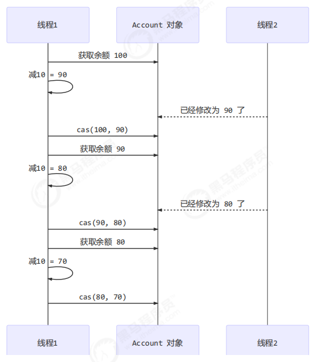

### volatile作用：

- CAS获取共享变量时，为了保证该变量的可见性，需要使用 volatile 修饰。

- 它可以用来修饰成员变量和静态成员变量，他可以避免线程从自己的工作缓存中查找变量的值，必须到主存中获取它的值，线程操作 volatile 变量都是直接操作主存。即一个线程对 volatile 变量的修改，对另一个线程可见。
- volatile 仅仅保证了共享变量的可见性，让其它线程能够看到最新值，但不能解决指令交错问题（不能保证原子性）
- CAS 必须借助 volatile 才能读取到共享变量的最新值来实现【比较并交换】的效果

### 为什么效率高：

- 无锁情况下，即使重试失败，线程始终在高速运行，没有停歇，而 synchronized 会让线程在没有获得锁的时候，发生上下文切换，进入阻塞。打个比喻
- 线程就好像高速跑道上的赛车，高速运行时，速度超快，一旦发生上下文切换，就好比赛车要减速、熄火，等被唤醒又得重新打火、启动、加速... 恢复到高速运行，代价比较大
- 但无锁情况下，因为线程要保持运行，需要额外 CPU 的支持，CPU 在这里就好比高速跑道，没有额外的跑道，线程想高速运行也无从谈起，虽然不会进入阻塞，但由于没有分到时间片，仍然会进入可运行状态，还是会导致上下文切换。

### CAS特点：

结合 CAS 和 volatile 可以实现无锁并发，适用于线程数少、多核 CPU 的场景下。

- CAS 是基于乐观锁的思想：最乐观的估计，不怕别的线程来修改共享变量，就算改了也没关系，我吃亏点再重试呗。
- synchronized 是基于悲观锁的思想：最悲观的估计，得防着其它线程来修改共享变量，我上了锁你们都别想改，我改完了解开锁，你们才有机会。
- CAS 体现的是无锁并发、无阻塞并发，请仔细体会这两句话的意思
  - 因为没有使用 synchronized，所以线程不会陷入阻塞，这是效率提升的因素之一
  - 但如果竞争激烈，可以想到重试必然频繁发生，反而效率会受影响

## 原子整数：

J.U.C 并发包提供了：

- AtomicBoolean
- AtomicInteger
- AtomicLong

```java
AtomicInteger i = new AtomicInteger(0);
// 获取并自增（i = 0, 结果 i = 1, 返回 0），类似于 i++
System.out.println(i.getAndIncrement());
// 自增并获取（i = 1, 结果 i = 2, 返回 2），类似于 ++i
System.out.println(i.incrementAndGet());
// 自减并获取（i = 2, 结果 i = 1, 返回 1），类似于 --i
System.out.println(i.decrementAndGet());
// 获取并自减（i = 1, 结果 i = 0, 返回 1），类似于 i--
System.out.println(i.getAndDecrement());
// 获取并加值（i = 0, 结果 i = 5, 返回 0）
System.out.println(i.getAndAdd(5));
// 加值并获取（i = 5, 结果 i = 0, 返回 0）
System.out.println(i.addAndGet(-5));
// 获取并更新（i = 0, p 为 i 的当前值, 结果 i = -2, 返回 0）
// 其中函数中的操作能保证原子，但函数需要无副作用
System.out.println(i.getAndUpdate(p -> p - 2));
// 更新并获取（i = -2, p 为 i 的当前值, 结果 i = 0, 返回 0）
// 其中函数中的操作能保证原子，但函数需要无副作用
System.out.println(i.updateAndGet(p -> p + 2));
// 获取并计算（i = 0, p 为 i 的当前值, x 为参数1, 结果 i = 10, 返回 0）
// 其中函数中的操作能保证原子，但函数需要无副作用
// getAndUpdate 如果在 lambda 中引用了外部的局部变量，要保证该局部变量是 final 的
// getAndAccumulate 可以通过 参数1 来引用外部的局部变量，但因为其不在 lambda 中因此不必是 final
System.out.println(i.getAndAccumulate(10, (p, x) -> p + x));
// 计算并获取（i = 10, p 为 i 的当前值, x 为参数1, 结果 i = 0, 返回 0）
// 其中函数中的操作能保证原子，但函数需要无副作用
System.out.println(i.accumulateAndGet(-10, (p, x) -> p + x));
```

## 原子引用

### 使用：

- AtomicReference
- AtomicMarkableReference
- AtomicStampedReference

```java
public interface DecimalAccount {
    // 获取余额
    BigDecimal getBalance();
    // 取款
    void withdraw(BigDecimal amount);
    /**
 * 方法内会启动 1000 个线程，每个线程做 -10 元 的操作
 * 如果初始余额为 10000 那么正确的结果应当是 0
 */
    static void demo(DecimalAccount account) {
        List<Thread> ts = new ArrayList<>();
        for (int i = 0; i < 1000; i++) {
            ts.add(new Thread(() -> {
                account.withdraw(BigDecimal.TEN);
            }));
        }
        ts.forEach(Thread::start);
        ts.forEach(t -> {
            try {
                t.join();
            } catch (InterruptedException e) {
                e.printStackTrace();
            }
        });
        System.out.println(account.getBalance());
    }
}
class DecimalAccountSafeCas implements DecimalAccount {
    AtomicReference<BigDecimal> ref;
    public DecimalAccountSafeCas(BigDecimal balance) {
        ref = new AtomicReference<>(balance);
    }
    @Override
    public BigDecimal getBalance() {
        return ref.get();
    }
    @Override
    public void withdraw(BigDecimal amount) {
        while (true) {
            BigDecimal prev = ref.get();
            BigDecimal next = prev.subtract(amount);
            if (ref.compareAndSet(prev, next)) {
                break;
            }
        }
    }
}
```

### ABA问题：

- 主线程仅能判断出共享变量的值与最初值 A 是否相同，不能感知到这种从 A 改为 B 又 改回 A 的情况，如果主线程希望：只要有其它线程【动过了】共享变量，那么自己的 cas 就算失败，这时，仅比较值是不够的，需要再加一个版本号。

### ABA解决：

- AtomicStampedReference 可以给原子引用加上版本号，追踪原子引用整个的变化过程，如： A -> B -> A ->C ，通过AtomicStampedReference，我们可以知道，引用变量中途被更改了几次。

```java
static AtomicStampedReference<String> ref = new AtomicStampedReference<>("A", 0);
public static void main(String[] args) throws InterruptedException {
    log.debug("main start...");
    // 获取值 A
    String prev = ref.getReference();
    // 获取版本号
    int stamp = ref.getStamp();
    log.debug("版本 {}", stamp);
    // 如果中间有其它线程干扰，发生了 ABA 现象
    other();
    sleep(1);
    // 尝试改为 C
    log.debug("change A->C {}", ref.compareAndSet(prev, "C", stamp, stamp + 1));
}
private static void other() {
    new Thread(() -> {
        log.debug("change A->B {}", ref.compareAndSet(ref.getReference(), "B", 
                                                      ref.getStamp(), ref.getStamp() + 1));
        log.debug("更新版本为 {}", ref.getStamp());
    }, "t1").start();
    sleep(0.5);
    new Thread(() -> {
        log.debug("change B->A {}", ref.compareAndSet(ref.getReference(), "A", 
                                                      ref.getStamp(), ref.getStamp() + 1));
        log.debug("更新版本为 {}", ref.getStamp());
    }, "t2").start();
}
```

- 但是有时候，并不关心引用变量更改了几次，只是单纯的关心**是否更改过**，所以就有了AtomicMarkableReference，他对保护的对象维护一个true和false的标记来判断是否被改过。

## 原子数组：

- AtomicIntegerArray
- AtomicLongArray
- AtomicReferenceArray

- 普通数组在多线程访问的时候容易造成安全性问题，使用原子数组可以解决。

## 原子字段更新器

- AtomicReferenceFieldUpdater // 域 字段
- AtomicIntegerFieldUpdater
- AtomicLongFieldUpdater
- 利用字段更新器，可以针对对象的某个域（Field）进行原子操作，只能配合 volatile 修饰的字段使用，否则会出现异常

```java
public class Test5 {
    private volatile int field;
    public static void main(String[] args) {
        AtomicIntegerFieldUpdater fieldUpdater =AtomicIntegerFieldUpdater.newUpdater(Test5.class, "field");
        Test5 test5 = new Test5();
        fieldUpdater.compareAndSet(test5, 0, 10);
        // 修改成功 field = 10
        System.out.println(test5.field);
        // 修改成功 field = 20
        fieldUpdater.compareAndSet(test5, 10, 20);
        System.out.println(test5.field);
        // 修改失败 field = 20
        fieldUpdater.compareAndSet(test5, 10, 30);
        System.out.println(test5.field);
    }
}
```

## 原子累加器：

### LongAdder简介：

- 比较 AtomicLong 与 LongAdder，在循环次数较多的情况下 LongAdder的效率会高很多。

- 性能提升的原因很简单，就是在有竞争时，设置多个累加单元，Therad-0 累加 Cell[0]，而 Thread-1 累加Cell[1]... 最后将结果汇总。这样它们在累加时操作的不同的 Cell 变量，因此减少了 CAS 重试失败，从而提高性能。

### 原理：

#### 简介：

LongAdder 类有几个关键域：

```java
// 累加单元数组, 懒惰初始化
transient volatile Cell[] cells;
// 基础值, 如果没有竞争, 则用 cas 累加这个域
transient volatile long base;
// 在 cells 创建或扩容时, 置为 1, 表示加锁
transient volatile int cellsBusy;
```

#### cas实现锁：

- 利用cas操作的原子性，控制上锁和解锁，cellsBusy就是这样实现的：

```java
// 不要用于实践！！！
public class LockCas {
    private AtomicInteger state = new AtomicInteger(0);
    public void lock() {
        while (true) {
            if (state.compareAndSet(0, 1)) {
                break;
            }
        }
    }
    public void unlock() {
        log.debug("unlock...");
        state.set(0);
    }
}
```

#### 防止伪共享

```java
// 防止缓存行伪共享
@sun.misc.Contended
    static final class Cell {
        volatile long value;
        Cell(long x) { value = x; }

        // 最重要的方法, 用来 cas 方式进行累加, prev 表示旧值, next 表示新值
        final boolean cas(long prev, long next) {
            return UNSAFE.compareAndSwapLong(this, valueOffset, prev, next);
        }
        // 省略不重要代码
    }
```

- CPU 要保证数据的一致性，如果某个 CPU 核心更改了数据，其它 CPU 核心对应的整个缓存行必须失效。如果cell1和cell2都在同一个缓存行中，一个改了两个都会失效重新去内存读。
- @sun.misc.Contended 用来解决这个问题，它的原理是在使用此注解的对象或字段的前后各增加 128 字节大小的padding，从而让 CPU 将对象预读至缓存时占用不同的缓存行，这样，不会造成对方缓存行的失效。

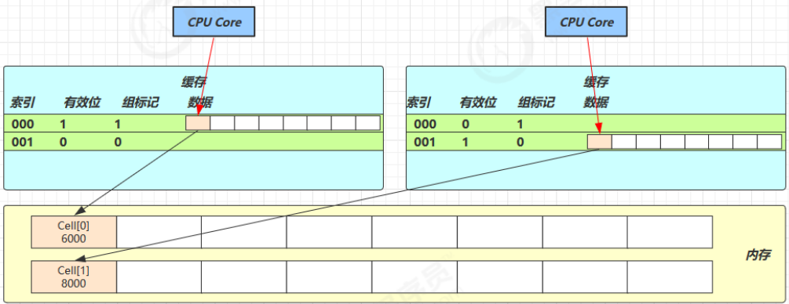

#### 累加流程：

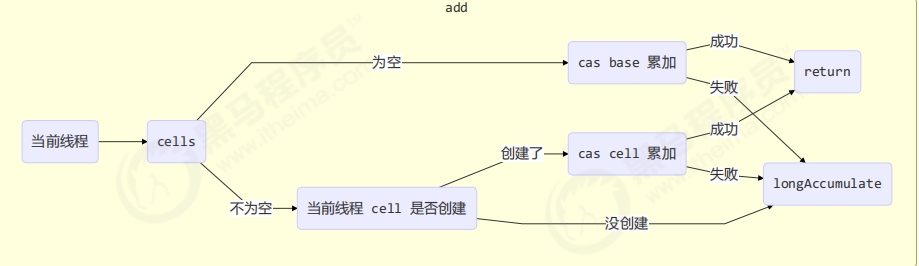

#### longAccumulate：

1. **情况1：**

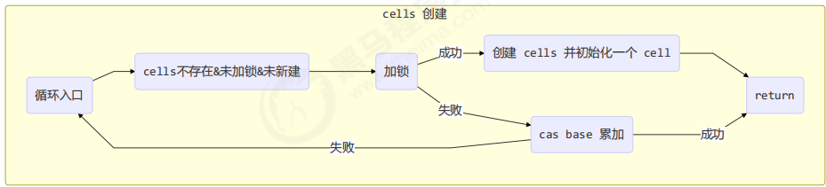

2. **情况2：**

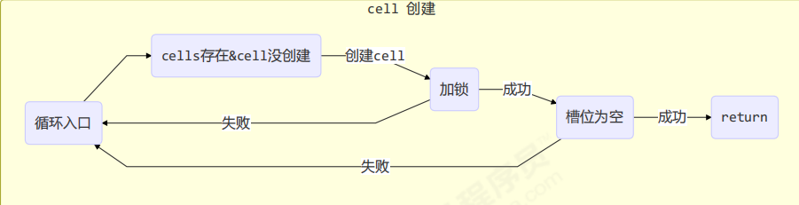

3. **情况3：**

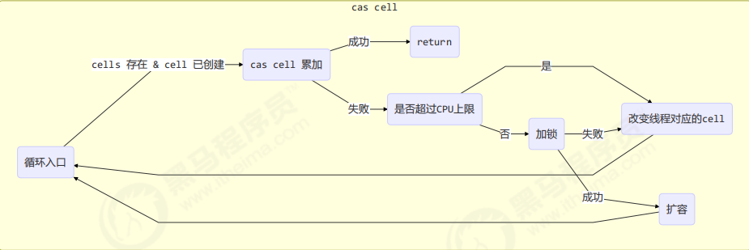

#### sum方法：

- 获取最终结果通过 sum 方法：

```java
public long sum() {
    Cell[] as = cells; Cell a;
    long sum = base;
    if (as != null) {
        for (int i = 0; i < as.length; ++i) {
            if ((a = as[i]) != null)
                sum += a.value;
        }
    }
    return sum;
}
```

## unsafe方法：

### 简介：

- Unsafe 对象提供了非常底层的，操作内存、线程的方法，Unsafe 对象不能直接调用，只能通过反射获得。

```java
public class UnsafeAccessor {
    static Unsafe unsafe;
    static {
        try { 
            Field theUnsafe = Unsafe.class.getDeclaredField("theUnsafe");
            theUnsafe.setAccessible(true);
            unsafe = (Unsafe) theUnsafe.get(null);
        } catch (NoSuchFieldException | IllegalAccessException e) {
            throw new Error(e);
        }
    }
    static Unsafe getUnsafe() {
        return unsafe;
    }
}
```


### CAS方法：

```java
Unsafe unsafe = UnsafeAccessor.getUnsafe();
Field id = Student.class.getDeclaredField("id");
Field name = Student.class.getDeclaredField("name");
// 获得成员变量的偏移量
long idOffset = UnsafeAccessor.unsafe.objectFieldOffset(id);
long nameOffset = UnsafeAccessor.unsafe.objectFieldOffset(name);
Student student = new Student();
// 使用 cas 方法替换成员变量的值
UnsafeAccessor.unsafe.compareAndSwapInt(student, idOffset, 0, 20); // 返回 true
UnsafeAccessor.unsafe.compareAndSwapObject(student, nameOffset, null, "张三"); // 返回 true
System.out.println(student);
```

### 实现原子整数：

- 使用自定义的 AtomicData 实现之前线程安全的原子整数 Account 实现

```java
class AtomicData {
    private volatile int data;
    static final Unsafe unsafe;
    static final long DATA_OFFSET;
    static {
        unsafe = UnsafeAccessor.getUnsafe();
        try {
            // data 属性在 DataContainer 对象中的偏移量，用于 Unsafe 直接访问该属性
            DATA_OFFSET = unsafe.objectFieldOffset(AtomicData.class.getDeclaredField("data"));
        } catch (NoSuchFieldException e) {
            throw new Error(e);
        }
    }
    public AtomicData(int data) {
        this.data = data;
    }
    public void decrease(int amount) {
        int oldValue;
        while(true) {
            // 获取共享变量旧值，可以在这一行加入断点，修改 data 调试来加深理解
            oldValue = data;
            // cas 尝试修改 data 为 旧值 + amount，如果期间旧值被别的线程改了，返回 false
            if (unsafe.compareAndSwapInt(this, DATA_OFFSET, oldValue, oldValue - amount)) {
                return;
            }
        }
    }
    public int getData() {
        return data;
    }
}
```

## 总结：

- CAS 与 volatile

- API
  - 原子整数
  - 原子引用
  - 原子数组
  - 字段更新器
  - 原子累加器

- Unsafe

- 原理方面
  - LongAdder 源码
  - 伪共享

# 不可变：

## 不可变对象：

- 如果一个对象在不能够修改其内部状态（属性），那么它就是线程安全的，因为不存在并发修改啊！这样的对象在Java 中有很多，例如在 Java 8 后，提供了一个新的日期格式化类：

```java
DateTimeFormatter dtf = DateTimeFormatter.ofPattern("yyyy-MM-dd");
for (int i = 0; i < 10; i++) {
    new Thread(() -> {
        LocalDate date = dtf.parse("2018-10-01", LocalDate::from);
        log.debug("{}", date);
    }).start();
}
```

## 不可变设计：

- 另一个大家更为熟悉的 String 类也是不可变的，以它为例，说明一下不可变设计的要素

1. **final** **的使用**

- 发现该类、类中所有属性都是 final 的
- 属性用 final 修饰保证了该属性是只读的，不能修改
- 类用 final 修饰保证了该类中的方法不能被覆盖，防止子类无意间破坏不可变性

```java
public final class String
    implements java.io.Serializable, Comparable<String>, CharSequence {
    /** The value is used for character storage. */
    private final char value[];
    /** Cache the hash code for the string */
    private int hash; // Default to 0

}
```

2. **保护性拷贝**:

- 但有同学会说，使用字符串时，也有一些跟修改相关的方法啊，比如 substring 等，那么下面就看一看这些方法是如何实现的，发现其内部是调用 String 的构造方法创建了一个新字符串

```java
public String substring(int beginIndex) {
    if (beginIndex < 0) {
        throw new StringIndexOutOfBoundsException(beginIndex);
    }
    int subLen = value.length - beginIndex;
    if (subLen < 0) {
        throw new StringIndexOutOfBoundsException(subLen);
    }
    return (beginIndex == 0) ? this : new String(value, beginIndex, subLen);
}
//是否对 final char[] value 做出了修改？—— 没有，会生成新的 char[] value
public String(char value[], int offset, int count) {
    if (offset < 0) {
        throw new StringIndexOutOfBoundsException(offset);
    }
    if (count <= 0) {
        if (count < 0) {
            throw new StringIndexOutOfBoundsException(count);
        }
        if (offset <= value.length) {
            this.value = "".value;
            return;
        }
    }
    if (offset > value.length - count) {
        throw new StringIndexOutOfBoundsException(offset + count);
    }
    this.value = Arrays.copyOfRange(value, offset, offset+count);
}
```

- 观察String构造方法中是否对 final char[] value 做出了修改，结果发现也没有，构造新字符串对象时，会生成新的 char[] value，对内容进行复制 。这种通过创建副本对象来避免共享的手段称之为【保护性拷贝（defensive copy）】

## 享元模式：

### 简介：

- **`在之前所提到的不可变对象中，会频繁的创建对象，这会大量的消耗资源，因此产生了享元模式来利用资源共享。`**

- 在JDK中 Boolean，Byte，Short，Integer，Long，Character 等包装类提供了 valueOf 方法，例如 Long 的valueOf 会缓存 -128~127 之间的 Long 对象，在这个范围之间会重用对象，大于这个范围，才会新建 Long 对象。

- Byte, Short, Long 缓存的范围都是 -128~127
- Character 缓存的范围是 0~127
- Integer的默认范围是 -128~127
  - 最小值不能变
  - 但最大值可以通过调整虚拟机参数 
  - `-Djava.lang.Integer.IntegerCache.high` 来改变
- Boolean 缓存了 TRUE 和 FALSE

- String字符串、BigDecimal、BigInteger也是享元模式的体现，他们的单个操作都是安全的，但串行执行多个方法没有原子性，可以用原子引用。

### 自定义连接池：

- 例如：一个线上商城应用，QPS 达到数千，如果每次都重新创建和关闭数据库连接，性能会受到极大影响。 这时预先创建好一批连接，放入连接池。一次请求到达后，从连接池获取连接，使用完毕后再还回连接池，这样既节约了连接的创建和关闭时间，也实现了连接的重用，不至于让庞大的连接数压垮数据库。
- 以下实现没有考虑：
  - 连接的动态增长与收缩
  - 连接保活（可用性检测）
  - 等待超时处理
  - 分布式 hash
- 对于关系型数据库，有比较成熟的连接池实现，例如c3p0, druid等。对于更通用的对象池，可以考虑使用apache commons pool，例如redis连接池可以参考jedis中关于连接池的实现。

```java
class Pool {
    // 1. 连接池大小
    private final int poolSize;
    // 2. 连接对象数组
    private Connection[] connections;
    // 3. 连接状态数组 0 表示空闲， 1 表示繁忙
    private AtomicIntegerArray states;
    // 4. 构造方法初始化
    public Pool(int poolSize) {
        this.poolSize = poolSize;
        this.connections = new Connection[poolSize];
        this.states = new AtomicIntegerArray(new int[poolSize]);
        for (int i = 0; i < poolSize; i++) {
            connections[i] = new MockConnection("连接" + (i+1));
        }
    }
    // 5. 借连接
    public Connection borrow() {
        while(true) {
            for (int i = 0; i < poolSize; i++) {
                // 获取空闲连接
                if(states.get(i) == 0) {
                    if (states.compareAndSet(i, 0, 1)) {
                        log.debug("borrow {}", connections[i]);
                        return connections[i];
                    }
                }
            }
            // 如果没有空闲连接，当前线程进入等待
            synchronized (this) {
                try {
                    log.debug("wait...");
                    this.wait();
                } catch (InterruptedException e) {
                    e.printStackTrace();
                }
            }
        }
    }
    // 6. 归还连接
    public void free(Connection conn) {
        for (int i = 0; i < poolSize; i++) {
            if (connections[i] == conn) {
                states.set(i, 0);
                synchronized (this) {
                    log.debug("free {}", conn);
                    this.notifyAll();
                }
                break;
            }
        }
    }
}
class MockConnection implements Connection {
    // 实现略
}
```

## 无状态：

- 在 web 阶段学习时，设计 Servlet 时为了保证其线程安全，都会有这样的建议，不要为 Servlet 设置成员变量，这种没有任何成员变量的类是线程安全的，因为成员变量保存的数据也可以称为状态信息，因此没有成员变量就称之为【无状态】

# 线程池：

## 自定义线程池：

### 简介：

- 准备一个连接池，用户可以将runnable方法传入线程池，在线程池够的情况下直接执行，不够的情况下在阻塞队列中等待，用户还可以传入拒绝策略来控制如果队列满了执行的流程。

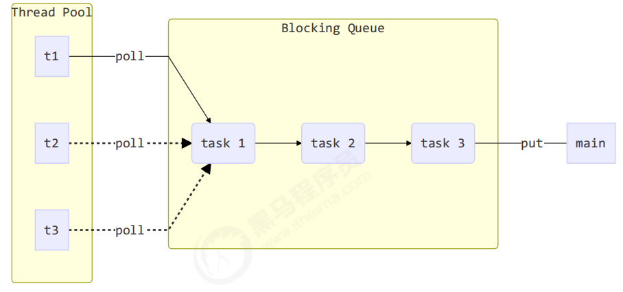

### 阻塞队列：

```java
class BlockingQueue<T> {
    // 1. 任务队列
    private Deque<T> queue = new ArrayDeque<>();
    // 2. 锁
    private ReentrantLock lock = new ReentrantLock();
    // 3. 生产者条件变量
    private Condition fullWaitSet = lock.newCondition();
    // 4. 消费者条件变量
    private Condition emptyWaitSet = lock.newCondition();
    // 5. 容量
    private int capcity;
    public BlockingQueue(int capcity) {
        this.capcity = capcity;
    }
    // 带超时阻塞获取
    public T poll(long timeout, TimeUnit unit) {
        lock.lock();
        try {
            // 将 timeout 统一转换为 纳秒
            long nanos = unit.toNanos(timeout);
            while (queue.isEmpty()) {
                try {
                    // 返回值是剩余时间
                    if (nanos <= 0) {
                        return null;
                    }
                    nanos = emptyWaitSet.awaitNanos(nanos);
                } catch (InterruptedException e) {
                    e.printStackTrace();
                }
            }
            T t = queue.removeFirst();
            fullWaitSet.signal();
            return t;
        } finally {
            lock.unlock();
        }
    }
    // 阻塞获取
    public T take() {
        lock.lock();
        try {
            while (queue.isEmpty()) {
                try {
                    emptyWaitSet.await();
                } catch (InterruptedException e) {
                    e.printStackTrace();
                }
            }
            T t = queue.removeFirst();
            fullWaitSet.signal();
            return t;
        } finally {
            lock.unlock();
        }
    }
    // 阻塞添加
    public void put(T task) {
        lock.lock();
        try {
            while (queue.size() == capcity) {
                try {
                    log.debug("等待加入任务队列 {} ...", task);
                    fullWaitSet.await();
                } catch (InterruptedException e) {
                    e.printStackTrace();
                }
            }
            log.debug("加入任务队列 {}", task);
            queue.addLast(task);
            emptyWaitSet.signal();
        } finally {
            lock.unlock();
        }
    }
    // 带超时时间阻塞添加
    public boolean offer(T task, long timeout, TimeUnit timeUnit) {
        lock.lock();
        try {
            long nanos = timeUnit.toNanos(timeout);
            while (queue.size() == capcity) {
                try {
                    if(nanos <= 0) {
                        return false;
                    }
                    log.debug("等待加入任务队列 {} ...", task);
                    nanos = fullWaitSet.awaitNanos(nanos);
                } catch (InterruptedException e) {
                    e.printStackTrace();
                }
            }
            log.debug("加入任务队列 {}", task);
            queue.addLast(task);
            emptyWaitSet.signal();
            return true;
        } finally {
            lock.unlock();
        }
    }
    //获取队列大小
    public int size() {
        lock.lock();
        try {
            return queue.size();
        } finally {
            lock.unlock();
        }
    }
    public void tryPut(RejectPolicy<T> rejectPolicy, T task) {
        lock.lock();
        try {
            // 判断队列是否满
            if(queue.size() == capcity) {
                rejectPolicy.reject(this, task);
            } else { // 有空闲
                log.debug("加入任务队列 {}", task);
                queue.addLast(task);
                emptyWaitSet.signal();
            }
        } finally {
            lock.unlock();
        }
    }
}
```

### 线程池：

```java
@FunctionalInterface // 拒绝策略
interface RejectPolicy<T> {
 void reject(BlockingQueue<T> queue, T task);
}

class ThreadPool {
    // 任务队列
    private BlockingQueue<Runnable> taskQueue;
    // 线程集合
    private HashSet<Worker> workers = new HashSet<>();
    // 核心线程数
    private int coreSize;
    // 获取任务时的超时时间
    private long timeout;
    private TimeUnit timeUnit;
    private RejectPolicy<Runnable> rejectPolicy;
    // 执行任务
    public void execute(Runnable task) {
        // 当任务数没有超过 coreSize 时，直接交给 worker 对象执行
        // 如果任务数超过 coreSize 时，加入任务队列暂存
        synchronized (workers) {
            if(workers.size() < coreSize) {
                Worker worker = new Worker(task);
                log.debug("新增 worker{}, {}", worker, task);
                workers.add(worker);
                worker.start();
            } else {
                // taskQueue.put(task);
                // 1) 死等
                // 2) 带超时等待
                // 3) 让调用者放弃任务执行
                // 4) 让调用者抛出异常
                // 5) 让调用者自己执行任务
                taskQueue.tryPut(rejectPolicy, task);
            }
        }
    }
    public ThreadPool(int coreSize, long timeout, TimeUnit timeUnit, int queueCapcity, 
                      RejectPolicy<Runnable> rejectPolicy) {
        this.coreSize = coreSize;
        this.timeout = timeout;
        this.timeUnit = timeUnit;
        this.taskQueue = new BlockingQueue<>(queueCapcity);
        this.rejectPolicy = rejectPolicy;
    }
    class Worker extends Thread{
        private Runnable task;
        public Worker(Runnable task) {
            this.task = task;
        }
        @Override
        public void run() {
            // 执行任务
            // 1) 当 task 不为空，执行任务
            // 2) 当 task 执行完毕，再接着从任务队列获取任务并执行
            // while(task != null || (task = taskQueue.take()) != null) {
            while(task != null || (task = taskQueue.poll(timeout, timeUnit)) != null) {
                try {
                    log.debug("正在执行...{}", task);
                    task.run();
                } catch (Exception e) {
                    e.printStackTrace();
                } finally {
                    task = null;
                }
            }
            synchronized (workers) {
                log.debug("worker 被移除{}", this);
                workers.remove(this);
            }
        }
    }
}
```

### 测试：

```java
public static void main(String[] args) {
    ThreadPool threadPool = new ThreadPool(1,1000, TimeUnit.MILLISECONDS, 1, (queue, task)->{
        // 1. 死等
        // queue.put(task);
        // 2) 带超时等待
        // queue.offer(task, 1500, TimeUnit.MILLISECONDS);
        // 3) 让调用者放弃任务执行
        // log.debug("放弃{}", task);
        // 4) 让调用者抛出异常
        // throw new RuntimeException("任务执行失败 " + task);
        // 5) 让调用者自己执行任务
        task.run();
    });
    for (int i = 0; i < 4; i++) {
        int j = i;
        threadPool.execute(() -> {
            try {
                Thread.sleep(1000L);
            } catch (InterruptedException e) {
                e.printStackTrace();
            }
            log.debug("{}", j);
        });
    }
}
```

## ThreadPoolExecutor（JDK线程池）：

### 简介：

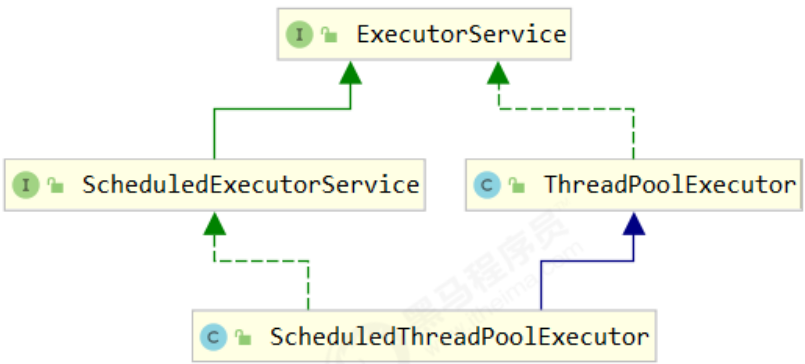

### 线程池状态

- ThreadPoolExecutor 使用 int 的高 3 位来表示线程池状态，低 29 位表示线程数量

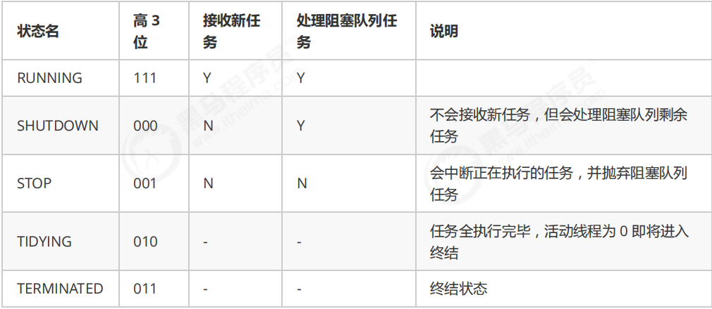

- 从数字上比较，TERMINATED > TIDYING > STOP > SHUTDOWN > RUNNING。
- 这些信息存储在一个原子变量 ctl 中，目的是将线程池状态与线程个数合二为一，这样就可以用一次 cas 原子操作进行赋值

```java
// c 为旧值， ctlOf 返回结果为新值
ctl.compareAndSet(c, ctlOf(targetState, workerCountOf(c))));
// rs 为高 3 位代表线程池状态， wc 为低 29 位代表线程个数，ctl 是合并它们
private static int ctlOf(int rs, int wc) { return rs | wc; }
```

### 构造方法：

- corePoolSize 核心线程数目 (最多保留的线程数)
- maximumPoolSize 最大线程数目
- keepAliveTime 生存时间 - 针对救急线程
- unit 时间单位 - 针对救急线程
- workQueue 阻塞队列
- threadFactory 线程工厂 - 可以为线程创建时起个好名字
- handler 拒绝策略

```java
public ThreadPoolExecutor(int corePoolSize,
                          int maximumPoolSize,
                          long keepAliveTime,
                          TimeUnit unit,
                          BlockingQueue<Runnable> workQueue,
                          ThreadFactory threadFactory,
                          RejectedExecutionHandler handler)
```

- 线程池中刚开始没有线程，当一个任务提交给线程池后，线程池会创建一个新线程来执行任务。
- 当线程数达到 corePoolSize 并没有线程空闲，这时再加入任务，新加的任务会被加入workQueue 队列排队，直到有空闲的线程。
- 如果队列选择了有界队列，那么任务超过了队列大小时，会创建 maximumPoolSize - corePoolSize 数目的线程来救急。
- 如果线程到达 maximumPoolSize 仍然有新任务这时会执行拒绝策略。拒绝策略 jdk 提供了 4 种实现，其它著名框架也提供了实现
  - AbortPolicy 让调用者抛出 RejectedExecutionException 异常，这是默认策略
  - CallerRunsPolicy 让调用者运行任务
  - DiscardPolicy 放弃本次任务
  - DiscardOldestPolicy 放弃队列中最早的任务，本任务取而代之
  - Dubbo 的实现，在抛出 RejectedExecutionException 异常之前会记录日志，并 dump 线程栈信息，方便定位问题
  - Netty 的实现，是创建一个新线程来执行任务
  - ActiveMQ 的实现，带超时等待（60s）尝试放入队列，类似我们之前自定义的拒绝策略
  - PinPoint 的实现，它使用了一个拒绝策略链，会逐一尝试策略链中每种拒绝策略
- 当高峰过去后，超过corePoolSize 的救急线程如果一段时间没有任务做，需要结束节省资源，这个时间由keepAliveTime 和 unit 来控制。

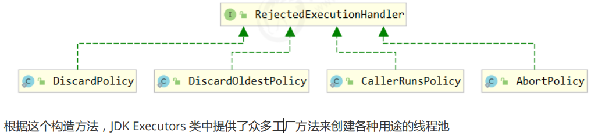

### newFixedThreadPool

```java
public static ExecutorService newFixedThreadPool(int nThreads) {
    return new ThreadPoolExecutor(nThreads, nThreads,
                                  0L, TimeUnit.MILLISECONDS,
                                  new LinkedBlockingQueue<Runnable>());
}
```

特点：**适用于任务量已知，相对耗时的任务**

- 核心线程数 == 最大线程数（没有救急线程被创建），因此也无需超时时间
- 阻塞队列是无界的，可以放任意数量的任务

### newCachedThreadPool

```java
public static ExecutorService newCachedThreadPool() {
    return new ThreadPoolExecutor(0, Integer.MAX_VALUE,
                                  60L, TimeUnit.SECONDS,
                                  new SynchronousQueue<Runnable>());
}
```

**特点：**整个线程池表现为线程数会根据任务量不断增长，没有上限，当任务执行完毕，空闲 1分钟后释放线程。 **适合任务数比较密集，但每个任务执行时间较短的情况**

- 核心线程数是 0， 最大线程数是 Integer.MAX_VALUE，救急线程的空闲生存时间是 60s，意味着全部都是救急线程（60s 后可以回收），救急线程可以无限创建
- 队列采用了 SynchronousQueue 实现特点是，它没有容量，没有线程来取是放不进去的（一手交钱、一手交货）

### newSingleThreadExecutor

```java
public static ExecutorService newSingleThreadExecutor() {
    return new FinalizableDelegatedExecutorService
        (new ThreadPoolExecutor(1, 1,
                                0L, TimeUnit.MILLISECONDS,
                                new LinkedBlockingQueue<Runnable>()));
}
```

**使用场景：**希望多个任务排队执行。线程数固定为 1，任务数多于 1 时，会放入无界队列排队。任务执行完毕，这唯一的线程也不会被释放。

**区别：**

- 自己创建一个单线程串行执行任务，如果任务执行失败而终止那么没有任何补救措施，而线程池还会新建一个线程，保证池的正常工作。
- Executors.newSingleThreadExecutor() 线程个数始终为1，不能修改
  - FinalizableDelegatedExecutorService 应用的是装饰器模式，只对外暴露了 ExecutorService 接口，因此不能调用 ThreadPoolExecutor 中特有的方法
- Executors.newFixedThreadPool(1) 初始时为1，以后还可以修改
  - 对外暴露的是 ThreadPoolExecutor 对象，可以强转后调用 setCorePoolSize 等方法进行修改

### 提交任务：

```java
// 执行任务
void execute(Runnable command);
// 提交任务 task，用返回值 Future 获得任务执行结果
<T> Future<T> submit(Callable<T> task);
// 提交 tasks 中所有任务，因为要等待返回值，所以执行所需时间是最晚执行完的线程的时间
<T> List<Future<T>> invokeAll(Collection<? extends Callable<T>> tasks)
    throws InterruptedException;
// 提交 tasks 中所有任务，带超时时间
<T> List<Future<T>> invokeAll(Collection<? extends Callable<T>> tasks,
                              long timeout, TimeUnit unit)throws InterruptedException;
// 提交 tasks 中所有任务，哪个任务先成功执行完毕，返回此任务执行结果，其它任务取消
<T> T invokeAny(Collection<? extends Callable<T>> tasks)
    throws InterruptedException, ExecutionException;
// 提交 tasks 中所有任务，哪个任务先成功执行完毕，返回此任务执行结果，其它任务取消，带超时时间
<T> T invokeAny(Collection<? extends Callable<T>> tasks, long timeout, TimeUnit unit)
    throws InterruptedException, ExecutionException, TimeoutException;
```

### 关闭线程池：

1. **shutdown**

```java
/*
线程池状态变为 SHUTDOWN
- 不会接收新任务
- 但已提交任务会执行完
- 此方法不会阻塞调用线程的执行
*/
void shutdown() {
    final ReentrantLock mainLock = this.mainLock;
    mainLock.lock();
    try {
        checkShutdownAccess();
        // 修改线程池状态
        advanceRunState(SHUTDOWN);
        // 仅会打断空闲线程
        interruptIdleWorkers();
        onShutdown(); // 扩展点 ScheduledThreadPoolExecutor
    } finally {
        mainLock.unlock();
    }
    // 尝试终结(没有运行的线程可以立刻终结，如果还有运行的线程也不会等)
    tryTerminate();
}
```

2. **shutdownNow**

```java
/*
线程池状态变为 STOP
- 不会接收新任务
- 会将队列中的任务返回
- 并用 interrupt 的方式中断正在执行的任务
*/
List<Runnable> shutdownNow(){
    List<Runnable> tasks;
    final ReentrantLock mainLock = this.mainLock;
    mainLock.lock();
    try {
        checkShutdownAccess();
        // 修改线程池状态
        advanceRunState(STOP);
        // 打断所有线程
        interruptWorkers();
        // 获取队列中剩余任务
        tasks = drainQueue();
    } finally {
        mainLock.unlock();
    }
    // 尝试终结
    tryTerminate();
    return tasks;
}
```

3. **其它方法**

```java
// 不在 RUNNING 状态的线程池，此方法就返回 true
boolean isShutdown();
// 线程池状态是否是 TERMINATED
boolean isTerminated();
// 调用 shutdown 后，由于调用线程并不会等待所有任务运行结束，因此如果它想在线程池 TERMINATED 后做些事情，可以利用此方法等待
boolean awaitTermination(long timeout, TimeUnit unit) throws InterruptedException;
```

## 任务调度线程池：

### Timer：

- 在『任务调度线程池』功能加入之前，可以使用 java.util.Timer 来实现定时功能，Timer 的优点在于简单易用，**`但由于所有任务都是由同一个线程来调度，因此所有任务都是串行执行的`**，**同一时间只能有一个任务在执行，前一个任务的延迟或异常都将会影响到之后的任务。**

### ScheduledExecutorService

1. **延迟执行：**使用ScheduledExecutorService可以设置多个线程，就不会导致串行执行，并且设置单线程情况下线程报错也不会影响其他线程执行。

```java
ScheduledExecutorService executor = Executors.newScheduledThreadPool(2);
// 添加两个任务，希望它们都在 1s 后执行
executor.schedule(() -> {
    System.out.println("任务1，执行时间：" + new Date());
    try { Thread.sleep(2000); } catch (InterruptedException e) { }
}, 1000, TimeUnit.MILLISECONDS);
executor.schedule(() -> {
    System.out.println("任务2，执行时间：" + new Date());
}, 1000, TimeUnit.MILLISECONDS);
```

2. **定时执行：**

```java
ScheduledExecutorService pool = Executors.newScheduledThreadPool(1);
log.debug("start...");
pool.scheduleWithFixedDelay(()-> { //在第上一个任务结束后延迟一秒再执行
    log.debug("running...");
    sleep(2);
}, 1, 1, TimeUnit.SECONDS);

ScheduledExecutorService pool = Executors.newScheduledThreadPool(1);
log.debug("start...");
pool.scheduleAtFixedRate(() -> {//上一个任务执行时间超过了一秒就直接执行，不足一秒则延迟到一秒执行
    log.debug("running...");
    sleep(2);
}, 1, 1, TimeUnit.SECONDS)
```

## 处理线程池异常：

1. 方法1：主动捉异常，使用try-catch。
2. 方法2：使用 Future会自动接受异常。

## Tomcat线程池：

### 简介：

- LimitLatch 用来限流，可以控制最大连接个数，类似 J.U.C 中的 Semaphore 后面再讲
- Acceptor 只负责【接收新的 socket 连接】
- Poller 只负责监听 socket channel 是否有【可读的 I/O 事件】
- 一旦可读，封装一个任务对象（socketProcessor），提交给 Executor 线程池处理
- Executor 线程池中的工作线程最终负责【处理请求】

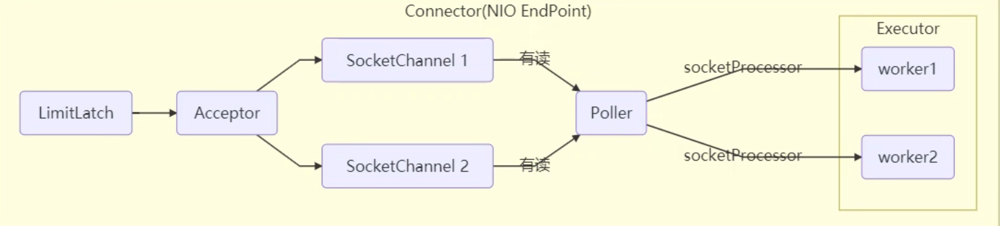

- Tomcat 线程池扩展了 ThreadPoolExecutor，行为稍有不同
- 如果总线程数达到 maximumPoolSize
  - 这时不会立刻抛 RejectedExecutionException 异常
  - 而是再次尝试将任务放入队列，如果还失败，才抛出 RejectedExecutionException 异常

### 配置：

1. C**onnector 配置：**

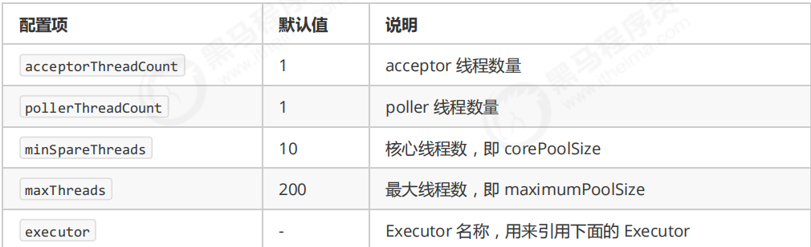

2. **Executor 线程配置**

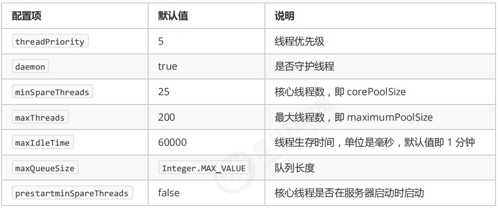

3. **流程：**跟普通的线程池不一样，tomcat线程池是如果线程不够用就创建救急线程，而不是等队列满才创建。

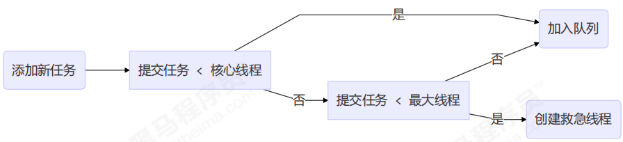

## Fork&join：

### 简介：

- Fork/Join 是 JDK 1.7 加入的新的线程池实现，它体现的是一种分治思想，适用于能够进行任务拆分的 cpu 密集型运算
- 所谓的任务拆分，是将一个大任务拆分为算法上相同的小任务，直至不能拆分可以直接求解。跟递归相关的一些计算，如归并排序、斐波那契数列、都可以用分治思想进行求解
- Fork/Join 在分治的基础上加入了多线程，可以把每个任务的分解和合并交给不同的线程来完成，进一步提升了运算效率
- Fork/Join 默认会创建与 cpu 核心数大小相同的线程池

### 使用：

- 执行前n相求和。

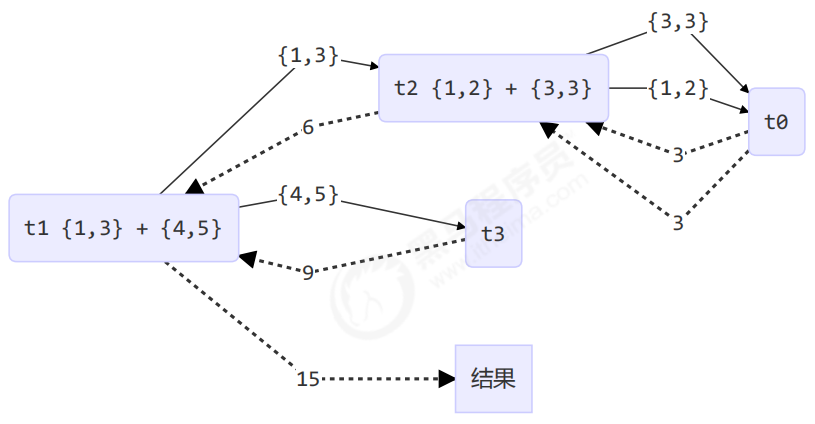

```java
class AddTask3 extends RecursiveTask<Integer> {

    int begin;
    int end;
    public AddTask3(int begin, int end) {
        this.begin = begin;
        this.end = end;
    }
    @Override
    public String toString() {
        return "{" + begin + "," + end + '}';
    }
    @Override
    protected Integer compute() {
        // 5, 5
        if (begin == end) {
            log.debug("join() {}", begin);
            return begin;
        }
        // 4, 5
        if (end - begin == 1) {
            log.debug("join() {} + {} = {}", begin, end, end + begin);
            return end + begin;
        }

        // 1 5
        int mid = (end + begin) / 2; // 3
        AddTask3 t1 = new AddTask3(begin, mid); // 1,3
        t1.fork();
        AddTask3 t2 = new AddTask3(mid + 1, end); // 4,5
        t2.fork();
        log.debug("fork() {} + {} = ?", t1, t2);
        int result = t1.join() + t2.join();
        log.debug("join() {} + {} = {}", t1, t2, result);
        return result;
    }
}
```

# JUC：

## 读写锁：

### 简介：

- 当读操作远远高于写操作时，这时候使用 读写锁 让 读-读 可以并发，提高性能。 类似于数据库中的 select ...from ... lock in share mode
- 提供一个 数据容器类 内部分别使用读锁保护数据的 read() 方法，写锁保护数据的 write() 方法
- **`就是让读操作可以并发，写操作和读操作以及写操作和写操作直接互斥。`**

###  ReentrantReadWriteLock

**注意事项**：

- 读锁不支持条件变量
- 重入时升级不支持：即持有读锁的情况下去获取写锁，会导致获取写锁永久等待
- 重入时降级支持：即持有写锁的情况下去获取读锁

- **`原理见原理篇`**

### 应用——缓存：

- 读写锁可以引用到缓存中，因为大部分是读操作并行提高效率，写操作保证原子性。

### stampedlock：

- 该类自 JDK 8 加入，是为了进一步优化读性能，它的特点是在使用读锁、写锁时都必须配合【戳】使用

- **乐观读**，StampedLock 支持 tryOptimisticRead() 方法（乐观读），读取完毕后需要做一次**戳校验**如果校验通过，表示这期间确实没有写操作，数据可以安全使用，如果校验没通过，需要重新获取读锁，保证数据全。
- **注意:**
  - StampedLock 不支持条件变量
  - StampedLock 不支持可重入
  - 我认为这种锁只能在读操作非常少的时候使用，不然频繁的锁升级反而会导致性能降低。

## Semaphore：

### 简介：

- 信号量，用来限制能同时访问共享资源的线程上限。
- 使用 Semaphore 限流，在访问高峰期时，让请求线程阻塞，高峰期过去再释放许可，当然它只适合限制单机线程数量，并且仅是限制线程数，而不是限制资源数（例如连接数，请对比 Tomcat LimitLatch 的实现
- 用 Semaphore 实现简单连接池，对比『享元模式』下的实现（用wait notify），性能和可读性显然更好。

- **`原理见原理篇`**:感觉相当于一个计数器，有线程来了++，线程结束--，做到限流的效果。

## CountdownLatch：

### 简介：

- 用来进行线程同步协作，等待所有线程完成倒计时。其中构造参数用来初始化等待计数值，await() 用来等待计数归零，countDown() 用来让计数减一。

```java
public static void main(String[] args) throws InterruptedException {
    CountDownLatch latch = new CountDownLatch(3);
    ExecutorService service = Executors.newFixedThreadPool(4);
    service.submit(() -> {
        log.debug("begin...");
        sleep(1);
        latch.countDown();
        log.debug("end...{}", latch.getCount());
    });
    service.submit(() -> {
        log.debug("begin...");
        sleep(1.5);
        latch.countDown();
        log.debug("end...{}", latch.getCount());
    });
    service.submit(() -> {
        log.debug("begin...");
        sleep(2);
        latch.countDown();
        log.debug("end...{}", latch.getCount());
    });
    service.submit(()->{
        try {
            log.debug("waiting...");
            latch.await();
            log.debug("wait end...");
        } catch (InterruptedException e) {
            e.printStackTrace();
        }
    });
}
```

## CyclicBarrier

- 循环栅栏他跟CountdownLatch功能非常相似，用来进行线程协作，等待线程满足某个计数。构造时设置『计数个数』，每个线程执行到某个需要“同步”的时刻调用 await() 方法进行等待，当等待的线程数满足『计数个数』时，继续执行。
-  CyclicBarrier 与 CountDownLatch 的主要区别在于 CyclicBarrier 是可以重用的 CyclicBarrier 可以被比喻为『人满发车』，**CountDownLatch是计数器减到0时latch.await();后面的代码才执行，CyclicBarrier是cb.await();个数到计数器规定的数时才执行。而且CyclicBarrier每次使用完计数器会重置。**

```java
CyclicBarrier cb = new CyclicBarrier(2); // 个数为2时才会继续执行
new Thread(()->{
    System.out.println("线程1开始.."+new Date());
    try {
        cb.await(); // 当个数不足时，等待
    } catch (InterruptedException | BrokenBarrierException e) {
        e.printStackTrace();
    }
    System.out.println("线程1继续向下运行..."+new Date());
}).start();
new Thread(()->{
    System.out.println("线程2开始.."+new Date());
    try { Thread.sleep(2000); } catch (InterruptedException e) { }
    try {
        cb.await(); // 2 秒后，线程个数够2，继续运行
    } catch (InterruptedException | BrokenBarrierException e) {
        e.printStackTrace();
    }
    System.out.println("线程2继续向下运行..."+new Date());
}).start();
```

## 线程安全集合类：

### 简介：

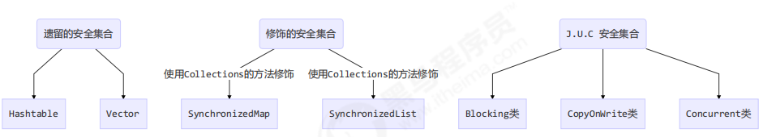

**线程安全集合类可以分为三大类：**

1. 遗留的线程安全集合如 Hashtable ， Vector（`比较老的线程安全集合直接在类上加synchronized，不推荐`）
2. 使用 Collections 装饰的线程安全集合，如：（`继承集合后在每个方法上加synchronized`）
   - Collections.synchronizedCollection
   - Collections.synchronizedList
   - Collections.synchronizedMap
   - Collections.synchronizedSet
   - Collections.synchronizedNavigableMap
   - Collections.synchronizedNavigableSet 
   - Collections.synchronizedSortedMap
   - Collections.synchronizedSortedSet
3. 重点介绍 **java.util.concurrent.*** 下的线程安全集合类，可以发现它们有规律，里面包含三类关键词：Blocking、CopyOnWrite、Concurrent

- **Blocking 大部分实现基于锁，并提供用来阻塞的方法**
- **CopyOnWrite 之类容器修改开销相对较重**
- Concurrent 类型的容器
  - 内部很多操作使用 cas 优化，一般可以提供较高吞吐量
  - 弱一致性
    - 遍历时弱一致性，例如，当利用迭代器遍历时，如果容器发生修改，迭代器仍然可以继续进行遍历，这时内容是旧的
    - 求大小弱一致性，size 操作未必是 100% 准确
    - 读取弱一致性

### ConcurrentHashMap


# 设计模式：

## 终止模式：

### 两阶段终止：

#### 打断标记

1. **不推荐的线程终止方法：**还有一些不推荐使用的方法，这些方法已过时，容易破坏同步代码块，造成线程死锁，例如stop、system.exit。

- 如果是打断正常线程，会将打断标记置为true，在每次循环中判断为true的话就料理后事。如何打断阻塞线程，就在catch异常中把标记置为true，在下一次循环中判断并料理后事。

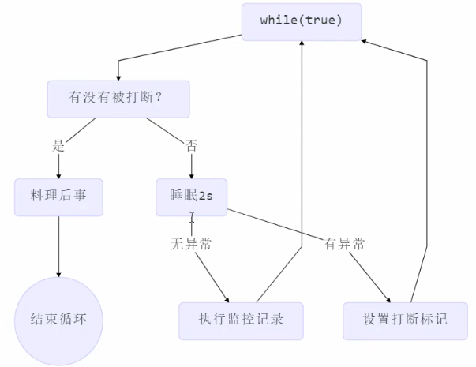

#### 利用停止标记：

```java
// 停止标记用 volatile 是为了保证该变量在多个线程之间的可见性
// 我们的例子中，即主线程把它修改为 true 对 t1 线程可见
class TPTVolatile {
    private Thread thread;
    private volatile boolean stop = false;
    public void start(){
        thread = new Thread(() -> {
            while(true) {
                Thread current = Thread.currentThread();
                if(stop) {
                    log.debug("料理后事");
                    break;
                }
                try {
                    Thread.sleep(1000);
                    log.debug("将结果保存");
                } catch (InterruptedException e) {
                }
                // 执行监控操作
            }
        },"监控线程");
        thread.start();
    }
    public void stop() {
        stop = true;
        thread.interrupt();
    }
}
```


## 保护性暂停- 同步：

### 简介：

- 即 Guarded Suspension，用在一个线程等待另一个线程的执行结果

1. 有一个结果需要从一个线程传递到另一个线程，让他们关联同一个 GuardedObject
2. 如果有结果不断从一个线程到另一个线程那么可以使用消息队列（见生产者/消费者）
3. JDK 中，join 的实现、Future 的实现，采用的就是此模式
4. 因为要等待另一方的结果，因此归类到同步模式

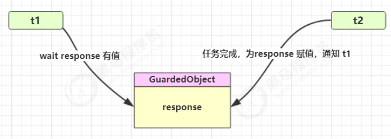

### 解耦：

- 如果需要在多个类之间使用 GuardedObject 对象，作为参数传递不是很方便，因此设计一个用来解耦的中间类，这样不仅能够解耦【结果等待者】和【结果生产者】，还能够同时支持多个任务的管理
- `我理解的就是创建多个对象，锁住的对象不一样，因此就可以定向的唤醒。`

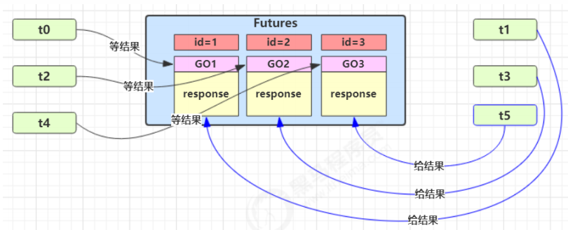

## 生产者消费者模式-异步：

- 与前面的保护性暂停中的 GuardObject 不同，不需要产生结果和消费结果的线程一一对应
- 消费队列可以用来平衡生产和消费的线程资源
- 生产者仅负责产生结果数据，不关心数据该如何处理，而消费者专心处理结果数据
- 消息队列是有容量限制的，满时不会再加入数据，空时不会再消耗数据
- JDK 中各种阻塞队列，采用的就是这种模式

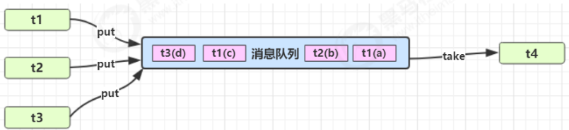

## 顺序控制-同步：

### 固定顺序执行：

#### wait&notify：

```java
// 用来同步的对象
static Object obj = new Object();
// t2 运行标记， 代表 t2 是否执行过
static boolean t2runed = false;
public static void main(String[] args) {
    Thread t1 = new Thread(() -> {
        synchronized (obj) {
            // 如果 t2 没有执行过
            while (!t2runed) { 
                try {
                    // t1 先等一会
                    obj.wait(); 
                } catch (InterruptedException e) {
                    e.printStackTrace();
                }
            }
        }
        System.out.println(1);
    });
    Thread t2 = new Thread(() -> {
        System.out.println(2);
        synchronized (obj) {
            // 修改运行标记
            t2runed = true;
            // 通知 obj 上等待的线程（可能有多个，因此需要用 notifyAll）
            obj.notifyAll();
        }
    });
    t1.start();
    t2.start();
}
```

#### Park&Unpark：

可以看到，实现上很麻烦：

- 首先，需要保证先 wait 再 notify，否则 wait 线程永远得不到唤醒。因此使用了『运行标记』来判断该不该wait
- 第二，如果有些干扰线程错误地 notify 了 wait 线程，条件不满足时还要重新等待，使用了 while 循环来解决此问题
- 最后，唤醒对象上的 wait 线程需要使用 notifyAll，因为『同步对象』上的等待线程可能不止一个
- 可以使用 LockSupport 类的 park 和 unpark 来简化上面的题目：

```java
Thread t1 = new Thread(() -> {
    try { Thread.sleep(1000); } catch (InterruptedException e) { }
    // 当没有『许可』时，当前线程暂停运行；有『许可』时，用掉这个『许可』，当前线程恢复运行
    LockSupport.park();
    System.out.println("1");
});
Thread t2 = new Thread(() -> {
    System.out.println("2");
    // 给线程 t1 发放『许可』（多次连续调用 unpark 只会发放一个『许可』）
    LockSupport.unpark(t1);
});
t1.start();
t2.start();
```

### 交替输出：

#### wait&notify：

```java
class SyncWaitNotify {
    private int flag;
    private int loopNumber;
    public SyncWaitNotify(int flag, int loopNumber) {
        this.flag = flag;
        this.loopNumber = loopNumber;
    }
    public void print(int waitFlag, int nextFlag, String str) {
        for (int i = 0; i < loopNumber; i++) {
            synchronized (this) {
                while (this.flag != waitFlag) {
                    try {
                        this.wait();
                    } catch (InterruptedException e) {
                        e.printStackTrace();
                    }
                }
                System.out.print(str);
                flag = nextFlag;
                this.notifyAll();
            }
        }
    }
}
```

####  **Lock** 条件变量版:

```java
class AwaitSignal extends ReentrantLock {
    public void start(Condition first) {
        this.lock();
        try {
            log.debug("start");
            first.signal();
        } finally {
            this.unlock();
        }
    }
    public void print(String str, Condition current, Condition next) {
        for (int i = 0; i < loopNumber; i++) {
            this.lock();
            try {
                current.await();
                log.debug(str);
                next.signal();
            } catch (InterruptedException e) {
                e.printStackTrace();
            } finally {
                this.unlock();
            }
        }
    }
    // 循环次数
    private int loopNumber;
    public AwaitSignal(int loopNumber) {
        this.loopNumber = loopNumber;
    }
}
```

#### park&unpark:

```java
class SyncPark {
    private int loopNumber;
    private Thread[] threads;
    public SyncPark(int loopNumber) {
        this.loopNumber = loopNumber;
    }
    public void setThreads(Thread... threads) {
        this.threads = threads;
    }
    public void print(String str) {
        for (int i = 0; i < loopNumber; i++) {
            LockSupport.park();
            System.out.print(str);
            LockSupport.unpark(nextThread());
        }
    }
    private Thread nextThread() {
        Thread current = Thread.currentThread();
        int index = 0;
        for (int i = 0; i < threads.length; i++) {
            if(threads[i] == current) {
                index = i;
                break;
            }
        }
        if(index < threads.length - 1) {
            return threads[index+1];
        } else {
            return threads[0];
        }
    }
    public void start() {
        for (Thread thread : threads) {
            thread.start();
        }
        LockSupport.unpark(threads[0]);
    }
}
```

## 工作线程-异步：

### 定义：

- 让有限的工作线程（Worker Thread）来轮流异步处理无限多的任务。也可以将其归类为分工模式，它的典型实现就是线程池，也体现了经典设计模式中的享元模式。
- 注意，不同任务类型应该使用不同的线程池，这样能够避免**饥饿（线程都去执行任务A了导致任务B没有线程做并且任务A需要任务B的返回）**，并能提升效率。

### 线程数多少：

- 过小会导致程序不能充分地利用系统资源、容易导致饥饿
- 过大会导致更多的线程上下文切换，占用更多内存

1. **CPU** **密集型运算**：通常采用 cpu 核数 + 1 能够实现最优的 CPU 利用率，+1 是保证当线程由于页缺失故障（操作系统）或其它原因导致暂停时，额外的这个线程就能顶上去，保证 CPU 时钟周期不被浪费。
2. **I/O** **密集型运算**：CPU 不总是处于繁忙状态，例如，当你执行业务计算时，这时候会使用 CPU 资源，但当你执行 I/O 操作时、远程RPC 调用时，包括进行数据库操作时，这时候 CPU 就闲下来了，你可以利用多线程提高它的利用率。
   - 线程数 = 核数 * 期望 CPU 利用率 * 总时间(CPU计算时间+等待时间) / CPU 计算时间
   - 例如 4 核 CPU 计算时间是 50% ，其它等待时间是 50%，期望 cpu 被 100% 利用，套用公式4 * 100% * 100% / 50% = 8

### 自定义线程池

- **`见并发工具`**

# 原理：

## join：

- 是调用者轮询检查线程 alive 状态，等价于下面的代码：

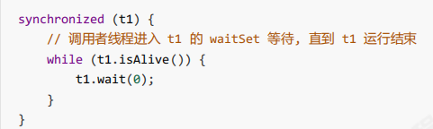

## volatile：

volatile 的底层实现原理是内存屏障，Memory Barrier（Memory Fence）

- 对 volatile 变量的写指令后会加入写屏障
- 对 volatile 变量的读指令前会加入读屏障

### 如何保证可见性：

- 写屏障（sfence）保证在该屏障之前的，对共享变量的改动，都同步到主存当中。
- 而读屏障（lfence）保证在该屏障之后，对共享变量的读取，加载的是主存中最新数据。
- 由此就可以保证不同线程对volatile修饰的变量读写是一致的。

### 如何保证有序性:

- 写屏障会确保指令重排序时，不会将写屏障之前的代码排在写屏障之后。
- 读屏障会确保指令重排序时，不会将读屏障之后的代码排在读屏障之前。
- 这样就保证了volatile修饰的变量不会被JVM重排序影响。

### 无法保证原子性：

还是那句话，不能解决指令交错：

- 写屏障仅仅是保证之后的读能够读到最新的结果，但不能保证读跑到它前面去
- 而有序性的保证也只是保证了本线程内相关代码不被重排序

### DCL问题：

- 以著名的 double-checked locking 单例模式为例，以下的实现特点是：
  - 懒惰实例化
  - 首次使用 getInstance() 才使用 synchronized 加锁，后续使用时无需加锁
  - 有隐含的，但很关键的一点：第一个 if 使用了 INSTANCE 变量，是在同步块之外

```java
public final class Singleton {
    private Singleton() { }
    private static Singleton INSTANCE = null;
    public static Singleton getInstance() { 
        if(INSTANCE == null) { // t2
            // 首次访问会同步，而之后的使用没有 synchronized
            synchronized(Singleton.class) {
                if (INSTANCE == null) { // t1
                    INSTANCE = new Singleton();
                } 
            }
        }
        return INSTANCE;
    }
}
```

- 关键在于if(INSTANCE == null) 这行代码在 monitor 控制之外，它就像之前举例中不守规则的人，可以越过 monitor 读取INSTANCE 变量的值
- 这时 t1 还未完全将构造方法执行完毕，如果在构造方法中要执行很多初始化操作，那么 t2 拿到的是将是一个未初始化完毕的单例。

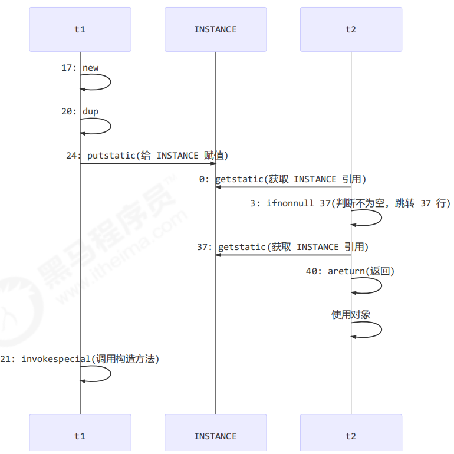

- **解决：**对 INSTANCE 使用 volatile 修饰即可，可以禁用指令重排，但要注意在 JDK 5 以上的版本的 volatile 才会真正有效。

- 读写 volatile 变量时会加入内存屏障（Memory Barrier（Memory Fence）），保证下面两点：
- 可见性
  - 写屏障（sfence）保证在该屏障之前的 t1 对共享变量的改动，都同步到主存当中
  - 而读屏障（lfence）保证在该屏障之后 t2 对共享变量的读取，加载的是主存中最新数据
- 有序性
  - 写屏障会确保指令重排序时，不会将写屏障之前的代码排在写屏障之后
  - 读屏障会确保指令重排序时，不会将读屏障之后的代码排在读屏障之前
- 更底层是读写变量时使用 lock 指令来多核 CPU 之间的可见性与有序性

## final：

### 设置 **final** 变量的原理

- 发现 final 变量的赋值也会通过 putfield 指令来完成，同样在这条指令之后也会加入写屏障，保证在其它线程读到它的值时不会出现为 0 的情况。

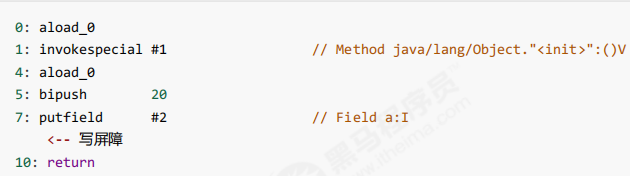

### 获取 **final** 变量的原理

-  final static定义的变量值较小的话直接复制到方法栈中，如果值比较大的话会读取常量池中的值。
- 如果是static定义的变量，会在堆中取出，会比较慢。

## AQS：

### 简介：

- 全称是 AbstractQueuedSynchronizer，是阻塞式锁和相关的同步器工具的框架。

特点：

- 用 state 属性来表示资源的状态（分独占模式和共享模式），子类需要定义如何维护这个状态，控制如何获取锁和释放锁
  - getState - 获取 state 状态
  - setState - 设置 state 状态
  - compareAndSetState - cas 机制设置 state 状态
  - 独占模式是只有一个线程能够访问资源，而共享模式可以允许多个线程访问资源
- 提供了基于 FIFO 的等待队列，类似于 Monitor 的 EntryList
- 条件变量来实现等待、唤醒机制，支持多个条件变量，类似于 Monitor 的 WaitSet

子类主要实现这样一些方法（默认抛出 UnsupportedOperationException）：

- tryAcquire
- tryRelease
- tryAcquireShared
- tryReleaseShared
- isHeldExclusively

### 自定义同步器：

```java
final class MySync extends AbstractQueuedSynchronizer {
    @Override
    protected boolean tryAcquire(int acquires) {
        if (acquires == 1){
            if (compareAndSetState(0, 1)) {
                setExclusiveOwnerThread(Thread.currentThread());
                return true;
            }
        }
        return false;
    }
    @Override
    protected boolean tryRelease(int acquires) {
        if(acquires == 1) {
            if(getState() == 0) {
                throw new IllegalMonitorStateException();
            }
            setExclusiveOwnerThread(null);
            setState(0);
            return true;
        }
        return false;
    }
    protected Condition newCondition() {
        return new ConditionObject();
    }
    @Override
    protected boolean isHeldExclusively() {
        return getState() == 1;
    }
}
```

### 自定义锁：

```java
class MyLock implements Lock {
    static MySync sync = new MySync();
    @Override
    // 尝试，不成功，进入等待队列
    public void lock() {
        sync.acquire(1);
    }
    @Override
    // 尝试，不成功，进入等待队列，可打断
    public void lockInterruptibly() throws InterruptedException {
        sync.acquireInterruptibly(1);
    }
    @Override
    // 尝试一次，不成功返回，不进入队列
    public boolean tryLock() {
        return sync.tryAcquire(1);
    }
    @Override
    // 尝试，不成功，进入等待队列，有时限
    public boolean tryLock(long time, TimeUnit unit) throws InterruptedException {
        return sync.tryAcquireNanos(1, unit.toNanos(time));
    }
    @Override
    // 释放锁
    public void unlock() {
        sync.release(1);
    }
    @Override
    // 生成条件变量
    public Condition newCondition() {
        return sync.newCondition();
    }
}
```

### 心得：

1. 起源：早期程序员会自己通过一种同步器去实现另一种相近的同步器，例如用可重入锁去实现信号量，或反之。这显然不够优雅，于是在 JSR166（java 规范提案）中创建了 AQS，提供了这种通用的同步器机制。
2. AQS 要实现的功能目标：
   - 阻塞版本获取锁 acquire 和非阻塞的版本尝试获取锁 tryAcquire
   - 获取锁超时机制
   - 通过打断取消机制
   - 独占机制及共享机制
   - 条件不满足时的等待机制
3. AQS 的基本思想其实很简单，要点：
   - 原子维护 state 状态
   - 阻塞及恢复线程
   - 维护队列
4. **state** **设计**：
   - state 使用 volatile 配合 cas 保证其修改时的原子性
   - state 使用了 32bit int 来维护同步状态，因为当时使用 long 在很多平台下测试的结果并不理想
5. **阻塞恢复设计**：
   - 早期的控制线程暂停和恢复的 api 有 suspend 和 resume，但它们是不可用的，因为如果先调用的 resume 那么 suspend 将感知不到
   - 解决方法是使用 park & unpark 来实现线程的暂停和恢复，具体原理在之前讲过了，先 unpark 再 park 也没问题
   - park & unpark 是针对线程的，而不是针对同步器的，因此控制粒度更为精细
   - park 线程还可以通过 interrupt 打断
6. **队列设计**：
   - 使用了 FIFO 先入先出队列，并不支持优先级队列
   - 设计时借鉴了 CLH 队列，它是一种单向无锁队列
   - 队列中有 head 和 tail 两个指针节点，都用 volatile 修饰配合 cas 使用，每个节点有 state 维护节点状态入队伪代码，只需要考虑 tail 赋值的原子性。

### 用到AQS的工具类：

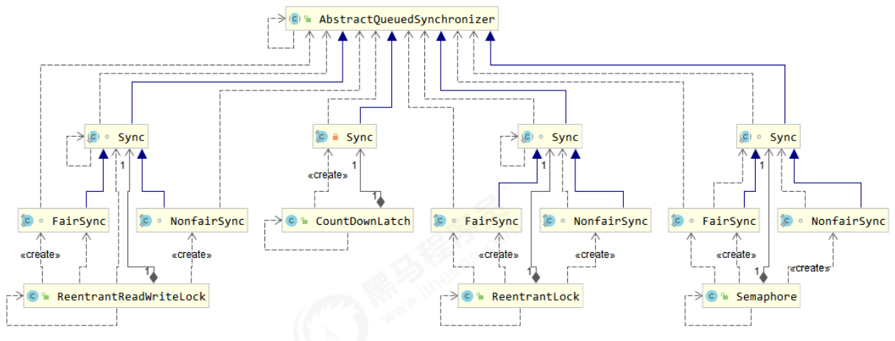

## ReentrantLock :

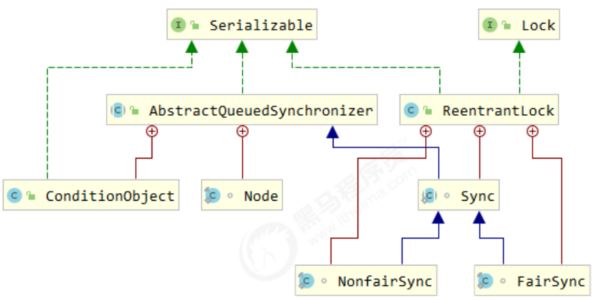

### 非公平锁实现原理：

- ReentrantLock默认构造采用的是非公平锁NonfairSync()实现，NonfairSync 继承自 AQS。

1. 第一个竞争出现时：

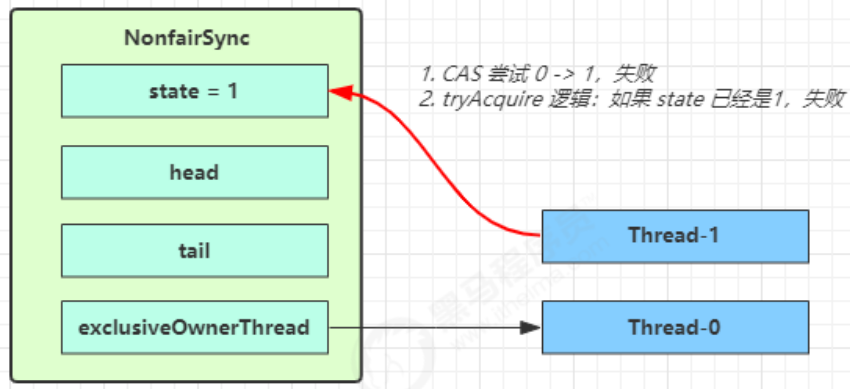

- Thread-1 执行了
  1. CAS 尝试将 state 由 0 改为 1，结果失败
  2. 进入 tryAcquire 逻辑，这时 state 已经是1，结果仍然失败
  3. 接下来进入 addWaiter 逻辑，构造 Node 队列
- 图中黄色三角表示该 Node 的 waitStatus 状态，其中 0 为默认正常状态
- Node 的创建是懒惰的
- 其中第一个 Node 称为 Dummy（哑元）或哨兵，用来占位，并不关联线程

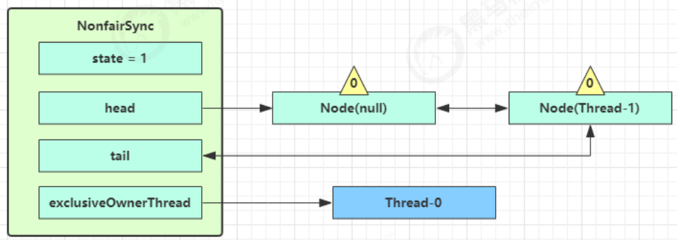

2. 当前线程Thread-1进入 acquireQueued 逻辑
   - acquireQueued 会在一个死循环中不断尝试获得锁，失败后进入 park 阻塞
   - 如果自己是紧邻着 head（排第二位），那么再次 tryAcquire 尝试获取锁，当然这时 state 仍为 1，失败
   - 进入 shouldParkAfterFailedAcquire 逻辑，将前驱 node，即 head 的 waitStatus 改为 -1，这次返回 false
   - shouldParkAfterFailedAcquire 执行完毕回到 acquireQueued ，再次 tryAcquire 尝试获取锁，当然这时state 仍为 1，失败
   -  当再次进入 shouldParkAfterFailedAcquire 时，这时因为其前驱 node 的 waitStatus 已经是 -1，这次返回true
   - 进入 parkAndCheckInterrupt， Thread-1 park（灰色表示）
3. 再次有多个线程经历上述过程竞争失败，变成这个样子

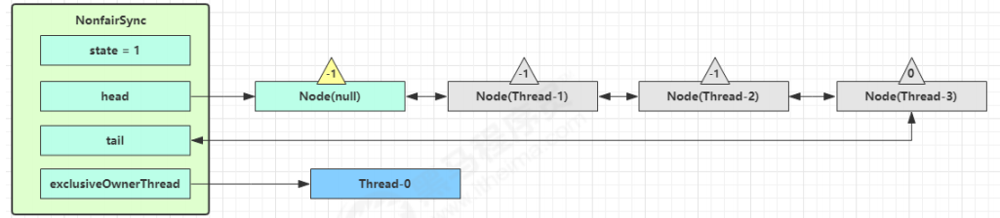

4. Thread-0 释放锁，进入 tryRelease 流程，如果成功
   - 设置 exclusiveOwnerThread 为 null
   - state = 0
5. 当前队列不为 null，并且 head 的 waitStatus = -1，进入 unparkSuccessor 流程
6. 找到队列中离 head 最近的一个 Node（没取消的），unpark 恢复其运行，本例中即为 Thread-1
7. 回到 Thread-1 的 acquireQueued 流程
8. 如果加锁成功（没有竞争），会设置
   - exclusiveOwnerThread 为 Thread-1，state = 1
   - head 指向刚刚 Thread-1 所在的 Node，该 Node 清空 Thread
   - 原本的 head 因为从链表断开，而可被垃圾回收

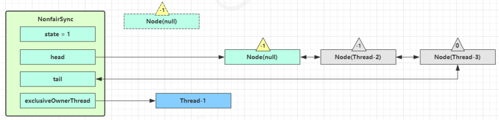

9. 如果这时候有其它线程来竞争（非公平的体现），例如这时有Thread-4来了，如果不巧又被Thread-4占了先
   - Thread-4 被设置为 exclusiveOwnerThread，state = 1
   - Thread-1 再次进入 acquireQueued 流程，获取锁失败，重新进入 park 阻塞

### 可重入原理：

- 就是加锁时让status++，解锁时让status--，如果等于零才释放锁。

```java
static final class NonfairSync extends Sync {
    // ...

    // Sync 继承过来的方法, 方便阅读, 放在此处
    final boolean nonfairTryAcquire(int acquires) {
        final Thread current = Thread.currentThread();
        int c = getState();
        if (c == 0) {
            if (compareAndSetState(0, acquires)) {
                setExclusiveOwnerThread(current);
                return true;
            }
        }
        // 如果已经获得了锁, 线程还是当前线程, 表示发生了锁重入
        else if (current == getExclusiveOwnerThread()) {
            // state++
            int nextc = c + acquires;
            if (nextc < 0) // overflow
                throw new Error("Maximum lock count exceeded");
            setState(nextc);
            return true;
        }
        return false;
    }

    // Sync 继承过来的方法, 方便阅读, 放在此处
    protected final boolean tryRelease(int releases) {
        // state-- 
        int c = getState() - releases;
        if (Thread.currentThread() != getExclusiveOwnerThread())
            throw new IllegalMonitorStateException();
        boolean free = false;
        // 支持锁重入, 只有 state 减为 0, 才释放成功
        if (c == 0) {
            free = true;
            setExclusiveOwnerThread(null);
        }
        setState(c);
        return free;
    }
}
```

### 可打断原理：

1. **不可打断模式：**在此模式下，即使它被打断，仍会驻留在 AQS 队列中，一直要等到获得锁后方能得知自己被打断了

2. **可打断模式：**如果被打断会抛出打断异常，就会跳出for循环，直接被打断。

```java
static final class NonfairSync extends Sync {
    public final void acquireInterruptibly(int arg) throws InterruptedException {
        if (Thread.interrupted())
            throw new InterruptedException();
        // 如果没有获得到锁, 进入 ㈠
        if (!tryAcquire(arg))
            doAcquireInterruptibly(arg);
    }

    // ㈠ 可打断的获取锁流程
    private void doAcquireInterruptibly(int arg) throws InterruptedException {
        final Node node = addWaiter(Node.EXCLUSIVE);
        boolean failed = true;
        try {
            for (;;) {
                final Node p = node.predecessor();
                if (p == head && tryAcquire(arg)) {
                    setHead(node);
                    p.next = null; // help GC
                    failed = false;
                    return;
                }
                if (shouldParkAfterFailedAcquire(p, node) &&
                    parkAndCheckInterrupt()) {
                    // 在 park 过程中如果被 interrupt 会进入此
                    // 这时候抛出异常, 而不会再次进入 for (;;)
                    throw new InterruptedException();
                }
            }
        } finally {
            if (failed)
                cancelAcquire(node);
        }
    }
}
```

### 公平锁原理：

- 在获取锁时判断一下队列中是否有前驱节点。

```java
static final class FairSync extends Sync {
    private static final long serialVersionUID = -3000897897090466540L;
    final void lock() {
        acquire(1);
    }

    // AQS 继承过来的方法, 方便阅读, 放在此处
    public final void acquire(int arg) {
        if (
            !tryAcquire(arg) &&
            acquireQueued(addWaiter(Node.EXCLUSIVE), arg)
        ) {
            selfInterrupt();
        }
    }
    // 与非公平锁主要区别在于 tryAcquire 方法的实现
    protected final boolean tryAcquire(int acquires) {
        final Thread current = Thread.currentThread();
        int c = getState();
        if (c == 0) {
            // 先检查 AQS 队列中是否有前驱节点, 没有才去竞争
            if (!hasQueuedPredecessors() &&
                compareAndSetState(0, acquires)) {
                setExclusiveOwnerThread(current);
                return true;
            }
        }
        else if (current == getExclusiveOwnerThread()) {
            int nextc = c + acquires;
            if (nextc < 0)
                throw new Error("Maximum lock count exceeded");
            setState(nextc);
            return true;
        }
        return false;
    }

    // ㈠ AQS 继承过来的方法, 方便阅读, 放在此处
    public final boolean hasQueuedPredecessors() {
        Node t = tail;
        Node h = head;
        Node s;
        // h != t 时表示队列中有 Node
        return h != t &&
            (
            // (s = h.next) == null 表示队列中还有没有老二
            (s = h.next) == null ||
            // 或者队列中老二线程不是此线程
            s.thread != Thread.currentThread()
        );
    }
}
```

### 条件变量实现原理：

1. 开始 Thread-0 持有锁，调用 await，进入 ConditionObject 的 addConditionWaiter 流程，创建新的 Node 状态为 -2（Node.CONDITION），关联 Thread-0，加入等待队列尾部，接下来进入 AQS 的 fullyRelease 流程，释放同步器上的锁

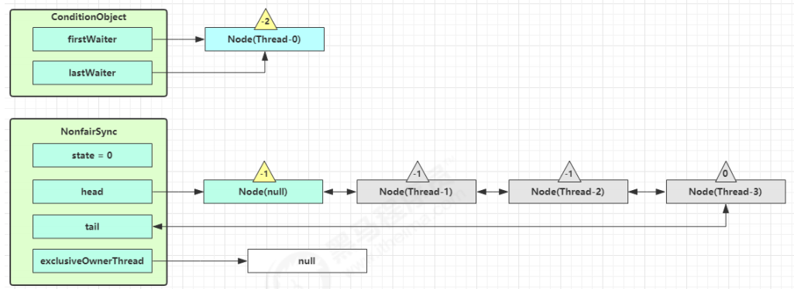

2. unpark AQS 队列中的下一个节点，竞争锁，假设没有其他竞争线程，那么 Thread-1 竞争成功
3. park 阻塞 Thread-0

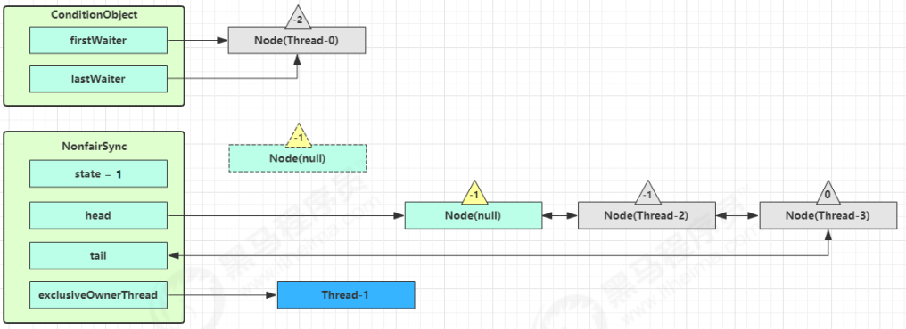

4. 假设 Thread-1 要来唤醒 Thread-0
5. 进入 ConditionObject 的 doSignal 流程，取得等待队列中第一个 Node，即 Thread-0 所在 Node
6. 执行 transferForSignal 流程，将该 Node 加入 AQS 队列尾部，将 Thread-0 的 waitStatus 改为 0，Thread-3 的waitStatus 改为 -1

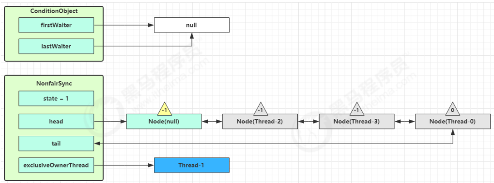

7. Thread-1 释放锁，进入 unlock 流程，略。


## 读写锁ReentrantReadWriteLock：

- 读写锁用的是同一个 Sycn 同步器，因此等待队列、state 等也是同一个

1.  t1 成功上**写锁**，流程与 ReentrantLock 加锁相比没有特殊之处，不同是写锁状态占了 state 的低 16 位，而读锁使用的是 state 的高 16 位
2. t2 执行 r.lock，这时进入读锁的 sync.acquireShared(1) 流程，首先会进入 tryAcquireShared 流程。如果有写锁占据，那么 tryAcquireShared 返回 -1 表示失败
   - -1 表示失败
   - 0 表示成功，但后继节点不会继续唤醒
   - 正数表示成功，而且数值是还有几个后继节点需要唤醒，读写锁返回 1
3. 这时会进入 sync.doAcquireShared(1) 流程，首先也是调用 addWaiter 添加节点，不同之处在于节点被设置为Node.SHARED 模式而非 Node.EXCLUSIVE 模式，注意此时 t2 仍处于活跃状态
4. t2 会看看自己的节点是不是老二，如果是，还会再次调用 tryAcquireShared(1) 来尝试获取锁
5. 如果没有成功，在 doAcquireShared 内 for (;;) 循环一次，把前驱节点的 waitStatus 改为 -1，再 for (;;) 循环一次尝试 tryAcquireShared(1) 如果还不成功，那么在 parkAndCheckInterrupt() 处 park
6. 这种状态下，假设又有 t3 加读锁和 t4 加写锁，这期间 t1 仍然持有锁，就变成了下面的样子

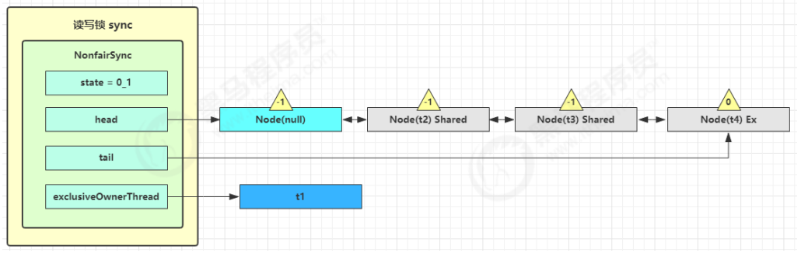

7. 这时会走到写锁的 sync.release(1) 流程，调用 sync.tryRelease(1) 成功。
8. 接下来执行唤醒流程 sync.unparkSuccessor，即让老二恢复运行，这时 t2 在 doAcquireShared 内parkAndCheckInterrupt() 处恢复运行
9. 这回再来一次 for (;;) 执行 tryAcquireShared 成功则让读锁计数加一
10. 这时 t2 已经恢复运行，接下来 t2 调用 setHeadAndPropagate(node, 1)，它原本所在节点被置为头节点

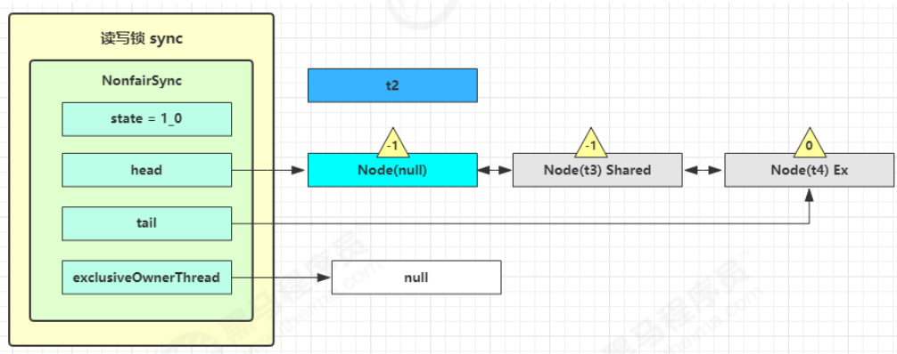

11. 事情还没完，在 setHeadAndPropagate 方法内还会检查下一个节点是否是 shared，如果是则调用doReleaseShared() 将 head 的状态从 -1 改为 0 并唤醒老二，这时 t3 在 doAcquireShared 内parkAndCheckInterrupt() 处恢复运行
12. 这回再来一次 for (;;) 执行 tryAcquireShared 成功则让读锁计数加一
13. 这时 t3 已经恢复运行，接下来 t3 调用 setHeadAndPropagate(node, 1)，它原本所在节点被置为头节点

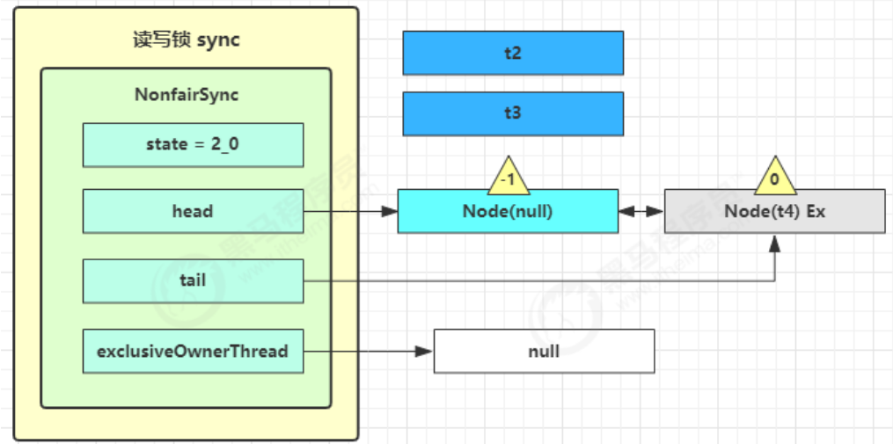

14. 下一个节点不是 shared 了，因此不会继续唤醒 t4 所在节点
15. t2 进入 sync.releaseShared(1) 中，调用 tryReleaseShared(1) 让计数减一，但由于计数还不为零
16. t3 进入 sync.releaseShared(1) 中，调用 tryReleaseShared(1) 让计数减一，这回计数为零了，进入doReleaseShared() 将头节点从 -1 改为 0 并唤醒老二。
17. 之后 t4 在 acquireQueued 中 parkAndCheckInterrupt 处恢复运行，再次 for (;;) 这次自己是老二，并且没有其他竞争，tryAcquire(1) 成功，修改头结点，流程结束。

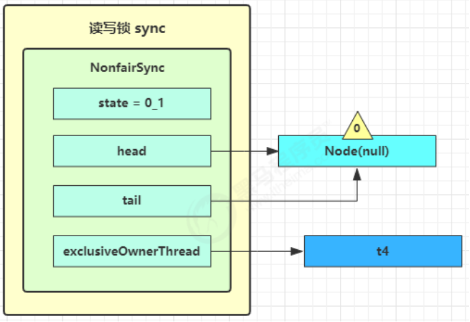


## Semaphore：

1. Semaphore 有点像一个停车场，permits 就好像停车位数量，当线程获得了 permits 就像是获得了停车位，然后停车场显示空余车位减一，刚开始，permits（state）为 3，这时 5 个线程来获取资源
2. 假设其中 Thread-1，Thread-2，Thread-4 cas 竞争成功，而 Thread-0 和 Thread-3 竞争失败，进入 AQS 队列park 阻塞

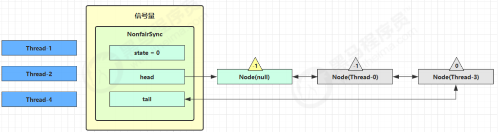

3. 这时 Thread-4 释放了 permits，接下来 Thread-0 竞争成功，permits 再次设置为 0，设置自己为 head 节点，断开原来的 head 节点，unpark 接下来的 Thread-3 节点，但由于 permits 是 0，因此 Thread-3 在尝试不成功后再次进入 park 状态

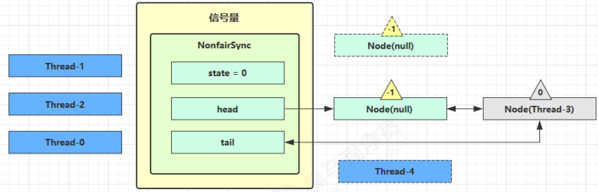

## ConcurrentHashMap-JDK8:

### HashMap

- 首先回顾一下HashMap的原理，是将插入节点进行Hash运算，然后利用拉链法插入hash表中，JDK7是头插，JDK8是尾插法。元素个数超过容量的3/4时会扩容，然后重新计算hash值排列。

- **并发死链：**
  - 究其原因，是因为在多线程环境下使用了非线程安全的 map 集合
  - JDK 8 虽然将扩容算法做了调整，不再将元素加入链表头（而是保持与扩容前一样的顺序），但仍不意味着能够在多线程环境下能够安全扩容，还会出现其它问题（如扩容丢数据）。

### 重要属性和内部类：

1. **属性：**

```java
// 默认为 0
// 当初始化时, 为 -1
// 当扩容时, 为 -(1 + 扩容线程数)
// 当初始化或扩容完成后，为 下一次的扩容的阈值大小
private transient volatile int sizeCtl;
// 整个 ConcurrentHashMap 就是一个 Node[]
static class Node<K,V> implements Map.Entry<K,V> {}
// hash 表
transient volatile Node<K,V>[] table;
// 扩容时的 新 hash 表
private transient volatile Node<K,V>[] nextTable;
// 扩容时如果某个 bin 迁移完毕, 用 ForwardingNode 作为旧 table bin 的头结点
static final class ForwardingNode<K,V> extends Node<K,V> {}
// 用在 compute 以及 computeIfAbsent 时, 用来占位, 计算完成后替换为普通 Node
static final class ReservationNode<K,V> extends Node<K,V> {}
// 作为 treebin 的头节点, 存储 root 和 first
static final class TreeBin<K,V> extends Node<K,V> {}
// 作为 treebin 的节点, 存储 parent, left, right
static final class TreeNode<K,V> extends Node<K,V> {}
```

2. **内部类：**

```java
// 获取 Node[] 中第 i 个 Node
static final <K,V> Node<K,V> tabAt(Node<K,V>[] tab, int i)
// cas 修改 Node[] 中第 i 个 Node 的值, c 为旧值, v 为新值
static final <K,V> boolean casTabAt(Node<K,V>[] tab, int i, Node<K,V> c, Node<K,V> v)
// 直接修改 Node[] 中第 i 个 Node 的值, v 为新值
static final <K,V> void setTabAt(Node<K,V>[] tab, int i, Node<K,V> v)
```

### 构造器：

- 可以看到实现了懒惰初始化，在构造方法中仅仅计算了 table 的大小，以后在第一次使用时才会真正创建

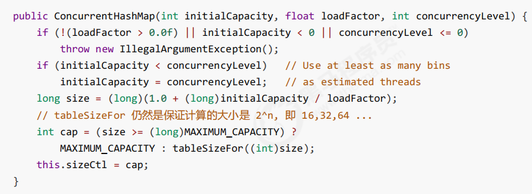

### get流程：

```java
public V get(Object key) {
    Node<K,V>[] tab; Node<K,V> e, p; int n, eh; K ek;
    // spread 方法能确保返回结果是正数
    int h = spread(key.hashCode());
    if ((tab = table) != null && (n = tab.length) > 0 &&
        (e = tabAt(tab, (n - 1) & h)) != null) { 
        // 如果头结点已经是要查找的 key
        if ((eh = e.hash) == h) {
            if ((ek = e.key) == key || (ek != null && key.equals(ek)))
                return e.val;
        }
        // hash 为负数表示该 bin 在扩容中或是 treebin, 这时调用 find 方法来查找
        else if (eh < 0)
            return (p = e.find(h, key)) != null ? p.val : null;
        // 正常遍历链表, 用 equals 比较
        while ((e = e.next) != null) {
            if (e.hash == h &&
                ((ek = e.key) == key || (ek != null && key.equals(ek))))
                return e.val;
        }
    }
    return null;
}
```

### put流程：

- 在链表扩容迁移的时候会给节点打上标记，表示正在迁移。
- 需要加锁时，加的是细粒度的锁，只锁住了更改节点的链表。

## ConcurrentHashMap-JDK7：

它维护了一个 segment 数组，每个 segment 继承了ReentrantLock对应一把锁

- 优点：如果多个线程访问不同的 segment，实际是没有冲突的，这与 jdk8 中是类似的
- 缺点：Segments 数组默认大小为16，这个容量初始化指定后就不能改变了，并且不是懒惰初始化

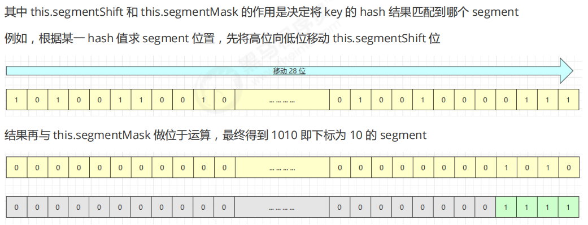

## LinkedBlockingQueue

### 简介：

```java
public class LinkedBlockingQueue<E> extends AbstractQueue<E>
    implements BlockingQueue<E>, java.io.Serializable {
    static class Node<E> {
        E item;
        /**
 * 下列三种情况之一
 * - 真正的后继节点
 * - 自己, 发生在出队时
 * - null, 表示是没有后继节点, 是最后了
 */
        Node<E> next;
        Node(E x) { item = x; }
    }
}
```

1. **入队：**

   - 初始化链表 last = head = new Node<E>(null); Dummy 节点用来占位，item 为 null
   - 当一个节点入队 last = last.next = node;

   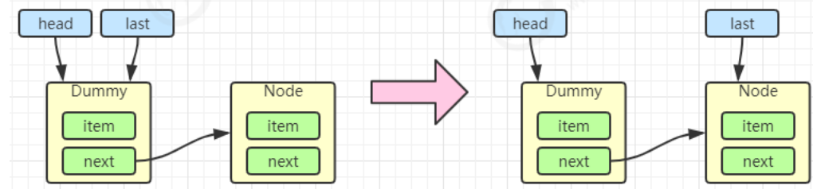

2. **出队：**

```java
Node<E> h = head;
Node<E> first = h.next;
h.next = h; // help GC
head = first;
E x = first.item;
first.item = null;
return x;
```

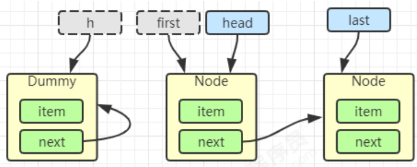

### 加锁分析：

在于用了两把锁和 dummy 节点

- 用一把锁，同一时刻，最多只允许有一个线程（生产者或消费者，二选一）执行
- 用两把锁，同一时刻，可以允许两个线程同时（一个生产者与一个消费者）执行
  - 消费者与消费者线程仍然串行
  - 生产者与生产者线程仍然串行

线程安全分析

- 当节点总数大于 2 时（包括 dummy 节点），putLock 保证的是 last 节点的线程安全，takeLock 保证的是head 节点的线程安全。两把锁保证了入队和出队没有竞争
- 当节点总数等于 2 时（即一个 dummy 节点，一个正常节点）这时候，仍然是两把锁锁两个对象，不会竞争
- 当节点总数等于 1 时（就一个 dummy 节点）这时 take 线程会被 notEmpty 条件阻塞，有竞争，会阻塞

### 性能比较：

主要列举 LinkedBlockingQueue 与 ArrayBlockingQueue 的性能比较

- Linked 支持有界，Array 强制有界
- Linked 实现是链表，Array 实现是数组
- Linked 是懒惰的，而 Array 需要提前初始化 Node 数组
- Linked 每次入队会生成新 Node，而 Array 的 Node 是提前创建好的
- Linked 两把锁，Array 一把锁

## ConcurrentLinkedQueue

ConcurrentLinkedQueue 的设计与 LinkedBlockingQueue 非常像，也是

- 两把【锁】，同一时刻，可以允许两个线程同时（一个生产者与一个消费者）执行
- dummy 节点的引入让两把【锁】将来锁住的是不同对象，避免竞争
- 只是这【锁】使用了 cas 来实现

事实上，ConcurrentLinkedQueue 应用还是非常广泛的

- 例如之前讲的 Tomcat 的 Connector 结构时，Acceptor 作为生产者向 Poller 消费者传递事件信息时，正是采用了ConcurrentLinkedQueue 将 SocketChannel 给 Poller 使用

## CopyOnWriteArrayList

- CopyOnWriteArraySet 是它的马甲 底层实现采用了 写入时拷贝 的思想，增删改操作会将底层数组拷贝一份，更改操作在新数组上执行，这时不影响其它线程的**并发读**，**读写分离**。 

```java
public boolean add(E e) {
    synchronized (lock) {
        // 获取旧的数组
        Object[] es = getArray();
        int len = es.length;
        // 拷贝新的数组（这里是比较耗时的操作，但不影响其它读线程）
        es = Arrays.copyOf(es, len + 1);
        // 添加新元素
        es[len] = e;
        // 替换旧的数组
        setArray(es);
        return true;
    }
}
```

- 其它读操作并未加锁，适合『读多写少』的应用场景
- get是弱一致性的：线程1先取到了list然后，线程2对list进行了修改并覆盖，但线程1拿到的还是旧的引用还是能读到原来的内容。

```java
CopyOnWriteArrayList<Integer> list = new CopyOnWriteArrayList<>();
list.add(1);
list.add(2);
list.add(3);
Iterator<Integer> iter = list.iterator();
new Thread(() -> {
    list.remove(0);
    System.out.println(list);
}).start();
sleep(1000);
while (iter.hasNext()) {
    System.out.println(iter.next());
}
```

- 不要觉得弱一致性就不好
  - 数据库的 MVCC 都是弱一致性的表现
  - 并发高和一致性是矛盾的，需要权衡

