# 基础：

## JVM简介：

### JVM是什么：

- JVM本质上是一个运行在计算机上的程序，他的职责是**运行Java字节码文件。**

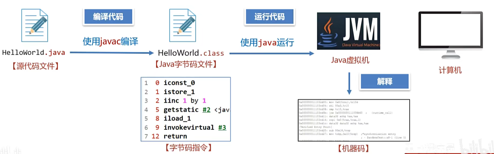

### JVM功能：

1. **解释和运行：**对字节码文件中的指令，实时的解释成机器码，让计算机执行。
2. **内存管理：**自动为对象、方法等分配内存。自动的垃圾回收机制，回收不再使用的对象。
3. **即时编译：**对热点代码进行优化，提升执行效率。

### **JVM组成：**

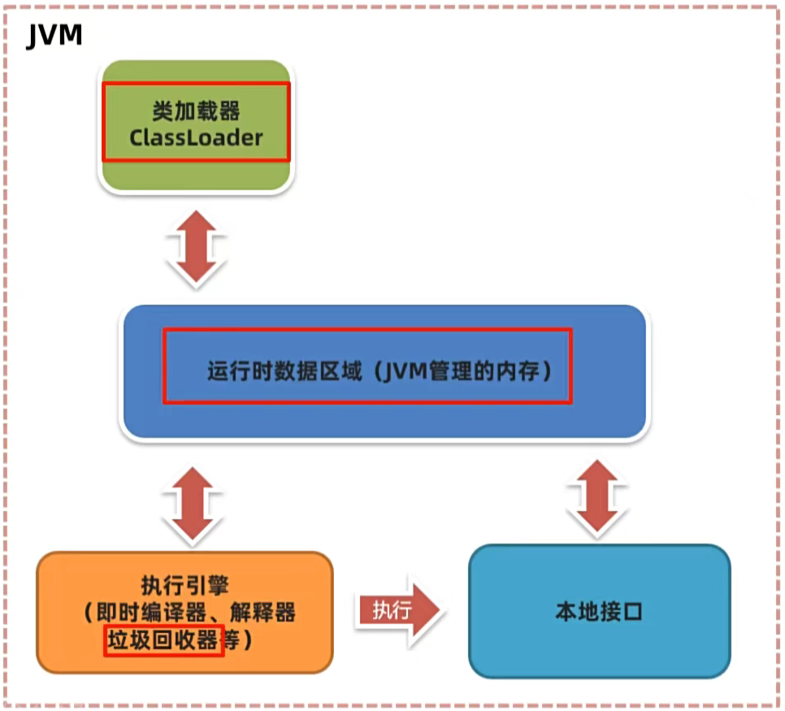

## 字节码：

### 字节码重要组成：

- **基本信息：**魔数、字节码文件对应的ava版本号访问标识(public final等等)父类和接口。
- **常量池：**保存了字符串常量、类或接口名、字段名主要在字节码指令中使用。
- **字段：**当前类或接口声明的字段信息。
- **方法：**当前类或接口声明的方法信息字节码指令。
- **属性：**类的属性，比如源码的文件名内部类的列表等。

### 基本信息：

- JDK1.2之后大版本号计算方法就是:主版本号-44，比如主版本号52就是JDK8。
- 当版本冲突时，推荐将第三方依赖的版本号降低或者更换依赖，以满足JDK版本的要求，如果更换jdk版本可能引发其他兼容性问题。
- 软件使用文件的头几个字节(文件头)去校验文件的类型，如果软件不支持该种类型就会出错。Java字节码文件中，将文件头称为magic魔数。

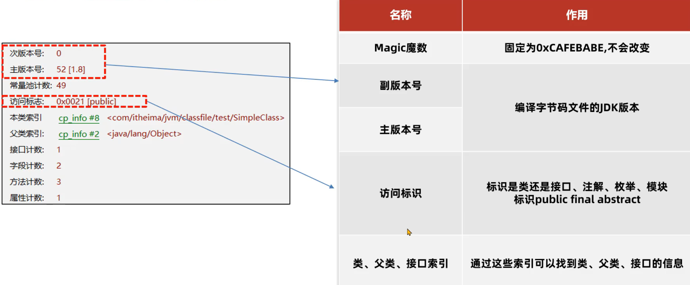

### 常量池：

常量池中的数据都有一个编号，编号从1开始。在字段或者字节码指令中通过编号可以快速的找到对应的数据。字节码指令中通过编号引用到常量池的过程称之为符号引用。

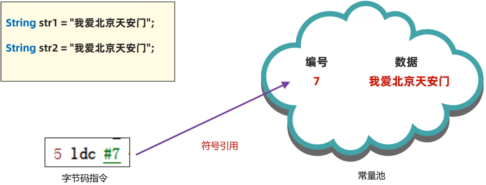

### 方法：

- 局部变量存放在局部变量表组中，需要定义和运算时需要先把数据放入操作数栈中，然后进行运算，下面源码的字节码如下：

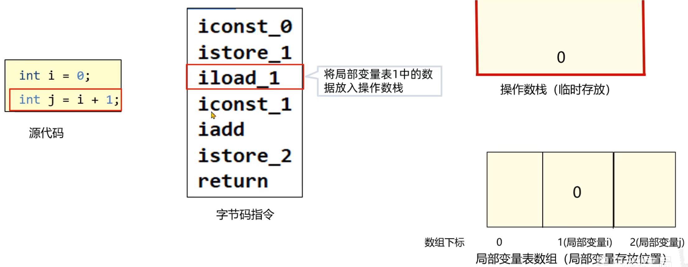

**为什么int i = 0;  i = i ++;最后i = 0：**通过分析字节码指令发现，i++先把0取出来放入临时的操作数栈中，接下来对i变量表中的i进行加1，i变成了1，最后再将之前保存的临时值0放入i，最后就变成了0。如果是++i会先将变量表中的i+1再放入操作数栈。

### 字节码文件工具：

1. 服务器上可以输入javap -v字节码文件名称查看具体的字节码信息。(如果jar包需要先使用jar-xvf命令解压)

2. 本地文件可以用jclasslib插件。
3. 服务器上也可以用arthas查看字节码，还可以反编译字节码。

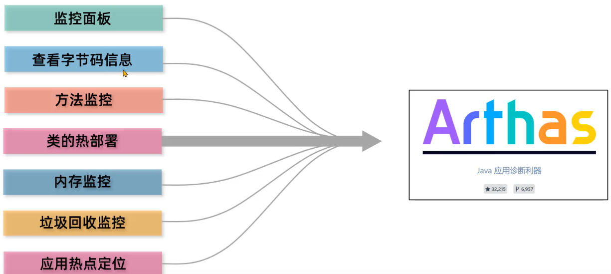

## 类生命的周期：

### 概述：

类的声明周期分为：加载——连接（验证--准备--解析）——初始化——使用——卸载。

### 加载阶段：

1. 加载(Loading)阶段第一步是类加载器根据类的全限定名通过不同的渠道以二进制流的方式获取字节码信息。程序员可以使用Java代码拓展的不同的渠道。
2. 类加载器在加载完类之后，**`Java虚拟机会将字节码中的信息保存到内存的方法区中`**。生成一个InstanceKlass对象，保存类的所有信息，里边还包含实现特定功能比如多态的信息。
3. 同时，**`Java虚拟机还会在堆中生成一份与方法区中数据类似的java.lang.Class对象`**。作用是在Java代码中去获取类的信息以及存储静态字段的数据(JDK8及之后)，程序员操作的基本就是这个堆区中的对象。

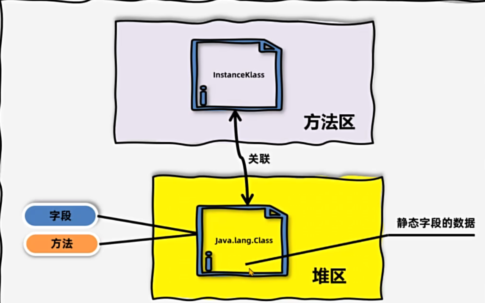

### 连接阶段：

1. **验证：**连接(Linking)阶段的第一个环节是验证，验证的主要目的是检测Java字节码文件是否遵守了《Java虚拟机规范》中的约束。这个阶段一般不需要程序员参与。
2. **准备：**准备阶段为堆区静态变量(static)分配内存并设置初始值（是一个约定的默认值），final修饰的基本数据类型的静态变量，准备阶段直接会将代码中的值进行赋值。
3. **解析：**解析阶段主要是将常量池中的符号引用替换为直接引用。直接引用不在使用编号，而是使用内存中地址进行访问具体的数据。
   - JVM 在解析阶段会把不会产生多态的方法（如 static、private 等）的符号引用转换为直接引用；而可能被重写的虚方法，则保留符号引用，在运行时通过对象的实际类型查找虚方法表（vtable），完成动态分派，最终获得直接引用并执行。

### 初始化阶段：

1. `初始化阶段会执行静态代码块中的代码，并为静态变量赋值。`初始化阶段会执行字节码文件中clinit部分的字节码指令。
2. clinit方法中的执行顺序与Java中编写的顺序是一致的。

- **以下几种方式会导致类的初始化:**
  1.访问一个类的静态变量或者静态方法，注意变量是final修饰的并且等号右边是常量不会触发初始化。
  2.调用Class.forName(String className).
  3.new一个该类的对象时。
  4.执行Main方法的当前类。

- **clinit指令在特定情况下不会出现，比如:**
  1.无静态代码块且无静态变量赋值语句。
  2.有静态变量的声明，但是没有赋值语句，这个在准备阶段就被赋了初值。
  3.静态变量的定义使用final关键字，这类变量会在准备阶段直接进行初始化。

- **特殊情况：**

1. 直接访问父类的静态变量，不会触发子类的初始化。
2. 子类的初始化clinit调用之前，会先调用父类的clinit初始化方法。
3. 数组的创建不会导致数组中元素的类进行初始化。
4. final修饰的变量如果赋值的内容需要执行指令才能得出结果，会执行clinit方法进行初始化。

### 类的卸载：

一个类可以被卸载，需要同时满足下面三个条件：

1. 此类所以实例对象都被回收，在堆中不存在任何该类的实例对象和子类对象。
2. 加载类的类加载器已经被回收。
3. 该类对应的java.lang.Class对象没有在任何地方被引用。

## 类加载器：

类加载器(ClassLoader)负责在类加载过程中的字节码获取并加载到内存这一部分。通过加载字节码数据放入内存转换成byte[]，接下来调用虚拟机底层方法将byte[]转换成方法区和堆中的数据。

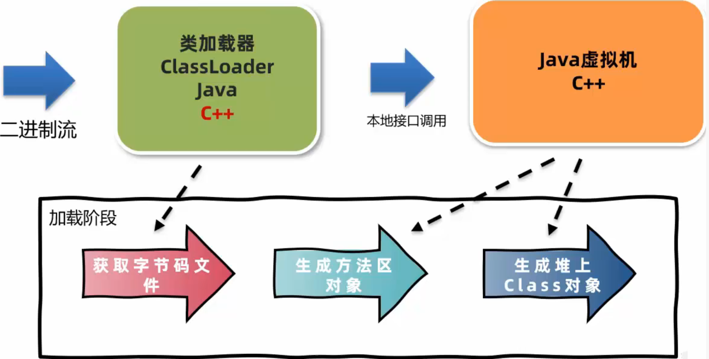

### 类加载器分类：

类加载器分为两类，一类是Java代码中实现的，一类是Java虚拟机底层源码实现的。类加载器的设计JDK8和8之后的版本差别较大，JDK8及之前的版本中默认的类加载器有如下几种:

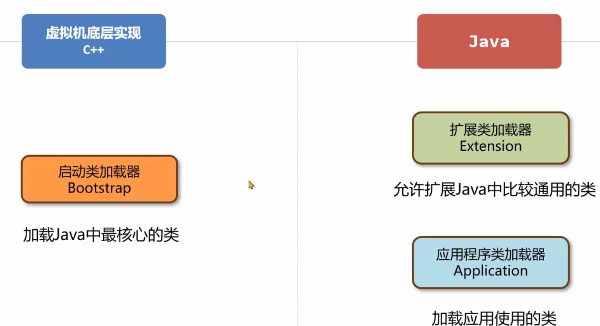

### 启动类加载器：

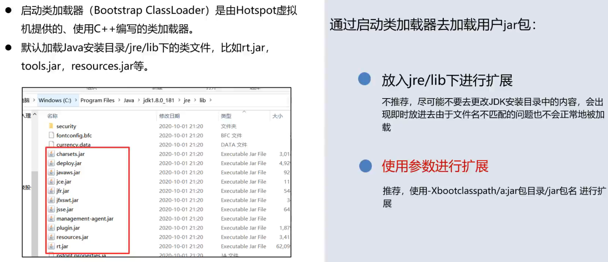

### 扩展和应用程序加载器：

- 扩展类加载器和应用程序类加载器都是JDK中提供的、使用Java编写的类加载器。
- 它们的源码都位于sun.misc.Launcher中，是一个静态内部类。继承自URLClassLoader。具备通过目录或者指定jar包将字节码文件加载到内存中。

1. **概述：**

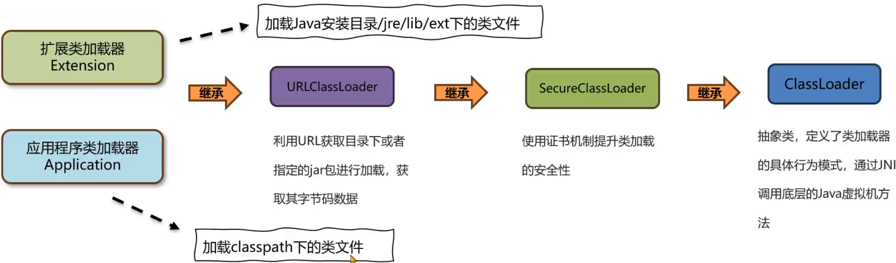

2. **扩展类加载器：**

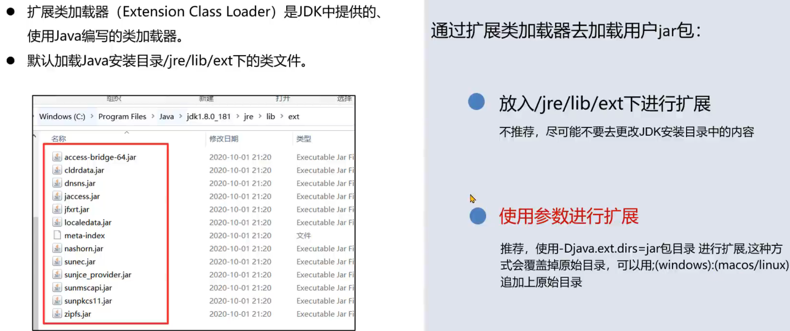

### **双亲委派机制：**

- **双亲委派机制指的是:**当一个类加载器去加载某个类的时候，会自底向上查找是否加载过，如果加载过就直接返回，如果一直到最顶层的类加载器都没有加载，再由顶向下进行加载。
- **加载器关系：**应用程序类加载器的父类加载器是扩展类加载器，扩展类加载器的父类加载器是启动类加载器。
- **双亲委派机制的好处有两点:**第一是避免恶意代码替换JDK中的核心类库，比如java.lang.String，确保核心类库的完整性和安全性。第二是避免一个类重复地被加载。
- 如果是不存在的类会抛出一个错误。

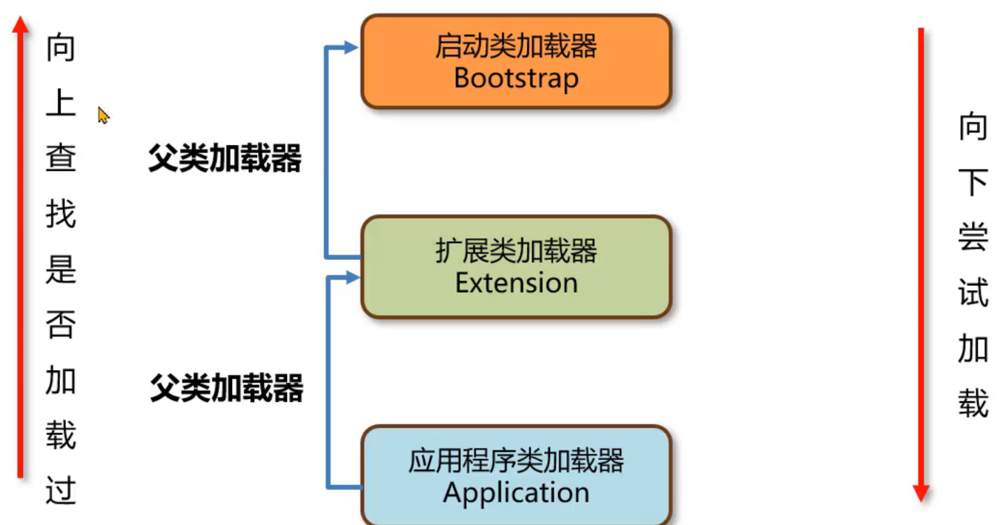

### 打破双亲委派机制：

#### **自定义类加载器：**

- Tomcat使用了自定义类加载器来实现应用之间类的隔离。每一个应用会有一个独立的类加载器加载对应的类。

1. 先来分析ClassLoader的原理，ClassLoader中包含了4个核心方法。双亲委派机制的核心代码就位于loadClass方法中：

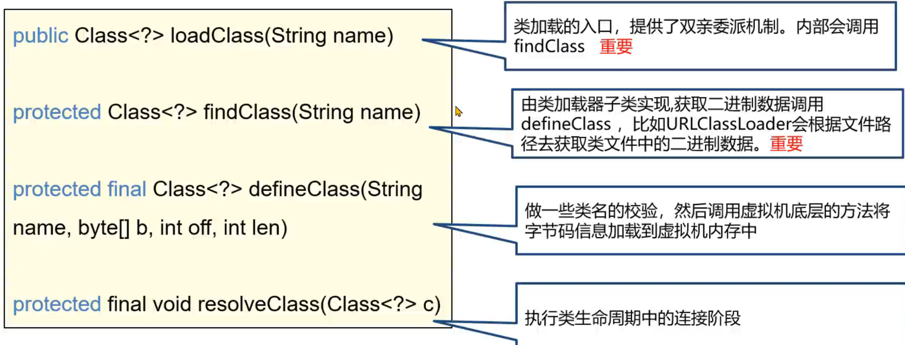

2. 阅读双亲委派机制的核心代码，分析如何通过自定义的类加载器打破双亲委派机制。打破双亲委派机制的核心就是重写loadclass方法，再loadclass方法中打破双亲委派。

```java
//parent等于null说明父类加载器是启动类加载器，直接调用findBootstrapClassOrNull
//否则调用父类加载器的加载方法
if (parent!= null){
    c= parent.loadClass(name,false);
}else{
    c= findBootstrapClassOrNull(name);
}
//父类加载器爱莫能助，我来加载!
if (C==null)
    c= findClass(name);
```


3. 正确的去实现一个自定义类加载器的方式是重写findClass方法，这样不会破坏双亲委派机制。
4. **注意：**只有相同类加载器+相同的类限定名才会被认为是同一个类，才不会重新加载。

#### **线程上下文加载器：**

1. JDBC案例：

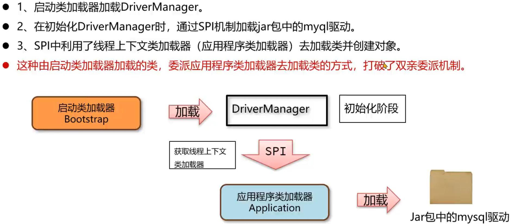

2. SPI机制：

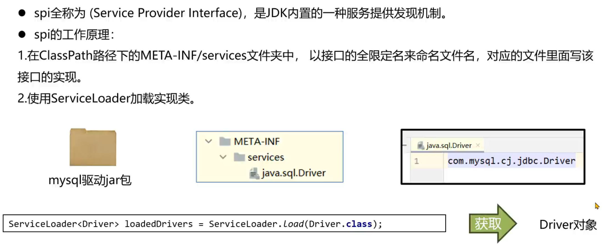

- 但正常情况下mysql驱动位于classpath，就应该由应用程序类加载器加载，所以严格的来说这样的方式没有打破双亲委派机制。

#### OSGi模块化：

- 历史上，OSGi模块化框架。它存在同级之间的类加载器的委托加载。OSGi还使用类加载器实现了热部署的功能。

- **arthas热部署思路：**

1. 在出问题的服务器上部署一个arthas，并启动。
2. jad --source-only类全限定名>目录/文件名.java。jad命令反编译，然后可以用其它编译器，比如vim来修改源码
3. mc-c类加载器的hashcode目录/文件名.java -d 输出目录。mc命令用来编译修改过的代码
4. retransform class文件所在目录/xxx.class。用retransform命令加载新的字节码

- 注意：

1. 程序重启之后，字节码文件会恢复，除非将class文件放入jar包中进行更新。
2. 使用retransform不能添加方法或者字段，也不能更新正在执行中的方法。

### JDK9之后的类加载器：

- JDK8及之前的版本中，扩展类加载器和应用程序类加载器的源码位于rtjar包中的sun.misc.Launcherjava。

- 由于JDK9引入了module的概念（要加载的组件变为module），类加载器在设计上发生了很多变化。

1. 启动类加载器使用Java编写，位于jdk.internal.loader.ClassLoaders类中。Java中的BootClassLoader继承自BuiltinClassLoader实现从模块中找到要加载的字节码资源文件。启动类加载器依然无法通过java代码获取到，返回的仍然是null，保持了统一。
2. 扩展类加载器被替换成了平台类加载器(Platform Class Loader).平台类加载器遵循模块化方式加载字节码文件，所以继承关系从URLClassLoader变成了BuiltinClassLoader,BuiltinClassLoader实现了从模块中加载字节码文件。平台类加载器的存在更多的是为了与老版本的设计方案兼容，自身没有特殊的逻辑。

## 运行时数据区（JVM内存管理）：

- **概览：**

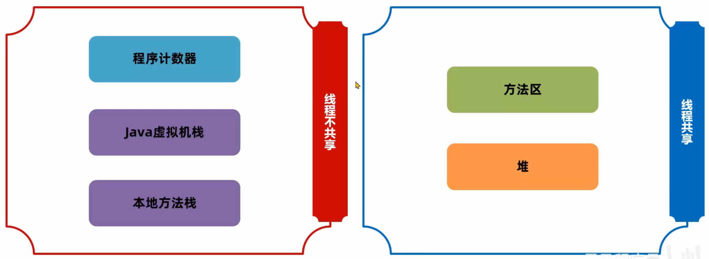

### 程序计数器：

- 程序计数器记录这下一条运行的字节码地址。

- 程序计数器可以控制程序指令的进行，实现分支、跳转、异常等逻辑。
- 在多线程执行情况下，Java虚拟机需要通过程序计数器记录CPU切换前解释执行到那一句指令并继续解释运行。
- 因为每个线程只存储一个固定长度的内存地址，程序计数器是不会发生内存溢出的。程序员无需对程序计数器做任何处理。

### 栈：

- java虚拟机栈保存的是java代码编写的方法，本地方法栈保存的是c++代码编写的方法，本质都一样。在Hotspot虚拟机中，他们两个实现上使用了同一个栈空间，本地方法栈会在栈内存上生成一个栈帧，临时保存方法的参数同时方便出现异常时也把本地方法的栈信息打印出来。

#### java虚拟机栈

- Java虚拟机栈随着线程的创建而创建，而回收则会在线程的销毁时进行。由于方法可能会在不同线程中执行，每个线程都会包含一个自己的虚拟机栈。java虚拟机栈中包括：局部变量表、操作数栈、帧数据。

1. **局部变量表：**

   - 局部变量表的作用是在方法执行过程中存放用听有的局部变量。编译成字节码文件时就可以确定局部变量表的内容。
   - 栈帧中的局部变量表是一个数组，数组中每一个位置称之为槽(slot)，long和double类型占用两个槽，其他类型占用一个槽。
   - 实例方法中的序号为0的位置存放的是this，指的是当前调用方法的对象，运行时会在内存中存放实例对象的地址。

   - 方法参数也会保存在局部变量表中，其顺序与方法中参数定义的顺序一致。
   - 局部变量表保存的内容有:实例方法的this对象，方法的参数，方法体中声明的局部变量。
   - 为了节省空间，局部变量表中的槽是可以复用的，一旦某个局部变量不再生效，当前槽就可以再次被使用。

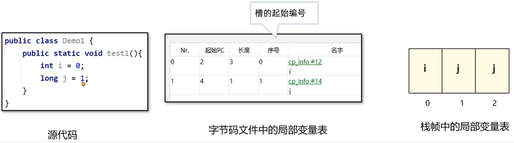

2. **操作数栈：**保存临时使用的变量栈

   - 操作数栈是栈帧中虚拟机在执行指令过程中用来存放中间数据的一块区域。他是一种栈式的数据结构，如果一条指令将一个值压入操作数栈，则后面的指令可以弹出并使用该值。

   - 在编译期就可以确定操作数栈的最大深度，从而在执行时正确的分配内存大小。

3. **帧数据：**保存跳转地址
   - 当前类的字节码指令引用了其他类的属性或者方法时，需要将符号引用(编号)转换成对应的运行时常量池中的内存地址。动态链接就保存了编号到运行时常量池的内存地址的映射关系。
   - 方法出口指的是方法在正确或者异常结束时，当前栈帧会被弹出，同时程序计数器应该指向上一个栈帧中的下一条指令的地址。所以在当前栈帧中，需要存储此方法出口的地址。
   - 异常表存放的是代码中异常的处理信息，包含了异常捕获的生效范围以及异常发生后跳转到的字节码指令位置。

#### 内存溢出：

- 要修改Java虚拟机栈的大小，可以使用虚拟机参数-Xss [栈大小]。
- HotSpot JVM对栈大小的最大值和最小值有要求:Windows(64位)下的JDK8测试最小值为180k，最大值为1024m。
- 局部变量过多、操作数栈深度过大也会影响栈的内存大小。
- 一般情况下，工作中即便使用了递归进行操作，栈的深度最多也只能到几百，不会出现栈的溢出。所以此参数可以手动指定为-Xss256k节省内存。

### 堆：

- **简介：**一般Java程序中堆内存是空间最大的一块内存区域，创建出来的对象都存在于堆上。栈上的局部变量表中，可以存放堆上对象的引用。静态变量也可以存放堆对象的引用，通过静态变量就可以实现对象在线程之间共享。

1. 堆空间有三个需要关注的值，used、totamax、used指的是当前已使用的堆内存，total是java虚拟机已经分配的可用堆内存，max是java虚拟机可以分配的最大堆内存。
2. 如果堆内存不足，java虚拟机就会不断的分配内存，total值会变大。total最多只能与max相等。但实际情况下因为垃圾回收机制total是不会等于max的。
3. 如果不设置任何的虚拟机参数，max默认是系系统内存的1/4，total默认是系统内存的1/64。在实际应用中一般都需要设置total和max的值。要修改堆的大小，可以使用虚拟机参数-Xmx(max最大值)和-Xms(初始的total)。建议将这两个值设为相同的，这样会减少申请分配内存花费的时间。
4. arthas中的heap堆内存使用了JMX技术中内存获取方式，这种方式与垃圾回收器有关，计算的是可以分配对象的内存，而不是整个内存。

### 方法区：

- 方法区主要包含类的**元信息、运行时常量池、字符串常量池。**

1. 方法区是虚拟概念，每款Java虚拟机在实现上都各不相同。Hotspot设计如下:
   - JDK7及之前的版本将方法区存放在堆区域中的永久代空间，堆大小由虚拟机参数控制。
   - JDK8及之后的版本将方法区存放在元空间中，元空间位于操作系统维护的直接内存中，默认情况下只要不超过操作系统承受的上限，可以一直分配。

2. 实验发现，JDK7上运行大概十几万次，就出现了错误。在JDK8上运行百万次，程序都没有出现任何错误，但是内存会直线升高。这说明JDK7和JDK8在方法区的存放上，采用了不同的设计。

   - JDK7将方法区存放在堆区域中的永久代空间，堆的大小由虚拟机参数-XX:MaxPermSize=值来控制。

   - JDK8将方法区存放在元空间中，元空间位于操作系统维护的直接内存中，默认情况下只要不超过操作系统承受的上限，可以一直分配。可以使用-XX:MaxMetaspaceSize=值将元空间最大大小进行限制。

3. **元信息：**如类名、方法名、字段信息、访问修饰符、字节码等`，保存类的结构信息（Class metadata），不包括实例数据。`

4. **运行时常量池：**存储`编译期生成的字面量（具体的值）和符号引用（如类名、方法名、字段名的字符串描述）不是实际对象`，存储在元空间。

5. **字符串常量池：**早期设计时，字符串常量池是属于运行时常量池的一部分，他们存储的位置也是一致的。后续做出了调整将字符串常量池和运行时常量池做了拆分，**静态变量和字符串常量池等放入堆中**。
   - JDK7及之后版本中由于字符串常量池在堆上，所以intern()方法会把第一次遇到的字符串的引用放入字符串常量池。`因为对象也在堆上所以这两者的引用是相同的。`

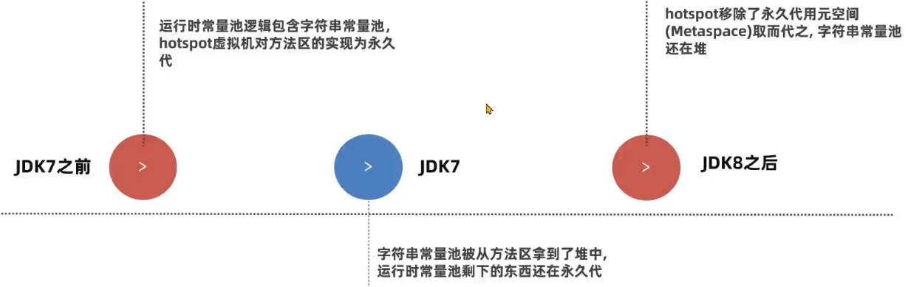

- **一个问题困扰我很久（Jdk8之后）：**我理解的是——字符串和静态变量是在堆区的，基本类型常量是在元空间，static final类型是在元空间。
  - **例子：**


```java
public class StorageExample {
    // 1. 编译时常量 - 运行时常量池
    public static final int MAX_USERS = 1000;          // ✅ 运行时常量池
    public static final String APP_NAME = "MyApp";     // ✅ 运行时常量池（引用）
    // 2. 静态变量 - 堆中Class对象
    public static int instanceCount = 0;               // ✅ 堆中Class对象
    public static String defaultConfig;                // ✅ 堆中Class对象（引用）

    // 3. 实例常量 - 在对象中，但值可能在运行时常量池
    private final int id;                              // ❌ 每个对象都有
    private final String uid = generateUID();          // ❌ 运行时确定，不在常量池

    // 4. 实例变量 - 在每个对象中
    private String name;                               // ❌ 每个对象都有
    private int age;                                   // ❌ 每个对象都有

    // 5. 方法中的字面量
    public void printInfo() {
        String version = "v1.0";     // "v1.0"在运行时常量池，version是局部变量在栈
        int retryCount = 3;          // 3在运行时常量池，retryCount在栈
    }
}
```
### 直接内存：

- 直接内存(Direct Memory)并不在《Java虚拟机规范》中存在，所以并不属于Java运行时的内存区域。在JDK1.4中引入了NIO机制，使用了直接内存，主要为了解决以下两个问题:

1. Java堆中的对象如果不再使用要回收，回收时会影响对象的创建和使用。
2. IO操作比如读文件，需要先把文件读入直接内存(缓冲区)再把数据复制到Java堆中。
3. 现在直接放入直接内存即可，同时Java堆上维护直接内存的引用，减少了数据复制的开销。写文件也是类似的思路。

- 如果需要手动调整直接内存的大小，可以使用-XX:MaxDirectMemorySize=大小

- JDK6及之前：

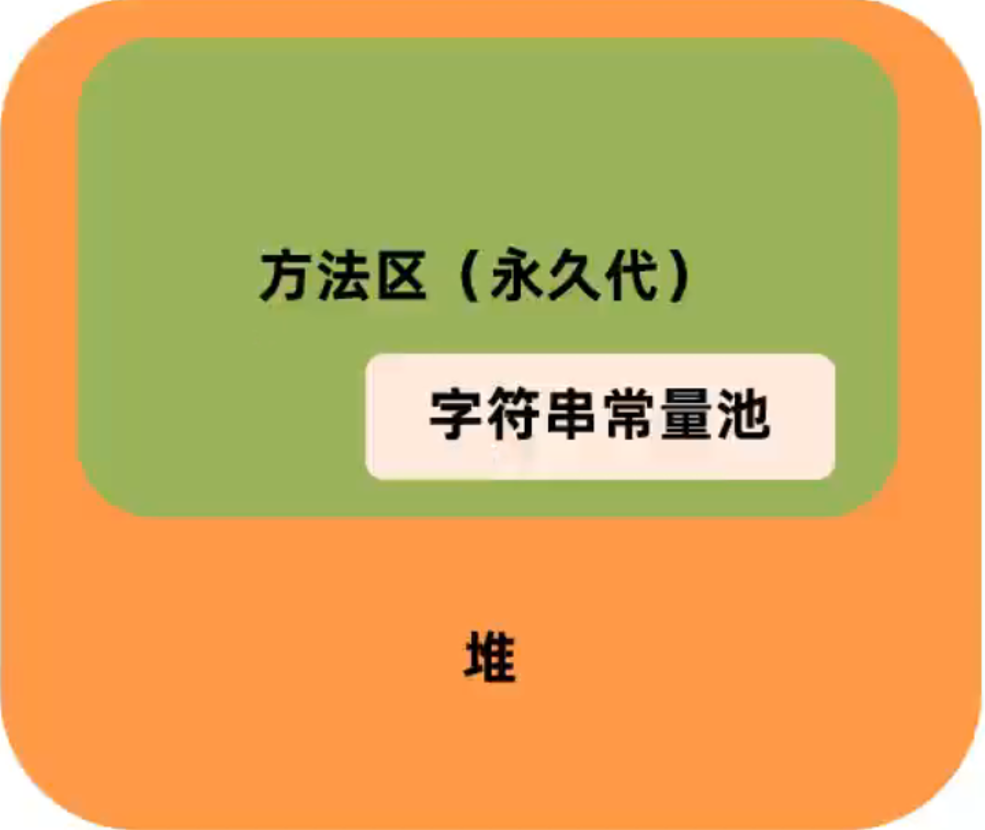

- JDK7：

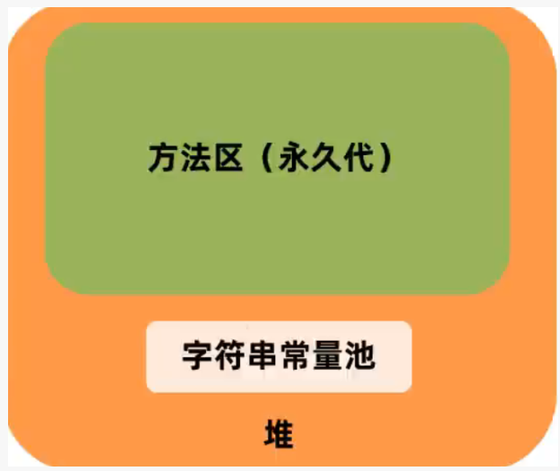

- JDK8：

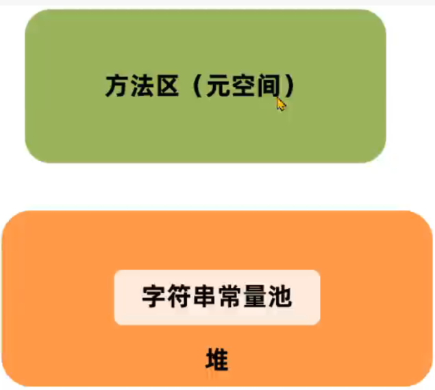

- **`例子：`**静态归元空间，实例归堆，局部归栈。

## 自动垃圾回收：

### 方法区回收：

- 方法区中能回收的内容主要就是不再使用的类。判断一个类可以被卸载，需要同时满足下面三个条件：

  1. 此类所以实例对象都被回收，在堆中不存在任何该类的实例对象和子类对象。


  2. 加载类的类加载器已经被回收。


  3. 该类对应的java.lang.Class对象没有在任何地方被引用。


- 如果需要手动触发垃圾回收，可以调用System.gc()方法。

- 开发中此类场景一般很少出现因为类加载器一般不会被回收，主要在如OSGi、JSP的热部署等应用场景中。每个jsp文件对应一个唯一的类加载器，当一个jsp文件修改了，就直接卸载这个jsp类加载器。重新创建类加载器，重新加载jsp文件。

### 堆回收：

#### 引用计数法：

Java中的对象能否被回收，是根据对象是否被引用决定的。如果对象被引用了，说明该对象还在使用，不允许被回收。

- 引用计数法会为每个对象维护一个引用计数器，当对象被引用时+1，取消引用时-1。

引用计数法缺点：

1. 每次引用和取消引用需要维护计数器，对系统性能存在影响。
2. 存在循环引用问题，当A引用B，B引用A会导致对象无法回收。

- JVM中没有用这种方法，因为要解决循环引用问题。


#### 可达性分析算法：

可达性分析将对象分为2类：垃圾回收的根对象（GC Root）和普通对象。对象与对象之间存在引用关系。GC Root对象一般是不可回收的，可达性分析算法指如果从某个到GC Root对象是可达的，对象就不可被回收。

- 能被称为GC Root对象的是下面4类对象：

1. `线程Thread对象（创建线程之后，整个线程对象）`，引用线程栈帧中的方法参数、`局部变量`等。

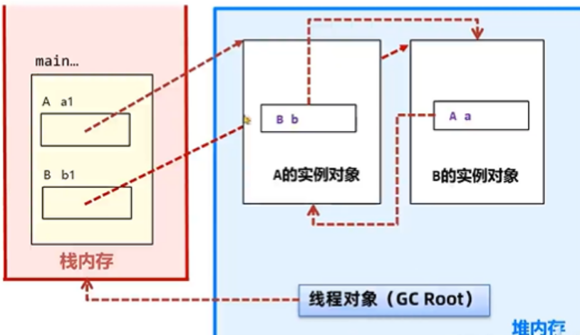

2. `系统类加载器加载的java.lang.Class对象`，引用类中的静态变量。
3. 监视器对象，用来保存同步锁synchronized关键字持有的对象。
4. 本地方法调用时使用的全局对象。

#### 软引用：

`可达性算法中描述的对象引用，一般指的是强引用`，即GCRoot对象对普通对象有引用关系，只要这层关系存在，普通对象就不会被回收。除了强引用外，Java还设计了其它引用方式。

- 软引用相对于强引用是一种比较弱的引用关系，如果一个对象只有软引用关联到它，当程序内存不足时，就会将软引用中的数据进行回收。

- 软引用的执行过程如下：

1. 将对象使用软引用包装起来，new SoftReference<对象类型>(对象)。
2. 内存不足时，虚拟机尝试进行垃圾回收。
3. 如果垃圾回收仍不能解决内存不足的问题，回收软引用中的对象。
4. 如果依然内存不足，抛出OutOfMemory异常。

- 软引用中的对象如果在内存不足时回收，SoftReferece对象本身也需要被回收。SoftReference提供了一套队列机制：

1. 软引用创建时，通过构造器传入引用队列。
2. 在软引用中包含的对象被回收时，该软引用对象会被放入引用队列。
3. 通过代码遍历引用队列，将SoftReference的强引用删除。

#### 其他引用：

1. **弱引用：**整体机制和软引用基本一致，区别在于弱引用包含的对象在垃圾回收时，不管内存够不够都会直接被回收。在JDK1.2版之后提供了WeakReference类来实现弱引用，弱引用主要在ThreadLocal中使用。弱引用对象本身也可以使用引用队列进行回收。
2. **虚引用：**虚引用也叫幽灵引用/幻影引用，不能通过虚引用对象获取到包含的对象。虚引用唯一的用途是当对象被垃圾回收器回收时可以接收到对应的通知。Java中使用PhantomReference实现了虚引用，直接内存中为了及时知道直接内存对象不再使用，从而回收内存，使用了虚引用来实现。
3. **终结器引用：**终结器引用指的是在对象需要被回收时，对象将会被放置在Finalizer类中的引用队列中，并在稍后由一条由FinalizerThread线程从队列中获取对象，然后执行对象的finalize方法。在这个过程中可以在finalize方法中再将自身对象使用强引用关联上，但是不建议这样做，如果耗时过长会影响其他对象的回收。

### 垃圾回收算法：

#### 垃圾回收算法的评价标准

- 垃圾回收要做的有2件事；

1. 找到内存中存活的对象。（可达性分析法，GC Root是否关联）
2. 释放不再存活对象的内存，使得程序能再次利用这部分空间。

- Java垃圾回收过程会通过单独的GC线程来完成，但是不管使用哪一种GC算法，都会有部分阶段需要停止所有的用户线程。这个过程称之为Stop The World简称STW，如果STW时间过长则会影响用户的使用。判断GC算法是否优秀，可以从3个方面考虑：

1. **吞吐量：**吞吐量指的是CPU用于执行用户代码的时间与CPU总执行时间的比值，即吞吐量=执行用户代码时间/（执行用户代码时间+GC时间）。吞吐量数值越高，垃圾回收的效率就越高。
2. **最大暂停时间：**最大暂停指的是所有在垃圾回收过程中的STW时间最大值。最大暂停时间越短，用户使用系统时受到的影响就越短。
3. **堆使用的效率：**不同的垃圾回收算法，对堆内存的使用方式是不同的。标记清除法，可以使用完整的堆内存。复制算法会将堆内存一分为二，每次只使用一半内存。从堆使用效率上说，标记清除法要优于复制算法。

#### 标记清除算法：

1. 标记阶段：将所有存活的对象进行标记。Java中使用可达性分析算法，从GC Root开始通过引用链遍历出所有存活对象。
2. 清除阶段：从内存中删除没有被标记的非存活对象。

**优点：**实现简单，只需要在第一阶段给每个对象维护标志位，第二阶段删除对象即可。

**缺点：**

1. 碎片化问题。由于内存是连续的，所有对象被删除之后，内存中会出现很多细小可用的内存单元。如果我们需要的是一个比较大的空间，很有可能这些内存单元的大小过小，无法进行分配。
2. 分配速度慢。由于内存碎片存在，需要维护一个空闲链表，极有可能发生每次需要遍历到链表最后才能获得合适的内存空间。

#### 复制算法：

复制算法的核心思想是：

1. 准备2块空间From空间和To空间，每次在对象分配阶段，只能使用其中一块空间（From空间）。
2. 在垃圾回收GC阶段，将From中存活对象复制到To空间。
3. 将两块空间的From和To名字互换。

**复制算法的优点：**

1. 吞吐量高。复制算法只需要遍历一次存活对象复制到To空间即可。比标记-整理算法少了一次遍历的过程，因此性能比较好，但是不如标记-清除算法，因为标记清除算法不需要进行对象的移动。
2. 不会发生碎片化。复制算法在复制之后就会将对象按顺序存放入To空间，所以对象以外的区域都是可用空间，不存在碎片化内存空间。

**缺点：**内存使用效率低。每次只能让一半的内存空间来为创建对象使用。

#### 标记整理算法：

标记整理算法也叫标记压缩算法，是对标记清理算法中容易产生内存碎片问题的一种解决方案。核心思想分为2个阶段：

1. 标记阶段。将所有存活对象进行标记。Java中使用可达性分析算法，从GC Root开始通过引用链遍历出所有存活对象。
2. 整理阶段。将存活对象移动到堆的一端。清理掉存活对象的内存空间。

优点：

1. 内存使用效率高。整个堆内存都可以使用，不会像复制算法只能使用半个堆内存。
2. 不会发生碎片化。在整理的阶段

缺点：整理阶段的效率不高。整理算法有很多种，比如Lisp2整理算法需要对整个堆中的对象搜索3次，整体性能不佳。可以通过Two-Finger、表格算法、ImmixGc等高效的整理算法优化此阶段的性能。

#### 分代垃圾回收算法：

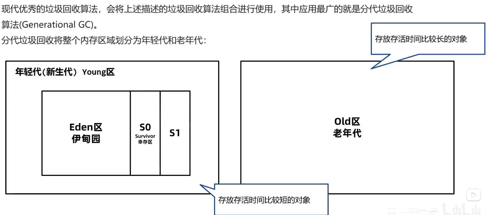

1. 分代回收时，创建出来的对象，首先会被放入Eden伊甸园区。
2. 随着对象在Eden区越来越多，如果Eden区满，新创建的对象已经无法放入，就会触发年轻代的GC，成为Minor GC或者Young GC。
3. Minor GC会把需要eden和From中需要回收的对象回收，把没有回收的对象放入To区。
4. 当eden区满时想再往里放入对象，依然会发生Minor GC，此时会回收eden区和S1中的对象，并把eden和from区中剩余的对象放入S0。
5. 每次Minor GC中都会为对象记录他的年龄，初始值为0，每次GC完会加1。
6. 如果Minor GC后对象的年龄达到阈值（最大15，默认值和垃圾回收器有关），对象就会被晋升至老年代。
7. 如果当老年代中空间不足，无法放入新的对象时（可能是由于年轻代被占满，因此有些对象没达到年龄的阈值，就会被放入老年代），先尝试Minor GC如果还是不足，就会触发Full GC，Full GC会对整个堆进行垃圾回收。
8. 如果Full GC依然无法回收掉老年代的对象，那么当对象继续放入老年代时，就会抛出Out Of Memory异常。
   

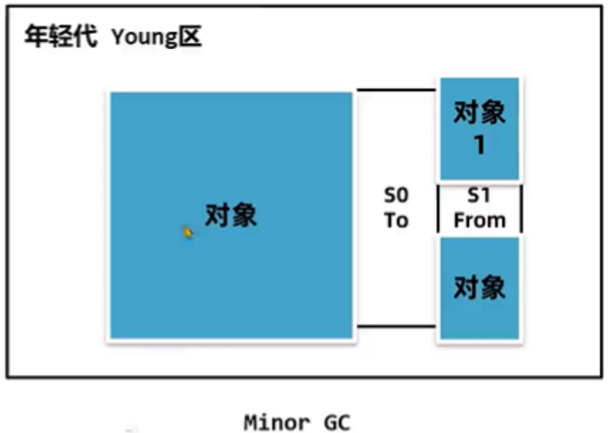

### 垃圾回收器：

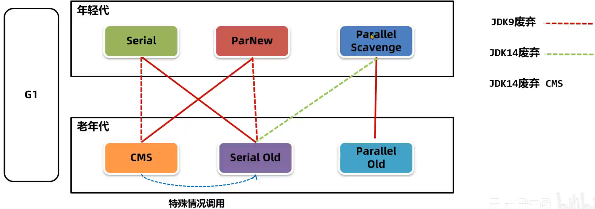

1. 可以通过调整年轻代和老年代的比例来适应不同类型的应用程序，提高内存的利用率和性能（假如用户比较多，有大量用户会在同一时段访问订单数据，如果新生代设置小，大量数据创建，会频繁发生minor GC，所以我们希望这些生命周期短的数据能在新时代直接被回收，所以这种情况新生代可以设置大一点）。
2. 新生代和老年代使用不同的垃圾回收算法，新生代一般选择复制算法，老年代可以选择标记-清除和标记-整理算法，由程序员来选择灵活度高。
3. 分代设计中允许只回收新生代（minor gc），如果能满足对象分配的要求，就不需要对整个堆进行回收（full gc），STW时间会减少。

#### Serial&SerialOld

- Serial是一种单线程串行回收年轻代的垃圾回收器。如果伊甸园区满了，垃圾回收线程就会回收垃圾，此时用户线程不能访问。单CPU下吞吐量出色，多CPU吞吐量不佳，因为执行时只能但线程，跑在一个CPU上。


- SerialOld是Serial垃圾回收器的老年代版本，采用单线程串行回收。


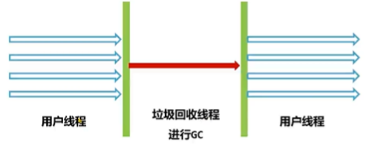

#### ParNew&CMS：

- ParNew垃圾回收器本质上是对Serial在多CPU下的优化，使用多线程进行垃圾回收。

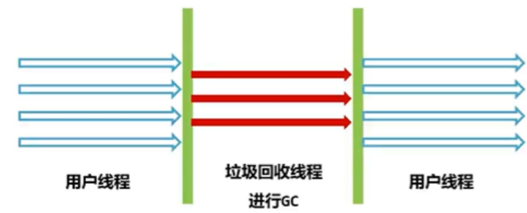

- CMS垃圾回收器关注的是系统的暂停时间，允许用户线程和垃圾回收线程在某些步骤中同时执行，减少了用户线程的等待时间。CMS执行步骤：

1. 初始标记，用极短的时间标记出GC Roots能直接关联到的对象。
2. 并发标记，标记所有的对象，用户线程不需要暂停。
3. 重新标记，由于并发标记阶段有些对象发生了变化，存在错标、漏标等情况，需要重新标记。
4. 并发清理，清理死亡的对象，用户线程不需要暂停。

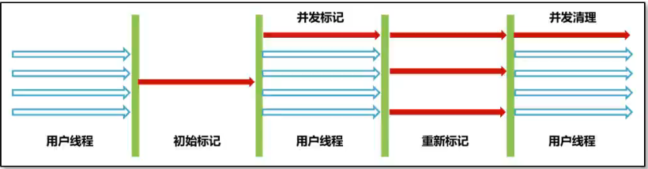


**缺点：**

1. CMS使用了标记-清除算法，在垃圾收集结束之后会出现大量内存碎片，CMS会在Full GC时进行碎片的整理。这样会导致用户线程暂停，可以使用-XX:CMSFullGCsBeforeCompaction=N参数调整N次Full GC之后再整理。
2. 无法处理并发清理过程中产生的浮动垃圾，不能做到完全的垃圾回收。
3. 如果老年代内存不足无法分配对象，CMS会退化成Serial Old单线程回收老年代。

#### PS&PO：

- **Parallel Scavenge**允许手动设置最大暂停时间和吞吐量。Oracle官方建议在使用组合时，不要设置堆内存的最大值，垃圾回收器会根据最大暂停时间和吞吐量自动调整内存大小。

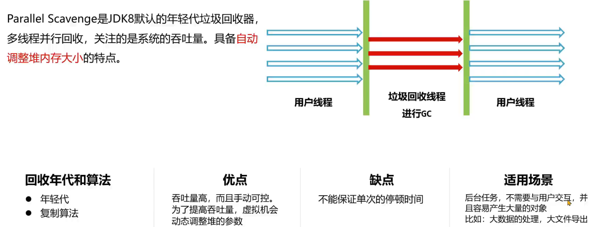

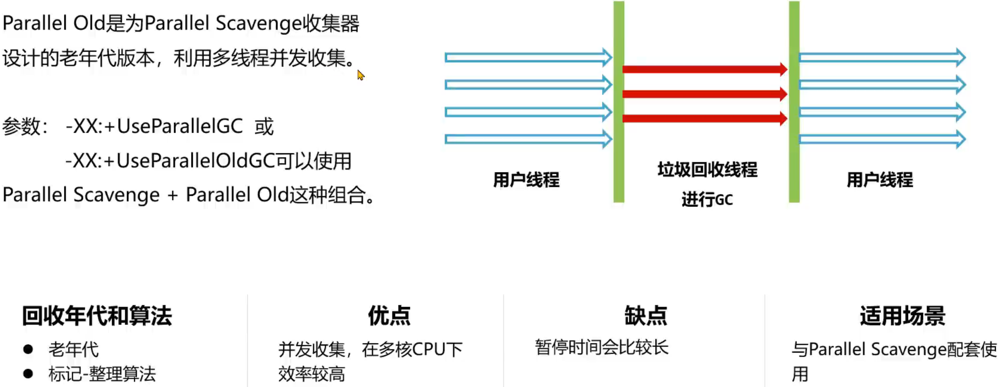

#### G1垃圾回收器：

JDK9之后默认的垃圾回收器是G1（Garbage First）垃圾回收器。G1对老年代的清理会选择存活度最低的区域进行回收，这样可以保证回收效率最高，这也是G1（Garbage first）名称的由来。

Parallel Scavenge关注吞吐量，允许用户设置最大暂停时间，但是会减少年轻代可用空间的大小。CMS关注暂停时间，但吞吐量会下降。

- 而G1设计目标就是将上述2种垃圾回收器的优点融合：

1. 支持巨大的堆空间回收，具有较高的吞吐量。
2. 支持多CPU并行垃圾回收。
3. 允许用户设置最大暂停时间。

G1的整个堆会被划分成多个大小相等的区域，称之为区Region，区域不要求是连续的。分为Eden，Survivor，Old区。Region的大小可以通过堆空间大小/2048计算得到，也可以通过参数-XX:G1HeapRegionSize=32m指定（其中32m指定region大小为32M），Region size必须是2的指数幂，取值范围从1M到32M。

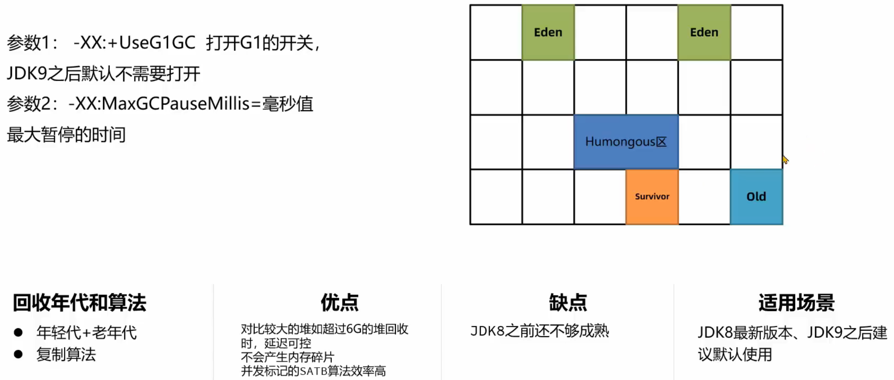

- G1垃圾回收有2种方式：
- **`年轻代回收（Young GC）`**，回收Eden区和Survivor区中不用的对象。会导致STW，G1中可以通过参数-XX:MaxGCPauseMillis=n（默认200）设置每次垃圾回收时的最大暂停时间毫秒数，G1垃圾回收器会尽可能地保证暂停时间。G1在进行Young GC的过程中会去记录每次垃圾回收时每个Eden区和 Survivor区的平均耗时，以作为下次回收时的参考依据。这样就能根据配置的最大暂停时间计算出本次回收时最多能回收多少个Region区域了。

1. 新创建的对象会存放在Eden区。当G1判断年轻代区不足（max默认60%，伊甸园区、Survivor），无法分配对象时需要回收时会执行Young GC。
2. 标记出Eden和Survivor区域中的存活对象。
3. 根据配置的最大暂停时间选择某些区域将存活对象复制到一个新的Survivor区中（年龄+1），清空这些区域。
4. 后续Young GC时与之前相同，只不过Survivor区中国存活对象会被搬运到另一个Survivor区。
5. 当某个存活对象的年龄到达阈值（默认15），将被放入老年代。
6. 部分对象如果大小超过Region的一半，会直接放入老年代，这类老年代被称为Humongous区。比如堆内存是4G，每个Region是2M，只要一个大对象超过了1M就被放入Humongous区，如果对象过大会横跨多个Region。

- 多次回收之后，会出现很多Old老年代区，总堆占有率达到阈值时（-XX:InitiatingHeapOccupancyPercent默认45%）**`会触发混合回收MixedGC`**。回收`所有年轻代和部分老年代`的对象以及大对象区。采用复制算法完成。

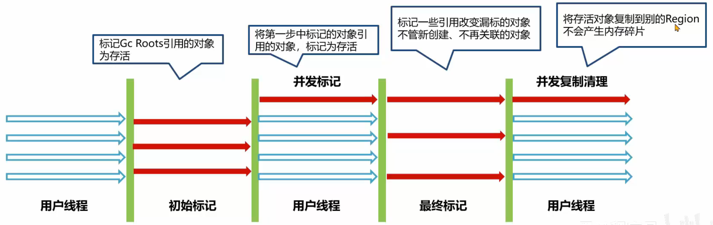

- 如果清理过程中发现没有足够的空Region存放转移的对象，会出现Full GC。单线程执行标记-整理算法，此时会导致用户线程的暂停，所以尽量保证应该用的内存有一定多余的空间。

#### 垃圾回收器使用建议：

JDK8之前：ParNew + CMS (关注停时间)、Parallel Scavenge + Parallel Old (关注吞吐量)、G1(JDK8之前不建议，较大堆并且关注暂停时间)

JDK9之后：从JDK9之后，由于G1日趋成熟，JDK默认的垃圾回收器已经修改为G1，所以强烈建议在生产环境上使用G1。

# 实战：

## 内存泄漏：

### 内存溢出和内存泄漏：

**内存泄露（memory leak）：**在Java中如果不再使用一个对象，但是该对象依然在GC ROOT的引用链上，这个对象就不会被垃圾回收器回收，这种情况被称为内存泄露。`内存泄露绝大多数情况都是堆内存泄露引起的。`少量的内存泄露可以容忍，但如果发生持续的内存泄露，**`内存消耗完最终会导致内存溢出。`**

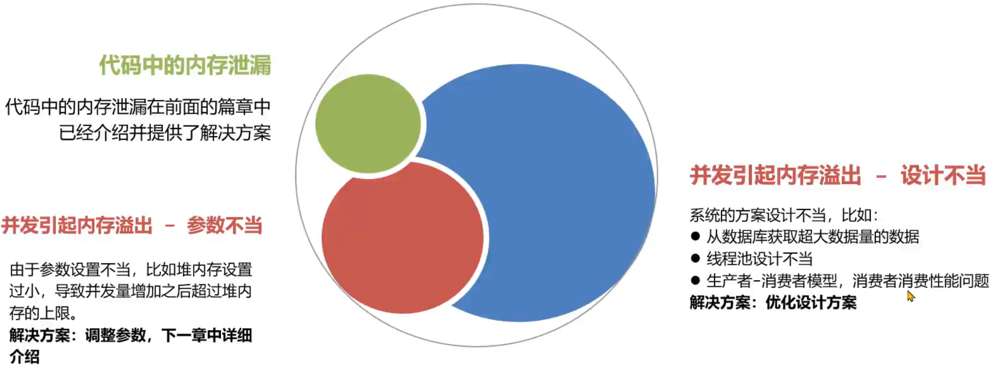

**总思路：**

1. 发现问题，通过监控工具尽可能尽早地发现内存慢慢变大的现象。
2. 诊断原因，通过分析内存快照或者在线分析方法调用过程，诊断问题产生的根源，定位到出现问题的源代码。
3. 修复源代码中的问题，如代码bug、技术方案不合理、业务设计不合理等等。
4. 在测试环境验证问题是否已经解决，最后发布上线。

### 监控：

#### top命令：

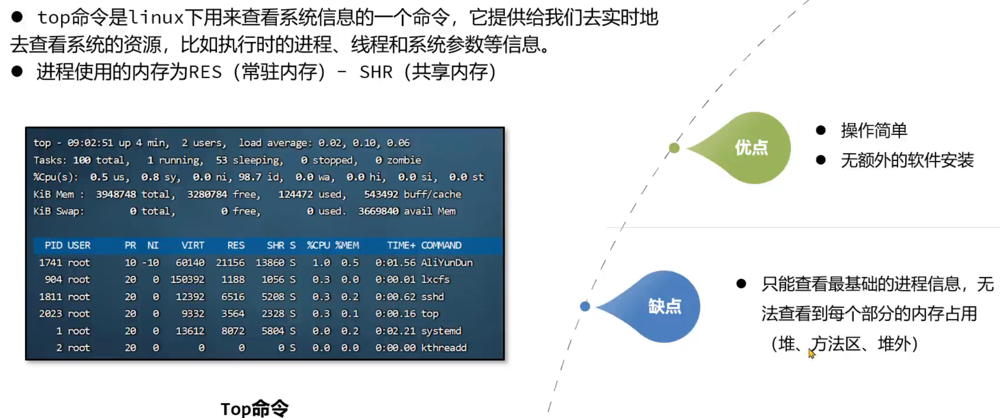

#### visualvm：

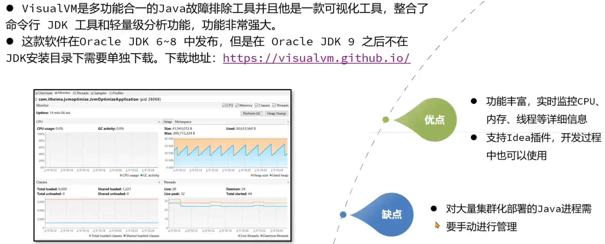

#### arthas tunnel：

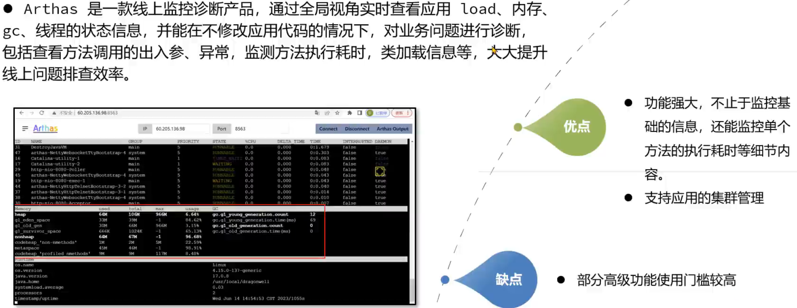

**步骤：**

1. 在Spring Boot程序中添加arthas的依赖(支持Spring Boot2)，在配置文件中添加tunnel服务端的地址，便于tunnel去监控所有的程序。
2. 将tunnel服务端程序部署在某台服务器上并启动。
3. 启动java程序
4. 打开tunnel的服务端页面，查看所有的进程列表，并选择进程进行arthas的操作。

#### Prometheus + Grafana：

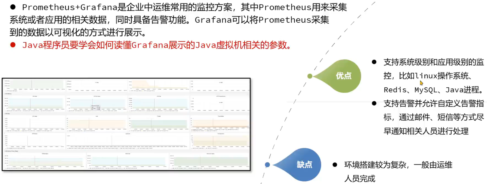

### 内存泄漏状况对比：

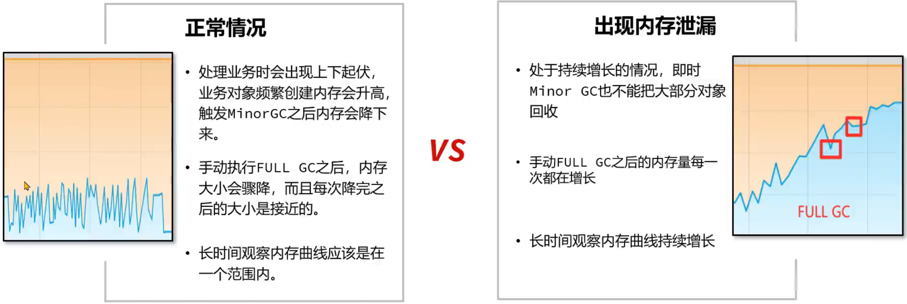

### 代码中的内存泄漏：

#### equals()和hashCode()

1. 以JDK8为例，首先调用hash方法计算key的哈希值（对整个对象进行哈希计算），hash方法中会使用到key的hashcode方法。根据hash方法的结果决定存放数组的数组中的位置。
2. 如果没有元素，直接放入。如果有元素，先判断key是否相等，会用到equals方法，如果key相等直接替换value；如果key不相等，走链表或者红黑树查找逻辑，其中也会使用equals比对是否相同。

**异常情况：**

1. hashCode方法实现不正确，会导致相同id的学生对象计算出来的hash值不同，可能会被分到不同的槽中。
2. equals方法实现不正确，会导致key在比对时，即便学生对象的id是相同的，也被认为是不同的key。
3. 长时间运行之后HashMap中会保存大量相同id的学生数据。

**解决方案：**

1. 在定义新实体时，始终重写equals()和hashCode()方法。
2. 重写时一定要确定使用了唯一标识去区分不同的对象，比如用户的id等。
3. hashmap使用时尽量使用编号id等数据作为key，不要将整个实体类对象作为key存放。
4. 默认情况@Data会重写equals()和hashCode()方法。

#### 内部类引用外部类：

**问题：**非静态的内部类默认会持有外部类，尽管代码上不再使用外部类，如果有地方引用了这个非静态的内部类，会导致外部类也被引用，垃圾回收时无法回收这个外部类。

**解决方法：**将内部类和外部类的变量改为static


**问题：**匿名内部类对象如果在非静态方法中被创建，会持有调用者对象，垃圾回收时无法回收调用者。

**解决方法：**使用静态方法，避免匿名内部类持有调用者对象。

#### ThreadLocal错误使用：

**问题：**如果通过`new方法来创建线程`，就算没有调用ThreadLocal的remove方法清理数据，也不会产生内存泄漏。因为当线程被回收时，ThreadLocal也同样被回收。但是如果使用线程池就不一定了。因为回不回收，什么时候回收取决于线程池的参数。因为 `ThreadLocal` 中的 `value` 被线程池中的工作线程（`Thread` 对象）强引用着，而线程池中的线程在任务执行完后并不会销毁（而是被复用），所以 `value` 一直无法被 GC 回收，导致内存泄漏。

**解决方案：**线程方法执行完，一定要调用ThreadLocal中的remove方法清理对象。

#### String的intern方法：

**问题：**JDK6中字符串常量池位于堆内存中的Perm Gen永久代中，如果不同字符串的intern方法被大量调用，字符串常量池会不停的变大超过永久代内存上限后就会产生内存溢出问题。

**解决方案:**

1. 注意代码中的逻辑，尽量不要将随机生成的字符串加入字符串常量池
2. 增大永久代空间的大小，根据实际的测试/估算结果进行设置-XX:MaxPermSize=256M

#### 通过静态字段保存对象

**问题：**如果大量的数据在静态变量中被长期引用，数据就不会被释放，如果这些数据不再使用，就成为了内存泄露。

**解决方法：**

1. 尽量减少将对象长时间的保存在静态变量，如果不再使用，必须将对象删除（或者将静态变量设置为null）
2. 使用单例模式时，尽量使用懒加载，而不是立即加载。在使用Spring的时候，在类上加上@Component注解，就可以在sprig容器启动过程中生成一个对象放入容器中。@Lazy注解的作用是让对象的加载变成懒加载。只有当要获取这个对象的时候，才会加载该对象。
3. Spring的Bean中不要长期存放大对象，**`如果是缓存用于提升性能，尽量设置过期时间定期失效。`**

#### 资源没有正常关闭：

**问题：**连接和流这些资源会占用内存，如果使用完之后没有关闭，这部分内存不一定会出现内存泄露，但是会导致close方法不被执行。

**解决方案：**

1. 为了防止出现这类的资源对象泄露问题，必须在finally块中关闭不再使用的资源。
2. 从Java7开始，使用try-with-resources语法可以用于自动关闭资源。

### 并发请求内存：

**原因：**并发请求问题指的是用户通过发送请求向Java应用获取数据，正常情况下Java应用将数据返回之后，这部分数据就可以在内存中被释放掉。但由于用户的并发请求量有可能很大，同时处理数据的时间很长，导致大量的数据存在于内存中，最终超过了内存的上限，导致内存溢出。这类问题的处理思路和内存泄漏相似，首先要定位到对象产生的根源。

可以Apache Jmeter软件进行并发请求测试，Jmeter是使用Java语言编写，可用来测试Web程序支持数据库、消息队列、邮件协议等不同内容的测试。支持插件扩展，生成多样化的测试结果。

### MAT基于快照离线诊断：

#### MAT检查内存快照：

当堆内存溢出时，需要在堆内存溢出时将整个堆内存保存下来，生成内存快照文件。**生成内存快照的Java虚拟机参数:**

1. -XX:+HeapDumpOnOutOfMemoryError: 生OutOfMemoryError错误时，自动生成hprof内存快照文件。
2. -XX:HeapDumpPath=<path>: 指定hprof文件的输出路径。

使用MAT打开hprof文件，并选择内存泄漏检功能，MAT会自行根据内存快照中保存的数据分析内存泄漏
的根源。

#### MAT检测原理：

1. MAT提供了支配树的对象图，支配树展示的是对象实例间的支配关系。在对象引用图中，所有指向对象B的路径都经过对象A，则认为对象A支配对象B。

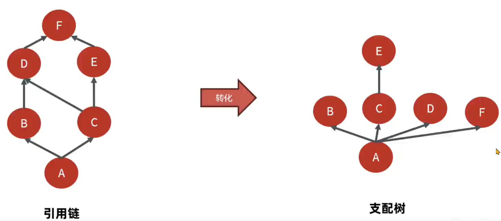

2. 支配树中对象本身占用的空间称之为浅堆。支配树中对象的子树就是所有被该对象支配的内容，这些内容组成了对象的深堆，也称之为保留集。深堆的大小表示该对象如果可以被回收，能释放多大的内存空间。

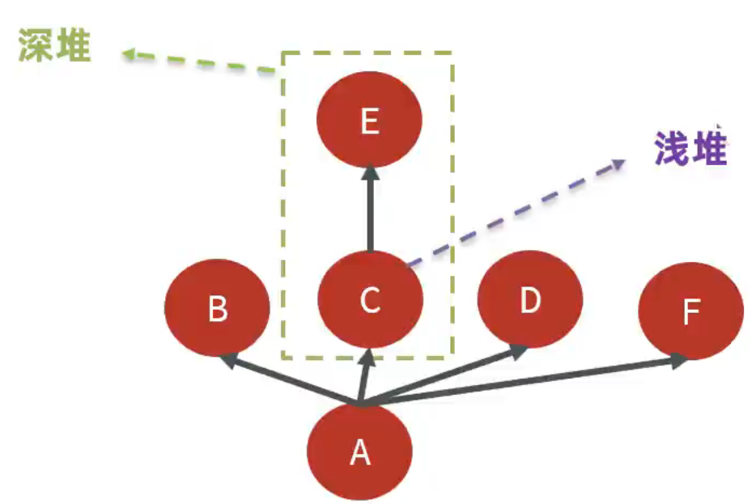

3. MAT就是根据支配树，从叶子节点向根节点遍历，如果发现深堆的大小超过整个堆内存的一定比例阈值，就会将其标记成内存泄漏的“嫌疑对象”。

#### 导出运行中内存快照：

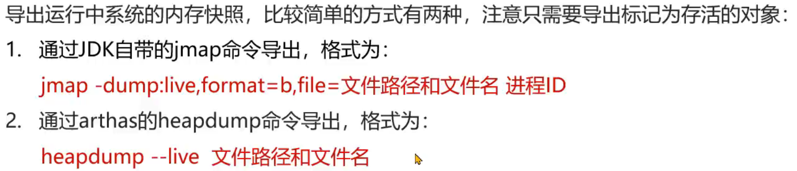

#### MAT分析超大堆：

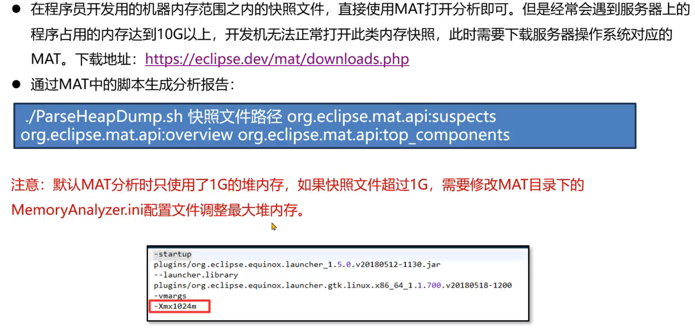

### 在线诊断：

- **对比：**

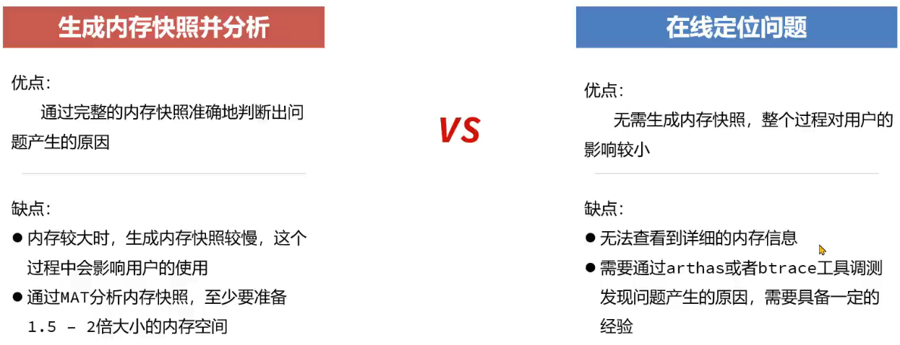

- arthas在线诊断：

1. 使用jmap-histo:live进程ID > 文件名命令将内存中存活对象以直方图的形式保存到文件中，这个过程会影
   响用户的时间，但是时间比较短暂。
2. 分析内存占用最多的对象，一般这些对象就是造成内存泄漏的原因。
3. 使用arthas的stack命令，追踪对象创建的方法被调用的调用路径，找到对象创建的根源。也可以使用btrace工具编写脚本追踪方法执行的过程。

- BTrace在线诊断：BTrace是一个在Java平台上执行的追踪工具可以有效地用于线上运行系统的方法追踪，具有侵入性小、对性能的影响微乎其微等特点。

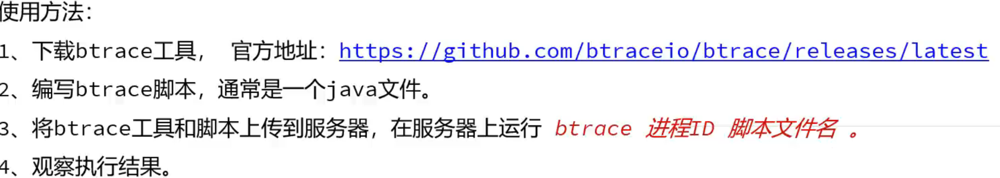

### 修复案例：

**解决思路：**

1. 服务出现OOM内存溢出时，生成内存快照。
2. 使用MAT分析内存快照，找到内存溢出的对象。
3. 尝试在开发环境中重现问题，分析代码中问题产生的原因。
4. 修改代码。
5. 测试并验证结果。

#### 分页查询文章接口的内存溢出

**问题根源:**文章微服务中的分页接口没有限制最大单次访问条数，并且单个文章对象占用的内存量较大，在业务高峰期并发量较大时这部分从数据库获取到内存之后会占用大量的内存空间。

**解决思路:**

1. 与产品设计人员沟通，限制最大的单次访问条数。
2. 分页接口如果只是为了展示文章列表，不需要获取文章内容，可以大大减少对象的大小。
3. 在高峰期对微服务进行限流保护。

#### Mybatis导致的内存溢出

**问题根源:**Mybatis在使用foreach进行sql拼接时，会在内存中创建对象，如果foreach处理的数组或者集合元素个数过多，会占用大量的内存空间。

**解决思路:**

1. 限制参数中最大的id个数。
2. 将id缓存到redis或者内存缓存中，通过缓存进行校验。

#### 导出大文件导致内存溢出：

**问题根源:**Excel文件导出如果使用POI的XSSFWorkbook，在大数据量(几十万)的情况下会占用大量的内存。

**解决思路:**

1. 使用poi的SXSSFWorkbook。
2. hutool提供的BigExcelWriter减少内存开销。
3. 使用easy excel，利用分批导出对内存进行了大量的优化。

#### ThreadLocal未清理：

**问题根源:**很多微服务会选择在拦截器preHandle方法中去解析请求头中的数据，并放入一些数据到ThreadLocal中方便后续使用。因为 `ThreadLocal` 中的 `value` 被线程池中的工作线程（`Thread` 对象）强引用着，而线程池中的线程在任务执行完后并不会销毁（而是被复用），所以 `value` 一直无法被 GC 回收，导致内存泄漏。

**解决思路：`在拦截器的afterCompletion方法中，必须要将ThreadLocal中的数据清理掉。`**

#### 异步业务处理问题：

**问题根源和解决思路:**在项目中如果要使用异步进行业务处理，或者实现生产者-消费者的模型，如果在Java代码中实现，会占用大量的内存去保存中间数据。尽量使用Mq消息队列，可以很好地将中间数据单独进行保存，不会占用Java的内存。同时也可以将生产者和消费者拆分成不同的微服务。

## GC调优：

- GC调优指的是对垃圾回收进行调优。GC调优的主要目标是避免由垃圾回收引起程序性能下降。

- **GC调优的核心分成三部分:**

1. 通用Jvm参数的设置。
2. 特定垃圾回收器的Jvm参数的设置。
3. 解决由频繁的FULLGC引起的程序性能问题

- **GC调优没有没有唯一的标准答案**，如何调优与硬件、程序本身、使用情况均有关系，重点学习调优的工具和方法。

**总思路：**

1. 发现问题——诊断原因——修复源代码中的问题——测试环境验证问题——发布上线。

### 核心指标：

1. **吞吐量(Throughput):**吞吐量分为`业务吞吐量`和`垃圾回收吞吐量`：业务吞吐量指的在一段时间内，程序需要完成的业务数量。

   - 保证高吞吐量的常规手段有两条:

   1. 优化业务执行性能，减少单次业务的执行时间
   2. 优化垃圾回收吞吐量

2. **延迟 (Latency):**延迟=GC延迟+业务执行时间
3. **内存使用量:**内存使用量指的是Java应用占用系统内存的最大值，一般通过Jvm参数调整，在满足上述两个指标的前提下，这个值越小越好。

### 发现问题：

#### jstat工具：

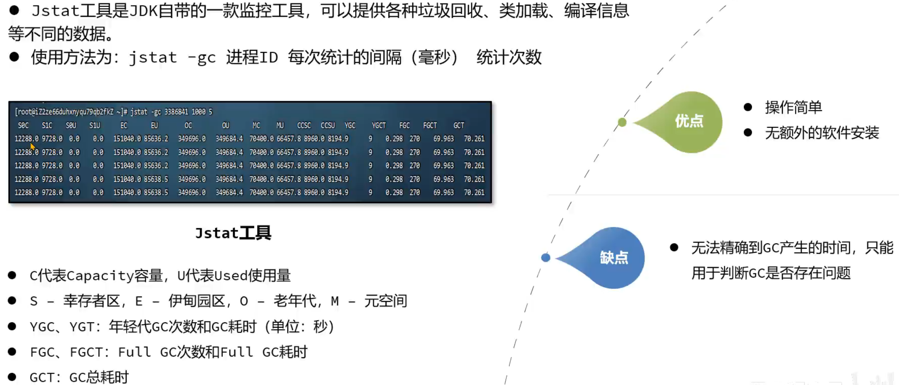

#### visualvm：

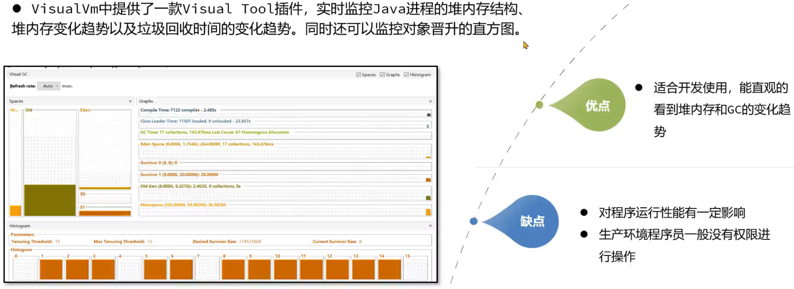

#### Prometheus+Grafana

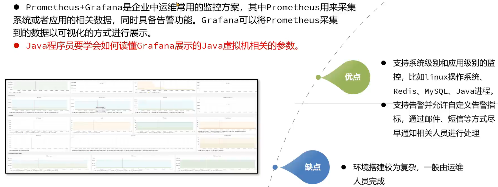

#### GCeasy：

通过GC日志，可以更好的看到垃圾回收细节上的数据，同时也可以根据每款垃圾回收器的不同特点更好地发现存在的问题。

1. 使用方法(JDK 8及以下):-XX:+PrintGCDetails -Xloggc:文件名
2. 使用方法(JDK 9+):-Xlog:gc*:file=文件名

GCeasy是业界首款使用AI机器学习技术在线进行GC分析和诊断的工具。定位内存泄漏、GC延迟高的问题，提供JVM参数优化建议，支持在线的可视化工具图表展示，官方网站:https://gceasy.io/。

### 常见GC模式：

#### 正常情况：

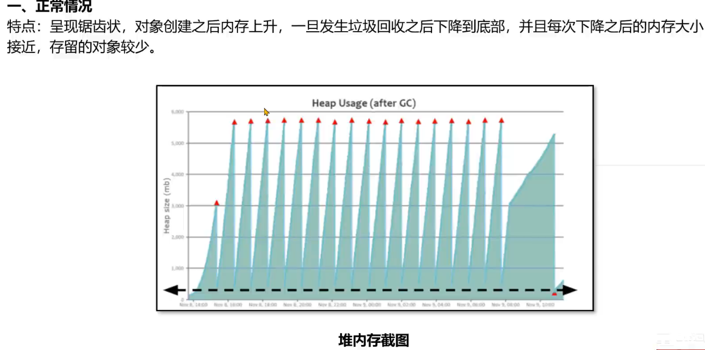

#### 缓存对象过多：

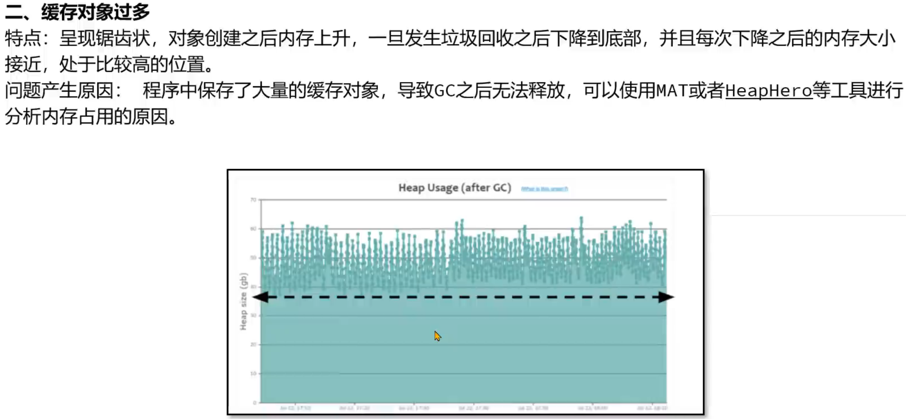

#### 内存泄漏：

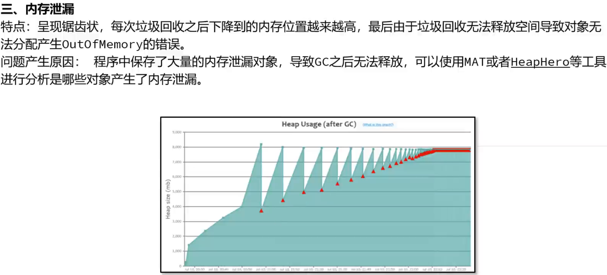

#### 持续FullGC：

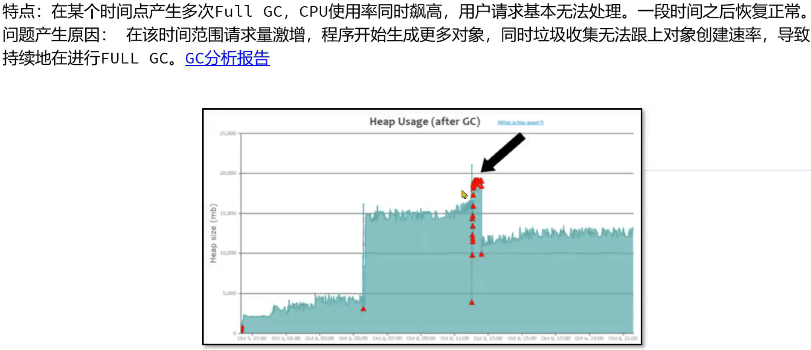

#### 原空间不足导致FullGC：

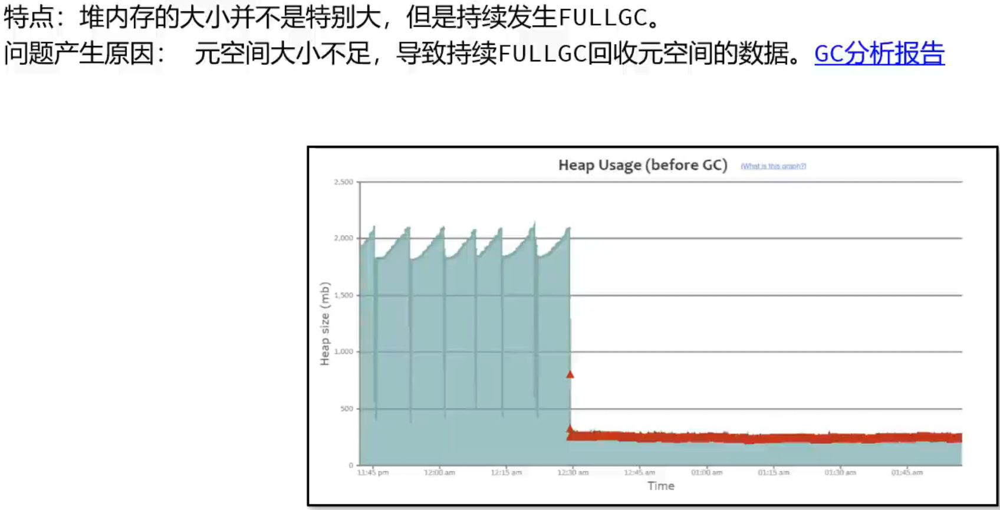

### 解决GC问题手段：

#### 优化基础JVM参数：

1. **`参数1：-Xmx和-Xms`**

- `Xmx参数设置的是最大堆内存`，但是由于程序是运行在服务器或者容器上，计算可用内存时，要将元空间、操作系统、其它软件占用的内存排除掉。
- **案例:** 服务器内存4G，操作系统+元空间最大值+其它软件占用1.5G，-Xmx可以设置为2g。
- `最合理的设置方式应该是根据最大并发量估算服务器的配置，然后再根据服务器配置计算最大堆内存的值。`

- `Xms用来设置初始堆大小，建议将-Xms设置的和Xmx一样大`，有以下几点好处:
  1. 运行时性能更好，堆的扩容是需要向操作系统申请内存的，这样会导致程序性能短期下降。
  2. 可用性问题，如果在扩容时其他程序正在使用大量内存，很容易因为操作系统内存不足分配失败。
  3. 启动速度更快，0racle官方文档的原话:如果初始堆太小，Java应用程序启动会变得很慢，因为JVM被迫频V繁执行垃圾收集，直到堆增长到更合理的大小。为了获得最佳启动性能，请将初始堆大小设置为与最大堆大小相同。

2. **`参数2: -XX:MaxMetaspaceSize 和 -XX:MetaspaceSize`**

- XX:MaxMetaspaceSize=值参数指的是`最大元空间大小`，默认值比较大，如果出现元空间内存泄漏会让操作系统可用内存不可控，建议根据测试情况设置最大值，一般设置为256m。
- XX:MetaspaceSize=值参数指的是`到达这个值之后会触发FULLGC`(网上很多文章的初始元空间大小是错误的)后续什么时候再触发JVM会自行计算。如果设置为和MaxMetaspacesize一样大，就不会FULLGC，但是对象也无法回收。

3. **`参数3:-Xss虚拟机栈大小`**

- 如果我们不指定栈的大小，JVM 将创建一个具有默认大小的栈。`大小取决于操作系统和计算机的体系结构。`
- 比如Linux x86 64位 :1MB，如果不需要用到这么大的栈内存，完全可以将此值调小节省内存空间，合理值为256k -1m之间。使用:-Xss256k

4. **`参数4:不建议手动设置的参数:`**由于JVM底层设计极为复杂，一个参数的调整也许让某个接口得益，但同样有可能影响其他更多接口。

- `Xmn年轻代的大小: `默认值为整个堆的1/3，可以根据峰值流量计算最大的年轻代大小，尽量让对象只存放在年轻代，不进入老年代。但是实际的场景中，接口的响应时间、创建对象的大小、程序内部还会有一些定时任务等不确定因素都会导致这个值的大小并不能仅凭计算得出，如果设置该值要进行大量的测试。`G1垃圾回收器尽量不要设置该值，G1会动态调整年轻代的大小。`
- `-XX:SurvivorRatio: `伊甸园区和幸存者区的大小比例，默认值为8。
- `-XX:MaxTenuringThreshold: `最大晋升阈值，年龄大于此值之后，会进入老年代。另外JVM有动态年龄判断机制:将年龄从小到大的对象占据的空间加起来，如果大于survivor区域的50%，然后把等于或大于该年龄的对象，放入到老年代。

5. **`其他参数:`**

- `-Xx:+DisableExplicitGC: `禁止在代码中使用System.gc()，System.gc()可能会引起FULLGC，在代码中尽量不要使用。使用DisableExplicitGC参数可以禁止使用System.gc()方法调用。
- `-XX:+HeapDumponoutofMemoryError: `发生outofMemoryError错误时,自动生成hprof内存快照文件。
  -XX:HeapDumpPath=<path>:指定hprof文件的输出路径。
- 打印GC日志
  - JDK8及之前:-XX:+PrintGCDetails -XX:+PrintGCDateStamps -Xloggc:文件路径
  - JDK9及之后:-Xlog:gc*:file=文件路径

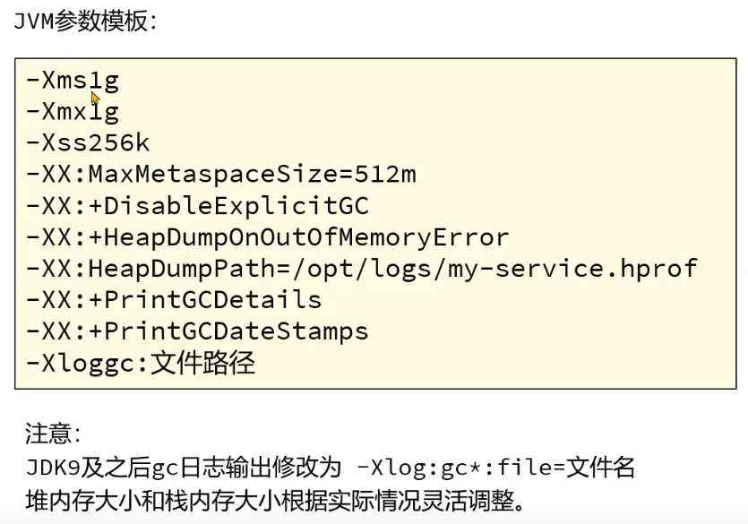

#### 垃圾回收器选择：

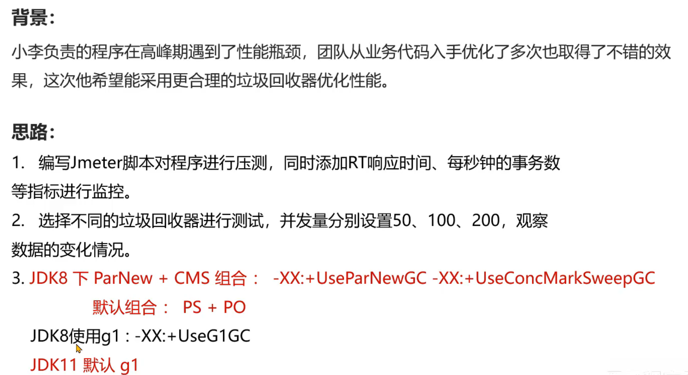

#### 减少对象产生

- `大多数场景下的FULLGC是由于对象产生速度过快导致的，减少对象产生可以有效的缓解FULLGC的发生。`

#### 优化垃圾回收器参数：

**`这部分优化效果未必出色，仅当前边的一些手动无效时才考虑。`**

**一个优化的案例:**CMS的并发模式失败(concurrent mode failure)现象。由于CMS的垃圾清理线程和用户线程是并行进行的，如果在并发清理的过程中老年代的空间不足以容纳同时放入的老年代对象，会产生并发模式失败。并发模式失败会导致Java虚拟机使用serialolc单线程进行FULLGC回收老年代，出现长时间的停顿。

**解决方案：**

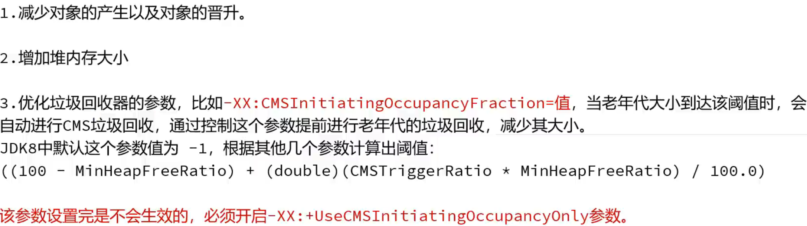

### 总结：

- 核心最影响性能的就是FULLGC，因此要减少FULLGC的频率。
- 可以通过分析GC日志来判断问题原因，也可以通过GCeasy这样的智能分析日志工具。
- 在代码没问题的情况下最主要的是通过调整JVM参数，比如堆大小等。还可以通过选择不同的垃圾回收器来解决，新的G1垃圾回收器性能更好，最后还可以通过调整垃圾回收器参数。
- 在编写代码时，要尽量避免频繁的创建对象，特别是可达但不用的对象，这样的对象既不会被清理还会占用堆空间。

## 性能调优：

### 线程转储文件：

**线程转储文件获取(Thread Dump)：**提供了对所有运行中的线程当前状态的快照。线程转储可以通过jstack、visualvm等工具获取。其中包含了线程名、优先级、线程ID、线程状态、线程栈信息等等内容，`可以用来解决CPU占用率高、死锁等问题。`

**线程转储(Thread Dump)中的几个核心内容:**

- **名称:** 线程名称，通过给线程设置合适的名称更容易"见名知意”
- **优先级(prio):**线程的优先级
- **JavaID(tid):**JVM中线程的唯一ID
- **本地ID(nid):**操作系统分配给线程的唯一ID
- **栈追踪:**显示整个方法的栈帧信息
- **状态:**线程的状态，分为:
  - NEW- 新创建的线程，尚未开始执行
  - RUNNABLE-正在运行或准备执行
  - BLOCKED - 等待获取监视器锁以进入或重新进入同步块/方法
  - WAITING - 等待其他线程执行特定操作，没有时间限制
  - TIMED_WAITING - 等待其他线程在指定时间内执行特定操作
  - TERMINATED - 已完成执行

**线程转储的可视化在线分析平台:**

1. https://jstack.review/
2. https://fastthread.io/

### CPU占用高问题：

- **`排查流程：`**

1. 通过top-c命令`找到CPU占用率高的进程`，获取它的进程ID。
2. 使用top-p进程ID单独监控某个进程，按H可以查看到所有的线程以及线程对应的CPU使用率，`找到CPU使用率特别高的线程`。
3. 使用jstack进程ID命令可以`查看到所有线程正在执行的栈信息`。使用jstack进程ID > 文件名保存到文件中方便查看。
4. 在导出的`Thread Dump中找到nid线程ID相同的栈信息`，需要将之前记录下的十进制线程号转换成16进制。
5. 找到栈信息对应的源代码，并分析问题产生原因。

- 在定位CPU占用率高的问题时，比较需要关注的是状态为RUNNABLE的线程。但实际上，有一些线程执行本地方法时并不会消耗CPU，而只是在等待。但JVM仍然会将它们标识成“RUNNABLE”状态。

### 响应时间长：

#### 接口响应时间长：

在程序运行过程中，发现有几个接口的响应时间特别长，需要快速定位到是哪一个方法的代码执行过程中出现了性能问题。

**方法：**

1. 通过arthas的trace命令，`首先找到性能较差的具体方法`，如果访问量比较大，建议设置最小的耗时，精确的找到耗时比较高的调用。命令:trace 类名 方法名

- 添加--skipJDKMethodfalse参数可以输出JDK核心包中的方法及耗时。
- 添加‘#cost>毫秒值’参数，只会显示耗时超过该毫秒值的调用。
- 添加-n数值参数，最多显示该数值条数的数据。
- 所有监控都结束之后，输入stop结束监控，重置arthas增强的对象。

2. 在使用trace定位到性能较低的方法之后，`使用watch命令监控该方法，可以获得更为详细的方法信息（请求参数等）`。命令：watch 类名 方法名 ‘{params,retuIrnObj}’ ‘#cost>毫秒值’ -x 2

- ‘{params，returnobj}代表打印参数和返回值。
- -x代表打印的结果中如果有嵌套(比如对象里有属性)，最多只展开2层。允许设置的最大值为4。

3. `使用stop命令将所有增强的对象恢复,`不恢复的话这个监控是基于动态代理的会占用资源。

#### 可视化响应时长：

- Arthas提供了性能火焰图的功能，可以非常直观地显示所有方法中哪些方法执行时间比较长。

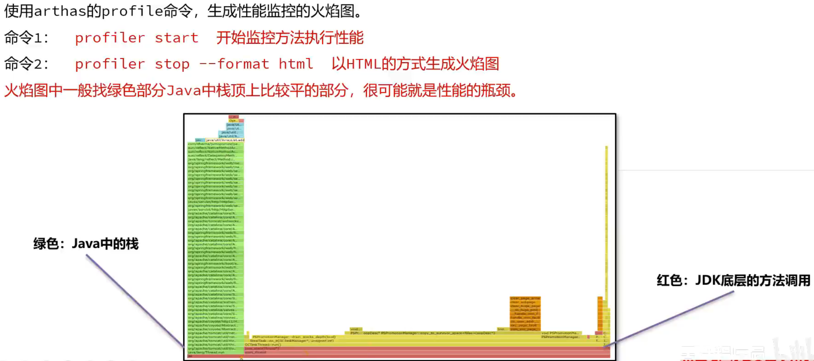

- 偏底层的性能问题，特别是由于JDK中某些方法被大量调用导致的性能低下，可以使用火焰图非常直观的找到原因。
- 这个案例中是由于创建ArrayList时没有手动指定容量，导致使用默认的容量而在添加对象过程中发生了多次的扩容，扩容需要将原来数组中的元素复制到新的数组中，消耗了大量的时间。通过火焰图可以看到大量的调用，修复完之后节省了20%~50%的时间。

### 死锁问题检测：

- 程序在启动运行一段时间之后，`就无法接受任何请求了（内存占用也正常）`。将程序重启之后继续运行，依然会出现相同的情况。

- 线程耗尽问题，一般是由于执行时间过长，分析方法分成两步:

1. `检测是否有死锁产生，无法自动解除的死锁会将线程永远阻塞。`
2. 如果没有死锁，再使用案例1的打印线程栈的方法检测线程正在执行哪个方法，一般这些大量出现的方法就是慢方法。

- 线程死锁可以通过三种方法定位问题:

1. jstack-| 进程ID > 文件名 将线程栈保存到本地。在文件中搜索deadlock即可找到死锁位置。
2. 开发环境中使用visual vm或者Jconsole工具，都可以检测出死锁。使用线程快照生成工具就可以看到死锁的根源。生产环境的服务一般不会允许使用这两种工具连接。
3. Fastthread和GCeasy类似，是一款在线的Ai自动线程问题检测工具，可以提供线程分析报告。通过报告查看是否存在死锁问题。

### JMH基准测试框架：

- Java程序在运行过程中，JIT即时编译器会实时对代码进行性能优化，所以仅凭少量的测试是无法真实反应运行系统最终给用户提供的性能。
- OpenJDK中提供了一款叫JMH(Java MicrobenchmarkHarness)的工具，可以准确地对Java代码进行基准测试量化方法的执行性能。JMH会首先执行预热过程，确保JIT对代码进行优化之后再进行真正的迭代测试，最后输出测试的结果。官网地址:https://github.com/openjdk/jmh

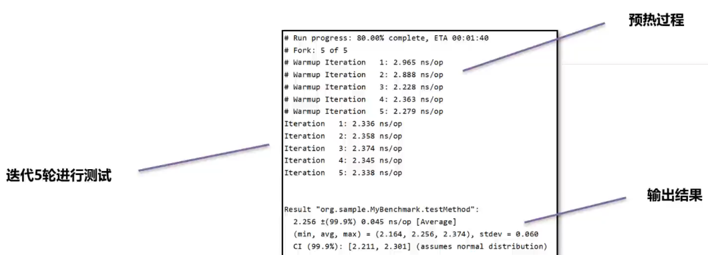

- **环境搭建：**

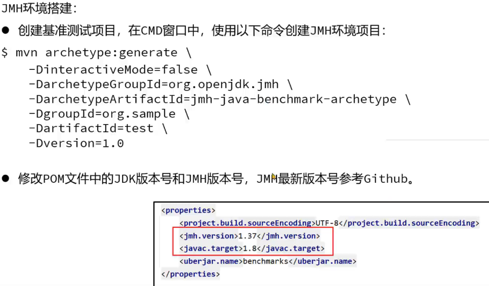

- 编写测试方法，几个需要注意的点:

1. 死代码问题：因为变量没被return所以JIT直接优化掉不执行。
2. 黑洞的用法：应对死代码问题，主动消费变量Blackhole.consume(变量)。

- 通过maven的verify命令，检测代码问题并打包成jar包。通过java -jar target/benchmarks.jar 命令执行基准测试（也可以直接用代码输出结果）。测试结果通过https://jmh.morethan.io/生成可视化的结果。

### 总结：

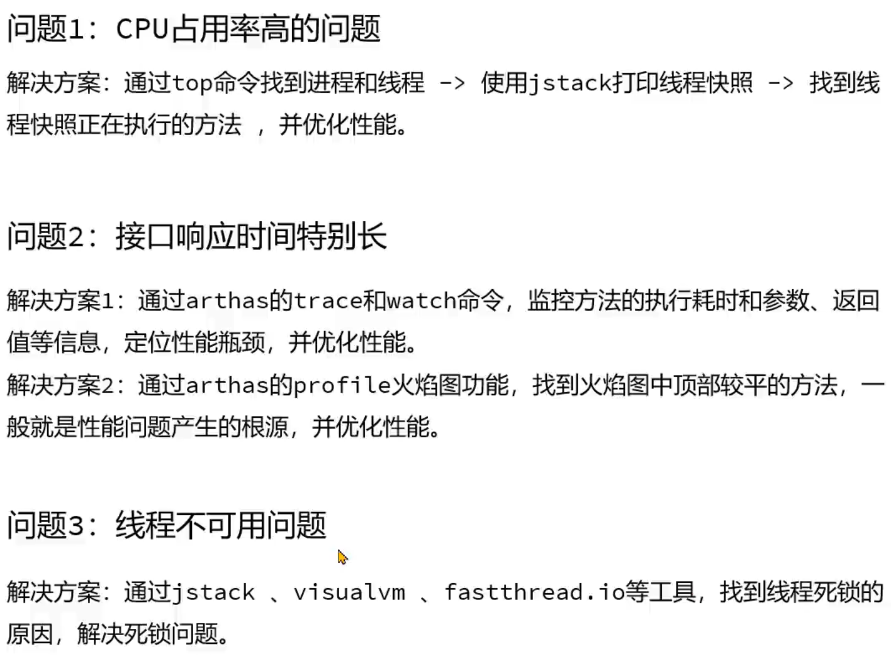

# 高级：

## GraalVM：

### 简介：

- GraalVM是Oracle官方推出的一款高性能JDK，使用它享受比OpenJDK或者OracleJDK更好的性能。GraalVM的官方网址:https://www.graalvm.org/
- 官方标语: Build faster, smaller, leaner applications

1. 更低的CPU、内存使用率
2. 更快的启动速度，无需预热即可获得最好的性能√更好的安全性、更小的可执行文件
3. 支持多种框架Spring Boot、 Micronaut、 Helidon 和 Quarkus.
4. 多家云平台支持。
5. 通过Truffle框架运行JS、Python、Ruby等其他语言。

- GraalVM分为社区版(Community Edition) 和企业版(Enterprise Edition)。企业版相比较社区版,在性能上有更多的优化。

**搭建Linux下的GraalVM社区版本环境：**

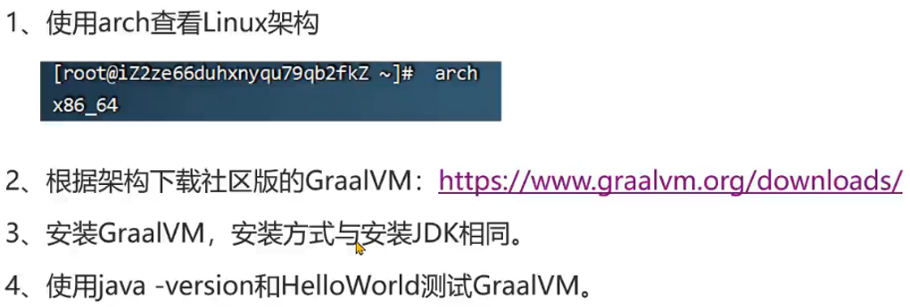

### 两种模式：

- JIT(Just-In-Time)模式，`即时编译模式JIT模式的处理方式与OracleJDK类似`，满足两个特点:

1. Write Once,Run Anywhere ->一次编写，到处运行。
2. 预热之后，通过内置的`Graal即时编译器优化热点代`码，生成比HotspotJIT更高性能的机器码。

- AOT(Ahead-Of-Time)模式，提前编译模式（`降低CPU和内存占用`）

1. AOT编译器通过源代码，为特定平台创建可执行文件。比如，在Windows下编译完成之后，会生成exe文件。通过这种方式，达到启动之后获得最高性能的目的。但是不具备跨平台特性，不同平台使用需要单独编译。这种模式生成的文件称之为Native Image本地镜像。

- 性能对比：

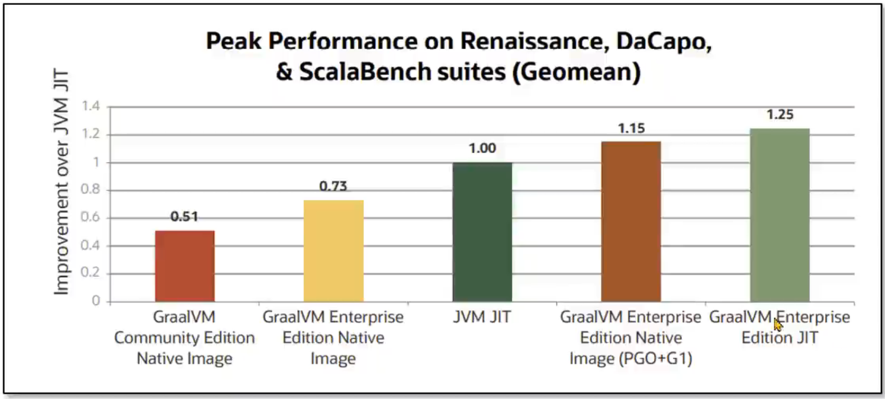

### 使用场景

#### SpringBoot3构建GraalVM应用：

- GraalVM的AOT模式虽然在启动速度、内存和CPU开销上非常有优势，但是使用这种技术会带来几个问题

1. 跨平台问题，在不同平台下运行需要编译多次。编译平台的依赖库等环境要与运行平台保持一致。
2. 使用框架之后，编译本地镜像的时间比较长，同时也需要消耗大量的CPU和内存。
3. AOT编译器在编译时，需要知道运行时所有可访问的所有类。但是Java中有一些技术可以在运行时创建类，例如反射、动态代理等。这些技术在很多框架比如Spring中大量使用，所以框架需要对AOT编译器进行适配解决类似的问题。

**解决方案:**

1. 使用公有云的Docker等容器化平台进行在线编译，确保编译环境和运行环境是一致的，同时解决了编译资源问题。
2. 使用SpringBoot3等整合了GraalVM AOT模式的框架版本。

- SpringBoot3对GraalVM进行了完整的适配，所以编写GraalVM服务推荐使用SpringBoot3.

- **步骤:**
  1、使用https://start.spring.io/ spring提供的在线生成器构建项目。
  2、编写业务代码。
  3、执行 mvn -Pnative clean native:compile 命令生成本地镜像。
  4、运行本地镜像。

#### 函数计算：

- 对性能要求比较高的场景，可以选择使用收费的企业版提升性能。公有云的部分服务是按照CPU和内存使用量进行计费的，使用GraalVM可以有效地降低费用。

- 随着虚拟化技术、云原生技术的愈发成熟，云服务商提供了一套称为Serverless无服务器化的架构。企业无需进行服务器的任何配置和部署，完全由云服务商提供。比较典型的有亚马逊AWS、阿里云等。Serverless架构中第一种常见的服务是函数计算(Function asa Service)，`将一个应用拆分成多个函数,每个函数会以事件驱动的方式触发。`典型代表有Aws的Lambda、阿里云的FC。

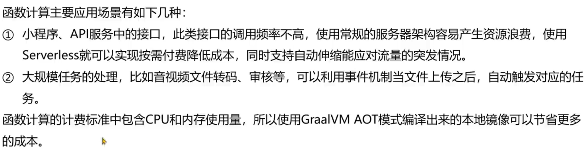

**使用步骤：**

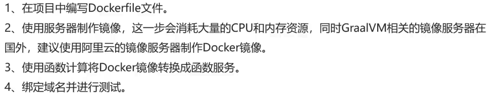

#### Serverless应用

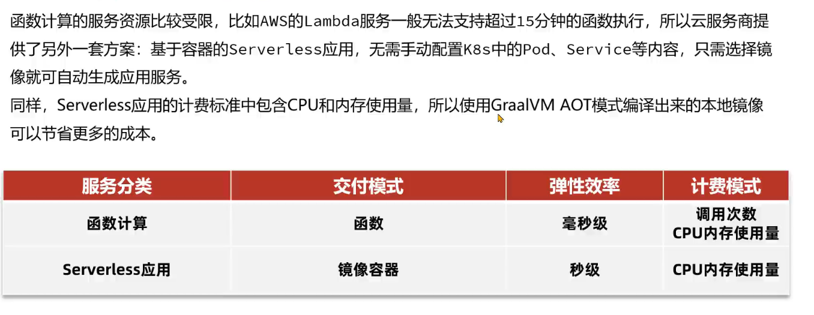

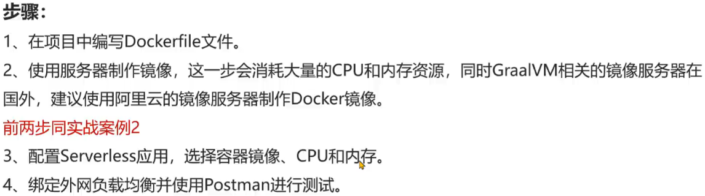

### 参数优化和故障检测：

**参数优化：**

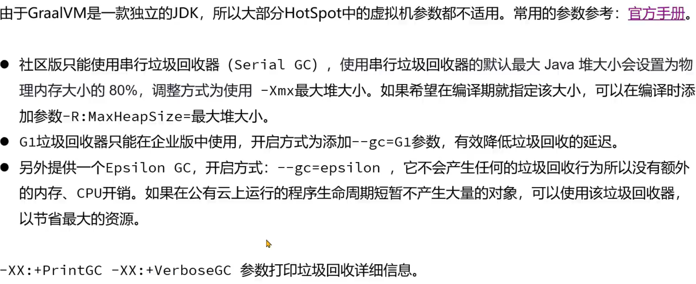

**内存溢出：**

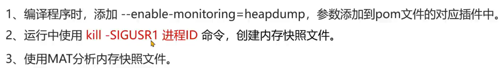

**运行时数据的获取：**JDK Flight Recorder (FR)是一个内置于JVM中的工具，可以收集正在运行中的Java应用程序的诊断和分析数据，比如线程、异常等内容。GraalVM本地镜像也支持使用JFR生成运行时数据，导出的数据可以使用VisualVM分析。

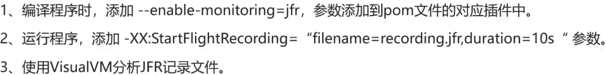

### 总结：

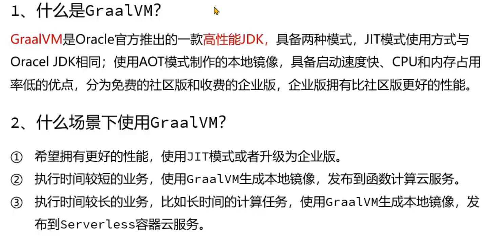

## 新一代GC：

### 技术演进：

- 新一代的垃圾回收器主要考虑的是极小的停顿时间，所以他的吞吐量以及内存占用效果就不会很好。

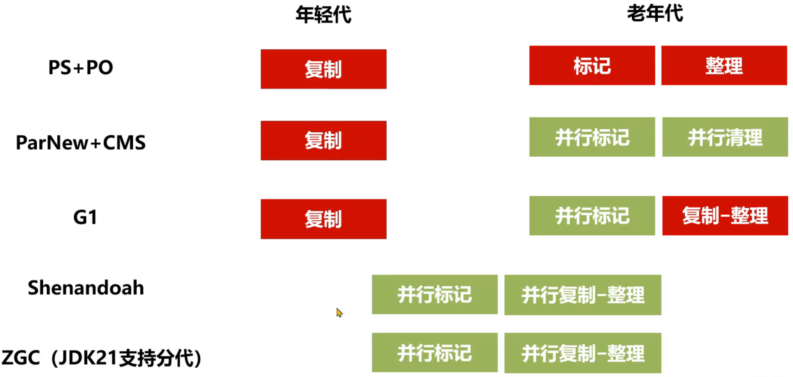

### Shenandoah：

- Shenandoah是由Red Hat开发的一款低延迟的垃圾收集器，Shenandoah并发执行大部分GC工作，包括并发的整理，堆大小对STW的时间基本没有影响。

1. **下载：**

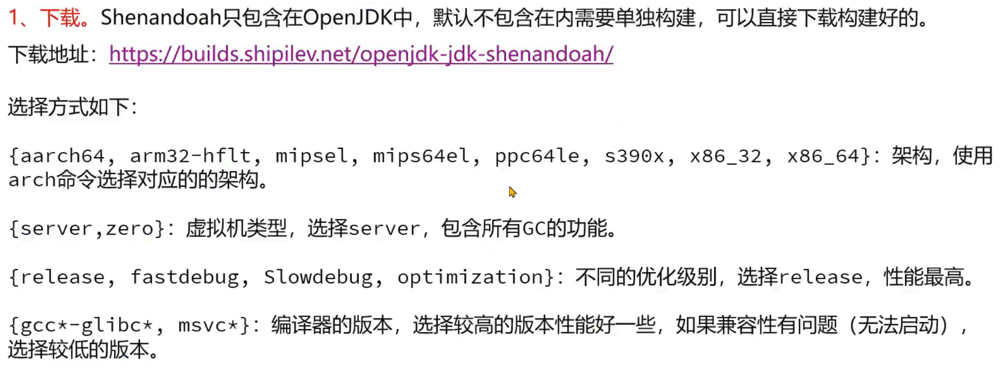

2. **配置：**将OpenJDK配置到环境变量中，使用java-version进行测试。打印出如下内容代表成功。
3. 添加参数，运行Java程序：-XX:+UseShenandoahGC 开启Shenandoah GC-Xlog:gc 打印GC日志

### ZGC：

- ZGC是一种可扩展的低延迟垃圾回收器。ZGC在垃圾回收过程中，STW的时间不会超过一毫秒，适合需要低延迟的应用。支持几百兆到16TB的堆大小，堆大小对STW的时间基本没有影响。
- ZGC降低了停顿时间，能降低接口的最大耗时，提升用户体验。但是吞吐量不佳，所以如果Java服务比较关注QPS(每秒的查询次数)那么G1是比较不错的选择。

1. **使用：**

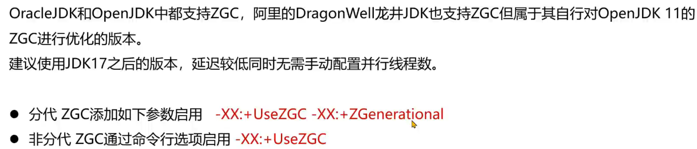

2. **无需配置：**ZGC在设计上做到了自适应，根据运行情况自动调整参数，让用户手动配置的参数最少化。
   - 自动设置年轻代大小，无需设置-Xmn参数。
   - 自动晋升阈值(复制中存活多少次才搬运到老年代)，无需设置-XX:TenuringThreshold
   - JDK17之后支持自动的并行线程数，无需设置-XX:ConcGCThreads。
3. **需要设置的参数:**
   - -Xmx值最大堆内存大小：这是ZGC最重要的一个参数，必须设置。ZGC在运行过程中会使用一部分内存用来处理垃圾回收，所以尽量保证堆中有足够的空间。设置多少值取决于对象分配的速度，根据测试情况来决定。
4. **可以设置的参数:**
   - -XX:SoftMaxHeapSize=值：ZGC会尽量保证堆内存小于该值，这样在内存靠近这个值时会尽早地进行垃圾回收，但是依然有可能会超过该值。
5. **调优：**

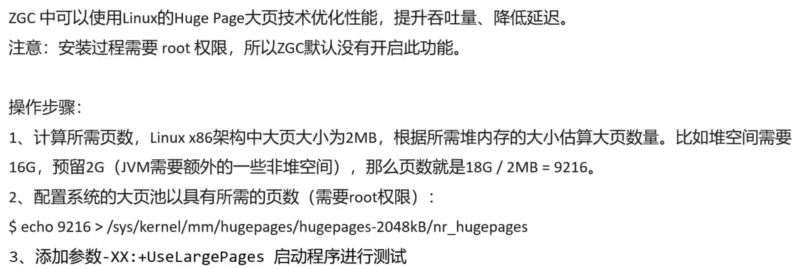

### 总结：

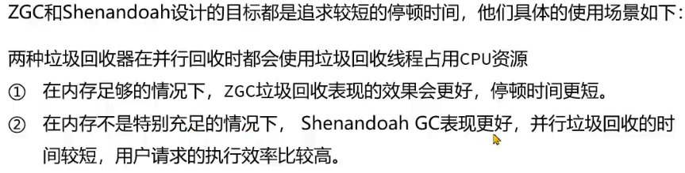

# 原理：

## 栈上数据存储：

### 简介：

- 下表中列出了java不同数据类型占用字节数以及在栈中占用的slot数（`在32位系统中1 slot = 4byte；64位系统中1 slot = 8byte`）

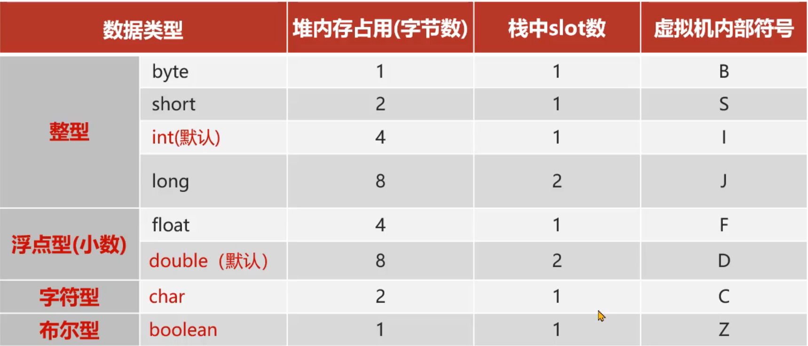

- Java虚拟机采用的是`空间换时间方案`，在栈上不存储具体的类型，只根据slot槽进行数据的处理，浪费了一些内存空间但是避免不同数据类型不同处理方式带来的时间开销。
- 像long型在64位系统中占用2个slot，使用了16字节空间，但实际上在Hotspot虚拟机中，它的高8个字节没有使用，这样就满足了long型使用8个字节的需要。

### boolean在栈上存储方式：

- `在Java虚拟机中栈上boolean类型保存方式与int类型相同`，所以它的值如果是1代表true，如果是0代表false。但是我们可以通过修改字节码文件，让它的值超过1。

1. 栈->堆：堆中的数据加载到栈上，由于栈上的空间大于或者等于堆上的空间，所以直接处理但是需要注意下符号位。
   - boolean、char为无符号，低位复制，高位补0
   - byte、short为有符号，低位复制，高位非负则补0，负则补1
2. 堆->栈：栈中的数据要保存到堆上，byte、char、short由于堆上存储空间较小，需要将高位去掉。boolean比较特殊，只取低位的最后一位保存。

## 堆上数据存储：

### 内存布局：

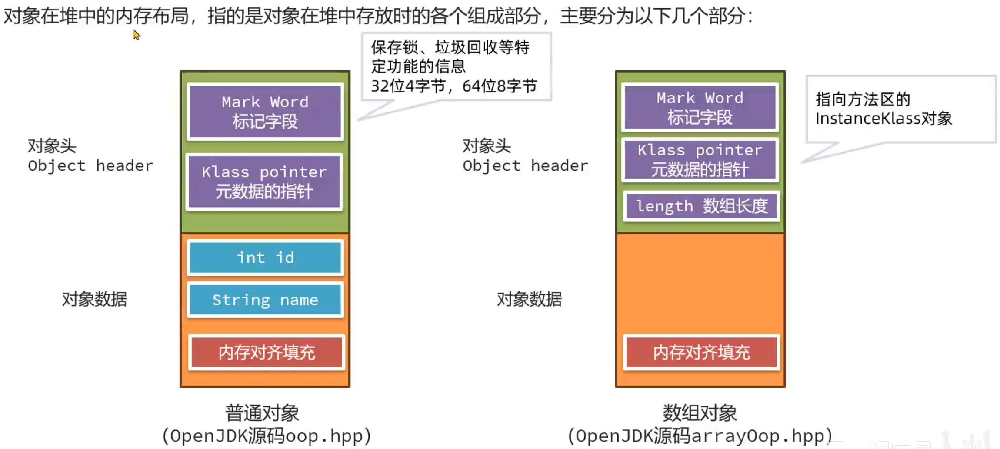

### 标记字段：

- 标记字段相对比较复杂。在不同的对象状态(有无锁、是否处于垃圾回收的标记中)下存放的内容是不同的，同时在64位(又分为是否开启指针压缩)、32位虚拟机中的布局都不同。
- **查看工具：**

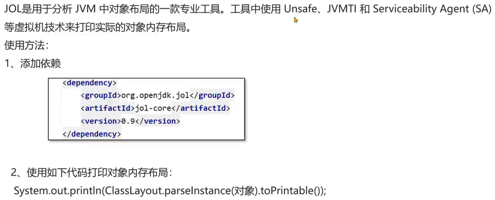

### 元数据指针&内存压缩：

1. 在64位的Java虚拟机中，`元数据指针以及对象数据中的对象引用都需要占用8个字节`，为了减少这部分的内存使用量，64位Java虚拟机使用指针**`压缩技术`**，将堆中原本8个字节的指针压缩成4个字节，此功能默认启，可以使用-XX:-UseCompressedOops关闭。
   - `指针压缩的思想是将寻址的单位放大`，比如原来按1字节去寻址，现在可以按8字节寻址。原来按1去寻址，能拿到1字节开始的数据，现在按1去寻址，就可以拿到8个字节开始的数据。

2. 这样将编号当成地址，就可以用更小的内存访问更多的数据。但是这样的做法有**两个问题**:
   - `需要进行内存对齐，指的是将对象的内存占用填充至8字节的倍数。`存在空间浪费(对于Hotspot来说不存在，即便不开启指针压缩，也需要进行内存对齐)
   - 寻址大小仅仅能支持2的35次方个字节(32GB，如果超过32GB指针压缩会自动关闭)。不用压缩指针，应该是2的64次方=16EB，用了压缩指针就变成了8(字节)=2的3次方*2的32次方=2的35次方

### 内存对齐：

- 内存对齐主要目的是为了`解决并发情况下CPU缓存失效的问题：`内存对齐之后，`同一个缓存行中不会出现不同对象的属性`。在并发情况下，如果让A对象一个缓存行失效，是不会影响到B对象的缓存行的。

1. **字段重排列:**在Hotspot中，要求每个属性的偏移量Offset(字段地址-起始地址)必须是字段长度的N倍。这样保证一个字段不会被拆分到多个cpu缓存行中。

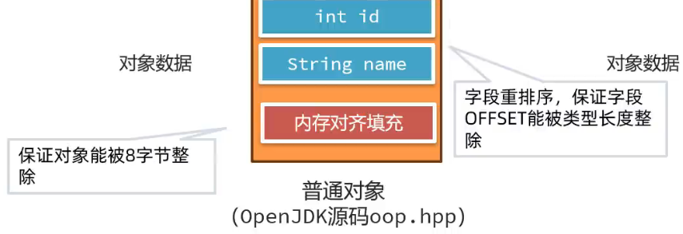

## 方法调用原理：

### 简介：

- 方法调用的本质是通过字节码指令的执行，能在栈上创建栈帧，并执行调用方法中的字节码执行。类在加载或创建（实例化）时，不会把方法中的局部变量放入栈中；只有当方法被调用时，JVM 才会为该次调用在「虚拟机栈」中创建一个栈帧，并将局部变量放入其中。

1. **`五种方法调用：`**1、2是静态绑定，3、4因为要多态是动态绑定

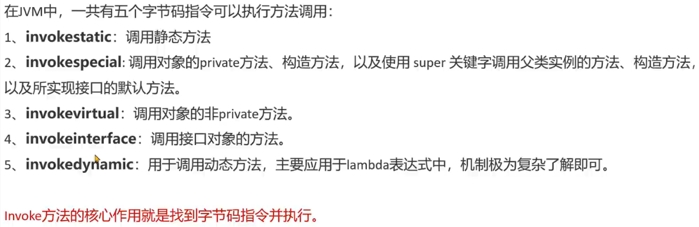

### 静态绑定：

- Invoke指令执行时，`需要找到方法区中`instanceKlass中保存的方法相关的字节码信息。但是方法区中有很多类，每一个类又包含很多个方法，**怎么精确地定位到方法的位置呢**?

1. 编译期间，**`invoke指令会携带一个参数符号引用，引用到常量池中的方法定义`**。方法定义中包含了类名+方法名+返回值+参数。
2. 在方法第一次调用时，这些符号引用就会被**`替换成内存地址的直接引用(地址)`**，这种方式称之为静态绑定。静态绑定适用于处理静态方法、私有方法、或者使用final修饰的方法，因为这些方法不能被继承之后重写。
   - invokestatic
   - invokespecial
   - final修饰的invokevirtual

### 动态绑定：

- 对于非static、非private、非final的方法，有可能存在子类重写方法，那么就需要通过动态绑定来完成方法地址绑定的工作。这样就实现了多态。
- 动态绑定是基于方法表来完成的，invokevirtual使用了虚方法表(vtable)，invokeinterface使用了接口方法表(itable)整体思路类似。所以接下来使用invokevirtual和虚方法表来解释整个过程。
  1. 每个类中都有一个虚方法表，本质上它是一个数组，记录了方法的地址。子类方法表中包含父类方法表中的所有方法;
  2. 子类如果重写了父类方法，则使用自己类中方法的地址进行替换。
  3. 产生invokevirtual调用时，先根据对象头中的类型指针找到方法区中InstanceClass对象，获得虚方法表。再根据虚方法表找到对应的对方，获得方法的地址，最后调用方法。

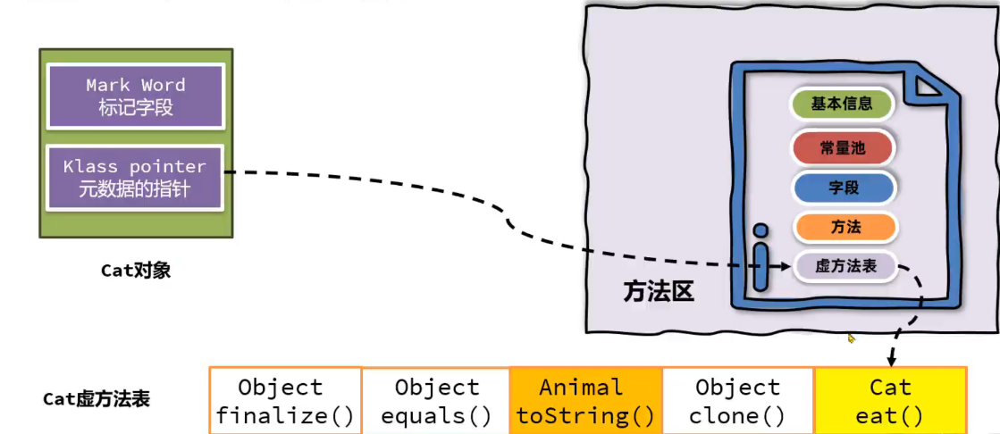

## 捕获异常原理：

- 异常表在编译期生成，存放的是代码中异常的处理信息，包含了异常捕获的生效范围以及异常发生后跳转到的字节码指令位置。

1. 起始/结束PC：此条异常捕获生效的字节码起始/结束位置。
2. 跳转PC：异常捕获之后，跳转到的字节码位置。

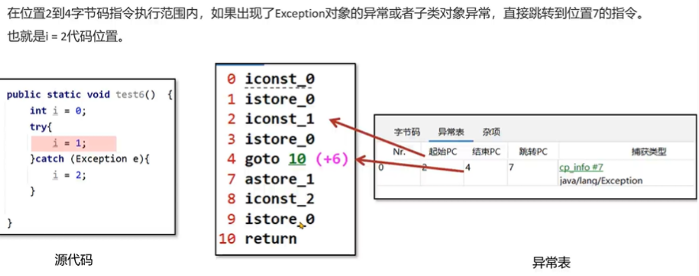

- 如果在内层方法中抛出异常，在内层方法的异常表中无法处理，内存方法的栈帧会被弹出，把异常交给外层方法的异常表处理。
- 在多个catch分支情况下，异常会从上往下遍历。

- 在字节码层面，finally的逻辑实现是在异常表中增加2个条目，覆盖try和catch的字节码指令范围内。finally指不管走到哪个代码块try块也好，catch块也好，没被捕获也好，都必须执行。

## JIT即时编译器：

### 概览：

**简介：**在Java中，JIT即时编译器是一项用来提升应用程序代码执行效率的技术。字节码指令被Java虚拟机解释执行，如果有一些指令执行频率高，称之为热点代码，这些字节码指令则被IT即时编译器编译成机器码同时进行一些优化，最后保存在内存中，将来执行时直接读取就可以运行在计算机硬件上了。

1. 在HotSpot中，有三款即时编译器，C1、c2和Graal,其中Graal在GraalVM章节中已经介绍过。C1编译效率比c2快，但是优化效果不如c2。所以c1适合优化一些执行时间较短的代码，c2适合优化服务端程序中长期执行的代码。
2. JDK7之后，采用了分层编译的方式，在VM中C1和C2会一同发挥作用，分层编译将整个优化级别分成了5个等级。

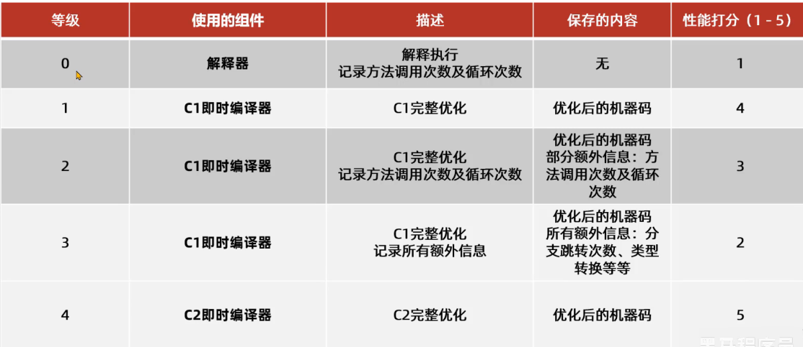

3. C1即时编译器和C2即时编译器都有独立的线程去进行处理，内部会保存一个队列，队列中存放需要编译的任务。一般即时编译器是针对方法级别来进行优化的，当然也有对循环进行优化的设计。
4. **执行可能性：**
   - 先由C1执行过程中收集所有运行中的信息，方法执行次数、循环执行次数、分支执行次数等等，然后等待执行次数触发阈值(分层即时编译由JVM动态计算)之后，进入C2即时编译器进行深层次的优化。
   - 方法字节码执行数目过少，先收集信息，JVM判断C1和C2优化性能差不多，那之后转为不收集信息，由C1直接进行优化。
   - C1线程都在忙碌的情况下，直接由c2进行优化。
   - c2线程忙碌时，先由2层C1编译收集一些基础信息，多运行一会儿，然后再交由3层C1处理，由于3层C1处理效率不高，所以尽量减少这一层停留时间(C2忙碌着，一直收集也没有意义)，最后c2线程不忙碌了再交由C2进行处理。

### 方法内联：

- **方法内联(Method Inline):**方法体中的字节码指令直接复制到调用方的字节码指令中，节省了创建栈帧的开销。

- 并不是所有的方法都可以内联，内联有一定的限制：

1. 方法编译之后的字节码指令总大小<35字节，可以直接内联。(通过-XX:MaxlnlineSize=值控制)
2. 方法编译之后的字节码指令总大小<325字节，并且是一个热方法。(通过-XX:FreqlnlineSize=值控制)
3. 方法编译生成的机器码不能大于1000字节。(通过-XX:InlineSmallCode=值控制)
4. 、一个接口的实现必须小于3个，如果大于三个就不会发生内联。

### 逃逸分析：

- 逃逸分析指的是如果JIT发现在方法内创建的对象不会被外部引用，那么就可以采用锁消除、标量替换等方式进行优化。

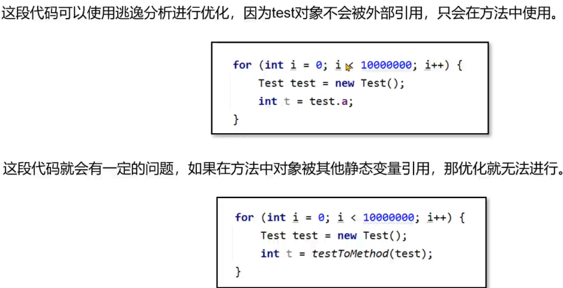

- 逃逸分析真正对性能优化比较大的方式是标量替换。在Java虚拟机中，对象中的基本数据类型称为标量，引用的其他对象称为聚合量。标量替换指的是如果方法中的对象不会逃逸，那么其中的标量就可以直接在栈上分配。

### 总结：

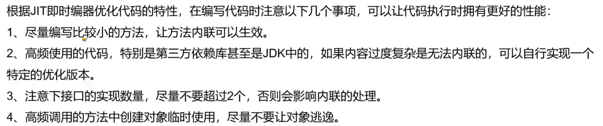

## 垃圾回收器原理：

### G1：

#### 年轻代回收：

- 主要解决怎么知道是否有老年代引用了年轻代对象。如果用GCRoot从老年代一路找到年轻代太麻烦了。

1. **卡表：**每一个Region都拥有一个自己的卡表，如果产生了跨代引用(老年代引用年轻代)，此时这个Region对应的卡表上就会将字节内容进行修改，JDK8源码中0代表被引用了称为脏卡。这样就可以标记出当前Region被老年代中的哪些部分引用了。那么要生成记忆集就比较简单了，只需要遍历整个卡表，找到所有脏卡。
   - 卡表会占用一定的内存空间，堆大小是1G时，卡表大小为1G=1024MB/512=2MB

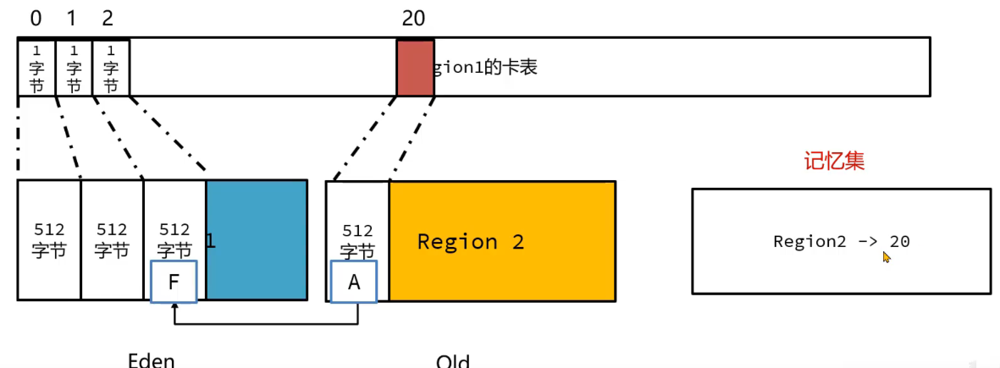

2. **记忆集 RememberedSet(简称RS或RSet)：**每一个Region都拥有一个自己的记忆集，如果产生了跨代引用，记忆集中会记录引用对象所在的卡表位置。标记阶段将记忆集中的对象加入GCRoot集合中一起扫描，就可以将被引用的对象标记为存活。
3. **写屏障 write Barrier：**G1使用写屏障技术，在执行引用关系建立的代码执行后插入一段指令，完成卡表的维护工作。会损失一部分的性能，大约在5%~10%之间。

#### 混合回收：

- **简介：**多次回收之后，会出现很多Old老年代区，此时总堆占有率达到阈值(默认45%)时会触发混合回收MixedGC。混合回收会由年轻代回收之后或者大对象分配之后触发，混合回收会回收整个年轻代+部分老年代。老年代很多时候会有大量对象，要标记出所有存活对象耗时较长，所以整个标记过程要尽量能做到和用户线程并行执行。

- **混合回收的步骤:**

1. **`初始标记，`**STW，采用三色标记法标记从GC Root可直达的对象。

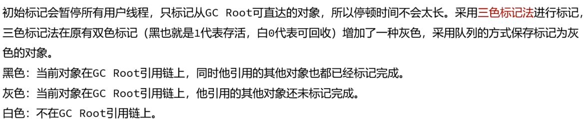

2. **`并发标记，`**并发执行，对存活对象进行标记。从灰色队列中获取尚未完成标记的对象B。标记B关联的A和C对象，由于A对象并未引用其他对象，可以直接标记成黑色，而B也完成了所有引用对象的标记，也标记为黑色。c对象有引用对象E，所以先标记成灰色。

- **三色标记存在一个比较严重的问题**: 由于用户线程。可能同时在修改对象的引用关系，就会出现错标的情况，比如:这个案例中正常情况下，B和C都会被标记成黑色。但是在BC标记前，用户线程执行了B.c=null;将B到c的引用去除了。同时执行了A.c=c;添加了A到C的引用而A已经是黑色了，因此C不会再被检测出引用。此时会出现严重问题，C是白色可回收一旦回收代码中再去使用对象会造成重大问题。

- G1为了解决这个问题，使用了SATB技术(Snapshot At The Beginning,初始快照)。SATB技术是这样处理的:
  - 标记开始时创建一个快照，记录当前所有对象，标记过程中新生成的对象直接标记为黑色。
  - 采用前置写屏障技术，在引用赋值前比如B.c=null之前，将之前引用的对象c放入SATB待处理队列中。SATB队列每个线程都有一个，最终会汇总到一个大的SATB队列中。

3. 最终标记，STW，处理SATB相关的对象标记。SATB队列中的对象，默认按照存活处理，同时要处理他们引用的对象。
   - **`SATB的缺点`**是在本轮清理时可能会将不存活的对象标记成存活对象，产生了一些所谓的浮动垃圾，等到下一轮清理时才能回收。

4. 清理，STW，如果区域中没有任何存活对象就直接清理。
5. 转移，将存活对象复制到别的区域。

### ZGC:

在ZGC中，与G1垃圾回收器一样将堆内存划分成很多个区域，这些内存区域被称之为Zpage。Zpage分成三类大中小，管控粒度比G1更细，这样更容易去控制停顿时间:

- 小区域:2M，只能保存256KB内的对象。
- 中区域:32M，保存256KB-4M的对象。
- 大区域:只保存一个大于4M的对象。

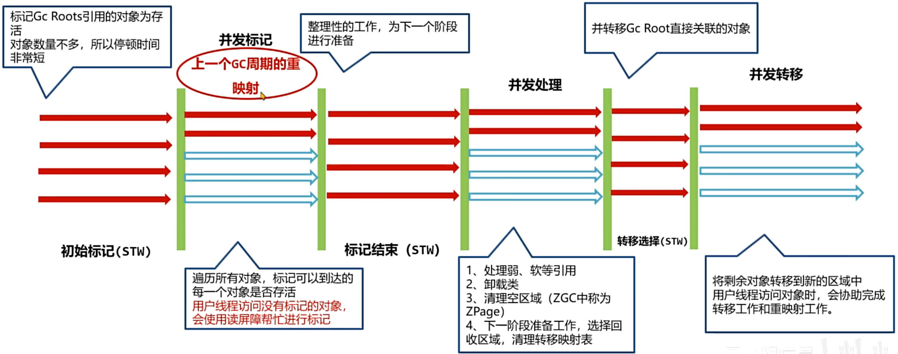

- 如果用户线程在帮忙转移时，GC线程也发现这个对象需要复制，那么就会去尝试写入转移映射表，如果发现映射表中已经有相同的老对象，直接放弃。
- 在JDK21之后，ZGC设计了年轻代和老年代，这样可以让大部分对象在年轻代回收，减少老年代的扫描次数，同样可以提升一定的性能。同时，年轻代和老年代的垃圾回收可以并行执行。

- 关键技术：

1. **着色指针(Colored Pointers)**
   - 着色指针将原来的8字节保存地址的指针拆分成了三部分，不仅能保存对象的地址，还可以保存当前对象所属的状态。不支持32位系统、不支持指针压缩

2. **读屏障(Load Barrier)**
   - 在获取对象引用前判断对象所属状态，如果所属状态和当前GC阶段的颜色状态不一致，由用户线程完成本阶段的工作。会损失一部分的性能，大约在5%~10%之间。

### ShenandoahGC：

- ShenandoahGC和ZGC不同，ShenandoahGC艮多是使用了G1源代码改造而成，所以在很多算法、数据结构的定义上，与G1十分相像，而ZGC是完全重新开发的一套内容。

1. ShenandoahGC的区域定义与G1是一样的。
2. 没有着色指针，通过修改对象头的设计来完成并发转移过程的实现。
3. ShenandoahGC有两个版本,1.0版本存在于IDK8和JDK11中，后续的JDK版本中均使用2.0版本。

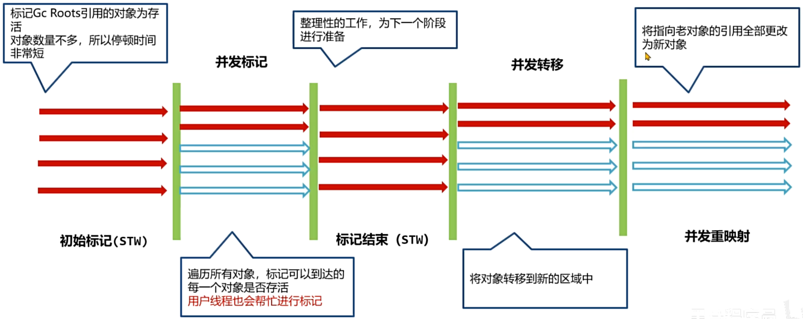

- 如果转移阶段未完成，此时转移前的对象和转移后的对象都会存活。如果用户去访问数据，需要使用转移后的数据。ShenandoahGC使用了读前屏障，根据对象的前向指针来获取到转移后的对象并读取。
- 写入数据时，也会使用写前屏障，判断MarkWord中的GC状态，如果GC状态为0证明没有处于GC过程中，直接写入，如果不为0则根据GC状态值确认当前处于垃圾回收的哪个阶段，让用户线程执行垃圾回收相关的任务。
- 如果用户线程在帮忙转移时，ShenandoahGC线程也发现这个对象需要复制，那么就会去尝试写入前向指针，使用了类似CAS的方式来实现，只有一个线程能成功修改，其他线程会放弃转移的操作。

# 面试：

## 什么是JVM：

1. JVM指的是Java虚拟机，本质上是一个运行在计算机上的程序，他的职责是运行Java字节码文件，作用是为了支持跨平台特性。
2. JVM的功能有三项:第一是解释执行字节码指令;第二是管理内存中对象的分配，完成自动的垃圾回收;第三是优化热点代码提升执行效率。
3. JVM组成分为类加载子系统、运行时数据区、执行引擎、本地接口这四部分。
4. 常用的JVM是Oracle提供的Hotspot虚拟机，也可以选择GraalVM、龙井、Openj9等虚拟机。

## 字节码文件组成：

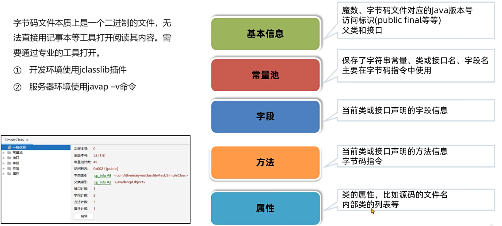

## 运行时数据区：

### 介绍：

运行时数据区指的是JVM所管理的内存区域，其中分成两大类:

- 线程共享-方法区、堆 线程
- 不共享-本地方法栈、虚拟机栈、程序计数器
- 直接内存主要是NIO使用，由操作系统直接管理，不属于JVM内存。

1. **程序计数器：**
   -  程序计数器可以控制程序指令的进行，实现分支、跳转、异常等逻辑。
   - 在多线程执行情况下，Java虚拟机需要通过利呈序计数器记录CPU切换前解释执行到那一句指令并继续解释运行。
2. **虚拟机栈：**Java虚拟机栈采用栈的数据结构来管理方法调用中的基本数据，先进后出，每一个方法的调用使用一个栈帧来保存。每个线程都会包含一个自己的虚拟机栈，它的生命周期和线程相同。栈帧主要包含三部分内容:
   - 局部变量表，在方法执行过程中存放所有的局部变量。
   - 操作数栈，虚拟机在执行指令过程中用来存放临时数据的一块区域。
   - 帧数据，主要包含动态链接、方法出口、异常表等内容。
3. **堆：**
   - 一般Java程序中堆内存是空间最大的一块内存区域。创建出来的对象都存在于堆上。
   - 栈上的局部变量表中，可以存放堆上对象的引用。静态变量也可以存放堆对象的引用，通过静态变量就可以实现对象在线程之间共享。
   - 堆是垃圾回收最主要的部分，堆结构更详细的划分与垃圾回收器有关。
4. **方法区：**
   - 每一个加载的类的元信息(基础信息)。
   - 运行时常量池，保存了字节码文件中的常量池内容，避免常量内容重复创建减少内存开销。
   - 字符串常量池（实际上在堆区，方法区保存索引），存储字符串的常量。
5. 直接内存并不在《Java虚拟机规范》中存在，所以并不属于Java运行时的内存区域。

### 哪些区域会内存溢出：

- 内存溢出指的是内存中某一块区域的使用量超过了允许使用的最大值，从而使用内存时因空间不足而失败，虚拟机一般会抛出指定的错误。

1. 堆:溢出之后会抛出OutOfMemoryError，并提示是Java heap Space导致的。`一般是创建的对象太大。`
2. 栈:溢出之后会抛出StackOverflowError。`一般是递归调用。`
3. 方法区:溢出之后会抛出OutOfMemoryError，JDK7及之前提示永久代，JDK8及之后提示元空间。`一般是不断创建新的类。`
4. 直接内存:溢出之后会抛出OutOfMemoryError。

### JDK6-8不同：

1. 方法区是《Java虚拟机规范》中设计的虚拟概念，每款Java虚拟机在实现上都各不相同。Hotspot设计如下:
   - JDK7及之前的版本将方法区存放在堆区域中的永久代空间，堆的大小由虚拟机参数来控制。
   - JDK8及之后的版本将方法区存放在元空间中，元空间位于操作系统维护的直接内存中，默认情况下只要不超过操作系统承受的上限，可以一直分配。也可以手动设置最大大小。
2. **使用元空间替换永久代的原因:**
   - **提高内存上限:**元空间使用的是操作系统内存，而不是JVM内存。如果不设置上限，只要不超过操作系统内存上限，就可以持续分配。而永久代在堆中，可使月月的内存上限是有限的。所以使用元空间可以有效减少OOM情况的出现。
   - **优化垃圾回收的策略:**永久代在堆上，垃圾回收机制一般使用老年代的垃圾回收方式，不够灵活。使用元空间之后单独设计了一套适合方法区的垃圾回收机制。
3. **字符串常量池从方法区移动到堆的原因:**
   - **垃圾回收优化:**字符串常量池的回收逻辑和对象的回收逻辑类似，内存不足的情况下，如果字符串常量池中的常量不被使用就可以被回收;方法区中的类的元信息回收逻辑更复杂一些。移动到堆之后，就可以利用对象的垃圾回收器，对字符串常量池进行回收。
   - **让方法区大小更可控:**一般在项目中，类的元言息不会占用特别大的空间，所以会给方法区设置一个比较小的上限。如果字符串常量池在方法区中，会让方法区的空间大小变得不可控。
   - **intern方法的优化:**JDK6版本中intern ()方法会把第一次遇到的字符串实例复制到永久代的字符串常量池中。JDK7及之后版本中由于字符串常量池在堆上，就可以进行优化:字符串保存在堆上，把字符串的引用放入字符串常量池，减少了复制的操作。

## 类的生命周期：

- **`见基础篇中`**

## 类加载器：

### 什么是类加载器：

- **`见基础篇中`**

### 什么是双亲委派机制：

- **`见基础篇中`**

### Tomcat自定义类加载器：

- 在web应用类加载器和Jsp文件类加载器中重写了classload方法，打破了双亲委派机制，保证每个不同的应用可以加载同一个类。

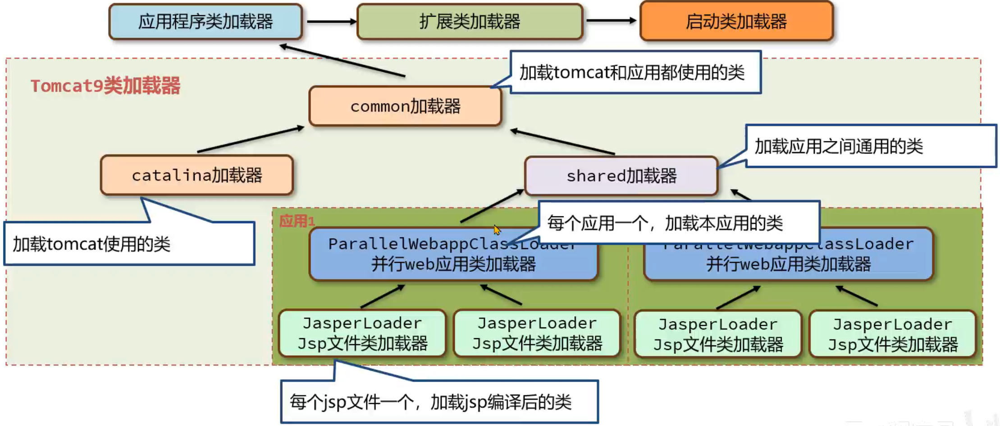

## 垃圾回收：

### 如何判断是否被引用：

- **`引用计数法、可达性分析：见基础篇6.2`**


### 有哪些引用类型：

- **`强、软、弱、虚、终结器：见基础篇6.2`**

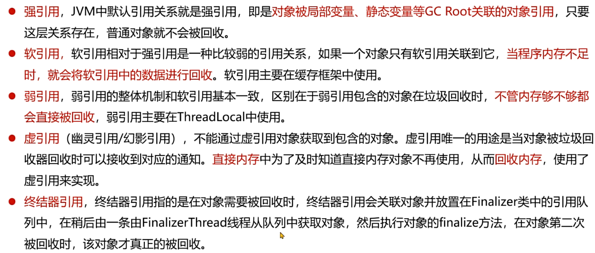

### threadlocal弱引用：

- 当threadlocal对象不再使用时，使用弱引用可以让对象被回收;因为仅有弱引用没有强引用的情况下，对象是可以被回收的。
- 弱引用并没有完全解决掉对象回收的问题，Entry对象和value值无法被回收，所以合理的做法是手动调用remove方法进行回收，然后再将threadlocal对象的强引用解除。

 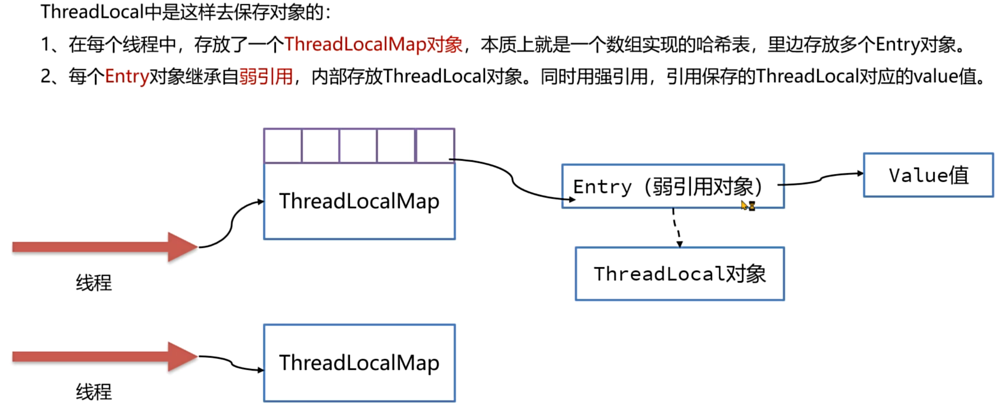

### 垃圾回收算法：

- **`见基础篇6.3`**

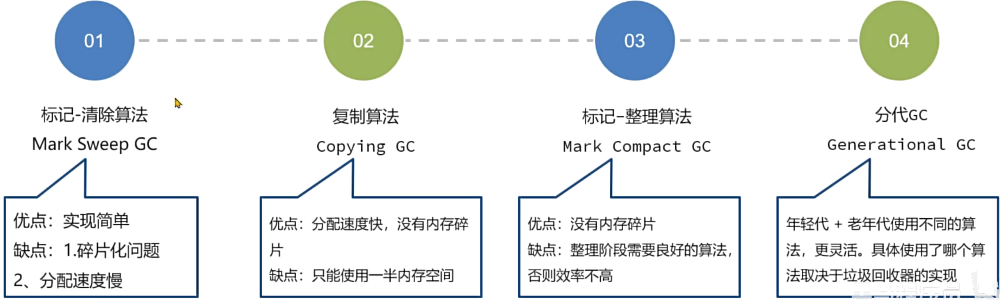

### 垃圾回收器：

- **`见基础篇6.4`**

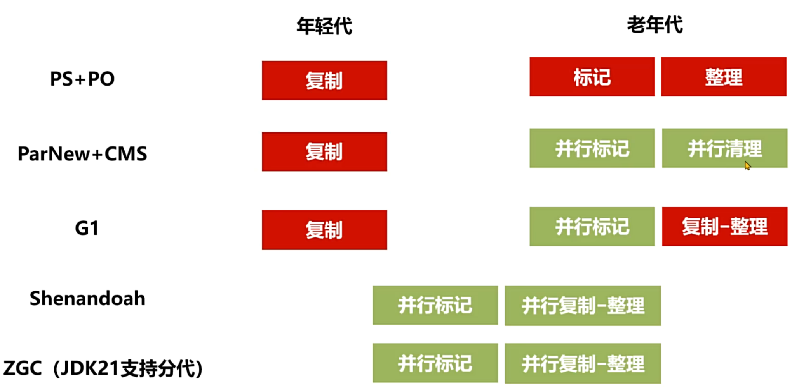

## 内存泄漏：

- **`实战篇`**

- 先用Prometheus + Grafana或者visualvm查看堆内存是否可能溢出
- 当堆内存溢出时，需要在堆内存溢出时将整个堆内存保存下来，生成内存快照文件。**生成内存快照的Java虚拟机参数:**

  1. -XX:+HeapDumpOnOutOfMemoryError: 生OutOfMemoryError错误时，自动生成hprof内存快照文件。
  2. -XX:HeapDumpPath=<path>: 指定hprof文件的输出路径。
- 使用MAT查看快照。
- 修改代码

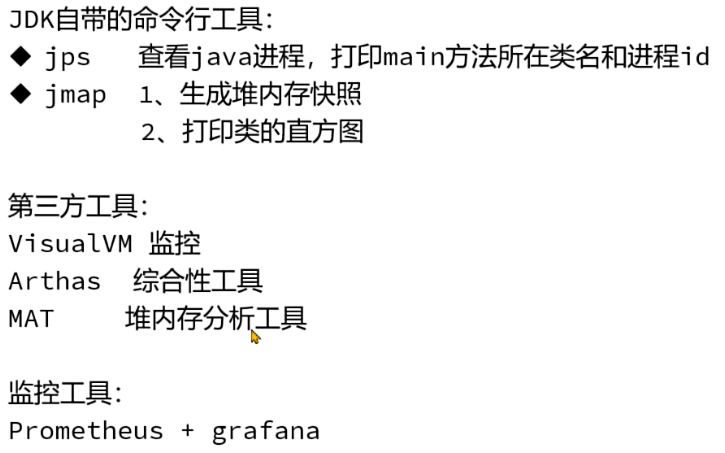

## 常见参数：

- **`见实战篇2.4.1`**


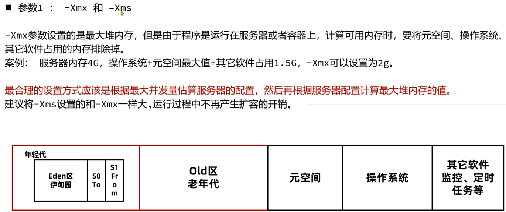

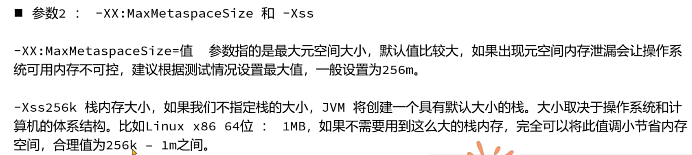

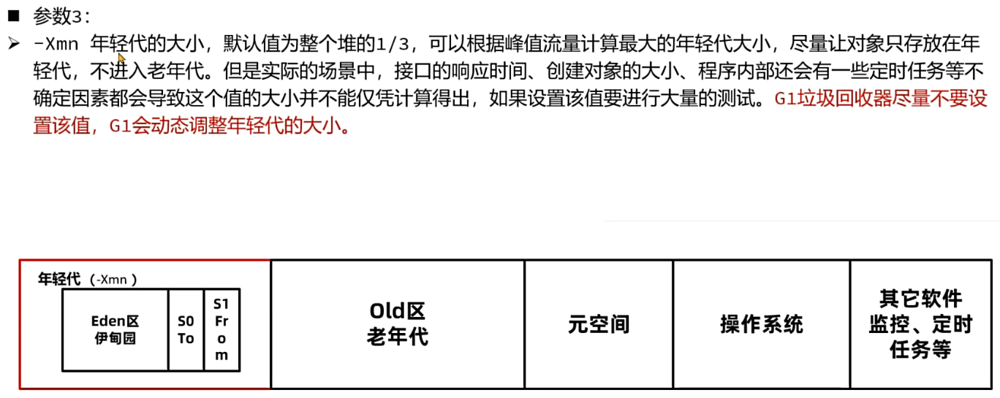

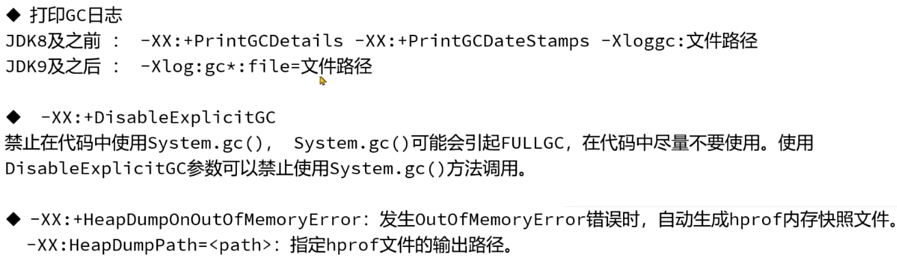

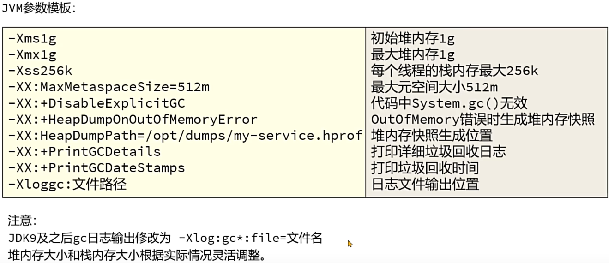
