# Java SE基础笔记

## 面向对象的理解

### <span style="color:#0000FF;">**静态方法（static）：**</span>

​        1.修饰类中的成员变量，只定义一份，所有此类的对象共享这个变量。

​        2.修饰方法，如果是 static 方法，可以由类名访问也可以由具体对象访问；如果是其他方法是不能由变量名访问的。

​        3.如果此方法不涉及任何对象的数据就可以定义为 static 方法，如果涉及对象数据就需要定义为实例方法。

​        4.静态方法常用来写工具类，工具类构造器私有，因为工具类不需要实例化。


### <span style="color:#0000FF;">**权限：**</span>


### <span style="color:#0000FF;">**继承：**</span>

​        1.如果子类和父类方法和实例名字相同都优先调用子类的，若想调用父类的需要使用 super.X。

​        2.方法重写，要方法名称和形参跟父类一模一样，在前面加一个@Override 注解：


​       3.子类构造器可以用 super（）把父类参数也初始化。


### <span style="color:#0000FF;">**多态：**</span>


​        1.父类类型变量作为参数可以接受一切子类（例如：people a = new Student()）。

​        2.多态下不能调用子类独有功能，必须是继承的功能。


### <span style="color:#0000FF;">**final：**</span>

​         1.常用于项目中配置不改变的常量中（Constant）。

​         2.如果作用于数组或者对象，是作用于地址，内容还是可以改变的。


### <span style="color:#0000FF;">**单例对象：**</span>


### <span style="color:#0000FF;">**枚举类（相当于是多例对象）：**</span>


### <span style="color:#0000FF;">**抽象类：**</span>
​                1.可以用作模板方法，模板方法有一些父类给子类共用的方法和子类作用不同的方法，这些作用不同的方法抽象出来，模板方法用 final 定义，保证子类不会重写。


### <span style="color:#0000FF;">**匿名内部类：**</span>

​        1.我认为：在一个抽象类或者接口需要经常实例为不同方法的对象时，用匿名内部类进行便携式实例化会比再去创建一个类覆写这些方法更加方便，这就是匿名内部类存在的原因。常用于调用其他 API 的方法时使用，例如图 9：


### <span style="color:#0000FF;">**接口（我觉得接口就是更纯粹的抽象类）：**</span>

​        1.接口不能创建对象，接口中只能有常量和抽象方法，定义时可以省略部分前缀：


​        2.一个类可以实现多个接口（class C implements A, B）实现多个接口时必须实现全部抽象方法，否则只能定义为抽象类。

​       3.这三个都是实例方法，有具体的作用。default 方法和普通方法没有区别可以被接口实现类调用；private 方法只能被接口内的方法调用，不能被对象调用；static 方法只能用接口名调用（注意正常类中的 static 方法是可以被实例对象调用的，然而接口中的 static 方法只能用接口名调用）。


​       4.注意事项：


## 架构体系

### <span style="color:#0000FF;">**Entity 类（实体）**</span>

实体只负责定义类，只有 get 和 set 两种操作，而不需要包含类的其他操作。

### <span style="color:#0000FF;">**Service 类（操作）**</span>

Service 的作用是对实体类进行操作，涉及对实体信息具体的操作（例如：输出、计算、排列等）与实体息息相关。

### <span style="color:#0000FF;">**Util 类（工具）**</span>

与实体无关的一些函数操作，用 static 静态函数定义（例如：取随机数）。


## Java 代码相关

### <span style="color:#0000FF;">**代码块：**</span>

1.静态代码块在程序执行之前执行，实例代码块只在实例化对象时执行。


### <span style="color:#0000FF;">**Lambda 表达式：**</span>


1.我的理解为：当接口中只有一个方法时，可以利用 lambda 表达式快速调用并重写这个方法。因为此接口只有这一个方法所以使用 lambda 表达式时可以省略参数类型等元素也不会造成歧义，如图 ：


2.静态方法引用：当 lambda 表达式只是调用一个静态方法，且-> 左右形参列表相同的情况下，可以直接这样写：

类名:: 静态方法

3.实例方法引用：当 lambda 表达式调用一个实例方法，且-> 左右形参列表相同的情况下，可以直接这样写：

对象名:: 静态方法

4.特定类方法的引用：


5.构造器引用：如果某个 lambda 表达式里只是在创建对象，并且-> 左右参数情况一致，可以直接这样写：

类名:: new


### <span style="color:#0000FF;">**异常处理：**</span>

1.常用的异常处理方式：a.将异常抛给上层，让上层统一处理；b.在最外层处理可能出现的异常让程序不会挂掉。

2.尽量使用运行时异常，运行时异常会自动把异常抛给上层；避免使用编译异常，因为编译异常需要手动一层一层向上抛，如果层多了会冗杂。


### <span style="color:#0000FF;">**泛型：**</span>

1.泛型类：class array <E> 就是泛型类，接收一中类型在定义的方法中进行灵活使用，好处是可以灵活接受多种类型。

2.泛型接口：interface A <E> 就是泛型接口，也是接受一种类型在定义的方法中灵活使用，方便给多个类来实现。

2.泛型方法：public static <T> T test(T t)就是泛型方法，方便接收和返回值的灵活。


### <span style="color:#0000FF;">**通配符和上下限：**</span>

注：Array <Father> F 并不能接收 Array <child> C，也就是集合中不支持多态。


### <span style="color:#0000FF;">**包装类：**</span>

1.泛型和集合只能接收类，不能接收基本变量例如 int double 等，因此 java 设计了包装类来将这些基本变量包装为类。


### <span style="color:#0000FF;">**集合（collection）：**</span>


```java
import java.util.*;
public class CollectionTraversalExample {
    public static void main(String[] args) {
        List<String> fruits = new ArrayList<>();
        fruits.add("Apple");
        fruits.add("Banana");
        fruits.add("Cherry");
        fruits.add("Date");
        // 1. Iterator：
        System.out.println("使用 Iterator 遍历:");
        Iterator<String> iterator = fruits.iterator();
        while (iterator.hasNext()) {
            String fruit = iterator.next();//赋值之后指向下一个节点。
            System.out.println(fruit);
        }
        // 2. for-each
        System.out.println("\n使用 for-each 循环遍历:");
        for (String fruit : fruits) {
            System.out.println(fruit);
        }
        // 3. Lambda
        System.out.println("\n使用 Lambda 表达式遍历:");
        fruits.forEach(fruit -> System.out.println(fruit));
        // 或者
        // fruits.forEach(System.out::println);
    }
}
```


1.在集合遍历中可以使用 Iterator、for-each、Lambda 进行，但只有迭代器可以进行集合的遍历修改：


2.ArrayList 和 LinkedList 的区别 ：就是数组和双向链表的区别。

3.HashSet：类似于拉链法（节点内利用红黑树链接）的 hash 表（节点由数组保存），他是通过 hashcode 来判断是否重复的，如果 HashSet 来保存*对象信息*，去重需要重写 hashcode 方法和 equals 方法。

4.LinkedHashSet：跟 HashSet 差不多，只是每个节点是用双链表链接起来的。

5.TreeSet：是基于红黑树的自动排序集合，但他只能对基本数据类型排序，如果保存的是*自定义类信息*需要：a.在类中实现 Comparable 接口来实现。b.集合定义时有个构造器可以接受比较器，可以定义时 new Comparator 比较器然后重写来实现。b 方法和 a 方法都实现的情况下，会按照 b 方法排序。


### <span style="color:#0000FF;">**集合（Map）：**</span>


1.Map 集合的遍历分为三种：

​	a.先取出 key 值，然后通过 key 值遍历。	

​	b.利用 Map 自带方法 entrySet，将成对的数据封装为对象然后存入 Set <> 来遍历。	

​	c.利用 lambda 表达式：map.forEach((k, v)-> sout(k+v))来遍历，其实 lambda 表达式底层也是用了 b 方法，forEach 方法接收了一个接口，直接通过 lambda 表达式来实现就方便很多。

2.细分的几种 Map 集合和 Set 基本是一样的原理。


### <span style="color:#0000FF;">**Stream 流：**</span>

1.Stream 流是一个简化集合、数组操作的 API，结合了 lambda 表达式。（我认为：Stream 流就是一个封装了很多实用方法的类，通过将数组或者集合转化为 Stream 流来使用这些方法）

2.集合获取 Stream 流是通过 list.stream()，数组获取是通过 stream.of(name)


### <span style="color:#0000FF;">**Collections：**</span>

1.Java 中的 Collections 是一个工具类，提供了一系列静态方法，用于操作集合（Collection）和 Map。它包含了许多常用的方法，例如排序、查找、替换、复制等。Collections 类的方法大多数都是静态的，可以直接通过类名调用，不需要实例化。它提供了许多方便的方法，使得我们可以轻松地对集合进行操作。

**sort()：对 List 集合进行排序；**
	reverse()：将 List 集合中的元素反转；
	binarySearch()：在有序的 List 集合中查找指定元素；
	**shuffle()：随机打乱 List 集合中的元素；**
	max()和 min()：找出 List 集合中的最大值和最小值；
	**addAll()：将所有指定元素添加到指定 collection 中；**
	frequency()：统计集合中某个元素出现的次数；
	copy()：将一个集合中的所有元素复制到另一个集合中。
	swap(List <?> list, int i, int j) 交换集合中指定位置的元素


### <span style="color:#0000FF;">**File/IO 流：**</span>

1.File 用来操作文件，IO 流用来读写数据。


2.IO 流：分为字节输入输出流和字符输入输出流。字节流：非常适合于做文件的复制操作。字符流：适合来读取文本特别是中文。

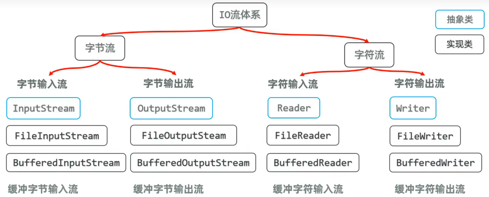

3.IO 流是需要刷新（flush：刷新了才能从内存缓冲区写入文件）和关闭（close）的，close 的时候会自动 flush，但在 IO 流中可能因为程序异常导致没有释放流，所以可以使用 try-catch，在 try（）中定义的流会在最后自动释放（try 中只能接收继承了自动关闭类的资源），所以在 try 中定义流可以省略刷新和关闭步骤。

4.缓冲流：操作跟普通流一样，只需要对定义的流进行包装，因为自带了 8kb 的缓冲池所以会有更好的读写性能。


5.复制速度对比： 缓冲流按照字节数组形式 > 字节流按照字节数组形式 > 缓冲流按照一个字节形式 > 字节流按照一个字节形式。建议使用缓冲流+字节数组来进行文件复制（其中字节数组用 8-32kb 最好）

6.字符输入转化流 InputStreamReader（用的不多）：


7.打印流 PrintSteam/PrintWriter：打印流实现更加方便和高效。

构造器：public PrintSteam(OutputStream/File/String: 路径)

方法：println()

8.特殊数据输入/输出流 DataOutputStream/DataInputStream：

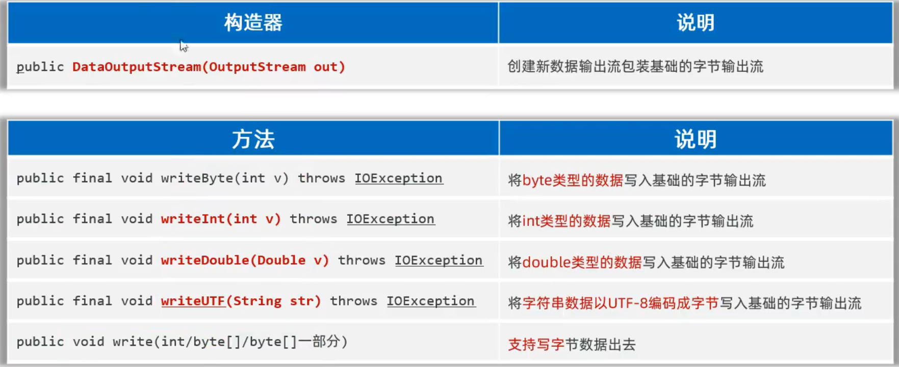


### **<span style="color:#0000FF;">IO 框架（需要手动导入 common-io 包）：</span>**

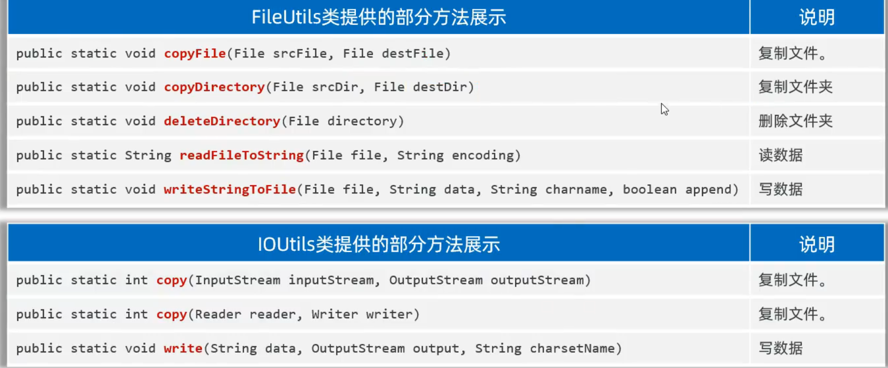


### <span style="color:#0000FF;">**多线程：**</span>

1.创建多线程方式：

​	a.定义一个线程类继承 Thread 类，重写 run 方法，然后声明对象调用 start 方法。（缺点：不能继承其他类，没有返回值）

​	b.定义一个线程任务类实现 Runnable 接口，重写 run 方法，然后创建一个线程任务类对象，最后把这个对象交给 Thread 对象处理用 start 启动。（缺点：没有返回值）

​	c.Callable 创建线程：（缺点：代码麻烦）


2.线程安全：当两个线程都要对同一个数据进行修改时就容易造成线程安全问题。

解决方案：

​	a.同步代码块：可以使用 synchronized(任意唯一对象){访问数据代码块}来限制访问数据代码块的使用，实例方法建议使用 this 作为锁，静态方法建议使用字节码（类名.class）作为锁对象。

​	b.同步方法：可以使用例如：public synchronized void fun(){}来进行对一整个方法上锁，会自动生成锁对象。

​	c.Lock 锁：可以在类中先定义一个 Lock 锁：private final Lock lk = new ReentrantLock(); 然后用 try-finally 控制访问数据代码，try 之前使用 lk.lock()上锁，在 finally 中使用 lk.unlock()解锁。


3.线程池：因为有可能会启动过于多的线程导致处理器不够用，因此采用线程池来管理线程。一下为创建线程池的方法：

​	a.利用 ThreadPoolExecutor（线程实现类）创建线程池，其中只有指定核心数量以及排队队列都满了才会启用临时线程，直到零时线程也满了排队也满了才会开启拒绝：

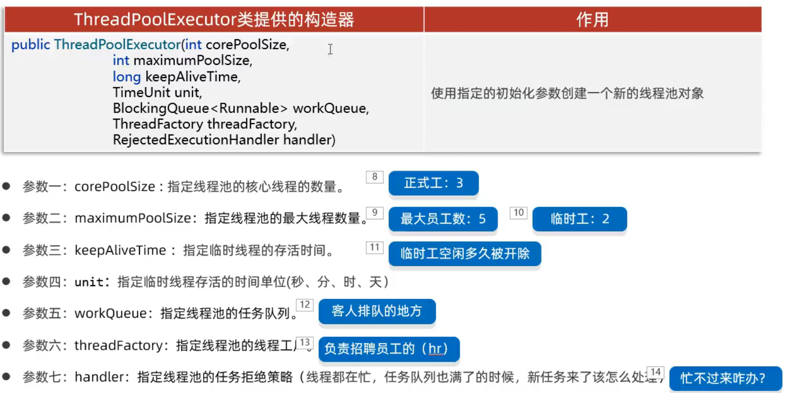

任务拒绝策略：

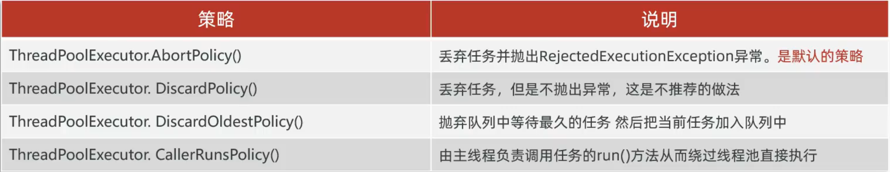

常用方法：

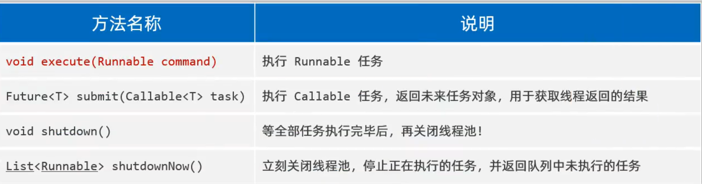

​	b.利用 Executor 创建线程池底层也是基于 ThreadPoolExecutor，Executor 可以更加方便的创建线程池但是会具有很多风险（排队不限制、线程不限制），阿里巴巴明确禁止使用：


### <span style="font-weight:bold; color:#0000FF;">网络编程：</span>

1.InetAddress类实现对ip的获取和访问：

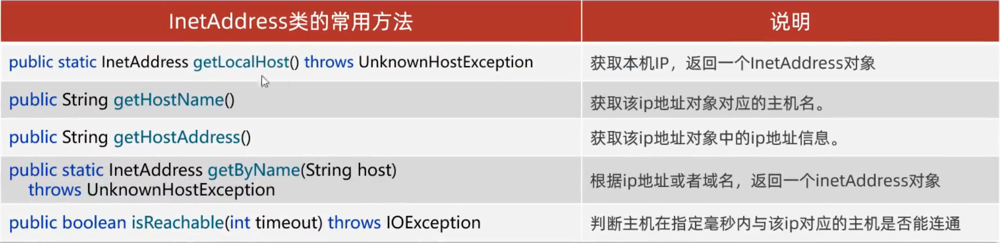

2.UDP通信：其中DatagramSocket是用于创建客户端和服务端的，可以用于发送和接收数据，最后要对socket进行close操作。DatagramPacket是用于对于数据具体处理的，例如有getLength方法查看数据长度。

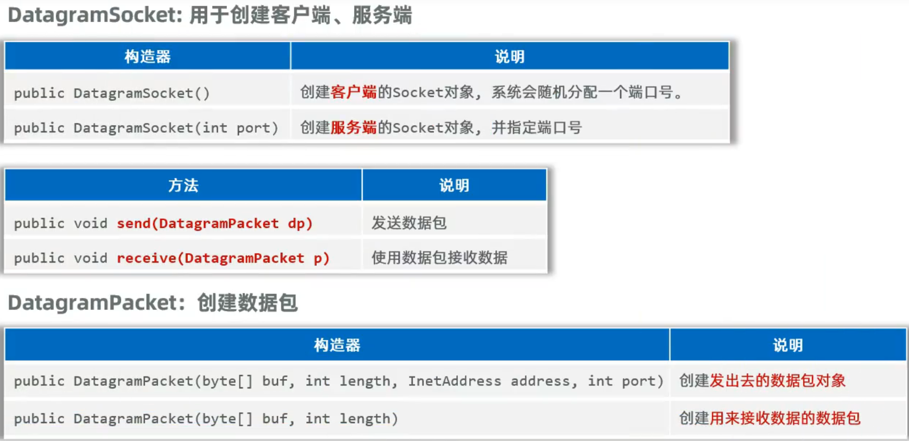

3.TCP通信：java中的tcp通信是基于流的，服务端启动之后会一直阻塞在socket.accept()方法这一行一直等待客户端与他建立连接，数据是通过IO流（先用方法获取字节流，然后通常用特殊数据流包装）来包装的并且发送数据和接收数据必须一一对应。以下分别是客户端和服务端方法，如果要实现连接多客户端需要使用多线程：


4.B/S架构设计：因为在B/S架构中客户端是浏览器，所以只需要设计服务端，服务端设计与TCP通信是大致相同的（都是用流传输的，用打印流包装），要注意的是发送内容需要按照http协议格式发送，并且采用线程池进行优化因为对于网页的访问管道的建立和关闭都是很频繁的所以用线程池控制会更好。


### <span style="color:#0000FF;">**时间获取：**</span>

```java
public static void main(String[] args) {
    	//时间:LocalDateTime
        LocalDateTime now=LocalDateTime.now();
        System.out.println(now);
        System.out.println(now.getYear());
        System.out.println(now.getDayOfYear());
        LocalDateTime now2=now.plusSeconds(60);//60秒后System.out.println(now);
        System.out.println(now2);
        //格式化:DateTimeFormatter
        //1、创建一个格式化对象
        DateTimeFormatter dtf = DateTimeFormatter.ofPattern("yyyy/MM/dd HH:mm:SS EEE a");
        //2、格式化
        String result2 = dtf.format(now);
        System.out.println(result2);
    }
```


### **<span style="color:#0000FF;">字符串拼接：</span>**

1.使用+对字符串共享是效率高的，但是如果对字符串拼接的效率很低就要用到StringBuilder来实现了：

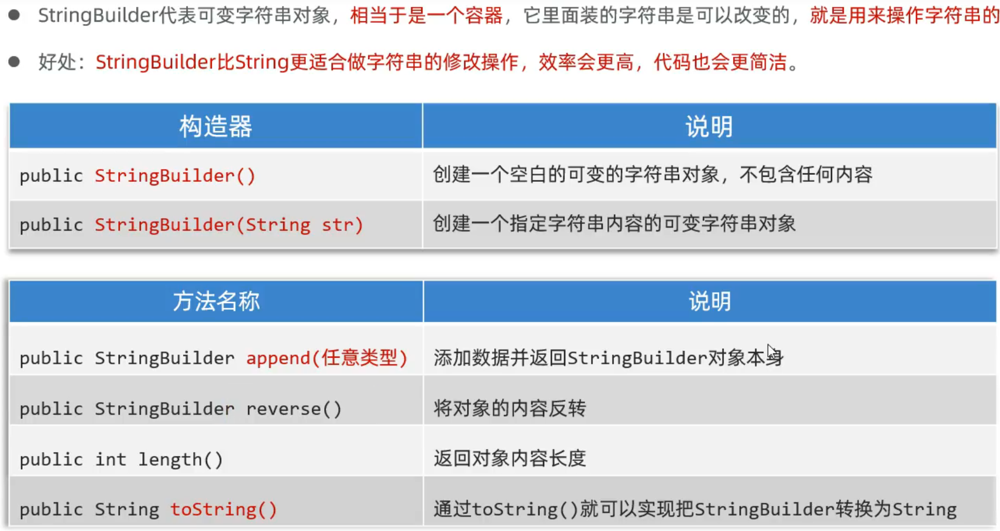


### **<span style="color:#0000FF;">解决计算精度问题：</span>**

使用BigDecimal来解决，通过把小数转化为字符串然后使用BigDecimal的方法来优化二进制计算精度问题，其中调用valueOf方法可以自动将double类型数据转化为字符串数据然后返回BigDecimal：

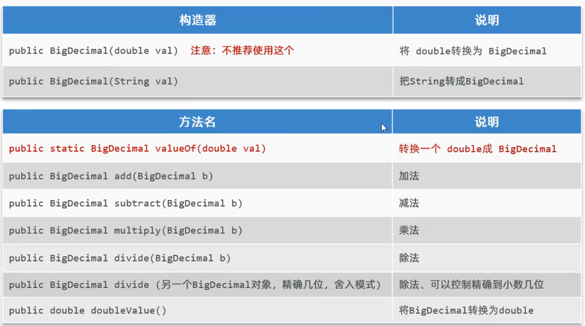


### <span style="color:#0000FF;">**Junit单元测试：**</span>

1.具体步骤：编写测试类和测试方法，在里面调用需要测试的方法通过传入不同数据进行测试。但Junit测试不会判断输出的数据是否有误，需要自行添加断言测试：Assert.assertEquals("失败输出内容",期待值,返回值)

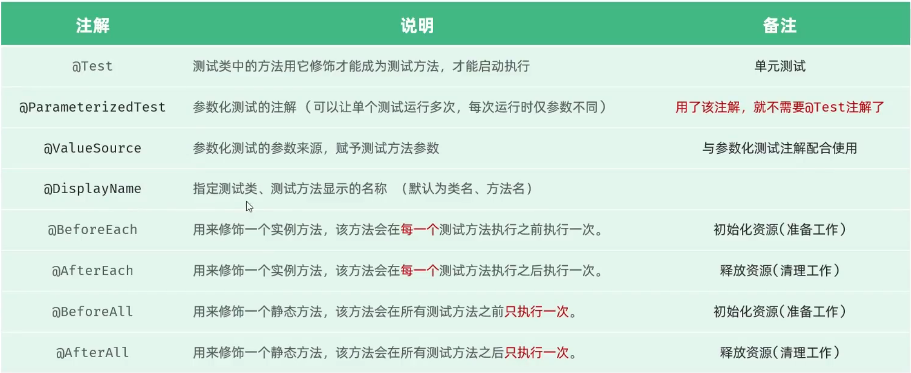

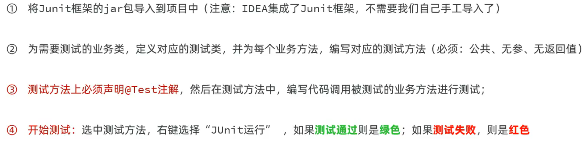


### **<span style="color:#0000FF;">反射：</span>**

我认为：反射就是一个对类以及类中信息的“外挂式”地访问和操作，可以强制访问私有变量、获取类中所有信息等。

0.反射的作用：a.可以在运行时得到一个类的全部成分然后操作。
				    b.可以破坏封装性。(很突出)
				    c.也可以破坏泛型的约束性。(很突出)
				    d.更重要的用途是适合:做Java高级框架。
				    e.基本上主流框架都会基于反射设计一些通用技术功能。

1.首先要明白的是，**java中类也是对象**，反射就是需要拿到类对象然后对类中的内容（类：class 构造器：Constructor 成员变量：Field 方法：Method）进行访问，拿类对象方法如下：

```java
//1、获取类本身:类.class
Class c1=Student.class;
System.out.println(c1);
//2、获取类本身:Class.forName("类的全类名")
Class c2 = Class.forName("com.itheima.demo2reflect.Student");
System.out.println(c2);
//3、获取类本身:对象.getclass()
Students=new student();
Class c3=s.getClass()
System.out.println(c3):
```


2.对于构造器Constructor的方法：

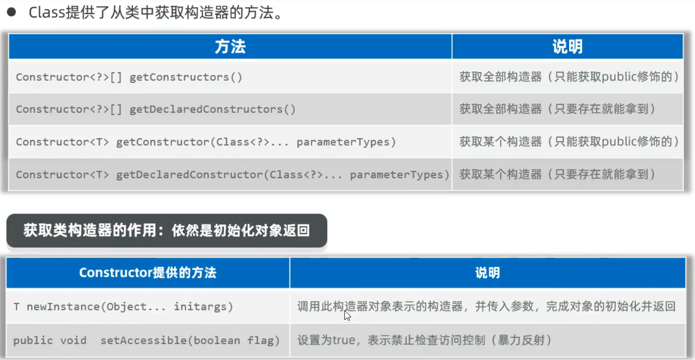

3.对于成员变量Field的方法：


4.对于成员方法Method的方法：

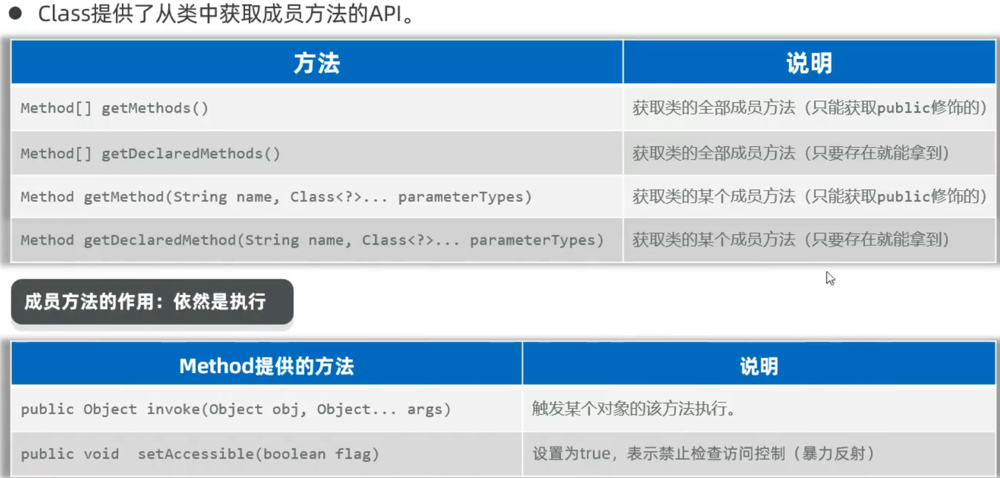


### <span style="color:#0000FF;">**注解：**</span>

1.作用：让其他程序根据注解信息来执行该程序。

2.自定义注解：自定义注解底层就是一个接口，使用自定义注解就是实例化了一个对象。

3.元注解：就是注解注解的注解常用的有两个：

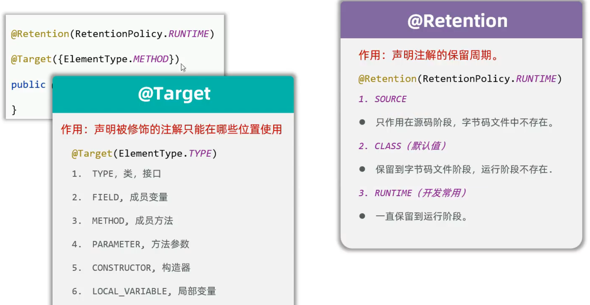

4.注解的解析：跟反射有关，先要拿到被注解的对象，然后通过以下的方法，来对被注解的对象进行定制化操作。 

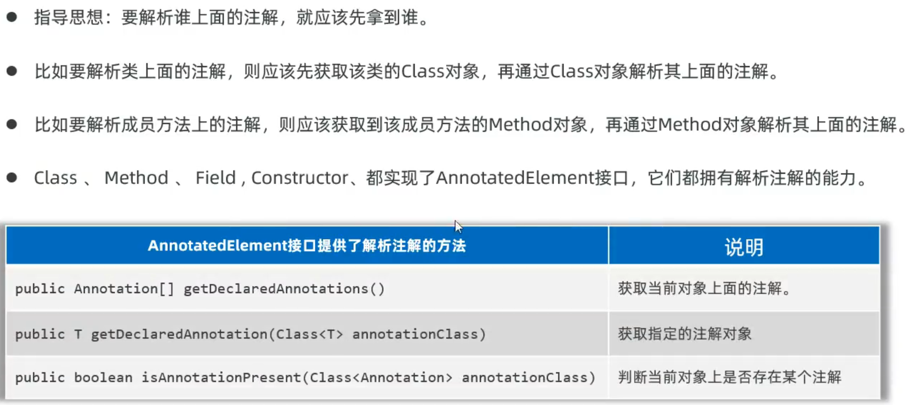


### <span style="font-weight:bold; color:#0000FF;">动态代理proxy：</span>

1.代理需要被代理类先继承一个接口，并重写接口的所有方法（接口就是代理和被代理类的桥梁，用这个接口定义最后得到的代理），然后创建代理对象调用被代理对象的方法，在调用时可以进行额外控制和操作（丰富了代码功能），并且可以将传入和返回类型定义为泛型为所有类代理，这就极大简化并丰富了代码。

创建代理如下：

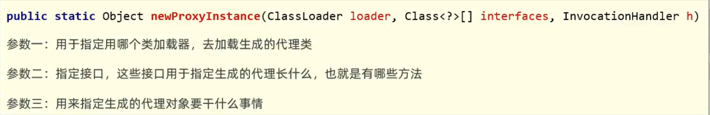

2.AOP切面思想：代理就可以使用到这种思想，在代理中可以在被代理类方法执行前后各插入一段代码，这就是AOP思想。
