# 基础：

## 事务：

### 简介：

事务是一组操作的集合，事务会把所有操作作为一个整体一起向系统提交或撤销操作请求，即这些操作要么同时成功，要么同时失败。

**基本操作**：

```sql
-- 1. 查询张三账户余额
select * from account where name = '张三';
-- 2. 将张三账户余额-1000
update account set money = money - 1000 where name = '张三';
-- 此语句出错后张三钱减少但是李四钱没有增加
模拟sql语句错误
-- 3. 将李四账户余额+1000
update account set money = money + 1000 where name = '李四';
-- 查看事务提交方式
SELECT @@AUTOCOMMIT;
-- 设置事务提交方式，1为自动提交，0为手动提交，该设置只对当前会话有效
SET @@AUTOCOMMIT = 0;
-- 提交事务
COMMIT;
-- 回滚事务
ROLLBACK;
-- 设置手动提交后上面代码改为：
select * from account where name = '张三';
update account set money = money - 1000 where name = '张三';
update account set money = money + 1000 where name = '李四';
commit;
```

**操作方式二：**

- 开启事务：`START TRANSACTION 或 BEGIN TRANSACTION;`
- 提交事务：**`COMMIT`**;
- 回滚事务：`ROLLBACK;`
- 操作实例：

```
start transaction;
select * from account where name = '张三';
update account set money = money - 1000 where name = '张三';
update account set money = money + 1000 where name = '李四';
commit;
```

### ACID

- 原子性(Atomicity)：事务是不可分割的最小操作单元，要么全部成功，要么全部失败
- 一致性(Consistency)：事务完成时，必须使所有数据都保持一致状态
- 隔离性(Isolation)：数据库系统提供的隔离机制，保证事务在不受外部并发操作影响的独立环境下运行
- 持久性(Durability)：事务一旦提交或回滚，它对数据库中的数据的改变就是永久的

### 并发事务

| 问题       | 描述                                                         |
| ---------- | ------------------------------------------------------------ |
| 脏读       | **一个事务**读到**另一个事务**还没提交的数据                 |
| 不可重复读 | **一个事务**先后读取**同一条记录**，但两次读取的数据不同     |
| 幻读       | **一个事务**按照条件查询数据时，没有对应的数据行，但是再插入数据时，又发现这行数据已经存在 |

- **并发事务隔离级别：**√表示在当前隔离级别下该问题会出现
- Serializable 性能最低；Read uncommitted 性能最高，数据安全性最差

| 隔离级别                            | 脏读 | 不可重复读 | 幻读 |
| ----------------------------------- | ---- | ---------- | ---- |
| Read uncommitted（读未提交）        | √    | √          | √    |
| Read committed（读已提交）          | ×    | √          | √    |
| Repeatable Read(可重复读，**默认**) | ×    | ×          | √    |
| Serializable（串行化）              | ×    | ×          | ×    |

- 查看事务隔离级别：`SELECT @@TRANSACTION_ISOLATION;`
- 设置事务隔离级别：`SET [ SESSION | GLOBAL ] TRANSACTION ISOLATION LEVEL {READ UNCOMMITTED | READ COMMITTED | REPEATABLE READ | SERIALIZABLE };`
- SESSION 是会话级别，表示只针对当前会话有效，GLOBAL 表示对所有会话有效

# 进阶：

## 体系结构：

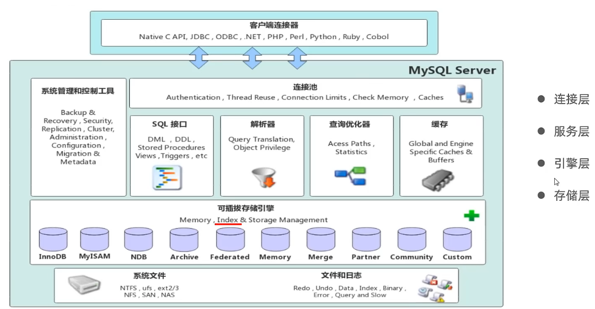

## 存储引擎

### 简介：

- 存储引擎就是**存储数据、建立索引、更新/查询数据等技术的实现方式**。存储引擎是基于表而不是基于库的，所以**存储引擎也可以被称为表引擎**。默认存储引擎是InnoDB。

**相关操作：**

```sql
-- 查询建表语句
show create table account;
-- 建表时指定存储引擎
CREATE TABLE 表名(
    ...
) ENGINE=INNODB;
-- 查看当前数据库支持的存储引擎
show engines;
```

### InnoDB

- InnoDB 是一种兼顾高可靠性和高性能的通用存储引擎，在 MySQL 5.5 之后，InnoDB 是默认的 MySQL 引擎

特点：

- DML 操作遵循 ACID 模型，支持**事务**
- **行级锁**，提高并发访问性能
- 支持**外键**约束，保证数据的完整性和正确性

文件：

- xxx.ibd: xxx代表表名，InnoDB 引擎的每张表都会对应这样一个表空间文件，存储该表的表结构（frm、sdi）、数据和索引。

参数：innodb_file_per_table，决定多张表共享一个表空间还是每张表对应一个表空间

查看 Mysql 变量：`show variables like 'innodb_file_per_table';`

从idb文件提取表结构数据（在cmd运行）：`ibd2sdi xxx.ibd`

InnoDB 逻辑存储结构：

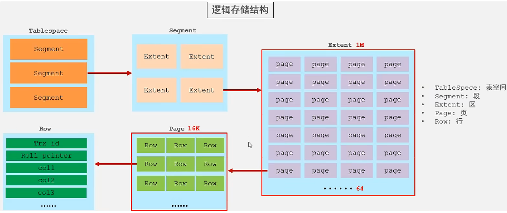

### MyISAM：

MyISAM 是 MySQL 早期的默认存储引擎。

**特点：**

- 不支持事务，不支持外键
- 支持表锁，不支持行锁
- 访问速度快

**文件：**

- xxx.sdi: 存储表结构信息
- xxx.MYD: 存储数据
- xxx.MYI: 存储索引

### Memory：

Memory 引擎的表数据是**存储在内存中**的，受硬件问题、断电问题的影响，只能将这些表作为临时表或缓存使用。

特点：

- 存放在内存中，速度快
- hash索引（默认）

文件：

- xxx.sdi: 存储表结构信息

### 存储引擎特点

| 特点         | InnoDB              | MyISAM     | Memory |
| ------------ | ------------------- | ---------- | ------ |
| 存储限制     | 64TB                | 有         | 有     |
| 事务安全     | **`支持`**          | **`-`**    | -      |
| 锁机制       | **`行锁`**          | **`表锁`** | 表锁   |
| B+tree索引   | 支持                | 支持       | 支持   |
| Hash索引     | -                   | -          | 支持   |
| 全文索引     | 支持（5.6版本之后） | 支持       | -      |
| 空间使用     | 高                  | 低         | N/A    |
| 内存使用     | 高                  | 低         | 中等   |
| 批量插入速度 | 低                  | 高         | 高     |
| 支持外键     | **`支持`**          | **`-`**    | -      |

### 存储引擎的选择

在选择存储引擎时，应该根据应用系统的特点选择合适的存储引擎。对于复杂的应用系统，还可以根据实际情况选择多种存储引擎进行组合。

- InnoDB: 如果应用对事物的完整性有比较高的要求，在并发条件下要求数据的一致性，数据操作除了插入和查询之外，还包含很多的更新、删除操作，则 InnoDB 是比较合适的选择
- MyISAM: 如果应用是以读操作和插入操作为主，只有很少的更新和删除操作，并且对事务的完整性、并发性要求不高，那这个存储引擎是非常合适的。
- Memory: 将所有数据保存在内存中，访问速度快，通常用于临时表及缓存。Memory 的缺陷是对表的大小有限制，太大的表无法缓存在内存中，而且无法保障数据的安全性

电商中的足迹和评论适合使用 MyISAM 引擎，缓存适合使用 Memory 引擎。

## 索引：

### 简介：

索引是帮助 MySQL **高效获取数据**的**数据结构（有序）**。在数据之外，数据库系统还维护着满足特定查找算法的数据结构，这些数据结构以某种方式引用（指向）数据，这样就可以在这些数据结构上实现高级查询算法，这种数据结构就是索引。

优点：

- 提高数据检索效率，降低数据库的IO成本
- 通过索引列对数据进行排序，降低数据排序的成本，降低CPU的消耗

缺点：

- 索引列也是要占用空间的
- 索引大大提高了查询效率，但降低了更新的速度，比如 INSERT、UPDATE、DELETE

### 索引结构

| 索引结构            | 描述                                                         |
| ------------------- | ------------------------------------------------------------ |
| B+Tree              | 最常见的索引类型，**大部分引擎都支持B+树索引**               |
| Hash                | 底层数据结构是用哈希表实现，**只有精确匹配索引列的查询才有效，不支持范围查询** |
| R-Tree(空间索引)    | 空间索引是 MyISAM 引擎的一个特殊索引类型，**主要用于地理空间数据类型**，通常使用较少 |
| Full-Text(全文索引) | 是一种通过建立**倒排索引**，快速匹配文档的方式，类似于 Lucene, Solr, ES |

| 索引       | InnoDB        | MyISAM | Memory |
| ---------- | ------------- | ------ | ------ |
| B+Tree索引 | 支持          | 支持   | 支持   |
| Hash索引   | 不支持        | 不支持 | 支持   |
| R-Tree索引 | 不支持        | 支持   | 不支持 |
| Full-text  | 5.6版本后支持 | 支持   | 不支持 |

#### B树：

- 二叉树和红黑树都存在大数据量情况下，层级较深，检索速度慢的问题。
- 为了解决上述问题，可以使用 B-Tree 结构。B-Tree (多路平衡查找树) 以一棵最大度数（max-degree，指一个节点的子节点个数）为5（5阶）的 b-tree 为例（每个节点最多存储4个key，5个指针）

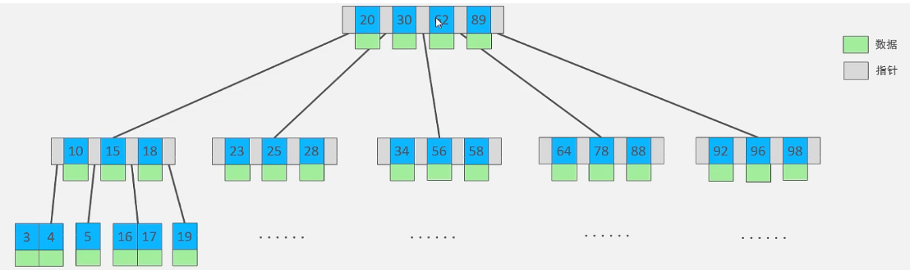

#### B+树：

与 B-Tree 的区别：

- 所有的数据都会出现在叶子节点
- 叶子节点形成一个单向链表


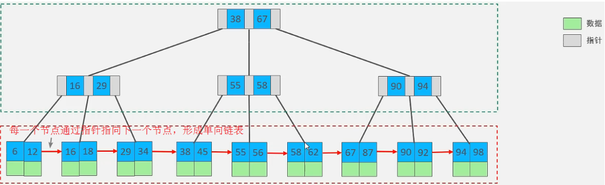

MySQL 索引数据结构对经典的 B+Tree 进行了优化。在原 B+Tree 的基础上，增加一个指向相邻叶子节点的链表指针，就形成了带有顺序指针的 B+Tree，提高区间访问的性能。

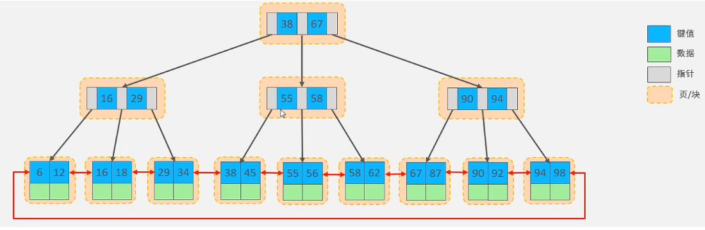

#### Hash：

哈希索引就是采用一定的hash算法，将键值换算成新的hash值，映射到对应的槽位上，然后存储在hash表中。
如果两个（或多个）键值，映射到一个相同的槽位上，他们就产生了hash冲突（也称为hash碰撞），可以通过链表来解决。

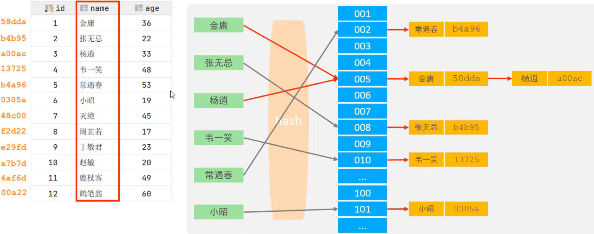

特点：

- Hash索引只能用于对等比较（=、in），不支持范围查询（betwwn、>、<、…）
- 无法利用索引完成排序操作
- 查询效率高，通常只需要一次检索就可以了，效率通常要高于 B+Tree 索引

存储引擎支持：

- Memory
- InnoDB: 具有自适应hash功能，hash索引是存储引擎根据 B+Tree 索引在指定条件下自动构建的。

#### 面试题

1. 为什么 InnoDB 存储引擎选择使用 B+Tree 索引结构？

- 相对于二叉树，层级更少，搜索效率高
- 对于 B-Tree，无论是叶子节点还是非叶子节点，都会保存数据，这样导致一页中存储的键值减少，指针也跟着减少，要同样保存大量数据，只能增加树的高度，导致性能降低（因为是存储在page上，而page大小是固定16k,所以如果在非叶子结点存放数据就会导致非叶子节点能存放的key减少）
- 相对于 Hash 索引，B+Tree 支持范围匹配及排序操作

### 索引分类：

#### 聚集索引&二级索引

| 分类     | 含义                                                 | 特点                     | 关键字   |
| -------- | ---------------------------------------------------- | ------------------------ | -------- |
| 主键索引 | 针对于表中主键创建的索引                             | 默认自动创建，只能有一个 | PRIMARY  |
| 唯一索引 | 避免同一个表中某数据列中的值重复                     | 可以有多个               | UNIQUE   |
| 常规索引 | 快速定位特定数据                                     | 可以有多个               |          |
| 全文索引 | 全文索引查找的是文本中的关键词，而不是比较索引中的值 | 可以有多个               | FULLTEXT |

在 InnoDB 存储引擎中，根据索引的存储形式，又可以分为以下两种：

| 分类                      | 含义                                                       | 特点                 |
| ------------------------- | ---------------------------------------------------------- | -------------------- |
| 聚集索引(Clustered Index) | 将数据存储与索引放一块，索引结构的叶子节点保存了行数据     | 必须有，而且只有一个 |
| 二级索引(Secondary Index) | 将数据与索引分开存储，索引结构的叶子节点关联的是对应的主键 | 可以存在多个         |

聚集索引选取规则：

- 如果存在主键，主键索引就是聚集索引
- 如果不存在主键，将使用第一个唯一(UNIQUE)索引作为聚集索引
- 如果表没有主键或没有合适的唯一索引，则 InnoDB 会自动生成一个 rowid 作为隐藏的聚集索引

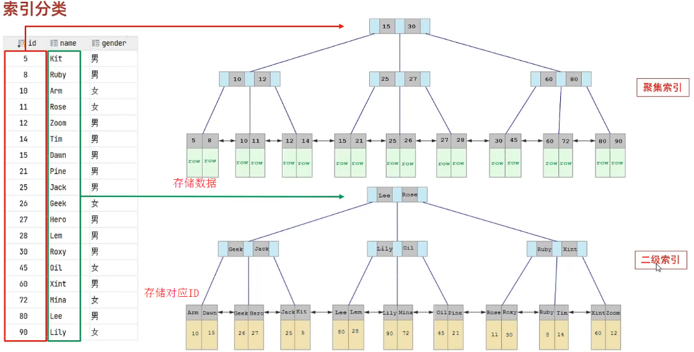

**查询流程：**

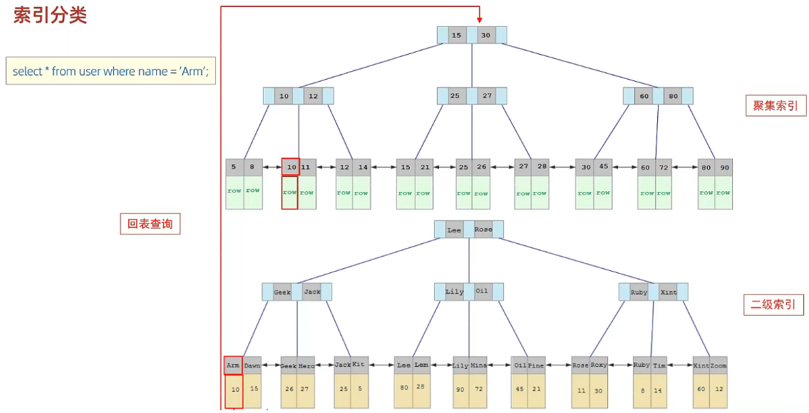

#### 思考：

1. 以下 SQL 语句，哪个执行效率高？为什么？

```
select * from user where id = 10;
select * from user where name = 'Arm';
-- 备注：id为主键，name字段创建的有索引
```

答：第一条语句，因为第二条需要回表查询，相当于两个步骤。

2. InnoDB 主键索引的 B+Tree 高度为多少？

答：假设一行数据大小为1k，一页中可以存储16行这样的数据。InnoDB 的指针占用6个字节的空间，主键假设为bigint，占用字节数为8.
	可得公式：`n * 8 + (n + 1) * 6 = 16 * 1024`，其中 8 表示 bigint 占用的字节数，n 表示当前节点存储的key的数量，(n + 1) 表示指针数量（比key多一个）。算出n约为1170。

如果树的高度为2，那么他能存储的数据量大概为：`1171 * 16 = 18736`；
如果树的高度为3，那么他能存储的数据量大概为：`1171 * 1171 * 16 = 21939856`。

另外，如果有成千上万的数据，那么就要考虑分表，涉及运维篇知识。

### 索引语法：

创建索引：`CREATE [ UNIQUE | FULLTEXT ] INDEX index_name ON table_name (index_col_name, ...);`
如果不加 CREATE 后面不加索引类型参数，则创建的是常规索引

查看索引：`SHOW INDEX FROM table_name;`

删除索引：`DROP INDEX index_name ON table_name;`

案例：

```sql
-- name字段为姓名字段，该字段的值可能会重复，为该字段创建索引
create index idx_user_name on tb_user(name);
-- phone手机号字段的值非空，且唯一，为该字段创建唯一索引
create unique index idx_user_phone on tb_user (phone);
-- 为profession, age, status创建联合索引
create index idx_user_pro_age_stat on tb_user(profession, age, status);
-- 为email建立合适的索引来提升查询效率
create index idx_user_email on tb_user(email);
-- 删除索引
drop index idx_user_email on tb_user;
```

### 性能分析：

#### 查看执行频次：

查看当前数据库的 INSERT, UPDATE, DELETE, SELECT 访问频次：
`SHOW GLOBAL STATUS LIKE 'Com_______';` 或者 `SHOW SESSION STATUS LIKE 'Com_______';`
例：`show global status like 'Com_______'`

#### 慢查询日志

慢查询日志记录了所有执行时间超过指定参数（long_query_time，单位：秒，默认10秒）的所有SQL语句的日志。
MySQL的慢查询日志默认没有开启，需要在MySQL的配置文件（/etc/my.cnf）中配置如下信息：
\# 开启慢查询日志开关
slow_query_log=1
\# 设置慢查询日志的时间为2秒，SQL语句执行时间超过2秒，就会视为慢查询，记录慢查询日志
long_query_time=2
更改后记得重启MySQL服务，日志文件位置：/var/lib/mysql/localhost-slow.log

查看慢查询日志开关状态：`show variables like 'slow_query_log';`

#### profile

show profile 能在做SQL优化时**帮我们了解时间都耗费在哪里**。通过 have_profiling 参数，能看到当前 MySQL 是否支持 profile 操作：
`SELECT @@have_profiling;`
profiling 默认关闭，可以通过set语句在session/global级别开启 profiling：
`SET profiling = 1;`
查看所有语句的耗时：
`show profiles;`
查看指定query_id的SQL语句各个阶段的耗时：
`show profile for query query_id;`
查看指定query_id的SQL语句CPU的使用情况
`show profile cpu for query query_id;`

#### explain

EXPLAIN 或者 DESC 命令获取 MySQL 如何执行 SELECT 语句的信息，包括在 SELECT 语句执行过程中表如何连接和连接的顺序。
**语法：**
\# 直接在select语句之前加上关键字 explain / desc
EXPLAIN SELECT 字段列表 FROM 表名 HWERE 条件;

EXPLAIN 各字段含义：

- id：select 查询的序列号，表示查询中执行 select 子句或者操作表的顺序（id相同，执行顺序从上到下；id不同，值越大越先执行）
- select_type：表示 SELECT 的类型，常见取值有 SIMPLE（简单表，即不适用表连接或者子查询）、PRIMARY（主查询，即外层的查询）、UNION（UNION中的第二个或者后面的查询语句）、SUBQUERY（SELECT/WHERE之后包含了子查询）等
- **`type`**：表示连接类型，性能由好到差的连接类型为 NULL（没有查询表）、system（查询系统表）、const（根据唯一索引查询）、eq_ref、ref（根据非唯一索引查询）、range、index、all
- **`possible_key`**：可能应用在这张表上的索引，一个或多个
- **`Key`**：实际使用的索引，如果为 NULL，则没有使用索引
- **`Key_len`**：表示索引中使用的字节数，该值为索引字段最大可能长度，并非实际使用长度，在不损失精确性的前提下，长度越短越好
- rows：MySQL认为必须要执行的行数，在InnoDB引擎的表中，是一个估计值，可能并不总是准确的
- filtered：表示返回结果的行数占需读取行数的百分比，filtered的值越大越好
- **`Extra`：**额外信息

### 使用原则：

#### 最左前缀法则：

如果索引关联了多列（**联合索引**），要遵守最左前缀法则，最左前缀法则指的是**`查询语句中必须包含索引的最左列，并且不跳过索引中的列。如果跳跃某一列，索引将部分失效（后面的字段索引失效）。`**

**联合索引**中，出现范围查询（<, >），范围查询右侧的列索引失效。可以用>=或者<=来规避索引失效问题。

#### 索引失效情况

1. 在索引列上进行运算操作，索引将失效。如：`explain select * from tb_user where substring(phone, 10, 2) = '15';`
2. 字符串类型字段使用时，不加引号，索引将失效。如：`explain select * from tb_user where phone = 17799990015;`，此处phone的值没有加引号
3. 模糊查询中，如果仅仅是尾部模糊匹配，索引不会是失效；如果是头部模糊匹配，索引失效。如：`explain select * from tb_user where profession like '%工程';`，前后都有 % 也会失效。
4. 用 or 分割开的条件，如果 or 其中一个条件的列没有索引，那么涉及的索引都不会被用到。
5. 如果 MySQL 评估使用索引比全表更慢，则不使用索引。

#### sql提示：

是优化数据库的一个重要手段，简单来说，**就是在SQL语句中加入一些人为的提示来达到选择索引目的，如果不限制默认优先使用联合索引。**

例如，使用索引：
`explain select * from tb_user use index(idx_user_pro) where profession="软件工程";`

不使用哪个索引：
`explain select * from tb_user ignore index(idx_user_pro) where profession="软件工程";`

必须使用哪个索引：
`explain select * from tb_user force index(idx_user_pro) where profession="软件工程";`

use 是建议，实际使用哪个索引 MySQL 还会自己权衡运行速度去更改，force就是无论如何都强制使用该索引。

#### 覆盖索引&回表查询：

尽量使用覆盖索引（查询使用了索引，并且需要返回的列，在该索引中已经全部能找到），减少 select *。**其实就是查询结果如果只有联合索引和聚集索引的话，就不需要回表查询了，因为联合索引B+树中有对应返回数据以及主键值。**

- explain 中 extra 字段含义：
  `using index condition`：查找使用了索引，但是需要回表查询数据
  `using where; using index;`：查找使用了索引，但是需要的数据都在索引列中能找到，所以不需要回表查询

1. 如果在聚集索引中直接能找到对应的行，则直接返回行数据，只需要一次查询，哪怕是select *；
2. 如果在辅助索引中找聚集索引，如`select id, name from xxx where name='xxx';`，也只需要通过辅助索引(name)查找到对应的id，返回name和name索引对应的id即可，只需要一次查询；
3. 如果是通过辅助索引查找其他字段，则需要回表查询，如`select id, name, gender from xxx where name='xxx';`

**面试题：**一张表，有四个字段（id, username, password, status），由于数据量大，需要对以下SQL语句进行优化，该如何进行才是最优方案：
`select id, username, password from tb_user where username='itcast';`

解：给username和password字段建立联合索引，则不需要回表查询，直接覆盖索引

#### 前缀索引：

当字段类型为字符串（varchar, text等）时，有时候需要索引很长的字符串，这会让索引变得很大，查询时，浪费大量的磁盘IO，影响查询效率，此时可以只降字符串的一部分前缀，建立索引，这样可以大大节约索引空间，从而提高索引效率。

语法：`create index idx_xxxx on table_name(columnn(n));`
前缀长度：可以根据索引的选择性来决定，而选择性是指不重复的索引值（基数）和数据表的记录总数的比值，索引选择性越高则查询效率越高，唯一索引的选择性是1，这是最好的索引选择性，性能也是最好的。
求选择性公式：

```sql
select count(distinct email) / count(*) from tb_user;
select count(distinct substring(email, 1, 5)) / count(*) from tb_user;
```

show index 里面的sub_part可以看到接取的长度

#### 单列索引&联合索引

- 单列索引：即一个索引只包含单个列
- 联合索引：即一个索引包含了多个列
- **在业务场景中，如果存在多个查询条件，考虑针对于查询字段建立索引时，建议建立联合索引，而非单列索引。**

单列索引情况：
`explain select id, phone, name from tb_user where phone = '17799990010' and name = '韩信';`这句只会用到phone索引字段

**注意事项**

- 多条件联合查询时，MySQL优化器会评估哪个字段的索引效率更高，会选择该索引完成本次查询

### 设计原则：

1. 针对于数据量较大（超过100w），且查询比较频繁的表建立索引
2. 针对于常作为查询条件（where）、排序（order by）、分组（group by）操作的字段建立索引
3. 尽量选择区分度高的列作为索引，尽量建立唯一索引，区分度越高，使用索引的效率越高
4. 如果是字符串类型的字段，字段长度较长，可以针对于字段的特点，建立前缀索引
5. 尽量使用联合索引，减少单列索引，查询时，联合索引很多时候可以覆盖索引，节省存储空间，避免回表，提高查询效率
6. 要控制索引的数量，索引并不是多多益善，索引越多，维护索引结构的代价就越大，会影响增删改的效率
7. 如果索引列不能存储NULL值，请在创建表时使用NOT NULL约束它。当优化器知道每列是否包含NULL值时，它可以更好地确定哪个索引最有效地用于查询

## SQL优化：

### 心得：

- 脑袋里要始终有一张二级索引的B+树图，**因为B+树叶子节点有序的，他会按照你创建二级索引时，索引从左到右的优先级排序（`create index idx_user_age_phone_ad on tb_user(age,phone);比如这句sql中在B+树叶子节点中是按照优先age递增，在age相同的情况下phone递增的规则排序的）`**，理解了这一点下面的理论都能想得通了。

### 插入数据：

**普通插入：**

1. 采用批量插入（一次插入的数据不建议超过1000条）
2. 手动提交事务
3. 主键顺序插入（主键安装大小顺序插入）

**大批量插入：**如果一次性需要插入大批量数据，使用insert语句插入性能较低，此时可以使用MySQL数据库提供的load指令插入。

```sql
# 客户端连接服务端时，加上参数 --local-infile（这一行在bash/cmd界面输入）
mysql --local-infile -u root -p
# 设置全局参数local_infile为1，开启从本地加载文件导入数据的开关
set global local_infile = 1;
select @@local_infile;
# 执行load指令将准备好的数据，加载到表结构中
load data local infile '/root/sql1.log' into table 'tb_user' fields terminated by ',' lines terminated by '\n';
```

### 主键优化：

数据组织方式：在InnoDB存储引擎中，**表数据都是根据主键顺序组织存放的**，这种存储方式的表称为索引组织表（Index organized table, IOT）

- **页分裂：**在InnoDB的B+树的存储结构中，一个页就是一个树中的节点，顺序存储时页内存不够只需要新开一个页继续存储就行，如果是乱序存储可能会导致原来存满的页被拆分这样开销会变大。
- **页合并：**当删除一行记录时，实际上记录并没有被物理删除，只是记录被标记（flaged）为删除并且它的空间变得允许被其他记录声明使用。当页中删除的记录到达 MERGE_THRESHOLD，InnoDB会开始寻找最靠近的页（前后）看看是否可以将这两个页合并以优化空间使用。 

**MERGE_THRESHOLD：**合并页的阈值（默认为页的50%），可以自己设置，在创建表或创建索引时指定

**主键设计原则：**

- 满足业务需求的情况下，尽量降低主键的长度（因为二级索引叶结点存的就是主键，能降低存储开销）
- 插入数据时，尽量选择顺序插入，选择使用 AUTO_INCREMENT 自增主键
- 尽量不要使用 UUID 做主键或者是其他的自然主键，如身份证号
- 业务操作时，避免对主键的修改

### order by优化：

1. Using filesort：通过表的索引或全表扫描，读取满足条件的数据行，然后在排序缓冲区 sort buffer 中完成排序操作，所有不是通过索引直接返回排序结果的排序都叫 FileSort 排序
2. Using index：通过有序索引顺序扫描直接返回有序数据，这种情况即为 using index，不需要额外排序，操作效率高

如果order by字段全部使用升序排序或者降序排序，则都会走索引，但是如果一个字段升序排序，另一个字段降序排序，则不会走索引，explain的extra信息显示的是`Using index, Using filesort`，如果要优化掉Using filesort，则需要另外再创建一个索引，如：`create index idx_user_age_phone_ad on tb_user(age asc, phone desc);`，此时使用`select id, age, phone from tb_user order by age asc, phone desc;`会全部走索引，**（想一下索引在B+树上怎么存储的就很好理解了）**。

总结：

- 根据排序字段建立合适的索引，多字段排序时，也遵循最左前缀法则
- 尽量使用覆盖索引
- 多字段排序，一个升序一个降序，此时需要注意联合索引在创建时的规则（ASC/DESC）
- 如果不可避免出现filesort，大数据量排序时，可以适当增大排序缓冲区大小 sort_buffer_size（默认256k）

### group by优化：

- 在分组操作时，可以通过索引来提高效率。
- 分组操作时，索引的使用也是满足最左前缀法则的，因为存储中是优先按照最左的索引进行排序的，只有在左前缀法则下才有序方便分组。

### limit优化：

常见的问题如`limit 2000000, 10`，此时需要 MySQL 排序前2000000条记录，但仅仅返回2000000 - 2000010的记录，其他记录丢弃，查询排序的代价非常大。
**优化方案：**一般分页查询时，通过创建覆盖索引能够比较好地提高性能，可以通过覆盖索引加子查询形式进行优化

例如：

```sql
-- 此语句耗时很长
select * from tb_sku limit 9000000, 10;
-- 通过覆盖索引加快速度，直接通过主键索引进行排序及查询
select id from tb_sku order by id limit 9000000, 10;
-- 下面的语句是错误的，因为 MySQL 不支持 in 里面使用 limit
-- select * from tb_sku where id in (select id from tb_sku order by id limit 9000000, 10);
-- 通过连表查询即可实现第一句的效果，并且能达到第二句的速度
select * from tb_sku as s, (select id from tb_sku order by id limit 9000000, 10) as a where s.id = a.id;
```

### count优化：

- MyISAM 引擎把一个表的总行数存在了磁盘上，因此执行 count(*) 的时候会直接返回这个数，效率很高（前提是不适用where）；*
- *InnoDB 在执行 count(*) 时，需要把数据一行一行地从引擎里面读出来，然后累计计数。
- **优化方案：**自己计数，如创建key-value表存储在内存或硬盘，或者是用redis

**count的几种用法：**

- 如果count函数的参数（count里面写的那个字段）不是NULL（字段值不为NULL），累计值就加一，最后返回累计值
- 用法：count(*)、count(主键)、count(字段)、count(1)
- count(主键)跟count(*)一样，因为主键不能为空；count(字段)只计算字段值不为NULL的行；count(1)引擎会为每行添加一个1，然后就count这个1，返回结果也跟count(*)一样；count(null)返回0

**各种用法的性能：**

- count(主键)：InnoDB引擎会遍历整张表，把每行的主键id值都取出来，返回给服务层，服务层拿到主键后，直接按行进行累加（主键不可能为空）
- count(字段)：没有not null约束的话，InnoDB引擎会遍历整张表把每一行的字段值都取出来，返回给服务层，服务层判断是否为null，不为null，计数累加；有not null约束的话，InnoDB引擎会遍历整张表把每一行的字段值都取出来，返回给服务层，直接按行进行累加
- count(1)：InnoDB 引擎遍历整张表，但不取值。服务层对于返回的每一层，放一个数字 1 进去，直接按行进行累加
- count(*)：InnoDB 引擎并不会把全部字段取出来，而是专门做了优化，不取值，服务层直接按行进行累加

按效率排序：count(字段) < count(主键) < count(1) < count(*)，所以尽量使用 count(*)

### update优化：

InnoDB 的行锁是针对索引加的锁，不是针对记录加的锁，并且该索引不能失效，否则会从行锁升级为表锁。

如以下两条语句：
`update student set no = '123' where id = 1;`，这句由于id有主键索引，所以只会锁这一行；
`update student set no = '123' where name = 'test';`，这句由于name没有索引，所以会把整张表都锁住进行数据更新，解决方法是给name字段添加索引

## 视图（保存SQL逻辑）

### 简介：

视图(View)是一种虚拟存在的表。视图中的数据并不在数据库中实际存在，行和列数据来自定义视图的查询中使用的表，并且是在使用视图时动态生成的。

通俗的讲，视图只保存了查询的SQL逻辑，不保存查询结果。所以我们在创建视图的时候，主要的工作就落在创建这条SQL查询语句上。

### 语法:

创建视图：
`CREATE [OR REPLACE] VIEW 视图名称(列名列表)】AS SELECT语句[WITH[CASCADED|LOCAL] CHECK OPTION]`

查询视图：
查看创建视图语句：`SHOW CRETE VIEW 视图名称;`
查看视图数据：`查看视图数据:SELECT*FROM 视图名称…;`

修改视图：
方式一：
`CREATE [OR REPLACE]VIEW 视图名称(列名列表)AS SELECT语句[WITH[CASCADEDLLOCAL] CHECK OPTION`
方式二：
`ALTER VEW 视图名称(列名列表)AS SELECT语句[WITH[CASCADED|LOCAL]CHECK OPTION]`

删除视图：
`DROP VIEW [IF EXISTS]视图名称[,视图名称]`

```sql
-- 创建视图
create or replace view stu_v_1 as select id, name from student where id <= 10;

-- 查询视图
show create view stu_v_1;
select * from stu_v_1;

-- 修改视图
create or replace view stu_v_1 as select id, name, no from student where id <= 10;
alter view stu_v_1 as select id, name from student where id <= 10;

-- 删除视图
drop view if exists stu_v_1;/*  */
```

### 检查选项：

当使用WITH CHECK OPTION子句创建视图时，MySQL会通过视图检查正在更改的每个行，例如 插入，更新，删除，以使其符合视图的定义，如果没有这个语句将不会限制。MYSQL允许基于另一个视图创建视图，它还会检查依赖视图中的规则以保持一致性。

为了确定检查的范围，mysql 提供了两个选项:CASCADED 和 LOCAL，默认值为CASCADED。

**cascaded：**在对创建时含有该字段的视图，插入数据时，**该视图依赖的视图都会加上检查**，需要**所有条件**都满足才能够插入成功。

**local：**在对创建时含有该字段的视图，插入数据时，对于该视图依赖的视图中**含有检查语句的条件**进行检查判断。

**总结：**<span style="text-decoration:underline;">简单来说就是CASCADED会把检查语句传递给他所有父视图，而LOCAL只会管自己除非他的父视图有检查语句。</span>

### 更新及作用

**视图的更新：**

要使视图可更新，视图中的行与基础表中的行之间**必须存在一对一的关系**。

如果视图包含以下任何一项，则该**视图不可更新**：

1. 聚合函数或窗口函数(SUM()、MIN()、MAX()、COUNT()等)
2. DISTINCT
3. GROUP BY
4. HAVINGA
5. UNION 或者 UNION ALL

**作用：**

- **简单**
  视图不仅可以简化用户对数据的理解，也可以简化他们的操作。那些被经常使用的查询可以被定义为视图，从而使得用户不必为以后的操作每次指定全部的条件。
- **安全**
  数据库可以授权，但不能授权到数据库特定行和特定的列上。通过视图用户只能查询和修改他们所能见到的数据。
- **数据独立**
  视图可帮助用户屏蔽真实表结构变化带来的影响，例如数据库表字段名变了，可以通过修改视图让业务代码不用变。

### 案例：

```sql
-- 1.为了保证数据库表的安全性，开发人员在操作tb_user表时，只能看到的用户的基本字段，屏蔽手机号和邮箱两个字段。
create view tb user view as select id,name,profession, age,gender,status,createtime from tb_user;
select * from tb user view;

-- 2.查询每个学生所选修的课程（三张表联查），这个功能在很多的业务中都有使用到，为了简化操作，定义一个视图。
create view tb_stu_course_view 
select s.name student_name, s.no student_no, c.name course_name 
from student s, stuent_course sc, course c 
where s.id = sc.studentid and sc.courseid = c.id;

-- 以后每次只需要进行查询视图即可
select * from tb_stu_course_view;
```

## 存储过程（方法）：

### 简介：

存储过程是事先经过编译并存储在数据库中的一段 SQL语句的集合，调用存储过程可以简化应用开发人员的很多工作，减少数据在数据库和应用服务器之间的传输，对于提高数据处理的效率是有好处的。

存储过程思想上很简单，就是数据库 SOL语言层面的代码封装与重用，**就是编程语言中的函数或者方法**。

**特点：**

- 封装，复用
- 可以接收参数，也可以返回数据
- 减少网络交互，效率提升

### 语法：

**查看：**

```sql
-- 查询数据库的存储过程及状态信息`
SELECT* FROM INFORMATION SCHEMA.ROUTINES WHERE ROUTINE_SCHEMA='xx';
-- 查询某个存储过程的定义
SHOW CREATE PROCEDURE NAME
```

**删除：**

```sql
DROP PROCEDURE [IF EXISTS]存储过程名称;
```

**案例：**

```sql
-- 存储过程基本语法
-- 创建
create procedure p1()
begin
  select count(*)from student;
end;

-- 调用
call p1();

-- 查看
select * from information_schema.ROUTINES where ROUTINE_SCHEMA = 'itcast';
show create procedure p1;

-- 删除
drop procedure if exists p1;
```

### 变量：

#### 系统变量：

系统变量 是MySQL服务器提供，不是用户定义的，属于服务器层面。分为全局变量(GLOBAL)、会话变量(SESSION)。

**查看系统变量**

```sql
 -- 查看所有系统变量
SHOW [SESSION |GLOBAL] VARIABLES ;
-- 可以通过LKE模糊匹配方式查找变量
SHOW[SESSION|GLOBAL] VARIABLES LIKE;
-- 查看指定变量的值
SELECT @@[SESSION|GLOBAL] NAME;

-- 变量：系统变量
-- 查看系统变量
show session variables;
show session variables like 'auto%';
show global variables like 'auto%';
select @@global.autocommit;

-- 设置系统变量
set session autocommit = 1;
set global autocommit = 0;
```

**注意：**

- 如果没有指定 session / global，默认 session，会话变量
- myesql 服务器重启之后，所设置的全局参数会失效，要想不失效，需要更改/etc/my.cnf 中的配置。

#### 用户自定义变量：

用户定义变量 是用户根据需要自己定义的变量，用户变量不用提前声明，在用的时候直接用“@变量名”使用就可以。**其作用域为当前会话连接。**

**赋值：**

```sql
SET @var name = expr [, @var_name = expr]...; 
SET @var name := expr [, @var_name := expr]...; -- 推荐使用:=，因为=在sql中是比较运算符
SELECT @var name := expr , @var name := expr ...;
SELECT 字段名 INTO @var_name FROM 表名;
```

**使用：**

```sql
SELECT @var_name;
```

案例：

```sql
-- 变量：用户变量
-- 赋值
set @myname = 'itcast';
set @myage := 10;

select @mycolor := 'red';
select count(*) into @mycount from tb_user;

-- 使用
select @myname, @myage, @mycolor, @mycount;

select @abc; -- 输出为NULL
```

**注意：**用户定义的变量无需对其进行声明或者初始化，只不过获取到的值为 NULL。

#### 局部变量：

局部变量是根据需要定义的在局部生效的变量，访问之前，需要DECLARE声明。可用作存储过程内的局部变量和输入参数，**局部变量的范围是在其内声明的BEGIN .. END块。**

**声明：**

```sql
DECLARE 变量名 变量类型 [DEFAULT..];
```

变量类型就是数据库字段类型:INT、BIGINT、CHAR、VARCHAR、DATE、TIME等。

**赋值：**

```sql
SET 变量名=值;
SET 变量名:=值; -- 推荐
SELECT 字段名 INTO 变量名 FROM 表名 ...;
```

案例：

```sql
-- 变量：局部变量
-- 声明 - declare
-- 赋值 -
create procedure p2()
begin
  declare stu_count int default 0;
  select count(*) into stu_count from student;
  select stu_count;
end;
call p2();
```

### if条件判断：

语法：

```sql
IF 条件1 THEN
        ...
ELSEIF 条件2 THEN -- 可选
        ...
ELSE              -- 可选
        ...
END IF;
```

案例：

```sql
create procedure p3()
begin
  declare score int default 58;
  declare result varchar(10);
  if score >= 85 then
    set result :='优秀';
  elseif score >= 60 then
    set result :='及格';
  else
    set result :='不及格';
  end if;
  select result;
end;
```

### 参数：

| 类型  | 含义                                         | 备注 |
| ----- | -------------------------------------------- | ---- |
| IN    | 该类参数作为输入，也就是需要调用时传入值     | 默认 |
| OUT   | 该类参数作为输出，也就是该参数可以作为返回值 |      |
| INOUT | 既可以作为输入参数，也可以作为输出参数       |      |

**用法：**

```sql
CREATE PROCEDURE 存储过程名称([IN/OUT/INOUT 参数名 参数类型 ])
BEGIN
    -- SQL语句
END :
```

**案例：**

```sql
-- 根据传入(in)参数score，判定当前分数对应的分数等级，并返回(out)
-- score >= 85分，等级为优秀。
-- score >= 60分 且 score < 85分，等级为及格
-- score < 60分，等级为不及格。
create procedure p3(in score int, out result varchar(10))
begin
  if score >= 85 then
    set result :='优秀';
  elseif score >= 60 then
    set result :='及格';
  else
    set result :='不及格';
  end if;
  select result;
end;

-- 将传入的200分制的分数，进行换算，换算成百分制，然后返回分数 --> inout
create procedure p5(inout score double)
begin
  set score := score * 0.5;
end;

set @score = 198;
call p5(score);
select @score;
```

### case：

**语法一：**

```sql
CASE case value
  WHEN when_value1 THEN statement_list1
  [WHEN when_value2 THEN statement_list2]...
  [ELSE statement_list ]
END CASE;
```

**语法二：**

```sql
CASE
  WHEN search_conditionl THEN statement_list1
  WHEN search_condition2 THEN statement_list2]...
  [ELSE statement_list]
END CASE;
```

**案例：**

```sql
-- case
-- 根据传入的月份，判定月份所属的季节(要求采用case结构)
-- 1-3月份，为第一季度
-- 4-6月份，为第二季度
-- 7-9月份，为第三季度
-- 10-12月份，为第四季度

create procedure p6(in month int)
begin 
  declare result varchar(10);
  case 
    when month >= 1 and month <= 3 then
      set result := '第一季度';
    when month >= 4 and month <= 6 then
      set result := '第二季度';
    when month >= 7 and month <= 9 then
      set result := ' 第三季度';
    when month >= 10 and month <= 12 then
      set result := '第四季度';
    else
      set result := '非法参数';
  end case;

  select concat('你输入的月份为：', month, '，所属季度为：', result);
end;
```

### while循环：

while 循环是有条件的循环控制语句。满足条件后，再执行循环体中的SQL语句。

**语法：**

```sql
#先判定条件，如果条件为true，则执行逻辑，否则，不执行逻辑
WHILE 条件 DO
  SOL逻辑...
END WHILE;
```

**案例：**

```sql
-- while计算从1累加到 n 的值，n 为传入的参数值。
-- A.定义局部变量，记录累加之后的值;
-- B.每循环一次，就会对 n 进行减1，如果 n 减到0，则退出循环

create procedure p7(in n int)
begin
  declare total int default 0;
  
  while n>0 do
    set total := total + n
    set n:=n-1;
  end while;
  
  select total;
end;
call p7( n: 100);
```

### repeat循环：

repeat是有条件的循环控制语句,当满足条件的时候退出循环。

与 while 区别：

1. 先进行循环一次再判断。相当于 c 语言中的 do while();
2. 满足条件则退出

**语法：**

```sql
#先执行一次逻辑，然后判定逻辑是否满足，如果满足，则退出。如果不满足，则继续下一次循环
REPEAT
  SOL逻辑.
  UNTIL 条件
END REPEAT;
```

**案例：**

```sql
-- while计算从1累加到 n 的值，n 为传入的参数值。
-- A.定义局部变量，记录累加之后的值;
-- B.每循环一次，就会对 n 进行减1，如果 n 减到0，则退出循环

create procedure p8(innint)
begin
  declare total int default 0;
  
  repeat
    set total := total + n;
    set n := n - 1;
  until n <= 0
  end repeat;
  
  select total;
end;

call p8( n: 10);
call p8( n: 100);
```

### loop循环：

LOOP 实现简单的循环，如果不在SQL逻辑中增加退出循环的条件，可以用其来实现简单的死循环。LOOP可以配合一下两个语句使用。

1. LEAVE:配合循环使用，退出循环。
2. ITERATE:必须用在循环中，作用是跳过当前循环剩下的语句，直接进入下一次循环。

```sql
[begin label:] LOOP
  SQL逻辑..
END LOOP [end label];

LEAVE label;  -- 退出指定标记的循环体
ITERATE label;-- 直接进入下一次循环
```

**案例：**

```sql
-- loop 计算从1到n之间的偶数累加的值，n为传入的参数值。
-- A.定义局部变量，记录累加之后的值;
-- B.每循环一次，就会劝进行-1，如果n减到0，则退出循环。------> leave xx
-- C.如果当次累加的数据是奇数，则直接进入下一次循坏。-------> iterate xx

create procedure p10(in n int)
begin 
  declare total int defatult 0;
  sum: loop
    if n <= 10 then
      leave sum;
    end if;
    if n %2 = 1 then
      set n := n - 1;
      iterate sum;
    end if;
    set total := total + n;
    set n := n - 1;
  end loop sum;

  select total;
end;
```

### 游标-cursor：

游标(CURSOR)是用来存储查询结果集的数据类型,在存储过程和函数中可以使用游标对结果集进行循环的处理。游标的使用包括游标的声明、OPEN、FETCH和 CLOSE，其语法分别如下。

通俗点讲：**类似于 c 语言中的结构体，java 中的实体类。**

**声明游标**

```sql
DECLARE 游标名称 CURSOR FOR 查询语句;
```

**打开游标：**

```sql
OPEN 游标名称;
```

**获取游标记录：**

```sql
FETCH 游标名称 INTO 变量[,变量];
```

**关闭游标：**

```sql
CLOSE 游标名称;
```

**案例：**

```sql
-- 游标
-- 根据传入的参数uage，来查询用户表tb_user 中， 所有的用户年龄小于uage的用户姓名（name)和专业（profession），
-- 并将用户的姓名和专业插入到所创建的一张新表(id,name,profession)中。
-- 逻辑:
-- A.声明游标，存储查询结果集-
-- B.准备:创建表结构
-- C.开启游标-
-- D.获取游标中的记录
-- E.插入数据到新表中-
-- F.关闭游标

create procedure p11(in uage int)
begin 
  declare uname varchar(100);
  declare upro varchar(100);
  declare u_cursor cursor for select name, profession from tb_user where age <= uage;

  drop table if exists tb_user_pro;
  create table if not exists tb_user_pro(
    id int primary key auto_increment,
    name varchar(100),
    profession varchar(100)
  );
  
  open u_cursor;
  while true do
    fetch u_cursor into uname,upro;
    insert into tb_user_pro values(null, uname, upro);
  end while;
  close u_cursor;
end;
```

### 条件处理程序-handler：

条件处理程序(Handler)可以用来定义在流程控制结构执行过程中遇到问题时相应的处理步骤。

**语法：**

```sql
DECLARE handler action HANDLER FOR condition value l, condition value.... statement;
handler action
  CONTINUE: 继续执行当前程序
  EXIT: 终止执行当前程序
condition value
  SOLSTATE sqlstate_value:状态码，如 02000
  SQLWARNING: 所有以01开头的SQLSTATE代码的简写
  NOT FOUND: 所有以02开头的SOLSTATE代码的简写
  SOLEXCEPTION: 所有没有被SOLWARNING 或 NOT FOUND捕获的SOLSTATE代码的简写
```

**案例：**

```sql
create procedure p11(in uage int)
begin 
  declare uname varchar(100);
  declare upro varchar(100);
  declare u_cursor cursor for select name, profession from tb_user where age <= uage;
  
  -- 监控到02000的状态码后，关闭游标后执行exit退出操作。
  declare exit handler for not found close u_cursor; 

  drop table if exists tb_user_pro;
  create table if not exists tb_user_pro(
    id int primary key auto_increment,
    name varchar(100),
    profession varchar(100)
  );
  
  open u_cursor;
  while true do
    fetch u_cursor into uname,upro;
    insert into tb_user_pro values(null, uname, upro);
  end while;
  close u_cursor;
end;
```

## 存储函数：

存储函数是有返回值的存储过程，存储函数的参数只能是IN类型的。

存储函数用的较少，能够使用存储函数的地方都可以用存储过程替换。

**语法：**

```sql
CREATE FUNCTION 存储函数名称([ 参数列表 ])
RETURNS type [characteristic ...]
BEGIN
  -- SQL语句
  RETURN ...;
END ;
characteristic说明:
· DETERMINISTIC:相同的输入参数总是产生相同的结果
· NO SQL:不包含 SQL语句。
· READS SOL DATA:包含读取数据的语句，但不包含写入数据的语句,
```

**案例：**

```sql
create function fun1(n int)
returns int deterministic
begin
  declare total int default 0;

  while n > 0 do 
    set total := total + n;
    set n := n - 1;
  end while;

  return total;
end;
```

## 触发器：

### 简介：

触发器是与表有关的数据库对象，指在 insert/update/delete 之前或之后，触发并执行触发器中定义的SQL语句集合。触发器的这种特性可以协助应用在数据库端确保数据的完整性，日志记录，数据校验等操作。

使用别名 OLD 和 NEW 来引用触发器中发生变化的记录内容，这与其他的数据库是相似的。**现在触发器还只支持行级触发，不支持语句级触发。**

| 触发器类型      | NEW 和 OLD                                             |
| --------------- | ------------------------------------------------------ |
| insert 型触发器 | NEW 表示将要或者已经新增的数据                         |
| update 型触发器 | OLD 表示修改之前的数据，NEW 表示将要或已经修改后的数据 |
| delete 型触发器 | OLD 表示将要或者已经删除的数据                         |

### 语法：

**创建：**

```sql
CREATE TRIGGER trigger name
BEFORE/AFTER INSERT/UPDATE/DELETE
ON tbl name FOR EACH ROW --行级触发器BEGIN
  trigger_stmt;
END;
```

**查看：**

```sql
SHOW TRIGGERS;
```

**删除：**

```sql
DROP TRIGGER [schema_name.]trigger_name; --如果没有指定 schema name，默认为当前数据库
```

**案例：**

```sql
-- 插入数据触发器
create trigger tb_user_insert_trigger
  after insert on tb_user for each row
  begin 
  insert into user_logs(id, operation, operate_time, operate_id, operate_params)values
  (null, 'insert', now(), new.id, concat('插入的数据内容为：id=', new.id, ',name=', new.name, ', phone=', new.phone, ', email=', new.email, ', profession=', new.profession));
end;

-- 查看
show triggers;

-- 删除
drop trigger tb_user_insert_trigger;

-- 插入数据tb_user
insert into tb_user(id, name, phtone, email, profession, age, gender, status, createtime) values(25, '二皇子', '1880901212', 'erhuangzi@163.com', '软件工程', 23, '1', '1'1, now());

-- 修改数据触发器
create trigger tb_user_update_trigger
  after update on tb_user for each row
  begin 
  insert into user_logs(id, operation, operate_time, operate_id, operate_params)values
  (null, 'update', now(), new.id, 
   concat('更新之前的数据：id=', old.id, ',name=', old.name, ', phone=', old.phone, ', email=', old.email, ', profession=', old.profession,
          '更新之后的数据：id=', new.id, ',name=', new.name, ', phone=', new.phone, ', email=', new.email, ', profession=', new.profession));
end;

update tb_user set age = 32 where id = 23;
update tb_user set age = 32 where id <= 5; -- 触发器为行级触发器，所以更改几行数据则出发几次，该语句出发5次

-- 删除数据触发器
create trigger tb_user_delete_trigger
  after delete on tb_user for each row
  begin 
  insert into user_logs(id, operation, operate_time, operate_id, operate_params)values
  (null, 'insert', now(), old.id, 
   concat('删除之前的数据：id=', new.id, ',name=', old.name, ', phone=', old.phone, ', email=', old.email, ', profession=', old.profession));
end;

delete from tb_user where id = 26;
```

## 锁：

### 简介：

**介绍：**锁是计算机协调多个进程或线程并发访问某一资源的机制。在数据库中，除传统的计算资源(CPU、RAM、I/0)的争用以外，数据也是一种供许多用户共享的资源。如何保证数据并发访问的一致性、有效性是所有数据库必须解决的一个问题，锁冲突也是影响数据库并发访问性能的一个重要因素。从这个角度来说，锁对数据库而言显得尤其重要，也更加复杂。

**分类：**MySQL中的锁，按照锁的粒度分，分为一下三类：

1. 全局锁：锁定数据库中的所有表。
2. 表级锁：每次操作锁住整张表。
3. 行级锁：每次操作锁住对应的行数据。

### 全局锁：

**介绍：**全局锁就是对整个数据库实例加锁，加锁后整个实例就处于只读状态，后续的DML的写语句，DDL语句，已经更新操作的事务提交语句都将被阻塞。

其典型的使用场景是做全库的逻辑备份，对所有的表进行锁定，从而获取一致性视图，保证数据的完整性。

基本操作：

- 使用全局锁：`flush tables with read lock` 只能读不能写
- 释放全局锁：`unlock tables`

**特点：**

数据库中加全局锁，是一个比较重的操作，存在以下问题:

1. 如果在主库上备份，那么在备份期间都不能执行更新，业务基本上就得停摆。
2. 如果在从库上备份，那么在备份期间从库不能执行主库同步过来的二进制日志(binlog)，会导致主从延迟。（该结构会在后续主从复制讲解）

**解决方法：**

在InnoDB引擎中，我们可以在备份时加上参数 –single-transaction 参数来完成**不加锁的一致性数据备份**。

`mysqldump --single-transaction -uroot -p123456 itcast > itcast.sql`（只适用于支持「可重复读隔离级别的事务」的存储引擎）

**原理补充：**通过加上这个参数，确保了在备份开始时创建一个一致性的快照，通过启动一个新的事务来实现这一点。（该事务的隔离级别是Repeatable Read级别），从而实现在该事务读取下一直读取的是创建时的数据，而不影响其他事务的读写操作。

### 表级锁：

#### 简介：

每次操作锁住整张表。锁定粒度大，发生锁的冲突的概率最高，并发度最低。应用在MyISAM、InnoDB、BDB等存储引擎中。对于表级锁，主要分为一下三类：

1. 表锁
2. 元数据锁（meta data lock，MDL）
3. 意向锁

#### 表锁：

对于表锁，分为两类：

1. 表共享读锁（read lock）
2. 表独占写锁（write lock）

**读锁不会阻塞其他客户端的读，但是会阻塞所有写。写锁既会阻塞其他客户端的读，又会阻塞其他客户端的写。**

**语法：**

```sql
-- 表级别的共享锁，也就是读锁；
-- 允许所有会话读取被锁定的表，但阻止其他会话以及自己对这些表进行写操作。
lock tables t_student read;

-- 表级锁的独占锁，也是写锁；
-- 允许当前会话对表进行读写操作，但阻止其他会话对这些表进行任何操作（读或写）。
lock tables t_stuent write;
```

释放所有锁：`unlock tables` （会话退出，也会释放所有锁）

#### 元素据锁：

MDL加锁过程是系统自动控制，无需显式使用，在访问一张表的时候会自动加上。MDL锁主要作用是维护表元数据的数据一致性，在表上有活动事务的时候，不可以对元数据进行写入操作。**为了避免DML（数据操作语言）与DDL（数据定义语言）冲突，保证读写的正确性。**

- 对一张表进行 CRUD 操作时，加的是 **MDL 读锁**；
- 对一张表做结构变更操作的时候，加的是 **MDL 写锁**；

| 对应SQL                                     | 锁类型                                | 说明                                             |
| ------------------------------------------- | ------------------------------------- | ------------------------------------------------ |
| lock tables xxx read /write                 | SHARED_READ_ONLY/SHARED_NO_READ_WRITE |                                                  |
| select 、 select … lock in share mode       | SHARED_READ                           | 与SHARED_READ、SHARED_WRITE兼容，与EXCLUSIVE互斥 |
| insert 、update、delete、select …for update | SHARED_WRITE                          | 与SHARED_READ、SHARED_WRITE兼容，与EXCLUSIVE互斥 |
| alter table …                               | EXCLYSIVE                             | 与其他的MDL都互斥                                |

查看元数据锁：

```sql
select object_type,object_schema,object_name,lock_type,lock_duration from performance_schema.metadata_locks;
```

#### 意向锁：

为了避免DML在执行时，加的行锁与表锁的冲突，在InnoDB中引入了意向锁，使得表锁不用检查每行数据是否加锁，使用意向锁来减少表锁的检查。**`核心是在对行数据读写时，产生一个标记，让加表锁时能快速判断能加什么样的锁。`**

**意向共享锁和意向独占锁是表级锁，不会和行级的共享锁和独占锁发生冲突，而且意向锁之间也不会发生冲突，只会和共享表锁（lock tables … read)和独占表锁（lock tables … write）发生冲突**

**意向锁的目的是为了快速判断表里是否有记录被加锁**：如果没有「意向锁」，那么加「独占表锁」时，就需要遍历表里所有记录，查看是否有记录存在独占锁，这样效率会很慢。那么有了「意向锁」，由于在对记录加独占锁前，先会加上表级别的意向独占锁，那么在加「独占表锁」时，直接查该表是否有意向独占锁，如果有就意味着表里已经有记录被加了独占锁，这样就不用去遍历表里的记录。

加锁方式：

**意向共享锁(IS)**（先在表上加上意向共享锁，然后对读取的记录加共享锁）：与表锁共享锁(read)兼容，与表锁排它锁(write)互斥。由 `select ... lock in share mode` 添加

**意向排他锁(IX)**（先表上加上意向独占锁，然后对读取的记录加独占锁）：与表锁共享锁(read)及排它锁(write)都互斥。**意向锁之间不会互斥。**由 `insert、update、delete、select ... for update `添加

### 行级锁：

#### 简介：

行级锁，每次操作锁住对应的行数据。锁定粒度最小，发生锁冲突的概率最低，并发度最高。应用在InnoDB存储引擎中。

1. 行锁(Record Lock):锁定单个行记录的锁，防止其他事务对此行进行update和delete。在RC、RR隔离级别下都支持。
2. 间隙锁(GapLock):锁定索引记录间隙(不含该记录)，确保索引记录间隙不变，防止其他事务在这个间隙进行insert，产生幻读。在RR隔离级别下都支持。
3. 临键锁(Next-Key Lock):行锁和间隙锁组合，同时锁住数据，并锁住数据前面的间隙Gap。在RR隔离级别下支持。

#### 行锁：

Record Lock 称为记录锁，锁住的是一条记录。而且记录锁是有 S 锁和 X 锁之分。

InnoDB实现了以下两种类型的行锁：

1. 共享锁(S)：允许一个事务去读一行，阻止其他事务获得相同数据集的排它锁。
2. 排他锁(X)：允许获取排他锁的事务更新数据，阻止其他事务获得相同数据集的共享锁和排他锁。

|           | S(共享锁) | X(排他锁) |
| --------- | --------- | --------- |
| S(共享锁) | 兼容      | 冲突      |
| X(排他锁) | 冲突      | 冲突      |

行锁类型：

| SQL                         | 行锁类型   | 说明                                     |
| --------------------------- | ---------- | ---------------------------------------- |
| insert，update，delete …    | 排他锁     | 自动加锁                                 |
| select                      | 不加任何锁 |                                          |
| select … lock in share mode | 共享锁     | 需要手动select之后加上lock in share mode |
| select … for update         | 排他锁     | 需要手动在select之后for update           |

默认情况下，InnoDB在 REPEATABLE READ事务隔离级别运行，InnoDB使用 next-key锁进行搜索和索引扫描，以防止幻读。

1. 针对唯一索引进行检索时，对已存在的记录进行等值匹配时，将会自动优化为行锁。
2. InnoDB的行锁是针对于索引加的锁，不通过索引条件检索数据，那么innoDB将对表中的所有记录加锁，此时**就会升级为表锁**。

查看意向锁及行锁的加锁情况：

```sql
select object_schema,object_name,index_name,lock_type,lock_mode,lock_data from peformance_schema.data_locks;
```

#### Gap Lock（间隙锁）

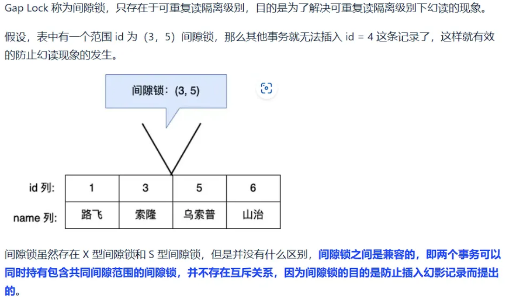

#### Next-Key Lock（临键锁）

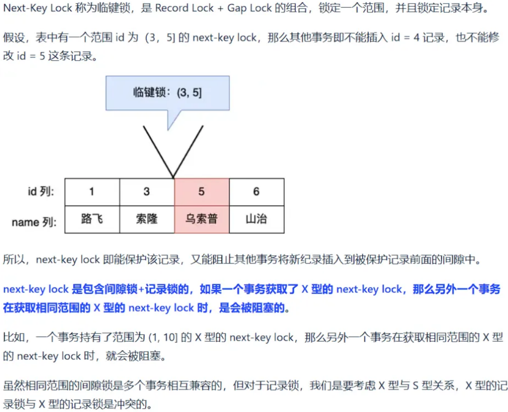

默认情况下，InnoDB在 REPEATABLE READ事务隔离级别运行，InnoDB使用 next-key 锁进行搜索和索引扫描，以防止幻读。

1. 索引上的等值查询(唯一索引)，给不存在的记录加锁时，优化为间隙锁 。
2. 索引上的等值查询(普通索引)，向右遍历时最后一个值不满足查询需求时，next-key lock退化为间隙锁。
3. 索引上的范围查询(唯一索引)–会访问到不满足条件的第一个值为止。

## InnoDB引擎：

### 逻辑存储结构：

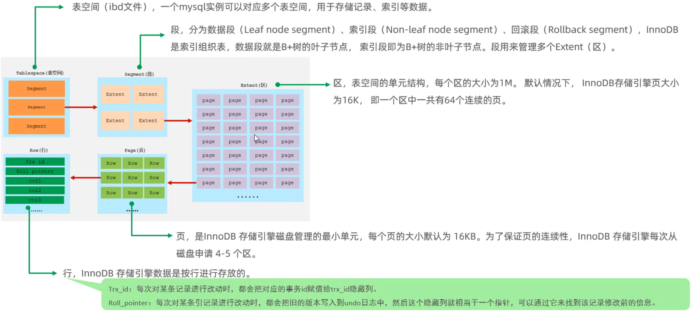

### 架构：

#### 整体架构：

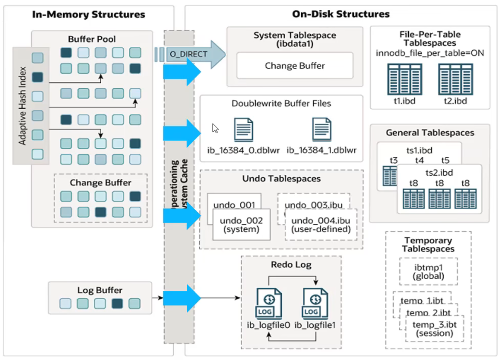

#### 内存结构：

1. **缓冲池：**

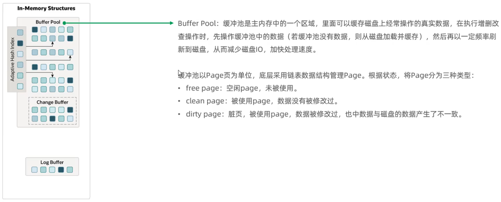

2. **更改缓冲区：**

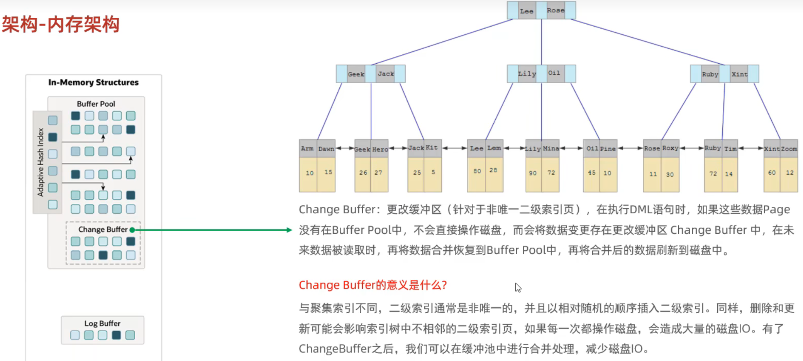

3. **自适应hash：**

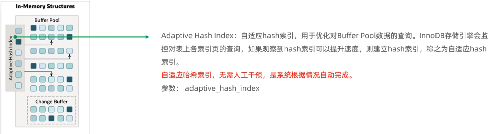

4. **日志缓冲区：**

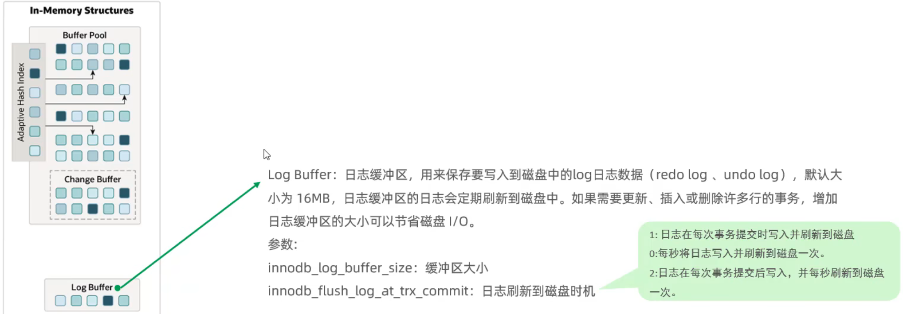

#### 磁盘结构：

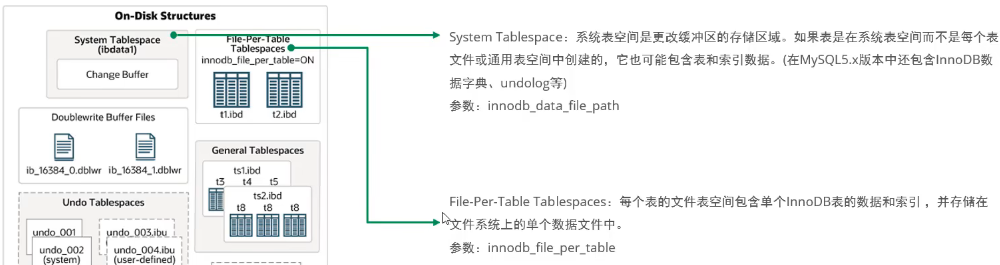

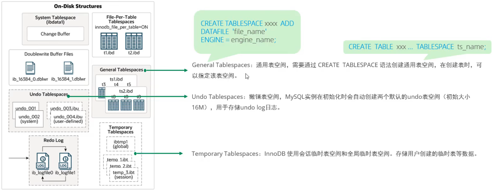

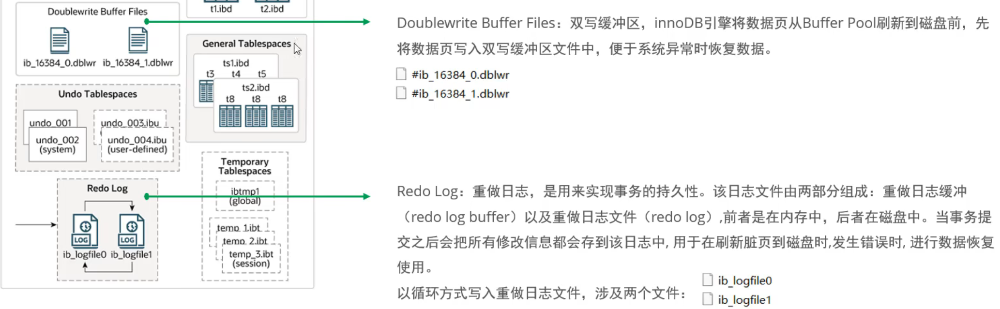

#### 后台线程：

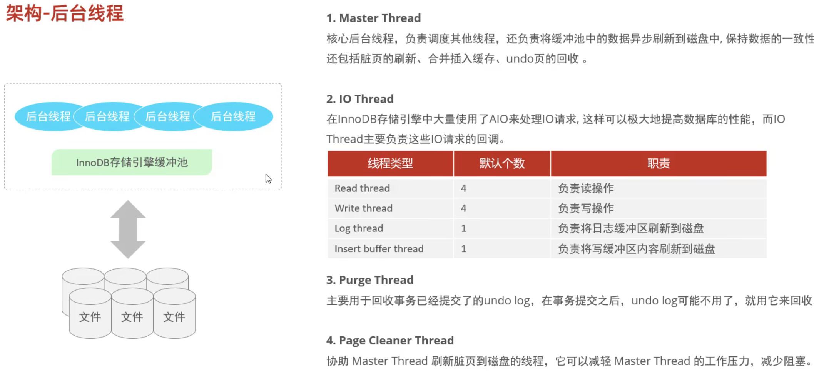

### 事务原理：

#### 简介：

**事务：**是一组操作的集合，它是一个不可分割的工作单位，事务会把所有的操作作为一个整体一起向系统提交或撤销操作请求，即这些操作要么同时成功，要么同时失败。

**特征：**

- 原子性(Atomicity)：事务是不可分割的最小操作单元，要么全部成功，要么全部失败。
- 一致性(Consistency) ：事务完成时，必须使所有的数据都保持一致状态。
- 隔离性(lsolation)：数据库系统提供的隔离机制，保证事务在不受外部并发操作影响的独立环境下运行。
- 持久性(Durability)：事务一旦提交或回滚，它对数据库中的数据的改变就是永久的。


#### redolog

重做日志，记录的是事务提交时数据页的物理修改，是用来实现事务的**持久性**。

该日志文件由两部分组成:重做日志缓冲(redo log buffer)以及重做日志文件(redo log file)，前者是在内存中，后者在磁盘中。当事务提交之后会把所有修改信息都存到该日志文件中，用于在刷新脏页到磁盘，发生错误时，进行数据恢复使用。

Buffer Pool在产生脏页数据的时候，会先将数据存储到 redolog buffer 再存储到 redolog 中进行磁盘持久化存储，在内存出现异常（比如突然断电）时，通过redo log中持久化的数据进行回滚。过程如下图：

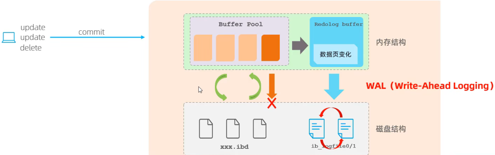

redo log 要写到磁盘，数据也要写磁盘，为什么要多此一举?

写入 redo log 的方式使用了追加操作，所以磁盘操作是**顺序写**，而写入数据需要先找到写入位置，然后才写到磁盘，所以磁盘操作是**随机写**。

#### undolog

回滚日志，用于记录数据被修改前的信息，作用包含两个:**提供回滚 和 MVCC(多版本并发控制)。**

undo log 和 redo log 记录物理日志不一样，它是逻辑日志。可以认为当 delete 一条记录时，undo log中会记录一条对应的insert记录，反之亦然，当 update 一条记录时，它记录一条对应相反的 update 记录。当执行 rollback 时，就可以从 undo log 中的逻辑记录读取到相应的内容并进行回滚。

Undo log 销毁：undo log 在事务执行时产生，事务提交时，并不会立即删除undolog，因为这些日志可能还用于 MVCC。

Undo log 存储：undo log 采用段的方式进行管理和记录，存放在前面介绍的 rollback segment 回滚段中，内部包含1024个 undo log segment.

### MVCC：

#### 基本概念：

**当前读：**

读取的是记录的最新版本，读取时还要保证其他并发事务不能修改当前记录，会对读取的记录进行加锁。对于我们日常的操作，如:select…lock in share mode(共享锁)，select… for update、update、insert、delete(排他锁)都是一种当前读。

**快照读：**

简单的select(不加锁)就是快照读，快照读，读取的是记录数据的可见版本，有可能是历史数据，不加锁，是非阻塞读。

- Read committed:每次select，都生成一个快照读。
- Repeatable Read:开启事务后第一个select语句才是快照读的地方。
- Serializable:快照读会退化为当前读。

**MVCC：**

全称 Multi-Version Concurrency Control，多版本并发控制。指维护一个数据的多个版本，使得读写操作没有冲突，快照读为MYSQL实现MVCC提供了一个非阻塞读功能。MVCC的具体实现，还需要依赖于数据库记录中的三个隐式字段、undo log日志、readView。

#### 隐藏字段：

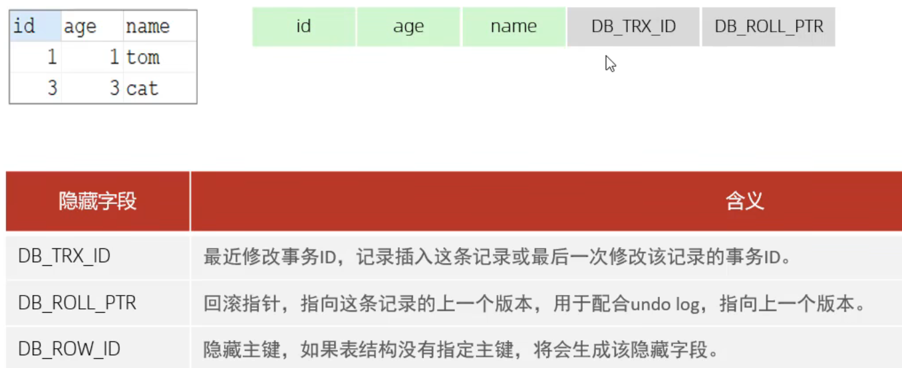

#### undolog日志：

回滚日志，在insert、update、delete的时候产生的便于数据回滚的日志。

当insert的时候：产生的undoloq日志只在回滚时需要，在事务提交后，**可被立即删除。**

而update、delete的时候：产生的undo log日志不仅在回滚时需要，在快照读时也需要，**不会立即被删除。**

那么何时删除？

- **事务提交后：**
  - 对于`INSERT`操作，事务提交后，undo log可以被立即删除，因为不再需要用于回滚。
  - 对于`UPDATE`和`DELETE`操作，undo log不会立即被删除，因为它们可能在后续的快照读取中被使用。
- **快照读取结束：**
  - 当所有依赖于该undo log的快照读取操作结束后，undo log才会被删除。这意味着如果有一个事务正在进行快照读取，并且依赖于某个undo log，那么这个undo log会一直保留直到该事务结束。
- **undo log版本链：**不同事务或相同事务对同一条记录进行修改，会导致该记录的undolog生成一条记录版本链表，链表的头部是最新的旧记录，链表尾部是最早的旧记录。

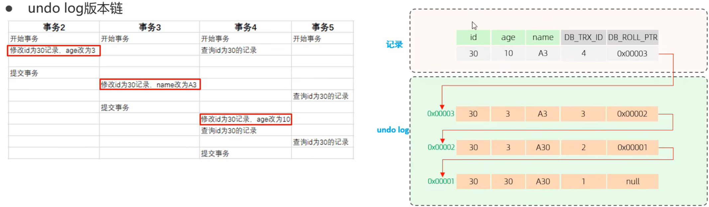

#### read view：

ReadView(读视图)是 快照读 SOL执行时MVCC提取数据的依据，记录并维护系统当前活跃的事务(未提交的)id。

ReadView中包含了四个核心字段:

| 字段           | 含义                                                 |
| -------------- | ---------------------------------------------------- |
| m_ids          | 当前活跃的事务ID集合                                 |
| min_trx_id     | 最小活跃事务ID                                       |
| max_trx_id     | 预分配事务ID，当前最大事务ID+1（因为事务ID是自增的） |
| creator_trx_id | ReadView创建者的事务ID                               |

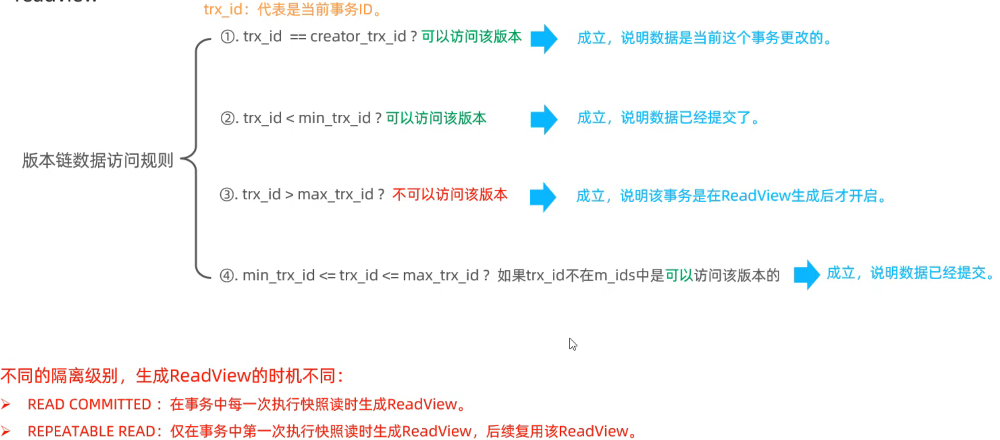

#### 例子：

1. **RC：**

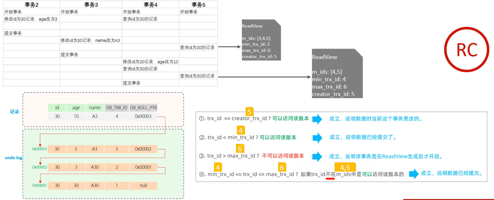

2. RR：

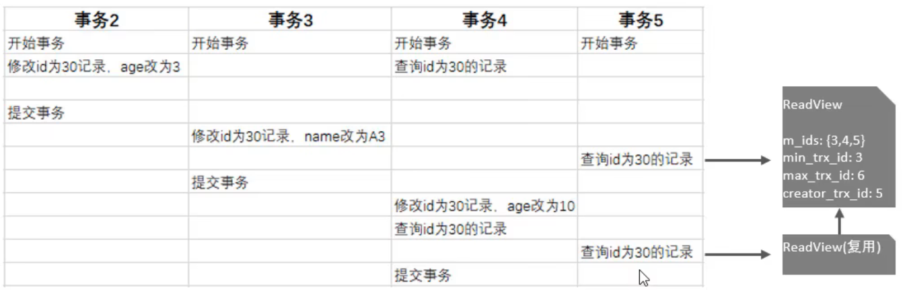

## MYSQL管理：

### 系统数据库：

Mysql数据库安装完成后，自带了一下四个数据库，具体作用如下：

| 数据库             | 含义                                                         |
| ------------------ | ------------------------------------------------------------ |
| mysql              | 存储MYSQL服务器正常运行所需要的各种信息(时区、主从、用户、权限等) |
| information_schema | 提供了访问数据库元数据的各种表和视图，包含数据库、表、字段类型及访问权限等 |
| performance_schema | 为MySQL服务器运行时状态提供了一个底层监控功能，主要用于收集数据库服务器性能参数 |
| sys                | 包含了一系列方便 DBA和开发人员利用 performance_schema性能数据库进行性能调优和诊断的视图 |

### 常用工具：

#### Mysql：

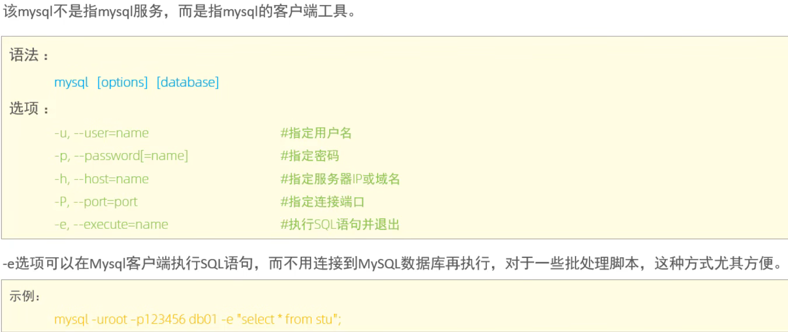

#### mysqladmin：

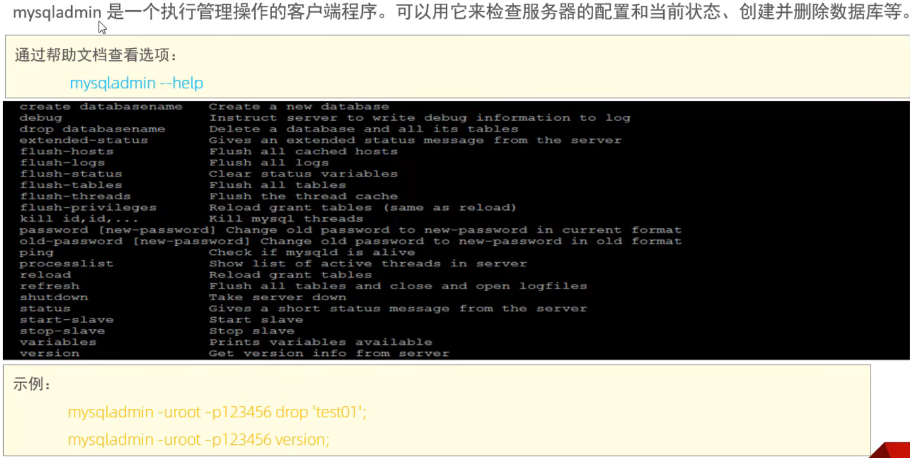

#### mysqlbinlog

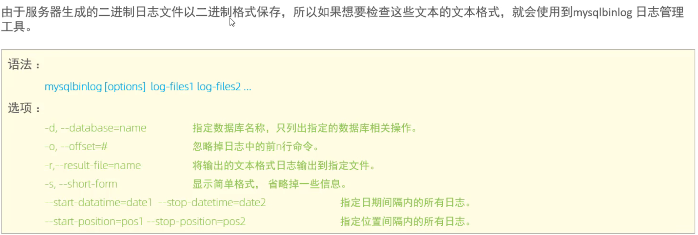

#### mysqlshow

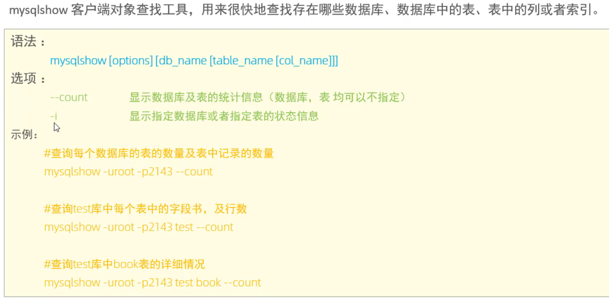

#### mysqldump：

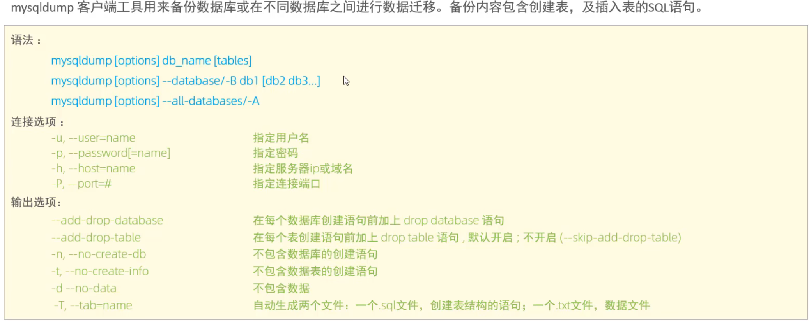

#### mysqlimport/source

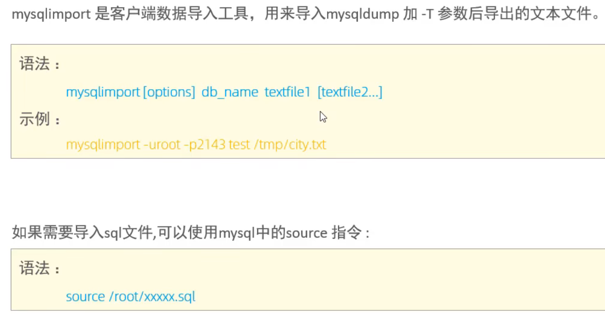

# 运维：

## 日志：

### 错误日志：

错误日志是 MySQL 中最重要的日志之一，它记录了当 mysqld 启动和停止时，以及服务器在运行过程中发生任何严重错误时的相关信息当数据库出现任何故障导致无法正常使用时，建议首先查看此日志。

该日志是默认开启的，默认存放目录 /var/log/，默认的日志文件名为 mysqld.log 。查看日志位置：

```sql
show variables like '%log_error%'
```

### 二进制日志：

二进制日志(BINLOG)记录了所有的 DDL(数据定义语言)语句和 DML(数据操纵语言)语句，但不包括数据查询(SELECT、SHOW)语句。

作用：

1. 灾难时的数据恢复；
2. MySQL的主从复制。

在MYSQL8版本中，默认二进制日志是开启着的，涉及到的参数如下：

```sql
show variables like '%log_bin%'
```

**日志格式：**MySQL服务器中提供了多种格式来记录二进制记录，具体格式及特点如下：

- 查看参数方式：`show variables like '%binlog_format%';`

| 日志格式  | 含义                                                         |
| --------- | ------------------------------------------------------------ |
| statement | 基于SQL语句的日志记录，记录的是SQL语句，对数据进行修改的SQL都会记录在日志文件中。 |
| row       | 基于行的日志记录，记录的是每一行的数据变更。(默认)           |
| mined     | 混合了STATEMENT和ROW两种格式，默认采用STATEMENT，在某些特殊情况下会自动切换为ROW进行记录。 |

**查看日志：**由于日志是以二进制方式存储的，不能直接读取，**需要通过二进制日志查询工具 mysqlbinlog 来查看**，具体语法：

```sql
mysqlbinlog[参数选项]logfilename

参数选项：
    -d    指定数据库名称，只列出指定的数据库相关的操作。
    -o    忽略掉日志中的前n行命令。
    -v    将行事件(数据变更)重构为SOL语句。
    -w    将行事件(数据变更)重构为SQL语句，并输出注释信息
```

**删除日志：**对于比较繁忙的业务系统，每天生成的binlog数据巨大，如果长时间不清除，将会占用大量磁盘空间。可以通过以下几种方式清理日志：

| 指令                                             | 含义                                                         |
| ------------------------------------------------ | ------------------------------------------------------------ |
| reset master                                     | 删除全部 binlog 日志，删除之后，日志编号，将从 binlog.000001重新开始 |
| purge master logs to ‘binlog.***’                | 删除 *** 编号之前的所有日志                                  |
| purge master logs before ‘yyyy-mm-dd hh24:mi:ss’ | 删除日志为”yyyy-mm-dd hh24:mi:ss”之前产生的所有日志          |

也可以在mysql的配置文件中配置二进制日志的过期时间，设置了之后，二进制日志过期会自动删除.

```sql
show variables like '%binlog_expire_logs_seconds%'
```

### 查询日志：

查询日志中**记录了客户端的所有操作语句**，而二进制日志不包含查询数据的SQL语句。默认情况下，查询日志是未开启的。如果需要开启查询日志，可以设置一下配置：

修改MySQL的配置文件 /etc/my.cnf 文件，添加如下内容：

```sql
#该选项用来开启查询日志，可选值：0或者1；0代表关闭，1代表开启
general_log=1
#设置日志的文件名 ， 如果没有指定，默认的文件名为 host_name.log
general_log_file=mysql_query.log
```

### 慢查询日志：

慢查询日志记录了所有执行时间超过参数 long_query_time 设置值并且扫描记录数不小于 min_examined_row_limit的所有的SQL语句的日志，默认未开启。long_query_time 默认为 10 秒，最小为0，精度可以到微秒。

```sql
#慢查询日志
slow_query_log=1
#执行时间参数
long_query_time=2
```

默认情况下，不会记录管理语句，也不会记录不使用索引进行查找的查询。可以使用log_slow_admin_statements和更改此行为log_queries_not_using_indexes，如下所述。

```sql
#记录执行较慢的管理语句
log_slow_admin_statements = 1
#记录执行较慢的未使用索引的语句
log_queries_not_using_indexes = 1
```

## 主从复制：

### 简介：

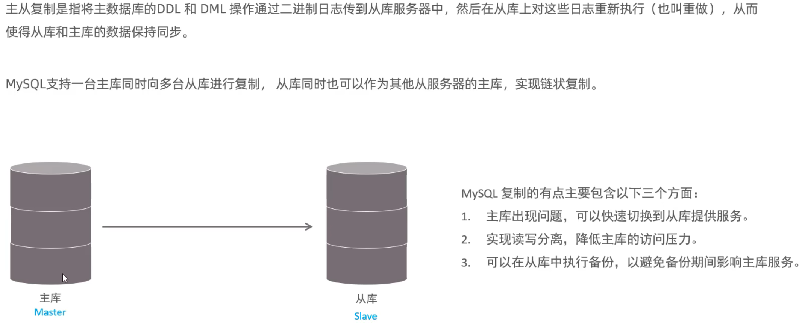

### 原理：

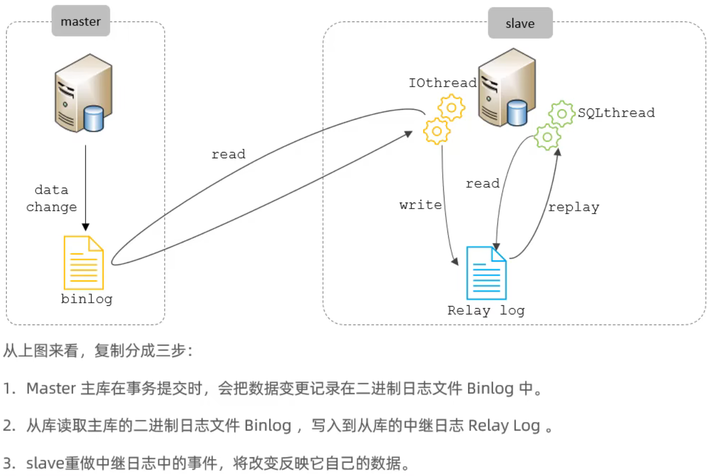

### 搭建：

#### 服务器准备：

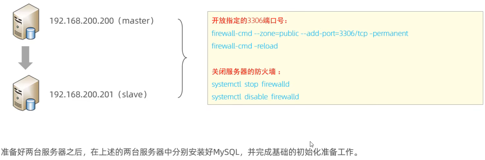

#### 主库配置：

1. 修改配置文件/etc/my.cnf：

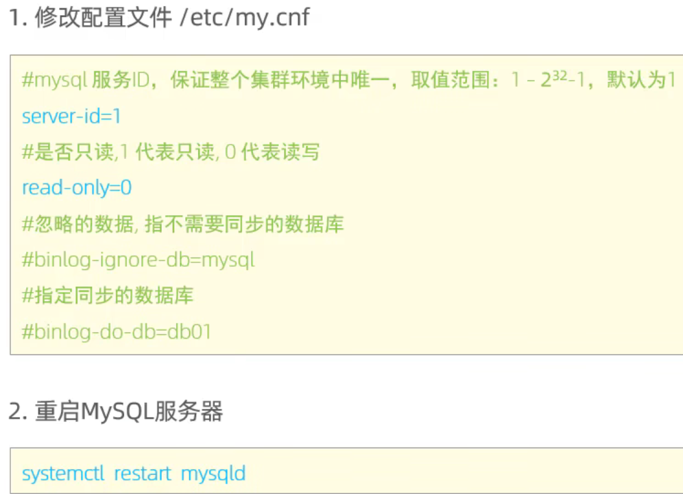

2. 创建远程连接账号，赋予主从复制权限：

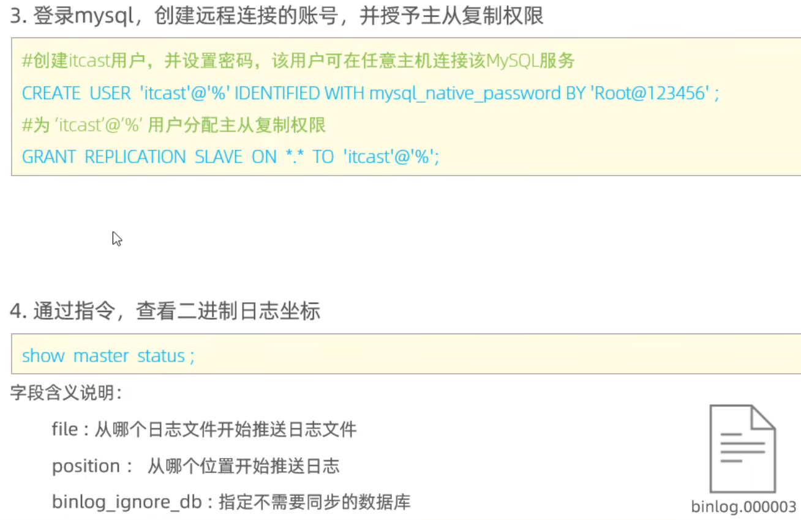

#### 从库配置：

1. 修改配置文件/etc/my.cnf：

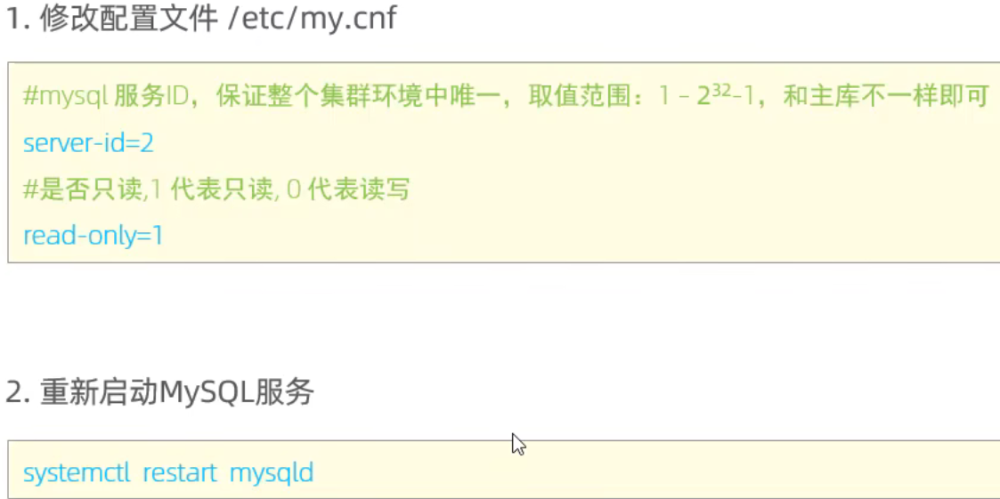

2. 设置主库配置：

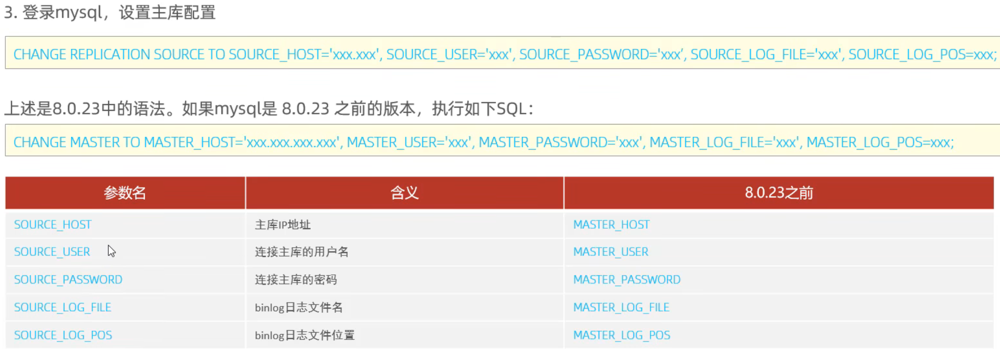

3. 开启同步：

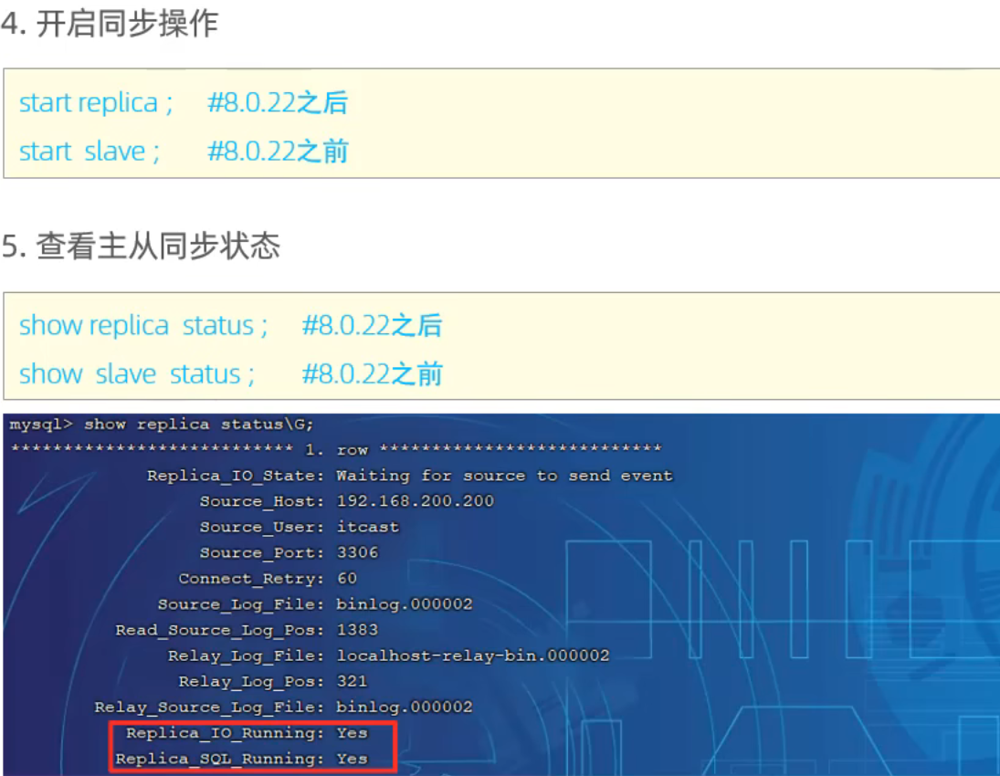

## 分库分表：

### 简介：

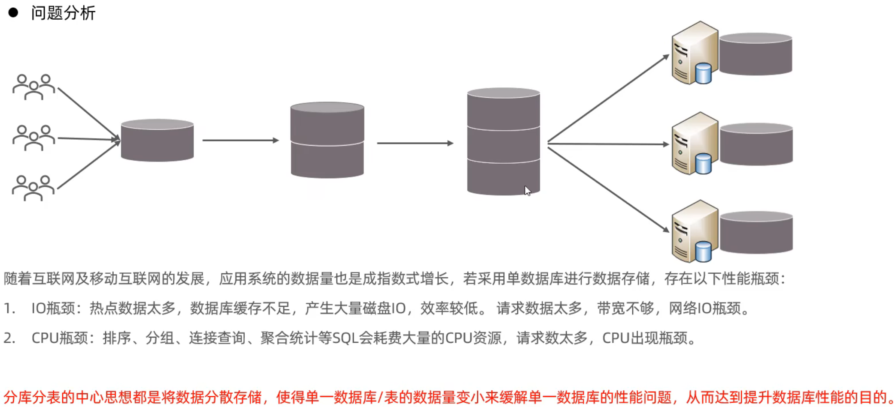

### 拆分策略：

1. **垂直拆分：**

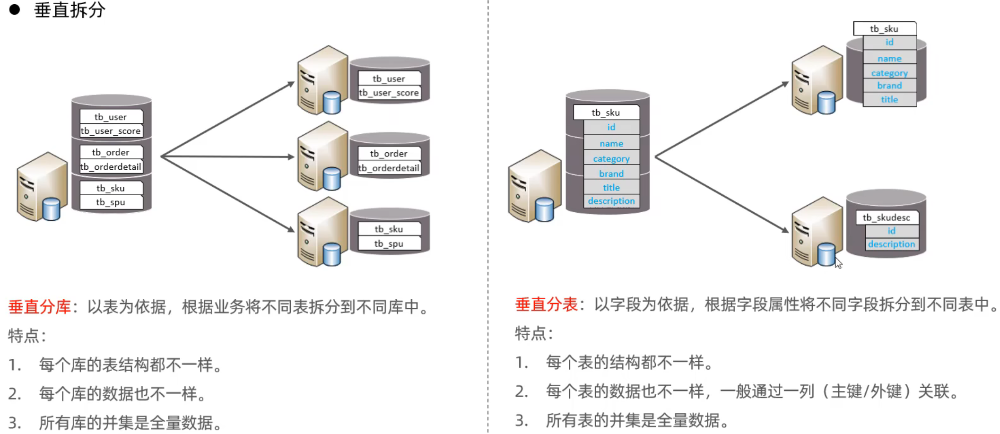

2. **水平拆分：**

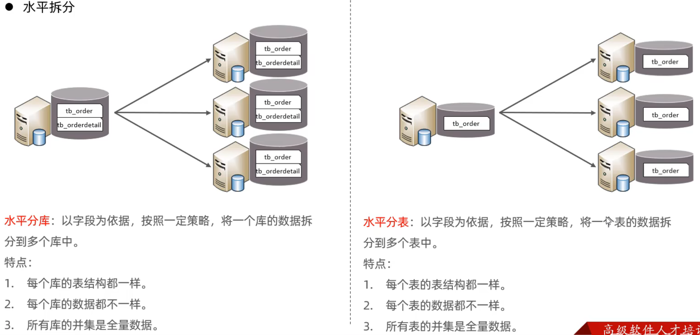

### MyCat：

#### 简介：

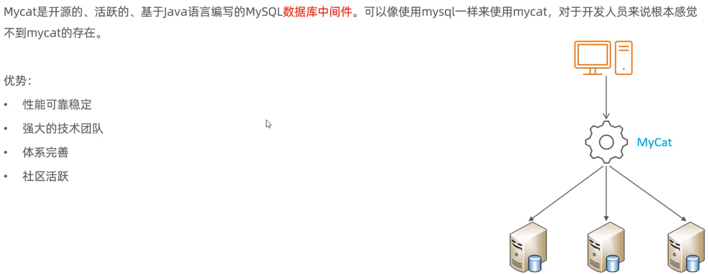

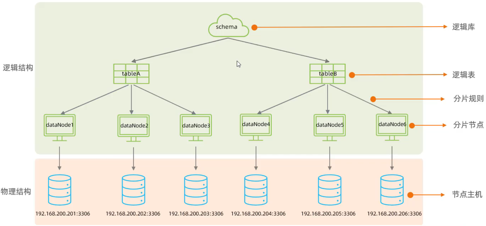

#### 安装：

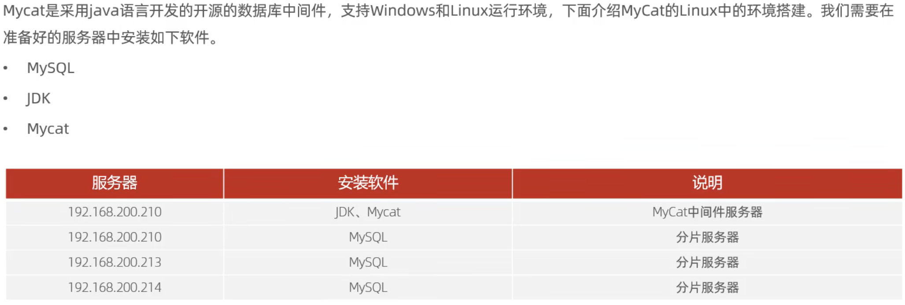

#### 入门：

1. **配置：**

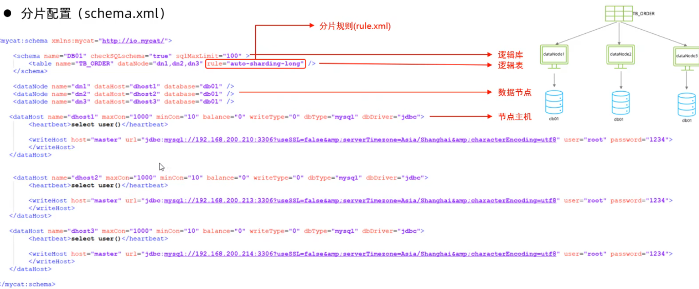

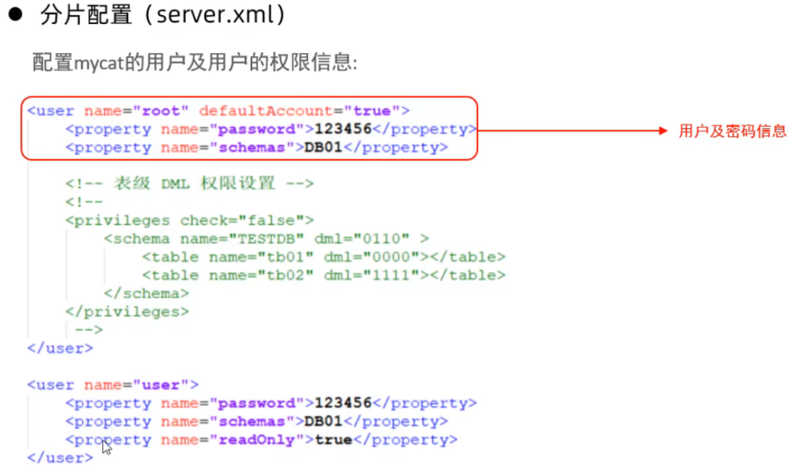

2. **启动：**

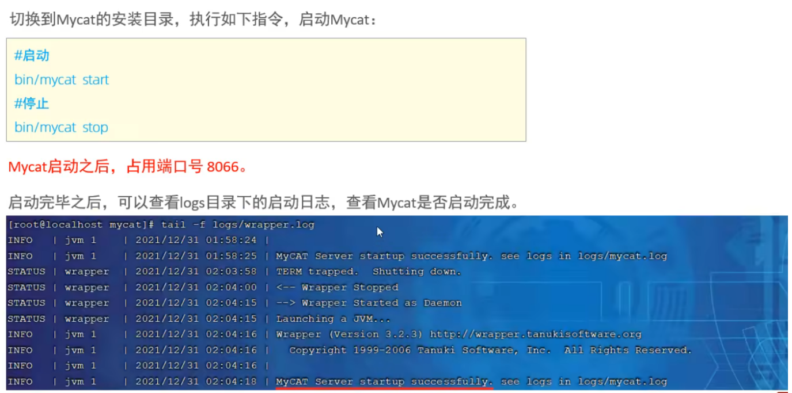

3. **测试：**

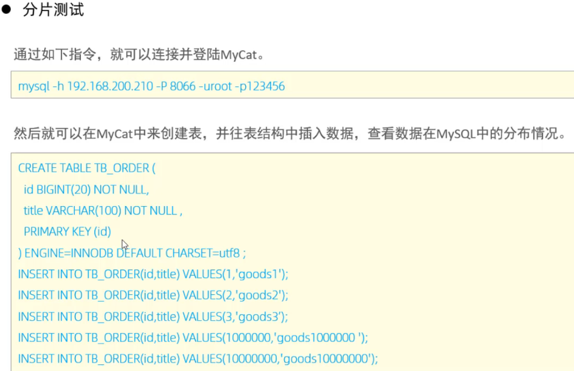

#### 配置：

1. **`schema.xml：`**

- schema.xml作为MyCat中最重要的配置文件之一,涵盖了MyCat的逻辑库 、逻辑表 、分片规则、分片节点及数据源的配置。主要包含以下三组标签:

  - schema标签

  - datanode标签

  - datahost标签

- **schema标签：**


- **datanode标签：**


- **datahost标签：**


2. **`rule.xml：`**

- rule.xml中定义所有拆分表的规则，在使用过程中可以灵活的使用分片算法，或者对同一个分片算法使用不同的参数，它让分片过程可配置化。主要包含两类标签:tableRule、Function。


3. **`server.xml：`**


#### 分片：

1. **垂直拆分：**


2. **水平拆分：**


#### 分片规则：

##### 范围分片：


##### 取模分片


##### 一致性hash算法

- 根据字段的Hash值计算，相同字段总会划分到相同分片。


##### 枚举分片：

- 通过在配置文件中配置可能的枚举值，指定数据分布到不同数据节点上，本规则适用于按照省份、性别、状态拆分数据等业务。


##### 应用指定算法：


##### 固定hash算法


##### 字符串hash算法


##### 按天分片：


##### 按月分片：


#### MyCat原理：


#### 管理工具：


## Mycat-eye：

### 安装：

Mycat-web(Mycat-eye)是对mycat-server提供监控服务，功能不局限于对mycat-server使用。他通过JDBC连接对Mycat、Mysql监控，监控远程服务器(目前仅限于linux系统)的cpu、内存、网络、磁盘。

Mycat-eye运行过程中需要依赖zookeeper，因此需要先安装zookeeper。

## 读写分离：

### 简介：


### 一主一从读写分离：


### 双主双从：

- 搭建过程见：【黑马程序员 MySQL数据库入门到精通】 https://www.bilibili.com/video/BV1Kr4y1i7ru/?p=192&share_source=copy_web&vd_source=413463a4a1a35d742cbe8d31a0949aa3


### 双主双从读写分离：


