# Redis初级使用：

## 概念：

- Redis是一个基于内存的 key-value 结构数据库

1. 基于内存存储，读写性能高
2. 适合存储热点数据(热点商品、资讯、新闻)
3. 企业应用广泛

- Redis存储的是key-value结构的数据，其中key是字符串类型，value有5种常用的数据类型：

1. 字符串 string
2. 哈希 hash（适合用来存储对象）
3. 列表 list（类似于java中LinkedList，可以有重复的元素，按照插入顺序排序）
4. 集合 set （无序集合，没有重复元素，类似于Java中的HashSet）
5. 有序集台 sorted set/zset （集合中每个元素关联一个分数(score)，根据分数升序排序，没有重复元素）

## 常见数据结构：

### 通用命令：

- KEYS pattern		  -查找所有符合给定名字(可以模糊匹配)的 key
- EXISTS key                      -检查给定 key 是否存在
- TYPE key                          -返回 key 所储存的值的类型
- DEL key [key2]                 -该命令用于在 key 存在时删除 key

### 字符串：

- SET key value			-设置指定key的值
- GET key                                  -获取指定key的值
- SETEX key seconds value   -设置指定key的值，并将 key 的过期时间设为 seconds 秒
- SETNX key value                  -只有在 key 不存在时设置 key 的值

### 哈希表：

- Redis hash 是一个string类型的 field 和 value 的映射表，hash特别适合用于存储对象，常用命令：

- HSET key field value       -将哈希表 key 中的字段 field 的值设为 value
- HGET key field                 -获取存储在哈希表中指定字段的值
- HDEL key field                 -删除存储在哈希表中的指定字段
- HKEYS key                        -获取哈希表中所有字段
- HVALS key                        -获取哈希表中所有值

### 列表：

- LPUSH key value1 [value2]    -将一个或多个值插入到列表头部
- LRANGE key start stop           -获取列表指定范围内的元素
- RPOP key                                   -移除并获取列表最后一个元素
- LLEN key                                    -获取列表长度

### 集合：

- Redis set 是string类型的无序集合。集合成员是唯一的，集合中不能出现重复的数据，常用命令：

- SADD key member1 [member2]        -向集合添加一个或多个成员
- SMEMBERS key                                    -返回集合中的所有成员
- SCARD key                                             -获取集合的成员数
- SINTER key1 [key2]                              -返回给定所有集合的交集
- SUNION key1 [key2]                            -返回所有给定集合的并集
- SREM key member1 [member2]        -删除集合中一个或多个成员

### 有序集合：

- Redis有序集合是string类型元素的集合，且不允许有重复成员。每个元素都会关联一个double类型的分数。

- ZADD key score1 member1 [score2 member2]      -向有序集合添加一个或多个成员
- ZRANGE key start stop [WITHSCORES]                 -通过索引区间（坐标）返回有序集合中指定区间内的成员
- ZINCRBY key increment member                            -有序集合中对指定成员的分数加上增量 increment
- ZREM key member [member ...]                               -移除有序集合中的一个或多个成员

## Spring Data Redis:

### 使用步骤：

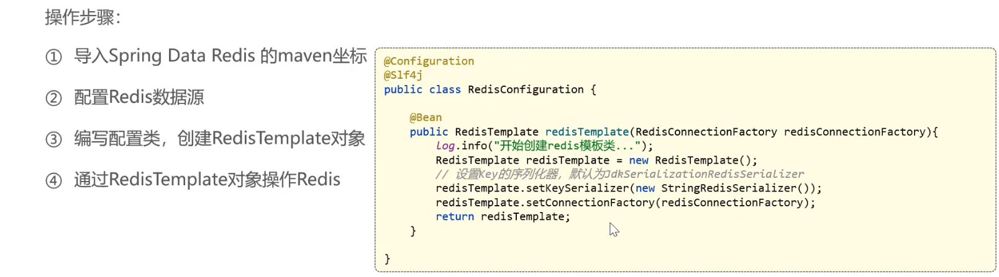

## Spring Cache：

### **简介：**

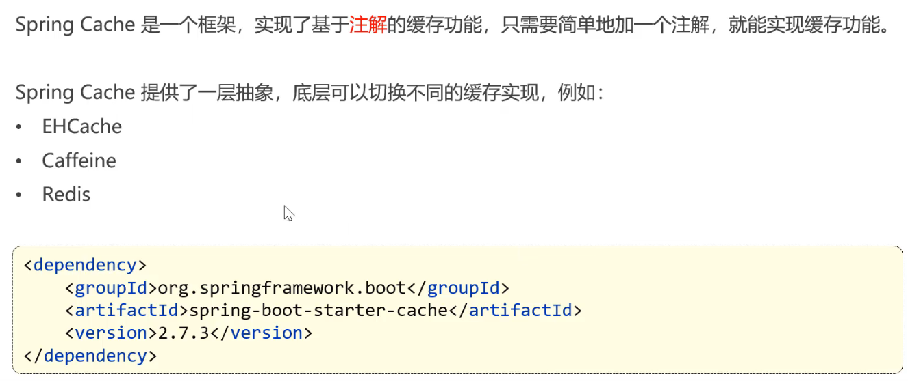

### 常用注解：

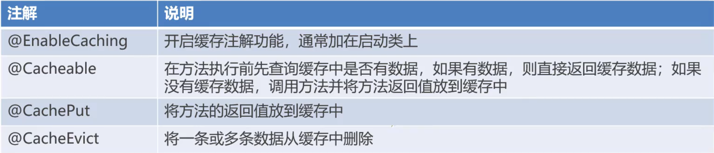

## RedisTemplate序列化：

**方案一:**

自定义RedisTemplate，修改RedisTemplate的序列化器为GenericJackson2JsonRedisSerializer。（这样会导致Redis内存中会每次都会存储一个——包名.类名）

**方案二：**

使用StringRedisTemplate ：写入Redis时，手动把对象序列化为jSON；读取Redis时，手动把读取到的jSON反序列化为对象

**方案二实现：**

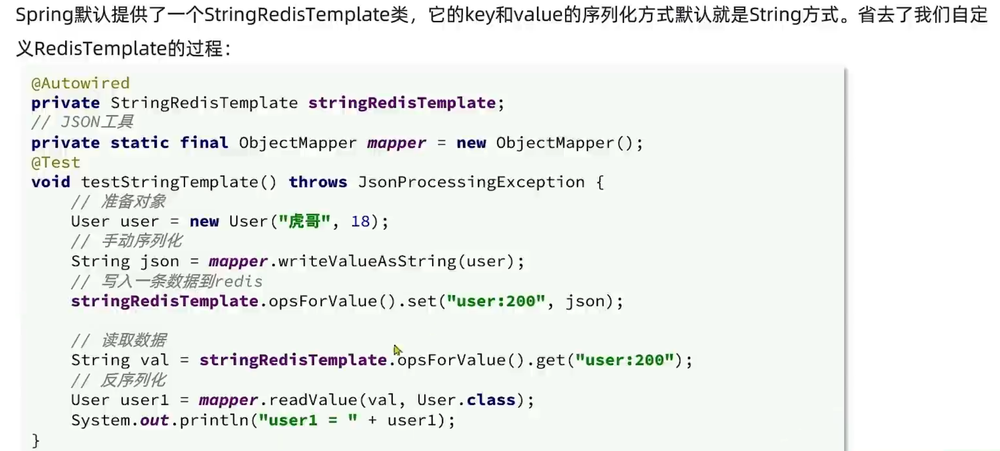

# Redis进阶使用：

## 缓存主动更新：

缓存更新策略的**最佳实践方案**:

1. 低一致性需求:使用Redis自带的内存淘汰机制。

2. 高一致性需求:主动更新，并以超时剔除作为兜底方案。
   读操作:

- 缓存命中则直接返回。

- 缓存未命中则查询数据库，并写入缓存，设定超时时间。

  写操作:

- **先写数据库，然后再删除缓存**（因为对数据库操作这一步耗时更长，如果先删缓存再写数据库容易在这个间隙有其他客户端访问），也可以延迟双删（就是写完删除之后过一段时间再删一次，避免在写入期间有其他线程读取并写入了旧数据）。

- 要确保数据库与缓存操作的原子性。

## 缓存穿透：

- 可以在黑马点评CacheClient中找到缓存空对象实现。

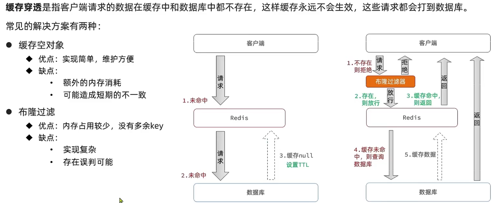

## 缓存雪崩：

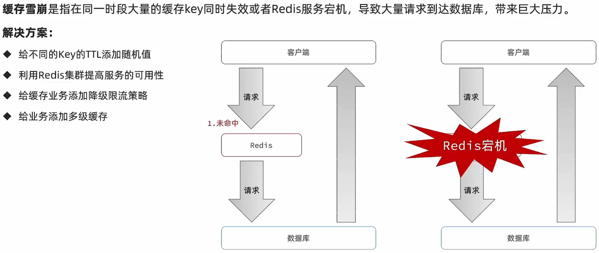

## 缓存击穿：

- 可以在黑马点评CacheClient中找到缓存逻辑过期实现。
- 可以在黑马点评ShopService中找到缓存互斥锁实现

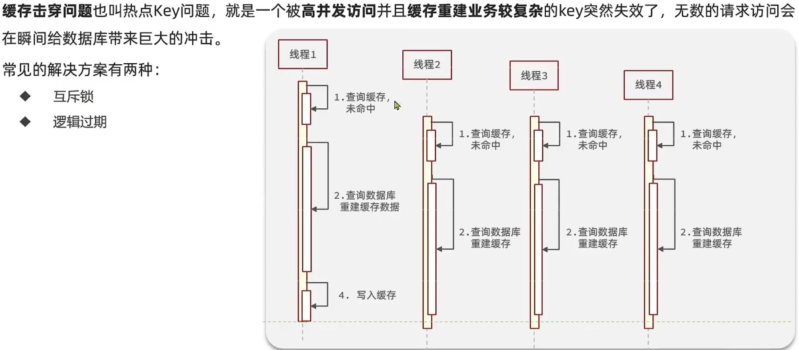

1. **互斥锁：**

​	**优点：**

- 没有额外的内存消耗
- 保证一致性
- 实现简单

​	**缺点：**

- 线程需要等待，性能受影响
- 可能有死锁风险

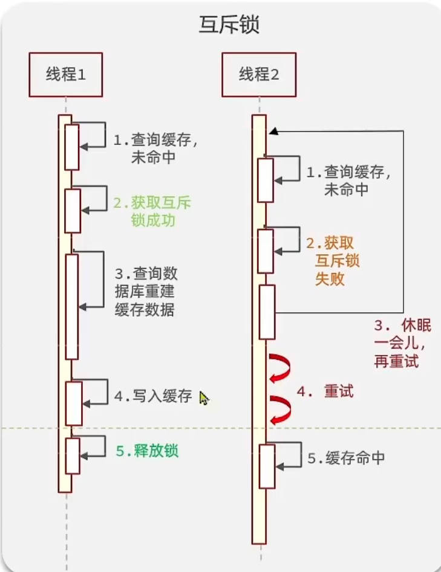

2. **逻辑过期：**数据没有设定TTL，但是保存的时候会保存一个expire逻辑过期时间。

​	**优点：**

- 线程无需等待，性能较好

​	**缺点：**

- 不保证一致性
- 有额外内存消耗
- 实现复杂

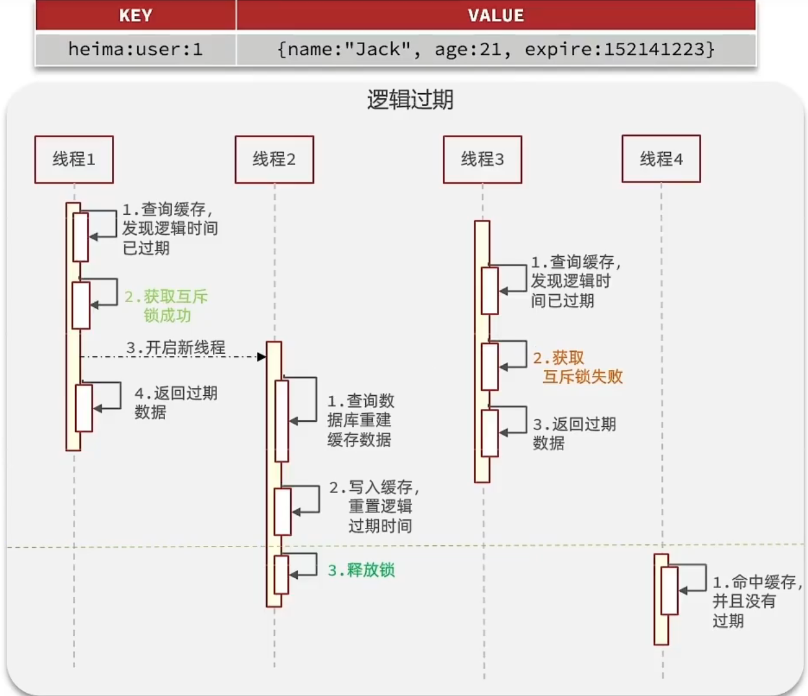

## GEO数据类型：

-  简介：可以利用Redis中的GEO来实现距离排序

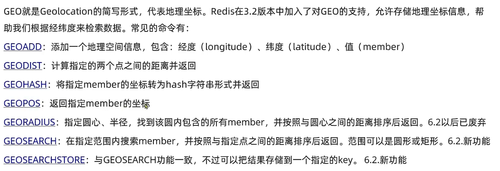

## BitMap数据类型：

- 可以用来实现每月签到，节约空间。

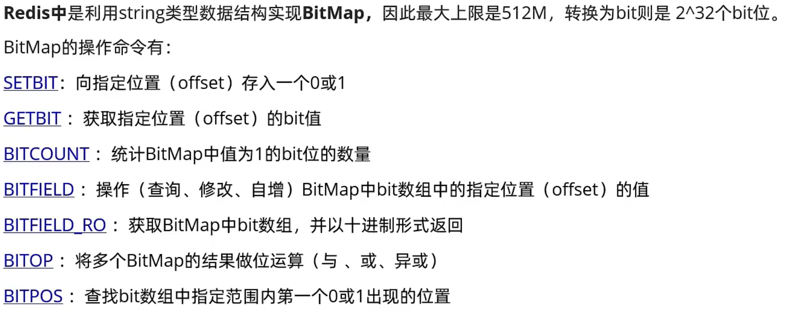

## HyperLogLog数据类型：

- 可以用在数据量巨大但只需要（有误差）统计概率或者数量的功能。

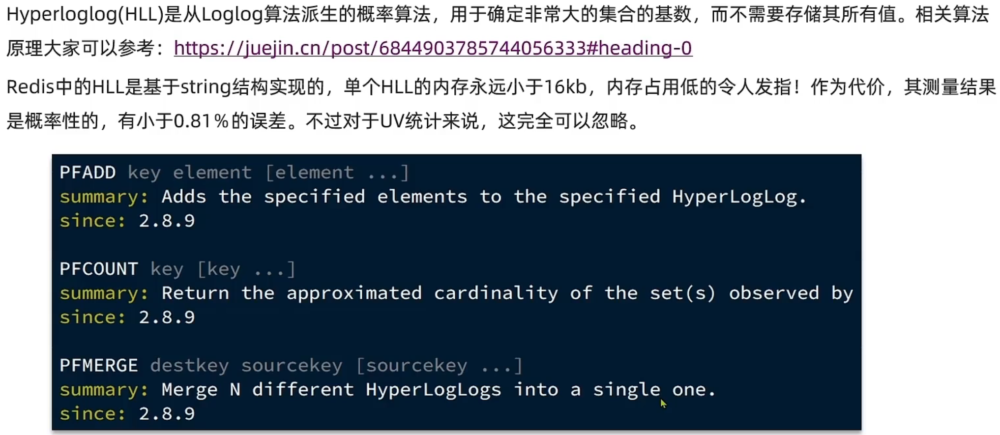


## Lua脚本：

### 变量：

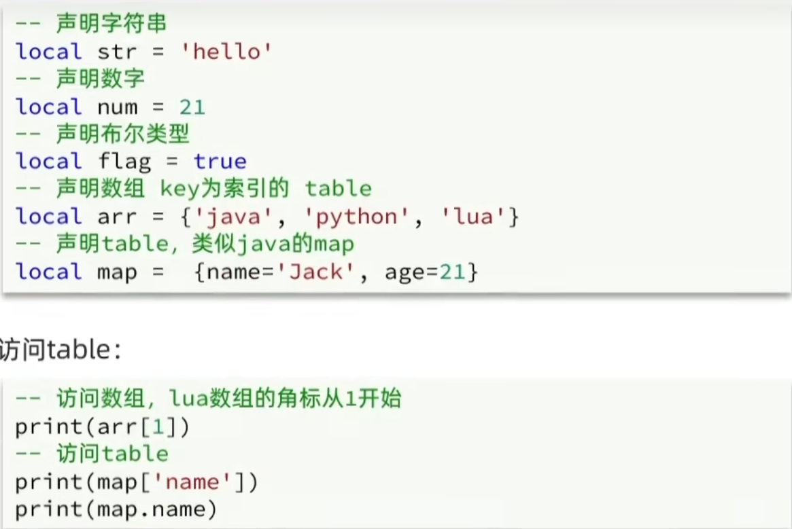

### 循环：

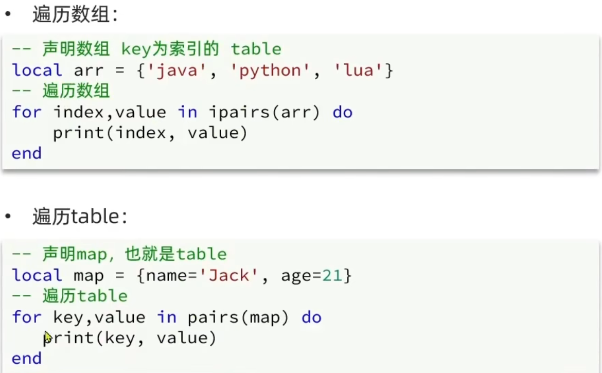

# Redis高级使用：

## Redis持久化：

### RDB数据备份文件：

- 通过配置Redis会自动的在一定时间内备份缓存内容。

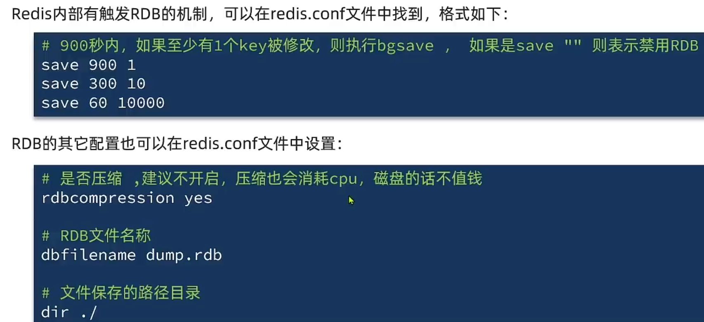

- 原理：

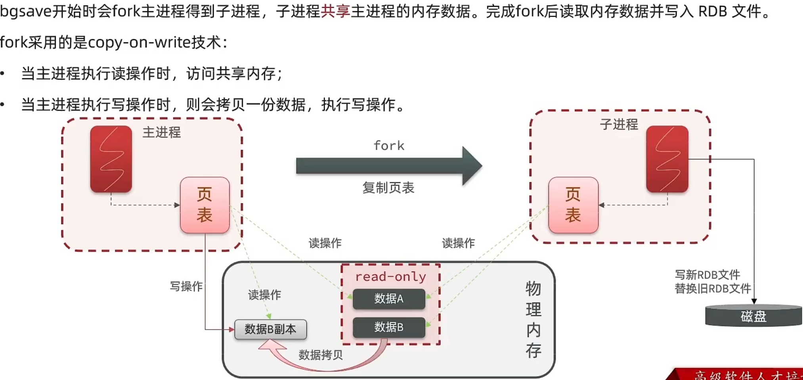

### AOF追加文件：

- AOF全称为Append Only File(追加文件)。Redis处理的每一个写命令都会记录在AOF文件，可以看做是命令日志文件。

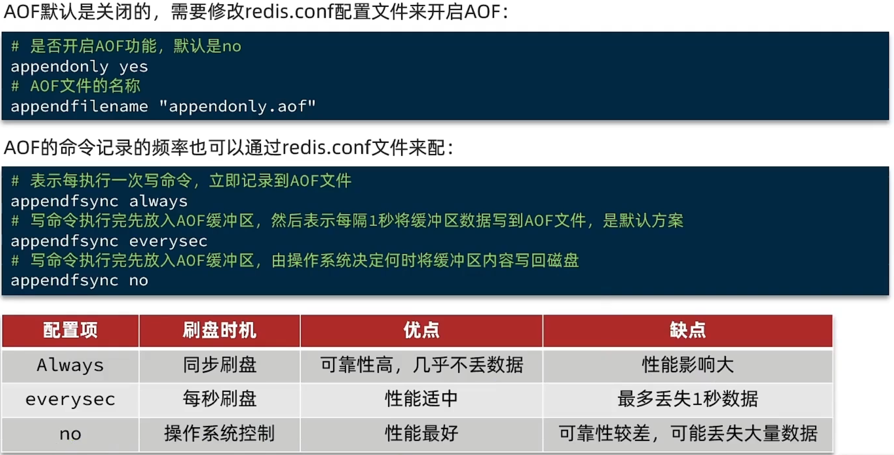

- AOF文件太大了，因为有很多重复的命令，因此可以对AOF文件进行重写：

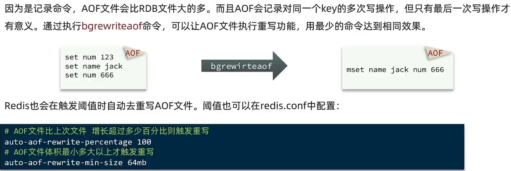

## Redis主从集群：

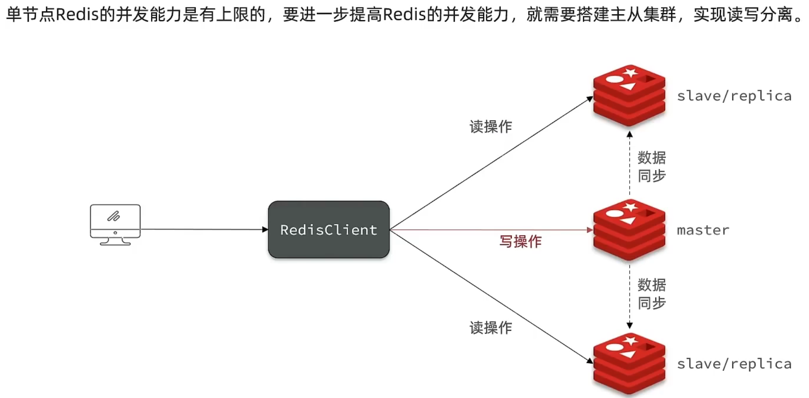

- 配置主从节点可以通过：从节点启动后执行命令（slaveof  主节点  从节点），也可以通过配置文件配置同样的命令永久执行。

### 全量同步：

- 主从的第一次连接是全量同步。

- **ReplicationId:** 简称replid，是数据集的标记,id一致则说明是同一数据集。每一个master都有唯一的replid,slave则会继承master节点的replid

- **offset: **偏移量，随着记录在repl_baklog中的数据增多而逐渐增大。slave完成同步时也会记录当前同步的offset。如果slave的offset小于master的offset,说明slave数据落后于master,需要更新。

因此slave做数据同步，必须向master声明自己的replicationid和offset,master才可以判断到底需要同步哪些数据。

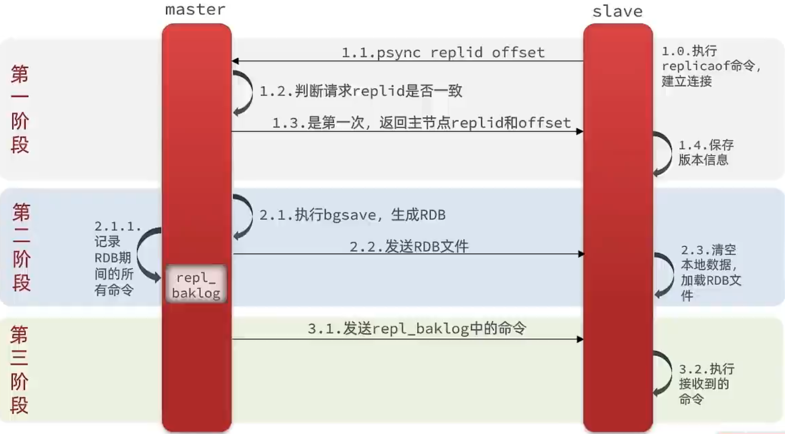

### 增量同步

- 当从节点宕机重新启动之后就会执行增量同步。

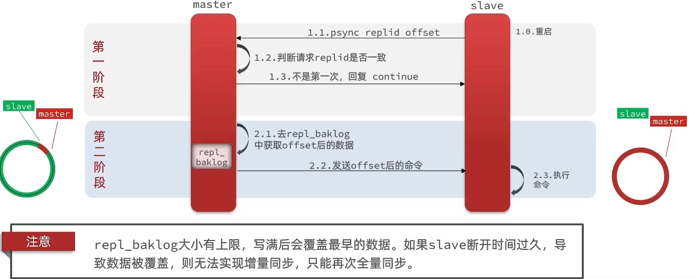

### 主从优化：

可以从以下几个方面来优化Redis主从就集群:

1. 在master中配置repl-diskless-sync yes启用无磁盘复制，避免全量同步时的磁盘IO。（提高RDB效率）
2. Redis单节点上的内存占用不要太大，减少RDB导致的过多磁盘IO。（提高RDB效率）
3.  适当提高repl_baklog的大小，发现slave宕机时尽快实现故障恢复，尽可能避免全量同步。（减少RDB）
4. 限制一个master上的slave节点数量,如果实在是太多slave，则可以采用主-从-从链式结构，减少master压力。


### Redis哨兵：

#### 工作流程：

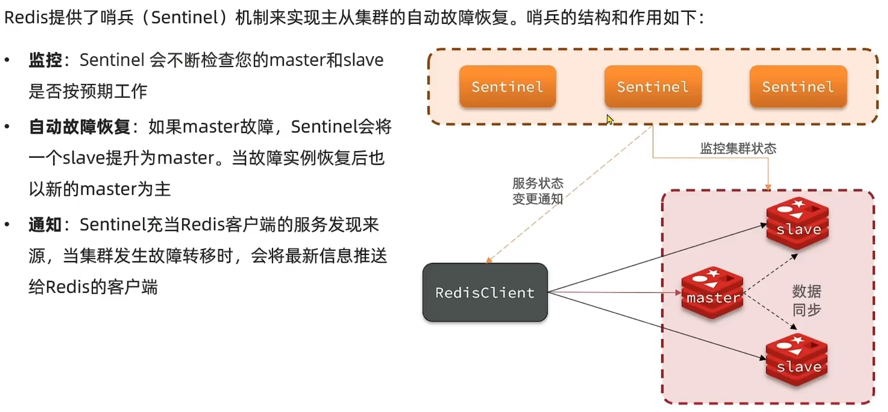

**监控：**Sentinel基于心跳机制监测服务状态，每隔1秒向集群的每个实例发送ping命令。

- **主观下线:**如果某sentinel节点发现某实例未在规定时间响应，则认为该实例主观下线。
- **客观下线:**若超过指定数量(quorum)的sentinel都认为该实例主观下线，则该实例客观下线。quorum值最好超过Sentinel实例数量的一半。

**选举master：**一旦发现master故障,sentinel需要在salve中选择一个作为新的master,选择依据是这样的:

1. 首先会判断slave节点与master节点断开时间长短,如果超过指定值(down-after-milliseconds *10)则会排除该slave节点。
2. 然后判断slave节点的slave-priority值，越小优先级越高，如果是0则永不参与选举。
3. 如果slave-prority一样,则判断slave节点的offset值,越大说明数据越新，优先级越高。
4. 最后是判断slave节点的运行id大小，越小优先级越高。

**故障转移：**当选中了其中一个slave为新的master后，故障的转移的步骤如下：

1. sentinel给备选的slave1节点发送slaveofnoone命令,让该节点成为master
2. sentinel给所有其它slave发送slaveof命令，让这些slave成为新master的从节点，开始从新的master上同步数据。
3. 最后，sentinel将故障节点标记为slave，当故障节点恢复后会自动成为新的master的slave节点。

#### RedisTemplate哨兵模式：

- 会自动的通过sentinel发现主从节点，如果主从节点切换也会自动切换连接。

**步骤：**

1. 注入redis的starter依赖
2. 配置yml文件中的sentinel相关信息，这里不用配置redis的信息，因为redis主从可能会变通过sentinel管理。
3. 配置主从读写分离Bean：

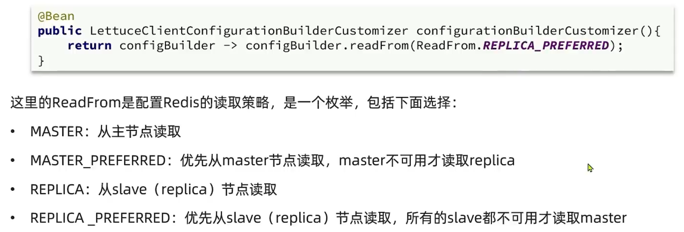


## Redis分片集群：

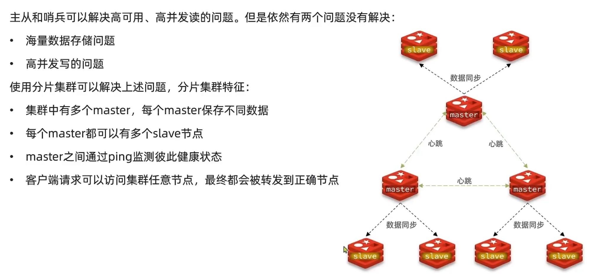

### 散列插槽：

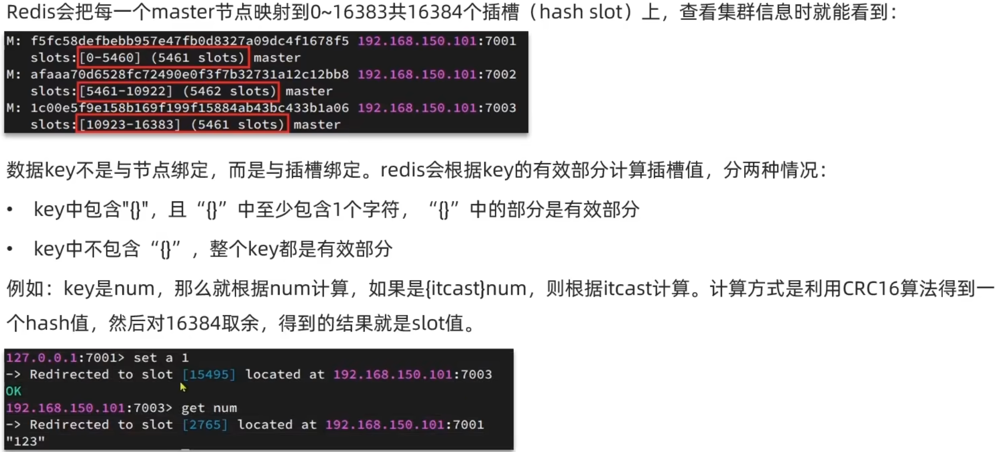

### 集群伸缩：

- 可以通过命令向集群中加入master或者salve节点，并且使用命令将插槽分配给其他节点，数据会随着插槽转移。
- 集群管理集成到了redis-cli指令中。

### 故障转移：

- 在分片集群中不需要哨兵模式，他自带有类似哨兵模式的故障转移，如果主节点出问题会自动将从节点变为主节点。
- 如果需要数据迁移可以利用cluster failover命令可以手动让集群中的某个master宕机,切换到执行cluster failover命令的这个slave节点，实现无感知的数据迁移。流程如下：

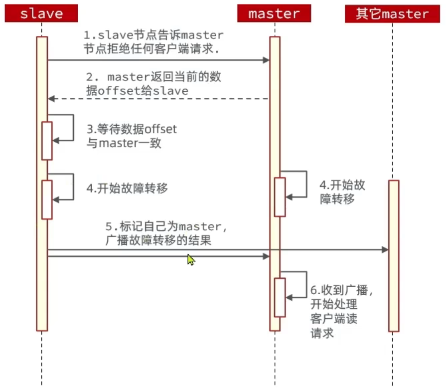

### RedisTemplate分片集群：

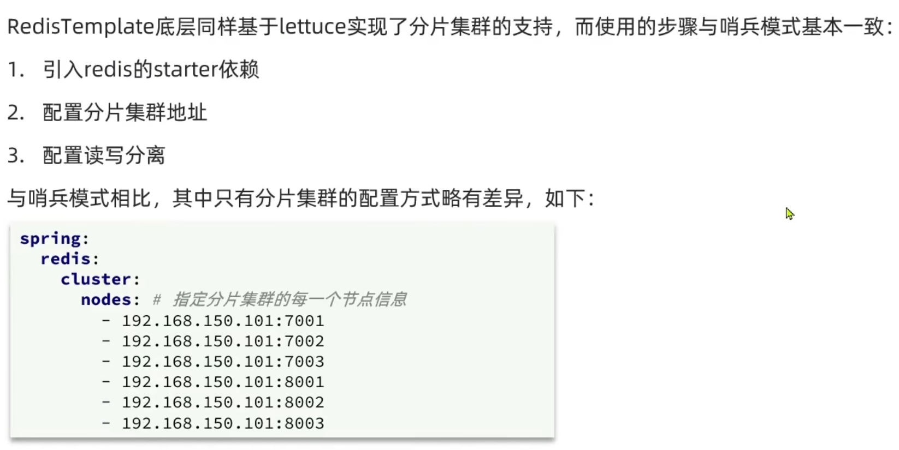

## 多级缓存：

- 原本的Redis缓存是在tomcat服务器之后，但这对tomcat的压力太大了，因此我们使用这样的多级缓存来实现。

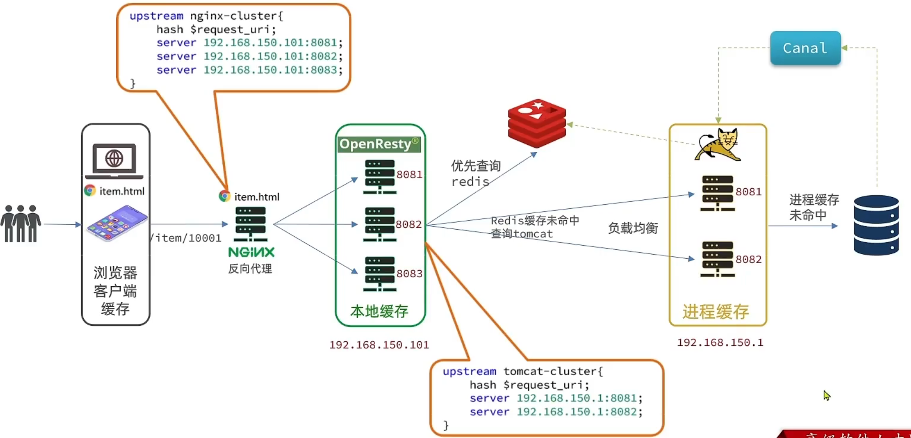

### JVM进程缓存：

#### Caffeine缓存：

- Caffeine是一个基于Java8开发的，提供了近乎最佳命中率的高性能的本地缓存库。目前spring内部的缓存使用的就是Caffeine。 GitHub地址:https://github.com/ben-manes/caffeine 
- **使用：**需要初始化缓存对象（可以注册为bean），用.put方法存数据，取数据如果没有可以返回null也可以取数据库里查询。
- **驱逐策略：**可以在创建缓存对象的时候设置，基于容量、时间、引用（不推荐）来对数据驱逐。

### OpenResty（Nginx访问缓存）

- 因为Nginx本身没有业务能力，如果我们需要在Nginx中控制访问redis就需要OpenResty。
- OpenResty是一个基于Nginx的高性能Web平台，用于方便地搭建能够处理超高并发、扩展性极高的动态Web应用、Web服务和动态网关。具备下列特点:具备Nginx的完整功能；基于Lua语言进行扩展，集成了大量精良的Lua库、第三方模块；允许使用Lua自定义业务逻辑、自定义库。

1. **步骤一：**需要在原Nginx服务的conf文件中配置OpenResty的地址，然后在OpenResty的conf中执行以下步骤

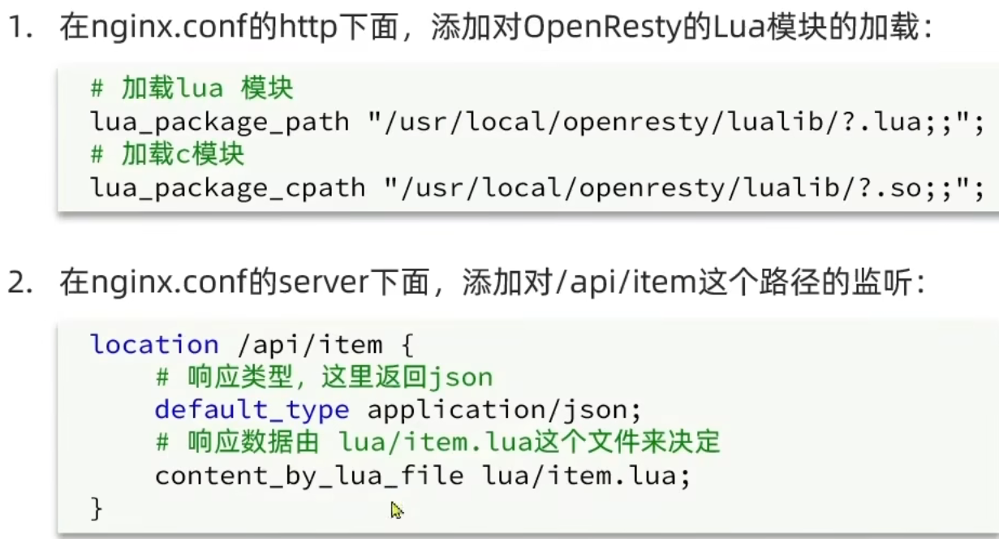

2. **步骤二：**在item.lua文件中就可以书写业务逻辑

#### 请求参数获取

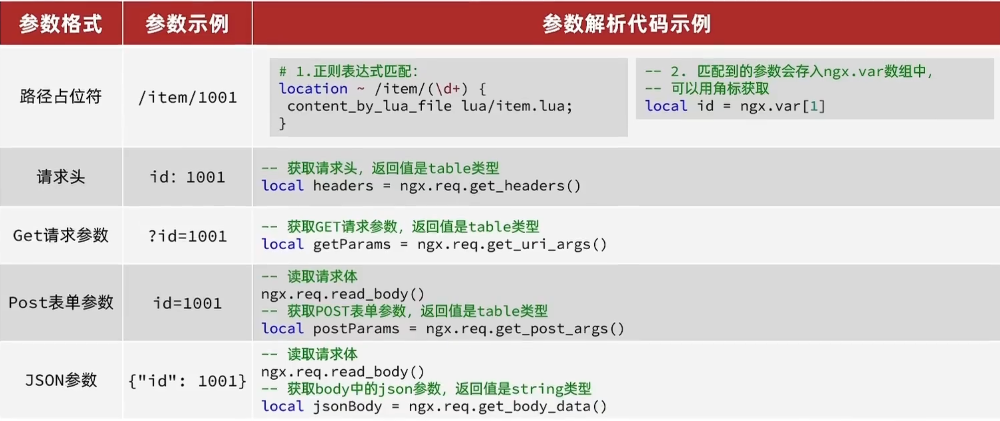

#### 请求tomcat：

- 其中发送Http请求这个功能可以封装成一个函数放在/lualib目录下，方便使用。

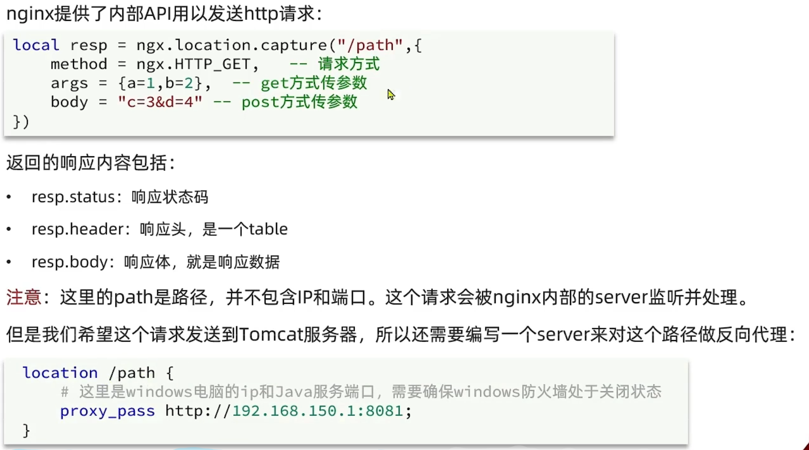

#### JSON结果处理：

- 如果需要查询多张表，就可以先把查到的数据decode成table类型，然后拼接之后encode返回：

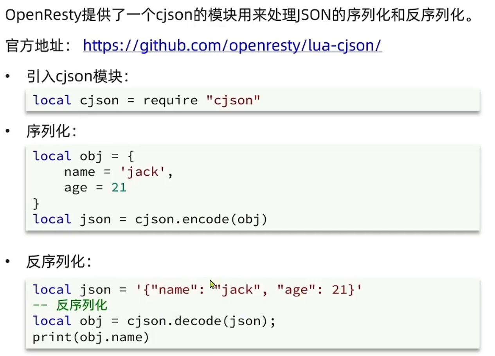

#### 多tomcat负载均衡：

- 因为comcat服务器上有缓存的信息，所以如果用轮询来访问的话每次都会在不同的tomcat上缓存，因此需要在集群的配置中加上request_uri来实现哈希轮询同一个查询会查到同一个tomcat服务器。

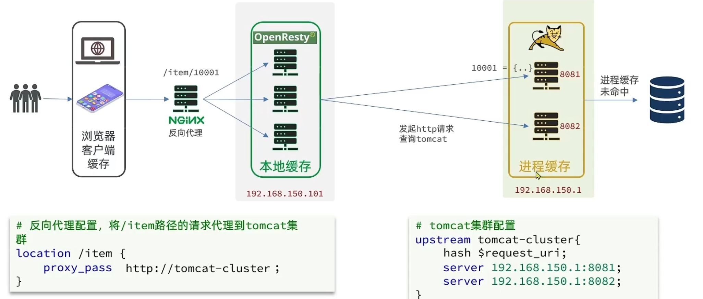

#### 请求Redis缓存：

- 需要在访问tomcat之前先访问redis查询数据，如果没有才发送http请求到tomcat服务器。

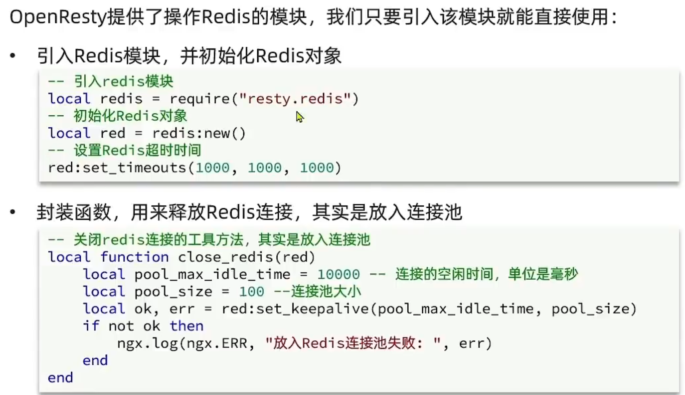

#### Nginx本地缓存：

- OpenResty为Nginx提供了sharddict的功能，可以在nginx的多个worker之间共享数据，实现缓存功能。
- **注：**Nginx通常缓存不经常改变的数据，因为缓存同步只会在tomcat-redis-mysql中，Nginx通过时间过期。

1. **使用方法：**item.lua中的read_data函数,优先查询本地缓存，未命中时再查询Redis、Tomcat。查询成功之后写入本地缓存并设置有效期。

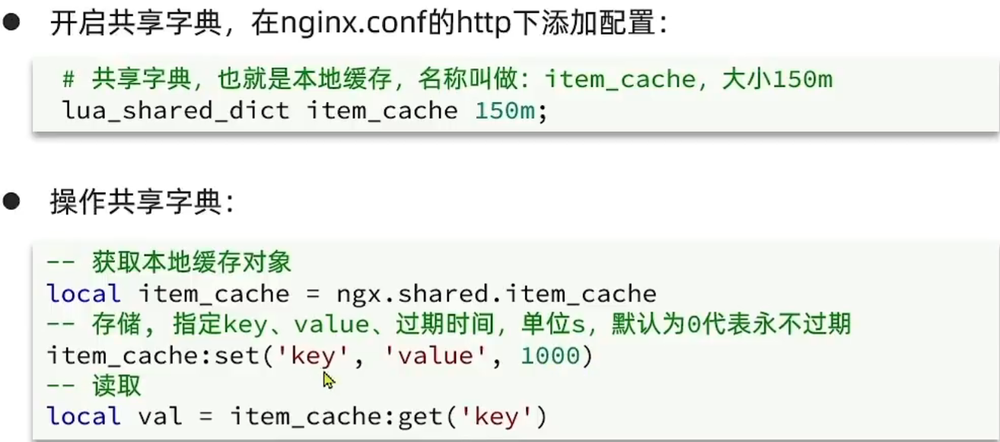

### 缓存同步

#### Canal缓存同步

- Canal就是把自己伪装成MysQL的一个slave节点，从而监听master的binary_log变化。再把得到的变化信息通知给Canal的客户端，进而完成对其它数据库的同步。
- **使用：**

1. 因为Canal相当于是mysql的一个从节点，所以需要配置mysql和canal在同一个网络下并且修改mysql的配置文件配置需要被监听的库。然后安装canal并配置要监听的库和mysql地址等信息。
2. Canal提供了各种语言的客户端，当Canal监听到binlog变化时，会通知Canal的客户端。不过这里我们会使用GitHub上的第三方开源的canal-starter。

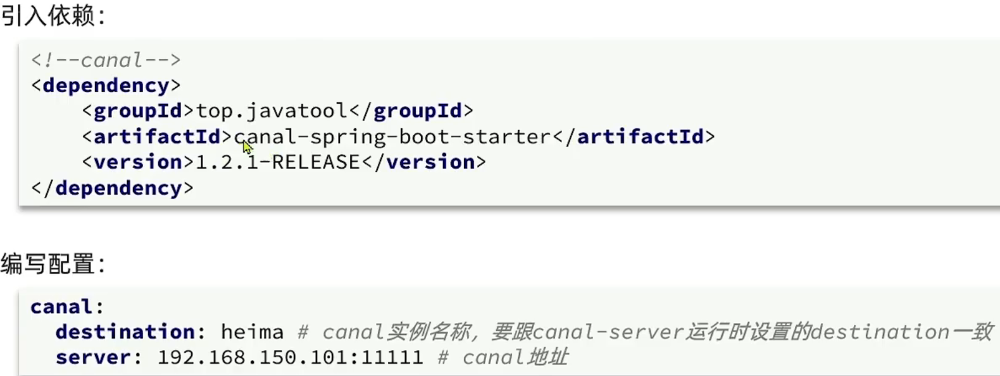

# Redis最佳实践：

## 键值设计：

- key和value都是遵循这个底层编码逻辑，这个省内存逻辑通常使用在value上。

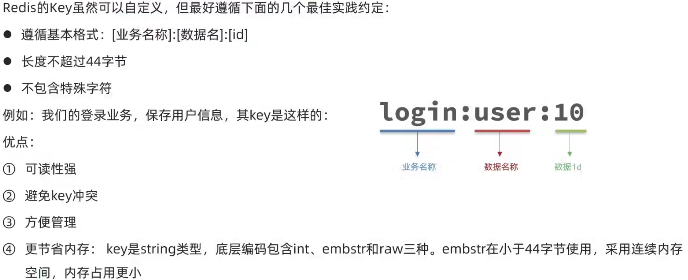

## BigKey问题：

- BigKey通常以Key的大小（这里key的大小实际是指value的大小）和Key中成员的数量来综合判定。
- 推荐值:单个key的value小于10KB；对于集合类型的key，建议元素数量小于1000。

- **危害：**

1. **网络阻塞：**对BigKey执行读请求时，少量的QPS就可能导致带宽使用率被占满，导致Redis实例，乃至所在物理机变慢。
2. **数据倾斜：**BigKey所在的Redis实例内存使用率远超其他实例，无法使数据分片的内存资源达到均衡。
3. **Redis阻塞：**对元素较多的hash、list、zset等做运算会耗时较旧，使主线程被阻塞。
4. **CPU压力：**对BigKey的数据序列化和反序列化会导致CPU的使用率飙升，影响Redis实例和本机其它应用。

- **发现BigKey：**

1. **redis-cli --bigkeys ：**利用redis-cli提供的--bigkeys参数，可以遍历分析所有keey，并返回Key的整体统计信息与每个数据的Top1的bigkey
2. **scan扫描：**自己编程利用scan扫描Redis中的所有key,利用strlen、hlen等命令判断key的长度(此处不建议使用MEMORY USAGE)
3. **第三方工具：**利用第三方工具，如Redis-Rdb-Tools分析RDB快照文件，全面分析内存使用情况
4. **网络监控：**自定义工具，监控进出Redis的网络数据，超出预警值时3主动告警

- **删除BigKey：**

1. **redis 3.0及以下版本：**如果是集合类型，则遍历BigKey的元素，先逐个删除子元素，最后删除BigKey 
2. **Redis4.0以后：**Redis在4.0后提供了异步删除的命令unlink

## 数据类型选择（避免BigKey）

### 存储对象：

- 用String存储序列化和反序列化很成熟方便，更推荐Hash，节约内存但是代码实现复杂。

- **问题：**hash的entry（键值对）数量超过500时，会使用哈希表而不是ZipList,内存占用较多。可以通过指令修改这个上限，但是entry超过1000就会导致BigKey问题。

- **推荐解决：**可以将键值对太多的Hash改为很多个string类型但这样内存消耗很大，下面这种方法是最节省空间的。

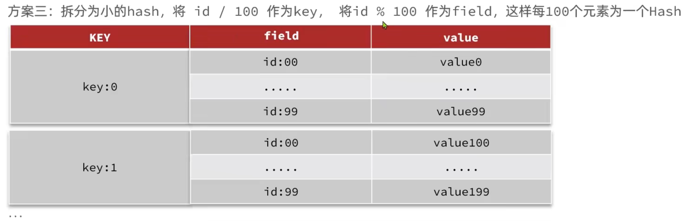

## 批处理优化：

### MSET&Pipeline：

- 如果每条命令都分开发送到Redis，这会在网络中浪费很多时间，我们就可以一次性把大量信息或者操作发到Redis中（redis执行很快）这样就会节约很大的时间。

1. **MSET（原子性）：**Redis提供了很多Mxxx这样的命令，可以实现批量插入数据，例如:mset、hmset可以使用这些命令大批量执行。——因为是redis一条命令执行所以有原子性。

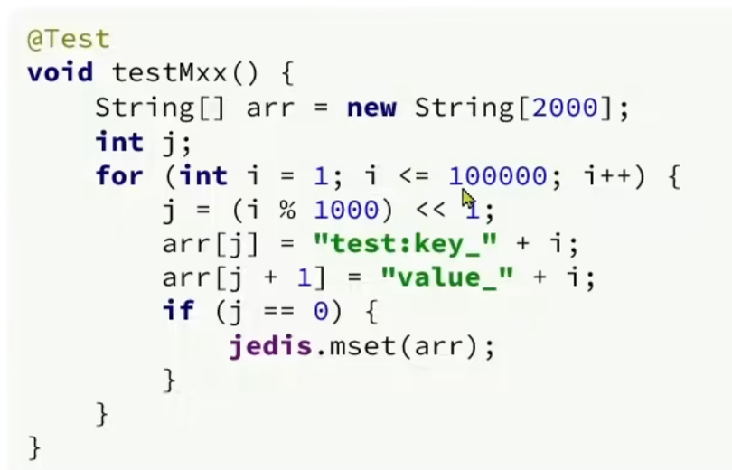

2. **Pipeline（没有原子性）：**MSET虽然可以批处理，但是却只能操作部分数据类型，此如果有对复杂数据类型的批处理需要，建议使用Pipeline功能。——因为是把执行命令传到redis所以没有原子性。

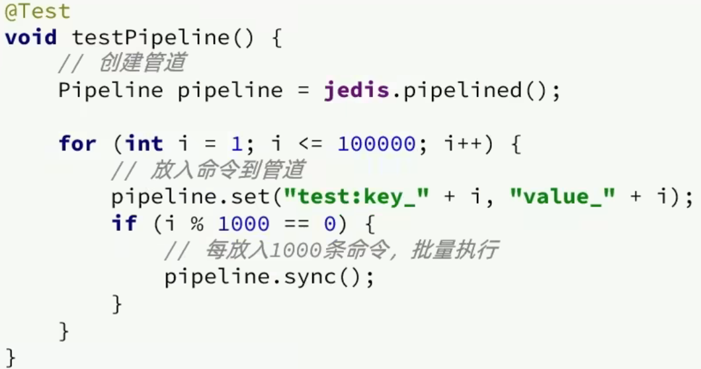

### 集群下批处理：

- 如MSET或Pipeline这样的批处理需要在一次请求中携带多条命令，而此时如果Redis是一个集群，那批处理命令的多个key必须落在一个插槽中，否则就会导致执行失败。
- 有以下解决方案，推荐使用并行方案（其中slot是控制插槽分配的），而且已被Spring整合。

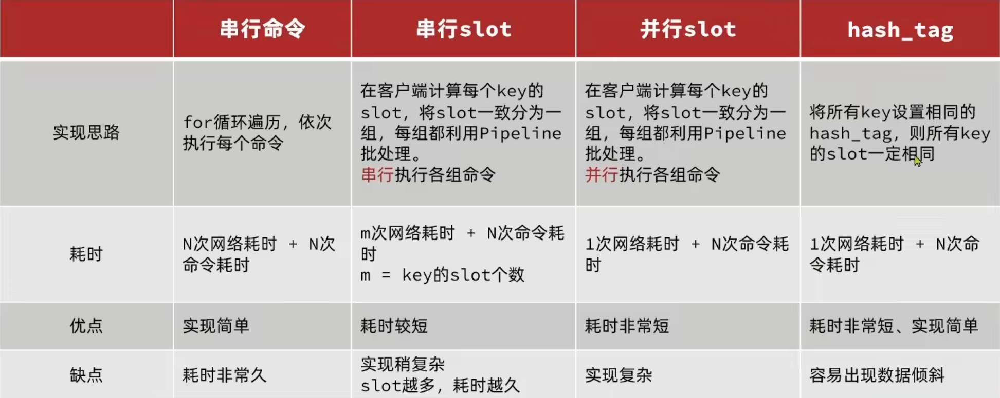

## 服务器优化：

### 持久化配置：

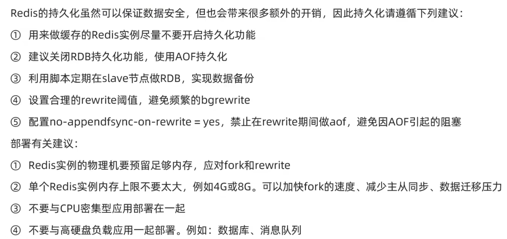

### 慢查询：

- 慢查询就是查询Redis耗时过长的指令，这会导致堵塞。
- 慢查询的阈值可以通过配置指定:slowlog-log-slower-than:慢查询阈值，单位是微秒。默认是10000，建议1000。
- 慢查询会被放入慢查询日志中，日志的长度有上限，可以通过配置指定:slowlog-max-len:慢查询日志(本质是一个队列)的长度。默认是128，建议1000。

- 查看慢查询日志列表:slowlog len（查询慢查询日志长度）slowlog get[n]（读取n条慢查询日志）slowlog reset（清空慢查询列表）

### 命令及安全配置

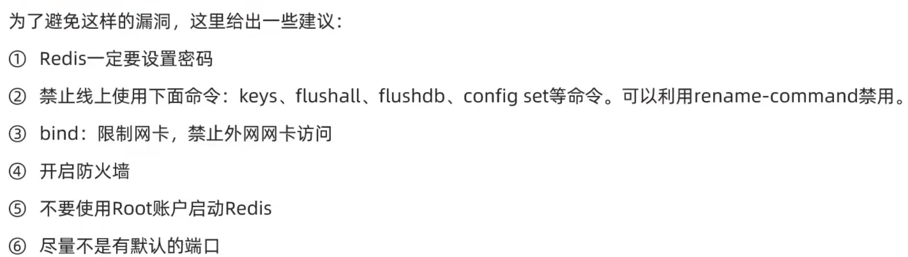

### Redis内存配置：

- 内存使用信息可以通过info memery指令查询。

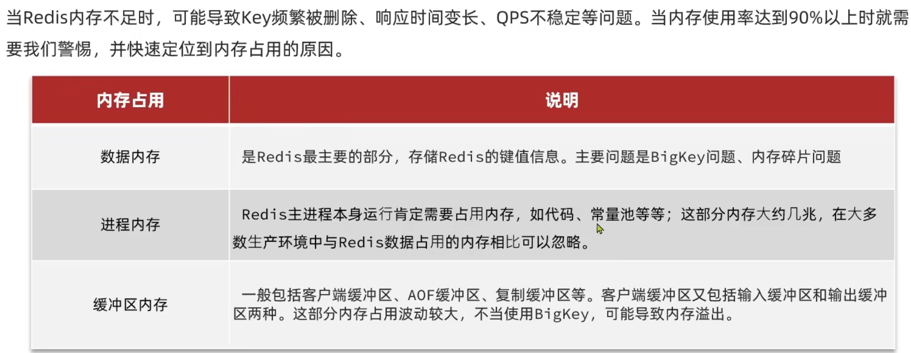

- 三种缓冲区的配置：

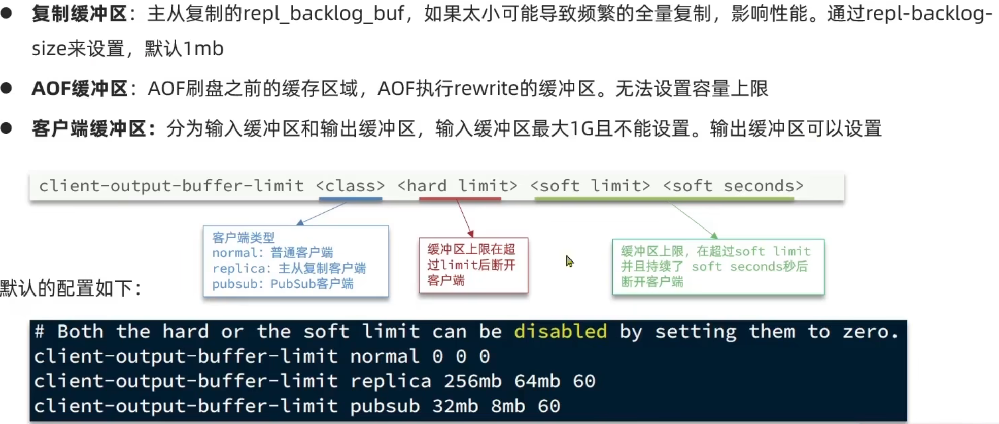

## 集群最佳实践：

1. **集群完整性问题：**在Redis的默认配置中，如果发现任意一个插槽不可用，则整个集群都会停止对外服务，为了保证高可用特性，这里建议将cluster-require-full-coverage配置为false。
2. **集群带宽问题：**集群中节点越多，集群状态信息数据量也越大，10个节点的相关信息可能达到1kb，此时每次集群互通需要的带宽会非常高。解决途径：

- 避免大集群，集群节点数不要太多，最好少于1000，如果业务庞大，则建立多个集群。
- 避免在单个物理机中运行太多Redis实例
- 配置合适的cluster-node-timeout值（不同节点互相ping的时间间隔是这个超时时间的一半，超时时间值越大ping的频率会越低）

3. 数据倾斜问题
4. 客户端性能问题
5. 命令的集群兼容性问题
6. lua和事务问题

- 单体Redis(主从Redis)已经能达到万级别的QPS，并且也具备很强的高可用特性。如果主从能满足业务需求的情况下，尽量不搭建Redis集群。

# Redis原理：

## 底层数据结构：

### 动态字符串SDS：

- 我们都知道Redis中保存的Key是字符串，value往往是字符串或者字符串的集合。可见字符串是Redis中最常用的一种数据结构。

1. **SDS结构：**是由不同大小的结构体实现的。

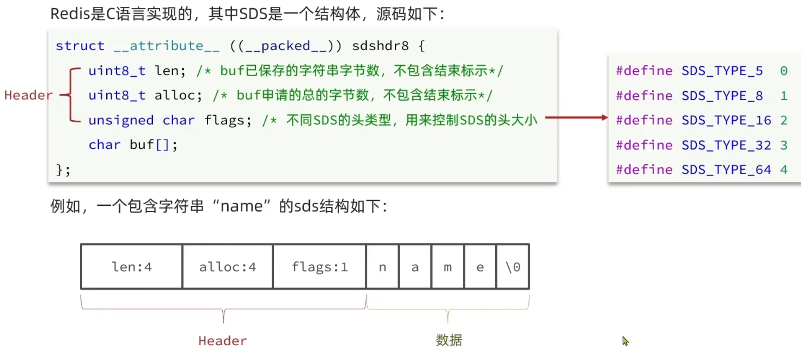

2. **SDS动态扩容：**如果新字符串小于1M，则新空间为扩展后字符串长度的两倍+1;如果新字符串大于1M，则新空间为扩展后字符串长度+1M+1。称为内存预分配。

### IntSet整数集合：

- 因为IntSet底层用的是数组，需要连续的空间，所以适合用在少量数据上。

1. **结构：**

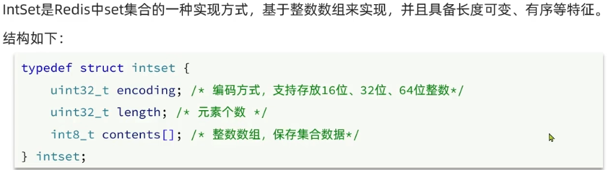

2. **扩容：**

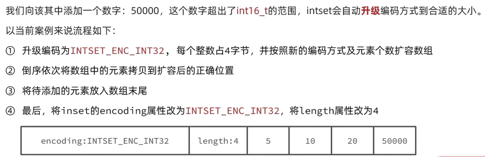

### Dict键值对：

1. **结构：**size一定是$2^n$因为方便用&操作来求余。如果数据拥有同一个DictEntry会通过*next插入在头部。

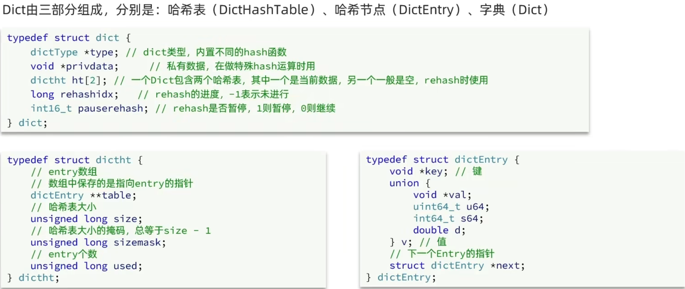

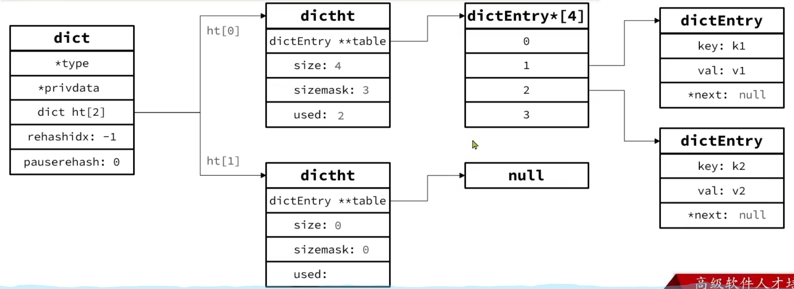

2. **rehash：**Dict中的HashTable就是数组结合单向链表的实现，当集合中元素较多时，必然导致哈希冲突增多，链表过长，则查询效率会大大降低。Dict在每次新增键值对时都会检查负载因子(LoadFactor=used/size)，满足以下两种情况时会触发哈希表扩容:

- 哈希表的LoadFactor>=1,并且服务器没有执行BGSAVE或者BGREWRITEAOF等后台进程;
- 哈希表的LoadFactor>5;
- 哈希表的LoadFactor<0.1时也会做收缩;

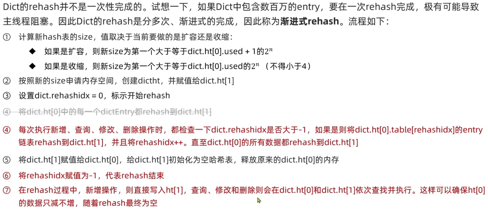

### ZipList：

- ZipList使用的连续空间相比Dict会更加节约内存，但是查询效率不如Dict。

1. **结构：**其中entry中包含previous_entry_length:前一节点的长度,占1个或5个字节；encoding:编码属性，记录content的数据类型(字符串还是整数)以及长度，占用1个、2个或5个字节；contents:负责保存节点的数据，可以是字符串或整数。

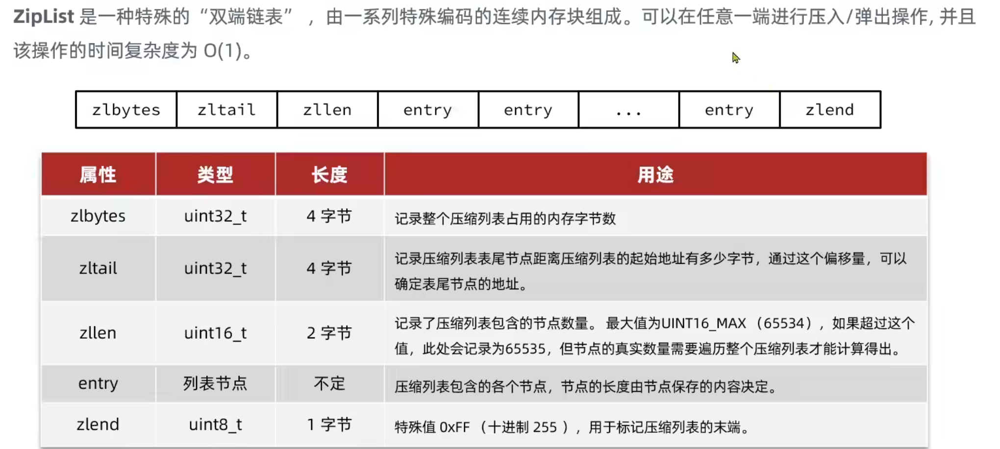

2. ZipList在特殊情况下产生的连续多次空间扩展操作称之为连锁更新(Cascade Update)。新增、删除都可能导致连锁更新的发生。这个在早些版本还没得到解决。

### QuickList（ZipList链表）：

1. **结构：**

- 为了避免QuickList中的每个ZipList中entry过多，Redis提供了一个配置项:list-max-ziplist-size来限制。
- 除了控制ZipList的大小，QuickList还可以对节点的ZipList做压缩。通过配置项list-compress-depth来控制。因为链表一般都是从首尾访问较多，所以首尾是不压缩的。（0-不压缩，1-首尾1个节点不压缩）

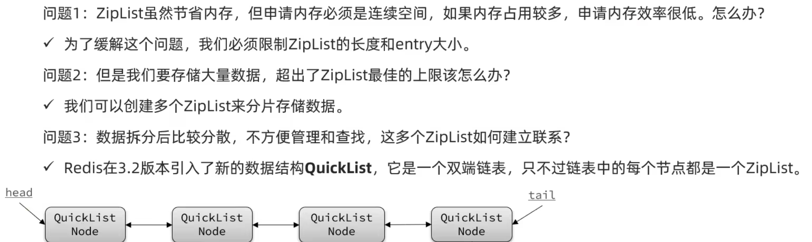

### SkipList：

- 为了提高查询效率，因此设计了跳表这样的数据结构，有如下结构：

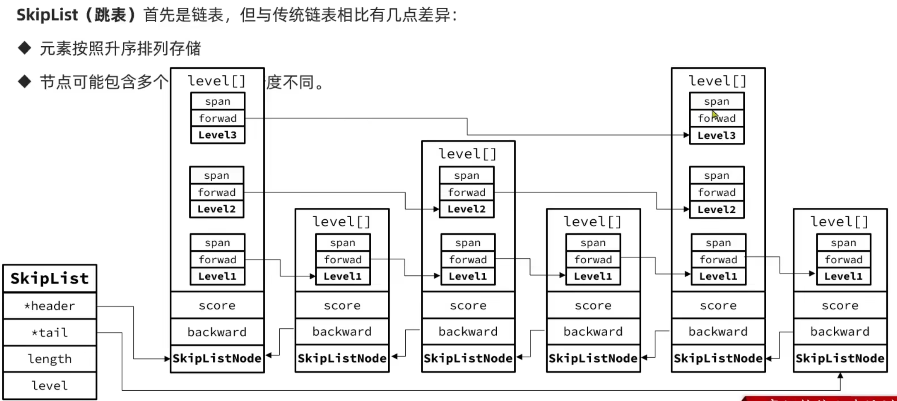

## 五种数据类型：

### RedisObject：

- Redis中的任意数据类型的键和值都会被封装为一个RedisObject，也叫做Redis对象。

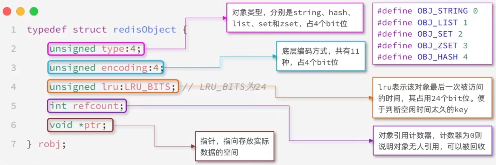

### String：

- 其基本编码方式是RAW，基于简单动态字符串(SDS)实现，存储上限为512mb。
- 如果存储的SDS长度小于44字节，则会采用EMBSTR编码，此时object head与SDS是一段连续空间。申请内存时只需要调用一次内存分配函数，效率更高。
- 如果存储的字符串是整数值，并且大小在LONG MAX范围内，则会采用INT编码:直接将数据保存在RedisObject的ptr指针位置(刚好8字节)，不再需要SDS了。

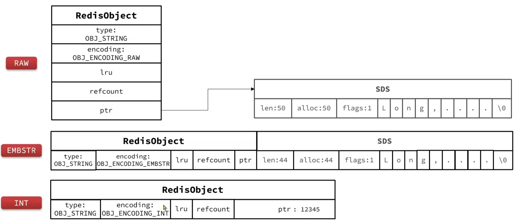

### List：

- List的特点是首尾取和插入。
- 3.2版本之后Redis统一使用QuickList来存储List。

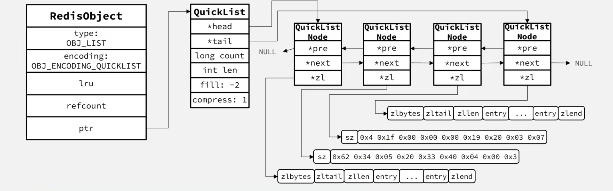

### Set：

- 特点是不保证有序性、元素唯一、可以求并集、交集、差集。要经常判断数据是否存在，因此要高效查询的数据结构。
- 当本来是存储整数的Set中加入字符串时会将IntSet替换为Dict。

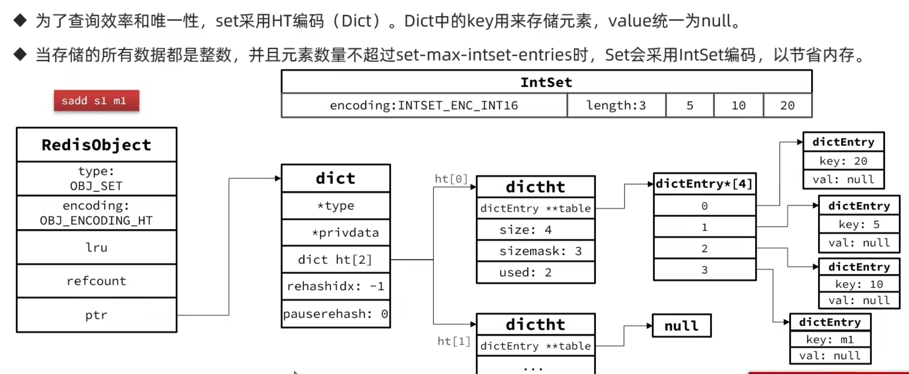

### ZSet：

- ZSet也就是SortedSet，其中每一个元素都需要指定一个score值和member值，member必须唯一可以根据member查询分数。因此，zset底层数据结构必须满足键值存储、键必须唯一、可排序这几个需求。所以ZSet数据类型即使用了Dict也使用了SkipList来同时实现上面的需求。

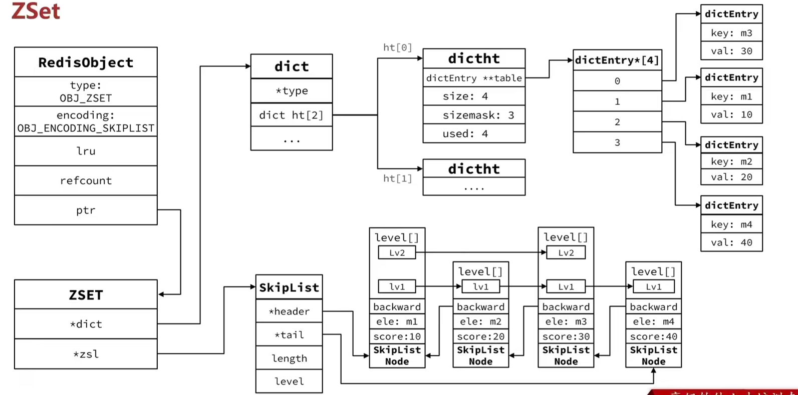

- 当元素数量不多时，HT和SkipList的优势不明显,而且更耗内存。因此zset还会采用ZipList结构来节省内存，不过需要同时满足两个条件：1.元素数量小于zset_max_ziplist_entries,默认值128。2.每个元素都小于zset_max_ziplist_value字节,默认值64。

- 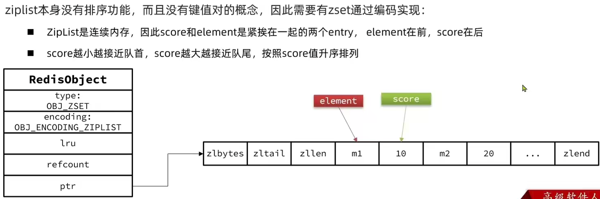

### Hash：

- Hash结构与Redis中的Zset非常类似，都是键值存储，都需求根据键获取值，键必须唯一。区别是zset的键是member,值是score而hash的键和值都是任意值，zset要根据score排序;hash则无需排序。因此，Hash底层采用的编码与Zset也基本一致，只需要把排序有关的SkipList去掉即可:

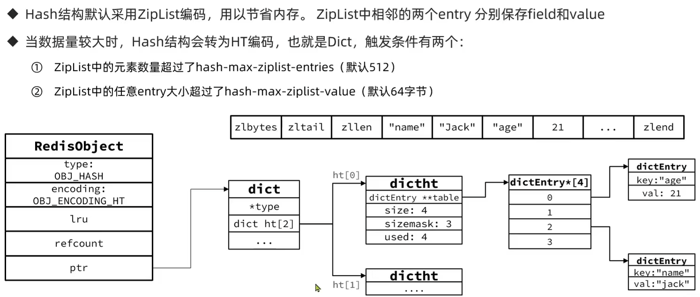

## 网络模型：

### 用户空间和内核空间：

- 因为操作系统的运行会占用内存，为了避免用户应用导致冲突甚至内核崩溃，用户应用与内核是分离的，进程的寻址空间会划分为两部分:内核空间、用户空间。

1. **用户空间：**只能执行受限的命令(Ring3)，而且不能直接调用系统资源，必须通过内核提供的接口来访问。
2. **内核空间：**可以执行特权命令(Ring0)，调用一切系统资源。

- Linux系统为了提高IO效率，会在用户空间和内核空间都加入缓冲区（buffer）:

1. **写数据时：**要把用户缓冲数据拷贝到内核缓冲区，然后写入设备
2. **读数据时：**要从设备读取数据到内核缓冲区，然后拷贝到用户缓冲区

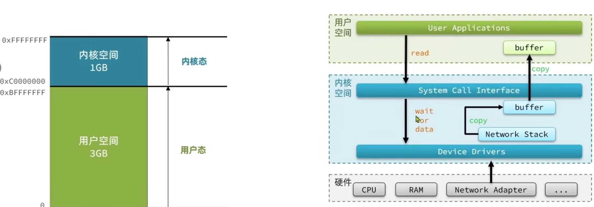

- IO的数据等待和拷贝过程耗时是最多的，因此要使用一些方式提高IO效率。

### 阻塞IO：

- 顾名思义，阻塞IO就是两个阶段（等待数据和数据拷贝）都必须阻塞等待:

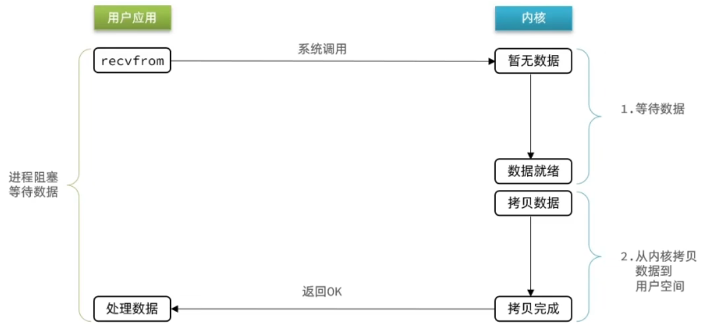

### 非阻塞IO：

- 顾名思义，非阻塞IO的recvfrom操作会立即返回结果而不是阻塞用户进程。
- 可以看到，非阻塞IO模型中，用户进程在第一个阶段是非阻塞，第二个阶段是阻塞状态。虽然是非阻塞，但性能并没有得到提高。而且忙等机制会导致CPU空转，CPU使用率暴增。

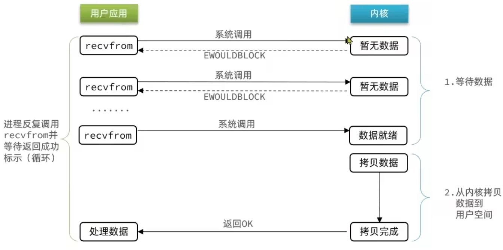

### IO多路复用：

- **无论是阻塞IO还是非阻塞IO**，用户应用在一阶段都需要调用recvfrom来获取数据，比如服务端处理客户端Socket请求时，在单线程情况下，只能依次处理每一个socket,如果正在处理的socket恰好未就绪(数据不可读或不可写)，线程就会被阻塞，所有其它客户端socket都必须等待，性能自然会很差。有两个方案解决：

1. **方案一:**增加更多线程（但线程太多可能反而不好）。
2. **方案二:**不排队，利用单个线程监听多个FD，如果数据就绪，通知用户应用就去读写数据，这就是IO多路复用。

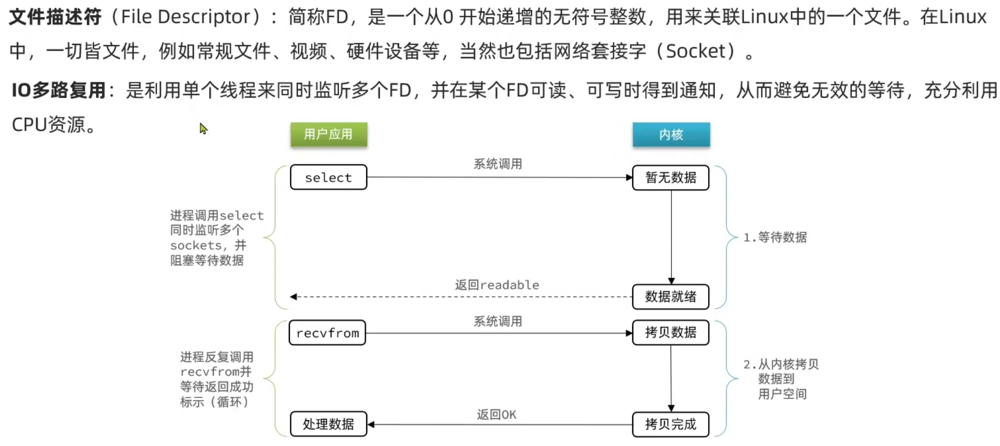

- 监听FD的方式、通知的方式又有多种实现，常见的有：select、poll、epoll。
- select和poll只会通知用户进程有FD就绪，但不确定具体是哪个FD，需要用户进程逐个遍历FD来确认。
- epoll则会在通知用户进程FD就绪的同时，把已就绪的FD写入用户空间。

#### select模式：

- **缺点：**

1. 需要将整个fd_set从用户空间拷贝到内核空间，select结束还要再次拷贝回用户空间。
2. select无法得知具体是哪个fd就绪，需要遍历整个fd_set。
3. fd_set监听的fd数量不能超过1024。

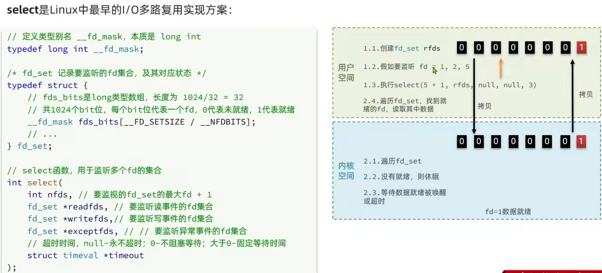

#### Poll模式

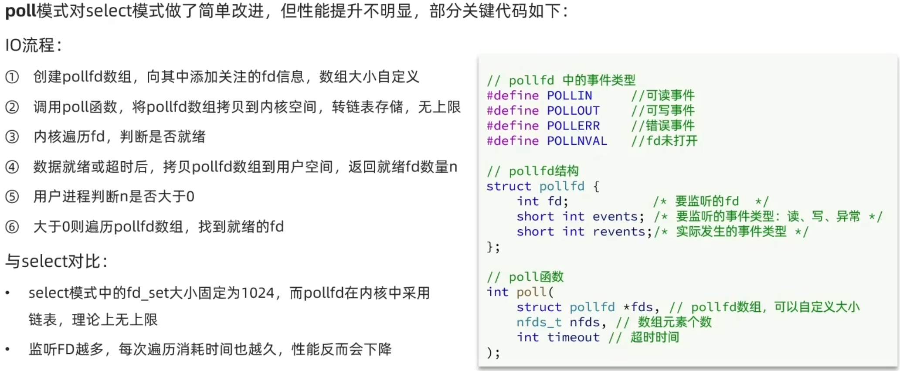

#### epoll模式：

- 基于epoll实例中的红黑树保存要监听的FD，理论上无上限，而且增删改查效率都非常高，性能不会随监听的FD数量增多而下降。
- 每个FD只需要执行一次epoll_ctl添加到红黑树，以后每次epoll_wait无需传递任何参数，无需重复拷贝FD到内核空间。大大减少了用户空间和内核空间的交互。
- 内核会将就绪的FD直接拷贝到用户空间的指定位置，用户进程无需遍历所有FD就能知道就绪的FD是谁。

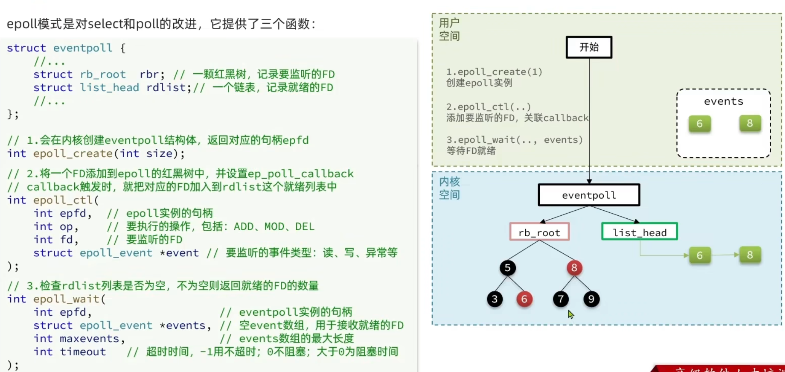

#### 事件通知机制：

- 当FD有数据可读时，我们调用epoll_wait就可以得到通知。但是事件通知的模式有两种:

1. LevelTriggered:简称LT。当FD有数据可读时，会重复通知多次，直至数据处理完成，是Epoll的默认模式。
2. EdgeTriggered:简称ET。当FD有数据可读时，只会被通知一次，不管数据是否处理完成。

#### Web服务流程：

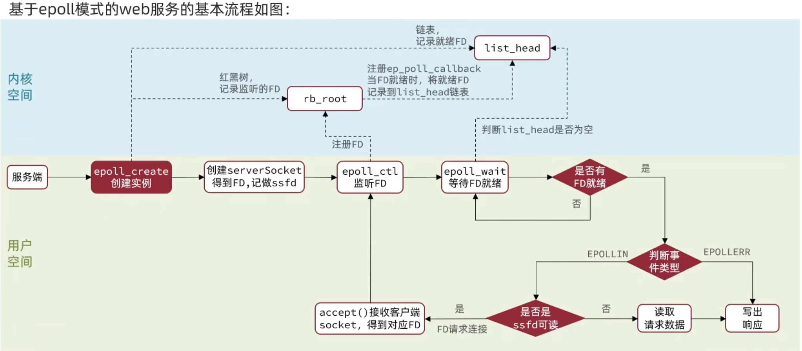

#### 信号驱动IO&异步IO：

- **信号驱动IO：**

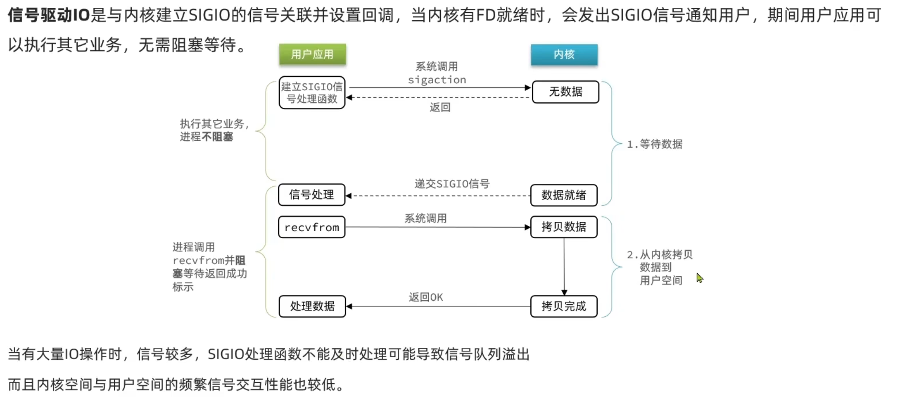

- **异步IO：**IO操作是同步还是异步，关键看数据在内核空间与用户空间的拷贝过程(数据读写的IO操作)，也就是阶段二是同步还是异步，异步IO的缺陷主要在于如果在高并发的情况下内核处理不过来。

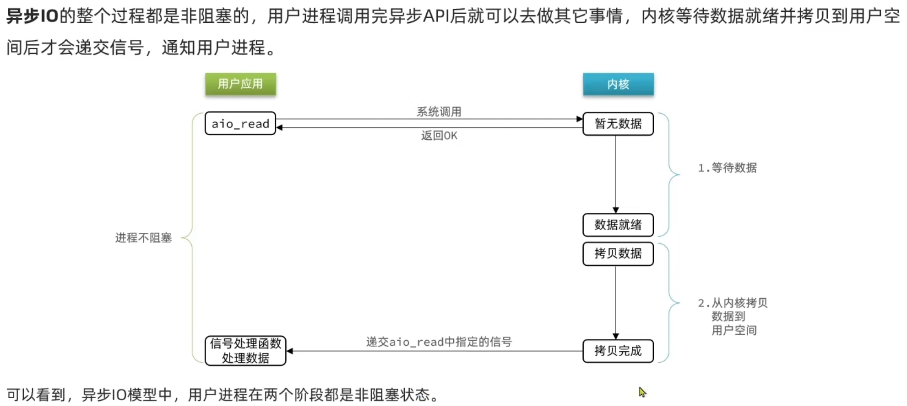

### Redis网络模型：

- Redis如果仅仅聊Redis的核心业务部分(命令处理)，答案是单线程。但如果是聊整个Redis，那么答案就是多线程。
- 在Redis版本迭代过程中，在两个重要的时间节点上引入了多线程的支持:
- Redis v4.0:引入多线程异步处理一些耗时较长的任务，例如异步删除命令unlink。
- Redis v6.0:在核心网络模型中引入多线程，进一步提高对于多核CPU的利用率。
- **为什么Redis在命令操作还是选择单线程：**

1. 抛开持久化不谈，Redis是纯内存操作，执行速度非常快，它的性能瓶颈是网络延迟而不是执行速度，因此多线程并不会带来巨大的性能提升。
2. 多线程会导致过多的上下文切换，带来不必要的开销。
3. 引入多线程会面临线程安全问题，必然要引入线程锁这样的安全手段，实现复杂度增高，而且性能也会大
   打折扣。

- **Redis网络模型图：**这个图结合前面的Web服务流程图一起。

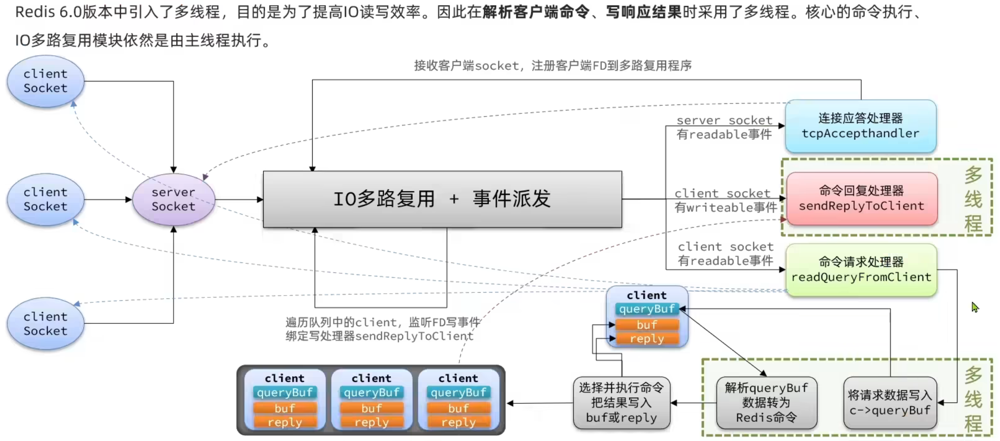

## 通信协议

- Redis是一个CS架构的软件，通信一般分两步(不包括pipeline和PubSub):

1. 客户端(client)向服务端(server)发送一条命令。
2. 服务端解析并执行命令，返回响应结果给客户端。

- 因此客户端发送命令的格式、服务端响应结果的格式必须有一个规范，这个规范就是通信协议。


- 在Redis中采用的是RESP(Redis Serialization Protocol)协议:

1. Redis 1.2版本引I入了RESP协议
2. Redis 2.0版本中成为与Redis服务端通信的标准，称为RESP2
3. Redis6.0版本中，从RESP2升级到了RESP3协议，增加了更多数据类型并且支持6.0的新特性--客户端缓存
4. 但目前，默认使用的依然是RESP2协议，也是我们要学习的协议版本(以下简称RESP)。

### RESP协议：

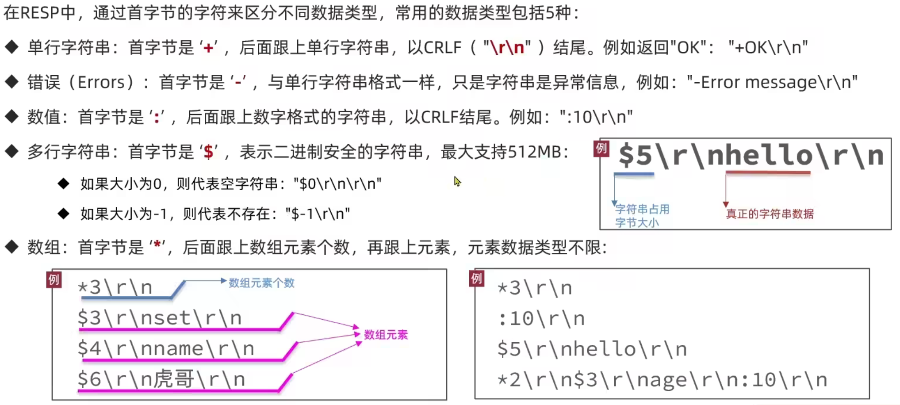

## 内存回收：

- Redis之所以性能强，最主要的原因就是基于内存存储。然而单节点的Redis其内存大小不宜过大，会影响持久化或主从同步性能。我们可以通过修改配置文件来设置Redis的最大内存: maxmemory 1gb

### 过期策略：

- Redis本身是一个典型的key-value内存存储数据库，因此所有的key、value都保存在之前学习过的Dict结构中。不过在其database结构体中，有两个Dict:一个用来记录key-value;另一个用来记录key-TTL。

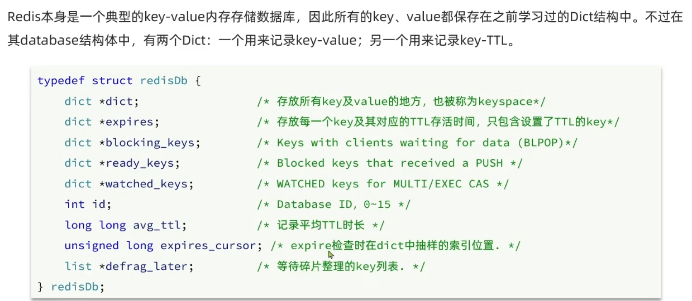

1. **惰性删除:**顾明思议并不是在TTL到期后就立刻删除，而是在访问一个key的时候，检查该key的存活时间，如果已经过期才执行删除。
2. **周期删除:**顾明思议是通过一个定时任务，周期性的抽样部分过期的key，然后执行删除。执行周期有两种:

- Redis会设置一个定时任务serverCron()，按照server.hz的频率来执行过期key清理，模式为SLOW。
- Redis的每个事件循环前会调用beforeSleep()函数，执行过期key清理，模式为FAST。

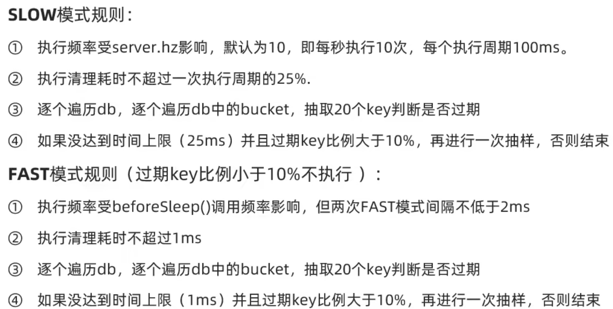

### 内存淘汰策略：

1. **内存淘汰:**就是当Redis内存使用达到设置的阈值时，Redis主动挑选部分key删除以释放更多内存的流程。Redis会在每次处理客户端命令的方法processCommand()中尝试做内存淘汰。

- **淘汰策略:**推荐LFU。

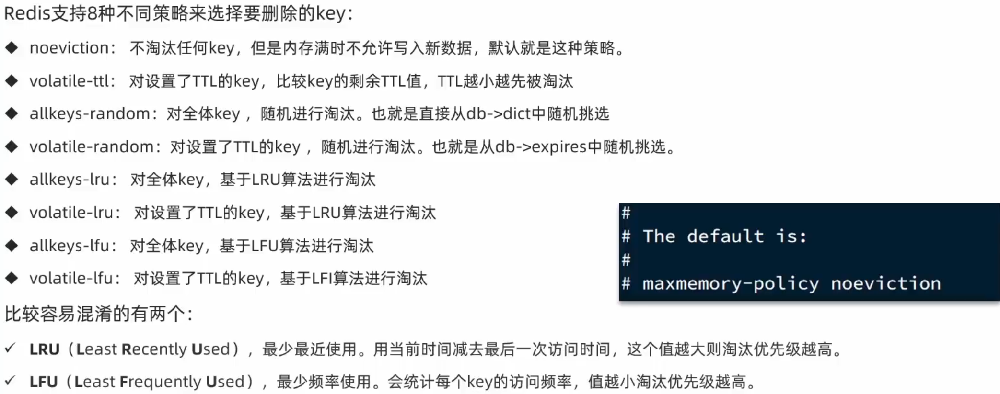

2. **LFU、LRU原理：**RedisObject其中的`lru`就是记录最近一次访问时间和访问频率的。

- **LRU**：以秒为单位记录最近一次访问时间，长度24bit

- **LFU**：高16位以分钟为单位记录最近一次访问时间，低8位记录逻辑访问次数

LFU的访问次数之所以叫做**逻辑访问次数**，是因为并不是每次key被访问都计数，而是通过运算（`访问次数越多，逻辑访问次数增加的可能性越小，第一次访问必加`）：

- ① 生成`[0,1)`之间的随机数`R`
- ② 计算 `1/(旧次数 * lfu_log_factor + 1)`，记录为`P`， `lfu_log_factor`默认为10
- ③ 如果 `R` < `P `，则计数器 `+1`，且最大不超过255
- ④ 访问次数会随时间衰减，距离上一次访问时间每隔 `lfu_decay_time` 分钟(默认1) ，计数器`-1`

3. **整体流程图：**

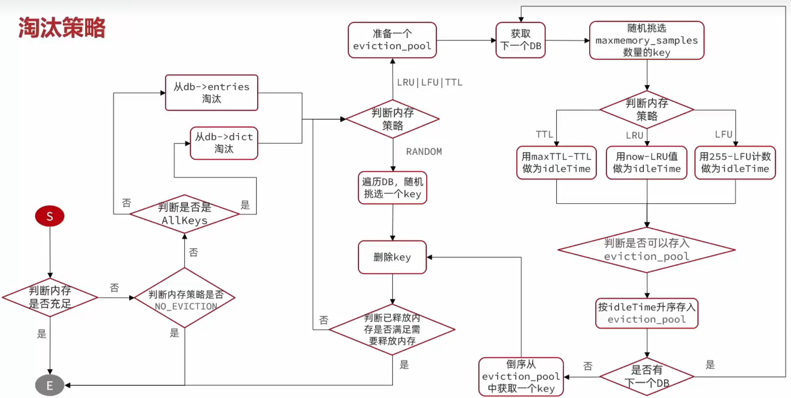

# Redis应用场景

## 共同关注

- Redis中的set集合可以实现求两个set集合的交集

```java
// 获取当前登录用户
Long userId = UserHolder.getUser().getId();
// 1.获取当前用户的关注用户id集合
String key1 = "follows:" + userId;
// 2.获取被关注用户的关注用户的key
String key2 = "follows:" + followUserId;
// 3.取交集
Set<String> intersect = stringRedisTemplate.opsForSet().intersect(key1, key2);
```
