# SSM

## Spring FrameWork 框架

### 总体架构：

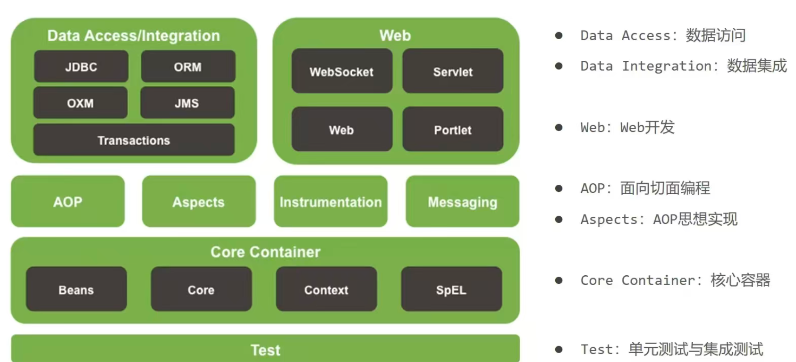

## Spring整合

### IOC&DI：

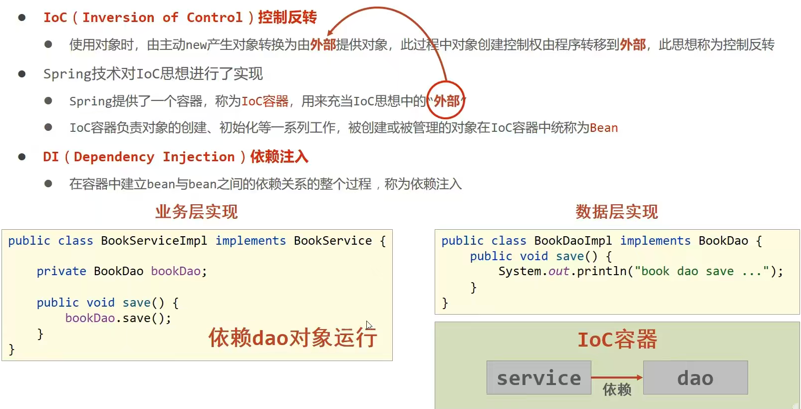

### Bean：

#### bean生命周期：

- 初始化容器。

1. 创建对象(内存分配 )

2. 执行构造方法

3. 执行属性注入(set操作)

4. 执行bean初始化方法

- 使用bean

1. 执行业务操作

- 关闭/销毁容器.

1. 执行bean销毁方法

#### XML配置文件注入Bean：

- 如果需要将一个类注册为bean，就需要在spring配置文件中，以下是bean再配置文件中的一些属性说明

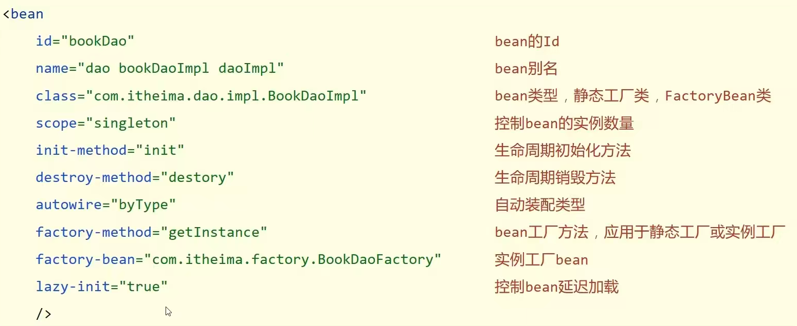

- 在bean中可能还会依赖其他bean或者变量，可以通过以下方式注入：

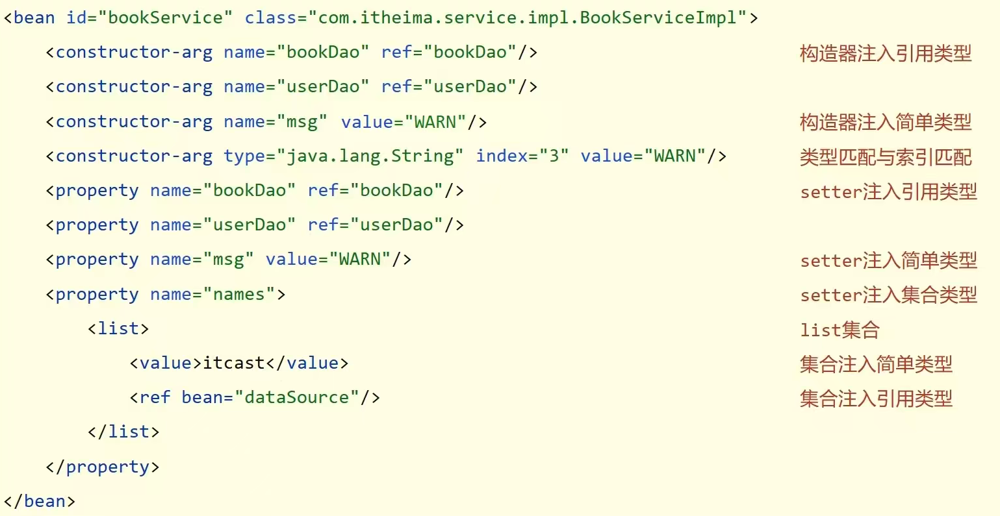

##### **依赖注入方式总结：**

1. 强制依赖使用构造器进行，使用setter注入有概率不进行注入导致null对象出现
2. 可选依赖使用setter注入进行，灵活性强
3. Spring框架倡导使用构造器,第三方框架内部大多数采用构造器注入的形式进行数据初始化，相对严谨
4. 如果有必要可以两者同时使用，使用构造器注入完成强制依赖的注入，使用setter注入完成可选依赖的注入
5. 实际开发过程中还要根据实际情况分析，如果受控对象没有提供setter方法就必须使用构造器注入
6. 自己开发的模块推荐使用setter注入

- 也可以通过<bean/>中autowire标签进行**自动注入：**

1. 自动装配用于引用类型依赖注入，不能对简单类型进行操作
2. 使用按类型装配时(byType)必须保障容器中相同类型的bean唯一，推荐使用
3. 使用按名称装配时(byName)必须保障容器中具有指定名称的bean，因变量名与配置耦合，不推荐使用
4. 自动装配优先级低于setter注入与构造器注入，同时出现时自动装配配置失效

##### **在配置文件中加载properties文件：**

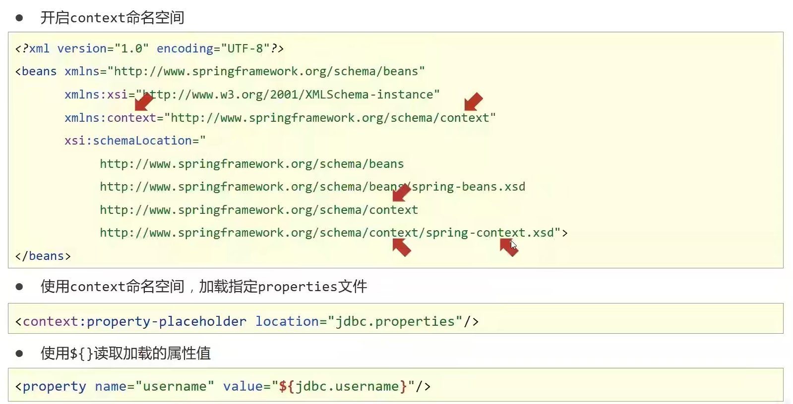

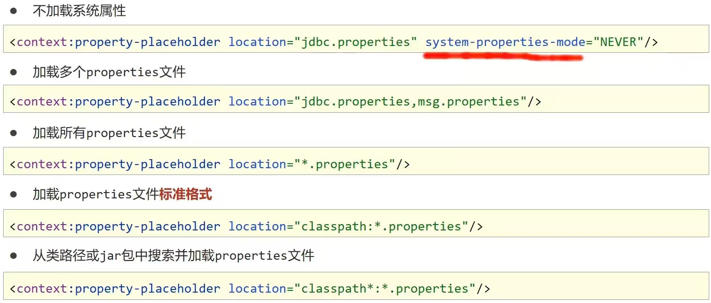

##### 创建容器

- BeanFactory是IOC容器的顶层接口，初始化BeanFactory对象时，加载的bean延迟加载
- ApplicationContext接口是Spring容器的核心接口，初始化时bean立即加载
- ApplicationContext接口提供基础的bean操作相关方法，通过其他接口扩展其功能
- ApplicationContext接囗常用初始化类
  - ClassPathXmlApplicationContext
  - FileSystemXmlApplicationContext

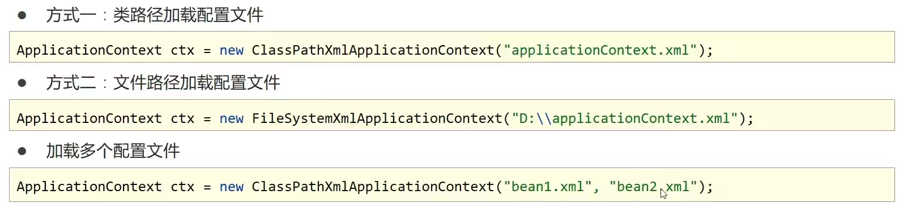

##### bean实例化：

- 最常用的是FactoryBean实例化：

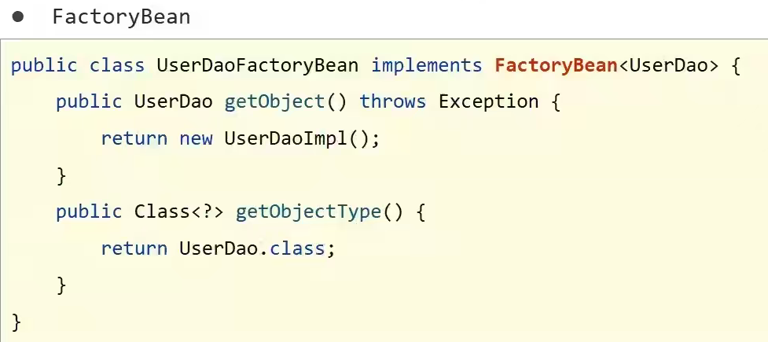

#### 纯注解注入Bean：

##### 配置类：

- Spring3.0开启了纯注解开发模式，使用]ava类替代配置文件，开启了Spring快速开发赛道。

- @Configuration注解用于设定当前类为配置类。
- @ComponentScan注解用于设定扫描路径，此注解只能添加一次，多个数据请用数组格式。

bean中注释：

- **生命周期：**使用@PostConstruct定义开始阶段执行的函数
- **生命周期：**使用@PreDestroy定义销毁阶段执行的函数
- **单例多例：**@Scope(“singleton”)定义是单例还是多例bean
- **指定bean：**如果bean接口被多个类实现，要指定使用的bean，可以在@autowired下面定义@Qualifier(“beanName”)
- **简单类型值注入：**使用@Value(“int/string”)注入


##### 在配置类中加载properties文件：

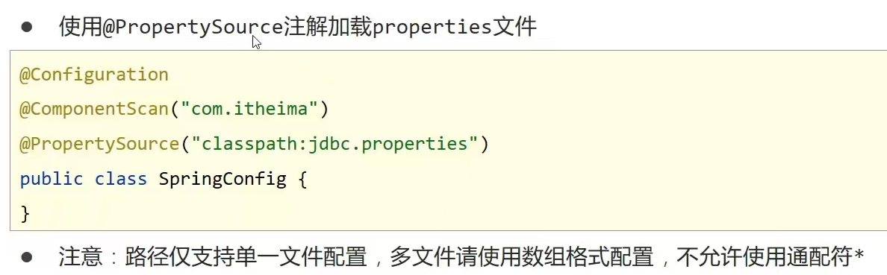

##### 配置类中定义第三方bean：

- 在配置文件中定义方法返回第三方bean，并且在方法上加入@Bean注释。
- 如果第三方bean需要依赖其他的bean之间在定义方法时设置形参就可以。
- **简单类型值注入：**使用@Value(“int/string”)注入

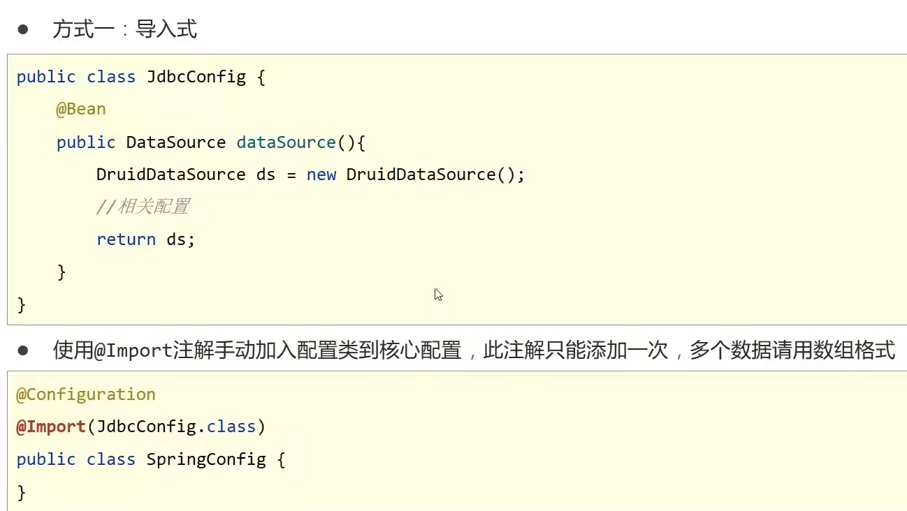

#### XML与注解的区别总结：

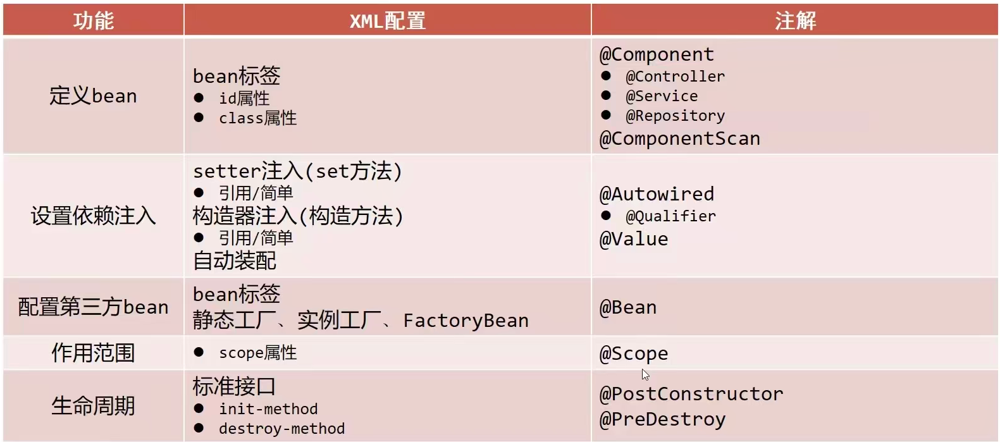

### Mybatis：

#### Mybatis程序核心对象：

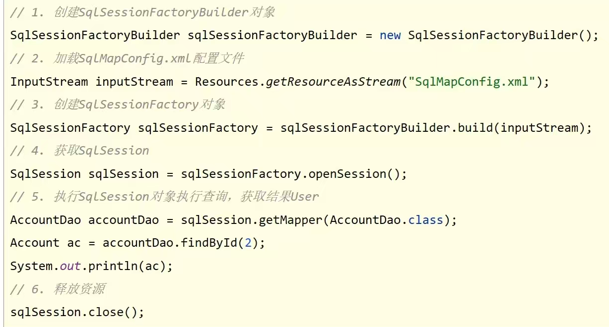

#### 整合Mybatis

- 将原来的配置文件整合成一个bean，其中dataSource是定义的一个JDBC的bean

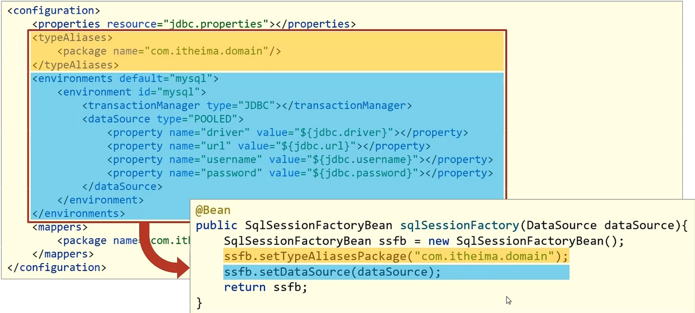

- 将Mapper配置整合成一个MapperScannerConfigurer的Bean

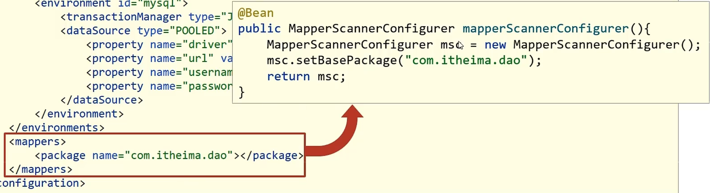

### 整合JUnit：

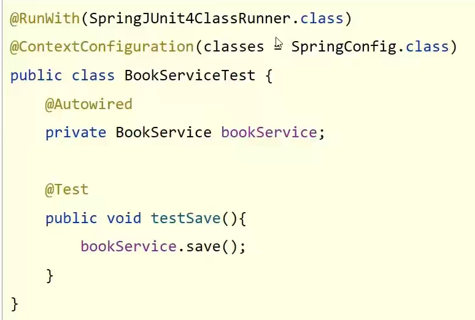

### SpringMVC：

- 优化Servlet，使controller层的书写更加方便。

#### 工作流程：

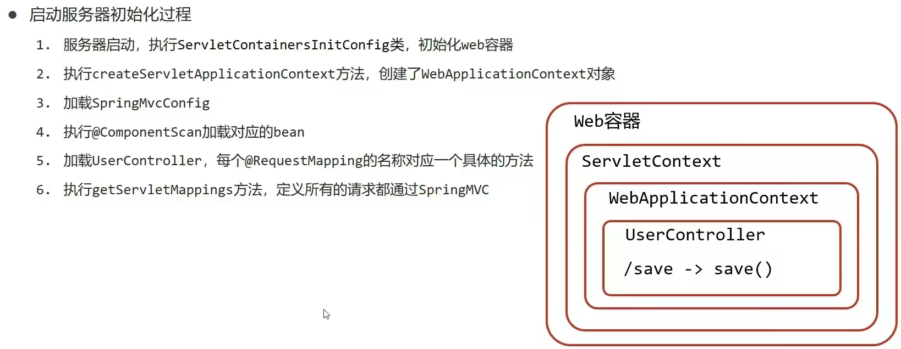

#### Bean加载控制：

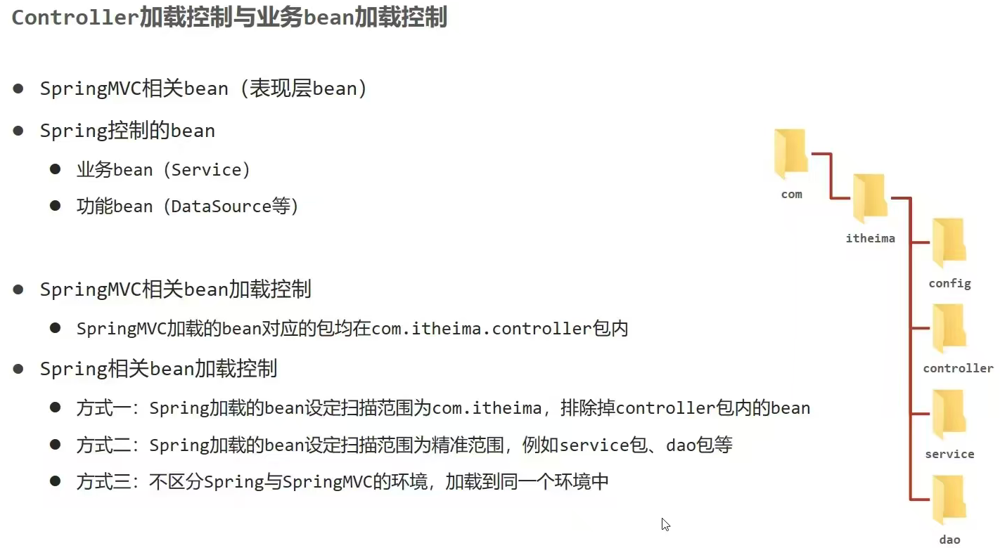

#### Web请求与响应：

- 请求：如果是json数据要加上@RequestBody，如果是路径参数要加上@RequestParam。类型转换时使用的是Converter接口。
- 响应：要使用@ResponseBody才会把返回数据解析为json或者字符串格式，如果没有则会认为是返回一个页面。使用的是HttpMessageConverter

#### REST风格：


### 拦截器：

- 使用方法见->后端开发.md->interceptor。

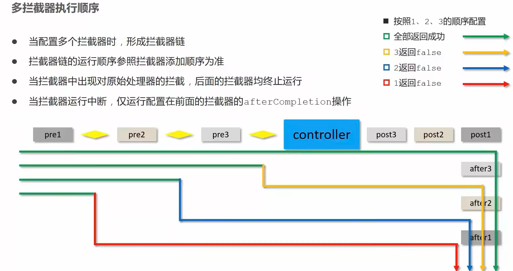

### Maven：

#### 聚合：

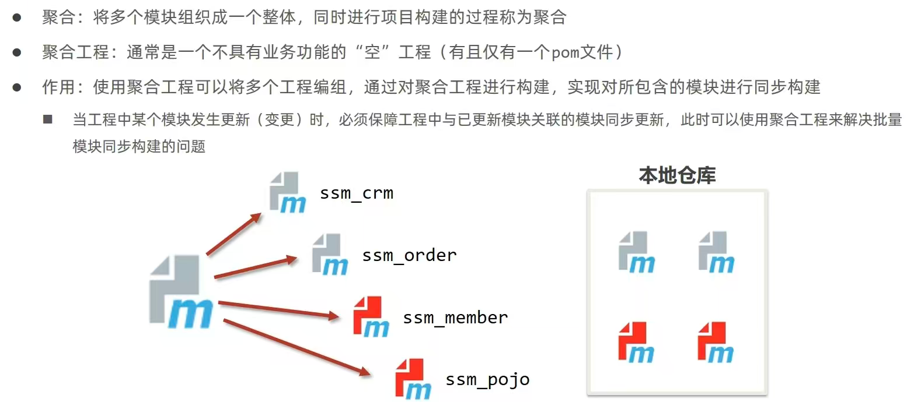

#### 继承：

1. 创建Maven模块，设置打包类型为pom（<packaging>pom</packaging>）
2. 在父工程的pom文件中配置依赖关系(子工程将沿用父工程中的依赖关系)
3. 使用<dependencyManagement>配置子工程可选依赖关系（子工程不选就不会加载）。
4. 使用<parent>在子工程中继承当前父工程。
5. 在子工程中配置使用父工程中可选依赖的坐标。

#### 属性配置与使用：

1. 在<properties>中可以配置变量，通常用于版本管理。
2. 在依赖中使用${varName}来引用属性（通常在<version>中）。

#### 资源文件引用属性：

1. 在<properties>中可以配置变量。
2. 在配置文件中使用${}$${name}来配置。
3. 开启资源文件目录加载属性的过滤器，这样才能保证在项目的任何位置都能引用。

```xml
<build>
    <resources>
        <resource>
            <directory>${project.basedir}/src/ain/resources</directory>
            <filtering>true</filtering>
        </resource>
    </resources>
</build>
```

#### 多环境开发：

- 可以给项目配置不同的环境，方便在不同的主机上运行。

1. 定义多环境：

```xml
<!--定义名环境-->
<profiles>
    <!--定义具体的环境:生产环境-->
    <profile>
    <!--定义环境对应的唯一名称-->
    <id>env_dep</id>
        <!--定义环境中专用的属性值-->
    <properties>
        <idbc.url>idbc:mysql://127.0.0.1:3306/ssm_db</idbc.url>
    </properties>
        <!--设置默认启动-->
    <activation>
        <activeByDefault>true</activeByDefault>
    </activation>
    </profile>
    <!--定义具体的环境:开发环境-->
    <profile>
    <id>env_pro</id>
        .....
    </profile>
</profiles>
```

2. 使用多环境：
   - **模板：**mvn 指令(例如：install) -p 环境定义id

#### 跳过测试：

- 执行的项目构建指令必须包含测试生命周期，否则无效果。例如执行compile生命周期，不经过test生命周期
- **模板：**mvn 指令 -D skipTests

- **细粒度跳过测试：**

``` xml
<plugin>
    <artifactId>maven-surefire-plugin</artifactId>
    <version>2.22.1</version>
    <configuration>
        <skipTests>true</skipTests><!--设置跳过测试-->
        <includes><!--包含指定的测试用例-->
            <include>**/User*Test.iava</include>
        </includes>
        <excludes><!--排除指定的测试用例-->
            <exclude>**/User*TestCase.java</exclude>
        </excludes>
    </configuration>
</plugin>
```

## Spring Boot：

### 起步依赖：

- 在SpringBoot整合的项目中，pom文件中会有会继承一个spring-boot-starter-parent（这个又继承了spring-boot-dependencies）里面配置了一些SpringBoot项目需要用到的依赖以及依赖的版本，极大的简化了开发使用。

1. **starter：**SpringBoot中常见项目名称，定义了当前项目使用的所有项目坐标，以达到减少依赖配置的目的。
2. **parent：**所有SpringBoot项目要继承的项目，定义了若干个坐标版本号(依赖管理，而非依赖)，以达到减少依赖冲突的目的

### 多环境启动：

- **yml文件：**

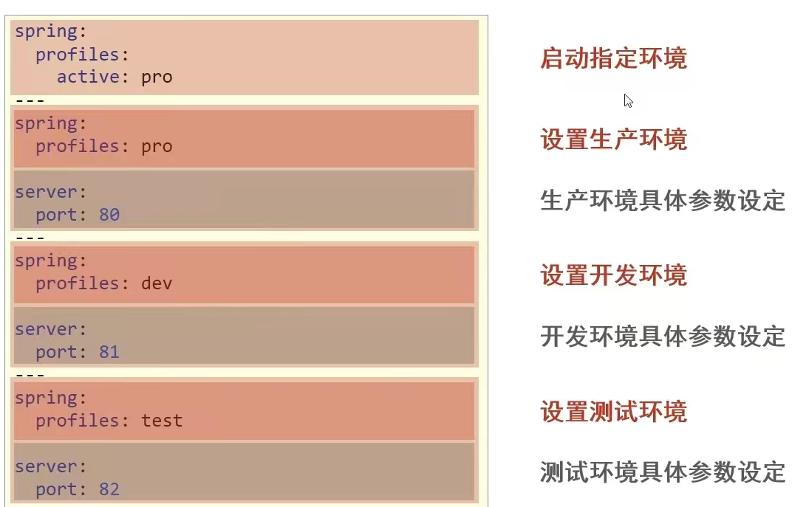

- **properties文件：**

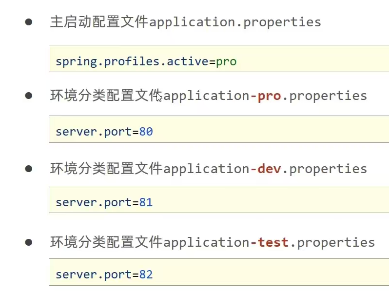

- **命令行形式（使用maven打包后的执行）：**

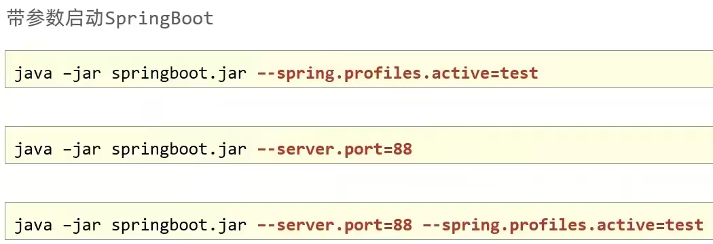

## Mybatis Plus：

### 使用步骤：

- 需要创建一个基本的Mapper层继承BaseMapper<T> T中表示传入于数据库表对应的类：

```java
@Mapper
public interface UserMapper extends BaseMapper<User> {

}
```


### 基本的CRUD：

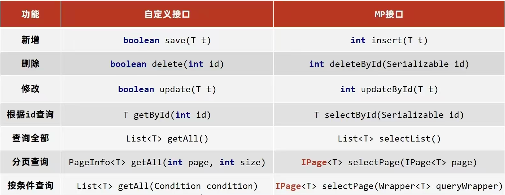

### Mybatis Plus拦截器：

- 拦截器是优化一些sql操作，例如分页功能等。

#### 分页拦截器：

1. 设置分页拦截器作为Spring管理的bean：

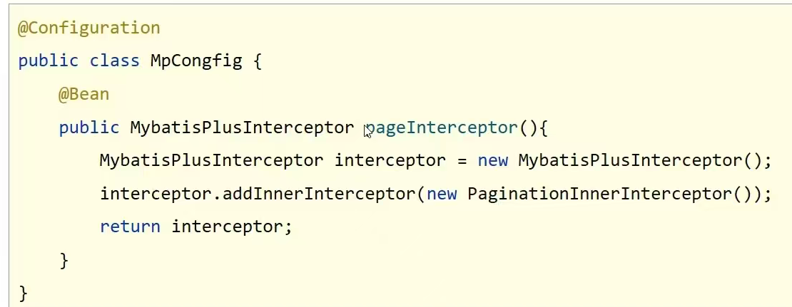

### 操作：

#### 格式：

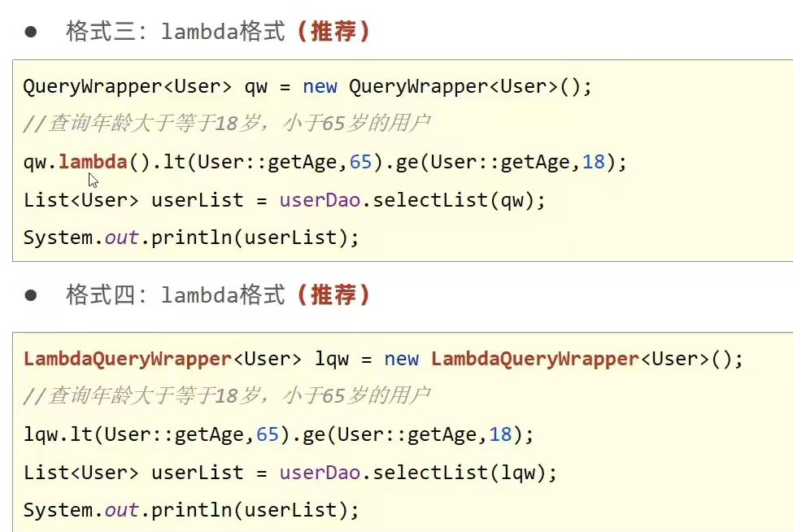

#### null值处理：

- 传入参数可能为null值的时候的处理：


#### 查询投影：

- 需要自定义返回字段，例如count等。


#### 条件查询：


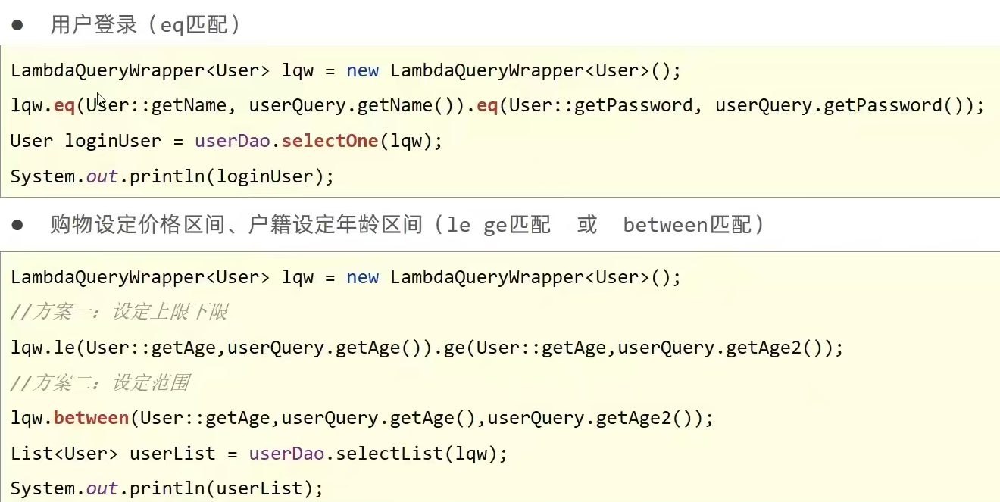

#### 多记录操作：


### 表与字段配置：

#### 表名与字段名映射：

- 当实体类中字段名和表名于数据库中的不一致的时候可以通过配置来映射。


1. 表名映射：@TableName("tb_user")
2. 字段映射：@TableField(value="pwd",select =false,exist = false)
   - 其中select是设置是否被查询出来（password字段可以设置为false），exist是表示数据库中是否存在这个字段。

#### id生成策略：

@TableId(type = IdType.AUTO)，其中type有以下策略：

- **AUTO(0):**使用数据库id自增策略控制id生成
- **NONE(1):**不设置id生成策略
- **INPUT(2):**用户手工输入id
- **ASSIGN ID(3):**雪花算法生成id(可兼容数值型与字符串型)
- **ASSIGN UUID(4):**以UUID生成算法作为id生成策略

#### 逻辑删除：

- 如果不想真正物理删除某个字段可以设置逻辑删除，用一个字段来表示是否删除：
- 使用@TableLogic指定当前字段为逻辑删除字段。

#### 全局配置：

- 一些配置可以通过在yml全局配置来简化代码：

```yml
mybatis-plus:
	global-config:
		db-config:
			id-type: auto #设置id生成策略
    		table-prefix: tbl_ #设置数据库表前缀
    		logic-delete-field: deleted #设置逻辑删除字段
    		logic-not-delete-value: 0 #未删除
    		logic-delete-value: 1 #删除
```


### 乐观锁：

- 一些可能会被多个用户同时访问的数据可以设置乐观锁：

1. 在数据库中添加标记字段version。
2. 实体中添加对应字段并在上面添加@Version注释。
3. 在config中配置乐观锁拦截器，实现锁机制对应的sql语句拼装。
4. 使用乐观锁机制在修改前必须先获取到对应数据的verion方可正常进行：


### 代码生成器：

- 通过预设的模板帮开发人员依据数据库生成controller、service、mapper模板代码。

- 导入坐标：

 ```java
 <dependency>
     <groupId>com.baomidou</groupId>
     <artifactId>mybatis-plus-generator</artifactId>
     <version>3.4.1</version>
 </dependency>
     <!--velocity模板引擎-->
 <dependency>
     <groupId>org.apache.velocity</groupId>
     <artifactId>velocity-engine-core</artifactId>
     <version>2.3</version>
 </dependency>
 ```

