# 八股

## 问题解决

### 会话跟踪：

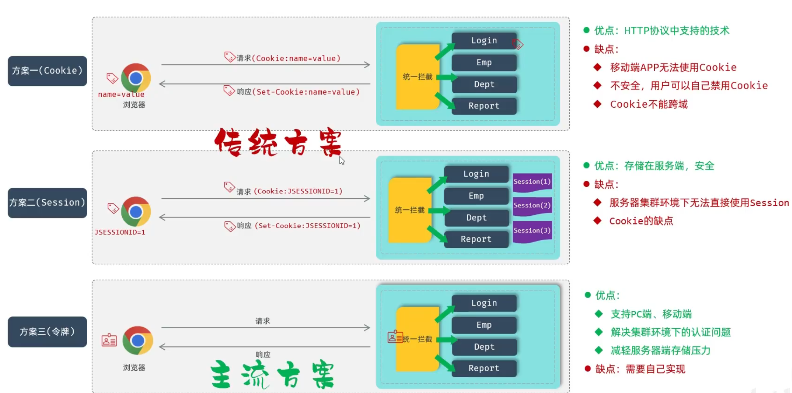


## SpringBoot：

### 配置优先级

- springboot配置的优先级是：命令行参数->java系统属性->application.properties->application.yml->application.yaml

### bean：

#### 作用域：

1. bean有五种作用域，其中singleton和prototype用的比较多，默认singleton，可以用@Scope注释来设置作用域。

2. singleton默认是在容器启动时创建bean，可以用@Lazy注释来延迟到第一次使用时创建。
3. 在controller、service、mapper这些层里面一般用singleton，因为这些都是无状态的bean（即是没有存放暂时数据），而如果要创建状态的bean最好就用prototype不然暂时存放的数据会不安全。

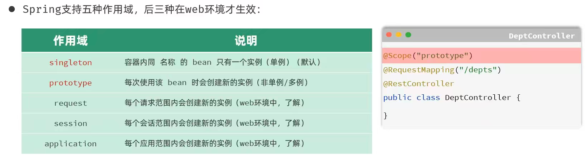

#### 第三方bean：

1. 如果要管理的bean对象来自于第三方(不是自定义的)，是无法用 Component及衍生注解声明bean的，就需要用到 @Bean注解。若要管理的第三方bean对象，建议对这些bean进行集中分类配置，可以通过Configuration注解声明一个配置类。

- 如果第三方bean需要依赖其它bean对象，直接在bean定义方法中设置形参即可，容器会根据类型自动装配。
- 通过@Bean注解的name或value属性可以声明bean的名称，如果不指定，默认bean的名称就是方法名。

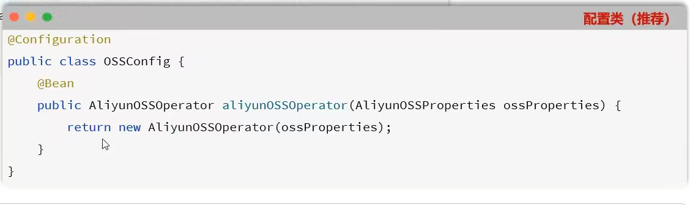

### 起步依赖：

- SpringBoot的起步依赖（依赖传递），将会以传递的方式把依赖都自动注入。

### 自动配置（详细可见黑马java-webai-144-147）：

#### 概念：

1. **what：**自动配置就是在使用第三方依赖的时候，可以直接通过@Autowire注入第三方类来使用。

- **实现方式一（很繁琐性能低）**：第三方工具都在类上使用@Component注释，然后在项目启动文件中使用@ComponentScan来扫描第三方包，默认只扫描启动文件目录下的包。在@ComponentScan中要同时加入自己项目的包名以及第三方包名。
- **实现方案二（@Import）:**在启动类中注入
  - @Import(TokenParser.class)——普通类：import具体的类
  - @Import(HeaderConfig.class)——配置类：import第三方的配置类批量引入
  - @Import(MyImportSelector.class)——ImportSelector实现类，批量导入
  - 如果第三方工具提供了EnableXXX注解类，可以直接注入这个注解，此注释里面包含了@Import(MyImportSelector.class)。

#### **底层原理（源码跟踪）：**

- @SpringBootApplication启动类注解：

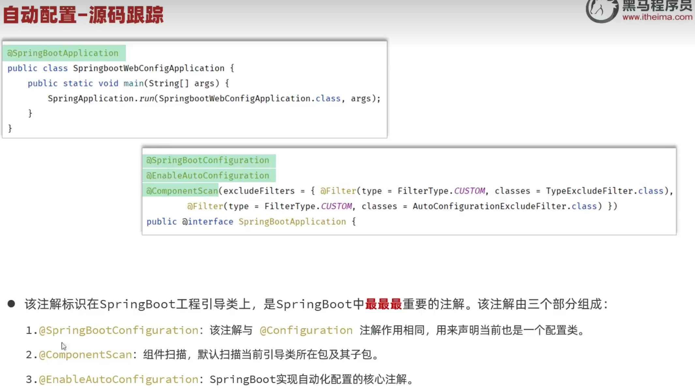

- @EnableAutoConfiguration自动化配置注解：

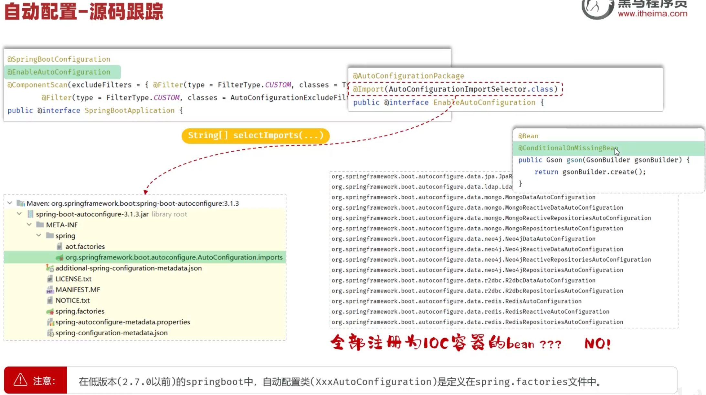

3. **根据具体情况自动创建bean——@Conditional（可用于类或者方法）：**

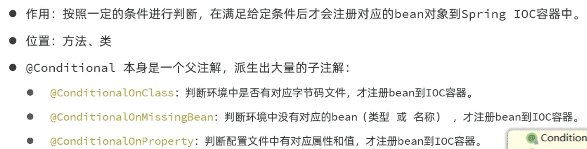

#### 自定义Starter：

- 场景:在实际开发中，经常会定义一些公共组件，提供给各个项目团队使用。而在SpringBoot的项目中，
  些公共组件封装为SpringBoot的starter(包含了起步依赖和自动配置的功能)。
- 其中starter中没有如何代码，只负责管理依赖，在你的springboot项目中引入starter后，autoconfiguration中的所有依赖都会传递进来，并且其中的bean也会进入到IOC容器。

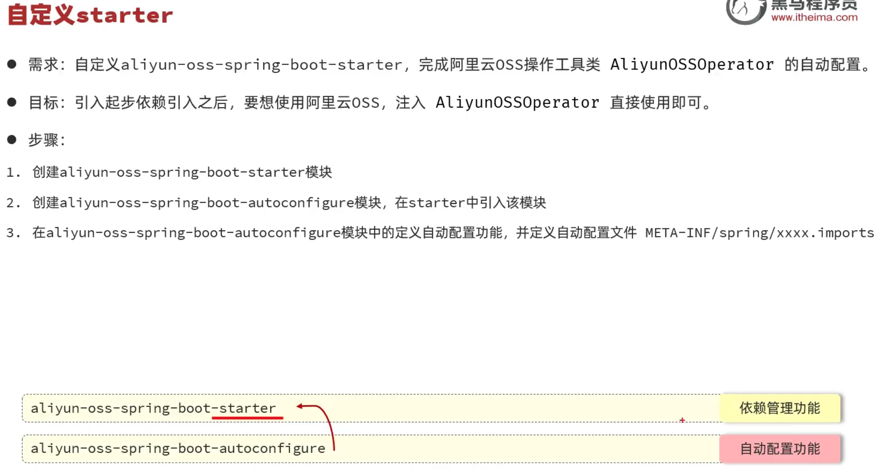

## Maven

### 分模块设计与开发：


- **what：**将项目按照功能模块/层拆分成若干个子模块。
- **why：**方便项目的管理维护、扩展，也方便模块间的相互引用，资源共享。
- **notice：**分模块设计需要先针对模块功能进行设计，再进行编码。不会先将工程开发完毕，然后进行拆分。
- **使用步骤：**新建maven模块然后将模块抽离出去，最后在其他模块中的pom文件中引入。

### 继承与聚合：

#### 继承

- **概念:**继承描述的是两个工程间的关系，与java中的继承相似，子工程可以继承父工程中的配置信息，常见于依赖关系的继承。
- **步骤一：**创建maven模块project-parent，该工程为父工程（只需要留下pom文件），设置打包方式pom(默认jar)，父工程中要继承spring-boot-starter-parent。
  - jar:普通模块打包，springboot项目基本都是jar包(内嵌tomcat运行)
  - war:普通web程序打包，需要部署在外部的tomcat服务器中运行
  - pom:父工程或聚合工程，该模块不写代码，仅进行依赖管理
- **步骤二：**在子工程的pom.xml文件中，配置继承关系（注意要配置相对路径）。
- **步骤三：**在父工程中配置各个工程共有的依赖(子工程会自动继承父工程的依赖)。

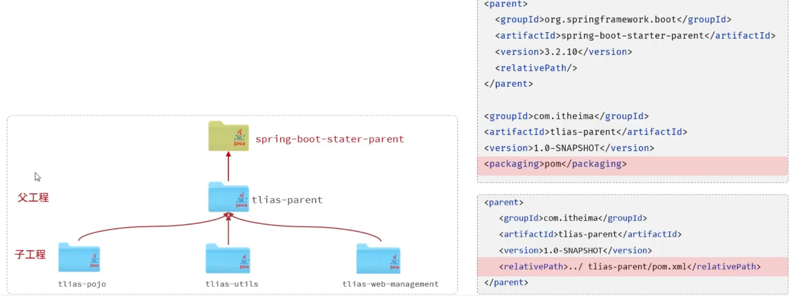

#### 版本锁定

- 在maven中，可以在父工程的pom文件中通过<dependencyManagement>来统一管理依赖版本，子工程在引入此依赖时就不用再规定版本了。
  - <dependencies>是直接依赖，在父工程配置了依赖，子工程会直接继承下来**——**如果所有子工程都用了这个依赖建议直接在父工程引入。
  - <dependencyManagement>是统一管理依赖版本，不会直接依赖，还需要在子工程中引入所需依赖（无需指定版本）**——**如果只是部分子工程用了同一个依赖建议只统一管理版本。
- 如果管理的版本太多了，可能会不方便找到对应依赖，因此可以用到**自定义属性**来将版本统一写在properties中：

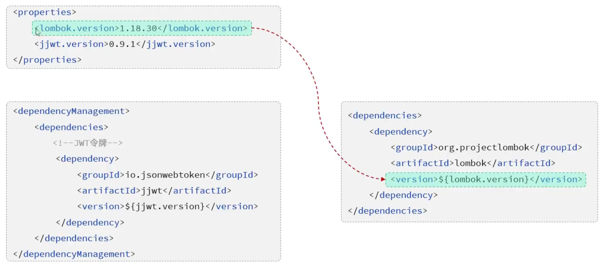

#### 聚合

- **why：**在分模块开发之后，如果要执行最终模块，就需要先把前面依赖的所有模块都install这个操作很繁琐——聚合就是将多个模块组织成一个整体，同时进行项目的构建。
- **聚合工程：**一个不具有业务功能的“空”工程(有且仅有一个pom文件)——这跟父模块很像，所以一般父模块也是聚合模块。
- **实现：**maven中可以通过<modules>设置当前聚合工程所包含的子模块名称（聚合工程中所包含的模块，在构建时，会自动根据模块间的依赖关系设置构建顺序，与聚合工程中模块的配置书写位置无关。）

```java
<modules>
    <module> ../tlias-pojo </module>
</modules>
```

- **聚合与继承：**
  - **联系:**继承与聚合都属于设计型模块，打包方式都为pom，常将两种关系制作到同一个pom文件中。
  - **区别:**继承用于简化依赖配置、统一管理依赖版本，是在子工程中配置继承关系；聚合用于快速构建项目，是在父工程(聚合工程)中配置聚合的模块。

### 私服

- **why：**当一个项目分为多个团队开发，那么其中一个团队开发出来的功能想要共享给其他团队，就可以上传到公司的私服中，其他团队就可以通过maven引入这个板块了。

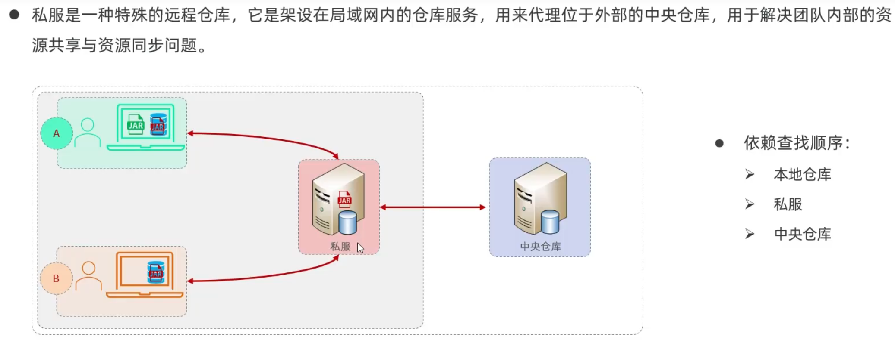

- **实现（可以在黑马javaweb飞书中看到具体实现）：**
  1. 设置私服的访问用户名/密码(settings.xml中的servers中配置)
  2. IDEA的maven工程的pom文件中配置上传(发布)地址
  3. 设置私服依赖下载的仓库组地址(settings.xml中的mirror中配置）
  4. 配置可以下载快照版本（默认只能下载release版本）

## Linux：

### 基本操作：

#### 目录结构：

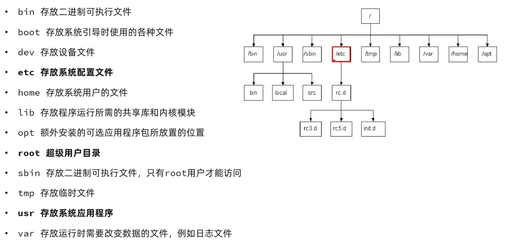

#### 常用语法

[Linux语法](https://wlybsy.blog.csdn.net/article/details/105289038?fromshare=blogdetail&sharetype=blogdetail&sharerId=105289038&sharerefer=PC&sharesource=qq_63113215&sharefrom=from_link)

1. Vim文件编辑：

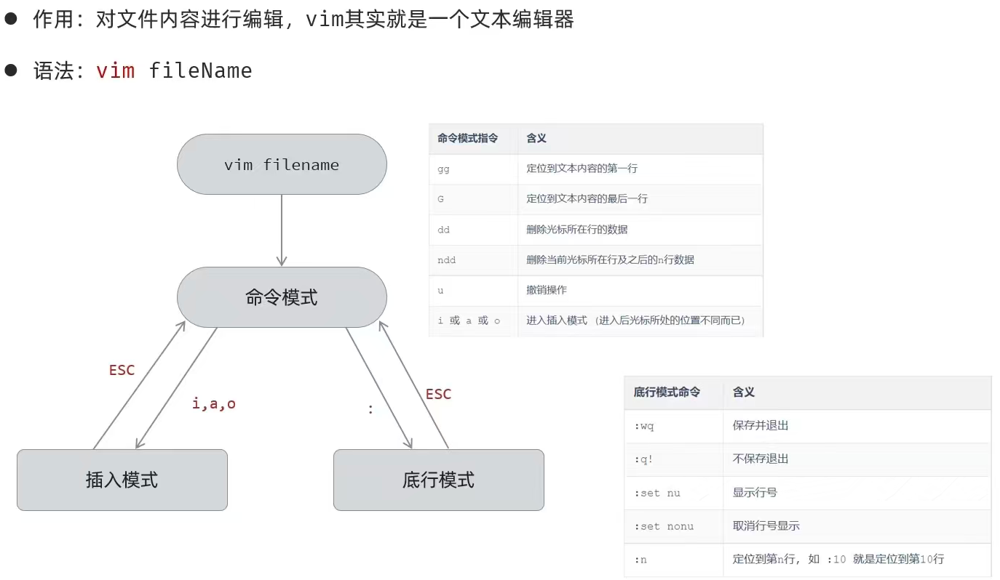

