# 前端开发

**HTML+CSS+JavaScript：** 三者的各自的作用。

**js 和 json 文件的转换：**

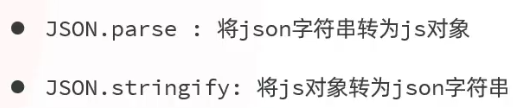

## DOM 操作：实际上就是把 HTML 中的标签全部看作是对象。

​		1.获取 DOM 对象：document.querySelector（‘选择器’）获取第一个对象，document.querySelectorAll（’选择器’）获取全部对象。 

​		2.事件监听：

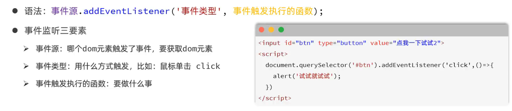

​		3.模块化：

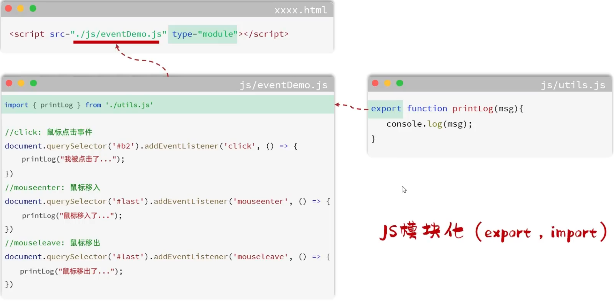

## Vue：

### **常用指令：**

​			a.插值表达式不能出现在标签中，需要用 v-bind 来绑定。

​			b.v-show （会渲染所有选项，用CSS属性控制哪些不显示）适合用到经常切换的元素，v-if （只会渲染true选项）适合用到渲染一次的元素中。

​			c.数据是由vue的data中返回，而点击事件则是由与data平级的method来返回。

​			d.v-bind可以用:省略,v-on可以用@省略.

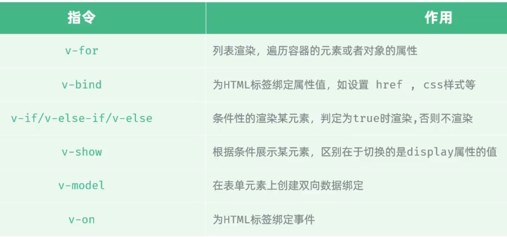

### **生命周期：**

- 生命周期可以在data和method评级的地方创建，常用mounted来定义页面加载完成时请求后端的。

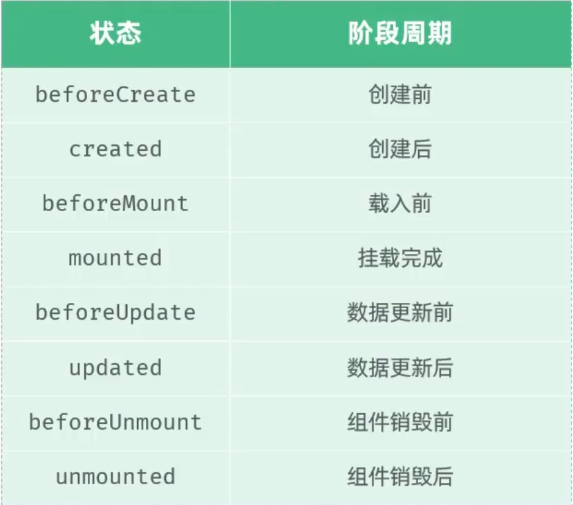

### 项目结构：

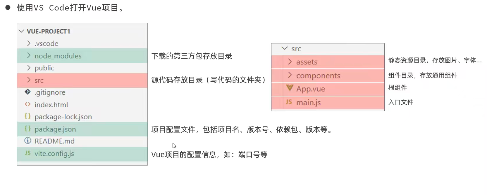

### 创建流程：

- 创建：npm create vue@版本号
- 安装依赖：npm install
- 启动：npm run dev

### 开发流程

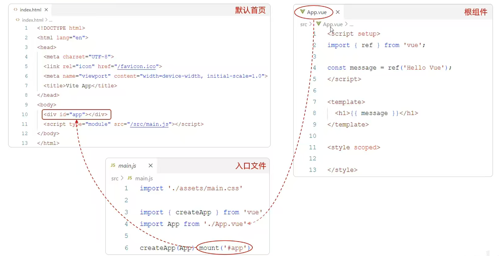

### API风格

- **选项式API：**可以用包含多个选项的对象来描述组件的逻辑，如:data，methods，mounted等。选项定义的属性都会暴露在函数内部的this上，它会指向当前的组件实例。
- **组合式API（大项目更推荐）：**是vue3提供的一种基于函数的组件编写方式，通过使用函数来组织和复用组件的逻辑。它提供了一种更灵活、更可组合的方式来编写组件。在组合式API使用时，是没有this对象的。

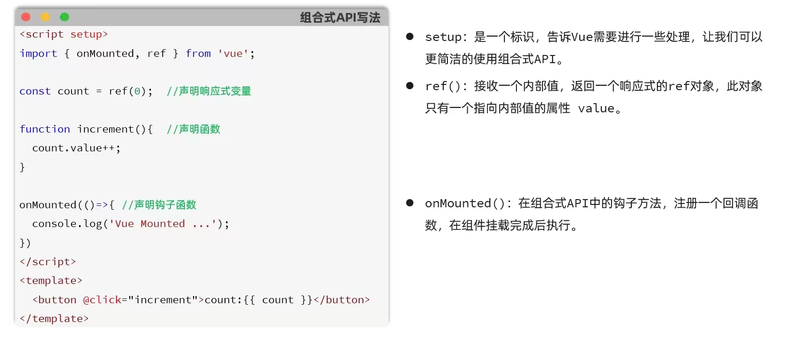

### Element Plus

- **why：**是饿了么团队研发的，基于vue3，面向设计师和开发者的组件库。
- **使用方法：**
  1. 在当前工程目录下：npm install element-plus@2.4.4 --save。
  2. 在main.js中引入ElementPlus组件库（参照官方文档）。
  3. 访问Element官方文档复制组件代码。

### Router路由

●组成:
> Router实例:路由实例，基于createRouter函数创建，维护了应用的路由信息
> 	<router-link>:路由链接组件，浏览器会解析成<a>。
> 	<router-view>:动态视图组件，用来染展示与路由路径对应的组件。

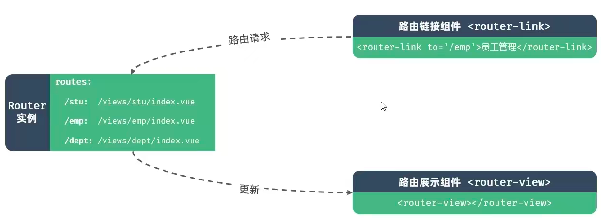

- 嵌套路由：

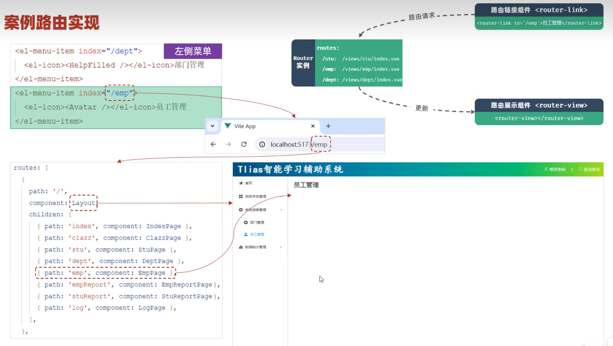

### Watch侦听：

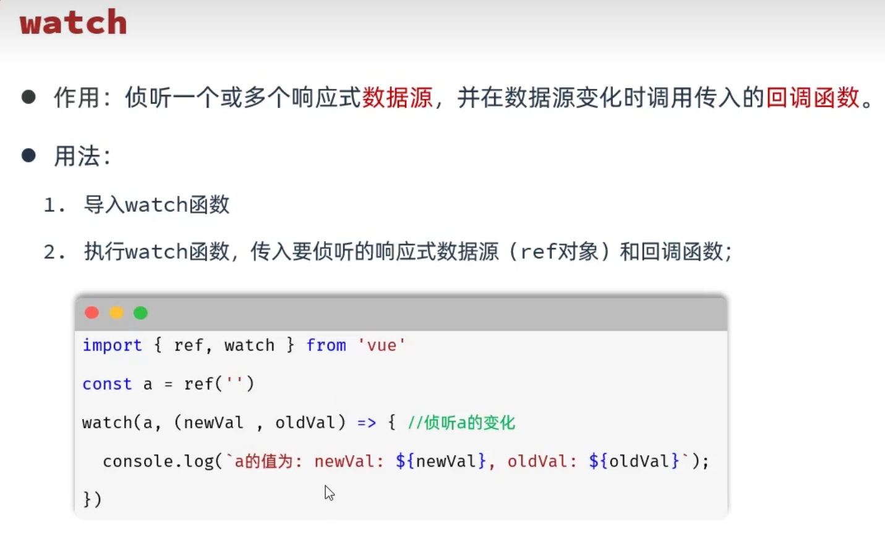

- 如果要侦听的是对象，要在结尾加上（deep：true）**深度侦听**。

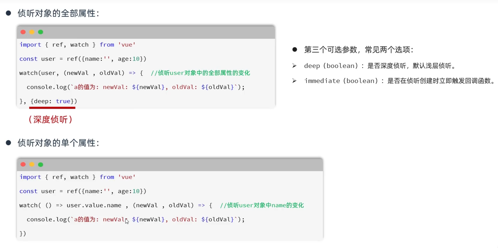

## Ajax：(做到异步对网页进行操作)

### **使用方法:**

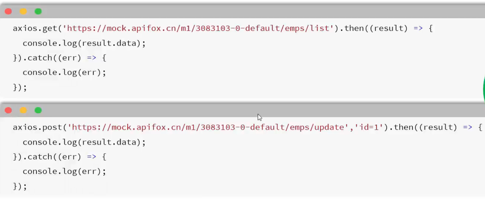

### **async&await:(将异步操作改为同步)**

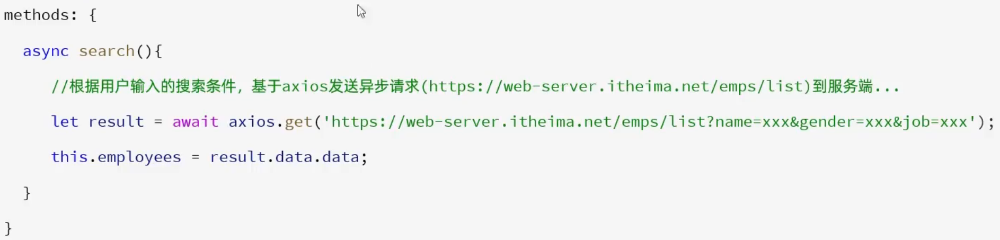

### 程序优化

#### Response响应拦截器

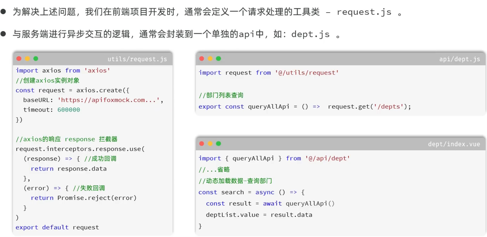

#### baseURL优化（反向代理）：

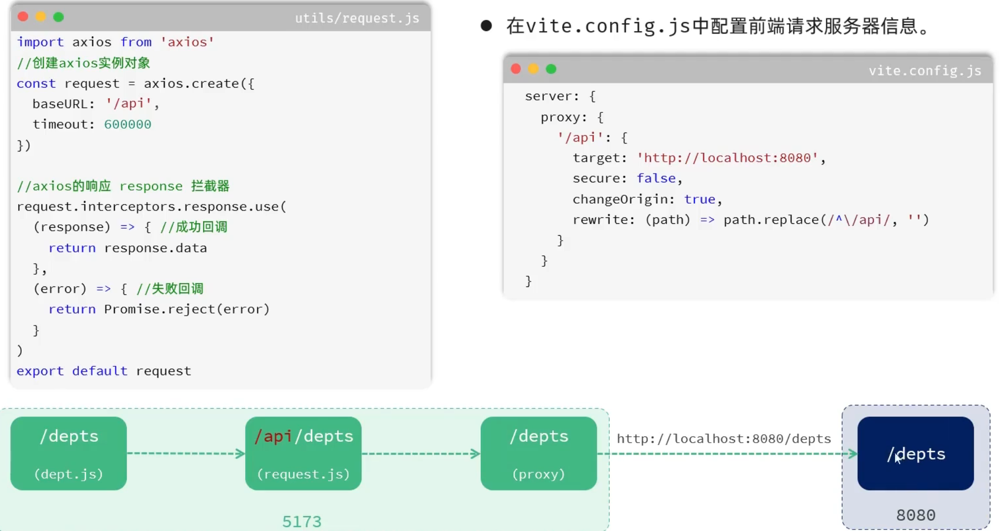

#### Request请求拦截器：

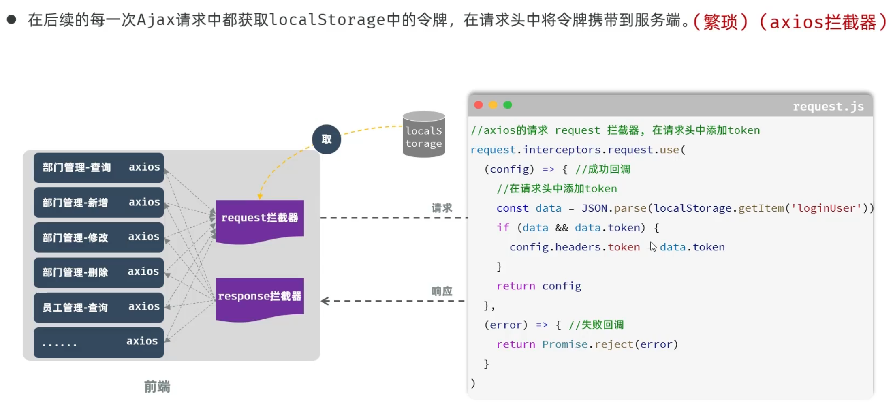

## 功能实现：

### 表单校验：

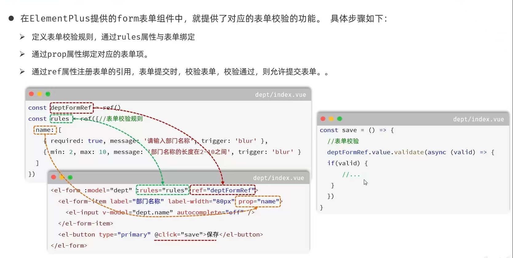

### LocalStorage存储信息

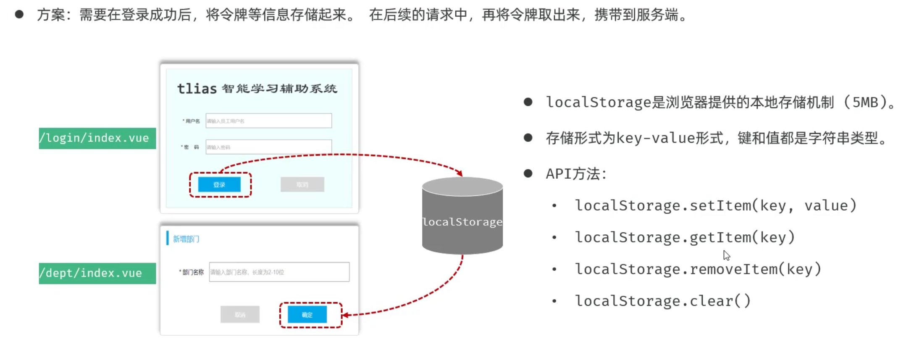

## 打包部署：

### 前端项目打包部署

1. 前端项目的打包部署
   - 打包:运行 build --->dist
   - 部署:将dist目录下的打包好的文件--->nginx/html 目录中
   - nginx命令:
     - 启动:nginx.exe
     - 重载:nginx.exe -s reload
     - 停止:nginx.exe -s stop
