# 汇总：

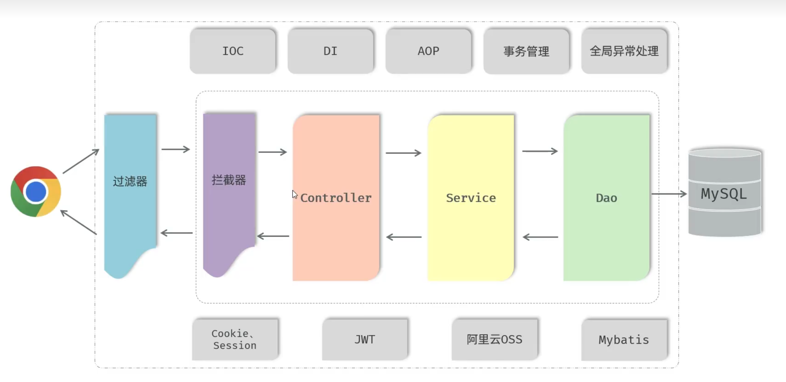

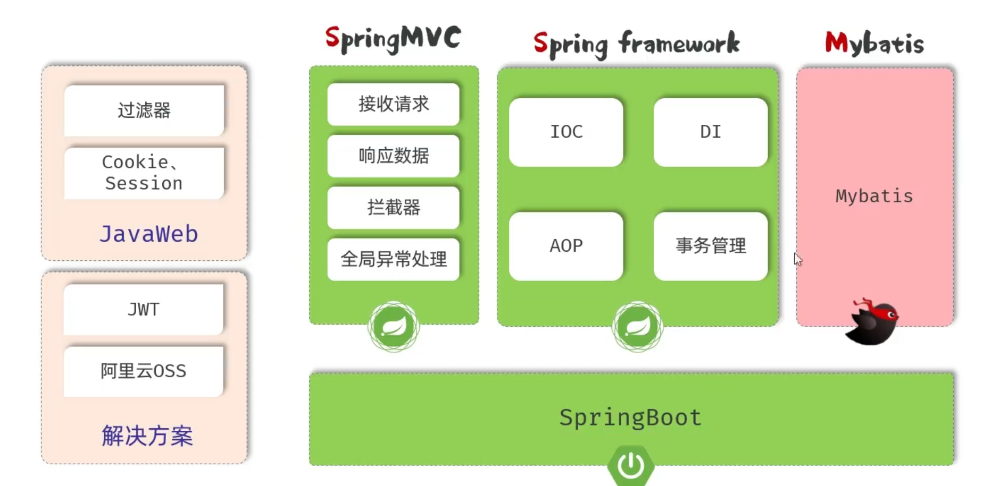

# 分层解耦

1.将项目中的类交给 IOC 容器管理（IOC 容器反转），应用程序运行时需要的对象直接依赖容器为其提供（DI 依赖注入）。

2.主要使用@component 和@Autowired 两个注解，使用@component 注解需要实例化的类，使用@Autowired 来自动注入依赖的类对象（这样就不用定义对象时，new 此对象，直接定义接口，对象如果修改不会影响使用实现了解耦）。

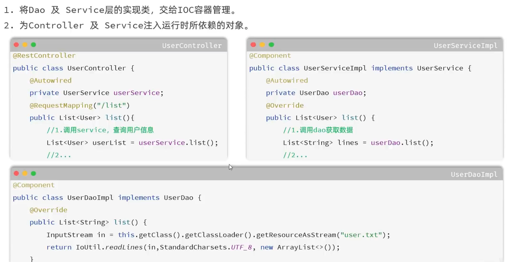	3.@component 来声明 bean 比较宽泛，在 spring-boot 框架中有以下更好的注解方式，其中 controller 的 bean 只能由@Controller 注解：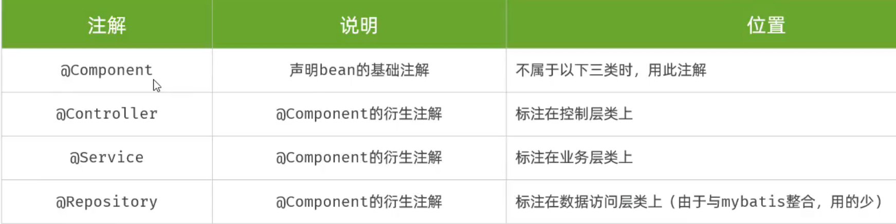	4.当一个接口被多个类继承时，@Autowired 注入的类需要用以下三种方法：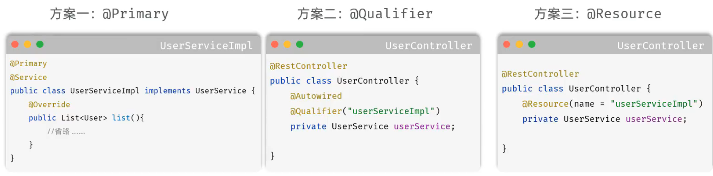

# 规范：

## Restful 风格

  这是为了 url 更加规范，开发的时候更加统一，用 url 来规定范围，用请求方式来规定操作。

  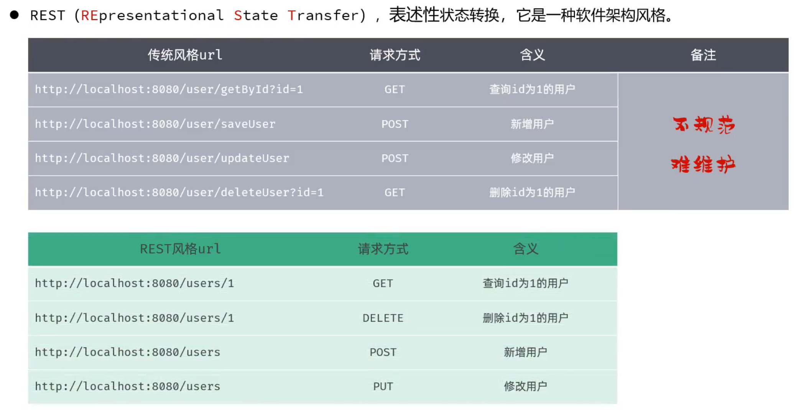

## 日志

  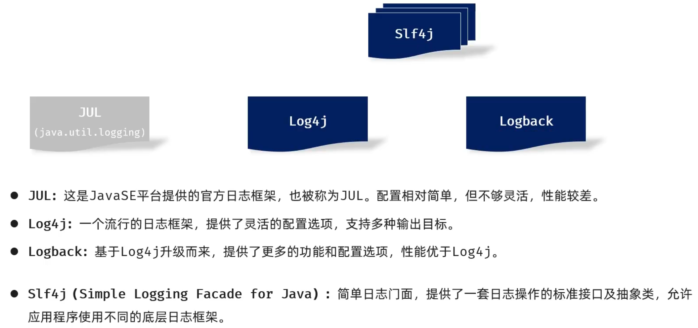

  ​	1.使用方法：需要引入 Logback 依赖（springboot 已经包含），以及 Logback.xml，然后再类中声明一个 Logger 对象（或者直接再 controller 上加一个@Slf4j），就可以调用一些日志级别：

  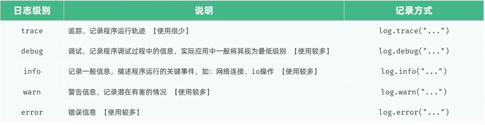

  

---

  

# Mapper 相关

## 结果封装

  1.因为在数据库中的字段名和 java 开发中实体中的字段名不一样，所以需要用以下方法封装结果。

  方法一：

```java
  @Results({
    	@Result(column="create_time",property ="createTime")
      @Result(column ="update_time",property = "updateTime")
  })
  @Select("select id, name, create_time, update_time from dept order by update time desc")
  List<Dept> findAll();
```

  方法二：直接在 sql 语句中起别名

```java
  @Select("select id,name,create_time createTime,update_time updateTime from dept order by update_time desc")
```

  

  **方法三（推荐）**：在配置文件中配置开启驼峰命名：

```java
  mybatis:
    configuration:
      map-underscore-to-camel-case: true # 开启驼峰命名
```

## 主键返回

  1.在保存数据时有时候需要为一张表保存另一张表的主键，因此需要主键返回。

```java
  //在EmpMapper中先执行插入员工信息操作
  //然后需要再在EmpExprMapper中插入员工工作经历（需要于员工id绑定），因此需要主键返回
  
  //EmpMapper：
  @Options(useGeneratedKeys = true,keyProperty = "id")//获取自增ID
  @insert(...)
  public void insert(Emp emp);
  //service：
  public void save(Emp emp) {
      empMapper.insert(emp);
      List<EmpExpr> exprList = emp.getExprList();
      if(!CollectionUtils.isEmpty(exprList)){
          exprList.forEach(expr -> {// 设置员工ID
              expr.setEmpId(emp.getId());
          });
          empExprMapper.insertBatch(exprList);
      }
  }
  //EmpExprMapper：
  @insert(...)
  void insertBatch(List<EmpExpr> exprList);
```

  

---

  

# Controller 相关

## 接收前端传来的参数

  ​	1.接收 url 中传入的参数：

  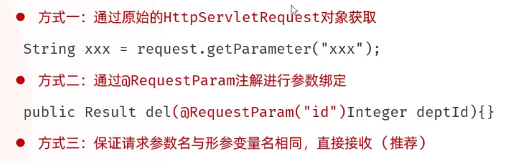

```java
  //方法一不推荐使用，此为方法二
  //如果value值和后面定义的形参相同可以省略@RequestParam
  //默认required=true，在默认情况下前端必须传参
  @DeleteMapping()
  public Result delete(@RequestParam(value = "id",required = false) Integer id) {
      System.out.println("删除部门数据：" + id);
      deptService.deleteById(id);
      return Result.success();
  }
```

  ​	2.接收 json 传来的实体类：

```java
  //接收json格式传来的实体类，需要@RequestBody注释
  @PostMapping()
  public Result add(@RequestBody Dept dept) {
      System.out.println("添加部门数据：" + dept);
      deptService.add(dept);
      return Result.success();
  }
```

  ​	3.获取路径参数：

```java
  //需要用到@PathVariable这个注释，如果注释中的值和形参相同，可以省略注释括号的内容
  @GetMapping("/{id}")
  public Result get(@PathVariable("id") Integer id) {
      System.out.println("查询部门数据：" + id);
      Dept dept = deptService.findById(id);
      return Result.success(dept);
  }
```

  ​	4.如果需要设置默认值，可以使用@RequestParam(defaultValue = "1")：

```java
  @GetMapping()
      public Result page(@RequestParam(defaultValue = "1") Integer page,@RequestParam(defaultValue = "10") Integer pageSize){
          log.info("分页查询员工数据，参数：page={}，pageSize={}" ,page, pageSize);
          PageResult<Emp> pageResult = empService.page(page, pageSize);
          return Result.success(pageResult);
      }
```

  ​	5.如果是接收文件，则需要用MultipartFile定义形参接收（且名字要去前端一样，不然就要使用@RequestParam）。

  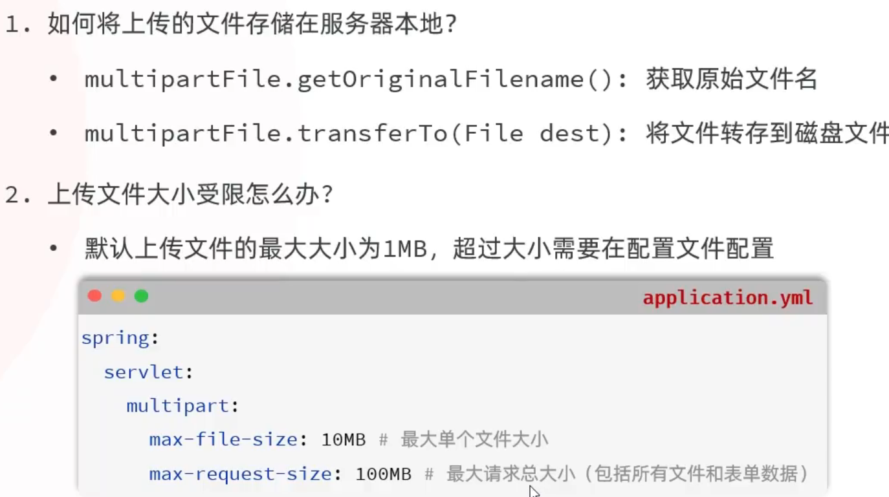

  ​	6.如果传入参数很多，可以定义一个实体类接收，类中变量名要与传参对应。

  ​	7.如果接收的是一个数组参数，则可以直接用数组接收也可以用集合List接收，推荐用List接收，在使用List接收时必须加上@RequestParam。

  

## 规定 controller 接收的请求方式

  1.方法一：直接在@RequestMapping 中设置 method = RequestMethod.GET 或其他的。

  2.方法二：直接改用@Get/Delete/PutMapping。

  3.如果在 controller 类中定义了@RequestMapping 且定义了一个路径，类中的方法的注释不需要把路径写完只用写@RequestMapping 中路径后面部分。

  

---

  

# 功能相关

## Nginx 反向代理

  反向代理可以让用户只用访问 Nginx 代理服务器就可以请求到数据，更加灵活可以同时代理多个服务器。

  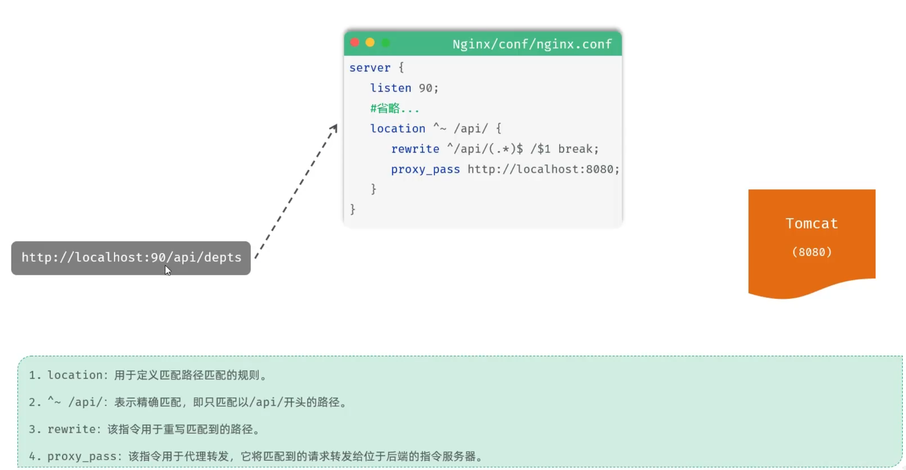

## PageHelper分页

- 通过自动改造Sql语句来实现分页查询。

  ​	1.需要导入依赖：

```java
  <dependency>
  <groupId>com.github.pagehelper</groupId>
  <artifactId>pagehelper-spring-boot-starter</artifactId>
  <version>1.4.7</version>
  </dependency>
```

  ​	2.在Mapper层中定义sql语句只需要将数据查出来不需要再sql语句中分页：

```java
  //原版：
  @Select("select count(*) from emp e left join dept d on e.dept_id = d.id")
  public Long count();
  @Select("select e.*,d.name deptName from emp e left join dept d on e.dept_id = d.id " + "order by e.update_time desc limit #{start},#{pageSize}")
  public List<Emp> list(@Param("start") Integer start, @Param("pageSize") Integer pageSize);
  //pagehelper版：
  @Select("select e.*,d.name deptName from emp e left join dept d on e.dept_id = d.id order by e.update_time desc")
  public List< Emp> list();
```

  ​	3.再Service层中使用PageHelper：

```java
  @Override
  public PageResult<Emp> page(Integer page, Integer pageSize) {
      PageHelper.startPage(page,pageSize);//开始分页
      List<Emp> empList = empMapper.list();
      Page<Emp> p = (Page<Emp>)empList;//获取分页数据
      return new PageResult<Emp>(p.getTotal(), p.getResult());
  }
```

  ​	4.实现机制：先拦截sql，然后分两步，第一步记录总数，第二部分页查询然后把数据封装给Page<T>。

  ​		注意：- 在使用PageHelper中sql结尾不能加‘,’因为PageHelper会直接对sql改造所以不能加。

  ​			    - PageHelper仅仅能对紧跟在其后的第一个查询语句分页查询。

  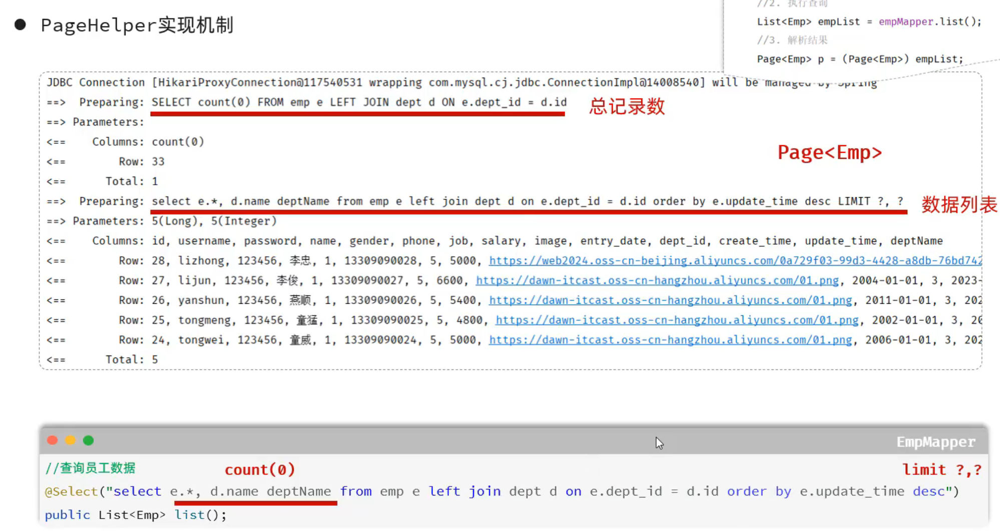

## Spring事务管理

  1.如果在一个业务方法中多次操作了数据库，可以在这个方法前加一个@Transactional注解，这样会自动实现事务的开始提交回滚。

  - rollbackFor属性用于控制出现何种异常类型，回滚事务。(默认情况下，只有出现RuntimeException才会回滚)
  - 如果在一个方法中，开启事务且用到try-final，出现异常final中的内容是会执行的，但如果final中执行了sql语句，这里面的sql语句也会被rollback，因此要使用事务的嵌套，为final中的方法另外开启一个事务且使用到propagation属性，包含以下常用属性：
    - REQUIRED:大部分场景
    - REQUIRES NEW:希望两个方法在独立的事务中运行，互不影响

  2.事务四大特性（ACID）：

  - 原子性：事务是不可分割的最小单元，要么全部成功，要么全部失败。
  - 一致性：事务完成时，必须使所有的数据都保持一致状态。
  - 隔离性：数据库系统提供的隔离机制，保证事务在不受外部并发操作影响的独立环境下运行 。
  - 持久性：事务一旦提交或回滚，它对数据库中的数据的改变就是永久的。

3.事务相关配置：

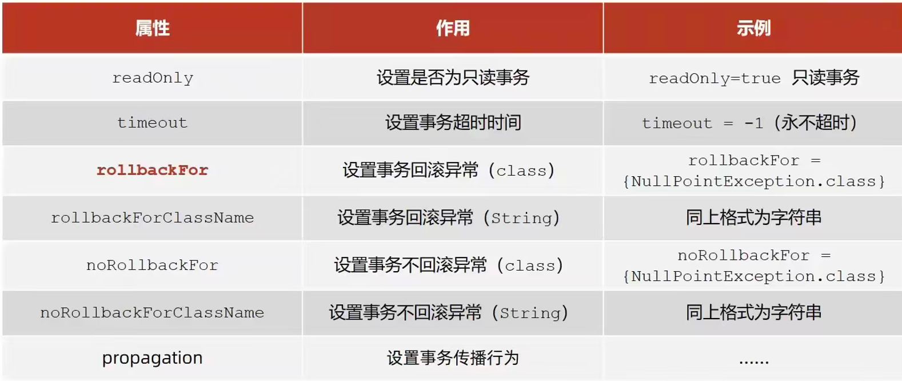

4.事务传播行为：

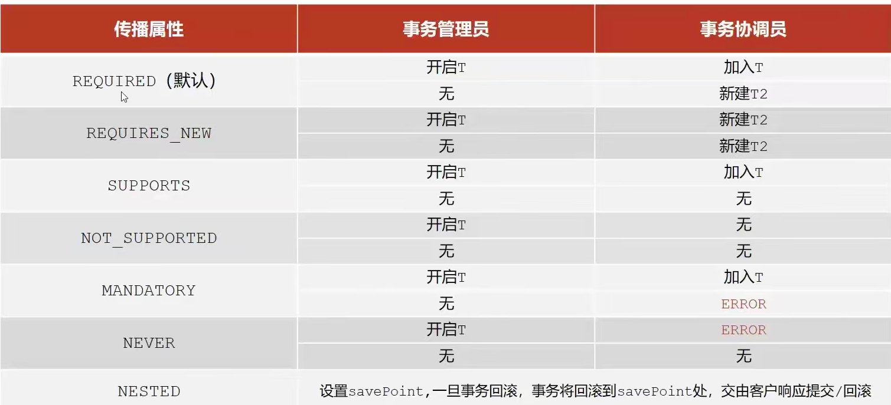

## 配置文件参数引用

  1. 一些可能会改变的参数，可以保存在yml配置文件里面，然后用@Value（前缀）来引用：

  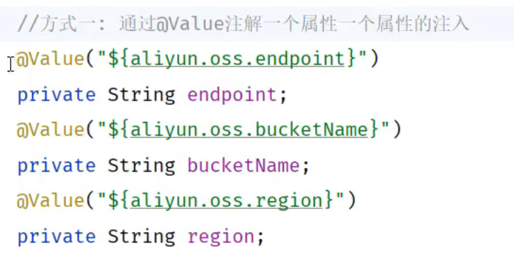

  2. 如果属性比较多的话可以封装在一个实体类中，使用@Component把他交给容器管理（使用时只需要用@Autowired注入）然后用@ConfigurationProperties（prefix=“前缀”）来于yml文件绑定，其中变量名要与yml中的变量名一样：

  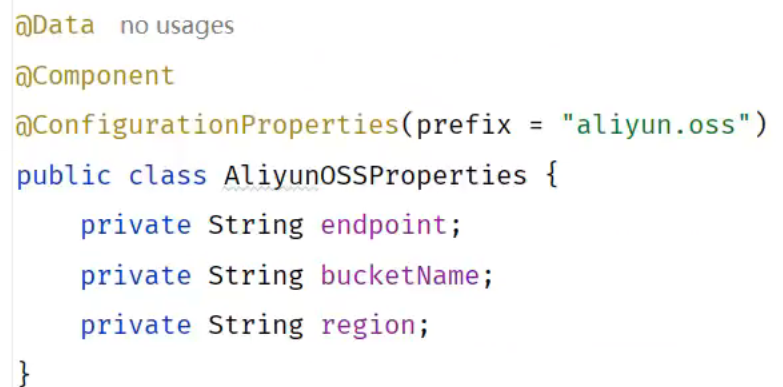

  3. 如果属性较少，建议@value注入即可，如果属性较多，考虑复用，建议使用@configurationProperties

  

## 全局异常处理

  1. 全局异常处理需要两个关键的注释**@RestControllerAdvice**和**@ExceptionHandler**，其中@RestControllerAdvice=@ControllerAdvice+@ResponseBody（方法的返回值直接响应给前端）；@ExceptionHandler声明是个全局异常处理方法。
  2. 如果需要处理特定的错误则需要方法接收特定的错误类型，如下面代码中，DuplicateKeyException是Exception的一个子错误，在触发错误时优先执行子错误方法。

```java
  @Slf4j
  @RestControllerAdvice
  public class GlobalExceptionHandler {
      @ExceptionHandler
      public Result handleException(Exception e){//方法形参中指定能够处理的异常类型
          e.printStackTrace();//打印堆栈中的异常信息
          //捕获到异常之后，响应一个标准的Result
          return Result.error("对不起,操作失败,请联系管理员");
      }
      @ExceptionHandler
      public Result handleDuplicateKepException(DuplicateKeyException e){
          log.error("程序出错了",e);
          String message = e.getMessage();
          int index = message.indexOf("Duplicate entry");
          String errMsg = message.substring(index);
          String[] arr = errMsg.split(" ");
          return Result.error(arr[2] +"操作失败,该数据已存在");
      }
  
  }
```

## 登录、身份验证

### Session

- Session被内容被保存在服务器端，他是基于Cookie的前端的Cookie中会携带JSESSIONID，然后通过这个ID可以查到服务端保存的Session，在拦截器中有以下常规用法：

```java
public boolean preHandle(HttpServletRequest request, HttpServletResponse response, Object handler) throws Exception {
//根据当前HTTP请求中携带的JSESSIONID，从服务器的 session 存储中查找并返回对应的 HttpSession 对象。
    HttpSession session = request.getSession();
//从刚才拿到的、属于当前用户的session中，取出 key 为 "user" 的那个对象。
    Object user = session.getAttribute("user");
    if (user == null) {
        // 没有，需要拦截，设置状态码
        response.setStatus(401);
        // 拦截
        return false;
    }
    UserHolder.saveUser((User) user);
    // 有用户，则放行
    return true;
}
```

### JWT令牌

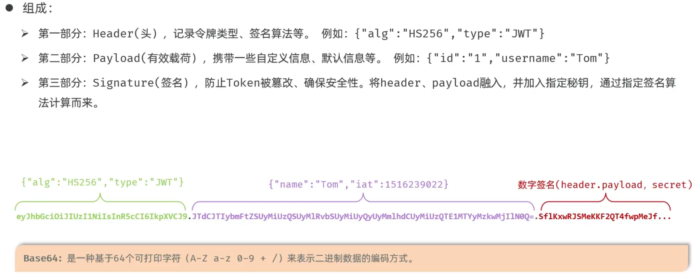

- 生成令牌：

```Java
@Test
public void testGenJwt() {
    Map<String, Object> claims = new HashMap<>();
    claims.put("id", 10);
    claims.put("username", "itheima");
    String jwt = Jwts.builder().signWith(SignatureAlgorithm.HS256, "aXRjYXN0")//指定加密算法和密钥
        .addClaims(claims)//添加自定义信息
        .setExpiration(new Date(System.currentTimeMillis() + 12 * 3600 * 1000))//设置有效时间
        .compact();//生成令牌
}
```

- 解析令牌：

```Java
@Test
public void testParseJwt() {
    Claims claims = Jwts.parser().setSigningKey("aXRjYXN0")//指定密钥
        .parseClaimsJws(token)//解析令牌
        .getBody();//获取自定义信息
    System.out.println(claims);
}
```

### Filter过滤器：

1.  因为当用户进入某个url时需要判定他是否有token，用户不能随意进入，如果在每个url下都进行一次判定就太麻烦了，因此使用filter过滤器来定义用户访问某些url的拦截操作。

- 记得最后要在doFilter方法中使用chain.doFilter放行。
- Filter放行后访问对应资源，资源访问之后还会回到Filter中执行放行后的逻辑，然后再响应到浏览器。
- 可以有多个Filter，chain.doFilter是放行到下一个过滤器，过滤器是通过类名来排序哪个先执行。

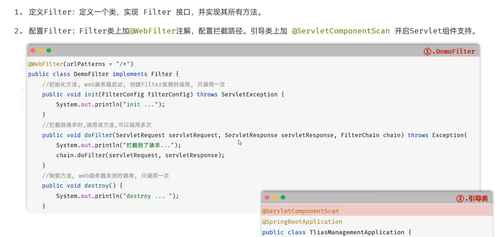

### Interceptor拦截器：

- 他跟Filter的作用差不多，如果同时有会先执行Filter。Filter范围更广他适用于整个项目，而Interceptor适用于springboot项目。

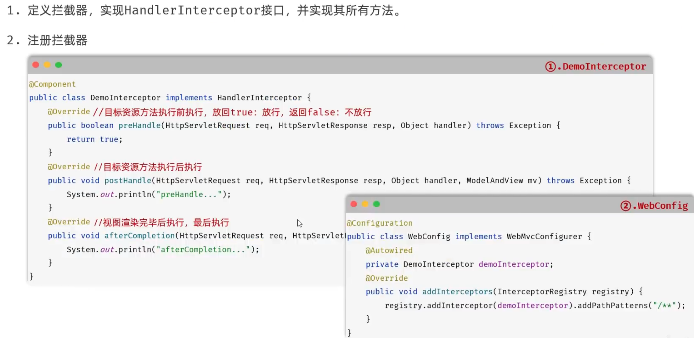

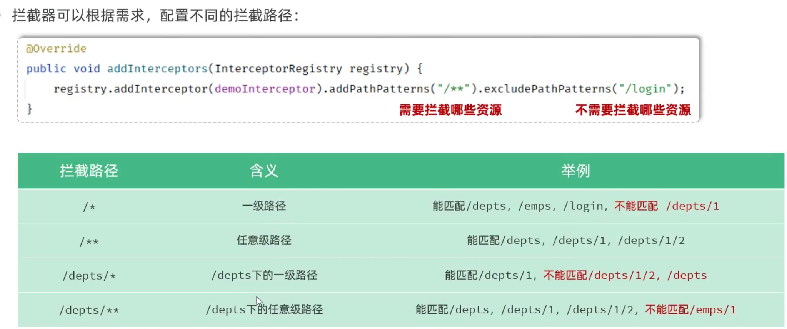

- 可以在注册拦截器时使用.order()来定义拦截器的优先级，数字越小越先执行。

## AOP面向切面编程：

0. **why：**首先要弄清楚为什么要用AOP，因为有些功能比如统计方法用时，如果在每个方法中都进行统计，那就太麻烦了，所有用到AOP把这些方法所共用的功能整合到AOP方法中，使实现起来更加简便，逻辑性也强。

1. **AOP使用步骤：**分为两步，先要引入依赖，然后定义AOP方法并且@Aspect和@Component注释。其中@Around注释中定义了哪些方法会执行AOP方法。下面介绍一些概念：

- 连接点:JoinPoint，可以被AOP控制的方法(暗含方法执行时的相关信息）。
- 通知:Advice，指那些重复的逻辑，也就是共性功能(最终体现为一个方法)。
- 切入点:PointCut，在连接点中被AOP方法实际控制的方法。
- 切面:Aspect，描述通知与切入点的对应关系(通知+切入点)。
- 目标对象:Target，通知所应用的对象。

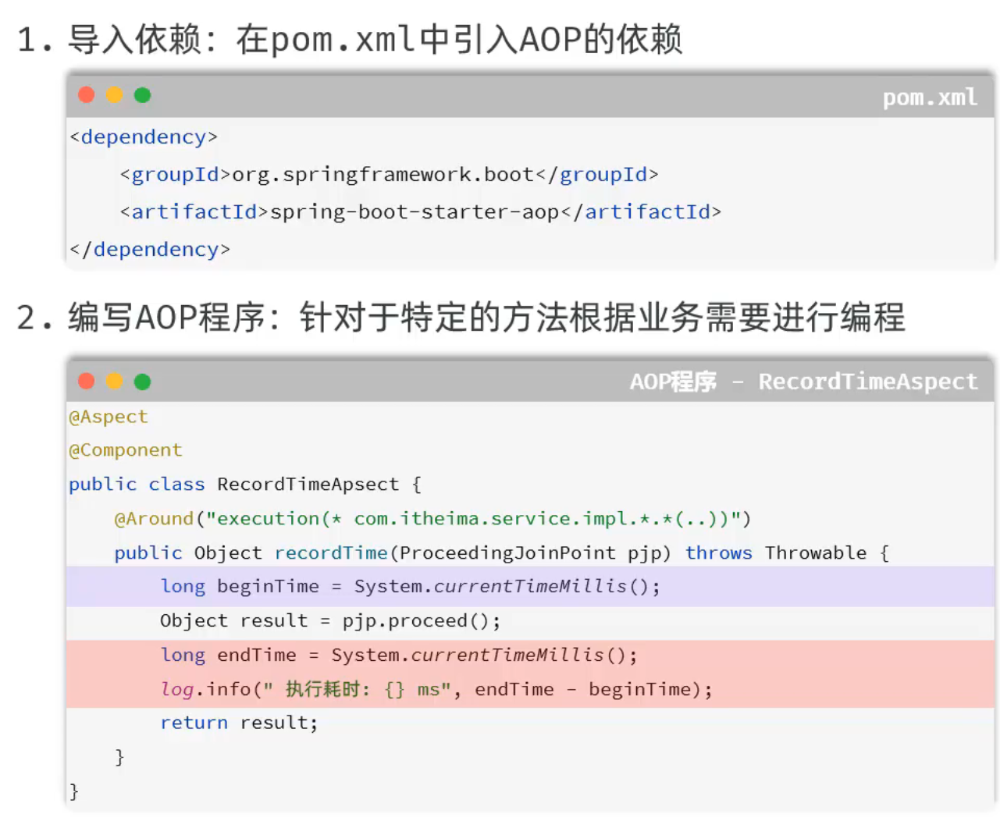

2. **底层逻辑：**AOP的底层是通过动态代理实现的，AOP会对目标对象生成代理对象，在代理对象中不仅执行目标对象的方法还要执行AOP类中所定义的方法，然后将代理对象放到容器中，controller在实际调用时调用的是代理对象。下面介绍一些不同注解：

- **@Around:**环绕通知，此注解标注的通知方法在目标方法前、后都被执行
  - @Around环绕通知需要自己调用 ProceedingJoinPoint.proceed()来让原始方法执行，其他通知不需要考虑目标方法执行
  - @Around环绕通知方法的返回值，必须指定为0bject，来接收原始方法的返回值。
- @Before:前置通知，此注解标注的通知方法在目标方法前被执行
- @After :后置通知，此注解标注的通知方法在目标方法后被执行，无论是否有异常都会执行
- @AfterReturning:返回后通知，此注解标注的通知方法在目标方法后被执行，有异常不会执行
- @AfterThrowing: 异常后通知，此注解标注的通知方法发生异常后执行

3. **PointCut：**

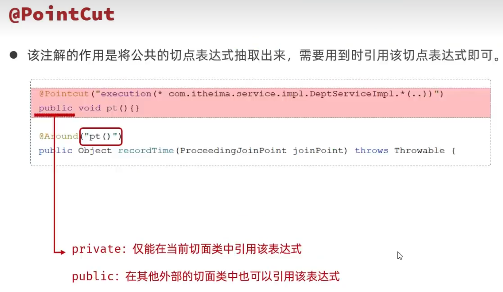

4. **通知顺序：**

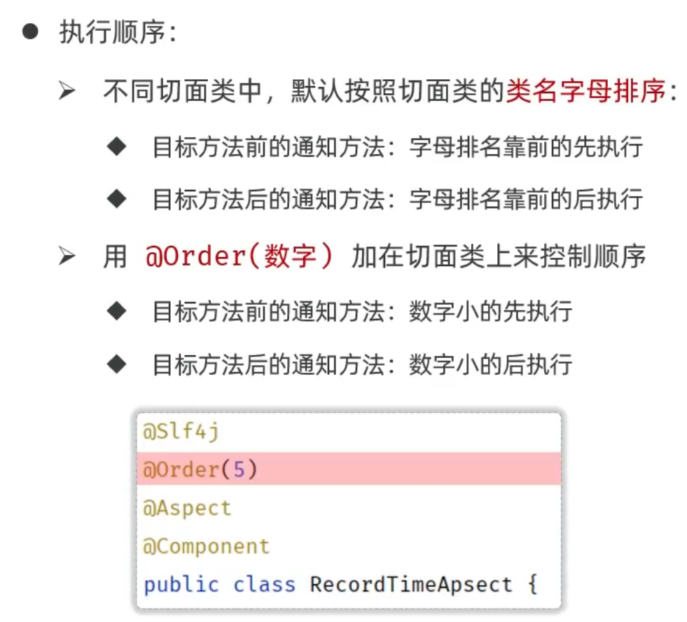

5. **切入点表达式：**分为两种一种是execution来匹配方法，另外一种是@annotation来匹配注解。

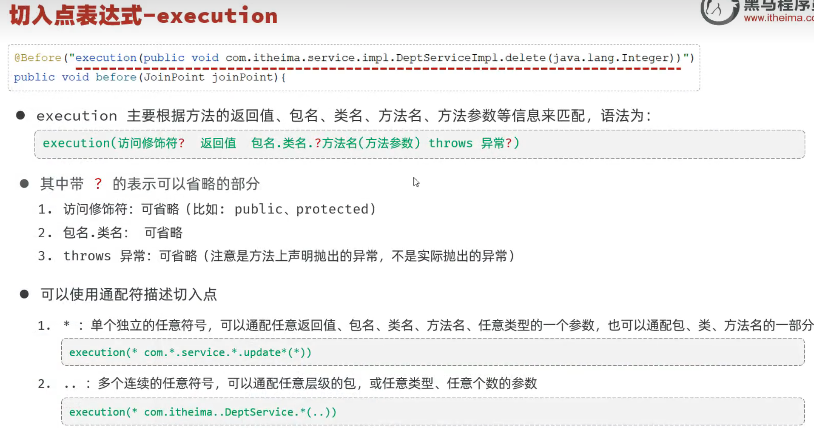

6. **joinPoint连接点：**在Spring中用JoinPoint抽象了连接点，用它可以获得方法执行时的相关信息，如目标类名、方法名、方法参数等。

- 对于 @Around 通知，获取连接点信息只能使用 ProceedingJoinPoint。
- 对于其它四种通知，获取连接点信息只能使用 JoinPoint，它是ProceedingJoinPoint的父类型

## ThreadLocal线程局部变量：

1. **what：**ThreadLocal其实是线程的局部变量，为每个线程提供单独一份存储空间，具有线程隔离的效果，不同的线程之间不会相互干扰。
2. **why（同线程数据共享）：**如果一个数据在Filter中拿到了（例如id），在AOP中要用则可以用ThreadLocal来保存，然后在AOP中使用。

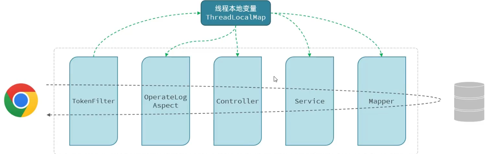

3. **使用方法：**定义一个CurrentHolder类来保存要用到的方法，然后在Filter中调用setCurrentId方法保存id，在要使用时调用getCurrentId()获取id，最后在Filter中调用remove()清理id。

```java
public class CurrentHolder {
    private static final ThreadLocal<Integer> CURRENT_LOCAL = new ThreadLocal<>();
    //线程绑定员工ID
    public static void setCurrentId(Integer employeeId) {
        CURRENT_LOCAL.set(employeeId);
    }
    //获取员工ID
    public static Integer getCurrentId() {
        return CURRENT_LOCAL.get();
    }
    //删除员工ID
    public static void remove() {
        CURRENT_LOCAL.remove();
    }
}
```


## Swagger——自动生成接口文档：

- 使用Swagger你只需要按照它的规范去定义接口及接口相关的信息，就可以做到生成接口文档，以及在线接口调试页面。
- 使用步骤：

1. 导入knife4j的maven坐标；
2. 在配置类中加入 knife4j 相关配置；
3. 设置静态资源映射，否则接口文档页面无法访问；

```java
//2-3步示例代码
/**
     * 通过knife4j生成接口文档
     * @return
     */
@Bean
public Docket docket() {
    ApiInfo apiInfo = new ApiInfoBuilder()
        .title("苍穹外卖项目接口文档")
        .version("2.0")
        .description("苍穹外卖项目接口文档")
        .build();
    Docket docket = new Docket(DocumentationType.SWAGGER_2)
        .apiInfo(apiInfo)
        .select()
        .apis(RequestHandlerSelectors.basePackage("com.sky.controller"))
        .paths(PathSelectors.any())
        .build();
    return docket;
}
/**
     * 设置静态资源映射
     * @param registry
     */
protected void addResourceHandlers(ResourceHandlerRegistry registry) {
    registry.addResourceHandler("/doc.html").addResourceLocations("classpath:/META-INF/resources/");
    registry.addResourceHandler("/webjars/**").addResourceLocations("classpath:/META-INF/resources/webjars/");
}
```

- 注解：让生成的接口文档更有可读性：

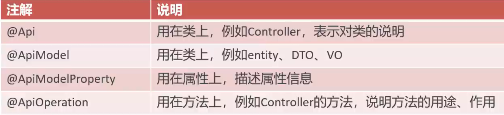

## 消息转换器：

- 数据库查询出的消息，不一定是需要的格式，因此可以配置一个全局的消息转换器来转换消息格式（例如时间）。需要在继承了WebMvcConfigurationSupport的配置类中编写一个格式化配置：

```java
@Override
protected void extendMessageConverters(List<HttpMessageConverter<?>> converters) {
    //创建一个消息转换器
    MappingJackson2HttpMessageConverter converter = new MappingJackson2HttpMessageConverter();
    //需要为消息转换器设置一个对象映射器，才能将java对象转为json
    converter.setObjectMapper(new JacksonObjectMapper());
    //将消息转换器对象添加到converters容器中
    converters.add(0,converter);
}
```

- 其中JacksonObjectMapper()是代码比较固定的对象映射器:基于jackson将Java对象转为json，或者将json转为Java对象，将JSON解析为Java对象的过程称为 [从JSON反序列化Java对象]，从Java对象生成JSON的过程称为 [序列化Java对象到JSON]。

## 阿里云OSS：

- 黑马JavaWeb教程课件有阿里云oss使用流程[[‍‌‬‬⁠⁠‍‍‌‌‬⁠‍‍‬⁠⁠‍09-后端Web实战(员工管理) - 飞书云文档](https://heuqqdmbyk.feishu.cn/wiki/PHp6wXaNUij3bokCXWrclz5anWh)]
- 需要配置：

```yml
alioss:
  endpoint: oss-cn-beijing.aliyuncs.com #你的bucket属于区域的地址
  access-key-id:  #你的key
  access-key-secret:  #你的私钥
  bucket-name:  #bucket名字
```

- 创建一个AliOssUtil方便使用：

```java
public class AliOssUtil {

    private String endpoint;
    private String accessKeyId;
    private String accessKeySecret;
    private String bucketName;
    /**
     * 文件上传
     *
     * @param bytes
     * @param objectName
     * @return
     */
    public String upload(byte[] bytes, String objectName) {

        // 创建OSSClient实例。
        OSS ossClient = new OSSClientBuilder().build(endpoint, accessKeyId, accessKeySecret);

        try {
            // 创建PutObject请求。
            ossClient.putObject(bucketName, objectName, new ByteArrayInputStream(bytes));
        } catch (OSSException oe) {
            System.out.println("Caught an OSSException, which means your request made it to OSS, "
                    + "but was rejected with an error response for some reason.");
            System.out.println("Error Message:" + oe.getErrorMessage());
            System.out.println("Error Code:" + oe.getErrorCode());
            System.out.println("Request ID:" + oe.getRequestId());
            System.out.println("Host ID:" + oe.getHostId());
        } catch (ClientException ce) {
            System.out.println("Caught an ClientException, which means the client encountered "
                    + "a serious internal problem while trying to communicate with OSS, "
                    + "such as not being able to access the network.");
            System.out.println("Error Message:" + ce.getMessage());
        } finally {
            if (ossClient != null) {
                ossClient.shutdown();
            }
        }
        //文件访问路径规则 https://BucketName.Endpoint/ObjectName
        StringBuilder stringBuilder = new StringBuilder("https://");
        stringBuilder
                .append(bucketName)
                .append(".")
                .append(endpoint)
                .append("/")
                .append(objectName);

        log.info("文件上传到:{}", stringBuilder.toString());

        return stringBuilder.toString();
    }
}
```

- 最后创建一个OSS的Config文件，注入为Bean：

```java
@Slf4j
@Configuration
public class OssConfiguration {
    @Bean
    @ConditionalOnMissingBean
    public AliOssUtil aliOssUtil(AliOssProperties aliOssProperties) {
        log.info("开始创建阿里云文件上传工具类对象：{}", aliOssProperties);
        return new AliOssUtil(aliOssProperties.getEndpoint(),
                aliOssProperties.getAccessKeyId(),
                aliOssProperties.getAccessKeySecret(),
                aliOssProperties.getBucketName());
    }
}
```


## HttpClient：

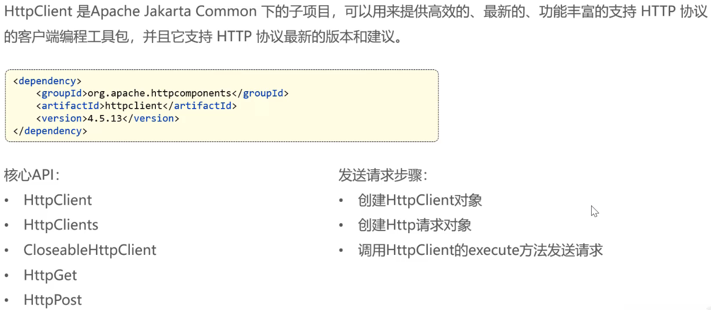

## 微信支付：

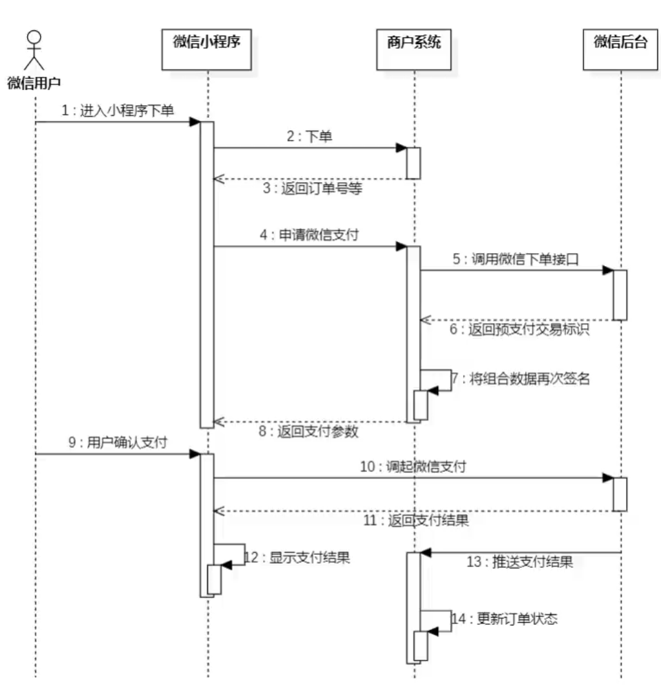

## Spring Task定时任务框架：

- Spring Task 是Spring框架提供的任务调度工具，可以按照约定的时间自动执行某个代码逻辑。

- **cron表达式：**用于定制时间周期，可以用在线生成器生成。

```java
    /** 例子：
     * 定时处理派送中订单，每天凌晨一点执行，处理前一天的。
     */
    @Scheduled(cron = "0 0 1 * * ?")
    public void handleDeliveringOrders() {
        log.info("定时处理派送中订单: {}", LocalDateTime.now());
        List<Orders> orders = orderMapper.getByStatusAndOrderTimeLT(Orders.DELIVERY_IN_PROGRESS,LocalDateTime.now().minusHours(1));
        if (orders != null && orders.size() > 0) {
            orders.forEach(order -> {
                order.setStatus(Orders.COMPLETED);
                orderMapper.update(order);
            });
        }
    }
```


## WebSocket：

- WebSocket 是基于 TCP 的一种新的网络协议。它实现了浏览器与服务器全双工通信----浏览器和服务器只需要完成一次握手，两者之间就可以创建持久性的连接，并进行双向数据传输。

1. 需要一个WebSocket服务：

```java
/**
 * WebSocket服务
 */
@Component
@ServerEndpoint("/ws/{sid}")
public class WebSocketServer {
    //存放会话对象
    private static Map<String, Session> sessionMap = new HashMap();

    /**
     * 连接建立成功调用的方法
     */
    @OnOpen
    public void onOpen(Session session, @PathParam("sid") String sid) {
        System.out.println("客户端：" + sid + "建立连接");
        sessionMap.put(sid, session);
    }
    /**
     * 收到客户端消息后调用的方法
     *
     * @param message 客户端发送过来的消息
     */
    @OnMessage
    public void onMessage(String message, @PathParam("sid") String sid) {
        System.out.println("收到来自客户端：" + sid + "的信息:" + message);
    }

    /**
     * 连接关闭调用的方法
     *
     * @param sid
     */
    @OnClose
    public void onClose(@PathParam("sid") String sid) {
        System.out.println("连接断开:" + sid);
        sessionMap.remove(sid);
    }

    /**
     * 群发
     *
     * @param message
     */
    public void sendToAllClient(String message) {
        Collection<Session> sessions = sessionMap.values();
        for (Session session : sessions) {
            try {
                //服务器向客户端发送消息
                session.getBasicRemote().sendText(message);
            } catch (Exception e) {
                e.printStackTrace();
            }
        }
    }

}
```

2. 需要在config中注册服务：

```java
/**
 * WebSocket配置类，用于注册WebSocket的Bean
 */
@Configuration
public class WebSocketConfiguration {

    @Bean
    public ServerEndpointExporter serverEndpointExporter() {
        return new ServerEndpointExporter();
    }

```

## Apache POI 操作Excel：

- Apache POl是一个处理Miscrosoft Ofice各种文件格式的开源项目。简单来说就是，我们可以使用 POI 在 Java 程序中对Miscrosoft Office各种文件进行读写操作。
- 下面是一个数据报表的制作案例：

```java
/**
 * 导出运营数据报表
 * @param response
 */
public void exportBusinessData (HttpServletResponse response) {
    //获取营业数据
    LocalDate beginTime = LocalDate.now().minusDays(30);
    LocalDate endTime = LocalDate.now().minusDays(1);
    BusinessDataVO businessDataVO = workspaceService.getBusinessData(LocalDateTime.of(beginTime, LocalTime.MIN), LocalDateTime.of(endTime, LocalTime.MAX));
    //将运营数据报表.xlsx文件转换为输入流
    InputStream in = this.getClass().getClassLoader().getResourceAsStream("template/运营数据报表模板.xlsx");
    try {
        //基于模板文件创建新的Excel文件
        XSSFWorkbook excel = new XSSFWorkbook(in);
        //填充数据--时间
        XSSFSheet sheet = excel.getSheetAt(0);
        sheet.getRow(1).getCell(1).setCellValue("时间：" + beginTime + "至" + endTime);
        //填充数据--概览数据
        sheet.getRow(3).getCell(2).setCellValue(businessDataVO.getTurnover());
        sheet.getRow(3).getCell(4).setCellValue(businessDataVO.getValidOrderCount());
        sheet.getRow(3).getCell(6).setCellValue(businessDataVO.getNewUsers());
        sheet.getRow(4).getCell(2).setCellValue(businessDataVO.getValidOrderCount());
        sheet.getRow(4).getCell(4).setCellValue(businessDataVO.getUnitPrice());
        //填充数据--明细数据
        for (int i = 0; i < 30; i++) {
            LocalDate date = beginTime.plusDays(i);
            //查询某一条的营业数据
            BusinessDataVO businessDataVO1 = workspaceService.getBusinessData(LocalDateTime.of(date, LocalTime.MIN), LocalDateTime.of(date, LocalTime.MAX));
            //填充数据--明细数据
            sheet.getRow(7 + i).getCell(1).setCellValue(date.toString());
            sheet.getRow(7 + i).getCell(2).setCellValue(businessDataVO1.getTurnover());
            sheet.getRow(7 + i).getCell(3).setCellValue(businessDataVO1.getValidOrderCount());
            sheet.getRow(7 + i).getCell(4).setCellValue(businessDataVO1.getOrderCompletionRate());
            sheet.getRow(7 + i).getCell(5).setCellValue(businessDataVO1.getUnitPrice());
            sheet.getRow(7 + i).getCell(6).setCellValue(businessDataVO1.getNewUsers());
        }

        //通过输出流将Excel文件下载到客户端浏览器
        ServletOutputStream out = response.getOutputStream();
        excel.write(out);
        //关闭输出流和Excel文件
        out.close();
        excel.close();
    } catch (IOException e) {
        e.printStackTrace();
    }


}
```

## 全局ID生成：

**方法：**

- UUID
- Redis自增：利用Redis中的String自增来实现
- snowflake算法：利用的是时钟，对时间准确性要求高
- 数据库自增：类似于Redis自增，利用一张新的表自增

### Redis自增：

**Redis自增ID策略:** 

- 每天一个key，方便统计订单量，且正常情况下不会溢出。
- ID构造是时间戳+计数器。

**代码示例：**

```java
@Component
public class RedisIdWorker {
    // 开始时间戳
    private static final long BEGIN_TIMESTAMP = 1767225600L;
    // 序列号位数
    private static final int COUNT_BITS = 32;
    @Autowired
    private StringRedisTemplate stringRedisTemplate;
    public Long nextId(String keyPrefix) {
        LocalDateTime now = LocalDateTime.now();
        // 获取当前时间戳，单位秒
        long timestamp = now.toEpochSecond(ZoneOffset.UTC) - BEGIN_TIMESTAMP;
        // 从redis获取当前日期的序列号
        String date = now.format(DateTimeFormatter.ofPattern("yyyyMMdd"));
        Long sequence = stringRedisTemplate.opsForValue().increment("icr:" + keyPrefix + ":" + date);
        // 拼接id
        return timestamp << COUNT_BITS | sequence;
    }

}
```

## Feed流：

### Timeline:

- 不做内容筛选，简单的按照内容发布时间排序，常用于好友或关注。例如朋友圈

1. **拉模式（读扩撒）：**发送消息的人有个发件箱（可以带有时间戳），收消息的人每次从关注列表中分别读取这些发件箱。缺点是每次都要读取效率慢。——很少使用
2. **推模式（写扩散）：**每个粉丝有个收件箱，发消息的人发消息之后会直接发给每一个粉丝的收件箱。缺点是内存占用高。——适合用户量少
3. **推拉结合（读写混合模式）：**大博主会有发件箱，普通人只会有收件箱。大博主发送的消息会发在发件箱内（方便不活跃粉丝读取），并且发到活跃用户的收件箱。而普通用户没有发件箱直接发到所有粉丝的收件箱。——适合有大V用户量大

### 智能排序:

- 利用智能算法屏蔽掉违规的、用户不感兴趣的内容。推送用户感兴趣信息来吸引用户

### 滚动分页：

- 因为Feed流中的数据会不断更新，所以数据的角标也在变化，因此不能采用传统的分页模式。滚动分页就是记住了上一次查询的lastId来继续查询下一页。
- 使用Redis中的ZSet就可以实现这一点，因为这个集合中每个数据有有个分数（可以设置为时间戳），查询下一页时可以查询比上一页最后一条信息时间小的信息。

# 线程安全：

## 悲观锁和乐观锁：

- 悲观锁：简单粗暴，但是性能差。
- 乐观锁：性能好，但存在抢票成功率低的问题。

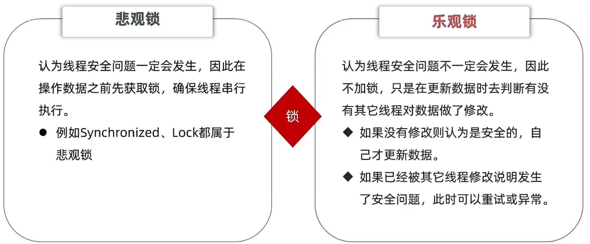

- 乐观锁法一**（版本号法）**：

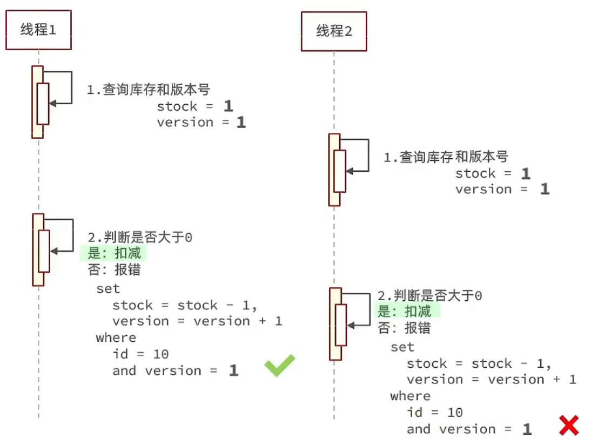

- 乐观锁法二**（CAS法）**：也就是将法一的版本号直接用库存代替。

- 乐观锁与悲观锁的应用：

```java
/**
 * 秒杀优惠券
 *
 * @param voucherId 优惠券id
 * @return 结果
 */
@Override
@Transactional
public Result seckillVoucher(Long voucherId) {
    //查询优惠券
    SeckillVoucher voucher = seckillVoucherService.getById(voucherId);
    if (voucher == null) {
        return Result.fail("优惠券不存在");
    }
    //判断是否开启秒杀
    if (voucher.getBeginTime().isAfter(LocalDateTime.now())) {
        return Result.fail("秒杀未开始");
    }
    //判断是否结束秒杀
    if (voucher.getEndTime().isBefore(LocalDateTime.now())) {
        return Result.fail("秒杀已结束");
    }
    //判断库存是否充足
    if (voucher.getStock() < 1) {
        return Result.fail("优惠券已售罄");
    }
    Long userId = UserHolder.getUser().getId();
	//根据用户id加锁（悲观锁），确保每个用户只能购买一张优惠券
    //如果锁直接加在方法上，会导致所有用户都要等待锁释放，效率低
    //如果锁加在方法中，事务还没提交，锁就释放了，其他线程就可以进来，会有并发问题
    //userId.toString()并不一定是同一个对象，所以要 intern() 方法确保是同一个对象
    synchronized (userId.toString().intern()) 
    {
        //获取代理对象（事务）
        //如果直接用this调用createVoucherOrder()方法，会导致事务失效
        //事务的底层原理是基于动态代理实现的，this指向的是当前对象，而不是代理对象
        //所以要通过代理对象调用createVoucherOrder()方法，才能开启事务
        IVoucherOrderService proxy = (IVoucherOrderService) AopContext.currentProxy();
        return proxy.createVoucherOrder(voucherId);
    }

}
/**
 * 创建优惠券订单,包含乐观锁,确保优惠券库存充足
 * @param voucherId 优惠券id
 * @return 结果
 */
@Override
@Transactional
public Result createVoucherOrder(Long voucherId) {
    //获取用户id
    Long userId = UserHolder.getUser().getId();
    //判断用户是否重复下单
    Long count = query().eq("user_id", userId).eq("voucher_id", voucherId).count();
    if (count > 0) {
        return Result.fail("用户已购买该优惠券");
    }
    //扣减库存
    boolean success = seckillVoucherService.update()
            .setSql("stock = stock - 1")
            .eq("voucher_id", voucherId)
            .gt("stock", 0)//乐观锁
            .update();
    if (!success) {
        return Result.fail("优惠券已售罄");
    }
    //创建订单
    VoucherOrder voucherOrder = new VoucherOrder();
    //订单id
    long orderId = redisIdWorker.nextId("order");
    voucherOrder.setId(orderId);
    //用户id
    voucherOrder.setUserId(userId);
    //优惠券id
    voucherOrder.setVoucherId(voucherId);
    //下单时间
    voucherOrder.setCreateTime(LocalDateTime.now());
    //支付时间
    voucherOrder.setPayTime(LocalDateTime.now());
    save(voucherOrder);
    return Result.ok(orderId);
}
```

## Redis实现分布式锁：

- **分布式锁:**满足分布式系统或集群模式下多进程可见并且互斥的锁。有以下实现方式：

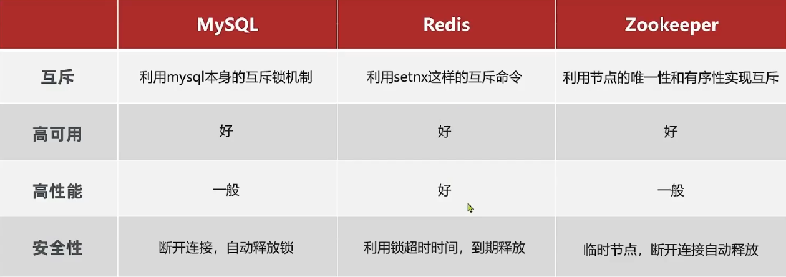


- **Redis实现：**下述代码在黑马点评中的SimpleRedisLock中有实现。
- 如果线程1执行时间超过了设置的超时时间，那么线程2可能进入，线程1可能会释放线程2的锁，因此在释放时需要判断以下锁的ID（要用全局唯一ID）。但还有一个问题就是在判断成功是线程1的锁之后如果JVM卡顿，（此时线程1以为锁是自己的）则可能在恢复的时候删除线程2的锁，因此可以通过Lua脚本做到判断和删除操作的原子性。

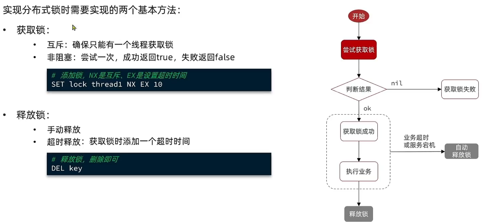

- 上述使用SetNX的方法有以下缺陷：

1. 不可重入：同一个线程无法多次获取同一把锁。
2. 不可重试：获取锁只尝试一次就返回false,没有重试机制。
3. 超时释放：锁超时释放虽然可以避免死锁，但如果是业务执行耗时较长，也会导致锁释放，存在安全隐患。
4. 主从一致性：如果Redis提供了主从集群主从同步存在延迟，当主宕机时，如果从未同步主中的锁数据，则会出现锁失效。

## Redisson实现分布式锁

- Redisson能解决上述SetNx实现分布式锁的问题。

- **准备工作：**

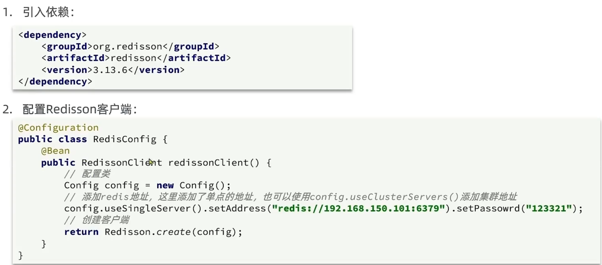

- **基本使用：**

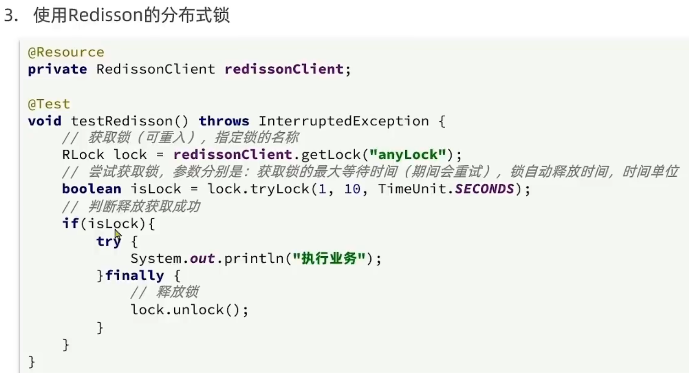

### Redisson分布式锁原理：

- **解决不可重入锁：**利用hash结构记录线程id和重入次数

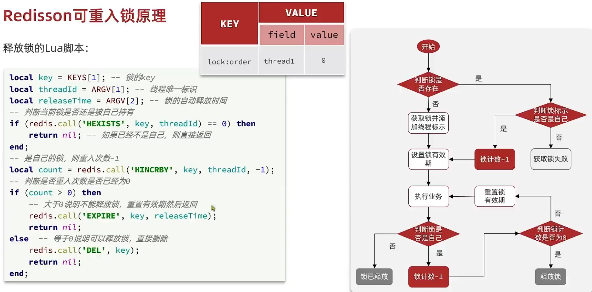

- **解决不可重试:**利用信号量和PubSub（释放锁时发送释放消息，如果在等待时间内就可以加锁）功能实现等待、唤醒，获取锁失败的重试机制。
- **解决超时释放:**利用watchDog,每隔一段时间(releaseTime/3)，重置超时时间。

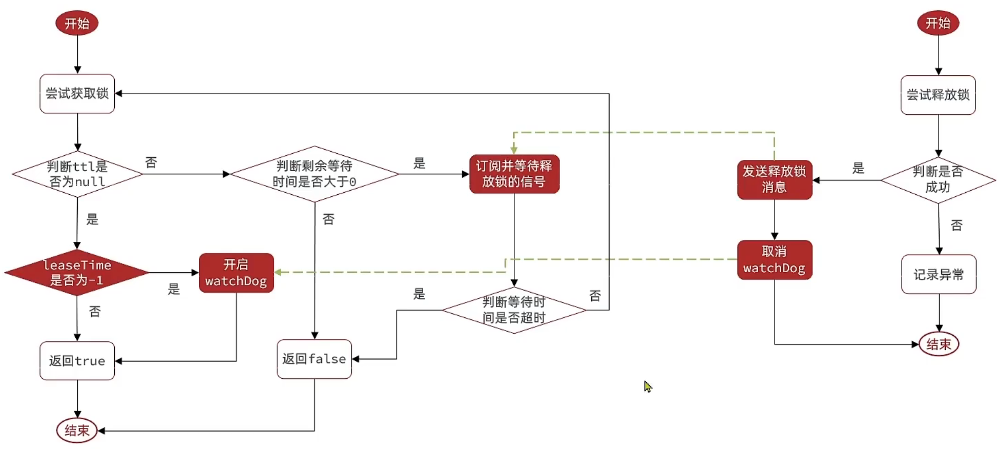

- **解决主从一致性：**多个独立的Redis节点，必须在所有节点都获取重入锁，才算获取锁成功。

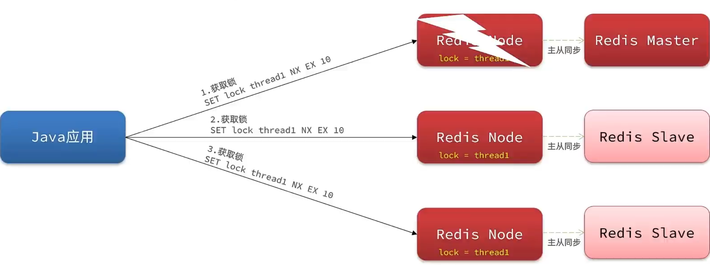

# 优化：

## 秒杀优化：

### Redis异步优化秒杀

秒杀业务的优化思路是什么?

1. 先利用Redis完成库存余量、一人一单判断，完成抢单业务，利用lua脚本保证原子性。
2. 再将下单业务放入阻塞队列，利用独立线程异步下单。这样耗时的数据库操作就会在独立的线程中运行，提高并发效率。

基于阻塞队列的异步秒杀存在哪些问题?

1. 内存限制问题：阻塞队列在高并发的时候可能会被挤爆。
2. 数据安全：如果服务宕机，数据会丢失。

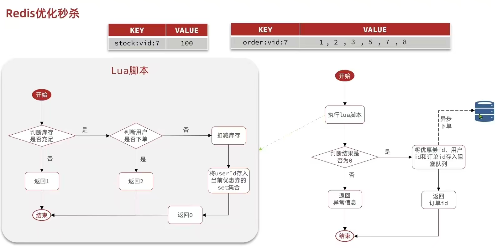

# 消息队列

## 基于Redis消息队列

1. **List实现：**利用list中的LPUSH结合 BRPOP、或者 RPUSH结合BLPOP来实现。

**优点:**利用Redis存储，不受限于JVM内存上限；基于Redis的持久化机制，数据安全性有保证；可以满足消息有序性。

**缺点:**无法避免消息丢失（无法避免在消息被取走之后丢失）；只支持单消费者。


2. **PubSub实现：**使用Redis中的订阅和发布功能实现消息队列（可以SUBSCRIBE多个PUBLISH）。

**优点:**采用发布订阅模型，支持多生产、多消费

**缺点:**不支持数据持久化（pub的消息不会保存在redis）；无法避免消息丢失消息；堆积有上限，超出时数据丢失。


3. **Stream流实现：**使用Redis5.0最新的Stream流进行写入和读取消息。

- **单消费者：**也就是单个监听，创建一个持久化队列然后在里面读取消息，但不知道消息是否被读过或者成功执行。

**优点：**消息可回溯；一个消息可以被多个消费者读取；可以阻塞读取。
	**缺点：**有消息漏读的风险。

- **消费者组（推荐做法）:**将多个消费者划分到一个组中，监听同一个队列。在黑马点评VoucherOrderServiceImpl中有实现
- **特点如下：**

​	1.队列中的消息会分流给组内的不同消费者，而不是重复消费，从而加快消息处理的速度

​	2.消费者组会维护一个标示，记录最后一个被处理的消息，哪怕消费者宕机重启，还会从标示之后读取消息。确保每一个消息都会被消费。

​	3.消费者获取消息后，消息处于pending状态,并存入一个pending-list。当处理完成后需要通过XACK来确认消息，标记消息为已处理，才会从pending-list移除，因此在消息执行错误之后可以从pending-list中取到。


# 常用API：

## hootool：


## Stream流：

