# 微服务拆分：

## 拆分原则：

1. **原则：**

- **高内聚:**每个微服务的职责要尽量单一，包含的业务相互关联度高、完整度高。
- **低耦合:**每个微服务的功能要相对独立，尽量减少对其它微服务的依赖。

2. **方式：**

- **纵向拆分:**按照业务模块来拆分。
- **横向拆分:**抽取公共服务，提高复用性。

3. **结构：**

- **独立project：**分别在独立的project中。
- **Maven聚合：**在一个project里面，有多个父子模块。

## 拆分方法：

- 使用maven聚合拆分

1. 在project中创建新的module，创建为maven项目并指定父模块。
2. 创建启动类。
3. 创建yml配置文件，可以从原项目中复制过来，然后进行一些修改。
4. 创建对应的包mvc。

## 远程调用：

### RestTemplate：

- 当服务进行拆分之后，不同模块的方法、数据库在物理上都是独立的，没办法直接调用。

1. 通过利用spring提供的RestTemplate发送Http请求，但他的请求路径是写死的如果分布式部署就无法轮询调用（一般不用）

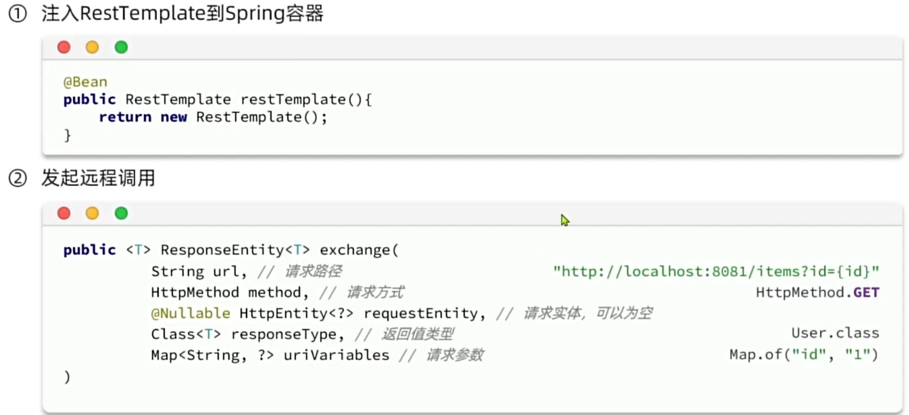

### Nacos注册中心：

1. **注册中心：**动态服务发现、配置管理和服务治理平台

- 服务启动时就会注册自己的服务信息（服务名、IP、端口）到注册中心
- 调用者可以从注册中心订阅想要的服务，获取服务对应的实例列表（1个服务可能多实例部署）
- 调用者自己对实例列表负载均衡，挑选一个实例
- 调用者向该实例发起远程调用

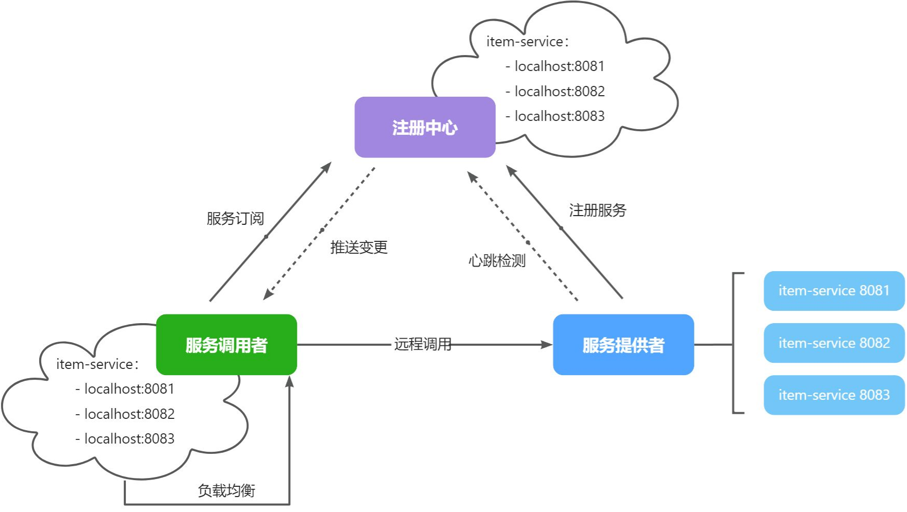

2. **Nacos使用：**nacos是aliyun提供的一个注册中心工具，需要现在服务器下载并启动nacos。使用nacos管理服务实例列表之后就可以负载均衡访问实例了，但还是需要构造http请求。

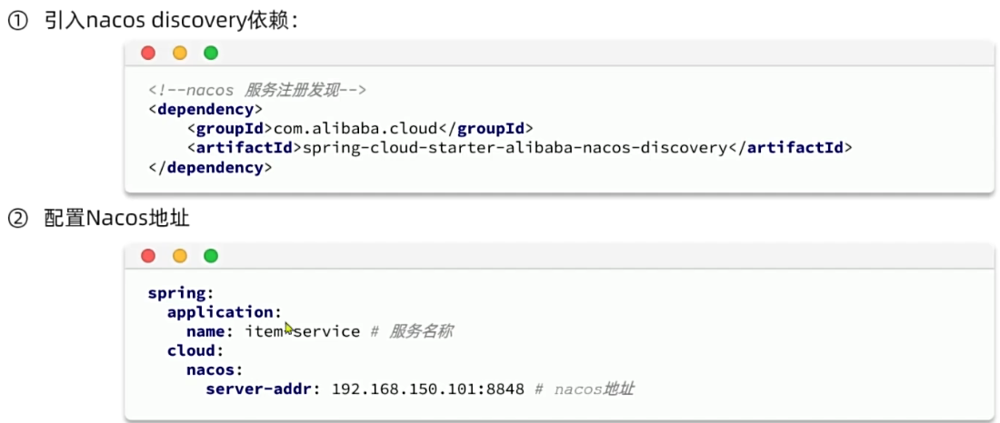

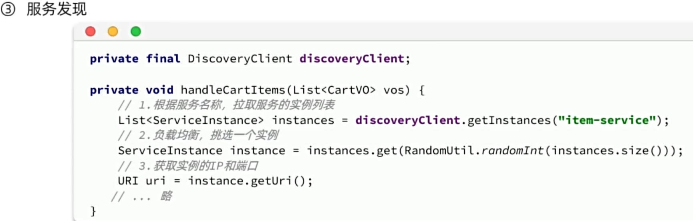

### OpenFeign：

- 之前调用需要构造http请求十分麻烦，OpenFeign可以简化开发。

#### 使用：

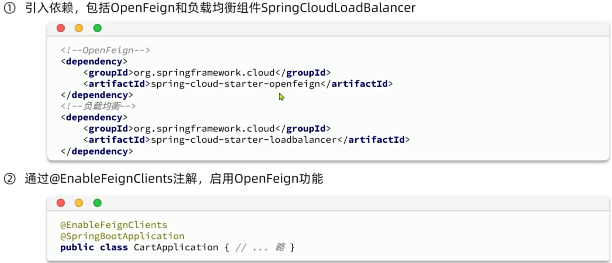

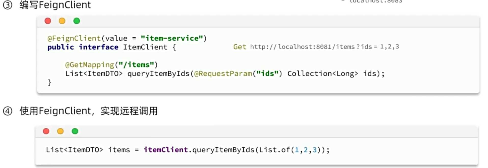

#### 连接池：

- OpenFeign对Http请求做了优雅的伪装，不过其底层发起http请求，依赖于其它的框架。这些框架可以自己选择，包括以下三种:HttpURLConnection:默认实现，不支持连接池、Apache HttpClient:支持连接池、OKHttp:支持连接池

1. **引入依赖：**

```XML
<!--OK http 的依赖 -->
<dependency>
  <groupId>io.github.openfeign</groupId>
  <artifactId>feign-okhttp</artifactId>
</dependency>
```

2. **配置：**

```YAML
feign:
  okhttp:
    enabled: true # 开启OKHttp功能
```

#### 最佳实践：

- 为了提高复用性，建议把微服务需要用到的FeignClient、dto、config进行如下方案的封装。

- **方案1：**直接新加一个模块，抽取更加简单，工程结构也比较清晰，但缺点是整个项目耦合度偏高。
- **方案2：**在原有模块上把自己暴露的api做成新的模块，抽取相对麻烦，工程结构相对更复杂，但服务之间耦合度降低。
- 需要在启动类的@EnableFeignClient(basePackages=“”,defaultConfiguration=)中加上包名和配置名，不然扫描不到无法使用。

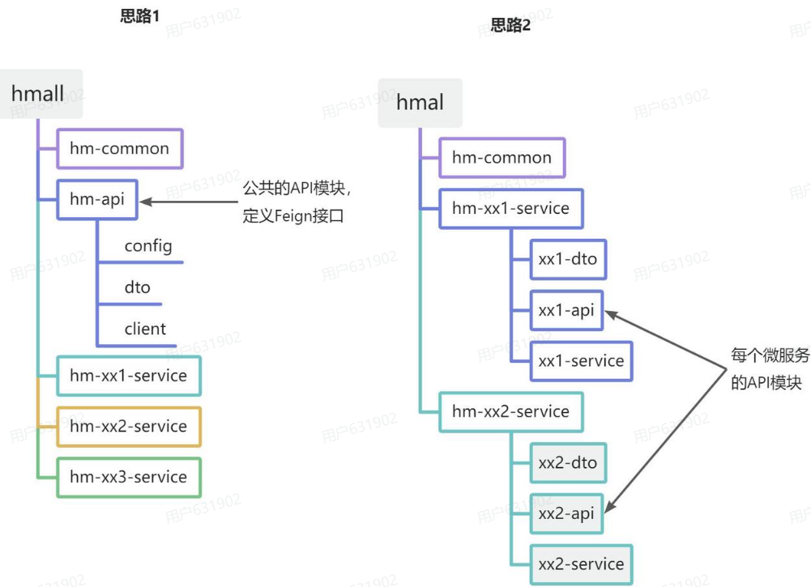

#### 日志：

OpenFeign只会在FeignClient所在包的日志级别为**DEBUG**时，才会输出日志。而且其日志级别有4级：

- **NONE**：不记录任何日志信息，这是默认值。
- **BASIC**：仅记录请求的方法，URL以及响应状态码和执行时间
- **HEADERS**：在BASIC的基础上，额外记录了请求和响应的头信息
- **FULL**：记录所有请求和响应的明细，包括头信息、请求体、元数据。

Feign默认的日志级别就是NONE，所以默认我们看不到请求日志。

1. 在hm-api模块下新建一个配置类，定义Feign的日志级别：

```Java
package com.hmall.api.config;
import feign.Logger;
import org.springframework.context.annotation.Bean;
public class DefaultFeignConfig {
    @Bean
    public Logger.Level feignLogLevel(){
        return Logger.Level.FULL;
    }
}
```

2. 接下来，要让日志级别生效，还需要配置这个类。有两种方式：

- **局部**生效：在某个`FeignClient`中配置，只对当前`FeignClient`生效

```Java
@FeignClient(value = "item-service", configuration = DefaultFeignConfig.class)
```

- **全局**生效：在`@EnableFeignClients`中配置，针对所有`FeignClient`生效。

```Java
@EnableFeignClients(defaultConfiguration = DefaultFeignConfig.class)
```

# 网关：

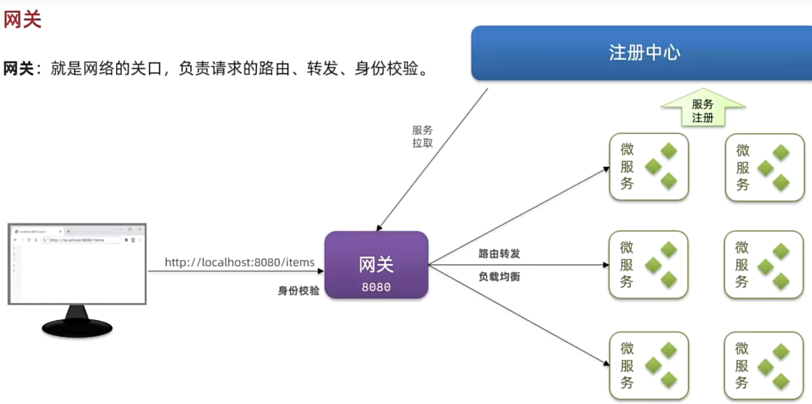

## 创建网关：

1. 创建创建一个新的module，命名为hm-gateway，作为网关微服务（网关本质上也是一个微服务）。
2. 在`hm-gateway`模块的`pom.xml`文件中引入依赖，并在`hm-gateway`模块的`com.hmall.gateway`包下新建一个启动类。
3. 配置路由：

```YAML
server:
  port: 8080
spring:
  application:
    name: gateway
  cloud:
    nacos:
      server-addr: 192.168.150.101:8848
    gateway:
      routes:
        - id: item # 路由规则id，自定义，唯一
          uri: lb://item-service # 路由的目标服务，lb代表负载均衡，会从注册中心拉取服务列表
          predicates: # 路由断言，判断当前请求是否符合当前规则，符合则路由到目标服务
            - Path=/items/**,/search/** # 这里是以请求路径作为判断规则
        - id: cart
          uri: lb://cart-service
          predicates:
            - Path=/carts/**
```

## 路由配置属性：

### 路由断言predicates：

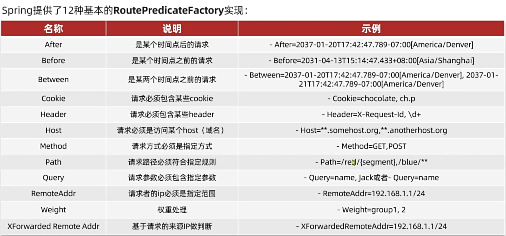

### 路由过滤器Filters：

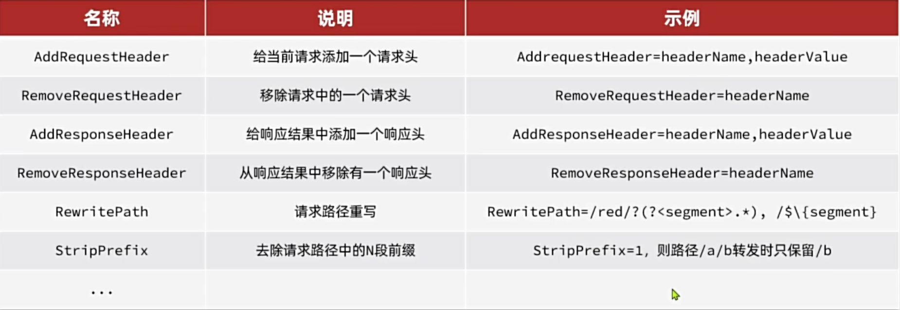

## 网关登录校验：

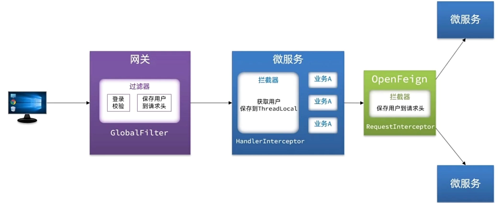

### 网关工作流程：

1. 客户端请求进入网关后由`HandlerMapping`对请求做判断，找到与当前请求匹配的路由规则（**`Route`**），然后将请求交给`WebHandler`去处理。
2. `WebHandler`则会加载当前路由下需要执行的过滤器链（**`Filter chain`**），然后按照顺序逐一执行过滤器（后面称为**`Filter`**）。
3. 图中`Filter`被虚线分为左右两部分，是因为`Filter`内部的逻辑分为`pre`和`post`两部分，分别会在请求路由到微服务**之前**和**之后**被执行。
4. 只有所有`Filter`的`pre`逻辑都依次顺序执行通过后，请求才会被路由到微服务。
5. 微服务返回结果后，再倒序执行`Filter`的`post`逻辑。
6. 最终把响应结果返回。

- 如果我们能够定义一个过滤器，在其中实现登录校验逻辑，并且将过滤器执行顺序定义到`NettyRoutingFilter`之前，这就符合我们的需求了。

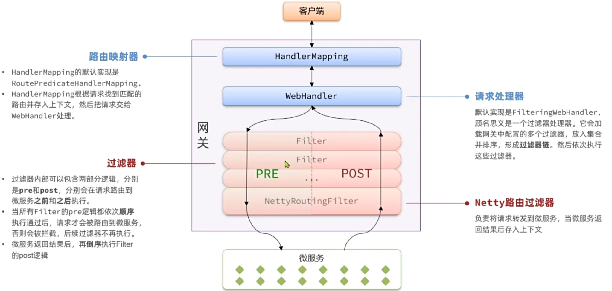

### 自定义过滤器：

网关过滤器链中的过滤器有两种：

- **`GatewayFilter`**：路由过滤器，作用范围比较灵活，可以是任意指定的路由`Route`. 
- **`GlobalFilter`**：全局过滤器，作用范围是所有路由，声明后自动生效。

#### GlobalFilter：

- 自定义GlobalFilter则简单很多，直接实现GlobalFilter即可，而且也无法设置动态参数。
- 需要继承一个GlobalFilter接口：

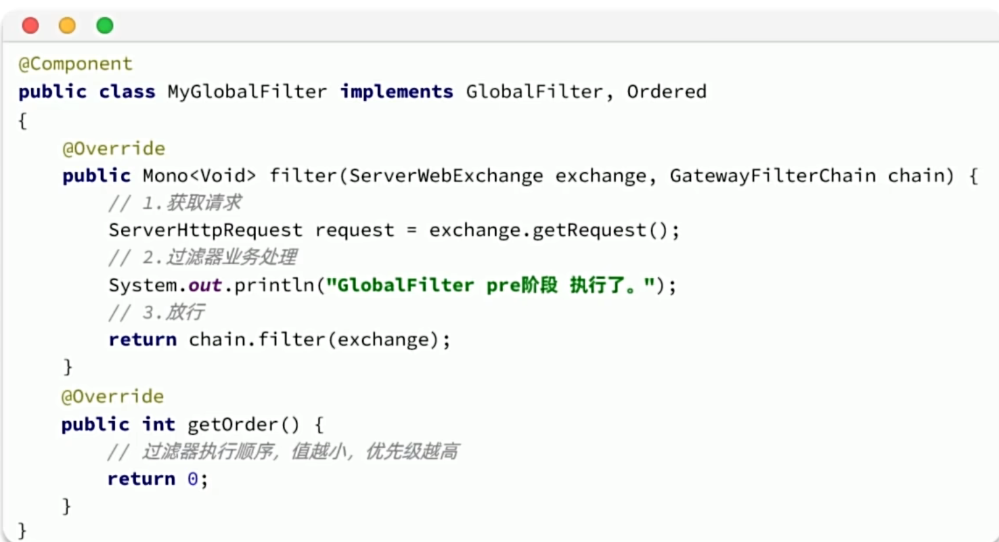

#### GatewayFilter：

- 这种过滤器还可以支持动态配置参数，不过实现起来比较复杂，示例：

```Java
@Component
public class PrintAnyGatewayFilterFactory // 父类泛型是内部类的Config类型
    extends AbstractGatewayFilterFactory<PrintAnyGatewayFilterFactory.Config> {

    @Override
    public GatewayFilter apply(Config config) {
        // OrderedGatewayFilter是GatewayFilter的子类，包含两个参数：
        // - GatewayFilter：过滤器
        // - int order值：值越小，过滤器执行优先级越高
        return new OrderedGatewayFilter(new GatewayFilter() {
            @Override
            public Mono<Void> filter(ServerWebExchange exchange, GatewayFilterChain chain) {
                // 获取config值
                String a = config.getA();
                String b = config.getB();
                String c = config.getC();
                // 编写过滤器逻辑
                System.out.println("a = " + a);
                System.out.println("b = " + b);
                System.out.println("c = " + c);
                // 放行
                return chain.filter(exchange);
            }
        }, 100);
    }

    // 自定义配置属性，成员变量名称很重要，下面会用到
    @Data
    static class Config{
        private String a;
        private String b;
        private String c;
    }
    // 将变量名称依次返回，顺序很重要，将来读取参数时需要按顺序获取
    @Override
    public List<String> shortcutFieldOrder() {
        return List.of("a", "b", "c");
    }
    // 返回当前配置类的类型，也就是内部的Config
    @Override
    public Class<Config> getConfigClass() {
        return Config.class;
    }

}
```

- 然后在yaml文件中使用：

```YAML
spring:
  cloud:
    gateway:
      default-filters:
            - PrintAny=1,2,3 # 注意，这里多个参数以","隔开，将来会按照shortcutFieldOrder()方法返回的参数顺序依次复制
```

### 实现登录校验：

1. 其中`AuthProperties`和`JwtProperties`所需的属性要在`application.yaml`中配置

```YAML
hm:
  jwt:
    location: classpath:hmall.jks # 秘钥地址
    alias: hmall # 秘钥别名
    password: hmall123 # 秘钥文件密码
    tokenTTL: 30m # 登录有效期
  auth:
    excludePaths: # 无需登录校验的路径
      - /search/**
      - /users/login
      - /items/**
```

2. 定义一个登录校验的过滤器：

```Java
@Component
@RequiredArgsConstructor
@EnableConfigurationProperties(AuthProperties.class)
public class AuthGlobalFilter implements GlobalFilter, Ordered {
    private final JwtTool jwtTool;
    private final AuthProperties authProperties;
    private final AntPathMatcher antPathMatcher = new AntPathMatcher();
    @Override
    public Mono<Void> filter(ServerWebExchange exchange, GatewayFilterChain chain) {
        // 1.获取Request
        ServerHttpRequest request = exchange.getRequest();
        // 2.判断是否不需要拦截
        if(isExclude(request.getPath().toString())){
            // 无需拦截，直接放行
            return chain.filter(exchange);
        }
        // 3.获取请求头中的token
        String token = null;
        List<String> headers = request.getHeaders().get("authorization");
        if (!CollUtils.isEmpty(headers)) {
            token = headers.get(0);
        }
        // 4.校验并解析token
        Long userId = null;
        try {
            userId = jwtTool.parseToken(token);
        } catch (UnauthorizedException e) {
            // 如果无效，拦截
            ServerHttpResponse response = exchange.getResponse();
            response.setRawStatusCode(401);
            return response.setComplete();
        }
        // TODO 5.如果有效，传递用户信息
        System.out.println("userId = " + userId);
        // 6.放行
        return chain.filter(exchange);
    }
    private boolean isExclude(String antPath) {
        for (String pathPattern : authProperties.getExcludePaths()) {
            if(antPathMatcher.match(pathPattern, antPath)){
                return true;
            }
        }
        return false;
    }
    @Override
    public int getOrder() {
        return 0;
    }
}
```

## 网关传递用户：

1. 首先，修改网关登录校验拦截器的处理逻辑，保存用户信息到请求头中：

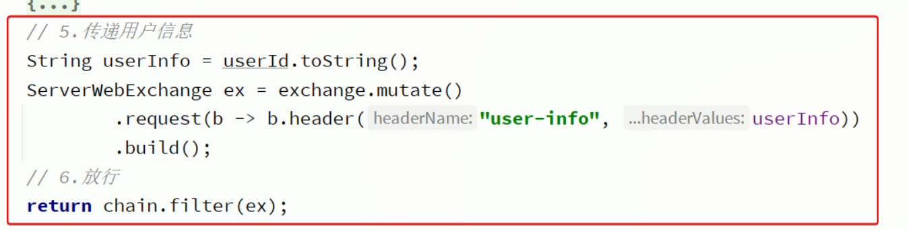

2. 由于每个微服务都有获取登录用户的需求，因此拦截器我们直接写在`hm-common`中，并写好自动装配。这样微服务只需要引入`hm-common`就可以直接具备拦截器功能，无需重复编写。
3. 不过，需要注意的是，这个配置类默认是不会生效的，因为它所在的包是`com.hmall.common.config`，与其它微服务的扫描包不一致，无法被扫描到，因此无法生效。基于SpringBoot的自动装配原理，我们要将其添加到`resources`目录下的`META-INF/spring.factories`文件中：

```Properties
org.springframework.boot.autoconfigure.EnableAutoConfiguration=\
  com.hmall.common.config.MyBatisConfig,\
  com.hmall.common.config.MvcConfig
```

## OpenFeign传递用户：

- 这里要借助Feign中提供的一个拦截器接口：`feign.RequestInterceptor`。我们只需要实现这个接口，然后实现apply方法，利用`RequestTemplate`类来添加请求头，将用户信息保存到请求头中。这样以来，每次OpenFeign发起请求的时候都会调用该方法，传递用户信息。
- 由于`FeignClient`全部都是在`hm-api`模块，因此我们在`hm-api`模块的`DefaultFeignConfig`中编写这个拦截器：

```Java
@Bean
public RequestInterceptor userInfoRequestInterceptor(){
    return new RequestInterceptor() {
        @Override
        public void apply(RequestTemplate template) {
            // 获取登录用户
            Long userId = UserContext.getUser();
            if(userId == null) {
                // 如果为空则直接跳过
                return;
            }
            // 如果不为空则放入请求头中，传递给下游微服务
            template.header("user-info", userId.toString());
        }
    };
}
```

# 配置管理：

- 为什么要配置管理：

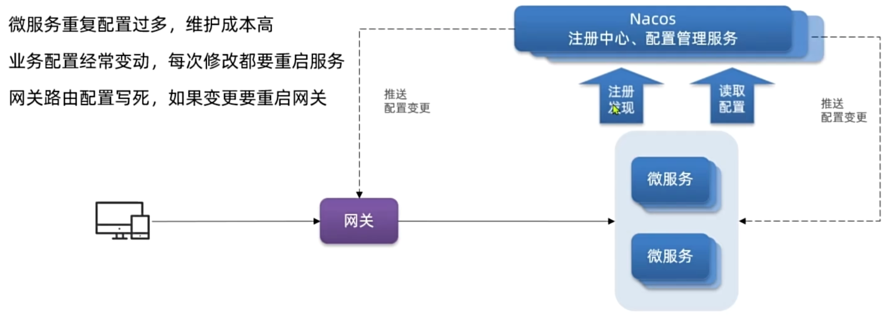

## 配置共享：

- **springcloud项目启动拉取配置流程：**

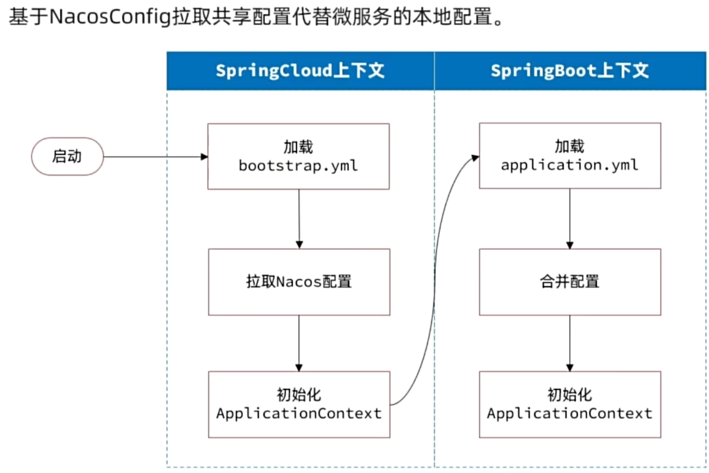

0. 在nacos中写入共享依赖，例如shared-jdbc：其中${}内的参数是需要在微服务中的配置文件中传递过来。

```YAML
spring:
  datasource:
    url: jdbc:mysql://${hm.db.host:192.168.150.101}:${hm.db.port:3306}/${hm.db.database}?useUnicode=true&characterEncoding=UTF-8&autoReconnect=true&serverTimezone=Asia/Shanghai
    driver-class-name: com.mysql.cj.jdbc.Driver
    username: ${hm.db.un:root}
    password: ${hm.db.pw:123}
mybatis-plus:
  configuration:
    default-enum-type-handler: com.baomidou.mybatisplus.core.handlers.MybatisEnumTypeHandler
  global-config:
    db-config:
      update-strategy: not_null
      id-type: auto
```

1. 在微服务模块引入依赖：

```XML
  <!--nacos配置管理-->
  <dependency>
      <groupId>com.alibaba.cloud</groupId>
      <artifactId>spring-cloud-starter-alibaba-nacos-config</artifactId>
  </dependency>
  <!--读取bootstrap文件-->
  <dependency>
      <groupId>org.springframework.cloud</groupId>
      <artifactId>spring-cloud-starter-bootstrap</artifactId>
  </dependency>
```

2. 新建bootstrap.yaml：因为springcloud是先拉取nacos配置再读取application.yml，所以需要引入bootstrap.yaml告诉springcloud nacos配置。

```YAML
spring:
  application:
    name: cart-service # 服务名称
  profiles:
    active: dev
  cloud:
    nacos:
      server-addr: 192.168.150.101 # nacos地址
      config:
        file-extension: yaml # 文件后缀名
        shared-configs: # 共享配置
          - dataId: shared-jdbc.yaml # 共享mybatis配置
          - dataId: shared-log.yaml # 共享日志配置
          - dataId: shared-swagger.yaml # 共享日志配置
```

3. 修改application.yaml：修改配置文件，只留下非共享的配置，以及要传给nacos的参数。

```YAML
server:
  port: 8082
feign:
  okhttp:
    enabled: true # 开启OKHttp连接池支持
hm:
  swagger:
    title: 购物车服务接口文档
    package: com.hmall.cart.controller
  db:
    database: hm-cart
```

## 配置热更新：

- 配置热更新就是不需要重启项目也可以修改配置。

1. 首先，在nacos中添加一个配置文件，将购物车的上限数量添加到配置中：

注意文件的dataId格式：

```Plain
[服务名]-[spring.active.profile].[后缀名]
```

文件名称由三部分组成：

- **`服务名`**：我们是购物车服务，所以是`cart-service`
- **`spring.active.profile`**：就是spring boot中的`spring.active.profile`，可以省略，则所有profile共享该配置
- **`后缀名`**：例如yaml

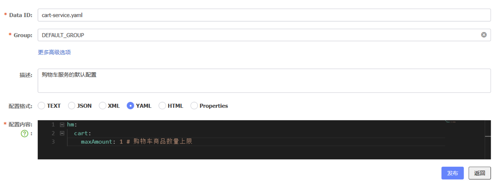

2. 接着，我们在微服务中读取配置，实现配置热更新。在`cart-service`中新建一个属性读取类：

```Java
@Data
@Component
@ConfigurationProperties(prefix = "hm.cart")
public class CartProperties {
    private Integer maxAmount;
}
```

## 动态路由：

- 改路由规则必须重启网关（比如新增一个路由、修改路径匹配规则、更换后端服务地址）。而动态路由就是把路由规则从本地配置文件移到Nacos 配置中心，网关通过监听 Nacos 配置的变化，实时更新路由规则，全程不用重启网关。

1. 在网关gateway引入依赖：

```XML
<!--统一配置管理-->
<dependency>
    <groupId>com.alibaba.cloud</groupId>
    <artifactId>spring-cloud-starter-alibaba-nacos-config</artifactId>
</dependency>
<!--加载bootstrap-->
<dependency>
    <groupId>org.springframework.cloud</groupId>
    <artifactId>spring-cloud-starter-bootstrap</artifactId>
</dependency>
```

2. 在网关`gateway`的`resources`目录创建`bootstrap.yaml`文件，内容如下：

```YAML
spring:
  application:
    name: gateway
  cloud:
    nacos:
      server-addr: 192.168.150.101
      config:
        file-extension: yaml
        shared-configs:
          - dataId: shared-log.yaml # 共享日志配置
```

3. 修改`gateway`的`resources`目录下的`application.yml`，把之前的路由移除，最终内容如下：

```YAML
server:
  port: 8080 # 端口
hm:
  jwt:
    location: classpath:hmall.jks # 秘钥地址
    alias: hmall # 秘钥别名
    password: hmall123 # 秘钥文件密码
    tokenTTL: 30m # 登录有效期
  auth:
    excludePaths: # 无需登录校验的路径
      - /search/**
      - /users/login
      - /items/**
```

4. 在`gateway`中定义配置监听器：

```Java
@Slf4j
@Component
@RequiredArgsConstructor
public class DynamicRouteLoader {
    private final RouteDefinitionWriter writer;
    private final NacosConfigManager nacosConfigManager;
    // 路由配置文件的id和分组
    private final String dataId = "gateway-routes.json";
    private final String group = "DEFAULT_GROUP";
    // 保存更新过的路由id
    private final Set<String> routeIds = new HashSet<>();
    @PostConstruct
    public void initRouteConfigListener() throws NacosException {
        // 1.注册监听器并首次拉取配置
        String configInfo = nacosConfigManager.getConfigService()
                .getConfigAndSignListener(dataId, group, 5000, new Listener() {
                    @Override
                    public Executor getExecutor() {
                        return null;
                    }
                    @Override
                    public void receiveConfigInfo(String configInfo) {
                        updateConfigInfo(configInfo);
                    }
                });
        // 2.首次启动时，更新一次配置
        updateConfigInfo(configInfo);
    }
    private void updateConfigInfo(String configInfo) {
        log.debug("监听到路由配置变更，{}", configInfo);
        // 1.反序列化
        List<RouteDefinition> routeDefinitions = JSONUtil.toList(configInfo, RouteDefinition.class);
        // 2.更新前先清空旧路由
        // 2.1.清除旧路由
        for (String routeId : routeIds) {
            writer.delete(Mono.just(routeId)).subscribe();
        }
        routeIds.clear();
        // 2.2.判断是否有新的路由要更新
        if (CollUtils.isEmpty(routeDefinitions)) {
            // 无新路由配置，直接结束
            return;
        }
        // 3.更新路由
        routeDefinitions.forEach(routeDefinition -> {
            // 3.1.更新路由
            writer.save(Mono.just(routeDefinition)).subscribe();
            // 3.2.记录路由id，方便将来删除
            routeIds.add(routeDefinition.getId());
        });
    }
}
```

5. 在Nacos控制台添加路由，路由文件名为`gateway-routes.json`，类型为`json`：

```JSON
[
    {
        "id": "item",
        "predicates": [{
            "name": "Path",
            "args": {"_genkey_0":"/items/**", "_genkey_1":"/search/**"}
        }],
        "filters": [],
        "uri": "lb://item-service"
    },
    {
        "id": "cart",
        "predicates": [{
            "name": "Path",
            "args": {"_genkey_0":"/carts/**"}
        }],
        "filters": [],
        "uri": "lb://cart-service"
    },
]
```

# 微服务保护和分布式微服务：

## 雪崩问题：

级联失败，在某个微服务中通过feign去同步阻塞地调用其他服务暴露的接口，当被调用的微服务性能下降/宕机，那么调用的微服务也会因此而阻塞，那么该微服务也会因此占住耗费服务的资源（线程池、连接池），从而宕机，这种因微服务链中一个微服务性能下降/宕机而导致整个微服务链逐渐不可用户的过程就是级联失败。有以下解决方法：

- **请求限流:**限制流量在服务可以处理的请求数，避免因突发流量而故障。
- **线程隔离:**控制业务可用的线程数量，将故障隔离在一定范围。
- **服务熔断:**将异常比例过高的接口断开，拒绝所有请求。
- **fallback：**直接走fallback，定义fallback逻辑，让业务失败时不再抛出异常，而是返回默认数据或友好提示。

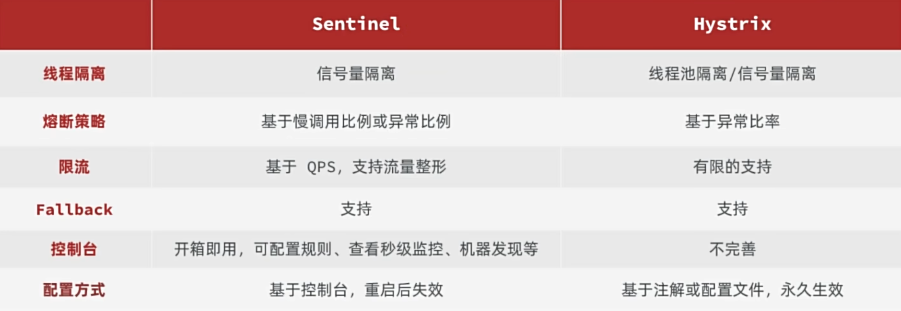

## Sentinel：

- Sentinel是阿里巴巴开源的一款服务保护框架，目前已经加入SpringCloudAlibaba中。

### 使用步骤：

1. 下载并运行sentinel的jar包，访问[http://localhost:8090](http://localhost:8080)页面，就可以看到sentinel的控制台了。
2. 引入sentinel依赖：

```XML
<!--sentinel-->
<dependency>
    <groupId>com.alibaba.cloud</groupId> 
    <artifactId>spring-cloud-starter-alibaba-sentinel</artifactId>
</dependency>
```

3. 修改application.yaml文件，添加下面内容：

```YAML
spring:
  cloud: 
    sentinel:
      transport:
        dashboard: localhost:8090
      http-method-specify: true # 开启请求方式前缀
```

### 簇点链路：

- 所谓簇点链路，就是单机调用链路，是一次请求进入服务后经过的每一个被`Sentinel`监控的资源。默认情况下，`Sentinel`会监控`SpringMVC`的每一个`Endpoint`（接口），也就是controller层定义的RequestMapping。

- 不过Restful风格设计，因此购物车的查询、删除、修改等接口全部都是同样的路径，所以我们可以选择打开Sentinel的请求方式前缀，把`请求方式 + 请求路径`作为簇点资源名。

### 请求限流：

- 在簇点链路后面点击流控按钮，即可对其做限流配置，在弹出的菜单中这样填写（QPS是每秒能接收的访问数）：

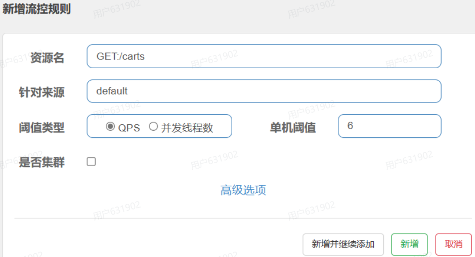

### 线程隔离：

- 线程隔离激素给业务设置最大线程上限，即使这个业务宕机或者访问很慢，他不会占用其他业务的线程其他业务还是会正常运行。如果不进行隔离会导致其他业务的线程被占用导致都卡。

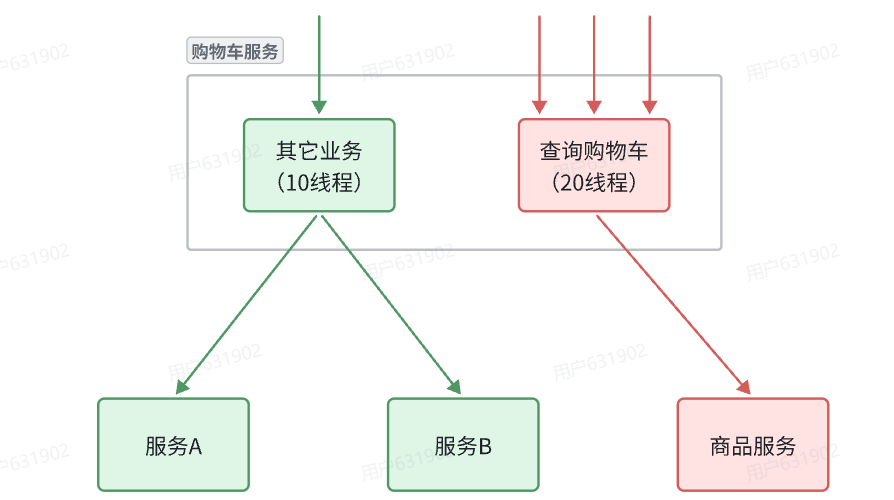

- 方法和请求限流一样，只需要把阈值类型从QPS改为并发线程数。

### Fallback：

- 前面两种方式进行限流或者隔离之后，访问超过限制时只能抛出异常，我们如果不想这样可以通过Fallback来返回自定义内容：

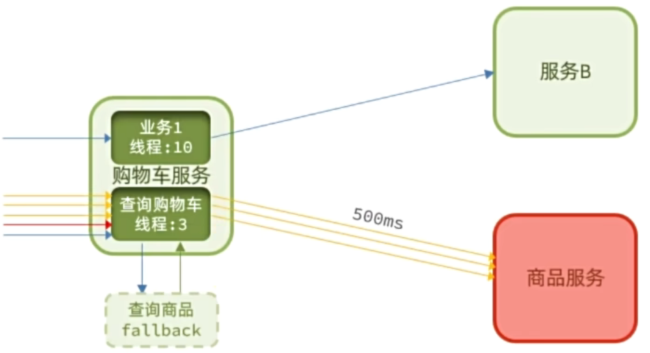

1. 需要修改模块的application.yml文件，开启Feign的sentinel功能，这样可以将Feign远程调用作为簇点资源进行管控：

```yml
feign:
  sentinel:
    enabled: true # 开启feign对sentinel的支持
```

2. 使用FallbackFactory，可以对远程调用的异常做处理，通常都会选择这种。在远程调用模块中自定义类，实现FallbackFactory，编写对某个FeignClient的fallback逻辑:

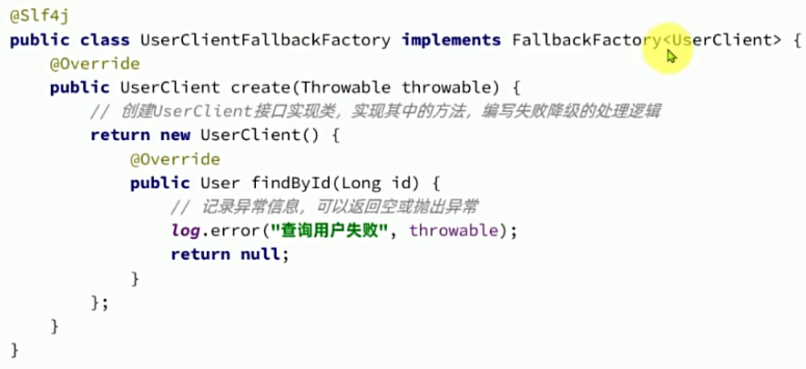

3. 将刚刚定义的UserClientFallbackFactory注册为一个Bean，在UserClient接口中使用UserClientFallbackFactory：

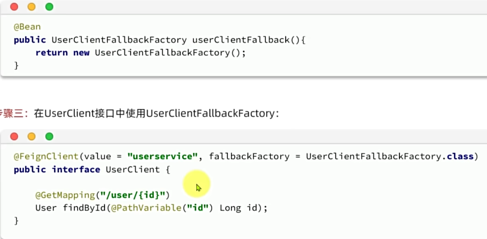

### 服务熔断：

- 当远程服务宕机或者延迟很高的时候，按照上面方法用户每次访问还是会取调用服务，这会造成资源的浪费，所以可以使用熔断的思想，直接将服务断开一段时间，等恢复后再允许访问。
- 状态机包括三个状态：
  - **closed**：关闭状态，断路器放行所有请求，并开始统计异常比例、慢请求比例。超过阈值则切换到open状态
  - **open**：打开状态，服务调用被**熔断**，访问被熔断服务的请求会被拒绝，快速失败，直接走降级逻辑。Open状态持续一段时间后会进入half-open状态
  - **half-open**：半开状态，放行一次请求，根据执行结果来判断接下来的操作。 
    - 请求成功：则切换到closed状态
    - 请求失败：则切换到open状态

1. 我们可以在控制台通过点击簇点后的**`熔断`**按钮来配置熔断策略。

- 熔断与Fallback关系：

- **熔断常常会触发 fallback**：当熔断器打开时，请求不会真正发出，但框架通常会自动调用对应的 fallback 方法。
- **但 fallback 不一定由熔断引起**：即使没有熔断，只要远程调用失败（如超时、异常），也可以触发 fallback。

## 分布式事务：

- 在分布式系统中，如果一个业务需要多个服务合作完成，而且每一个服务都有事务，多个事务必须同时成功或失败，这样的事务就是分布式事务。其中的每个服务的事务就是一个分支事务。整个业务称为全局事务。

### Seata：

#### 简介：

在Seata的事务管理中有三个重要的角色：

-  **TC** **(Transaction Coordinator) -** **事务协调者：**维护全局和分支事务的状态，协调全局事务提交或回滚。 
-  **TM (Transaction Manager) -** **事务管理器：**定义全局事务的范围、开始全局事务、提交或回滚全局事务。 
-  **RM (Resource Manager) -** **资源管理器：**管理分支事务，与TC交谈以注册分支事务和报告分支事务的状态，并驱动分支事务提交或回滚。 

Seata的工作架构如图所示：

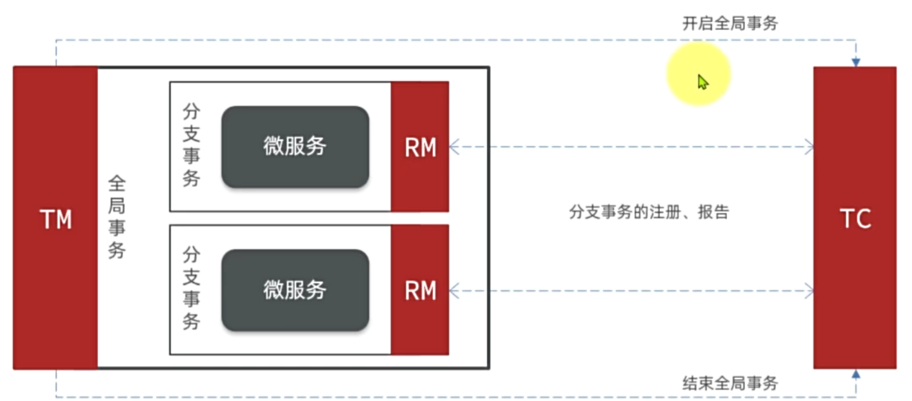

#### 部署TC服务：

1. Seata支持多种存储模式，但考虑到持久化的需要，我们一般选择基于数据库存储。执行课前资料提供的`seata-tc.sql`，导入数据库表：
2. 将整个seata文件夹拷贝到虚拟机的`/root`目录，其中含有配置文件，seata本身也是一个微服务，因此休要配置mysql、nacos等信息。
3. Docker部署，需要注意，要确保nacos、mysql都在同样的网络中。在虚拟机的`/root`目录执行下面的命令：

```Shell
docker run --name seata \
-p 8099:8099 \
-p 7099:7099 \
-e SEATA_IP=192.168.150.101 \
-v ./seata:/seata-server/resources \
--privileged=true \
--network hm-net \
-d \
seataio/seata-server:1.5.2
```

#### 微服务集成Seata：

1. 引入依赖：

```XML
<!--统一配置管理-->
  <dependency>
      <groupId>com.alibaba.cloud</groupId>
      <artifactId>spring-cloud-starter-alibaba-nacos-config</artifactId>
  </dependency>
  <!--读取bootstrap文件-->
  <dependency>
      <groupId>org.springframework.cloud</groupId>
      <artifactId>spring-cloud-starter-bootstrap</artifactId>
  </dependency>
  <!--seata-->
  <dependency>
      <groupId>com.alibaba.cloud</groupId>
      <artifactId>spring-cloud-starter-alibaba-seata</artifactId>
  </dependency>
```

2. 在共享配置中添加配置，让微服务找到TC服务地址。

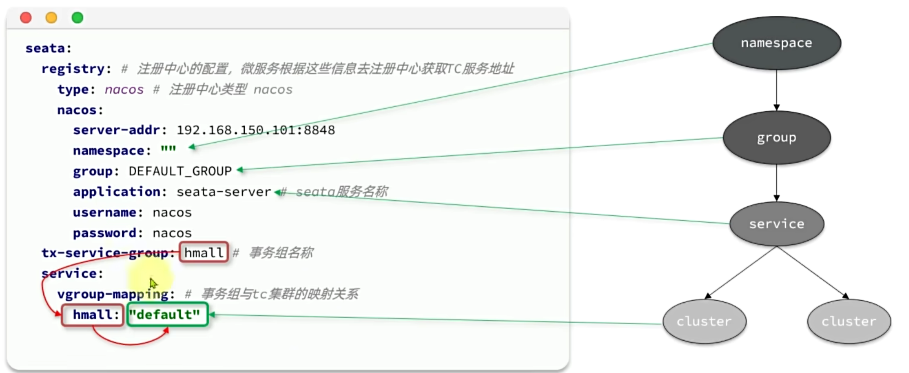

#### XA模式：

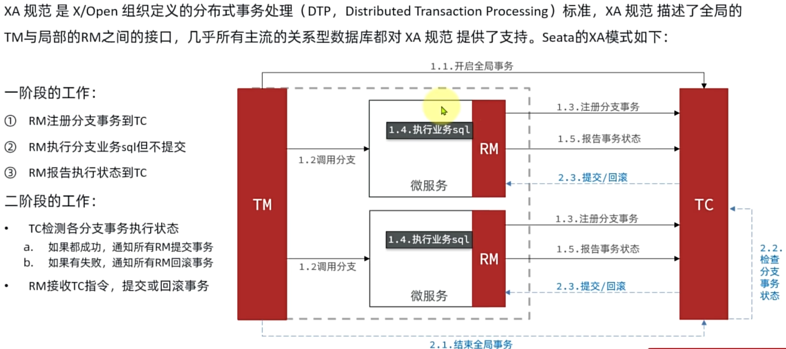

`XA`模式的优点：

- 事务的强一致性，满足ACID原则
- 常用数据库都支持，实现简单，并且没有代码侵入

`XA`模式的缺点：

- 因为一阶段需要锁定数据库资源，等待二阶段结束才释放，性能较差
- 依赖关系型数据库实现事务

- **实现XA模式：**

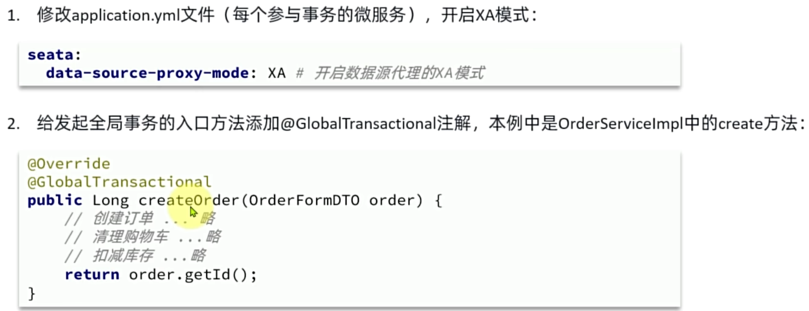

#### AT模式：

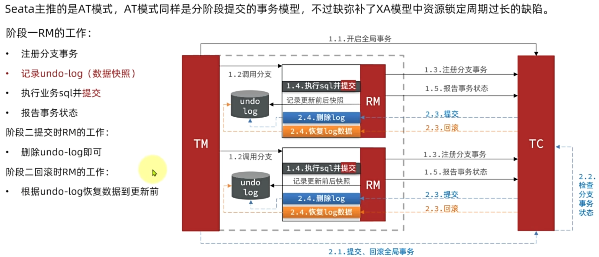

**区别：**

- `XA`模式一阶段不提交事务，锁定资源；`AT`模式一阶段直接提交，不锁定资源。
- `XA`模式依赖数据库机制实现回滚；`AT`模式利用数据快照实现数据回滚。
- `XA`模式强一致；`AT`模式最终一致

**使用：**

1. 在每个需要使用Seata事务管理的模块的数据库中加入undo_log表，保存回滚信息。
2. 修改配置文件为AT模式（默认也是AT）。

# MQ入门：

|            |        RabbitMQ         |            ActiveMQ            |  RocketMQ  |   Kafka    |
| :--------: | :---------------------: | :----------------------------: | :--------: | :--------: |
| 公司/社区  |         Rabbit          |             Apache             |    阿里    |   Apache   |
|  开发语言  |         Erlang          |              Java              |    Java    | Scala&Java |
|  协议支持  | AMQP，XMPP，SMTP，STOMP | OpenWire,STOMP，REST,XMPP,AMQP | 自定义协议 | 自定义协议 |
|   可用性   |           高            |              一般              |     高     |     高     |
| 单机吞吐量 |          一般           |               差               |     高     |   非常高   |
|  消息延迟  |         微秒级          |             毫秒级             |   毫秒级   |  毫秒以内  |
| 消息可靠性 |           高            |              一般              |     高     |    一般    |

追求可用性：Kafka、 RocketMQ 、RabbitMQ

追求可靠性：RabbitMQ、RocketMQ

追求吞吐能力：RocketMQ、Kafka

追求消息低延迟：RabbitMQ、Kafka

## 同步与异步调用：

- 如果我们的业务需要实时得到服务提供方的响应，则应该选择同步通讯（同步调用）。而如果我们追求更高的效率，并且不需要实时响应，则应该选择异步通讯（异步调用）。

- **异步调用优势：**

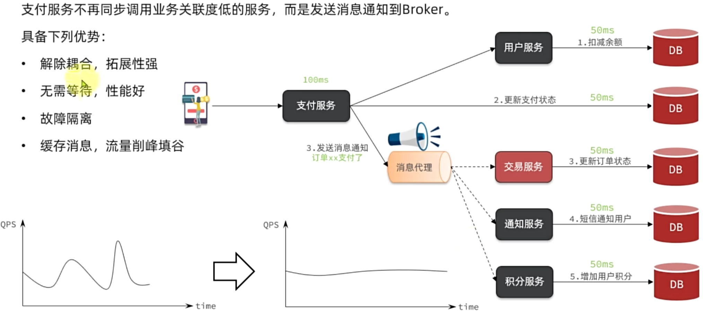

- **异步调用缺点：**不能立即得到调用结果，时效性差；不确定下游业务执行是否成功；业务安全依赖于Broker的可靠性。

## RabbitMQ：

### 安装：

- 在虚拟机上用docker拉取。

```Shell
docker run \
 -e RABBITMQ_DEFAULT_USER=BJ \
 -e RABBITMQ_DEFAULT_PASS=123321 \
 -v mq-plugins:/plugins \
 --name mq \
 --hostname mq \
 -p 15672:15672 \
 -p 5672:5672 \
 --network hm-net\
 -d \
 rabbitmq:3.8-management
```

### 整体架构：

其中包含几个概念：

- **`publisher`**：生产者，也就是发送消息的一方
- **`consumer`**：消费者，也就是消费消息的一方
- **`queue`**：**队列**，存储消息。生产者投递的消息会暂存在消息队列中，等待消费者处理
- **`exchange`**：**交换机**，负责消息路由。生产者发送的消息由交换机决定投递到哪个队列。
- **`virtual host`**：**虚拟主机**，起到数据隔离的作用。每个虚拟主机相互独立，有各自的exchange、queue

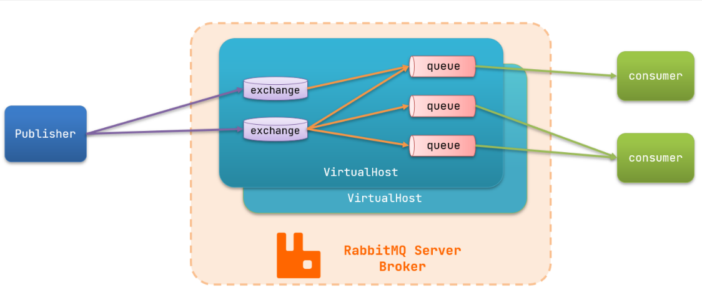

- **数据隔离：**在RabbitMQ中分为不同的用户和不同的虚拟主机，每个用户只能操作自己的虚拟主机。通过虚拟主机将不同项目的交换机和管道隔绝。

### Spring AMQP

由于`RabbitMQ`采用了AMQP协议，因此它具备跨语言的特性。任何语言只要遵循AMQP协议收发消息，都可以与`RabbitMQ`交互。并且`RabbitMQ`官方也提供了各种不同语言的客户端。但是，RabbitMQ官方提供的Java客户端编码相对复杂，一般生产环境下我们更多会结合Spring来使用。而Spring的官方刚好基于RabbitMQ提供了这样一套消息收发的模板工具：SpringAMQP。并且还基于SpringBoot对其实现了自动装配，使用起来非常方便。

1. **引入依赖：**

```xml
    <!--AMQP依赖，包含RabbitMQ-->
    <dependency>
        <groupId>org.springframework.boot</groupId>
        <artifactId>spring-boot-starter-amqp</artifactId>
    </dependency>
```

2. **配置application.yml：**

```YAML
spring:
  rabbitmq:
    host: 192.168.150.101 # 你的虚拟机IP
    port: 5672 # 端口
    virtual-host: /hmall # 虚拟主机
    username: hmall # 用户名
    password: 123 # 密码
```

3. 发消息到消息队列：

```Java
public class SpringAmqpTest {
    @Autowired
    private RabbitTemplate rabbitTemplate;
    @Test
    public void testSimpleQueue() {
        // 队列名称
        String queueName = "simple.queue";
        // 消息
        String message = "hello, spring amqp!";
        // 发送消息
        rabbitTemplate.convertAndSend(queueName, message);
    }
}
```

4. 接收消息：

```Java
@Component
public class SpringRabbitListener {
    // 利用RabbitListener来声明要监听的队列信息
    // 将来一旦监听的队列中有了消息，就会推送给当前服务，调用当前方法，处理消息。
    // 可以看到方法体中接收的就是消息体的内容
    @RabbitListener(queues = "simple.queue")
    public void listenSimpleQueueMessage(String msg) throws InterruptedException {
        System.out.println("spring 消费者接收到消息：【" + msg + "】");
    }
}
```

### WorkQueues模型

- Work queues，任务模型。简单来说就是**让多个消费者绑定到一个队列，共同消费队列中的消息**。

- 默认消息是平均分配给每个消费者，并没有考虑到消费者的处理能力。在spring中有一个简单的配置，可以解决这个问题。我们修改consumer服务的application.yml文件，添加配置：

```YAML
spring:
  rabbitmq:
    listener:
      simple:
        prefetch: 1 # 每次只能获取一条消息，处理完成才能获取下一个消息
```

### Fanout交换机：

- Fanout Exchange会将接收到的消息路由到每一个跟其绑定的queue，所以也叫广播模式，这个也是默认交换机模式。
- 发送消息到交换机与发送到队列使用的参数有所不同：

```Java
@Test
public void testFanoutExchange() {
    // 交换机名称
    String exchangeName = "hmall.fanout";
    // 消息
    String message = "hello, everyone!";
    rabbitTemplate.convertAndSend(exchangeName, "", message);
}
```

### Direct交换机：

在Direct模型下：需要在创建交换机的时候设选择Direct类型。

- 队列与交换机的绑定，不能是任意绑定了，而是要指定一个`RoutingKey`（路由key）。
- 消息的发送方在 向 Exchange发送消息时，也必须指定消息的 `RoutingKey`。
- Exchange不再把消息交给每一个绑定的队列，而是根据消息的`Routing Key`进行判断，只有队列的`Routingkey`与消息的 `Routing key`完全一致，才会接收到消息。
- 如果这个key相同则会跟Fanout交换机一样。

### Topic交换机：

- TopicExchange也是基于RoutingKey做消息路由，但是routingKey通常是多个单词的组合，并且以.分割。需要在创建交换机的时候选择Topic类型。

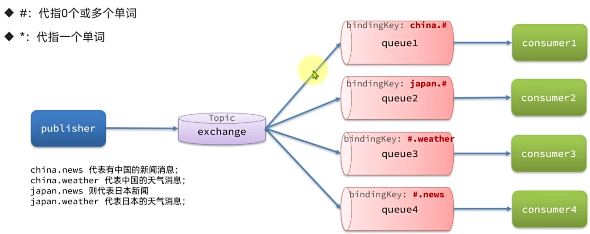

### 代码生成交换机和队列：

- 基于@Bean的方式声明队列和交换机

```Java
@Configuration
public class DirectConfig {
    /**
     * 声明交换机
     * @return Direct类型交换机
     */
    @Bean
    public DirectExchange directExchange(){
        return ExchangeBuilder.directExchange("hmall.direct").build();
    }
    /**
     * 第1个队列
     */
    @Bean
    public Queue directQueue1(){
        return new Queue("direct.queue1");
    }
    /**
     * 绑定队列和交换机
     */
    @Bean
    public Binding bindingQueue1WithRed(Queue directQueue1, DirectExchange directExchange){
        return BindingBuilder.bind(directQueue1).to(directExchange).with("red");
    }
}
```

- Spring还提供了基于注解方式来声明：

```Java
//direct交换机
@RabbitListener(bindings = @QueueBinding(
    value = @Queue(name = "direct.queue1"),
    exchange = @Exchange(name = "hmall.direct", type = ExchangeTypes.DIRECT),
    key = {"red", "blue"}
))
public void listenDirectQueue1(String msg){
    System.out.println("消费者1接收到direct.queue1的消息：【" + msg + "】");
}
//topic交换机
@RabbitListener(bindings = @QueueBinding(
    value = @Queue(name = "topic.queue1"),
    exchange = @Exchange(name = "hmall.topic", type = ExchangeTypes.TOPIC),
    key = "china.#"
))
public void listenTopicQueue2(String msg){
    System.out.println("消费者2接收到topic.queue1的消息：【" + msg + "】");
}
```

### 消息转换器：

- Spring的对消息处理是默认实现是SimpleMessageConverter，存在很多问题：有安全风险、消息太大、可读性差。所以我们需要配置json转化器，转为json传输。

1. 在`publisher`和`consumer`两个服务中都引入依赖：

```XML
<dependency>
    <groupId>com.fasterxml.jackson.dataformat</groupId>
    <artifactId>jackson-dataformat-xml</artifactId>
    <version>2.9.10</version>
</dependency>
```

2. 配置消息转换器，在`publisher`和`consumer`两个服务的启动类中添加一个Bean即可：

```Java
@Bean
public MessageConverter messageConverter(){
    // 1.定义消息转换器
    Jackson2JsonMessageConverter jackson2JsonMessageConverter = new Jackson2JsonMessageConverter();
    // 2.配置自动创建消息id，用于识别不同消息，也可以在业务中基于ID判断是否是重复消息
    jackson2JsonMessageConverter.setCreateMessageIds(true);
    return jackson2JsonMessageConverter;
}
```

# MQ高级：

## 生产者可靠性：

### 生产者重连：

- 首先第一种情况，就是生产者发送消息时，出现了网络故障，导致与MQ的连接中断。为了解决这个问题，SpringAMQP提供的消息发送时的重试机制。即：当`RabbitTemplate`与MQ连接超时后，多次重试。
- 修改`publisher`模块的`application.yaml`文件，添加下面的内容：

```YAML
spring:
  rabbitmq:
    connection-timeout: 1s # 设置MQ的连接超时时间
    template:
      retry:
        enabled: true # 开启超时重试机制
        initial-interval: 1000ms # 失败后的初始等待时间
        multiplier: 1 # 失败后下次的等待时长倍数，下次等待时长 = initial-interval * multiplier
        max-attempts: 3 # 最大重试次数
```

- 当网络不稳定的时候，利用重试机制可以有效提高消息发送的成功率。不过SpringAMQP提供的重试机制是**阻塞式**的重试，也就是说多次重试等待的过程中，当前线程是被阻塞的。

### 生产者确认：

RabbitMQ提供了生产者消息确认机制，包括`Publisher Confirm`和`Publisher Return`两种。在开启确认机制的情况下，当生产者发送消息给MQ后，MQ会根据消息处理的情况返回不同的**回执**。

- 当消息投递到MQ，但是路由失败时，通过**Publisher Return**返回异常信息，同时返回ACK的确认信息，代表投递成功
- 临时消息投递到了MQ，并且入队成功，返回ACK，告知投递成功
- 持久消息投递到了MQ，并且入队完成持久化，返回ACK ，告知投递成功
- 其它情况都会返回NACK，告知投递失败

1. 在publisher模块的`application.yaml`中添加配置：

```YAML
spring:
  rabbitmq:
    publisher-confirm-type: correlated # 开启publisher confirm机制，并设置confirm类型
    publisher-returns: true # 开启publisher return机制
```

这里`publisher-confirm-type`有三种模式可选：一般我们推荐使用`correlated`，回调机制。

- `none`：关闭confirm机制
- `simple`：同步阻塞等待MQ的回执
- `correlated`：MQ异步回调返回回执

2. 定义ReturnCallback:每个`RabbitTemplate`只能配置一个`ReturnCallback`，因此我们可以在配置类中统一设置。我们在publisher模块定义一个配置类

```Java
@Slf4j
@AllArgsConstructor
@Configuration
public class MqConfig {
    private final RabbitTemplate rabbitTemplate;
    @PostConstruct
    public void init(){
        rabbitTemplate.setReturnsCallback(new RabbitTemplate.ReturnsCallback() {
            @Override
            public void returnedMessage(ReturnedMessage returned) {
                log.error("触发return callback,");
                log.debug("exchange: {}", returned.getExchange());
                log.debug("routingKey: {}", returned.getRoutingKey());
                log.debug("message: {}", returned.getMessage());
                log.debug("replyCode: {}", returned.getReplyCode());
                log.debug("replyText: {}", returned.getReplyText());
            }
        });
    }
}
```

3. 定义ConfirmCallback:由于每个消息发送时的处理逻辑不一定相同，因此ConfirmCallback需要在每次发消息时定义。具体来说，是在调用RabbitTemplate中的convertAndSend方法时，多传递一个参数

```Java
@Test
void testPublisherConfirm() {
    // 1.创建CorrelationData
    CorrelationData cd = new CorrelationData();
    // 2.给Future添加ConfirmCallback
    cd.getFuture().addCallback(new ListenableFutureCallback<CorrelationData.Confirm>() {
        @Override
        public void onFailure(Throwable ex) {
            // 2.1.Future发生异常时的处理逻辑，基本不会触发
            log.error("send message fail", ex);
        }
        @Override
        public void onSuccess(CorrelationData.Confirm result) {
            // 2.2.Future接收到回执的处理逻辑，参数中的result就是回执内容
            if(result.isAck()){ // result.isAck()，boolean类型，true代表ack回执，false 代表 nack回执
                log.debug("发送消息成功，收到 ack!");
            }else{ // result.getReason()，String类型，返回nack时的异常描述
                log.error("发送消息失败，收到 nack, reason : {}", result.getReason());
            }
        }
    });
    // 3.发送消息
    rabbitTemplate.convertAndSend("hmall.direct", "q", "hello", cd);
}
```

## MQ可靠性：

### 数据持久化：

为了提升性能，默认情况下MQ的数据都是在内存存储的（只有内存占满才会写入磁盘）临时数据，重启后就会消失。为了保证数据的可靠性，必须配置数据持久化（将数据写入磁盘），包括：

- 交换机持久化
- 队列持久化
- 消息持久化

1. 在创建交换机和队列的时候选择Durable选项就是持久化（默认也是持久化）。
2. 在发送队列的时候选择persistent选项就是持久化（rabbitTemplate发送消息默认持久化）。

### Lazy Queue

为了解决消息先保存到内存再保存到磁盘占用资源问题，从RabbitMQ的3.6.0版本开始，就增加了Lazy Queues的模式，也就是惰性队列。而在3.12版本之后，Lazy Queue已经成为所有队列的默认格式。因此官方推荐升级MQ为3.12版本或者所有队列都设置为Lazy Queue模式。惰性队列的特征如下：

- 接收到消息后直接存入磁盘而非内存
- 消费者要消费消息时才会从磁盘中读取并加载到内存（也就是懒加载）
- 支持数百万条的消息存储

## 消费者可靠性：

### 消费者确认：

为了确认消费者是否成功处理消息，RabbitMQ提供了消费者确认机制。当消费者处理消息结束后，应该向RabbitMQ发送一个回执，告知RabbitMQ自己消息处理状态。回执有三种可选值：

- ack：成功处理消息，RabbitMQ从队列中删除该消息
- nack：消息处理失败，RabbitMQ需要再次投递消息
- reject：消息处理失败并拒绝该消息，RabbitMQ从队列中删除该消息

由于消息回执的处理代码比较统一，因此SpringAMQP帮我们实现了消息确认。并允许我们通过配置文件设置ACK处理方式，有三种模式：

- **`none`**：不处理。即消息投递给消费者后立刻ack，消息会立刻从MQ删除。非常不安全，不建议使用
- **`manual`**：手动模式。需要自己在业务代码中调用api，发送`ack`或`reject`，存在业务入侵，但更灵活
- **`auto`**：自动模式。SpringAMQP利用AOP对我们的消息处理逻辑做了环绕增强，当业务正常执行时则自动返回`ack`.  当业务出现异常时，根据异常判断返回不同结果：
  - 如果是**业务异常**，会自动返回`nack`；
  - 如果是**消息处理或校验异常**，自动返回`reject`;

1. 通过下面的配置可以修改SpringAMQP的ACK处理方式：

```YAML
spring:
  rabbitmq:
    listener:
      simple:
        acknowledge-mode: none # 不做处理
```

### 失败重试：

当消费者出现异常后，消息会不断requeue（重入队）到队列，再重新发送给消费者。如果消费者再次执行依然出错，消息会再次requeue到队列，再次投递，直到消息处理成功为止。导致mq的消息处理飙升，带来不必要的压力。为了应对上述情况Spring又提供了消费者失败重试机制：在消费者出现异常时利用本地重试，而不是无限制的requeue到mq队列。

1. 修改consumer服务的application.yml文件，添加内容：

```YAML
spring:
  rabbitmq:
    listener:
      simple:
        retry:
          enabled: true # 开启消费者失败重试
          initial-interval: 1000ms # 初识的失败等待时长为1秒
          multiplier: 1 # 失败的等待时长倍数，下次等待时长 = multiplier * last-interval
          max-attempts: 3 # 最大重试次数
          stateless: true # true无状态；false有状态。如果业务中包含事务，这里改为false
```

2. 如果超过重试次数，默认会返回reject，丢弃消息。比较优雅的一种处理方案是`RepublishMessageRecoverer`，失败后将消息投递到一个指定的，专门存放异常消息的队列，后续由人工集中处理：

```Java
@Configuration
@ConditionalOnProperty(name = "spring.rabbitmq.listener.simple.retry.enabled", havingValue = "true")
public class ErrorMessageConfig {
    @Bean
    public DirectExchange errorMessageExchange(){
        return new DirectExchange("error.direct");
    }
    @Bean
    public Queue errorQueue(){
        return new Queue("error.queue", true);
    }
    @Bean
    public Binding errorBinding(Queue errorQueue, DirectExchange errorMessageExchange){
        return BindingBuilder.bind(errorQueue).to(errorMessageExchange).with("error");
    }
    @Bean
    public MessageRecoverer republishMessageRecoverer(RabbitTemplate rabbitTemplate){
        return new RepublishMessageRecoverer(rabbitTemplate, "error.direct", "error");
    }
}
```

### 业务幂等性：

**幂等**是一个数学概念，用函数表达式来描述是这样的：`f(x) = f(f(x))`，例如求绝对值函数。在程序开发中，则是指同一个业务，执行一次或多次对业务状态的影响是一致的。但数据的更新往往不是幂等的，如果重复执行可能造成不一样的后果，这里给出两种方案：

1. **唯一消息ID：**每一条消息都生成一个唯一的id，与消息一起投递给消费者。消费者接收到消息后处理自己的业务，业务处理成功后将消息ID保存到数据库如果下次又收到相同消息，去数据库查询判断是否存在，存在则为重复消息放弃处理。

给消息添加唯一ID其实很简单，SpringAMQP的MessageConverter自带了MessageID的功能，我们只要开启这个功能即可。以Jackson的消息转换器为例：

```Java
@Bean
public MessageConverter messageConverter(){
    // 1.定义消息转换器
    Jackson2JsonMessageConverter jjmc = new Jackson2JsonMessageConverter();
    // 2.配置自动创建消息id，用于识别不同消息，也可以在业务中基于ID判断是否是重复消息
    jjmc.setCreateMessageIds(true);
    return jjmc;
}
```

2. **业务状态判断：**业务判断就是基于业务本身的逻辑或状态来判断是否是重复的请求或消息，不同的业务场景判断的思路也不一样。例如我们当前案例中，处理消息的业务逻辑是把订单状态从未支付修改为已支付。因此我们就可以在执行业务时判断订单状态是否是未支付，如果不是则证明订单已经被处理过，无需重复处理。

```Java
@Override
public void markOrderPaySuccess(Long orderId) {
    // UPDATE `order` SET status = ? , pay_time = ? WHERE id = ? AND status = 1
    lambdaUpdate()
            .set(Order::getStatus, 2)
            .set(Order::getPayTime, LocalDateTime.now())
            .eq(Order::getId, orderId)
            .eq(Order::getStatus, 1)
            .update();
}
```

## 延迟消息：

在一段时间以后才执行的任务，我们称之为**延迟任务**，而要实现延迟任务，最简单的方案就是利用MQ的延迟消息了。

### 死信交换机：

当一个队列中的消息满足下列情况之一时，可以成为死信（dead letter）：

- 消费者使用`basic.reject`或 `basic.nack`声明消费失败，并且消息的`requeue`参数设置为false
- 消息是一个过期消息，超时无人消费
- 要投递的队列消息满了，无法投递

1. 可以通过这样的结构利用死信交换机完成延迟消息：

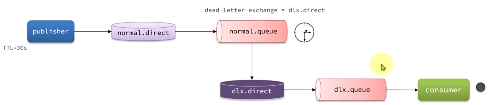

### 延迟消息插件：

- 基于死信队列虽然可以实现延迟消息，但是太麻烦了。因此RabbitMQ社区提供了一个延迟消息插件来实现相同的效果。需要自行安装。

1. 生成延迟交换机：

```Java
@RabbitListener(bindings = @QueueBinding(
        value = @Queue(name = "delay.queue", durable = "true"),
        exchange = @Exchange(name = "delay.direct", delayed = "true"),
        key = "delay"
))
public void listenDelayMessage(String msg){
    log.info("接收到delay.queue的延迟消息：{}", msg);
}
```

2. 发送消息时，必须通过x-delay属性设定延迟时间：

```Java
@Test
void testPublisherDelayMessage() {
    // 1.创建消息
    String message = "hello, delayed message";
    // 2.发送消息，利用消息后置处理器添加消息头
    rabbitTemplate.convertAndSend("delay.direct", "delay", message, new MessagePostProcessor() {
        @Override
        public Message postProcessMessage(Message message) throws AmqpException {
            // 添加延迟消息属性
            message.getMessageProperties().setDelay(5000);
            return message;
        }
    });
}
```

## 取消超时订单：

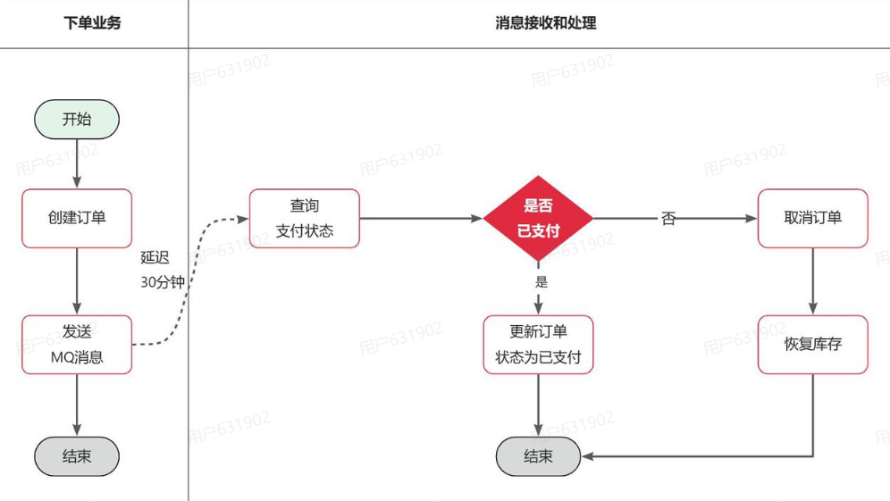

# Elasticsearch：

Elasticsearch是由elastic公司开发的一套搜索引擎技术，它是elastic技术栈中的一部分，整套技术栈被称为ELK，经常用来做日志收集、系统监控和状态分析等等。完整的技术栈包括：

- Elasticsearch：用于数据存储、计算和搜索
- Logstash/Beats：用于数据收集
- Kibana：用于数据可视化

## 安装：

我们要安装的内容包含2部分：

- elasticsearch：存储、搜索和运算
- kibana：图形化展示

1. 通过下面的Docker命令即可安装单机版本的elasticsearch：我们采用的是elasticsearch的7.12.1版本，由于8以上版本的JavaAPI变化很大，在企业中应用并不广泛，企业中应用较多的还是8以下的版本。

```Bash
docker run -d \
  --name es \
  -e "ES_JAVA_OPTS=-Xms512m -Xmx512m" \
  -e "discovery.type=single-node" \
  -v es-data:/usr/share/elasticsearch/data \
  -v es-plugins:/usr/share/elasticsearch/plugins \
  --privileged \
  --network hm-net \
  -p 9200:9200 \
  -p 9300:9300 \
  elasticsearch:7.12.1
```

2. 通过下面的Docker命令，即可部署Kibana：

```Bash
docker run -d \
--name kibana \
-e ELASTICSEARCH_HOSTS=http://es:9200 \
--network=hm-net \
-p 5601:5601  \
kibana:7.12.1
```

## 初识ES：

### 倒排索引：

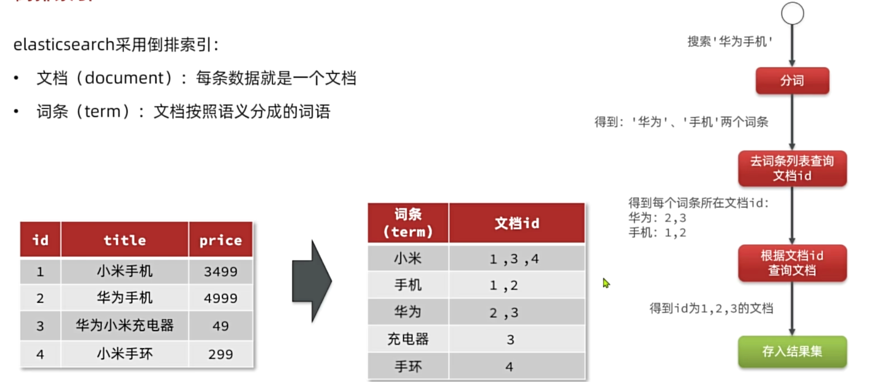

### IK分词器：

1. Elasticsearch的关键就是倒排索引，而倒排索引依赖于对文档内容的分词，而分词则需要高效、精准的分词算法，IK分词器就是这样一个中文分词算法。**需要手动安装。**

**IK分词器包含两种模式：**

-  `ik_smart`：智能语义切分 
-  `ik_max_word`：最细粒度切分 

**拓展词典：**利用config目录的IkAnalyzer.cfg.xml文件添加拓展词典，在词典中添加拓展词条。

### 基础概念：

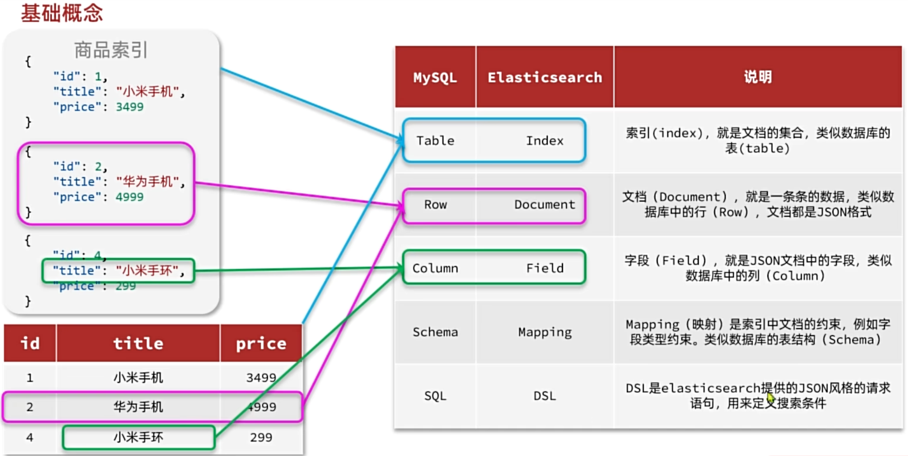

## 索引库操作：

### Mapping映射属性

Mapping是对索引库中文档的约束，常见的Mapping属性包括：

- `type`：字段数据类型，常见的简单类型有： 
  - 字符串：`text`（可分词的文本）、`keyword`（精确值，例如：品牌、国家、ip地址）
  - 数值：`long`、`integer`、`short`、`byte`、`double`、`float`、
  - 布尔：`boolean`
  - 日期：`date`
  - 对象：`object`
- `index`：是否创建索引，默认为`true`
- `analyzer`：使用哪种分词器
- `properties`：该字段的子字段

### 索引库CRUD：

1. **`创建索引库和映射：`**

- 请求方式：`PUT`
- 请求路径：`/索引库名`，可以自定义
- 请求参数：`mapping`映射

**示例：**

```JSON
# PUT /heima
{
  "mappings": {
    "properties": {
      "info":{
        "type": "text",
        "analyzer": "ik_smart"
      },
      "email":{
        "type": "keyword",
        "index": "false"
      },
      "name":{
        "properties": {
          "firstName": {
            "type": "keyword"
          }
        }
      }
    }
  }
}
```

2. **`查询索引库：`**

-  请求方式：GET 
-  请求路径：/索引库名 
-  请求参数：无 

**格式**：

```Plain
GET /索引库名
```

3. **`删除索引库：`**

-  请求方式：DELETE 
-  请求路径：/索引库名 
-  请求参数：无 

**格式：**

```Plain
DELETE /索引库名
```

4. **`修改索引库：`**索引库不能修改，但是可以添加新字段。

**示例**：

```JSON
PUT /heima/_mapping
{
  "properties": {
    "age":{
      "type": "integer"
    }
  }
}
```

## 文档操作：

### 文档CRUD：

1. **`新增文档`：**

**语法：**

```JSON
POST /索引库名/_doc/文档id
{
    "字段1": "值1",
    "字段2": "值2",
    "字段3": {
        "子属性1": "值3",
        "子属性2": "值4"
    },
}
```

2. **`查询文档`：**

**语法：**

```JSON
GET /{索引库名称}/_doc/{id}
```

3. **`删除文档：`**

**语法：**

```JavaScript
DELETE /{索引库名}/_doc/id值
```

4. **`修改文档：`**

a.**全量修改：**全量修改是覆盖原来的文档，其本质是两步操作：根据指定的id删除文档，新增一个相同id的文档。**注意**：如果根据id删除时，id不存在，第二步的新增也会执行，也就从修改变成了新增操作了。

**语法：**

```JSON
PUT /{索引库名}/_doc/文档id
{
    "字段1": "值1",
    "字段2": "值2",
    // ... 略
}
```

b.**局部修改：**局部修改是只修改指定id匹配的文档中的部分字段。

**语法：**

```JSON
POST /{索引库名}/_update/文档id
{
    "doc": {
        "字段名": "新的值",
    }
}
```

### 批处理：

批处理采用POST请求，基本语法如下：

```Java
POST _bulk
{ "index" : { "_index" : "test", "_id" : "1" } }
{ "field1" : "value1" }
{ "delete" : { "_index" : "test", "_id" : "2" } }
{ "create" : { "_index" : "test", "_id" : "3" } }
{ "field1" : "value3" }
{ "update" : {"_id" : "1", "_index" : "test"} }
{ "doc" : {"field2" : "value2"} }
```

其中：

- `index`代表新增操作
  - `_index`：指定索引库名
  - `_id`指定要操作的文档id
  - `{ "field1" : "value1" }`：则是要新增的文档内容
- `delete`代表删除操作
  - `_index`：指定索引库名
  - `_id`指定要操作的文档id
- `update`代表更新操作
  - `_index`：指定索引库名
  - `_id`指定要操作的文档id
  - `{ "doc" : {"field2" : "value2"} }`：要更新的文档字段

## JavaRestClient：

### 初始化：

1）引入`es`的`RestHighLevelClient`依赖：

```XML
<dependency>
    <groupId>org.elasticsearch.client</groupId>
    <artifactId>elasticsearch-rest-high-level-client</artifactId>
</dependency>
```

2）因为SpringBoot默认的ES版本是`7.17.10`，所以我们需要覆盖默认的ES版本：

```XML
  <properties>
      <elasticsearch.version>7.12.1</elasticsearch.version>
  </properties>
```

3）初始化RestHighLevelClient初始化的代码如下：

```Java
RestHighLevelClient client = new RestHighLevelClient(RestClient.builder(
        HttpHost.create("http://192.168.150.101:9200")
));
```

### 索引库操作：

1. **新增：**

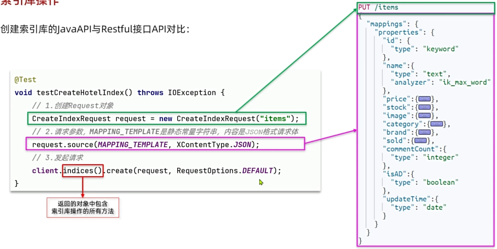

2. **查询/删除：**

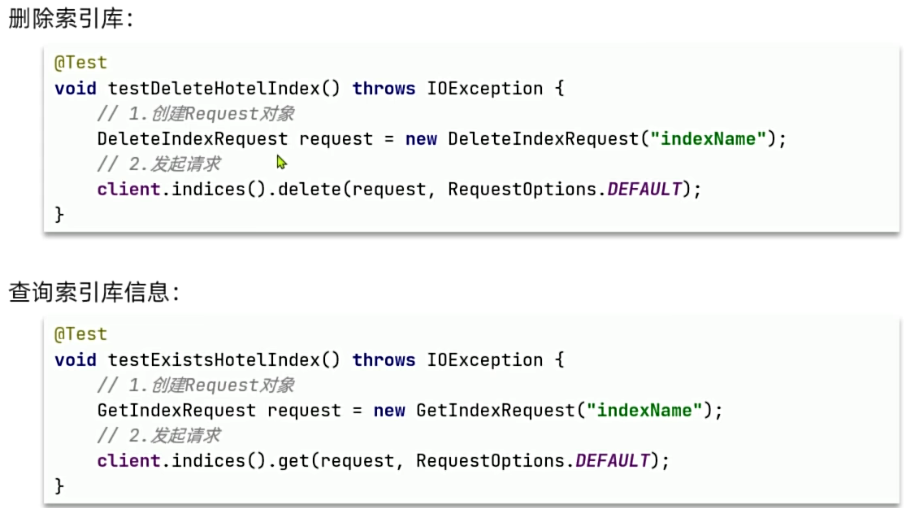

### 文档操作：

1. 新增文档：也是全量修改的API

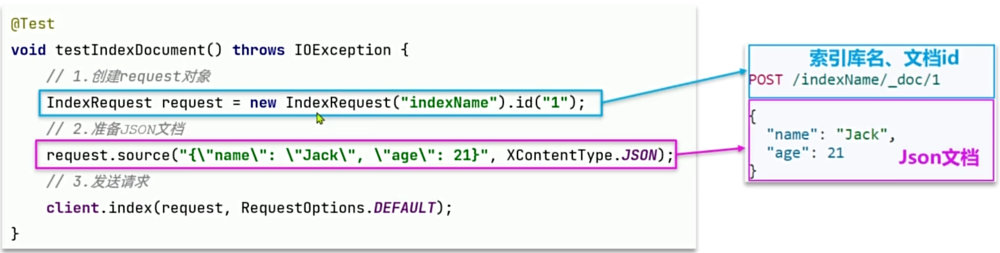

2. 查询文档：

```Java
@Test
void testGetDocumentById() throws IOException {
    // 1.准备Request对象
    GetRequest request = new GetRequest("items").id("100002644680");
    // 2.发送请求
    GetResponse response = client.get(request, RequestOptions.DEFAULT);
    // 3.获取响应结果中的source
    String json = response.getSourceAsString();
    
    ItemDoc itemDoc = JSONUtil.toBean(json, ItemDoc.class);
    System.out.println("itemDoc= " + ItemDoc);
}
```

3. 删除文档：

```Java
@Test
void testDeleteDocument() throws IOException {
    // 1.准备Request，两个参数，第一个是索引库名，第二个是文档id
    DeleteRequest request = new DeleteRequest("item", "100002644680");
    // 2.发送请求
    client.delete(request, RequestOptions.DEFAULT);
}
```

4. 修改文档（局部修改）：

```Java
@Test
void testUpdateDocument() throws IOException {
    // 1.准备Request
    UpdateRequest request = new UpdateRequest("items", "100002644680");
    // 2.准备请求参数
    request.doc(
            "price", 58800,
            "commentCount", 1
    );
    // 3.发送请求
    client.update(request, RequestOptions.DEFAULT);
}
```

5. 批处理：

```Java
@Test
void testBulk() throws IOException {
    // 1.创建Request
    BulkRequest request = new BulkRequest();
    // 2.准备请求参数
    request.add(new IndexRequest("items").id("1").source("json doc1", XContentType.JSON));
    request.add(new IndexRequest("items").id("2").source("json doc2", XContentType.JSON));
    // 3.发送请求
    client.bulk(request, RequestOptions.DEFAULT);
}
```

### 查询：

#### 入门：

- 查询：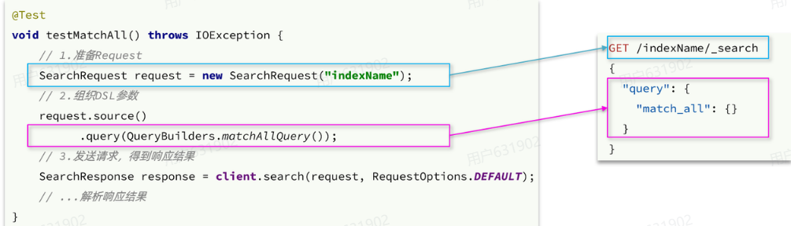

- 解析：

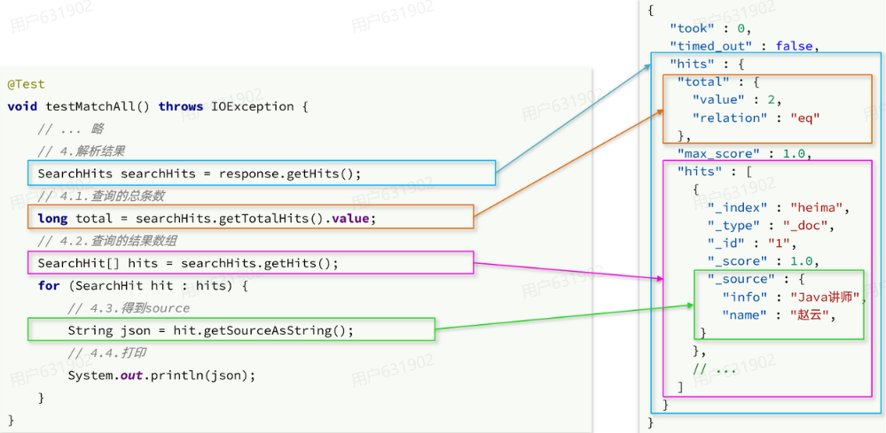

#### 叶子查询：

所有的查询条件都是由QueryBuilders来构建的，叶子查询也不例外。因此整套代码中变化的部分仅仅是query条件构造的方式，其它不动。

例如`match`查询：

```Java
@Test
void testMatch() throws IOException {
    // 1.创建Request
    SearchRequest request = new SearchRequest("items");
    // 2.组织请求参数
    request.source().query(QueryBuilders.matchQuery("name", "脱脂牛奶"));
    // 3.发送请求
    SearchResponse response = client.search(request, RequestOptions.DEFAULT);
    // 4.解析响应
    handleResponse(response);
}
```

再比如`multi_match`查询：

```Java
@Test
void testMultiMatch() throws IOException {
    // 1.创建Request
    SearchRequest request = new SearchRequest("items");
    // 2.组织请求参数
    request.source().query(QueryBuilders.multiMatchQuery("脱脂牛奶", "name", "category"));
    // 3.发送请求
    SearchResponse response = client.search(request, RequestOptions.DEFAULT);
    // 4.解析响应
    handleResponse(response);
}
```

还有`range`查询：

```Java
@Test
void testRange() throws IOException {
    // 1.创建Request
    SearchRequest request = new SearchRequest("items");
    // 2.组织请求参数
    request.source().query(QueryBuilders.rangeQuery("price").gte(10000).lte(30000));
    // 3.发送请求
    SearchResponse response = client.search(request, RequestOptions.DEFAULT);
    // 4.解析响应
    handleResponse(response);
}
```

还有`term`查询：

```Java
@Test
void testTerm() throws IOException {
    // 1.创建Request
    SearchRequest request = new SearchRequest("items");
    // 2.组织请求参数
    request.source().query(QueryBuilders.termQuery("brand", "华为"));
    // 3.发送请求
    SearchResponse response = client.search(request, RequestOptions.DEFAULT);
    // 4.解析响应
    handleResponse(response);
}
```

#### 复合查询：

- 复合查询也是由`QueryBuilders`来构建，我们以`bool`查询为例：

```Java
@Test
void testBool() throws IOException {
    // 1.创建Request
    SearchRequest request = new SearchRequest("items");
    // 2.组织请求参数
    // 2.1.准备bool查询
    BoolQueryBuilder bool = QueryBuilders.boolQuery();
    // 2.2.关键字搜索
    bool.must(QueryBuilders.matchQuery("name", "脱脂牛奶"));
    // 2.3.品牌过滤
    bool.filter(QueryBuilders.termQuery("brand", "德亚"));
    // 2.4.价格过滤
    bool.filter(QueryBuilders.rangeQuery("price").lte(30000));
    request.source().query(bool);
    // 3.发送请求
    SearchResponse response = client.search(request, RequestOptions.DEFAULT);
    // 4.解析响应
    handleResponse(response);
}
```

#### 排序&分页：

`requeset.source()`就是整个请求JSON参数，所以排序、分页都是基于这个来设置：

```Java
@Test
void testPageAndSort() throws IOException {
    int pageNo = 1, pageSize = 5;
    // 1.创建Request
    SearchRequest request = new SearchRequest("items");
    // 2.组织请求参数
    // 2.1.搜索条件参数
    request.source().query(QueryBuilders.matchQuery("name", "脱脂牛奶"));
    // 2.2.排序参数
    request.source().sort("price", SortOrder.ASC);
    // 2.3.分页参数
    request.source().from((pageNo - 1) * pageSize).size(pageSize);
    // 3.发送请求
    SearchResponse response = client.search(request, RequestOptions.DEFAULT);
    // 4.解析响应
    handleResponse(response);
}
```

#### 高亮显示：

高亮查询与前面的查询有两点不同：

- 条件同样是在`request.source()`中指定，只不过高亮条件要基于`HighlightBuilder`来构造

```Java
@Test
void testHighlight() throws IOException {
    // 1.创建Request
    SearchRequest request = new SearchRequest("items");
    // 2.组织请求参数
    // 2.1.query条件
    request.source().query(QueryBuilders.matchQuery("name", "脱脂牛奶"));
    // 2.2.高亮条件
    request.source().highlighter(
            SearchSourceBuilder.highlight()
                    .field("name")
                    .preTags("<em>")
                    .postTags("</em>")
    );
    // 3.发送请求
    SearchResponse response = client.search(request, RequestOptions.DEFAULT);
    // 4.解析响应
    handleResponse(response);
}
```

- 高亮响应结果与搜索的文档结果不在一起，需要单独解析：

```Java
private void handleResponse(SearchResponse response) {
    SearchHits searchHits = response.getHits();
    // 1.获取总条数
    long total = searchHits.getTotalHits().value;
    System.out.println("共搜索到" + total + "条数据");
    // 2.遍历结果数组
    SearchHit[] hits = searchHits.getHits();
    for (SearchHit hit : hits) {
        // 3.得到_source，也就是原始json文档
        String source = hit.getSourceAsString();
        // 4.反序列化
        ItemDoc item = JSONUtil.toBean(source, ItemDoc.class);
        // 5.获取高亮结果
        Map<String, HighlightField> hfs = hit.getHighlightFields();
        if (CollUtils.isNotEmpty(hfs)) {
            // 5.1.有高亮结果，获取name的高亮结果
            HighlightField hf = hfs.get("name");
            if (hf != null) {
                // 5.2.获取第一个高亮结果片段，就是商品名称的高亮值
                String hfName = hf.getFragments()[0].string();
                item.setName(hfName);
            }
        }
        System.out.println(item);
    }
}
```

## DSL查询（构造JSON查询）：

### 入门：

- 之前的查询都是根据ID查询，没有模糊查询，可以通过DSL查询来构造条件：

```JSON
GET /{索引库名}/_search
{
  "query": {
    "查询类型": {
      // .. 查询条件
    }
  }
}
```

- 查询结果：

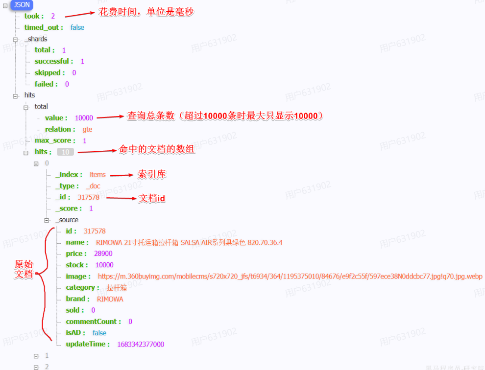

### 叶子查询：

- **全文检索查询（Full Text Queries）**：利用分词器对用户输入搜索条件先分词，得到词条，然后再利用倒排索引搜索词条。例如：
  - `match`：
  - `multi_match`：可以同时对多个字段搜索，而且多个字段都要满足

```JSON
GET /{索引库名}/_search
{
  "query": {
    "match": {
      "字段名": "搜索条件"
    }
  }
}
GET /{索引库名}/_search
{
  "query": {
    "multi_match": {
      "query": "搜索条件",
      "fields": ["字段1", "字段2"]
    }
  }
}
```

- **精确查询（Term-level queries）**：不对用户输入搜索条件分词，根据字段内容精确值匹配。但只能查找keyword、数值、日期、boolean类型的字段。例如：
  - `ids`
  - `term`
  - `range`

```JSON
GET /{索引库名}/_search
{
  "query": {
    "term": {
      "字段名": {
        "value": "搜索条件"
      }
    }
  }
}
GET /{索引库名}/_search
{
  "query": {
    "range": {
      "字段名": {
        "gte": {最小值},
        "lte": {最大值}
      }
    }
  }
}
```

- **地理坐标查询：**用于搜索地理位置，搜索方式很多，例如：
  - `geo_bounding_box`：按矩形搜索
  - `geo_distance`：按点和半径搜索

### 复合查询：

复合查询大致可以分为两类：

- 第一类：基于逻辑运算组合叶子查询，实现组合条件，例如
  - bool
- 第二类：基于某种算法修改查询时的文档相关性算分，从而改变文档排名。例如：
  - function_score
  - dis_max

1. bool查询，即布尔查询。就是利用逻辑运算来组合一个或多个查询子句的组合。bool查询支持的逻辑运算有：

- must：必须匹配每个子查询，类似“与”
- should：选择性匹配子查询，类似“或”
- must_not：必须不匹配，**不参与算分**，类似“非”
- filter：必须匹配，**不参与算分**

```JSON
GET /items/_search
{
  "query": {
    "bool": {
      "must": [
        {"match": {"name": "手机"}}
      ],
      "should": [
        {"term": {"brand": { "value": "vivo" }}},
        {"term": {"brand": { "value": "小米" }}}
      ],
      "must_not": [
        {"range": {"price": {"gte": 2500}}}
      ],
      "filter": [
        {"range": {"price": {"lte": 1000}}}
      ]
    }
  }
}
```

### 排序&分页：

- 排序：elasticsearch默认是根据相关度算分（`_score`）来排序，但是也支持自定义方式对搜索结果排序。不过分词字段无法排序，能参与排序字段类型有：`keyword`类型、数值类型、地理坐标类型、日期类型等。

```JSON
GET /indexName/_search
{
  "query": {
    "match_all": {}
  },
  "sort": [
    {
      "排序字段": {
        "order": "排序方式asc和desc"
      }
    }
  ]
}
```

- 分页：elasticsearch 默认情况下只返回top10的数据。而如果要查询更多数据就需要修改分页参数了。

```JSON
GET /items/_search
{
  "query": {
    "match_all": {}
  },
  "from": 0, // 分页开始的位置，默认为0
  "size": 10,  // 每页文档数量，默认10
}
```

- 深度分页：当查询分页深度较大时，汇总数据过多，对内存和CPU会产生非常大的压力，因此elasticsearch会禁止`from + size` 超过10000的请求。
- 针对深度分页，elasticsearch提供了两种解决方案：
  - `search after`：分页时需要排序，原理是从上一次的排序值开始，查询下一页数据。官方推荐使用的方式。
  - `scroll`：原理将排序后的文档id形成快照，保存下来，基于快照做分页。官方已经不推荐使用。

### 高亮显示：

- elasticsearch已经提供了给搜索关键字加标签的语法，无需我们自己编码。基本语法如下：

```JSON
GET /{索引库名}/_search
{
  "query": {
    "match": {
      "搜索字段": "搜索关键字"
    }
  },
  "highlight": {
    "fields": {
      "高亮字段名称": {
        "pre_tags": "<em>",
        "post_tags": "</em>"
      }
    }
  }
}
```

## 聚合：

### 聚合的分类：

聚合常见的有三类：

-  **桶（`Bucket`）**聚合：用来对文档做分组 
  - `TermAggregation`：按照文档字段值分组，例如按照品牌值分组、按照国家分组
  - `Date Histogram`：按照日期阶梯分组，例如一周为一组，或者一月为一组
-  **度量（`Metric`）**聚合：用以计算一些值，比如：最大值、最小值、平均值等 
  - `Avg`：求平均值
  - `Max`：求最大值
  - `Min`：求最小值
  - `Stats`：同时求`max`、`min`、`avg`、`sum`等
-  **管道（`pipeline`）**聚合：其它聚合的结果为基础做进一步运算 

**注意：**参加聚合的字段必须是keyword、日期、数值、布尔类型

### DSL实现聚合：

- **聚合查询：**例如我们要统计所有商品中共有哪些商品分类，其实就是以分类（category）字段对数据分组。category值一样的放在同一组，属于`Bucket`聚合中的`Term`聚合。

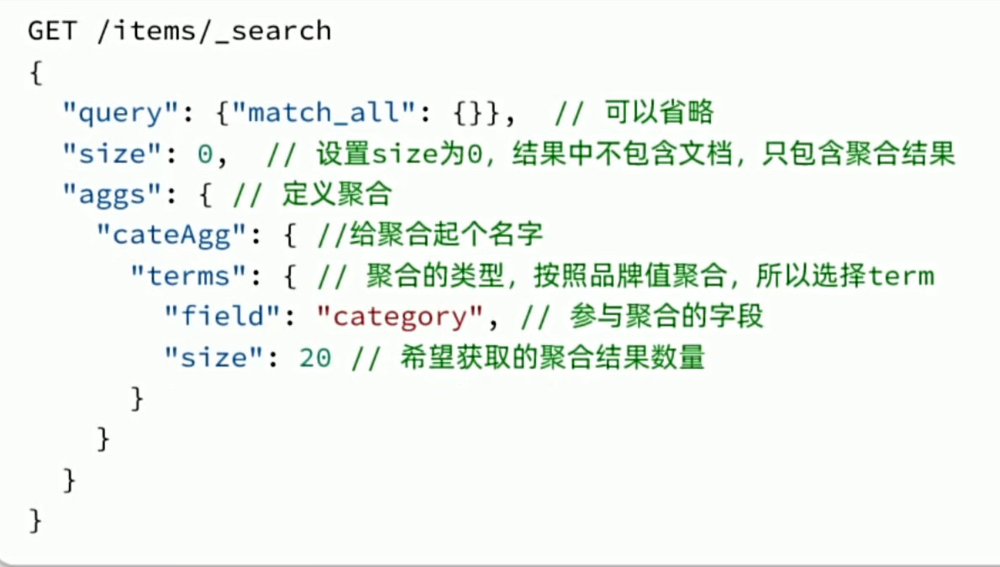

- **条件聚合：**如果要待条件的聚合，需要再query里面添加条件。
- **Metric聚合：**现在我们需要对桶内的商品做运算，获取每个品牌价格的最小值、最大值、平均值。这就要用到`Metric`聚合了，例如`stat`聚合，就可以同时获取`min`、`max`、`avg`等结果：

```JSON
GET /items/_search
{
    "query": {
        "bool": {
            "filter": [
                {
                    "term": {
                        "category": "手机"
                    }
                },
            ]
        }
    }, 
    "size": 0, 
    "aggs": {
        "brand_agg": {
            "terms": {
                "field": "brand",
                "size": 20
            },
            "aggs": {
                "stats_meric": {
                    "stats": {
                        "field": "price"
                    }
                }
            }
        }
    }
}
```

### Java代码聚合：

1. 可以看到在DSL中，`aggs`聚合条件与`query`条件是同一级别，都属于查询JSON参数。因此依然是利用`request.source()`方法来设置。不过聚合条件的要利用`AggregationBuilders`这个工具类来构造。DSL与JavaAPI的语法对比如下：

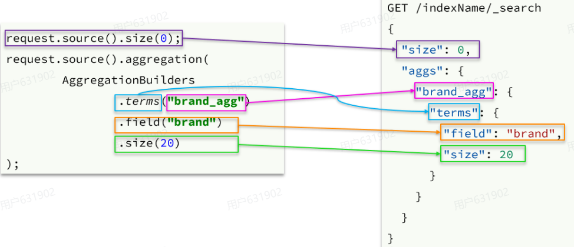

2. 聚合结果与搜索文档同一级别，因此需要单独获取和解析。具体解析语法如下：

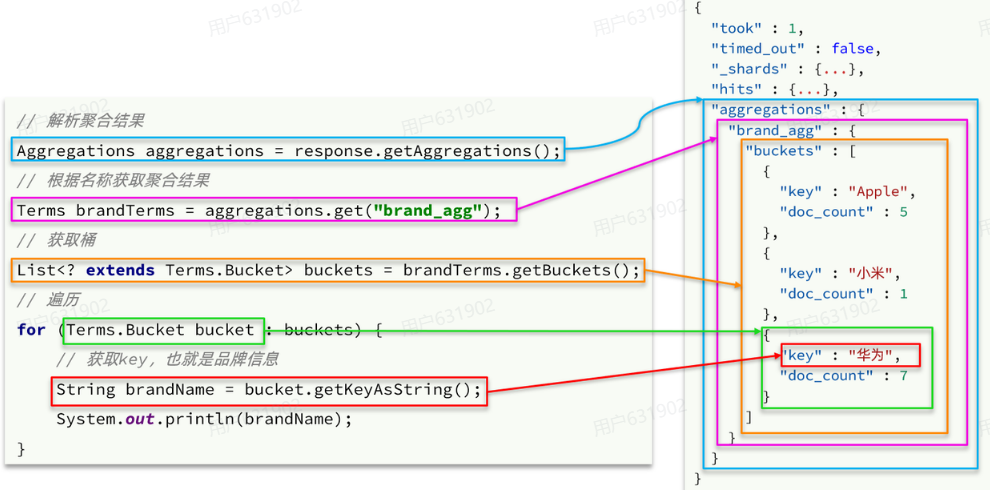


# 微服务面试：

## 分布式事务：

**分布式事务**，就是指不是在单个服务或单个数据库架构下，产生的事务，例如：

- 跨数据源的分布式事务
- 跨服务的分布式事务
- 综合情况

我们之前解决分布式事务问题是直接使用Seata框架的AT模式，但是解决分布式事务问题的方案远不止这一种。

### CAP定理：

解决分布式事务问题，需要一些分布式系统的基础知识作为理论指导，首先就是CAP定理。任何分布式系统架构方案都不可能同时满足这3个目标，这个结论就叫做 CAP 定理。

- **C**onsistency（一致性）：用户访问分布式系统中的任意节点，得到的数据必须一致。
- **A**vailability（可用性）：用户访问分布式系统时，读或写操作总能成功。
- **P**artition tolerance （分区容错性）：当分布式系统节点之间出现网络故障导致节点之间无法通信的情况，即便是系统出现网络分区，整个系统也要持续对外提供服务。

在分布式系统中，网络不能100%保证畅通，也就是说网络分区的情况一定会存在。而我们的系统必须要持续运行，对外提供服务。所以分区容错性（`P`）是硬性指标，所有分布式系统都要满足。而在设计分布式系统时要取舍的就是一致性（`C`）和可用性（`A`）了。

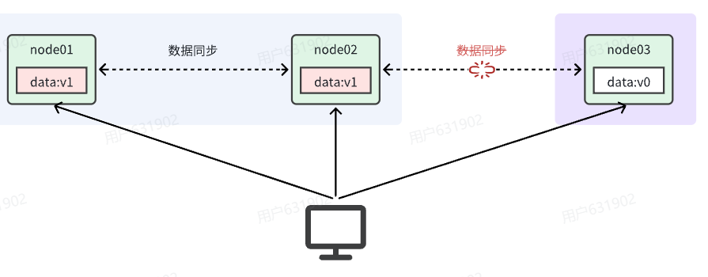

由于网络故障，当我们把数据写入node01时，可以与node02完成数据同步，但是无法同步给node03。现在有两种选择：

- 允许用户任意读写，保证可用性。但由于node03无法完成同步，就会出现数据不一致的情况。满足AP
- 不允许用户写，可以读，直到网络恢复，分区消失。这样就确保了一致性，但牺牲了可用性。满足CP


### BASE理论：

既然分布式系统要遵循CAP定理，那么问题来了，我到底是该牺牲一致性还是可用性呢？如果牺牲了一致性，出现数据不一致该怎么处理？

人们在总结系统设计经验时，最终得到了一些心得：

- **B**asically **A**vailable **（**基本可用**）**：分布式系统在出现故障时，允许损失部分可用性，即保证核心可用。
- **S**oft State**（**软状态**）：**在一定时间内，允许出现中间状态，比如临时的不一致状态。
- **Ev**entually Consistent**（**最终一致性**）**：虽然无法保证强一致性，但是在软状态结束后，最终达到数据一致。

简单来说，BASE理论就是一种取舍的方案，不再追求完美，而是最终达成目标。因此解决分布式事务的思想也是这样，有两个方向：

- AP思想：各个子事务分别执行和提交，无需锁定数据。允许出现结果不一致，然后采用弥补措施恢复，实现最终一致即可。例如`AT`模式就是如此
- CP思想：各个子事务执行后不要提交，而是等待彼此结果，然后同时提交或回滚。在这个过程中锁定资源，不允许其它人访问，数据处于不可用状态，但能保证一致性。例如`XA`模式

### AT模式脏写问题：

- **产生原因：**

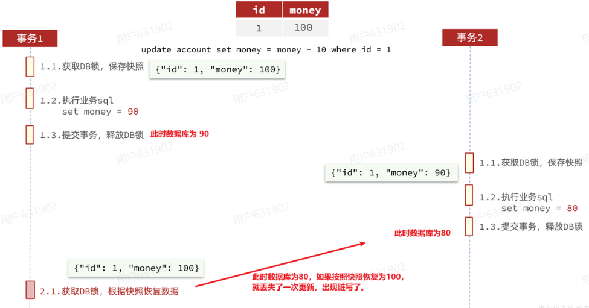

1. **全局锁：**AT模式下对于上面这种脏写问题使用了全局锁来接解决，解决思路就是引入了全局锁的概念。在释放DB锁之前，先拿到全局锁。避免同一时刻有另外一个事务来操作当前数据。这种全局锁不像数据库锁直接不允许所有事务来访问该字段，而是seata管理的事务不能来访问。

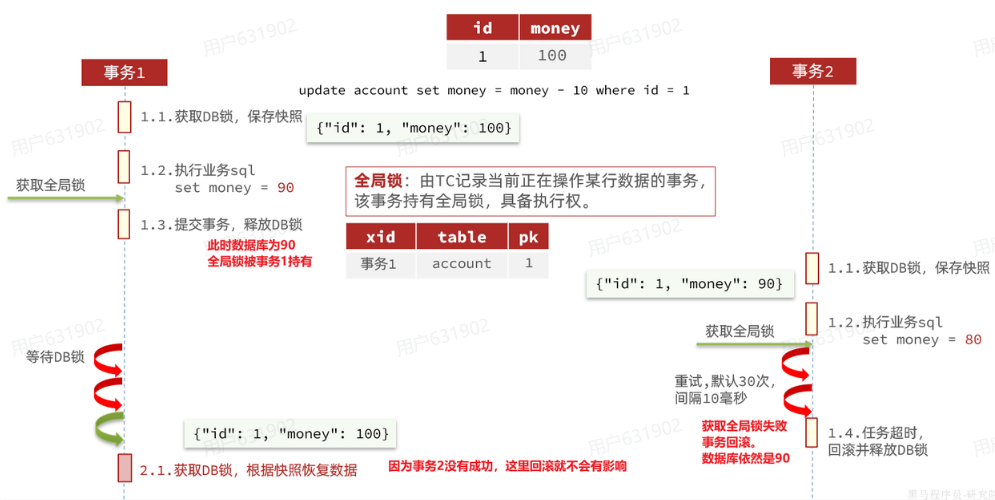

2. 如果是非seata管理的事务，采用的是类似于乐观锁的方式解决：

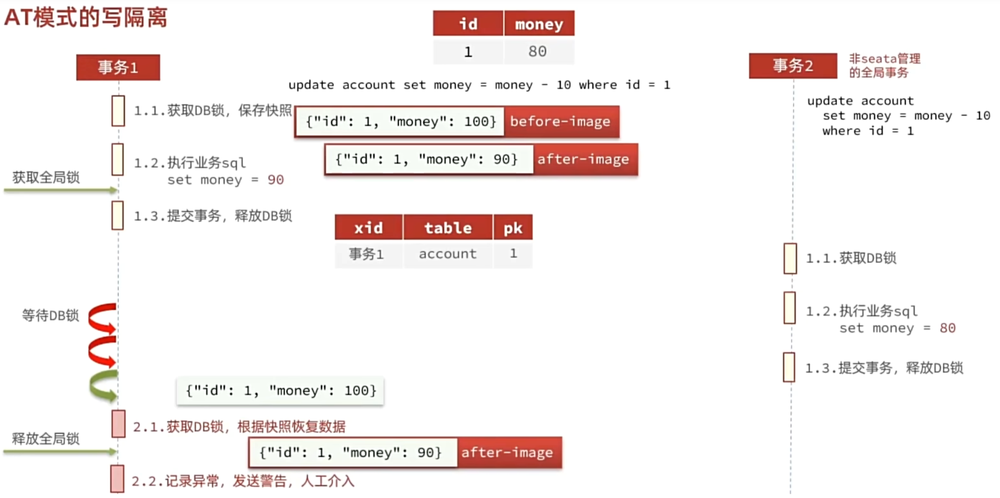

### TCC模式：

TCC模式与AT模式非常相似，每阶段都是独立事务，不同的是TCC通过人工编码来实现数据恢复。需要实现三个方法：

-  `try`：资源的检测和预留； 
-  `confirm`：完成资源操作业务；要求 `try` 成功 `confirm` 一定要能成功。 
-  `cancel`：预留资源释放，可以理解为try的反向操作。 

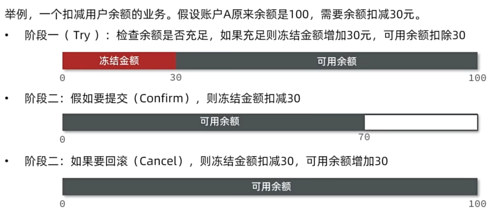

**优点：**

- 一阶段完成直接提交事务，释放数据库资源，性能好
- 相比AT模型，无需生成快照，无需使用全局锁，性能最强
- 不依赖数据库事务，而是依赖补偿操作，可以用于非事务型数据库

**缺点：**

- 有代码侵入，需要人为编写try、Confirm和Cancel接口，太麻烦
- 软状态，事务是最终一致
- 需要考虑Confirm和Cancel的失败情况，做好幂等处理

### 最大努力通知：

- 最大努力通知是一种最终一致性的分布式事务解决方案。顾明思议，就是通过消息通知的方式来通知事务参与者完成业务执行，如果执行失败会多次通知。无需任何分布式事务组件介入。

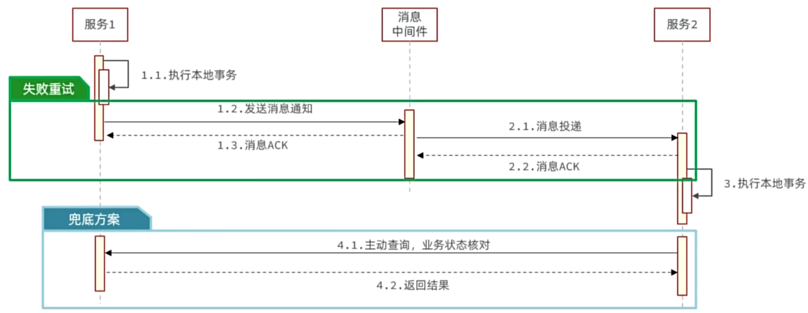

## nacos注册中心：

### 环境隔离

- 可以在nacos的客户端中设置命名空间和分组。

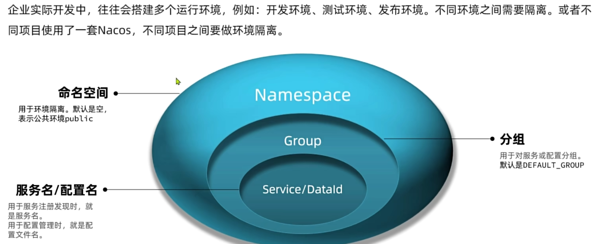

默认情况下，所有的微服务注册发现、配置管理都是走`public`这个命名空间。如果要指定命名空间则需要修改`application.yml`文件。

比如，我们修改`item-service`服务的bootstrap.yml文件，添加服务发现配置，指定其`namespace`：

```YAML
spring:
  application:
    name: item-service # 服务名称
  profiles:
    active: dev
  cloud:
    nacos:
      server-addr: 192.168.150.101 # nacos地址
      discovery: # 服务发现配置
        namespace: 8c468c63-b650-48da-a632-311c75e6d235 # 设置namespace，必须用id
```

### 服务分级模型：

Nacos中提供了集群（`cluster`）的概念，来对应不同机房。也就是说，一个服务（`service`）下可以有很多集群（`cluster`），而一个集群（`cluster`）中下又可以包含很多实例（`instance`）。

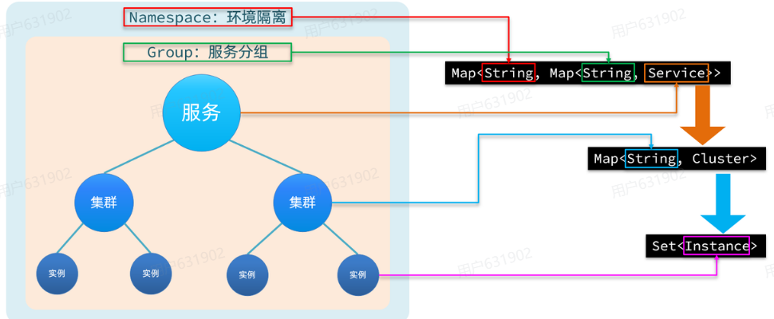

- 查看nacos控制台，会发现默认情况下所有服务的集群都是default，如果我们要修改服务所在集群，只需要修改`bootstrap.yml`即可：

```YAML
spring:
  cloud:
    nacos:
      discovery:
        cluster-name: BJ # 集群名称，自定义
```

### Eureka&Nacos:

- Eureka是Netflix公司开源的一个服务注册中心组件，早期版本的SpringCloud都是使用Eureka作为注册中心。由于Eureka和Nacos的starter中提供的功能都是基于SpringCloudCommon规范，因此两者使用起来差别不大。

**Eureka和Nacos的相似点有：**

- 都支持服务注册发现功能
- 都有基于心跳的健康监测功能
- 都支持集群，集群间数据同步默认是AP模式，即最全高可用性

**Eureka和Nacos的区别有：**

- Eureka的心跳是30秒一次，Nacos则是5秒一次
- Eureka如果90秒未收到心跳，则认为服务疑似故障，可能被剔除。Nacos中则是15秒超时，30秒剔除。
- Eureka每隔60秒执行一次服务检测和清理任务；Nacos是每隔5秒执行一次。
- Eureka只能等微服务自己每隔30秒更新一次服务列表；Nacos即有定时更新，也有在服务变更时的广播推送
- Eureka仅有注册中心功能，而Nacos同时支持注册中心、配置管理

## 远程调用：

### 负载均衡原理：

根据之前的分析，我们会发现Spring在整合OpenFeign的时候，实现了`FeignBlockingLoadBalancerClient`类，其中定义了OpenFeign发起远程调用的核心流程。也就是四步：

- 获取请求中的`serviceId`
- 根据`serviceId`负载均衡，找出一个可用的服务实例
- 利用服务实例的`ip`和`port`信息重构url
- 向真正的url发起请求

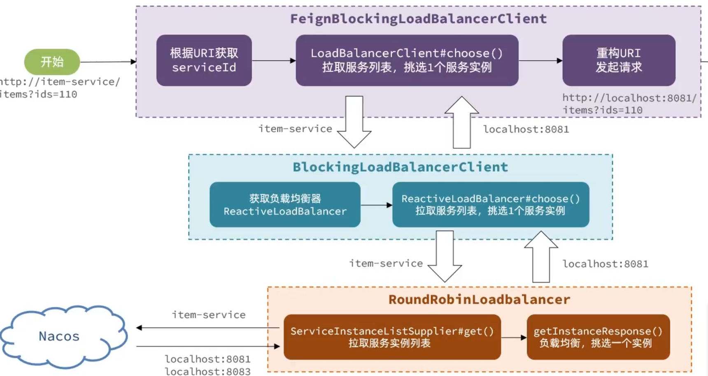

### 切换不同负载均衡算法：

查看源码会发现，`Spring-Cloud-Loadbalancer`模块中有一个自动配置类，其中定义了默认的负载均衡器。这个Bean上添加了`@ConditionalOnMissingBean`注解，也就是说如果我们自定义了这个类型的bean，则负载均衡的策略就会被改变。

**注意：**这个配置类千万不要加`@Configuration`注解，也不要被SpringBootApplication扫描到。在启动类使用注解@LoadBalancerClients(defaultConfiguration = OpenFeignConfig.class)注入，`保证非Feign的组件不会用到这个bean。`

```Java
public class OpenFeignConfig {
    @Bean
    public ReactorLoadBalancer<ServiceInstance> reactorServiceInstanceLoadBalancer(
            Environment environment, NacosDiscoveryProperties properties,
            LoadBalancerClientFactory loadBalancerClientFactory) {
        String name = environment.getProperty(LoadBalancerClientFactory.PROPERTY_NAME);
        return new NacosLoadBalancer(
                loadBalancerClientFactory.getLazyProvider(name, ServiceInstanceListSupplier.class), name, properties);
    }

}
```

#### Nacos负载均衡器：

1. **集群优先：**NacosLoadBalancer采用集群优先，就是**服务调用者与服务提供者要在一个集群**，本机房调用几乎没有网络延迟，速度比较快。而跨机房调用，如果两个机房相距很远，会存在较大的网络延迟。因此，我们应该尽可能避免跨机房调用，优先本地集群调用。

2. **权重配置：**nacos是通过配置的权重进行加权随机算法来挑选访问的服务器（可以在客户端设置不同实例的权重）。

## 服务保护：

### 线程隔离：

- 线程隔离有两种模式：线程池隔离(Hystix默认采用)、信号量隔离(Sentinel默认采用)。

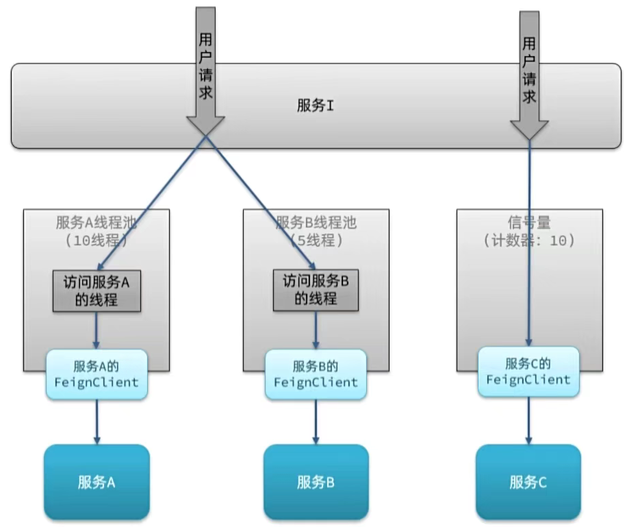

### 滑动窗口算法限流：

在熔断功能中，需要统计异常请求或慢请求比例，也就是计数。在限流的时候，要统计每秒钟的QPS，同样是计数。可见计数算法在熔断限流中的应用非常多。sentinel中请求采用的计数器算法就是滑动窗口计数算法。

1. 固定窗口计数：

- 将时间划分为多个窗口，窗口时间跨度称为`Interval`，本例中为1000ms；
- 每个窗口维护1个计数器，每有1次请求就将计数器`+1`。限流就是设置计数器阈值，本例为3，图中红线标记
- 如果计数器超过了限流阈值，则超出阈值的请求都被丢弃。
- 但因为时间是线性的可能会出现紫色框内的情况，这样一秒内就是6此请求了，超过了阈值。

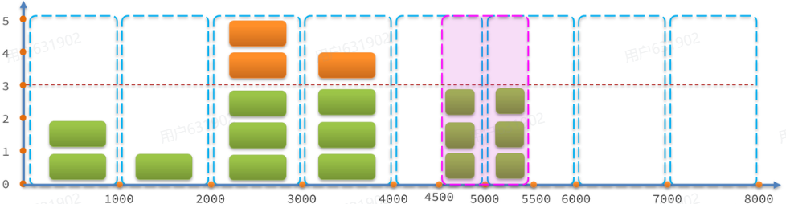

2. 滑动窗口计数：

- 窗口时间跨度`Interval`大小固定，例如1秒
- 时间区间跨度为`Interval / n` ，例如n=2，则时间区间跨度为500ms
- 窗口会随着当前请求所在时间`currentTime`移动，窗口范围从`currentTime-Interval`时刻之后的第一个时区开始，到`currentTime`所在时区结束。

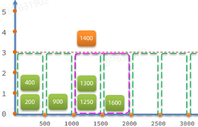

### 漏桶算法排队：

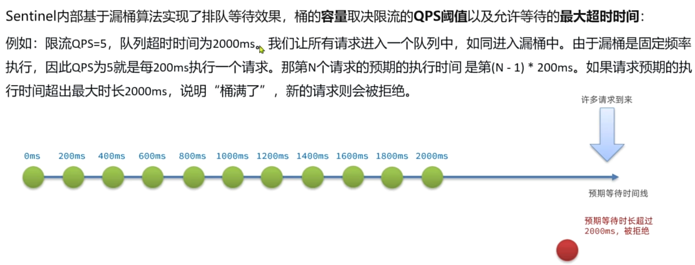

### 令牌桶算法限流：

限流的另一种常见算法是令牌桶算法，Sentinel中的**热点参数限流**正是基于令牌桶算法实现的。

说明：

- 以固定的速率生成令牌，存入令牌桶中，如果令牌桶满了以后，多余令牌丢弃
- 请求进入后，必须先尝试从桶中获取令牌，获取到令牌后才可以被处理
- 如果令牌桶中没有令牌，则请求等待或丢弃

当然也有例外情况，例如：

- 某一秒令牌桶中产生了很多令牌，达到令牌桶上限N，缓存在令牌桶中，但是这一秒没有请求进入。
- 下一秒的前半秒涌入了超过2N个请求，之前缓存的令牌桶的令牌耗尽，同时这一秒又生成了N个令牌，于是总共放行了2N个请求。超出了我们设定的QPS阈值。

因此，在使用令牌桶算法时，尽量不要将令牌上限设定到服务能承受的QPS上限。而是预留一定的波动空间，这样我们才能应对突发流量。

### 限流区别：

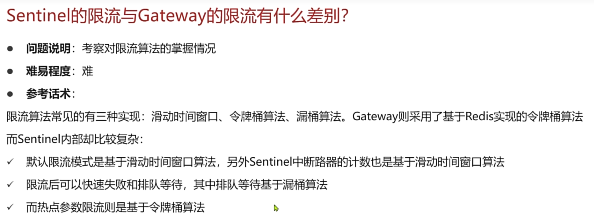

