# Mysql

## 语法：

**[语法合集CSDN](https://blog.csdn.net/hqxstudying/article/details/148105468?fromshare=blogdetail&sharetype=blogdetail&sharerId=148105468&sharerefer=PC&sharesource=qq_63113215&sharefrom=from_link"sql语法")**

**查询执行顺序：**

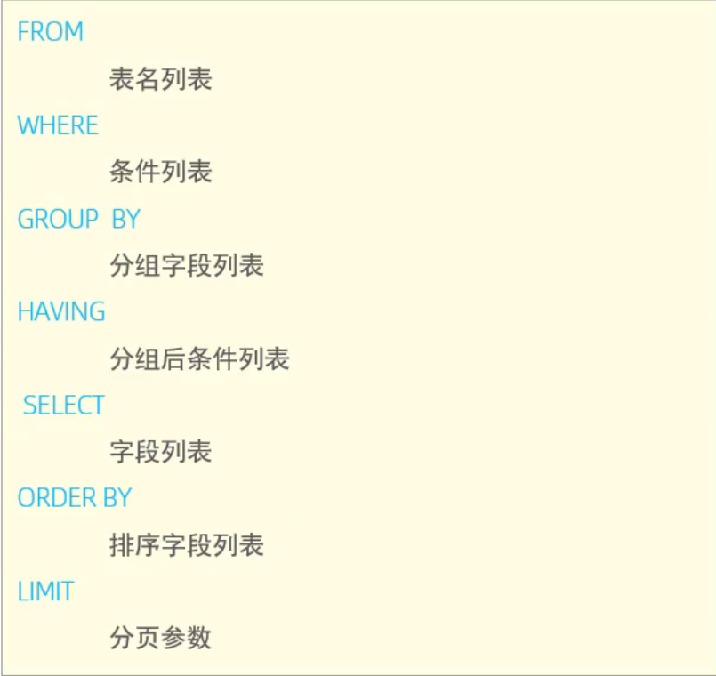

**case流程控制函数：**

- 语法一：case when cond1 then res1 [ when cond2 then res2 ] else res end ;
- 含义：如果 cond1 成立， 取 res1。  如果 cond2 成立，取 res2。 如果前面的条件都不成立，则取 res。

- 语法二（仅适用于等值匹配）：case expr when val1 then res1 [ when val2 then res2 ] else res end ;
- 含义：如果 expr 的值为 val1 ， 取 res1。  如果  expr 的值为 val2 ，取 res2。 如果前面的条件都不成立，则取 res。

```XML
<!-- 统计各个职位的员工人数 -->
<select id="countEmpJobData" resultType="java.util.Map">
    select
    (case job when 1 then '班主任' 
                     when 2 then '讲师' 
                     when 3 then '学工主管' 
                     when 4 then '教研主管' 
                     when 5 then '咨询师' 
                     else '其他' end)  pos,
    count(*) total
    from emp group by job
    order by total
</select>
```

**if条件函数：**

- if(expr,vall,val2):如果表达式expr成立，取val1，否则取val2

- ifnull(expr,val1):如果expr不为null，取自身，否则取val1

```java
<select id="countEmpGenderData" resultType="java.util.Map">
    select
        if(gender=1,'男性员工','女性员工') name,
        count(*) value
    from emp group by gender
</select>
```

## 理论：

### 多表关系：

#### 一对多：

​	一对多（部门->员工），需要在**员工**的那一张表创建一个外键来跟**部门**的那张表的id绑定。

​	一般不直接在数据库中使用物理外键，而是在业务逻辑中使用逻辑外键。

#### 一对一：

​	在任意一方加入外键，关联另外一方的主键，并且设置外键为唯一的(UNIQUE)。

#### 多对多（课程-学生）：

​	建立第三张中间表，中间表至少包含两个外键，分别关联两方主键。


### 多表查询：

#### 连接查询：

​	内连接:相当于查询A、B交集部分数据

​	外连接：1.左外连接:查询左表所有数据(包括两张表交集部分数据)

​			 2.右外连接:查询右表所有数据(包括两张表交集部分数据)


# JDBC（java数据库链接）

## 整体流程：（connect->statement->update/query）

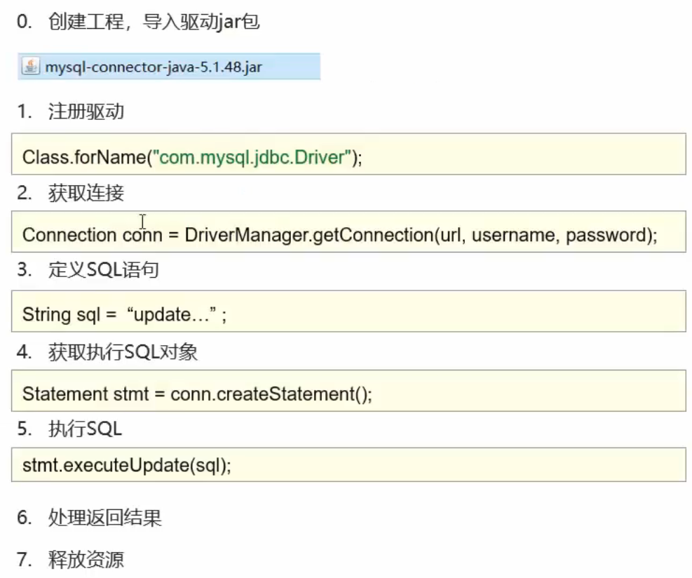

<span style="color:#3333FF;">**DriverManager：**</span>

​	1.获取与数据库的连接，且url的格式是“jdbc:mysql://ip:端口/数据库名”。

<span style="color:#3333FF;">**Connection：**</span>

​	1.来获取执行sql的对象，分为三种对象：createStatement()，prepareStatement(sql)（防止sql注入），prepareCall(sql)。

​		其中prepareStatement(sql)的使用，需要在url后使用useServerPrepareStmts=true，sql语句模板传给PreparedStatement时就会进行预编译，并且使用同样的模板执行时只会预编译一次，因此提高了性能。在传入参数值时会对参数值的敏感字符进行转义从而避免sql注入：

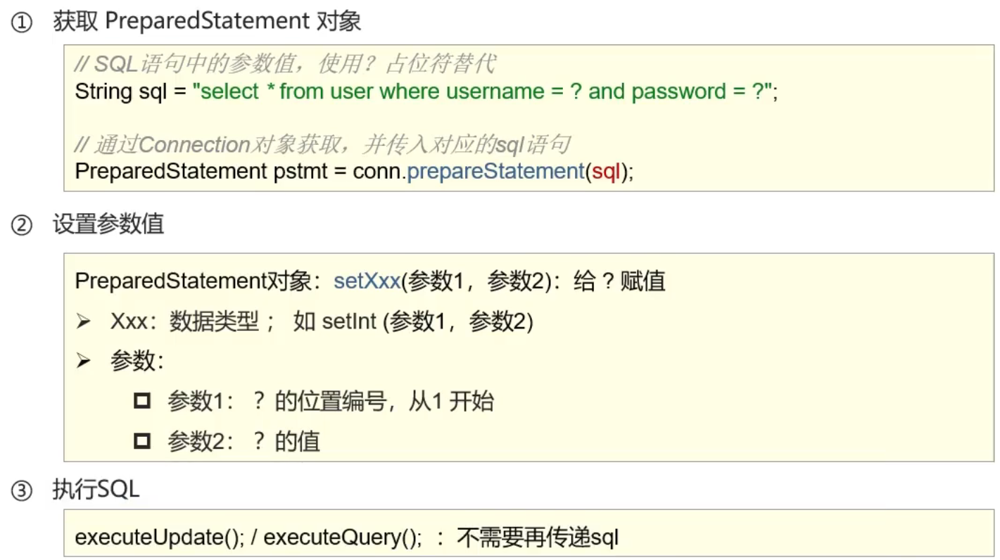

​	2.来管理事务，用try-catch来处理事务，在try中开启和提交，在catch中回滚:

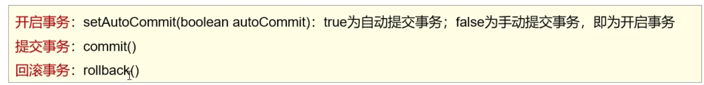

<span style="color:#3333FF;">**Statement：**</span>

​	1.用来执行sql语句：

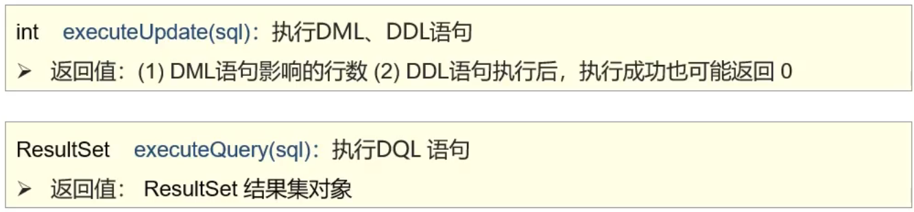

​	2.其中ResultSet中封装了DQL查询语句的结果：

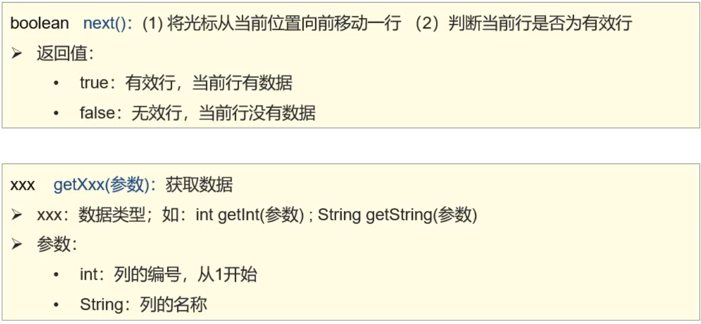

## 连接池：

​	1.Druid（德鲁伊），主要用于预定义一些连接分配给多个用户使用，不用每次用户使用都创建连接：

​		首先需要导入jar包，然后对Druid进行配置，加载配置文件，之后获取连接池对象，然后就可以获取数据库连接了：

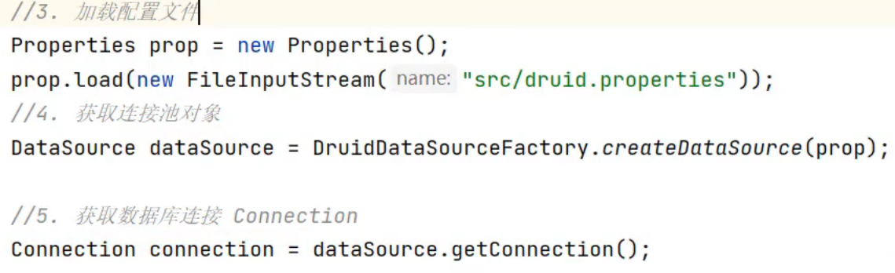

# MyBatis

## 用法：

### <span style="color:#0000FF;">用注释定义sql：</span>

1.必须要用@Mapper注解，查询语句用@Select；修改用@Update；删除用@Delect；插入用@Insert。

```Java
import com.itheima.pojo.User;
import org.apache.ibatis.annotations.Mapper;
import org.apache.ibatis.annotations.Select;
import java.util.List;

@Mapper
public interface UserMapper {
    /**
     * 查询全部
     */
    @Select("select * from user where id = #{id}")
    public List<User> findAll(Integer id);
}
```

2.在sql语句中使用变量需要用#{}（预编译sql），传递进来的变量会自动注入sql，还有一种是${}（直接拼接sql）但是这样不安全且效率不高，实际应用很少。

3.如果在方法中有不止一个传入的参数需要@Param注解为形参取名（基于springboot官方骨架创建的项目中可以不用取名）。

### **<span style="color:#0000FF;">XML映射中定义Sql（适合复杂的sql）：</span>**

1.其中resultType是查询返回的数据。

2.如果XML和Mapper接口没有同包同名，则可以通过在Application.properties中添加mybatis.mapper-location=classpath:mapper/*.xml来配置路径。

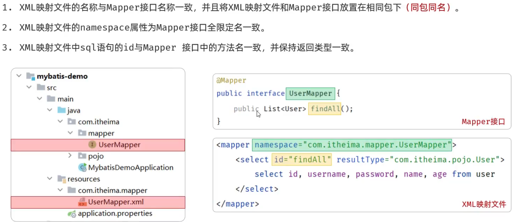

### <span style="color:#0000FF; font-weight:bold;">动态sql：</span>

​	1.如果前端传入controller层封装对象的参数是不一定的（即有时候不会传入某些参数），就可以用where和if标签来过滤，这样不传入的话这段sql就不会拼接（不这样做，默认拼接的情况下不传入参数会查不出数据）：

```sql
<select id="list" resultType="com.lxr.pojo.Emp">
        select e.*,d.name deptName from emp e left join dept d on e.dept_id = d.id
        <where>
            <if test="name != null and name != ''">
                    and e.name like concat('%',#{name},'%')
            </if>
            <if test="gender != null">
                and e.gender = #{gender}
            </if>
            <if test="begin != null">
                and e.entry_date between #{begin} and #{end}
            </if>
        </where>
        order by e.update_time desc
    </select>
```

​	2.当前端传入数据是一个List时，需要使用动态sql<foreach>来保存。

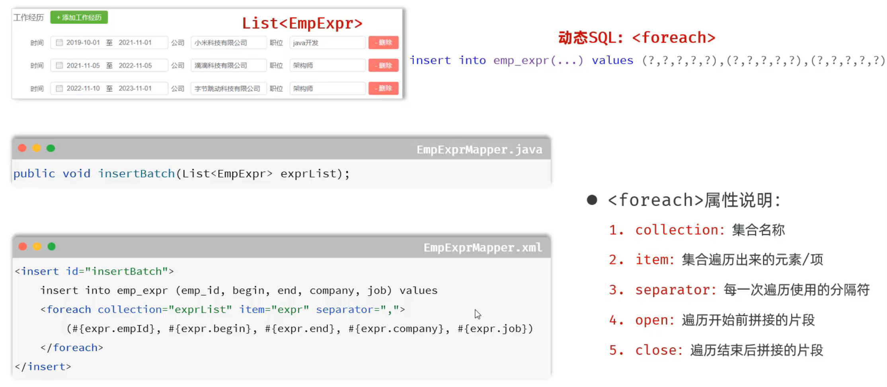

### <span style="color:#0000FF;">**resultMap：**</span>

​	1.如果在Mapper中联合查询出的数据不止一条（例如一个员工对应多条工作经历），但需要把这些数据都封装到一个类中（包含员工信息，和一个List工作经历），就需要在mapper.xml中定义resultMap来封装：

- 如果查询返回的字段名与实体的属性名可以直接对应上，用resultType。
- 如果查询返回的字段名与实体的属性名对应不上，或实体属性比较复杂，可以通过resultMap手动封装。
- 其中id用id标签，其他的用result标签。

```sql
<!--    定义resultMap-->
    <resultMap id="empResultMap" type="com.lxr.pojo.Emp">
        <id column="id" property="id"/>
        <result column="username" property="username"/>
        <result column="password" property="password"/>
        <result column="name" property="name"/>
        <result column="gender" property="gender"/>
        <result column="phone" property="phone"/>
        <result column="job" property="job"/>
        <result column="salary" property="salary"/>
        <result column="image" property="image"/>
        <result column="entry_date" property="entryDate"/>
        <result column="dept_id" property="deptId"/>
        <result column="creat_time" property="createTime"/>
        <result column="update_time" property="updateTime"/>
<!--        封装员工工作经历-->
        <collection property="exprList" ofType="com.lxr.pojo.EmpExpr">
            <id column="ee_id" property="id"/>
            <result column="ee_empid" property="empId"/>
            <result column="ee_begin" property="begin"/>
            <result column="ee_end" property="end"/>
            <result column="ee_company" property="company"/>
            <result column="ee_job" property="job"/>
        </collection>
    </resultMap>
<!--    根据id查询员工基本信息以及工作经历-->
    <select id="getById" resultMap="empResultMap">
        select
            e.*,
            ee.id ee_id,
            ee.emp_id ee_empid,
            ee.begin ee_begin,
            ee.end ee_end,
            ee.company  ,
            ee.job ee_job
        from emp e left join tlias.emp_expr ee on e.id = ee.emp_id
        where e.id = #{id}
    </select>
```


## 概念：

1.在spring-boot中默认使用的是Hikari数据库连接池，如果要对数据库连接池进行更换需要在pom文件中插入依赖，以及在Application.properties中配置连接池信息

（例如：spring.datasource.type=com.alibaba.druid.pool.DruidDataSource）。

# Mybatis Plus：

## BaseMapper接口：

- 需要创建一个基本的Mapper层继承BaseMapper<T> T中表示传入于数据库表对应的类：

```java
@Mapper
public interface UserMapper extends BaseMapper<User> {

}
```


## 基本的CRUD：


## MP拦截器：

- 拦截器是优化一些sql操作，例如分页功能等。

### 分页拦截器：

1. 设置分页拦截器作为Spring管理的bean：


## BaseMapper功能：

### 格式：


### null值处理：

- 传入参数可能为null值的时候的处理：

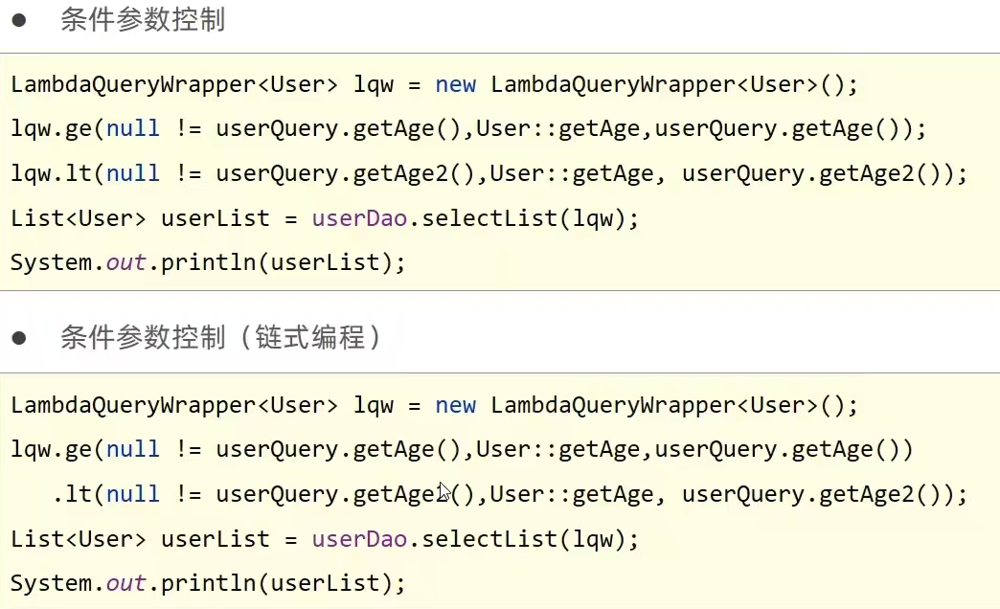

### 查询投影：

- 需要自定义返回字段，例如count等。

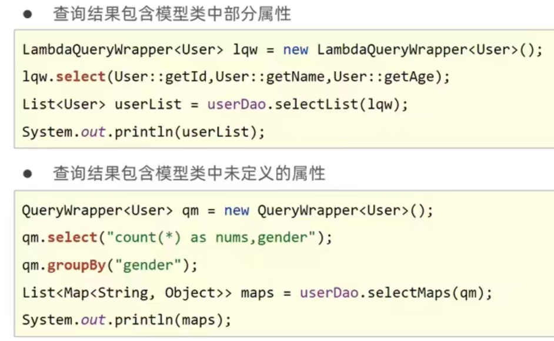

### 条件构造器：

- Wrapper是MP的条件构造器，他下面有继承了很多子类对功能拓展：

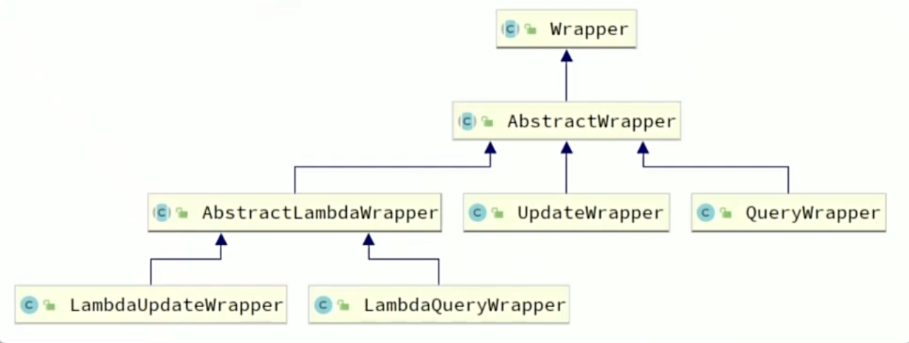

- **常用Api：**

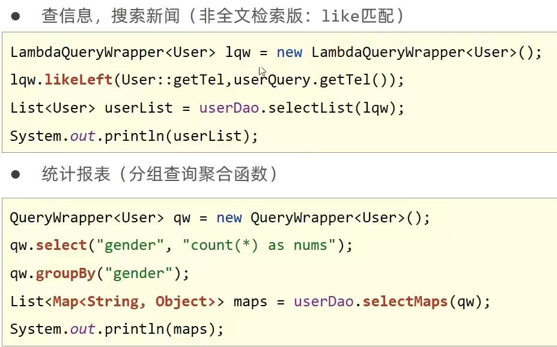


### 多记录操作：

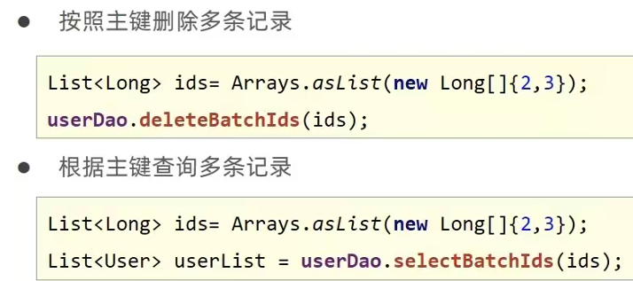

### 自定义sql：

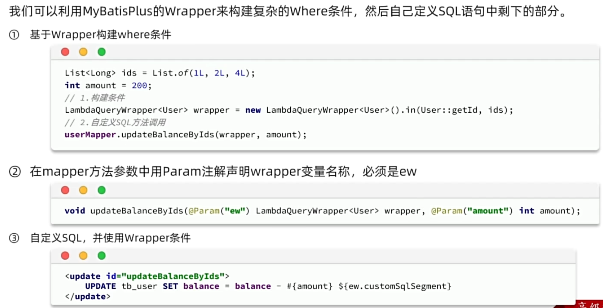

## IService接口：

### 使用：

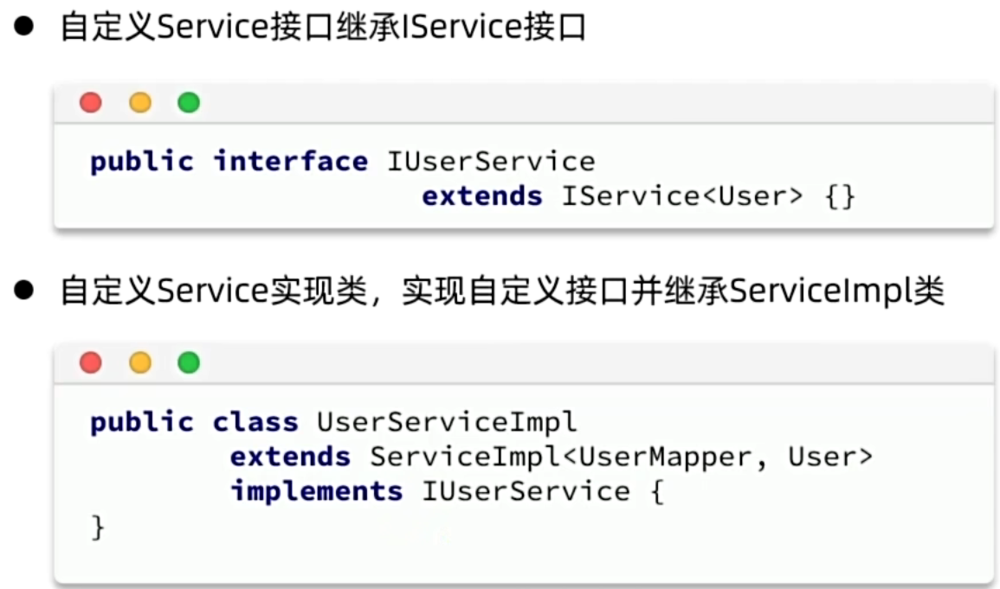

### 批处理优化：

- 使用mp的批处理时mysql默认配置还是一条条执行sql语句，这会影响性能，所以需要在JDBC配置中开启rewriteBatchedStatements=true参数才会将批处理操作执行为一条sql

## 常用注解：

### 表与字段：

- 当实体类中字段名和表名于数据库中的不一致的时候可以通过配置来映射。

1. 表名映射：@TableName("tb_user")

2. 字段映射：@TableField(value="pwd",select =false,exist = false)

   - 其中select是设置是否被查询出来（password字段可以设置为false），exist是表示数据库中是否存在这个字段。

3. @Tableld:用来指定表中的主键字段信息，@TableId(type = IdType.AUTO)，其中type有以下策略：

   - **AUTO(0):**使用数据库id自增策略控制id生成

   - **NONE(1):**不设置id生成策略

   - **INPUT(2):**用户手工输入id

   - **ASSIGN ID(3):**雪花算法生成id(可兼容数值型与字符串型)

   - **ASSIGN UUID(4):**以UUID生成算法作为id生成策略

### 逻辑删除：

- 如果不想真正物理删除某个字段可以设置逻辑删除，用一个字段来表示是否删除：
- 使用@TableLogic指定当前字段为逻辑删除字段。


## 常用配置：

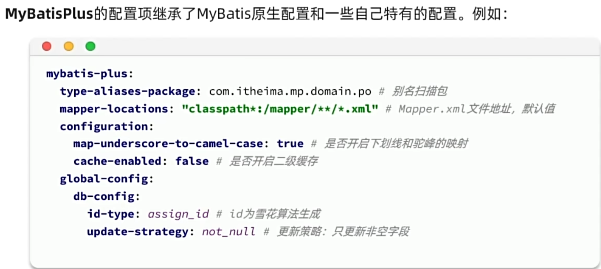

### 全局配置：

- 一些配置可以通过在yml全局配置来简化代码：

```yml
mybatis-plus:
	global-config:
		db-config:
			id-type: auto #设置id生成策略
    		table-prefix: tbl_ #设置数据库表前缀
    		logic-delete-field: deleted #设置逻辑删除字段
    		logic-not-delete-value: 0 #未删除
    		logic-delete-value: 1 #删除
```


## 拓展功能

### 乐观锁：

- 一些可能会被多个用户同时访问的数据可以设置乐观锁：

1. 在数据库中添加标记字段version。
2. 实体中添加对应字段并在上面添加@Version注释。
3. 在config中配置乐观锁拦截器，实现锁机制对应的sql语句拼装。
4. 使用乐观锁机制在修改前必须先获取到对应数据的verion方可正常进行：

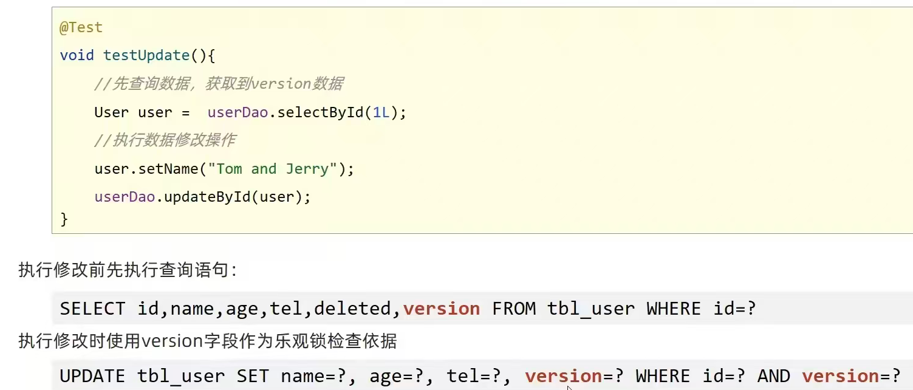


### 代码生成器：

- 通过预设的模板帮开发人员依据数据库生成controller、service、mapper模板代码。

- 导入坐标：

 ```java
<dependency>
    <groupId>com.baomidou</groupId>
    <artifactId>mybatis-plus-generator</artifactId>
    <version>3.4.1</version>
</dependency>
    <!--velocity模板引擎-->
<dependency>
    <groupId>org.apache.velocity</groupId>
    <artifactId>velocity-engine-core</artifactId>
    <version>2.3</version>
</dependency>
 ```

- 也可以通过插件生成。

### 静态工具：

- 如果Service相互依赖，会导致循环注入，因此在这种情况下建议直接使用mp提供的Db.静态工具进行数据库操作。

### 枚举处理器：

1. 配置枚举处理器：

```YAML
mybatis-plus:
  configuration:
    default-enum-type-handler: com.baomidou.mybatisplus.core.handlers.MybatisEnumTypeHandler
```

2. 要让`MybatisPlus`处理枚举与数据库类型自动转换，我们必须告诉`MybatisPlus`，枚举中的哪个字段的值作为数据库值。 在枚举类中使用`MybatisPlus`提供的`@EnumValue`注解来标记枚举属性。并且，在枚举类中通过`@JsonValue`注解标记JSON序列化时展示的字段（也就是返回前端的字段）。

### JSON处理器：

- 当数据库表中存储了Json数据就可以用这样的方式：1.配置typeHandler；2.因为嵌套了实体类所以要配置autoResultMap。

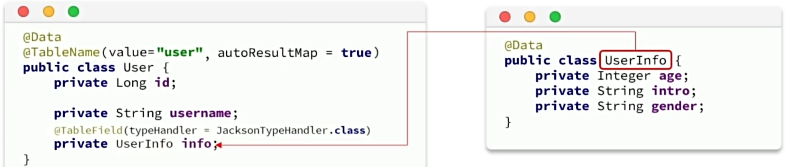

### 插件功能：

#### 分页：

1. 配置分页拦截器。
2. 在`PageQuery`这个实体中定义一个工具方法

```Java
@Data
public class PageQuery {
    private Integer pageNo;
    private Integer pageSize;
    private String sortBy;
    private Boolean isAsc;
    public <T>  Page<T> toMpPage(OrderItem ... orders){
        // 1.分页条件
        Page<T> p = Page.of(pageNo, pageSize);
        // 2.排序条件
        // 2.1.先看前端有没有传排序字段
        if (sortBy != null) {
            p.addOrder(new OrderItem(sortBy, isAsc));
            return p;
        }
        // 2.2.再看有没有手动指定排序字段
        if(orders != null){
            p.addOrder(orders);
        }
        return p;
    }
    public <T> Page<T> toMpPage(String defaultSortBy, boolean isAsc){
        return this.toMpPage(new OrderItem(defaultSortBy, isAsc));
    }
    public <T> Page<T> toMpPageDefaultSortByCreateTimeDesc() {
        return toMpPage("create_time", false);
    }
    public <T> Page<T> toMpPageDefaultSortByUpdateTimeDesc() {
        return toMpPage("update_time", false);
    }
}
```

3. 在查询出分页结果后，数据的非空校验，数据的vo转换封装到PageDTO的工具方法：

```Java
public class PageDTO<V> {
    private Long total;
    private Long pages;
    private List<V> list;
    /**
     * 返回空分页结果
     * @param p MybatisPlus的分页结果
     * @param <V> 目标VO类型
     * @param <P> 原始PO类型
     * @return VO的分页对象
     */
    public static <V, P> PageDTO<V> empty(Page<P> p){
        return new PageDTO<>(p.getTotal(), p.getPages(), Collections.emptyList());
    }
    /**
     * 将MybatisPlus分页结果转为 VO分页结果
     * @param p MybatisPlus的分页结果
     * @param voClass 目标VO类型的字节码
     * @param <V> 目标VO类型
     * @param <P> 原始PO类型
     * @return VO的分页对象
     */
    public static <V, P> PageDTO<V> of(Page<P> p, Class<V> voClass) {
        // 1.非空校验
        List<P> records = p.getRecords();
        if (records == null || records.size() <= 0) {
            // 无数据，返回空结果
            return empty(p);
        }
        // 2.数据转换
        List<V> vos = BeanUtil.copyToList(records, voClass);
        // 3.封装返回
        return new PageDTO<>(p.getTotal(), p.getPages(), vos);
    }
    /**
     * 将MybatisPlus分页结果转为 VO分页结果，允许用户自定义PO到VO的转换方式
     * @param p MybatisPlus的分页结果
     * @param convertor PO到VO的转换函数
     * @param <V> 目标VO类型
     * @param <P> 原始PO类型
     * @return VO的分页对象
     */
    public static <V, P> PageDTO<V> of(Page<P> p, Function<P, V> convertor) {
        // 1.非空校验
        List<P> records = p.getRecords();
        if (records == null || records.size() <= 0) {
            // 无数据，返回空结果
            return empty(p);
        }
        // 2.数据转换
        List<V> vos = records.stream().map(convertor).collect(Collectors.toList());
        // 3.封装返回
        return new PageDTO<>(p.getTotal(), p.getPages(), vos);
    }
}
```

4. 调用：

```Java
@Override
public PageDTO<UserVO> queryUserByPage(PageQuery query) {
    // 1.构建条件
    Page<User> page = query.toMpPageDefaultSortByCreateTimeDesc();
    // 2.查询，使用lambdaQuery
    page(page);
    // 3.封装返回
    return PageDTO.of(page, user -> {
        // 拷贝属性到VO
        UserVO vo = BeanUtil.copyProperties(user, UserVO.class);
        // 用户名脱敏
        String username = vo.getUsername();
        vo.setUsername(username.substring(0, username.length() - 2) + "**");
        return vo;
    });
}
```
