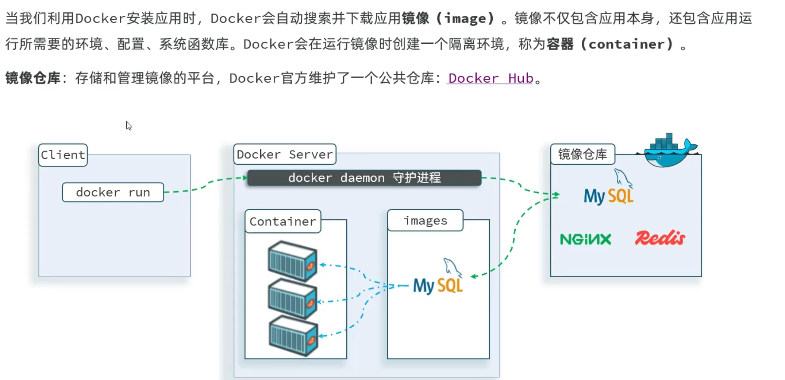
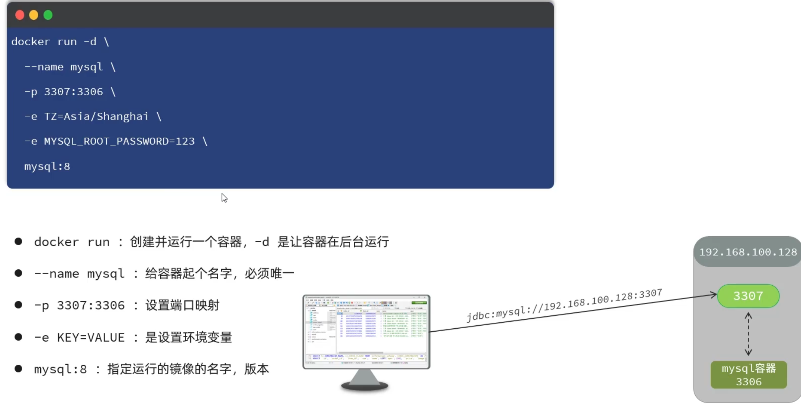
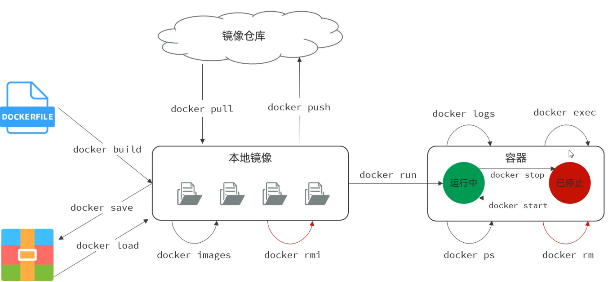
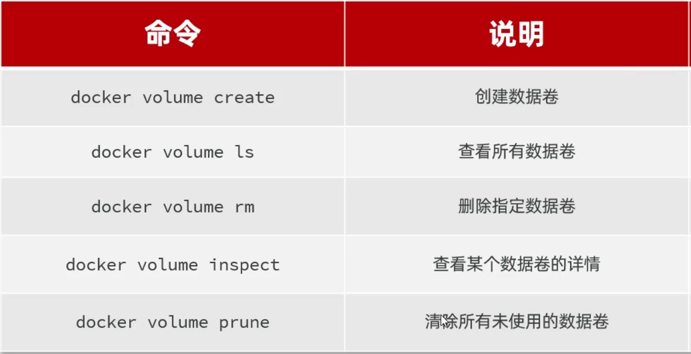
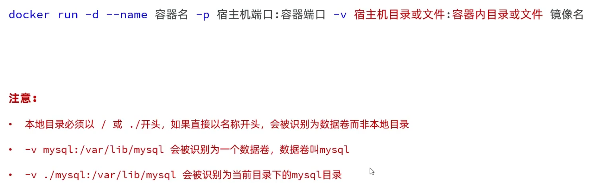
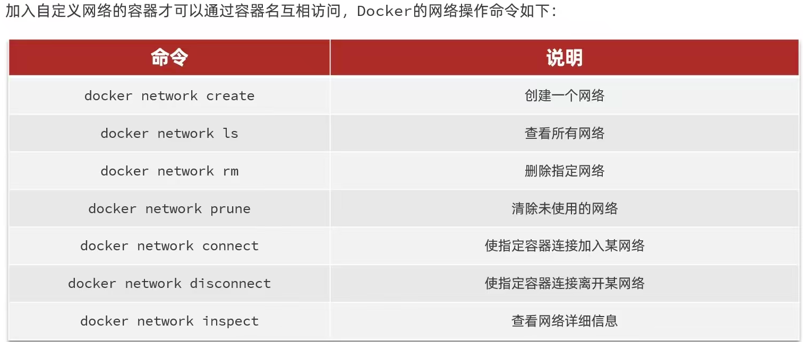
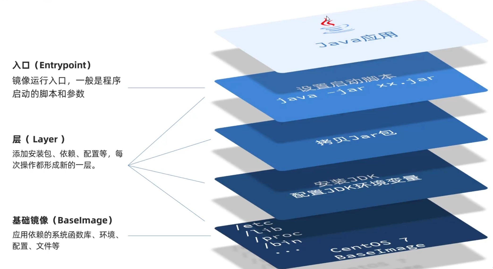
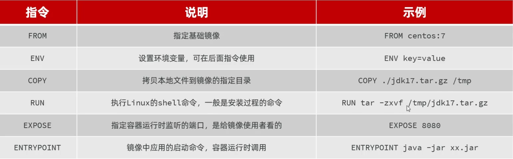
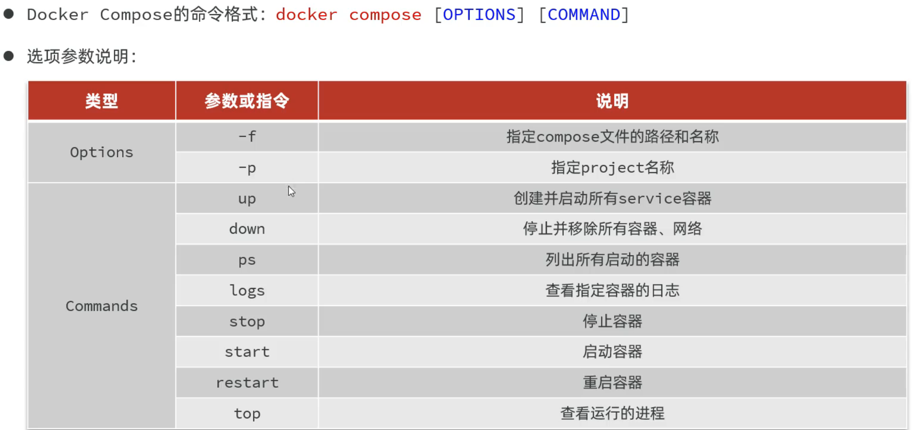

# 部署：

## 部署流程：

1. 一般项目都部署在Linux服务器上，需要在Linux上安装和配置需要的软件和环境，例如（Mysql、java、nginx这些软件的版本也要和开发的时候相同），然后使用远程连接到Linux上的Mysql数据库搭建数据库，接着将打包好的项目.jar文件传入Linux，最后使用指令运行这个项目。**以下是详细流程：**

1. **准备环境**  

   - 安装与开发一致版本的 JDK、MySQL、Nginx 等依赖。

2. **配置数据库**  

   - 在 Linux 上启动 MySQL，创建数据库和用户；  
   - 导入表结构和初始数据。

3. **上传项目**  

   - 将打包好的 `.jar` 文件传到服务器。

4. **配置应用**  

   - 准备生产环境配置文件（如 `application-prod.yml`），设置数据库连接等参数。

5. **启动项目**               

   -  后台运行：  

     ```bash
     nohup java -jar app.jar &> app.log &
     ```

6. **配置反向代理（可选）**  

   - 用 Nginx 代理 80/443 端口到 Java 应用端口（如 8080）。

7. **验证与维护**  

   - 检查日志、测试接口是否正常；  
   - 开放防火墙端口，确保服务可访问。

> 如需更高效率，后续可考虑 Docker 容器化或 CI/CD 自动部署。


# Docker：

## 简介：



## 命令解读：



## 常见命令：



## 数据卷：

- **what：**在Docker创建的容器中是无法之间操作容器内的文件的，就需要通过在Linux中创建数据卷来绑定容器中的文件夹，来实行对容器内文件的操作（例如nginx部署、修改配置文件）。
- **使用：**在创建容器的时候就可以通过-v来绑定需要创建的数据卷。
- **命令：**



## 本地目录挂载（比数据卷更常用）：



## 网络：



## 镜像结构：



## Dockerfile构建镜像：



- **例子：**构建Dockerfile文件

```PowerShell
# 使用 CentOS 7 作为基础镜像
FROM centos:7

# 添加 JDK 到镜像中
COPY jdk17.tar.gz /usr/local/
RUN tar -xzf /usr/local/jdk17.tar.gz -C /usr/local/ &&  rm /usr/local/jdk17.tar.gz

# 设置环境变量
ENV JAVA_HOME=/usr/local/jdk-17.0.10
ENV PATH=$JAVA_HOME/bin:$PATH

# 创建应用目录
RUN mkdir -p /app
WORKDIR /app

# 复制应用 JAR 文件到容器
COPY app.jar app.jar

# 暴露端口
EXPOSE 8080

# 运行命令
ENTRYPOINT ["java","-Djava.security.egd=file:/dev/./urandom","-jar","/app/app.jar"]
```

- 构建镜像
- -t ：是给镜像起名，格式依然是repository:tag的格式，不指定tag时，默认为latest
- .  ：是指定Dockerfile所在目录，如果就在当前目录，则指定为"."

```powershell
docker build -t 镜像名 .
```

## DockerCompose快速部署：

- 如果有多个容器需要部署时，有一个先后顺序，如果一个一个部署会十分麻烦，所以可以使用docker-compose.yml文件来快速一键部署。
- 步骤:
  1. 准备资源(tlias.sql，服务端的jdk17、jar包、Dockerfile，前端项目打包文件、nginx.conf)
  2.准备docker-compose.yml配置文件
  3.基于DockerCompose快速构建项目

- **命令：**



- **compose例子：**

```YAML
services:
  mysql:
    image: mysql:8
    container_name: mysql
    ports:
      - "3307:3306"
    environment:
      TZ: Asia/Shanghai
      MYSQL_ROOT_PASSWORD: 123
    volumes: //本地目录挂载
      - "/usr/local/app/mysql/conf:/etc/mysql/conf.d" //配置文件
      - "/usr/local/app/mysql/data:/var/lib/mysql" //数据库
      - "/usr/local/app/mysql/init:/docker-entrypoint-initdb.d" //.sql文件
    networks:
      - tlias-net
  tlias:
    build: 
      context: .
      dockerfile: Dockerfile
    container_name: tlias-server
    ports:
      - "8080:8080"
    networks:
      - tlias-net
    depends_on:
      - mysql
  nginx:
    image: nginx:1.20.2
    container_name: nginx
    ports:
      - "80:80"
    volumes:
      - "/usr/local/app/nginx/conf/nginx.conf:/etc/nginx/nginx.conf" //nginx配置
      - "/usr/local/app/nginx/html:/usr/share/nginx/html"  //前端文件
    depends_on:
      - tlias
    networks:
      - tlias-net
networks:
  tlias-net:
    name: itheima
```
